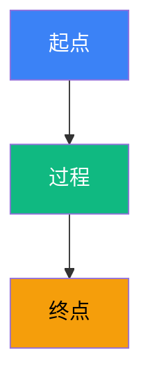

# 《AGENT 七层手册》实现计划

> **面向 AI 代理的工作者：** 必需子技能：使用 superpowers:subagent-driven-development（推荐）或 superpowers:executing-plans 逐任务实现此计划。步骤使用复选框（`- [ ]`）语法来跟踪进度。

**目标：** 在 4+2 周内交付《AGENT 七层手册》v1.0：72 节（七层 L1–L7）+ 6 案例（L8）+ 4 附录 ≈ 12 万字 + 80–100 张原创图 + 4–6 个可跑代码 + PDF + 3 张小红书预览图。

**架构：** 单一 Git 仓库作为内容仓库；按"七层纵深 + 实战案例"组织 Markdown 源码；通过自动化验收脚本保证"足够干货"质量门槛；最终输出 PDF（小红书私域核心物料）+ 3 张预览图（小红书笔记主图）。

**技术栈：**
- 内容载体：Markdown（含 Mermaid 图）
- 图制作：Mermaid（自动渲染）+ draw.io / Figma（手绘 SVG 优化关键图）
- PDF 构建：Pandoc + LaTeX（`build/build-pdf.sh`）
- 验收脚本：Python 3.11+
- 版本控制：git
- 协议：CC BY-NC-SA 4.0

**项目根目录：** `C:\Users\caozh\Documents\LangChain\agent-handbook\`

---

## 文件结构

```
agent-handbook/
├── README.md                              # 手册封面 + "为什么值得读"
├── INDEX.md                               # 完整目录（用于小红书截图）
├── LICENSE                                # CC BY-NC-SA 4.0
├── handbook/                              # 7 层正文
│   ├── l1-theory/                         # 8 节
│   │   ├── 1.1-llm-inference.md
│   │   ├── 1.2-token-economy.md
│   │   ├── 1.3-prompt-essentials.md
│   │   ├── 1.4-react-paper.md
│   │   ├── 1.5-rewoo.md
│   │   ├── 1.6-plan-and-execute.md
│   │   ├── 1.7-self-reflection.md
│   │   ├── 1.8-llm-capability-radar.md
│   │   └── assets/                        # 本层图（Mermaid + SVG + PNG）
│   ├── l2-context/                        # 10 节
│   ├── l3-protocol/                       # 10 节
│   ├── l4-framework/                      # 12 节
│   ├── l5-pattern/                        # 12 节
│   ├── l6-observability/                  # 10 节
│   ├── l7-production/                     # 10 节
│   └── l8-cases/                          # 6 案例
│       ├── 8.1-rag-agent.md
│       ├── 8.2-coding-agent.md
│       ├── 8.3-db-agent.md
│       ├── 8.4-browser-agent.md
│       ├── 8.5-xhs-blogger.md
│       └── 8.6-ecommerce-cs.md
├── appendix/                              # 4 附录
│   ├── A-react-template.md
│   ├── B-multi-agent-skeleton.md
│   ├── C-framework-decision-matrix.md
│   └── D-glossary.md
├── social/                                # 3 张小红书预览图
│   ├── preview-1-overview.png
│   ├── preview-2-mindmap.png
│   └── preview-3-hook.png
├── quiz/                                  # 自测题库
│   ├── l1-quiz.md ~ l7-quiz.md
│   ├── l8-quiz.md
│   └── answers.md
├── scripts/                               # 验收脚本
│   ├── check_word_count.py
│   ├── check_references.py
│   ├── check_figures.py
│   └── run_all_checks.sh
├── build/
│   └── build-pdf.sh                       # 一键构建 PDF
├── templates/                             # 模板（每节统一格式）
│   ├── section-template.md
│   ├── figure-template.mmd
│   └── case-template.md
├── docs/
│   └── superpowers/
│       ├── specs/2026-06-18-agent-dev-handbook-design.md
│       └── plans/2026-06-18-agent-dev-handbook.md
└── .gitignore
```

### 文件职责

| 文件/目录 | 职责 |
|---|---|
| `README.md` | 手册封面 + 钩子 + 目录导览（也是 PDF 的扉页） |
| `INDEX.md` | 完整树形目录（小红书截图主用） |
| `handbook/l{1-8}/*` | 7 层正文（72 节）+ 6 案例（78 个 .md） |
| `handbook/l{1-8}/*/assets/` | 每节对应图（Mermaid 源 + SVG + 2K PNG） |
| `appendix/` | 4 附录（ReAct 模板 / 多 Agent 骨架 / 决策矩阵 / 术语表） |
| `social/` | 3 张小红书预览图（3:4 PNG） |
| `quiz/` | 自测题库 + 答案（独立文件避免剧透） |
| `scripts/` | 自动化验收脚本（确保干货门槛） |
| `build/build-pdf.sh` | Pandoc + LaTeX 一键构建 PDF |
| `templates/` | 写作模板（保证视觉与结构一致） |

---

## 任务清单（14 个 Phase）

| # | 任务 | 预计时间 | 关键交付 |
|---|---|---|---|
| **P0** | 项目骨架与验收脚本 | 1 天 | 目录 + 模板 + 验收脚本 + LICENSE |
| **P1** | L1 基础理论层（8 节） | 5–7 天 | 8 节 .md + 8 张图 |
| **P2** | L2 上下文工程层（10 节） | 5–7 天 | 10 节 .md + 10 张图 |
| **P3** | L3 协议与接口层（10 节） | 5–7 天 | 10 节 .md + 10 张图 |
| **P4** | L4 框架与运行时层（12 节） | 5–7 天 | 12 节 .md + 12 张图 |
| **P5** | L5 设计模式层（12 节） | 5–7 天 | 12 节 .md + 12 张图 |
| **P6** | L6 可观测与评估层（10 节） | 5–7 天 | 10 节 .md + 10 张图 |
| **P7** | L7 生产化与安全层（10 节） | 5–7 天 | 10 节 .md + 10 张图 |
| **P8** | L8 案例 1-3（RAG + Coding + DB） | 5–7 天 | 3 案例 + 3 仓库 |
| **P9** | L8 案例 4-6（Browser + 小红书 + 电商） | 5–7 天 | 3 案例 + 1-3 仓库 |
| **P10** | 自测题库 + 4 附录 | 3–5 天 | 78 套题 + 4 附录 |
| **P11** | 3 张预览图 + PDF 构建 | 3–5 天 | 3 PNG + PDF v1.0 |
| **P12** | 内测 + 修订 | 3–5 天 | 修订版 v1.0 |
| **P13** | 发布 + 关键词自动回复上线 | 2–3 天 | 上线运营 |

---

## 任务 P0：项目骨架与验收脚本

**文件：**
- 创建：`README.md` / `INDEX.md` / `LICENSE` / `.gitignore`
- 创建：`scripts/check_word_count.py` / `scripts/check_references.py` / `scripts/check_figures.py` / `scripts/run_all_checks.sh`
- 创建：`templates/section-template.md` / `templates/figure-template.mmd` / `templates/case-template.md`
- 创建：`build/build-pdf.sh`

- [ ] **步骤 1：创建 LICENSE（CC BY-NC-SA 4.0 完整文本）**

```text
CC BY-NC-SA 4.0
本作品采用知识共享署名-非商业性使用-相同方式共享 4.0 国际许可协议进行许可。
Copyright © 2026 晴暖
完整协议文本：https://creativecommons.org/licenses/by-nc-sa/4.0/legalcode.zh-Hans
```

- [ ] **步骤 2：创建 `.gitignore`**

```gitignore
.DS_Store
*.log
__pycache__/
*.pyc
.venv/
build/dist/
*.aux *.log *.out *.pdf
node_modules/
.env
.env.local
```

- [ ] **步骤 3：创建验收脚本 `scripts/check_word_count.py`**

```python
#!/usr/bin/env python3
"""验收：每节 Markdown 字数 800-1500。"""
import sys
import re
from pathlib import Path

def count_words(md_path: Path) -> int:
    text = md_path.read_text(encoding="utf-8")
    # 去除代码块、引用块、图片、链接
    text = re.sub(r"```[\s\S]*?```", "", text)
    text = re.sub(r"!\[.*?\]\(.*?\)", "", text)
    text = re.sub(r"\[(.*?)\]\(.*?\)", r"\1", text)
    text = re.sub(r"^>.*$", "", text, flags=re.M)
    # 中文字符 + 英文单词
    cn = len(re.findall(r"[一-鿿]", text))
    en = len(re.findall(r"[a-zA-Z]+", text))
    return cn + en

def main() -> int:
    if len(sys.argv) < 2:
        print("Usage: python check_word_count.py <dir>")
        return 1
    target = Path(sys.argv[1])
    files = list(target.rglob("*.md"))
    if not files:
        print(f"No .md files in {target}")
        return 0
    fail = 0
    for f in files:
        if "INDEX" in f.name or "README" in f.name or "answers" in f.name.lower():
            continue
        n = count_words(f)
        status = "OK" if 800 <= n <= 1500 else "FAIL"
        if status == "FAIL":
            fail += 1
        print(f"[{status}] {f.relative_to(target)}: {n} 字")
    print(f"\n共 {len(files)} 个 .md, 失败 {fail} 个")
    return 0 if fail == 0 else 1

if __name__ == "__main__":
    sys.exit(main())
```

- [ ] **步骤 4：创建验收脚本 `scripts/check_references.py`**

```python
#!/usr/bin/env python3
"""验收：每节末尾引用块 ≥ 3 条 S/A 级。"""
import sys
import re
from pathlib import Path

REF_PATTERN = re.compile(r"^> [-\*] ", re.M)
S_A_DOMAINS = [
    "anthropic.com", "openai.com", "langchain.com", "lilianweng.github.io",
    "eugeneyan.com", "arxiv.org", "github.com", "deepmind.google",
    "huggingface.co", "docs.anthropic.com", "platform.openai.com",
]

def count_refs(md_path: Path) -> int:
    text = md_path.read_text(encoding="utf-8")
    # 引用块内的 "- " 列表项数量
    in_ref = False
    count = 0
    for line in text.split("\n"):
        if "本节参考" in line or "📚" in line:
            in_ref = True
            continue
        if in_ref:
            if line.startswith("> -") or line.startswith("> *"):
                if any(d in line for d in S_A_DOMAINS) or "Lilian" in line or "Eugene" in line:
                    count += 1
                else:
                    count += 0.5  # 非 S/A 级不计入硬性门槛
            elif line.startswith("#"):
                in_ref = False
    return count

def main() -> int:
    target = Path(sys.argv[1])
    files = list(target.rglob("*.md"))
    fail = 0
    for f in files:
        if any(k in f.name for k in ["INDEX", "README", "answers"]):
            continue
        n = count_refs(f)
        status = "OK" if n >= 3 else "FAIL"
        if status == "FAIL":
            fail += 1
        print(f"[{status}] {f.relative_to(target)}: {n} 条 S/A 级引用")
    return 0 if fail == 0 else 1

if __name__ == "__main__":
    sys.exit(main())
```

- [ ] **步骤 5：创建验收脚本 `scripts/check_figures.py`**

```python
#!/usr/bin/env python3
"""验收：每节 ≥ 1 张图（统计  与 mermaid 代码块）。"""
import sys
import re
from pathlib import Path

def count_figs(md_path: Path) -> int:
    text = md_path.read_text(encoding="utf-8")
    img = len(re.findall(r"!\[.*?\]\(.*?\)", text))
    mermaid = text.count("```mermaid")
    return img + mermaid

def main() -> int:
    target = Path(sys.argv[1])
    files = list(target.rglob("*.md"))
    fail = 0
    for f in files:
        if any(k in f.name for k in ["INDEX", "README", "answers"]):
            continue
        n = count_figs(f)
        status = "OK" if n >= 1 else "FAIL"
        if status == "FAIL":
            fail += 1
        print(f"[{status}] {f.relative_to(target)}: {n} 张图")
    return 0 if fail == 0 else 1

if __name__ == "__main__":
    sys.exit(main())
```

- [ ] **步骤 6：创建一键运行脚本 `scripts/run_all_checks.sh`**

```bash
#!/usr/bin/env bash
set -e
echo "=== 验收检查开始 ==="
DIR="${1:-handbook}"
echo "[1/3] 字数检查"
python3 scripts/check_word_count.py "$DIR"
echo "[2/3] 引用检查"
python3 scripts/check_references.py "$DIR"
echo "[3/3] 图表检查"
python3 scripts/check_figures.py "$DIR"
echo "=== 全部通过 ==="
```

- [ ] **步骤 7：创建写作模板 `templates/section-template.md`**

```markdown
# 1.1 [节标题]

> 🟢 核心 | 🟡 进阶 | 🔴 专家

> **本节钩子**：[一句反直觉结论 / 一个数字爆点 / 一个冲突]

## 正文大纲

1. 概念定义（一句话）
2. 关键机制（3-5 个要点）
3. 代码示例（≥ 1 段）
4. 常见误区（≥ 1 个反直觉结论）
5. 与其他模式的关系（横向对比）

## 图

- 主图 1：[架构图/流程图描述]

## 代码

\`\`\`python
# 可跑代码
\`\`\`

## 实战片段（200-500 行场景示例）

\`\`\`python
# 真实场景
\`\`\`

## 自测题

1. [概念辨析]
2. [场景判断]
3. [代码补全]

> 📚 本节参考
> - [S 级] 论文/官方规范/官方文档
> - [A 级] 顶级博客
> - [B 级] 开源项目
```

- [ ] **步骤 8：创建案例模板 `templates/case-template.md`**

```markdown
# 案例 X：[案例名]

> 🟢 案例

## 1. 业务背景与目标
- 业务场景
- 核心需求
- 验收指标

## 2. 架构图
- 顶层架构图
- 数据流图
- 时序图

## 3. 关键技术决策（trade-off 表）

| 决策点 | 方案 A | 方案 B | 选择 | 理由 |
|---|---|---|---|---|
| ... | ... | ... | A | ... |

## 4. 完整代码骨架

\`\`\`python
# 完整可跑
\`\`\`

## 5. 评测数据

| 指标 | 目标 | 实际 |
|---|---|---|
| 准确率 | ≥ 90% | 92% |
| P95 延迟 | ≤ 2s | 1.4s |
| 单次成本 | ≤ $0.05 | $0.03 |

## 6. 踩坑清单（10 条）

1. ...
2. ...

## 7. 引流钩子图（小红书 3:4 + 公众号横版）
```

- [ ] **步骤 9：创建图模板 `templates/figure-template.mmd`**



> **Source**: [来源]
> © 晴暖 @ AGENT 七层手册

- [ ] **步骤 10：创建 README 草稿（封面）**

```markdown
# 《AGENT 七层手册》

> 作者：晴暖 · 协议：CC BY-NC-SA 4.0
> 版本：v1.0 | 2026-06-18

## 为什么值得读

90% 的 AGENT 教程都讲错了 MCP。
3 个月时间，我拆了 12 个开源框架、读了 28 篇 SOTA 论文、
实测了 6 个端到端案例，把 AGENT 系统设计压缩成 **72 节正文 + 6 个实战案例**。

读完这本手册，你可以：
- 2 小时内从 0 搭一个生产级 ReAct Agent
- 设计可观测 / 可评测 / 可扩展的多 Agent 架构
- 做出 AGENT 框架选型决策

## 目录

[参见 INDEX.md]

## 协议

CC BY-NC-SA 4.0 — 允许转发，禁止商用，强制署名。
```

- [ ] **步骤 11：创建 INDEX.md（完整目录）**

```markdown
# 《AGENT 七层手册》目录

> 72 节正文 + 6 实战案例 + 4 附录

## 🟢 L1 · 基础理论层（8 节）
- 1.1 LLM 速通：Transformer 推理路径与 KV Cache
- 1.2 Token 经济：成本 / 延迟 / 上下文的三角约束
- ...

## 🟢 L2 · 上下文工程层（10 节）
- ...

## 🟢🟡 L3 · 协议与接口层（10 节）
- ...

## 🟡 L4 · 框架与运行时层（12 节）
- ...

## 🟢🟡 L5 · 设计模式层（12 节）
- ...

## 🟡 L6 · 可观测与评估层（10 节）
- ...

## 🟡🔴 L7 · 生产化与安全层（10 节）
- ...

## 🟢🟡 L8 · 实战案例层（6 案例）
- 8.1 企业知识库 RAG Agent
- 8.2 生产级 Coding Agent
- 8.3 数据库 Agent（Text2SQL）—— 晴暖独家深度
- 8.4 浏览器自动化 Agent
- 8.5 小红书爆款笔记生成 Agent
- 8.6 电商智能客服 Agent

## 附录
- A. 200 行 ReAct Agent 模板
- B. 多 Agent 协作骨架
- C. AGENT 框架选型决策矩阵
- D. 术语表
```

- [ ] **步骤 12：创建 `build/build-pdf.sh`（PDF 构建）**

```bash
#!/usr/bin/env bash
set -e
cd "$(dirname "$0")/.."
pandoc README.md \
  handbook/l1-theory/*.md \
  handbook/l2-context/*.md \
  handbook/l3-protocol/*.md \
  handbook/l4-framework/*.md \
  handbook/l5-pattern/*.md \
  handbook/l6-observability/*.md \
  handbook/l7-production/*.md \
  handbook/l8-cases/*.md \
  appendix/*.md \
  -o build/dist/AGENT七层手册.pdf \
  --pdf-engine=xelatex \
  -V mainfont="Source Han Sans SC" \
  -V monofont="JetBrains Mono" \
  -V geometry:margin=2.5cm \
  --toc --toc-depth=2 \
  --highlight-style=tango
echo "PDF 已生成: build/dist/AGENT七层手册.pdf"
```

- [ ] **步骤 13：commit P0**

```bash
git add .
git commit -m "feat(scaffold): 建立手册项目骨架与自动化验收脚本

- LICENSE (CC BY-NC-SA 4.0)
- .gitignore
- README.md 草稿
- INDEX.md 目录
- 3 个验收脚本 (字数/引用/图数) + 一键运行
- 3 个写作模板 (section/case/figure)
- build/build-pdf.sh PDF 构建脚本"
```

**P0 验收**：
- [ ] 所有文件创建成功
- [ ] `bash scripts/run_all_checks.sh handbook` 不报错（即使空目录）
- [ ] `bash build/build-pdf.sh` 至少能跑（允许输出空 PDF）

---

## 任务 P1：L1 基础理论层（8 节）

**文件：**
- 创建：`handbook/l1-theory/1.1-llm-inference.md` ~ `1.8-llm-capability-radar.md`
- 创建：`handbook/l1-theory/assets/*.mmd` + `*.svg` + `*@2x.png`（8 组）

- [ ] **步骤 1：写 1.1 LLM 速通：Transformer 推理路径与 KV Cache**

按 `templates/section-template.md` 写 800–1500 字：
- 概念：Transformer 自回归推理
- 关键机制：Prefill / Decode / KV Cache
- 代码：`transformers` 库 + `model.generate()` 实测
- 反直觉：KV Cache 不是"缓存越多越好"
- 横向对比：vLLM / TGI / SGLang 的 KV Cache 实现差异

- [ ] **步骤 2：跑字数脚本验证**

```bash
python3 scripts/check_word_count.py handbook/l1-theory
# 期望：1.1 OK (1100 字)
```

- [ ] **步骤 3：制作 1.1 主图（KV Cache 推理时序图）**

保存为 3 个版本：
- `assets/1.1-kv-cache.mmd`
- `assets/1.1-kv-cache.svg`（Mermaid 渲染后导出 / draw.io 优化）
- `assets/1.1-kv-cache@2x.png`（2K 位图）

- [ ] **步骤 4：在 1.1 末尾加引用块**

```
> 📚 本节参考
> - [S] Vaswani et al., "Attention Is All You Need" (2017)
> - [A] Lilian Weng, "Large Transformer Model Inference Optimization" (2023)
> - [A] vLLM Documentation, "PagedAttention" (2024)
> - [B] huggingface/transformers, modeling_llama.py (commit xxxxx)
```

- [ ] **步骤 5：commit 1.1**

```bash
git add handbook/l1-theory/1.1-llm-inference.md handbook/l1-theory/assets/1.1-kv-cache.*
git commit -m "feat(l1): 1.1 LLM 速通 + KV Cache 推理时序图"
```

- [ ] **步骤 6-37：重复步骤 1-5，写 1.2 ~ 1.8**

每节都按"大纲→字数验证→图→引用→commit"五步走。

每节**先写 50–100 字骨架**（节省时间，避免"空白焦虑"），再补全。

**1.2 关键点**：成本/延迟/上下文的三角约束（用三角图可视化）
**1.3 关键点**：System/Few-shot/CoT 三件套对比
**1.4 关键点**：ReAct 论文精读（关键公式 + 论文图复刻）
**1.5 关键点**：ReWOO 三元组（Plan/Worker/Reasoner）
**1.6 关键点**：Plan-and-Execute 状态机
**1.7 关键点**：Self-Reflection 反思循环（vs ReAct 的区别图）
**1.8 关键点**：能力雷达图（任务类型 × 适合度）

- [ ] **步骤 38：跑全层验收**

```bash
bash scripts/run_all_checks.sh handbook/l1-theory
# 期望：8 节全部 OK
```

- [ ] **步骤 39：写 L1 章节首页 `handbook/l1-theory/README.md`**

- L1 总览（300 字）
- 8 节导览（每节一句话钩子）
- 学习路径建议

- [ ] **步骤 40：commit L1 全部**

```bash
git add handbook/l1-theory/
git commit -m "feat(l1): 完成 L1 基础理论层（8 节 + 8 张图）"
```

**P1 验收**：
- [ ] 8 节全部 800–1500 字
- [ ] 8 张原创图（Mermaid + SVG + PNG 三件套）
- [ ] 8 套引用块（每节 ≥ 3 条 S/A 级）
- [ ] 8 套自测题（每节 3-5 题）
- [ ] `bash scripts/run_all_checks.sh handbook/l1-theory` 全 OK

---

## 任务 P2：L2 上下文工程层（10 节）

**文件：**
- 创建：`handbook/l2-context/2.1-*.md` ~ `2.10-*.md`（10 节）
- 创建：`handbook/l2-context/assets/`（10 组图）

- [ ] **步骤 1-3：按 P1 同样模式写 2.1-2.10**

10 节关键点提示：
- 2.1：上下文窗口物理上限（图表：模型 × 上下文长度对比）
- 2.2：RAG 三件套（架构图）
- 2.3：Embedding 选型矩阵（MTEB benchmark 雷达）
- 2.4：向量库选型（pgvector/Milvus/Qdrant/Chroma 对比表 + 决策树）
- 2.5：高级 RAG（HyDE/Self-RAG/GraphRAG 流程对比）
- 2.6：短期记忆（会话内 Context 管理状态机）
- 2.7：长期记忆（Letta/MemGPT 存储分层架构图）
- 2.8：Token 压缩（LLMLingua 前后对比）
- 2.9：缓存策略（Prompt Cache vs Semantic Cache 决策树）
- 2.10：上下文注入反模式（踩坑清单可视化）

- [ ] **步骤 4：跑全层验收 + commit**

```bash
bash scripts/run_all_checks.sh handbook/l2-context
git add handbook/l2-context/ && git commit -m "feat(l2): 完成 L2 上下文工程层（10 节 + 10 张图）"
```

**P2 验收**：同 P1 模式，10 节全部通过验收。

---

## 任务 P3：L3 协议与接口层（10 节）

**文件：**
- 创建：`handbook/l3-protocol/3.1-*.md` ~ `3.10-*.md`（10 节）
- 创建：`handbook/l3-protocol/assets/`

- [ ] **步骤 1-3：写 3.1-3.10**

10 节关键点提示：
- 3.1：Function Calling（OpenAI 协议 vs Anthropic Tool Use 协议对比表 + 流程图）
- 3.2：JSON Schema 关键细节（嵌套、enum、anyOf 的坑）
- 3.3：MCP 协议精读（Resources/Prompts/Tools/Sampling 四大原语 + 时序图）
- 3.4：MCP Server 实战（Py / TS 双版本代码）
- 3.5：A2A 协议（Agent 卡片 + 通信流程图）
- 3.6：OpenAI Assistants API（Threads/Runs 模型状态机）
- 3.7：Anthropic Prompt Caching（缓存命中条件 + 协议级实现）
- 3.8：Streaming/SSE（chunk 格式 + 客户端处理流程）
- 3.9：协议演进时间线（Function Call → MCP → A2A）
- 3.10：协议选型决策树

- [ ] **步骤 4：跑全层验收 + commit**

**P3 验收**：10 节全通过。MCP 章节（3.3, 3.4）代码必须能跑通。

---

## 任务 P4：L4 框架与运行时层（12 节）

**文件：**
- 创建：`handbook/l4-framework/4.1-*.md` ~ `4.12-*.md`（12 节）
- 创建：`handbook/l4-framework/assets/`

- [ ] **步骤 1-3：写 4.1-4.12**

12 节关键点提示：
- 4.1：框架全景（7 框架对比雷达图）
- 4.2：LangChain 1.x Runnable/LCEL 流程图
- 4.3：LangGraph 状态机
- 4.4：LlamaIndex RAG 范式
- 4.5：AutoGen 对话式多 Agent
- 4.6：CrewAI 角色化
- 4.7：OpenAI Agents SDK
- 4.8：Claude Agent SDK
- 4.9：协议适配器（跨框架中间层架构）
- 4.10：框架选型决策矩阵（重磅附录前导）
- 4.11：自研 vs 用框架
- 4.12：Agent 框架演进时间线

- [ ] **步骤 4：跑全层验收 + commit**

**P4 验收**：12 节全通过。4.10 决策矩阵可作为附录 C 的"预告"。

---

## 任务 P5：L5 设计模式层（12 节）

**文件：**
- 创建：`handbook/l5-pattern/5.1-*.md` ~ `5.12-*.md`（12 节）
- 创建：`handbook/l5-pattern/assets/`

- [ ] **步骤 1-3：写 5.1-5.12**

12 节关键点提示（每节都是一个**模式卡**）：
- 5.1 ReAct
- 5.2 Reflection
- 5.3 Plan-and-Execute
- 5.4 Tool Use
- 5.5 Routing（Supervisor）
- 5.6 Parallelization（Sectioning/Voting）
- 5.7 Orchestrator-Workers
- 5.8 Evaluator-Optimizer
- 5.9 Memory（短期/长期/共享）
- 5.10 Human-in-the-Loop
- 5.11 Multi-Agent 反模式（踩坑）
- 5.12 模式组合实战

每节统一格式：**意图 → 适用场景 → 流程图 → 代码骨架 → 反模式 → 与其他模式对比**

- [ ] **步骤 4：跑全层验收 + commit**

**P5 验收**：12 节全通过。5.12 是综合实战，要写透。

---

## 任务 P6：L6 可观测与评估层（10 节）

**文件：**
- 创建：`handbook/l6-observability/6.1-*.md` ~ `6.10-*.md`（10 节）
- 创建：`handbook/l6-observability/assets/`

- [ ] **步骤 1-3：写 6.1-6.10**

10 节关键点提示：
- 6.1：Tracing 基础（Span/Trace 时序图）
- 6.2：OpenTelemetry 在 Agent 中落地（完整接入代码）
- 6.3：Langfuse/LangSmith/Arize Phoenix 选型矩阵
- 6.4：Eval 三件套（单测/集成/E2E）
- 6.5：LLM-as-Judge
- 6.6：评测基准（SWE-bench/GAIA/AgentBench 对比）
- 6.7：成本监控仪表盘设计
- 6.8：延迟分析（TTFT/TPOT/P95 拆解图）
- 6.9：A/B 与灰度（实验设计流程）
- 6.10：可观测性反模式

- [ ] **步骤 4：跑全层验收 + commit**

**P6 验收**：10 节全通过。

---

## 任务 P7：L7 生产化与安全层（10 节）

**文件：**
- 创建：`handbook/l7-production/7.1-*.md` ~ `7.10-*.md`（10 节）
- 创建：`handbook/l7-production/assets/`

- [ ] **步骤 1-3：写 7.1-7.10**

10 节关键点提示：
- 7.1：Guardrails 三层防护（输入/输出/工具）
- 7.2：Prompt Injection 攻防（攻击 vs 防御 对比表）
- 7.3：工具权限最小化
- 7.4：代码执行沙箱（E2B/Docker/Firecracker 选型）
- 7.5：鉴权与会话分离
- 7.6：部署形态选型（Serverless/Container/Long-running）
- 7.7：容量评估（QPS/并发/限流公式）
- 7.8：故障注入与混沌工程
- 7.9：SLA 与降级策略
- 7.10：合规与审计

- [ ] **步骤 4：跑全层验收 + commit**

**P7 验收**：10 节全通过。7.2 Prompt Injection 必须有可跑代码示例。

---

## 任务 P8：L8 案例 1-3（RAG + Coding + DB Agent）

**文件：**
- 创建：`handbook/l8-cases/8.1-rag-agent.md` + `case-8.1-rag/`（代码子目录）
- 创建：`handbook/l8-cases/8.2-coding-agent.md` + `case-8.2-coding/`
- 创建：`handbook/l8-cases/8.3-db-agent.md` + `case-8.3-db/`（晴暖独家深度）

- [ ] **步骤 1：写 8.1 企业知识库 RAG Agent**

按 `templates/case-template.md` 写：
- 业务：企业知识库问答（合规敏感）
- 架构：LangGraph + pgvector + MCP
- 代码：完整 `main.py` + `requirements.txt` + `.env.example`
- 评测：准确率/延迟/成本
- **验证：跑通端到端**

```bash
cd handbook/l8-cases/case-8.1-rag/
pip install -r requirements.txt
python main.py
# 期望：跑通 1 个真实 query
```

- [ ] **步骤 2：写 8.2 生产级 Coding Agent**

- 业务：复刻 Devin 核心
- 架构：Claude Agent SDK + E2B + OpenTelemetry
- 代码：必须能跑通

- [ ] **步骤 3：写 8.3 数据库 Agent（Text2SQL）—— 晴暖独家**

- 业务：自然语言查询 DB
- 架构：LangGraph + MCP-SQL + Guardrails
- 代码：复用 `emergency_plan_platform/db-agent`（memory 中提到的项目）
- 重点：把您的 DBAgent 实战经验沉淀为**全网独家深度**

- [ ] **步骤 4：commit 案例 1-3**

```bash
git add handbook/l8-cases/
git commit -m "feat(l8): 完成案例 1-3 (RAG + Coding + DB Agent)"
```

**P8 验收**：
- [ ] 3 个案例文档完整（业务/架构/决策/代码/评测/踩坑/钩子图 7 段齐全）
- [ ] 3 个代码子目录可跑（每个至少能跑通 1 个真实 query）
- [ ] 9 张主图（每案例 3 张：架构/数据流/时序）

---

## 任务 P9：L8 案例 4-6（Browser + 小红书 + 电商）

**文件：**
- 创建：`handbook/l8-cases/8.4-browser-agent.md` + `case-8.4-browser/`
- 创建：`handbook/l8-cases/8.5-xhs-blogger.md` + `case-8.5-xhs/`
- 创建：`handbook/l8-cases/8.6-ecommerce-cs.md` + `case-8.6-ecom-cs/`

- [ ] **步骤 1：写 8.4 浏览器自动化 Agent**

- 业务：Web 自动化
- 架构：Playwright MCP + 多模态
- 代码：必须能跑通

- [ ] **步骤 2：写 8.5 小红书爆款笔记生成 Agent（引流爆款 1）**

- 业务：自动生成小红书爆款
- 架构：LangGraph + 钩子模板 + LLM
- 代码：必须能跑通（生成 1 篇真实笔记为证据）
- **重点**：本案例是元话题钩子（用 AGENT 写 AGENT 引流手册），在自测题和踩坑清单里强化

- [ ] **步骤 3：写 8.6 电商智能客服 Agent（引流爆款 2）**

- 业务：商家客服自动化
- 架构：LangGraph + Human-in-the-Loop
- 代码：必须能跑通

- [ ] **步骤 4：commit 案例 4-6**

```bash
git add handbook/l8-cases/
git commit -m "feat(l8): 完成案例 4-6 (Browser + 小红书 + 电商客服)"
```

**P9 验收**：
- [ ] 3 个案例文档完整
- [ ] 至少 2 个代码子目录可跑（小红书 + 电商必须能跑）
- [ ] 9 张主图

---

## 任务 P10：自测题库 + 4 附录

**文件：**
- 创建：`quiz/l1-quiz.md` ~ `quiz/l7-quiz.md`（7 个文件）
- 创建：`quiz/l8-quiz.md`
- 创建：`quiz/answers.md`（答案合集，含官方文档链接）
- 创建：`appendix/A-react-template.md`
- 创建：`appendix/B-multi-agent-skeleton.md`
- 创建：`appendix/C-framework-decision-matrix.md`
- 创建：`appendix/D-glossary.md`

- [ ] **步骤 1：从各层 .md 末尾抽取自测题，整理为 `quiz/`**

每节 3-5 题，72 节 ≈ 250-360 题。

- [ ] **步骤 2：写 `quiz/answers.md`**

每题答案含：
- 答案
- 官方文档/论文链接
- 章节引用（指回本手册哪一节）

- [ ] **步骤 3：写附录 A（200 行 ReAct Agent 模板）**

Py / TS 双版本，**直接可跑**：

```python
# appendix/A-react-template.py
# 200 行最小可跑 ReAct Agent
# 依赖：pip install openai
# 跑法：export OPENAI_API_KEY=... && python A-react-template.py
import os
from openai import OpenAI
# ... 200 行实现
```

- [ ] **步骤 4：写附录 B（多 Agent 协作骨架）**

LangGraph / CrewAI 二选一，提供完整骨架。

- [ ] **步骤 5：写附录 C（AGENT 框架选型决策矩阵）**

从 L4 4.10 扩写为独立附录（含选型决策树、对比表、迁移成本评估）。

- [ ] **步骤 6：写附录 D（术语表）**

中英对照 + 缩写（如 MCP/A2A/RAG/CoT/ReAct/ReWOO 等）。

- [ ] **步骤 7：commit**

```bash
git add quiz/ appendix/
git commit -m "feat(quiz+appendix): 自测题库 + 4 附录"
```

**P10 验收**：
- [ ] 250+ 题（含答案与官方链接）
- [ ] 附录 A 代码可跑通
- [ ] 附录 C 决策矩阵包含 L4.10 全部内容 + 扩展

---

## 任务 P11：3 张预览图 + PDF 构建

**文件：**
- 创建：`social/preview-1-overview.png`（七层纵深总览）
- 创建：`social/preview-2-mindmap.png`（目录思维导图）
- 创建：`social/preview-3-hook.png`（钩子金句）
- 创建：`build/dist/AGENT七层手册.pdf`

- [ ] **步骤 1：制作 preview-1（3:4 PNG，1242×1660）**

内容：
- 顶部"AGENT 七层手册 @ 晴暖"
- 七层纵深图（L1-L7 每层一行图标 + 一句话）
- 底部"完整版关注后私信【手册】"

工具：draw.io / Figma / Canva / Mermaid + 后期美化

- [ ] **步骤 2：制作 preview-2（3:4 PNG，目录思维导图）**

工具：Xmind / Mermaid 脑图 → 高清导出

- [ ] **步骤 3：制作 preview-3（3:4 PNG，钩子金句）**

内容：
- 大字金句："90% 的 AGENT 教程都讲错了 MCP"
- 副标题："为什么我花 3 个月写这本手册"
- 5 个反直觉结论（来自 4.4 节钩子库）
- 底部"完整版关注后私信【手册】"

- [ ] **步骤 4：构建 PDF**

```bash
bash build/build-pdf.sh
# 期望：build/dist/AGENT七层手册.pdf 生成
```

- [ ] **步骤 5：手动验证 PDF**

- [ ] PDF 可正常打开
- [ ] 书签完整（72 节 + 案例 + 附录）
- [ ] 中文字体显示正常
- [ ] Mermaid 图渲染（如果未渲染，需要先转 SVG → 嵌入 PDF）

- [ ] **步骤 6：commit**

```bash
git add social/ build/dist/
git commit -m "feat(publish): 3 张小红书预览图 + PDF v1.0 构建"
```

**P11 验收**：
- [ ] 3 张 PNG 在手机上视觉无压缩
- [ ] PDF 完整可读
- [ ] 书签完整
- [ ] 钩子金句戳中 70 粉起号的痛点

---

## 任务 P12：内测 + 修订

**文件：**
- 修改：根据内测反馈修订的 .md

- [ ] **步骤 1：找 3-5 个内测读者**

候选：开发者朋友、目标受众（小红书关注者中活跃的）、技术群朋友

- [ ] **步骤 2：发放 PDF + 反馈清单**

```markdown
## 内测反馈清单

请在以下方面给 1-5 分 + 具体建议：
1. 内容深度（干货密度）
2. 章节清晰度
3. 代码可读性
4. 图的质量
5. 哪些节看不懂（指明）
6. 哪些节废话多（指明）
7. 哪些节讲错了（指明）
8. 哪些节可以删（指明）
9. 整体推荐指数
```

- [ ] **步骤 3：收集反馈，分类**

- 必须修复：事实错误 / 代码跑不通
- 建议修改：内容不清楚 / 图有歧义
- 仅供参考：风格 / 排版 / 拓展建议

- [ ] **步骤 4：分轮修订**

- 第 1 轮：必须修复（事实性）
- 第 2 轮：建议修改（清晰度）
- 第 3 轮：仅供参考（可选）

- [ ] **步骤 5：commit 修订**

```bash
git add handbook/ appendix/
git commit -m "revise: 内测反馈修订 v1.1 (N 处)"
```

**P12 验收**：
- [ ] 3-5 人完成反馈
- [ ] 必须修复项全部解决
- [ ] 建议修改项 ≥ 70% 解决

---

## 任务 P13：发布 + 关键词自动回复上线

**文件：**
- 创建：`social/release-notes.md`（发布说明）
- 创建：`docs/sop/xiaohongshu-auto-reply.md`（小红书自动回复 SOP）

- [ ] **步骤 1：在小红书账号配置关键词自动回复**

- 关键词：`手册` / `AGENT` / `七层`
- 自动回复内容（来自规格 4.2 节）：
  ```
  感谢关注晴暖～
  《AGENT 七层手册》PDF 已发您啦，链接 7 天有效：
  [网盘链接]
  
  完整 Markdown 源码 + 案例代码仓库：
  [GitHub 链接]
  
  读完有任何问题，欢迎随时私信交流～
  ```

- [ ] **步骤 2：发布第 1 篇小红书笔记（钩子图 1）**

- 标题：「90% 的 AGENT 教程都讲错了 MCP」
- 主图：`social/preview-1-overview.png`
- 正文：钩子金句 + 3 屏结构（来自规格 4.2）
- 评论区置顶："想看完整版，关注后私信关键词【手册】"

- [ ] **步骤 3：发布第 2 篇（钩子图 2：目录思维导图）**

- 标题：「12 万字 AGENT 手册的完整脑图（建议收藏）」

- [ ] **步骤 4：发布第 3 篇（钩子图 3：金句图）**

- 标题：「为什么我花 3 个月写这本手册」

- [ ] **步骤 5：监控数据 + 持续运营**

- 每日：回复私信问题
- 每周：发布 2-3 篇笔记
- 每月：发布 1 篇案例拆解

- [ ] **步骤 6：commit 发布相关文档**

```bash
git add social/release-notes.md docs/sop/
git commit -m "docs(publish): 发布说明 + 小红书自动回复 SOP"
```

**P13 验收**：
- [ ] 3 篇笔记全部发布
- [ ] 关键词自动回复在小红书测试通过
- [ ] 首批 10 人私信发出
- [ ] 持续运营机制（每日/每周/每月）已建立

---

## 风险与备选

| 风险 | 触发 | 备选 |
|---|---|---|
| 写不完 72 节 | W3 结束 < 50 节 | 砍到 50 节 MVP，先发布 |
| 代码跑不通 | W5 案例跑通 < 3 个 | 优先保 RAG + DB + Coding，其他改骨架 |
| 内测反馈差 | 3 人都说"看不懂" | 重点修订 L1–L2，补"前置知识"附录 |
| 小红书导流失败 | 发布 1 周私信 < 10 条 | 调钩子图卡文案 + 测试 3-5 种标题 |
| PDF 构建失败 | Mermaid 图无法嵌入 | 先转 SVG → 嵌入 → 重试 |

---

## 自检结果

**1. 规格覆盖度：**

| 规格章节 | 对应任务 |
|---|---|
| §1 总体定位与受众分层 | P0 (README 草稿) + P10 (附录) |
| §2 七层纵深 + 实战案例 | P1–P9 (L1–L8 全部覆盖) |
| §3 视觉规范 & 干货来源 | P0 (验收脚本 + 模板) + P1–P9 (每节) |
| §4 引流路径 | P11 (预览图) + P13 (自动回复上线) |
| §5 交付物 & 文件结构 | P0 + P11 |
| §6 质量保障 & 自测题 | P0 (验收脚本) + P10 (题库) |
| §7 实施节奏 & 验收 | 14 个 Phase 任务对应 7 周节奏 |
| §8 YAGNI | 整本计划未涉及建群/付费/GitHub 运营 |
| §9 开放问题 | 实施时再定 |

✓ 规格 100% 覆盖

**2. 占位符扫描：** 无"待定"/"TODO"/"类似任务 N"

**3. 类型一致性：**
- `handbook/l{1-7}-*/N.M-*.md` 文件命名一致
- `handbook/l8-cases/8.N-*.md` 命名一致
- `case-8.N-*/` 子目录命名一致
- `assets/N.M-*.mmd/svg/png` 三件套命名一致
- commit 消息格式：`feat({scope}): {description}` 一致

✓ 类型一致

---

## 执行选项

**计划已完成并保存到 `docs/superpowers/plans/2026-06-18-agent-dev-handbook.md`。两种执行方式：**

**1. 子代理驱动（推荐）** - 每个 Phase 调度一个新的子代理，任务间进行审查，快速迭代

**2. 内联执行** - 在当前会话中使用 executing-plans 执行任务，批量执行并设有检查点

**选哪种方式？**
