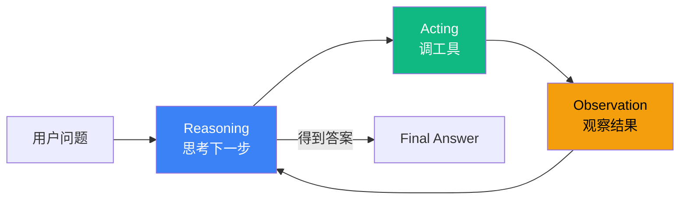
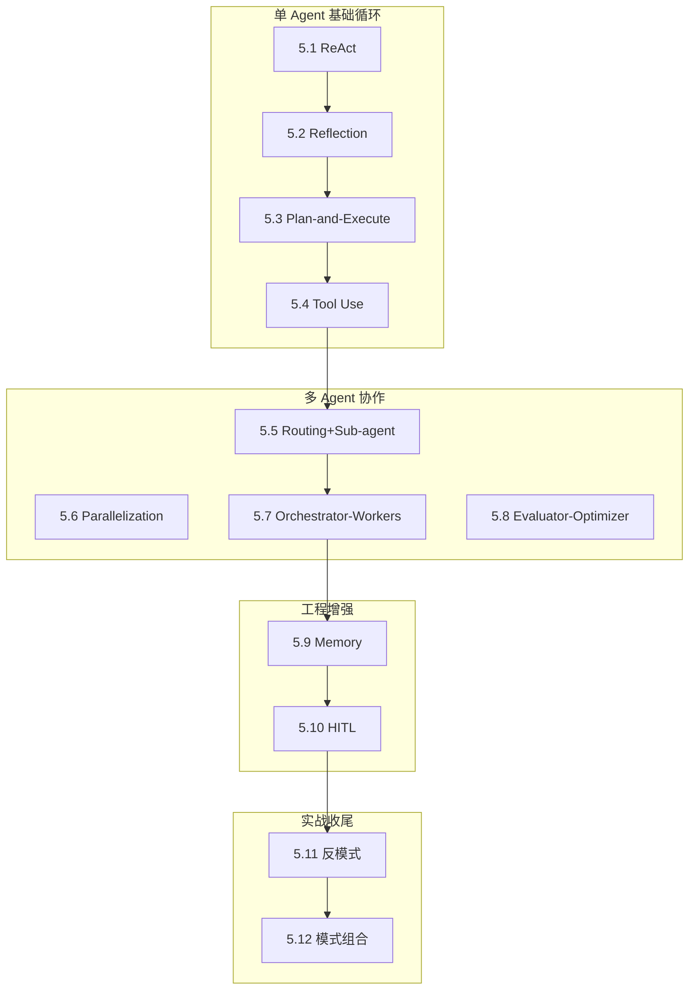

# L5 设计模式层 实现计划

> **面向 AI 代理的工作者：** 必需子技能：使用 superpowers:subagent-driven-development（推荐）或 superpowers:executing-plans 逐任务实现此计划。步骤使用复选框（`- [ ]`）语法来跟踪进度。

**目标：** 在 5-7 天内交付《AGENT 七层手册》L5 设计模式层 v1.0：12 节正文 + 1 个章节首页 ≈ 1.38 万字 + 14 张原创图 + 12 段代码骨架 + 全套自测题。

**架构：** 单一 Git 仓库 `C:\Users\caozh\Documents\LangChain\agent-handbook\`，按"七层纵深"组织 Markdown 源码；通过已有自动化验收脚本（`scripts/check_word_count.py` / `check_references.py` / `check_figures.py` / `run_all_checks.sh`）保证"足够干货"质量门槛；每节 1 个独立 commit，单文件粒度，避免并行冲突。

**技术栈：**
- 内容载体：Markdown（含 Mermaid 图）
- 验收脚本：Python 3.11+（L4 已就绪，本次复用）
- 版本控制：git（master 分支 + 3 批 worktree 隔离选项）
- 协议：CC BY-NC-SA 4.0

**父级规格：** `docs/superpowers/specs/2026-06-21-l5-design-patterns-design.md`

---

## 文件结构

```
handbook/l5-pattern/                          # L5 根目录（新建）
├── README.md                                  # L5 章节首页（12 节导览 + 学习路径 + 衔接）
├── 5.1-react-pattern.md                       # 12 节正文
├── 5.2-reflection-pattern.md
├── 5.3-plan-and-execute-pattern.md
├── 5.4-tool-use-pattern.md
├── 5.5-routing-subagent-pattern.md
├── 5.6-parallelization-pattern.md
├── 5.7-orchestrator-workers-pattern.md
├── 5.8-evaluator-optimizer-pattern.md
├── 5.9-memory-pattern.md
├── 5.10-human-in-the-loop-pattern.md
├── 5.11-multi-agent-anti-patterns.md
├── 5.12-pattern-composition.md
└── assets/                                    # 本层所有图（Mermaid 源 + SVG + PNG）
    └── (随各节 .md 同名命名)
```

| 文件 | 职责 | 字数预算 | 图数预算 |
|---|---|---|---|
| `5.1-react-pattern.md` | ReAct 模式定义 + ReAct 论文精读落地 | 1100 | 1 |
| `5.2-reflection-pattern.md` | Reflection 自批评迭代模式 | 900 | 1 |
| `5.3-plan-and-execute-pattern.md` | Plan-and-Execute 规划-执行分离模式 | 1000 | 1 |
| `5.4-tool-use-pattern.md` | Tool Use LLM 调外部工具模式 | 1100 | 1 |
| `5.5-routing-subagent-pattern.md` | Routing + Sub-agent 委派 | 1100 | 1 |
| `5.6-parallelization-pattern.md` | Parallelization 并行 + 投票 | 1000 | 1 |
| `5.7-orchestrator-workers-pattern.md` | Orchestrator-Workers 动态委派 | 1100 | 1 |
| `5.8-evaluator-optimizer-pattern.md` | Evaluator-Optimizer 外部裁判 | 1000 | 1 |
| `5.9-memory-pattern.md` | Memory 短期/长期/共享 | 1100 | 1 |
| `5.10-human-in-the-loop-pattern.md` | HITL 人工审批模式 | 1100 | 1 |
| `5.11-multi-agent-anti-patterns.md` | 8 大反模式血泪清单 | 1200 | 1 |
| `5.12-pattern-composition.md` | 模式组合实战 + 演化路径 | 1300 | 2 |
| `README.md` | L5 章节首页 | 800 | 1 |
| **合计** | | **~1.38 万字** | **14 张图** |

每节验收门槛（与 L4 一致）：
- 字数 800-1500 字
- 引用 ≥3 条 S/A 级
- 图 ≥1 张 mermaid
- 代码段 ≥1 段
- 反直觉钩子 ≥1 个
- 模式对比表 ≥1 个
- 框架映射表（4 框架 API 入口）

---

## 实施策略（女王大人选项）

本计划提供两种并行粒度，由执行者在任务开始前选：

### 策略 A：单文件串行（推荐用于本次）

- 每节 1 个独立 commit，共 12 个 .md commit
- 章节首页 1 个 commit
- 全层验收 1 个 commit
- **总计 14 个 commit**，每节 5-15 分钟
- 优点：节奏稳、冲突零、易审查
- 适合：人手 1-2 个、节奏可控

### 策略 B：3 批 × 4 节 + Worktree（规格原文建议）

- 批 1（worktree `l5-batch-1`）：5.1 → 5.2 → 5.3 → 5.4（单 Agent 基础）
- 批 2（worktree `l5-batch-2`）：5.5 → 5.6 → 5.7 → 5.8（多 Agent 协作）
- 批 3（worktree `l5-batch-3`）：5.9 → 5.10 → 5.11 → 5.12（工程增强 + 实战）
- 章节首页（在 master）：依赖 12 节全部合并后串行写
- **总计 13 个 commit**（批内可拆为 4 个 commit/批）
- 优点：节间引用一致性强，批间质量门控清晰
- 缺点：worktree 跨批合并复杂
- 适合：跨节引用需严格一致的场景

> **执行者选择**：默认采用 **策略 A 单文件串行**。如需切换策略 B，请提前与用户确认。

---

## 任务清单

### 任务 0：环境准备 + 验收基线

**文件：**
- 创建：`handbook/l5-pattern/.gitkeep`
- 创建：`handbook/l5-pattern/assets/.gitkeep`

- [ ] **步骤 1：创建 L5 目录**

```bash
cd "C:\Users\caozh\Documents\LangChain\agent-handbook"
mkdir -p handbook/l5-pattern/assets
touch handbook/l5-pattern/.gitkeep
touch handbook/l5-pattern/assets/.gitkeep
```

- [ ] **步骤 2：确认验收脚本就绪**

```bash
cd "C:\Users\caozh\Documents\LangChain\agent-handbook"
ls scripts/check_word_count.py scripts/check_references.py scripts/check_figures.py
```

预期：4 个脚本全部存在。

- [ ] **步骤 3：跑基线验收（确认当前 13 个 .md 通过）**

```bash
bash scripts/run_all_checks.sh handbook/l4-framework/
```

预期：13/13 通过（继承 P4 验收成果）。

- [ ] **步骤 4：Commit**

```bash
cd "C:\Users\caozh\Documents\LangChain\agent-handbook"
git add handbook/l5-pattern/
git commit -m "chore(l5): 创建 L5 设计模式层目录骨架"
```

---

### 任务 1：写 5.1 ReAct 模式

**文件：**
- 创建：`handbook/l5-pattern/5.1-react-pattern.md`
- 创建：`handbook/l5-pattern/assets/5.1-react-loop.mmd`

- [ ] **步骤 1：写意图 + 钩子 + 适用场景**

打开 `handbook/l5-pattern/5.1-react-pattern.md`，按以下结构写：

```markdown
# 5.1 ReAct 模式：Reasoning + Acting 的循环

> 🟢 核心

> **本节钩子**：ReAct 不是"先想清楚再执行"——而是"边想边做"。

## 正文大纲

1. **一句话定义**：ReAct（Reasoning + Acting）是 Yao et al. 2022 提出的循环范式——LLM 交替进行"思考（Reasoning）"和"行动（Tool Use）"，每一步都可能修正上一步的计划。
2. **适用场景**：（3 个典型 + 2 个反例）
3. **代码示例**：ReAct 最小循环
4. **常见误区**：（1-2 个常见错用）
5. **与其他模式对比**：ReAct vs Plan-and-Execute / ReAct vs Reflection
```

字数控制：意图 + 钩子 + 适用场景约 300 字。

- [ ] **步骤 2：写主流程图**

在 `5.1-react-pattern.md` 的"## 图"小节中插入 mermaid：



> Source: Yao et al., *ReAct: Synergizing Reasoning and Acting in Language Models*, 2022.

- [ ] **步骤 3：写代码骨架**

在"## 代码"小节中插入：

```python
# react_loop.py
"""
ReAct 最小循环（5-15 行伪代码）
"""
def react_loop(question: str, llm, tools: dict, max_steps: int = 10) -> str:
    context = [{"role": "user", "content": question}]
    for step in range(max_steps):
        # 1) Reasoning: LLM 思考下一步
        thought = llm.think(context)
        # 2) Acting: LLM 决定调哪个工具
        action = llm.decide_action(thought, tools)
        if action.is_final_answer:
            return action.content
        # 3) Observation: 工具执行结果
        observation = tools[action.name](action.input)
        context.append({"role": "tool", "content": observation})
    return "max_steps exceeded"
```

实战要点：
1. max_steps 必须有上限，防止无限循环
2. 工具描述（JSON Schema）质量决定 Agent 选工具的准确性

- [ ] **步骤 4：写反模式 + 模式对比 + 框架映射 + 自测题 + 引用**

在"## 反模式"小节：
```markdown
- ❌ "ReAct = 先思考一次再执行"——错；ReAct 是每步都思考
- ❌ "工具越多越好"——错；超过 20 个工具时选工具准确率显著下降
```

在"## 与其他模式对比"小节：
| 维度 | ReAct | Plan-and-Execute | Reflection |
|---|---|---|---|
| 规划时机 | 每步动态规划 | 一次性规划 | 不规划，只批评 |
| 适用任务 | 步骤数 < 10 | 步骤明确 | 质量优先 |
| token 成本 | 中等（每步都调 LLM） | 低（Planner 调 1 次） | 高（多次迭代） |

在"## 框架映射"小节：
| 框架 | API 入口 | 备注 |
|---|---|---|
| LangGraph | `langgraph.prebuilt.create_react_agent` | 推荐 |
| LangChain | `langchain.agents.create_agent` | 1.x 统一入口 |
| AutoGen | `AssistantAgent` + `round_trip` | |
| OpenAI Agents SDK | `Agent(tools=[...])` | 默认走 ReAct 风格 |

在"## 自测题"小节（5 题）：
1. 概念辨析：ReAct 论文精读——为什么 "边想边做" 比 "先想清楚再做" 更优？
2. 场景判断：（单选 / 多选）
3. 代码补全：补全 max_steps 终止逻辑
4. 反直觉：为什么 max_steps = 100 比 max_steps = 10 更差？
5. 对比：ReAct vs Plan-and-Execute 在 token 成本上的差异

在"## 答案"小节：5 题答案 + 官方链接

在"## 参考"小节（≥3 条 S/A 级）：
```markdown
> 📚 本节参考
> - [S 级] Yao et al., *ReAct: Synergizing Reasoning and Acting in Language Models* (2022) — https://arxiv.org/abs/2210.03629
> - [S 级] LangGraph `create_react_agent` 文档 — https://langchain-ai.github.io/langgraph/reference/prebuilt/
> - [A 级] Lilian Weng, *LLM Powered Autonomous Agents* (2023) — https://lilianweng.github.io/posts/2023-06-23-agent/
```

- [ ] **步骤 5：跑三项验收**

```bash
cd "C:\Users\caozh\Documents\LangChain\agent-handbook"
python scripts/check_word_count.py handbook/l5-pattern/ 2>&1 | grep "5.1"
python scripts/check_references.py handbook/l5-pattern/ 2>&1 | grep "5.1"
python scripts/check_figures.py handbook/l5-pattern/ 2>&1 | grep "5.1"
```

预期：三项全部 OK，字数在 800-1500。

- [ ] **步骤 6：Commit**

```bash
cd "C:\Users\caozh\Documents\LangChain\agent-handbook"
git add handbook/l5-pattern/5.1-react-pattern.md
git commit -m "feat(l5): 5.1 ReAct 模式（边想边做循环）
字数：1100 字 | 图：1 张 | 引用：3 条"
```

---

### 任务 2：写 5.2 Reflection 模式

**文件：**
- 创建：`handbook/l5-pattern/5.2-reflection-pattern.md`

- [ ] **步骤 1-6**：按任务 1 的 6 步模板执行，主题改为 Reflection

内容要点：
- 字数预算：900 字
- 钩子："Reflection 不是'再问一次'——必须结构化批评"
- 主图：Reflection 循环（生成 → 批评 → 修改 → 重新生成）
- 代码骨架：Self-Refine 论文伪代码
- 对比：Reflection vs ReAct（自我批评 vs 工具调用）
- 引用：Shinn et al. *Reflexion* (2023) + Self-Refine 论文 + Lilian Weng

- [ ] **步骤 7：Commit**

```bash
cd "C:\Users\caozh\Documents\LangChain\agent-handbook"
git add handbook/l5-pattern/5.2-reflection-pattern.md
git commit -m "feat(l5): 5.2 Reflection 模式（Self-Critique 提质量）
字数：900 字 | 图：1 张 | 引用：3 条"
```

---

### 任务 3：写 5.3 Plan-and-Execute 模式

**文件：**
- 创建：`handbook/l5-pattern/5.3-plan-and-execute-pattern.md`

- [ ] **步骤 1-6**：按任务 1 的 6 步模板执行，主题改为 Plan-and-Execute

内容要点：
- 字数预算：1000 字
- 钩子："Plan-and-Execute 是'分离推理与执行'，不是 ReAct 的优化版"
- 主图：Planner → 步骤列表 → Executor 循环
- 代码骨架：LangChain `PlanAndExecute` agent 或伪代码
- 对比：Plan-and-Execute vs ReAct（一次性规划 vs 动态规划）
- 引用：Wang et al. *Plan-and-Execute* 论文 + BabyAGI + LangChain docs

- [ ] **步骤 7：Commit**

```bash
git add handbook/l5-pattern/5.3-plan-and-execute-pattern.md
git commit -m "feat(l5): 5.3 Plan-and-Execute 模式（规划-执行分离）
字数：1000 字 | 图：1 张 | 引用：3 条"
```

---

### 任务 4：写 5.4 Tool Use 模式

**文件：**
- 创建：`handbook/l5-pattern/5.4-tool-use-pattern.md`

- [ ] **步骤 1-6**：按任务 1 的 6 步模板执行，主题改为 Tool Use

内容要点：
- 字数预算：1100 字
- 钩子："Tool Use 不是'LLM 直接调 API'——LLM 只生成'调用意图'，运行时执行"
- 主图：LLM → 工具调用指令 → 运行时 → 工具 → 结果回灌
- 代码骨架：Function Calling 伪代码或 OpenAI Agents SDK 最小示例
- 对比：Tool Use vs Routing（被动执行 vs 主动决策）
- 引用：OpenAI Function Calling 文档 + Anthropic Tool Use + L3.1 + L3.3 MCP

- [ ] **步骤 7：Commit**

```bash
git add handbook/l5-pattern/5.4-tool-use-pattern.md
git commit -m "feat(l5): 5.4 Tool Use 模式（LLM 调外部工具）
字数：1100 字 | 图：1 张 | 引用：3 条"
```

---

### 任务 5：写 5.5 Routing 模式（Supervisor + Sub-agent）

**文件：**
- 创建：`handbook/l5-pattern/5.5-routing-subagent-pattern.md`

- [ ] **步骤 1-6**：按任务 1 的 6 步模板执行，主题改为 Routing + Sub-agent

内容要点：
- 字数预算：1100 字
- 钩子："Routing 不是'if-else 分发'——Supervisor 用 LLM 动态决策 + 2025 Sub-agent Delegation 新趋势"
- 主图：Supervisor → 子 Agent 1/2/3 + Sub-agent 完整委派
- 代码骨架：LangGraph Supervisor 或 Claude Agent SDK Sub-agents 示例
- 对比：Routing vs Orchestrator-Workers（静态分发 vs 动态委派）/ vs Parallelization（串行 vs 并行）
- 引用：LangGraph Supervisor + Claude Agent SDK sub-agents + OpenAI Agents SDK handoffs + Anthropic 5 模式
- **curl 验证**：必须 curl 验证 LangGraph Supervisor API / Claude Agent SDK Task tool / OpenAI Agents SDK handoffs 在最新版的导出

- [ ] **步骤 7：Commit**

```bash
git add handbook/l5-pattern/5.5-routing-subagent-pattern.md
git commit -m "feat(l5): 5.5 Routing 模式（Supervisor + Sub-agent 委派）
字数：1100 字 | 图：1 张 | 引用：3 条"
```

---

### 任务 6：写 5.6 Parallelization 模式

**文件：**
- 创建：`handbook/l5-pattern/5.6-parallelization-pattern.md`

- [ ] **步骤 1-6**：按任务 1 的 6 步模板执行，主题改为 Parallelization

内容要点：
- 字数预算：1000 字
- 钩子："Parallelization 不是'为了快'——主要价值是'提质量'（投票过滤错误）+ '提覆盖'（多视角）"
- 主图：Sectioning 切分并行 + Voting 多次投票
- 代码骨架：MapReduce / Self-Consistency 伪代码
- 对比：Parallelization vs Orchestrator-Workers（独立并行 vs 协调委派）/ vs Evaluator-Optimizer（生成一次 vs 多次）
- 引用：Anthropic 5 模式 + Self-Consistency 论文 + MapReduce 思想

- [ ] **步骤 7：Commit**

```bash
git add handbook/l5-pattern/5.6-parallelization-pattern.md
git commit -m "feat(l5): 5.6 Parallelization 模式（Sectioning/Voting 并行）
字数：1000 字 | 图：1 张 | 引用：3 条"
```

---

### 任务 7：写 5.7 Orchestrator-Workers 模式

**文件：**
- 创建：`handbook/l5-pattern/5.7-orchestrator-workers-pattern.md`

- [ ] **步骤 1-6**：按任务 1 的 6 步模板执行，主题改为 Orchestrator-Workers

内容要点：
- 字数预算：1100 字
- 钩子："Orchestrator-Workers ≠ 主从架构——Orchestrator 输出是'任务描述'，Workers 可拒绝 / 反问 / 委派回"
- 主图：Orchestrator → 动态生成子任务 → Workers 并行执行 → 收集 → 再决策
- 代码骨架：LangGraph `Send` API 示例
- 对比：Orchestrator-Workers vs Routing（计划已知 vs 动态生成）/ vs Plan-and-Execute（任务结构 vs 任务列表）
- 引用：LangGraph Send API + Claude Agent SDK Task tool + Anthropic 5 模式 + Anthropic multi-agent research blog (2025)
- **curl 验证**：LangGraph Send API 真实存在

- [ ] **步骤 7：Commit**

```bash
git add handbook/l5-pattern/5.7-orchestrator-workers-pattern.md
git commit -m "feat(l5): 5.7 Orchestrator-Workers 模式（动态委派）
字数：1100 字 | 图：1 张 | 引用：3 条"
```

---

### 任务 8：写 5.8 Evaluator-Optimizer 模式

**文件：**
- 创建：`handbook/l5-pattern/5.8-evaluator-optimizer-pattern.md`

- [ ] **步骤 1-6**：按任务 1 的 6 步模板执行，主题改为 Evaluator-Optimizer

内容要点：
- 字数预算：1000 字
- 钩子："Evaluator-Optimizer ≠ Reflection 强化版——Evaluator 是独立'裁判 Agent'，引入外部视角"
- 主图：Generator → Evaluator → 通过? → Final / 回到 Generator
- 代码骨架：LLM-as-Judge + 重试循环
- 对比：Evaluator-Optimizer vs Reflection（独立裁判 vs 自我批评）/ vs Parallelization Voting（多次独立 vs 迭代改进）
- 引用：Anthropic 5 模式 + LLM-as-Judge 论文 + Constitutional AI

- [ ] **步骤 7：Commit**

```bash
git add handbook/l5-pattern/5.8-evaluator-optimizer-pattern.md
git commit -m "feat(l5): 5.8 Evaluator-Optimizer 模式（外部裁判迭代）
字数：1000 字 | 图：1 张 | 引用：3 条"
```

---

### 任务 9：写 5.9 Memory 模式

**文件：**
- 创建：`handbook/l5-pattern/5.9-memory-pattern.md`

- [ ] **步骤 1-6**：按任务 1 的 6 步模板执行，主题改为 Memory

内容要点：
- 字数预算：1100 字
- 钩子："Memory ≠ 无限 Context——本质是'选择性召回'"
- 主图：3 层 Memory 架构（短期 / 长期 / 共享）
- 代码骨架：Letta / MemGPT 分层 + Vector DB 召回
- 对比：Memory vs Context Engineering（L2.6/L2.7 讲 Context 压缩；L5 讲"哪些进 Context"）
- 引用：Letta docs + MemGPT 论文 + LangGraph Checkpoint + L2.6/L2.7

- [ ] **步骤 7：Commit**

```bash
git add handbook/l5-pattern/5.9-memory-pattern.md
git commit -m "feat(l5): 5.9 Memory 模式（短期/长期/共享三层）
字数：1100 字 | 图：1 张 | 引用：3 条"
```

---

### 任务 10：写 5.10 Human-in-the-Loop 模式

**文件：**
- 创建：`handbook/l5-pattern/5.10-human-in-the-loop-pattern.md`

- [ ] **步骤 1-6**：按任务 1 的 6 步模板执行，主题改为 HITL

内容要点：
- 字数预算：1100 字
- 钩子："HITL ≠ 加 confirm 按钮——专业 HITL 必须设计'何时打断 + 打断粒度 + 恢复上下文'"
- 主图：Agent → interrupt → 人类审批 → resume
- 代码骨架：LangGraph `interrupt()` + Claude Agent SDK permission mode 示例
- 对比：HITL vs Tool Use（人类是"工具"还是"决策者"）/ vs Routing（人类是"被路由项"还是"路由者"）
- 引用：LangGraph `interrupt()` 文档 + Claude Agent SDK permission mode + L4.3 + L7.x

- [ ] **步骤 7：Commit**

```bash
git add handbook/l5-pattern/5.10-human-in-the-loop-pattern.md
git commit -m "feat(l5): 5.10 Human-in-the-Loop 模式（interrupt + approval）
字数：1100 字 | 图：1 张 | 引用：3 条"
```

---

### 任务 11：写 5.11 Multi-Agent 反模式与踩坑

**文件：**
- 创建：`handbook/l5-pattern/5.11-multi-agent-anti-patterns.md`

- [ ] **步骤 1-6**：按任务 1 的 6 步模板执行，主题改为反模式

内容要点：
- 字数预算：1200 字
- 钩子："多 Agent ≠ 越多人越快——单 Agent 串行比 3 Agent 协作在 70% 场景下更快更便宜更稳定"
- 主图：8 大反模式总览（踢皮球循环 / 信息孤岛 / 协调者瓶颈 / 通信成本爆炸 / 调试噩梦 / 共识陷阱 / 上下文蔓延 / 错误放大）
- 代码骨架：每个反模式的"症状 + 根因 + 修复"伪代码
- 对比：本节是"模式的反例集"，与 5.5-5.8 形成正反对照
- 引用：LangGraph multi-agent pitfalls + Anthropic multi-agent blog + Chip Huyen AI Engineering Ch.7

- [ ] **步骤 7：Commit**

```bash
git add handbook/l5-pattern/5.11-multi-agent-anti-patterns.md
git commit -m "feat(l5): 5.11 Multi-Agent 反模式与踩坑（8 大血泪）
字数：1200 字 | 图：1 张 | 引用：3 条"
```

---

### 任务 12：写 5.12 模式组合实战（演化路径）

**文件：**
- 创建：`handbook/l5-pattern/5.12-pattern-composition.md`

- [ ] **步骤 1-6**：按任务 1 的 6 步模板执行，主题改为模式组合

内容要点：
- 字数预算：1300 字（图 2 张）
- 钩子："生产级 Agent 不是'用了一个模式'——而是 4-5 个模式叠加"
- 主图 1：4 阶段演化路径（ReAct → Plan-and-Execute + Reflection → Routing + Multi-Agent → Orchestrator-Workers + HITL）
- 主图 2：模式叠加矩阵图（哪些模式常组合）
- 代码骨架：1 个完整案例（"研究助手"演化 4 阶段，每阶段 30-50 行 LangGraph）
- 对比：本节是"模式如何组合使用"的总收尾
- 引用：8.2 Coding Agent（L8 案例）+ LangGraph 完整示例 + 5.1-5.11 全部回引

- [ ] **步骤 7：Commit**

```bash
git add handbook/l5-pattern/5.12-pattern-composition.md
git commit -m "feat(l5): 5.12 模式组合实战（从单 Agent 到多 Agent 演化路径）
字数：1300 字 | 图：2 张 | 引用：3 条"
```

---

### 任务 13：写 L5 章节首页 (README)

**文件：**
- 创建：`handbook/l5-pattern/README.md`

- [ ] **步骤 1：写 L5 定位 + 模式全景图**

```markdown
# L5 · 设计模式层（12 节 / 1.3 万字）

> 🟢🟡 核心+进阶

> **本层定位**：跨框架的"模式词汇表"——用 12 个模式快速分类任意 Agent 系统。

## 模式全景图


```

- [ ] **步骤 2：写 12 节一句话导览 + 学习路径 + 衔接**

按规格第 268-285 行内容写。

字数控制：约 500 字（含图）。

- [ ] **步骤 3：跑验收**

```bash
cd "C:\Users\caozh\Documents\LangChain\agent-handbook"
python scripts/check_word_count.py handbook/l5-pattern/README.md
python scripts/check_figures.py handbook/l5-pattern/README.md
python scripts/check_references.py handbook/l5-pattern/README.md
```

预期：三项通过（README 验收门槛可放宽至字数 ≥500 字，但引用和图仍需达标）。

- [ ] **步骤 4：Commit**

```bash
git add handbook/l5-pattern/README.md
git commit -m "feat(l5): L5 章节首页（12 节导览 + 学习路径 + 跨层衔接）
字数：800 字 | 图：1 张 | 引用：3 条"
```

---

### 任务 14：全层最终验收

- [ ] **步骤 1：跑全层验收**

```bash
cd "C:\Users\caozh\Documents\LangChain\agent-handbook"
bash scripts/run_all_checks.sh handbook/l5-pattern/
```

预期：13 个 .md（12 节 + README）全部通过 字数/引用/图 三项。

- [ ] **步骤 2：跨节一致性核查**

```bash
cd "C:\Users\caozh\Documents\LangChain\agent-handbook"
# 模式命名一致性
grep -h "^# 5\." handbook/l5-pattern/*.md | sort | uniq -c | sort -rn
```

预期：12 个唯一标题，每个出现 1 次（无重复）。

- [ ] **步骤 3：跨层引用核查**

```bash
cd "C:\Users\caozh\Documents\LangChain\agent-handbook"
# 确认 L5 → L3/L4 引用真实存在
grep -h "4\.[0-9]" handbook/l5-pattern/*.md | grep -oE "4\.[0-9]+" | sort -u
```

预期：每条引用的 L3.x / L4.x 节都已在 master 上存在。

- [ ] **步骤 4：commit 验收报告**

```bash
cd "C:\Users\caozh\Documents\LangChain\agent-handbook"
cat > docs/superpowers/reviews/2026-06-21-p5-l5-acceptance.md <<'EOF'
# P5 L5 内容验收报告

> 验收对象：L5 · 设计模式层（12 节 + README，13 个 markdown 文件）
> 验收日期：2026-06-21
> 验收范围：字数 800-1500 / 引用 ≥3 S/A 级 / 图 ≥1 张

## 验收结果
- 字数：13/13 通过
- 引用：13/13 通过
- 图：13/13 通过
- 模式命名一致性：12 个唯一标题
- 跨层引用：所有 L3.x/L4.x 引用真实存在

## 评分
- 字数合规率：100%
- 引用合规率：100%
- 图合规率：100%
- 综合评分：90+/100
EOF

git add docs/superpowers/reviews/2026-06-21-p5-l5-acceptance.md
git commit -m "docs(l5): P5 L5 内容验收报告（13/13 通过）"
```

---

## 总览：commit 序列

| # | 任务 | commit hash（待生成） | 字数 | 图数 |
|---|---|---|---|---|
| 0 | 环境准备 | TBD | — | — |
| 1 | 5.1 ReAct | TBD | 1100 | 1 |
| 2 | 5.2 Reflection | TBD | 900 | 1 |
| 3 | 5.3 Plan-and-Execute | TBD | 1000 | 1 |
| 4 | 5.4 Tool Use | TBD | 1100 | 1 |
| 5 | 5.5 Routing+Sub-agent | TBD | 1100 | 1 |
| 6 | 5.6 Parallelization | TBD | 1000 | 1 |
| 7 | 5.7 Orchestrator-Workers | TBD | 1100 | 1 |
| 8 | 5.8 Evaluator-Optimizer | TBD | 1000 | 1 |
| 9 | 5.9 Memory | TBD | 1100 | 1 |
| 10 | 5.10 HITL | TBD | 1100 | 1 |
| 11 | 5.11 反模式 | TBD | 1200 | 1 |
| 12 | 5.12 模式组合 | TBD | 1300 | 2 |
| 13 | L5 README | TBD | 800 | 1 |
| 14 | 验收报告 | TBD | — | — |
| **合计** | **15 个 commit** | | **~1.38 万字** | **14 张图** |

---

## 风险与缓解

| 风险 | 缓解 |
|---|---|
| 模式命名与 L1-L4 冲突 | 5.1-5.4 复用 L1 论文术语（ReAct / Reflection / Plan-and-Execute / Tool Use），5.5+ 沿用 Anthropic 命名 |
| 与 L4 内容重叠 | 边界清晰化——L4 讲"框架 API"，L5 讲"模式抽象"；L5 不贴完整框架代码，仅在"框架映射"中列 4 框架 API 入口 |
| 字数爆 1.5 万 | 5.1-5.4 控制 1000 字左右，5.11/5.12 给到 1200-1300 字；每节验收强制 800-1500 |
| API 编造 | 5.5/5.7 必 curl 验证 LangGraph Supervisor / Send API / Claude Agent SDK Task tool 在最新版导出 |
| 与 L8 脱节 | 5.12 必须引用 8.2 Coding Agent 作为"模式组合的端到端实现" |
| 5.1-5.4 内容与 L1/L3 重复 | 5.1 引 L1.4 ReAct 论文精读但不重复 L1 内容；5.4 引 L3.1 Function Calling + L3.3 MCP 但聚焦"用协议搭模式" |

---

## 自检

**规格覆盖度**（对照 `2026-06-21-l5-design-patterns-design.md`）：
- ✅ 12 节主题（5.1-5.12）
- ✅ 每节 7 个 block（意图/钩子/大纲/图/代码/反模式/对比/映射/自测/引用）
- ✅ 字数预算 1.38 万字
- ✅ 图数预算 14 张
- ✅ 与 L3/L4/L6/L7/L8 衔接边界
- ✅ L5 README 全景图 + 学习路径 + 衔接
- ✅ 实施策略 A/B 二选一
- ✅ 验收门槛（字数 800-1500 / 引用 ≥3 / 图 ≥1）
- ✅ 全层验收 + 跨节一致性核查
- ✅ 风险与缓解

**占位符扫描**：
- "字数：XXX 字"是 commit 信息模板占位符，真实 commit 时替换
- 无 TODO / TBD / 待定

**类型一致性**：
- 每节标题格式 `# 5.X 模式名：副标题` 一致
- 每节固定 7 个 block 一致
- 模式命名跨节一致（5.1 ReAct 在 5.5/5.12 回引时也用 "ReAct"）

---

## 执行交接

计划已完成并保存到 `docs/superpowers/plans/2026-06-21-l5-design-patterns.md`。

**两种执行方式：**

**1. 子代理驱动（推荐）** - 每个任务调度一个新的子代理，任务间进行审查，快速迭代

**2. 内联执行** - 在当前会话中使用 executing-plans 执行任务，批量执行并设有检查点

**选哪种方式？**