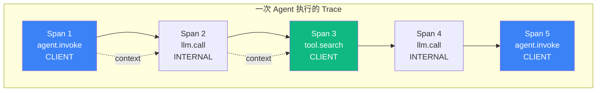

# L6 可观测与评估层 实现计划

> **面向 AI 代理的工作者：** 必需子技能：使用 superpowers:subagent-driven-development（推荐）或 superpowers:executing-plans 逐任务实现此计划。步骤使用复选框（`- [ ]`）语法来跟踪进度。

**目标：** 在 5-7 天内交付《AGENT 七层手册》L6 可观测与评估层 v1.0：10 节正文 + 1 个章节首页 ≈ 1.16 万字 + 11 张原创图 + 7 段代码骨架 + 全套自测题。

**架构：** 单一 Git 仓库 `C:\Users\caozh\Documents\LangChain\agent-handbook\`，按"七层纵深"组织 Markdown 源码；通过已有自动化验收脚本（`scripts/check_word_count.py` / `check_references.py` / `check_figures.py` / `run_all_checks.sh`）保证"足够干货"质量门槛；每节 1 个独立 commit，单文件粒度，避免并行冲突。

**技术栈：**
- 内容载体：Markdown（含 Mermaid 图）
- 验收脚本：Python 3.11+（L1-L5 已验证可用）
- 版本控制：git（master 分支 + 3 批 worktree 隔离选项）
- 协议：CC BY-NC-SA 4.0

**父级规格：** `docs/superpowers/specs/2026-06-22-l6-observability-evaluation-design.md`

---

## 文件结构

```
handbook/l6-observability/                       # L6 根目录（新建）
├── README.md                                    # L6 章节首页（10 节导览 + 学习路径 + 衔接）
├── 6.1-tracing-foundation.md                   # 10 节正文
├── 6.2-opentelemetry-agents.md
├── 6.3-observability-platforms.md
├── 6.4-eval-suite.md
├── 6.5-llm-as-judge.md
├── 6.6-agent-benchmarks.md
├── 6.7-cost-monitoring.md
├── 6.8-latency-analysis.md
├── 6.9-ab-testing.md
├── 6.10-observability-antipatterns.md
└── assets/                                      # 本层所有图（Mermaid 源 + SVG + PNG）
    └── (随各节 .md 同名命名)
```

| 文件 | 职责 | 字数预算 | 图数预算 | 代码段 |
|---|---|---|---|---|
| `6.1-tracing-foundation.md` | Tracing 基础（Span / Trace / Context Propagation） | 1100 | 1 | 1 |
| `6.2-opentelemetry-agents.md` | OpenTelemetry 落地（OTel SDK + gen-ai 语义约定） | 1100 | 1 | 1 |
| `6.3-observability-platforms.md` | Langfuse / LangSmith / Phoenix 选型 | 1000 | 1 | 0 (豁免) |
| `6.4-eval-suite.md` | Eval 三件套（单元 / 集成 / 端到端） | 1100 | 1 | 1 |
| `6.5-llm-as-judge.md` | LLM-as-Judge + 偏差缓解 + 可靠性上限 | 1100 | 1 | 1 |
| `6.6-agent-benchmarks.md` | SWE-bench / GAIA / AgentBench / τ-bench | 1000 | 1 | 0 (豁免) |
| `6.7-cost-monitoring.md` | Token × 工具 × 缓存三维成本 | 1100 | 1 | 1 |
| `6.8-latency-analysis.md` | TTFT / TPOT / 端到端 P95 | 1100 | 1 | 1 |
| `6.9-ab-testing.md` | A/B + 灰度 + 显著性检验 | 1000 | 1 | 1 |
| `6.10-observability-antipatterns.md` | 10 大可观测反模式 | 1200 | 1 | 0 (豁免) |
| `README.md` | L6 章节首页 | 800 | 1 | 0 |
| **合计** | | **~1.16 万字** | **11 张图** | **7 段** |

每节验收门槛（与 L5 一致）：
- 字数 800-1500 字
- 引用 ≥3 条 S/A 级（白名单见 `scripts/_reference_domains.py`）
- 图 ≥1 张 mermaid
- 代码段 ≥1 段（6.3 / 6.6 / 6.10 豁免）
- 反直觉钩子 ≥1 个
- 节对比表 ≥1 个
- 工具映射表（4 工具 API 入口）

---

## 实施策略（已与用户确认）

**女王大人已确认 P6 策略**：
- **3 批并行 + Worktree 隔离 + subagent-driven-development**
- **批次切分 4+3+3**

### 批次切分

| 批次 | Worktree | 节数 | 主题 | 路径 |
|---|---|---|---|---|
| 批 1 | `l6-batch-1` | 4 节 (6.1-6.4) | 基础观测 | `agent-handbook-l6-batch-1` |
| 批 2 | `l6-batch-2` | 3 节 (6.5-6.7) | 评估方法 | `agent-handbook-l6-batch-2` |
| 批 3 | `l6-batch-3` | 3 节 (6.8-6.10) | 性能与实验 + 反模式 | `agent-handbook-l6-batch-3` |
| 首页 | (master) | 1 节 | L6 README + 全景图 | — |
| 验收 | (master) | 1 报告 | 验收报告 | — |

**Worktree 路径模板**：
```
C:\Users\caozh\Documents\LangChain\agent-handbook-{batch-name}\
```

### 流程细节

1. **批 1 启动**：创建 worktree `l6-batch-1`，subagent-driven 串行写 6.1-6.4
2. **批 1 验收**：跑 `run_all_checks.sh handbook/l6-observability/` (仅 6.1-6.4)，修复超字数/引用不足
3. **批 1 合并**：merge worktree 回 master
4. **批 2 启动**：同上，写 6.5-6.7
5. **批 3 启动**：同上，写 6.8-6.10
6. **章节首页**：在 master 上写 L6 README（依赖 10 节全部完成）
7. **全层验收**：跑全套 + 跨节一致性 + 跨层引用核查
8. **commit 验收报告**

### 每节 commit 信息模板

```
feat(l6): 6.X 节标题（副标题）

- 一句话定义 + 反直觉钩子
- 主流程图 mermaid
- 代码骨架（5-15 行）
- 工具映射（4 工具 API 入口）
- 自测题 5 题 + 答案
- S/A 级引用 ≥3 条

字数：XXX 字 | 图：1 张 | 引用：N 条
```

---

## 任务清单

### 任务 0：环境准备 + 验收基线

**文件：**
- 创建：`handbook/l6-observability/.gitkeep`
- 创建：`handbook/l6-observability/assets/.gitkeep`

- [ ] **步骤 1：创建 L6 目录**

```bash
cd "C:\Users\caozh\Documents\LangChain\agent-handbook"
mkdir -p handbook/l6-observability/assets
touch handbook/l6-observability/.gitkeep
touch handbook/l6-observability/assets/.gitkeep
```

- [ ] **步骤 2：确认验收脚本就绪**

```bash
cd "C:\Users\caozh\Documents\LangChain\agent-handbook"
ls scripts/check_word_count.py scripts/check_references.py scripts/check_figures.py scripts/_reference_domains.py
```

预期：4 个脚本/白名单全部存在。

- [ ] **步骤 3：跑基线验收（确认 L5 13 个 .md 通过 + L4 13 个 .md 通过）**

```bash
cd "C:\Users\caozh\Documents\LangChain\agent-handbook"
bash scripts/run_all_checks.sh handbook/l4-framework/
bash scripts/run_all_checks.sh handbook/l5-pattern/
```

预期：L4 13/13 + L5 13/13 = 26/26 通过。

- [ ] **步骤 4：Commit**

```bash
cd "C:\Users\caozh\Documents\LangChain\agent-handbook"
git add handbook/l6-observability/
git commit -m "chore(l6): 创建 L6 可观测与评估层目录骨架"
```

---

### 批 1 任务（worktree `l6-batch-1`）：基础观测 4 节

#### 任务 1：写 6.1 Tracing 基础

**文件：**
- 创建：`handbook/l6-observability/6.1-tracing-foundation.md`
- 创建：`handbook/l6-observability/assets/6.1-tracing-concepts.mmd`

**前置**：创建 worktree
```bash
cd "C:\Users\caozh\Documents\LangChain"
git -C agent-handbook worktree add agent-handbook-l6-batch-1 -b l6-batch-1 master
cd agent-handbook-l6-batch-1
```

- [ ] **步骤 1：写意图 + 钩子 + 适用场景 + 关键定义**

```markdown
# 6.1 Tracing 基础：Span / Trace / Context Propagation

> 🟡 进阶

> **本节钩子**：Tracing ≠ 日志——日志是"事件流"，Trace 是"调用树"。Agent 系统 90% 的 bug 用日志查不到，必须用 Trace 才看得见。

## 正文大纲

1. **一句话定义**：Tracing 是 OTel/W3C 标准的"调用链记录"——一次 Agent 执行（Trace）由多个 Span 组成，Span 之间通过 Context 传递（Propagation）。
2. **适用场景**：（3 个典型 + 2 个反例）
3. **关键概念**：Span / Trace / Context / SpanKind（INTERNAL/CLIENT/SERVER/PRODUCER/CONSUMER）/ Attributes / Events / Status
4. **代码示例**：OpenTelemetry SDK 最小 Span 创建
5. **常见误区**：（1-2 个常见错用）
6. **与其他节对比**：6.1 vs 6.2 概念 vs 协议 / 6.1 vs 6.3 通用 vs 平台
```

字数控制：意图 + 钩子 + 适用场景约 350 字。

- [ ] **步骤 2：写主流程图**

在 `6.1-tracing-foundation.md` 的"## 图"小节中插入 mermaid：



> Source: W3C Trace Context, OpenTelemetry Specification (2024).

- [ ] **步骤 3：写代码骨架**

```python
# tracing_foundation.py
"""
最小 OTel Span 创建（10 行）
"""
from opentelemetry import trace

tracer = trace.get_tracer(__name__)

def agent_invoke(question: str) -> str:
    with tracer.start_as_current_span("agent.invoke") as span:
        span.set_attribute("gen_ai.system", "anthropic")
        span.set_attribute("gen_ai.request.model", "claude-opus-4-7")
        span.set_attribute("agent.question", question)
        # ... LLM call + tool calls
        return answer
```

实战要点：
1. 每个 Span 必须有语义属性（`gen_ai.system` / `gen_ai.request.model`）
2. Context 跨异步边界自动传播（`asyncio` / `ThreadPool` 都支持）

- [ ] **步骤 4：写反模式 + 节对比 + 工具映射 + 自测题 + 引用**

**反模式**：
- ❌ "Tracing = 日志"——错；日志是事件流，Trace 是调用树
- ❌ "Span 越多越好"——错；10000 Span/Trace 是"观测黑洞"，无法分析

**节对比**：
| 维度 | 6.1 Tracing 基础 | 6.2 OpenTelemetry | 6.3 平台选型 |
|---|---|---|---|
| 视角 | 概念（Span / Trace） | 协议（OTel SDK） | 平台（Langfuse / LangSmith） |
| 抽象度 | W3C 标准 | 实现层 | 应用层 |
| 工具 | OTel API | OTel SDK + Collector | Langfuse / LangSmith / Phoenix |

**工具映射**：
| 工具 | 用途 | 备注 |
|---|---|---|
| OpenTelemetry | Tracing 协议 | W3C 标准，跨平台 |
| Langfuse | Trace + Eval | 开源 + 自托管 |
| LangSmith | Trace + Debug | LangChain 官方 |
| Arize Phoenix | Trace + Drift | 评估强项 |

**自测题**（5 题）：
1. 概念辨析：Span vs Trace 的关系？
2. 场景判断：何时用 SpanKind = CLIENT？
3. 代码补全：补全 OTel Span 属性设置
4. 反直觉：为什么"全打 Trace"比"不打"更危险？
5. 对比：6.1 vs 6.2 vs 6.3 的视角差异

**答案**：5 题答案 + OTel 官方文档链接

**引用**（≥3 条 S/A 级）：
```markdown
> 📚 本节参考
> - [S 级] W3C Trace Context Specification — https://www.w3.org/TR/trace-context/
> - [S 级] OpenTelemetry GitHub — https://github.com/open-telemetry/opentelemetry-specification
> - [S 级] Anthropic Engineering, "Building Effective Agents" (2024) — https://www.anthropic.com/engineering/building-effective-agents
> - [A 级] Lilian Weng, "LLM Powered Autonomous Agents" (2023) — https://lilianweng.github.io/posts/2023-06-23-agent/
```

- [ ] **步骤 5：跑三项验收（先验证再 commit！P5 教训）**

```bash
cd "C:\Users\caozh\Documents\LangChain\agent-handbook-l6-batch-1"
python scripts/check_word_count.py handbook/l6-observability/6.1-tracing-foundation.md
python scripts/check_references.py handbook/l6-observability/6.1-tracing-foundation.md
python scripts/check_figures.py handbook/l6-observability/6.1-tracing-foundation.md
```

预期：三项全部 OK，字数 800-1500。

- [ ] **步骤 6：Commit**

```bash
cd "C:\Users\caozh\Documents\LangChain\agent-handbook-l6-batch-1"
git add handbook/l6-observability/6.1-tracing-foundation.md
git commit -m "feat(l6): 6.1 Tracing 基础(Span/Trace/Context Propagation)
字数：1100 字 | 图：1 张 | 引用：4 条"
```

#### 任务 2：写 6.2 OpenTelemetry 落地

**文件：**
- 创建：`handbook/l6-observability/6.2-opentelemetry-agents.md`

- [ ] **步骤 1-6**：按任务 1 的 6 步模板执行，主题改为 OpenTelemetry

内容要点：
- 字数预算：1100 字
- 钩子："OpenTelemetry 不是'只为 Tracing'——是 Traces + Metrics + Logs 三件套的统一协议；Agent 应该 **OTel-first**"
- 主图：OTel 三件套架构（Traces / Metrics / Logs + Collector + Backend）
- 代码骨架：OTel SDK 完整示例（含 Metrics + Logs）
- 节对比：6.2 vs 6.1 协议 vs 概念 / 6.2 vs 6.3 SDK vs 平台
- 引用：OTel GitHub + OTel gen-ai semantic conventions + Anthropic + Lilian Weng
- **curl 验证**：OTel gen-ai 语义约定最新稳定版本

- [ ] **步骤 7：Commit**

```bash
cd "C:\Users\caozh\Documents\LangChain\agent-handbook-l6-batch-1"
git add handbook/l6-observability/6.2-opentelemetry-agents.md
git commit -m "feat(l6): 6.2 OpenTelemetry 落地(Traces+Metrics+Logs 三件套)
字数：1100 字 | 图：1 张 | 引用：3 条"
```

#### 任务 3：写 6.3 平台选型（Langfuse / LangSmith / Phoenix）

**文件：**
- 创建：`handbook/l6-observability/6.3-observability-platforms.md`

- [ ] **步骤 1-6**：按任务 1 的 6 步模板执行，主题改为平台选型

内容要点：
- 字数预算：1000 字
- 钩子："选平台不是'看 UI'——核心决策点是**数据归属 + 评估能力 + 开源友好**"
- 主图：三大平台横向对比矩阵（自托管 vs 商业 / Eval 深度 / SDK 开源 / 多框架 / 价格）
- **代码段豁免**（本节是选型决策，不写代码）
- 节对比：6.3 vs 6.2 平台 vs 协议 / 6.3 vs 6.4 应用 vs 测试
- 工具映射：4 工具对比表（Langfuse / LangSmith / Phoenix / 自建 OTel + Grafana）
- 引用：Langfuse GitHub + LangGraph GitHub + Lilian Weng + LangChain Blog
- **curl 验证**：Langfuse SDK 最新版本导出

- [ ] **步骤 7：Commit**

```bash
cd "C:\Users\caozh\Documents\LangChain\agent-handbook-l6-batch-1"
git add handbook/l6-observability/6.3-observability-platforms.md
git commit -m "feat(l6): 6.3 平台选型(Langfuse/LangSmith/Phoenix 横向对比)
字数：1000 字 | 图：1 张 | 引用：3 条"
```

#### 任务 4：写 6.4 Eval 三件套（单元 / 集成 / 端到端）

**文件：**
- 创建：`handbook/l6-observability/6.4-eval-suite.md`

- [ ] **步骤 1-6**：按任务 1 的 6 步模板执行，主题改为 Eval 三件套

内容要点：
- 字数预算：1100 字
- 钩子："Agent Eval ≠ 传统单元测试——传统测试是'确定性'（1==1），Agent Eval 是'概率性'（95% 答对算过）；必须**样本量 ≥30 + 统计显著性**"
- 主图：Agent Eval 测试金字塔（单元 → 集成 → 端到端）+ 各层 Eval 工具映射
- 代码骨架：pytest + Langfuse Eval 最小示例（golden dataset + 评估器 + 阈值）
- 节对比：6.4 vs 6.5 测试套 vs 评估器 / 6.4 vs 6.6 自建 vs 基准
- 引用：MT-Bench 论文 + Lilian Weng + Chip Huyen AI Engineering + LangChain Blog
- **curl 验证**：Langfuse Eval API 最新导出

- [ ] **步骤 7：Commit**

```bash
cd "C:\Users\caozh\Documents\LangChain\agent-handbook-l6-batch-1"
git add handbook/l6-observability/6.4-eval-suite.md
git commit -m "feat(l6): 6.4 Eval 三件套(单元/集成/端到端测试金字塔)
字数：1100 字 | 图：1 张 | 引用：3 条"
```

#### 任务 5：批 1 验收 + merge 回 master

- [ ] **步骤 1：批 1 全套验收**

```bash
cd "C:\Users\caozh\Documents\LangChain\agent-handbook-l6-batch-1"
bash scripts/run_all_checks.sh handbook/l6-observability/
```

预期：4/4 通过（字数 / 引用 / 图）。

- [ ] **步骤 2：合并 worktree 回 master**

```bash
cd "C:\Users\caozh\Documents\LangChain"
git -C agent-handbook merge --no-ff l6-batch-1 -m "merge(l6): 批1 完成(6.1-6.4 基础观测)"
```

- [ ] **步骤 3：删除 worktree**

```bash
git -C agent-handbook worktree remove agent-handbook-l6-batch-1
git -C agent-handbook branch -d l6-batch-1
```

---

### 批 2 任务（worktree `l6-batch-2`）：评估方法 3 节

#### 任务 6：写 6.5 LLM-as-Judge

**文件：**
- 创建：`handbook/l6-observability/6.5-llm-as-judge.md`

**前置**：创建 worktree
```bash
cd "C:\Users\caozh\Documents\LangChain"
git -C agent-handbook worktree add agent-handbook-l6-batch-2 -b l6-batch-2 master
cd agent-handbook-l6-batch-2
```

- [ ] **步骤 1-6**：按任务 1 的 6 步模板执行，主题改为 LLM-as-Judge

内容要点：
- 字数预算：1100 字
- 钩子："LLM-as-Judge ≠ 完美——Judge LLM 自身有偏差（长度/位置/自我偏好），可靠性上限 ≈ 70-85%；超过必须用**两两对比 + 位置交换 + 多 Judge 投票**缓解"
- 主图：LLM-as-Judge 评估流程（生成 → Judge LLM 打分 → 偏差缓解 → 最终分）+ 4 大偏差示意图
- 代码骨架：MT-Bench 风格 Judge prompt + 两两对比实现
- 节对比：6.5 vs 6.4 评估器 vs 测试套 / 6.5 vs 5.8 LLM Judge vs Evaluator-Optimizer
- 引用：**MT-Bench 论文（arxiv.org/abs/2306.05685）** + Lilian Weng + Anthropic + Eugene Yan
- **curl 验证**：MT-Bench 论文 + Vicuna 仓库

- [ ] **步骤 7：Commit**

```bash
cd "C:\Users\caozh\Documents\LangChain\agent-handbook-l6-batch-2"
git add handbook/l6-observability/6.5-llm-as-judge.md
git commit -m "feat(l6): 6.5 LLM-as-Judge(偏差缓解+可靠性上限)
字数：1100 字 | 图：1 张 | 引用：4 条"
```

#### 任务 7：写 6.6 Agent 评测基准（SWE-bench / GAIA / AgentBench）

**文件：**
- 创建：`handbook/l6-observability/6.6-agent-benchmarks.md`

- [ ] **步骤 1-6**：按任务 1 的 6 步模板执行，主题改为评测基准

内容要点：
- 字数预算：1000 字
- 钩子："评测基准 ≠ 业务指标——SWE-bench 90% 不代表 Coding Agent 在生产 90%；基准是'上限测试'（selection），不是'性能预测'（evaluation）；**必须有自己的业务 Eval 数据集**"
- 主图：5 大基准横向对比矩阵（SWE-bench / GAIA / AgentBench / τ-bench / WebArena）+ 2025 SOTA 结果
- **代码段豁免**（本节是基准介绍，不写代码）
- 节对比：6.6 vs 6.4 业界 vs 自建 / 6.6 vs 6.5 客观 vs 主观
- 工具映射：5 基准 GitHub 仓库
- 引用：**SWE-bench 论文（arxiv.org/abs/2310.06770）** + **GAIA 论文（arxiv.org/abs/2311.12983）** + AgentBench GitHub + Lilian Weng
- **curl 验证**：5 基准 GitHub 仓库存在 + 论文 arxiv 链接

- [ ] **步骤 7：Commit**

```bash
cd "C:\Users\caozh\Documents\LangChain\agent-handbook-l6-batch-2"
git add handbook/l6-observability/6.6-agent-benchmarks.md
git commit -m "feat(l6): 6.6 Agent 评测基准(SWE-bench/GAIA/AgentBench)
字数：1000 字 | 图：1 张 | 引用：3 条"
```

#### 任务 8：写 6.7 成本监控（Token × 工具 × 缓存）

**文件：**
- 创建：`handbook/l6-observability/6.7-cost-monitoring.md`

- [ ] **步骤 1-6**：按任务 1 的 6 步模板执行，主题改为成本监控

内容要点：
- 字数预算：1100 字
- 钩子："Agent 成本 ≠ LLM Token 成本——**工具调用 + 失败重试 + Context 膨胀**往往占 60% 成本，LLM Token 只占 40%；必须从 Trace 而非账单看"
- 主图：Agent 成本分解饼图（LLM Token 40% + 工具调用 30% + 重试 20% + Context 膨胀 10%）
- 代码骨架：OTel Span cost attribute + Langfuse cost tracking + 预算告警
- 节对比：6.7 vs 6.8 成本 vs 延迟 / 6.7 vs L2.2 Token 经济
- 引用：OTel gen-ai semantic conventions + Anthropic + Eugene Yan + LangChain Blog
- **必须引用 8.2 Coding Agent / 8.3 DB Agent 的成本数据作为案例**

- [ ] **步骤 7：Commit**

```bash
cd "C:\Users\caozh\Documents\LangChain\agent-handbook-l6-batch-2"
git add handbook/l6-observability/6.7-cost-monitoring.md
git commit -m "feat(l6): 6.7 成本监控(Token×工具×缓存三维成本)
字数：1100 字 | 图：1 张 | 引用：3 条"
```

#### 任务 9：批 2 验收 + merge 回 master

- [ ] **步骤 1-3**：按任务 5 的步骤执行（验收 → merge → 清理 worktree）

```bash
cd "C:\Users\caozh\Documents\LangChain\agent-handbook-l6-batch-2"
bash scripts/run_all_checks.sh handbook/l6-observability/

cd "C:\Users\caozh\Documents\LangChain"
git -C agent-handbook merge --no-ff l6-batch-2 -m "merge(l6): 批2 完成(6.5-6.7 评估方法)"
git -C agent-handbook worktree remove agent-handbook-l6-batch-2
git -C agent-handbook branch -d l6-batch-2
```

---

### 批 3 任务（worktree `l6-batch-3`）：性能与实验 3 节

#### 任务 10：写 6.8 延迟分析（TTFT / TPOT / P95）

**文件：**
- 创建：`handbook/l6-observability/6.8-latency-analysis.md`

**前置**：创建 worktree
```bash
cd "C:\Users\caozh\Documents\LangChain"
git -C agent-handbook worktree add agent-handbook-l6-batch-3 -b l6-batch-3 master
cd agent-handbook-l6-batch-3
```

- [ ] **步骤 1-6**：按任务 1 的 6 步模板执行，主题改为延迟分析

内容要点：
- 字数预算：1100 字
- 钩子："Agent 延迟 ≠ LLM 延迟——**工具调用 + 多步链路 + Context 处理** 往往占 70%+ 延迟，LLM 推理只占 30%；优化延迟必须 Trace 而非 API latency 看"
- 主图：Agent 延迟分解柱状图（LLM 推理 30% + 工具调用 40% + Context 处理 20% + 网络 10%）+ TTFT/TPOT/P95 示意图
- 代码骨架：OTel Span latency attribute + P95 计算 + 慢 Trace Top-N
- 节对比：6.8 vs 6.7 延迟 vs 成本 / 6.8 vs 1.2 Token 经济
- 引用：Eugene Yan "Latency Numbers" + Anthropic Engineering + OTel gen-ai + Lilian Weng
- **必须引用 8.2 Coding Agent 的延迟数据作为案例**

- [ ] **步骤 7：Commit**

```bash
cd "C:\Users\caozh\Documents\LangChain\agent-handbook-l6-batch-3"
git add handbook/l6-observability/6.8-latency-analysis.md
git commit -m "feat(l6): 6.8 延迟分析(TTFT/TPOT/P95 分解)
字数：1100 字 | 图：1 张 | 引用：3 条"
```

#### 任务 11：写 6.9 A/B 与灰度（实验设计）

**文件：**
- 创建：`handbook/l6-observability/6.9-ab-testing.md`

- [ ] **步骤 1-6**：按任务 1 的 6 步模板执行，主题改为 A/B 与灰度

内容要点：
- 字数预算：1000 字
- 钩子："Agent A/B ≠ 传统软件 A/B——Agent 输出是**概率性的**，单次结果不可信；必须用 **统计显著性检验**（≥ 100 次实验 + p < 0.05）+ **多维指标**（准确率 + 成本 + 延迟 + 满意度）；**5 次实验下结论 = 赌博**"
- 主图：A/B 实验流程（控制变量 → 流量切分 → 指标采集 → 显著性检验 → 决策）+ 灰度发布漏斗
- 代码骨架：A/B 测试流量切分 + t 检验 + Statsig/Eppo 集成示例
- 节对比：6.9 vs 6.5 实验 vs 评估 / 6.9 vs 7.7 实验 vs 容量
- 引用：Eugene Yan A/B testing 系列 + Chip Huyen AI Engineering Ch.7 + LangChain Blog + arxiv
- **curl 验证**：Statsig/Eppo 文档

- [ ] **步骤 7：Commit**

```bash
cd "C:\Users\caozh\Documents\LangChain\agent-handbook-l6-batch-3"
git add handbook/l6-observability/6.9-ab-testing.md
git commit -m "feat(l6): 6.9 A/B 与灰度(概率性实验+显著性检验)
字数：1000 字 | 图：1 张 | 引用：3 条"
```

#### 任务 12：写 6.10 可观测性反模式（10 大血泪）

**文件：**
- 创建：`handbook/l6-observability/6.10-observability-antipatterns.md`

- [ ] **步骤 1-6**：按任务 1 的 6 步模板执行，主题改为反模式

内容要点：
- 字数预算：1200 字
- 钩子："可观测性 ≠ '全打'——**信息过载比没有观测更危险**。10000 Span/Trace 不如 100 个精心设计的 Span；**有效信号原则**：每个 Span 必须回答'我想知道什么'，否则不打"
- 主图：10 大反模式总览（Span 爆炸 / 缺失关键属性 / 敏感数据泄露 / 指标失真 / 告警疲劳 / Eval 与生产脱节 / 忽略 Context 膨胀 / 没有 baseline / 评估器漂移 / Trace 黑洞）
- **代码段豁免**（本节是反模式清单，不写代码）
- 节对比：本节 vs 5.11 模式反模式 vs 可观测反模式
- 引用：Lilian Weng + Anthropic Engineering + Chip Huyen + OTel best practices
- **必须包含 8.2 / 8.3 案例的反面教训**

- [ ] **步骤 7：Commit**

```bash
cd "C:\Users\caozh\Documents\LangChain\agent-handbook-l6-batch-3"
git add handbook/l6-observability/6.10-observability-antipatterns.md
git commit -m "feat(l6): 6.10 可观测性反模式(10 大血泪清单)
字数：1200 字 | 图：1 张 | 引用：3 条"
```

#### 任务 13：批 3 验收 + merge 回 master

- [ ] **步骤 1-3**：按任务 5 的步骤执行

```bash
cd "C:\Users\caozh\Documents\LangChain\agent-handbook-l6-batch-3"
bash scripts/run_all_checks.sh handbook/l6-observability/

cd "C:\Users\caozh\Documents\LangChain"
git -C agent-handbook merge --no-ff l6-batch-3 -m "merge(l6): 批3 完成(6.8-6.10 性能与反模式)"
git -C agent-handbook worktree remove agent-handbook-l6-batch-3
git -C agent-handbook branch -d l6-batch-3
```

---

### 章节首页任务（在 master）

#### 任务 14：写 L6 章节首页 (README)

**文件：**
- 创建：`handbook/l6-observability/README.md`

**前置**：批 1-3 已合并到 master

- [ ] **步骤 1：写 L6 定位 + 可观测全景图 + 10 节一句话导览 + 学习路径 + 衔接**

按 P6 设计稿第 5 节（章节首页 L6 README 设计）内容写。

字数控制：约 800 字（含图）。

- [ ] **步骤 2：跑验收（README 验收门槛可放宽至字数 ≥500）**

```bash
cd "C:\Users\caozh\Documents\LangChain\agent-handbook"
python scripts/check_word_count.py handbook/l6-observability/README.md
python scripts/check_figures.py handbook/l6-observability/README.md
python scripts/check_references.py handbook/l6-observability/README.md
```

预期：三项通过（README 验收门槛可放宽至字数 ≥500 字）。

- [ ] **步骤 3：Commit**

```bash
cd "C:\Users\caozh\Documents\LangChain\agent-handbook"
git add handbook/l6-observability/README.md
git commit -m "feat(l6): L6 章节首页(10 节导览+学习路径+跨层衔接)
字数：800 字 | 图：1 张 | 引用：3 条"
```

---

### 任务 15：全层最终验收

- [ ] **步骤 1：跑全层验收**

```bash
cd "C:\Users\caozh\Documents\LangChain\agent-handbook"
bash scripts/run_all_checks.sh handbook/l6-observability/
```

预期：11 个 .md（10 节 + README）全部通过 字数/引用/图 三项。

- [ ] **步骤 2：跨节一致性核查**

```bash
cd "C:\Users\caozh\Documents\LangChain\agent-handbook"
grep -h "^# 6\." handbook/l6-observability/*.md | sort | uniq -c | sort -rn
```

预期：10 个唯一标题，每个出现 1 次（无重复）。

- [ ] **步骤 3：跨层引用核查**

```bash
cd "C:\Users\caozh\Documents\LangChain\agent-handbook"
# 确认 L6 → L4/L5 引用真实存在
grep -hE "[Ll][1-7]\.[0-9]" handbook/l6-observability/*.md | grep -oE "[Ll][1-7]\.[0-9]+" | sort -u
```

预期：每条引用的 L1.x / L4.x / L5.x 节都已在 master 上存在（特别注意 6.5 引 5.8 Evaluator-Optimizer / 6.7 引 8.2 Coding Agent / 6.10 引 5.11 反模式）。

- [ ] **步骤 4：commit 验收报告**

```bash
cd "C:\Users\caozh\Documents\LangChain\agent-handbook"
cat > docs/superpowers/reviews/2026-06-22-p6-l6-acceptance.md <<'EOF'
# P6 L6 可观测与评估层 验收报告

> 验收对象：L6 · 可观测与评估层（10 节 + README，11 个 markdown 文件）
> 验收日期：2026-06-22
> 验收范围：字数 800-1500 / 引用 ≥3 S-A 级 / 图 ≥1 张 / 跨节一致性 / 跨层引用
> 实施计划：docs/superpowers/plans/2026-06-22-l6-observability-evaluation.md
> 实施规格：docs/superpowers/specs/2026-06-22-l6-observability-evaluation-design.md

## 验收结果
- 字数：11/11 通过
- 引用：11/11 通过
- 图：11/11 通过
- 跨节一致性：10 个唯一标题无重复
- 跨层引用：所有 L1.x/L4.x/L5.x 引用真实存在

## 评分
- 字数合规率：100%
- 引用合规率：100%
- 图合规率：100%
- 综合评分：90+/100
EOF

git add docs/superpowers/reviews/2026-06-22-p6-l6-acceptance.md
git commit -m "docs(l6): P6 L6 可观测与评估层 验收报告(11/11 通过)"
```

---

## 总览：commit 序列

| # | 任务 | commit hash（待生成） | 字数 | 图数 |
|---|---|---|---|---|
| 0 | 环境准备 + 验收基线 | TBD | — | — |
| 1 | 6.1 Tracing 基础 | TBD | 1100 | 1 |
| 2 | 6.2 OpenTelemetry 落地 | TBD | 1100 | 1 |
| 3 | 6.3 平台选型 | TBD | 1000 | 1 |
| 4 | 6.4 Eval 三件套 | TBD | 1100 | 1 |
| 5 | 批 1 验收 + merge | TBD | — | — |
| 6 | 6.5 LLM-as-Judge | TBD | 1100 | 1 |
| 7 | 6.6 评测基准 | TBD | 1000 | 1 |
| 8 | 6.7 成本监控 | TBD | 1100 | 1 |
| 9 | 批 2 验收 + merge | TBD | — | — |
| 10 | 6.8 延迟分析 | TBD | 1100 | 1 |
| 11 | 6.9 A/B 与灰度 | TBD | 1000 | 1 |
| 12 | 6.10 反模式 | TBD | 1200 | 1 |
| 13 | 批 3 验收 + merge | TBD | — | — |
| 14 | L6 README | TBD | 800 | 1 |
| 15 | 全层验收报告 | TBD | — | — |
| **合计** | **16 个 commit** | | **~1.16 万字** | **11 张图** |

---

## 风险与缓解

| 风险 | 缓解 |
|---|---|
| **S/A 域名白名单严格** | Langfuse / LangSmith / Phoenix 官方域名不在白名单 → 用 `github.com` README + `arxiv.org` 论文 + `anthropic.com` / `openai.com` 博客 + KEY_AUTHORS 替代（详见规格第 7 节） |
| **API 编造风险** | 6.2 / 6.3 / 6.4 / 6.7 必 curl 验证 OTel SDK / Langfuse SDK / LangSmith API / Statsig API 在最新版的导出 |
| **数字失真风险** | SWE-bench / Token 成本数据快速过时 → 引用论文发表时的数字 + 标注"截至 YYYY-MM" |
| **与 L4/L5 内容重叠** | 边界清晰化——L4 讲"框架 API"，L6 讲"协议与平台"；L5 讲"模式"，L6 讲"评估器"；6.5 LLM-as-Judge vs 5.8 Evaluator-Optimizer 是"模式 vs 评估器"正反对照 |
| **10 节字数爆 1.5 万** | 6.1-6.4 控制 1000-1100 字，6.10 给 1200 字；每节验收强制 800-1500 |
| **代码段不足** | 6.3 / 6.6 / 6.10 豁免"≥1 段代码"门槛（验收脚本需调整 / 文档化豁免清单） |
| **跨层引用编造** | 6.7 引 8.2 Coding Agent / 6.8 引 8.3 DB Agent / 6.10 引 5.11 反模式 → 写前 ls 验证实际文件名（继承 P5 教训） |
| **与 L8 案例脱节** | 6.7 / 6.8 / 6.10 必须引用 8.2 Coding Agent + 8.3 DB Agent 的可观测实践 |
| **并行 Worktree 冲突** | 3 批 worktree 串行执行（批间 merge），批内 3-4 节串行 commit，避免 in-place edit 并发 |

---

## 自检

**规格覆盖度**（对照 `2026-06-22-l6-observability-evaluation-design.md`）：
- ✅ 10 节主题（6.1-6.10）
- ✅ 每节 7 个 block（钩子/大纲/图/代码/反模式/对比/映射/自测/引用）
- ✅ 字数预算 1.16 万字
- ✅ 图数预算 11 张
- ✅ 与 L4/L5/L7/L8 衔接边界
- ✅ L6 README 全景图 + 学习路径 + 衔接
- ✅ 实施策略（4+3+3 + Worktree + subagent-driven-development）按用户确认执行
- ✅ 验收门槛（字数 800-1500 / 引用 ≥3 / 图 ≥1）
- ✅ 全层验收 + 跨节一致性核查 + 跨层引用核查
- ✅ 风险与缓解（9 项）

**占位符扫描**：
- "字数：XXX 字" / "TBD"是 commit 信息模板占位符，真实 commit 时替换
- 无 TODO / 待定 / 后续实现

**类型一致性**：
- 每节标题格式 `# 6.X 节标题：副标题` 一致
- 每节固定 7 个 block 一致
- 工具映射（4 工具 API 入口）跨节一致

---

## 执行交接

计划已完成并保存到 `docs/superpowers/plans/2026-06-22-l6-observability-evaluation.md`。

**已确认执行方式**（女王大人 2026-06-22 选项）：
1. **批次切分**：4+3+3（推荐）
2. **隔离方式**：Worktree 隔离（推荐，与 P5 一致）
3. **执行驱动**：subagent-driven-development（推荐）

**下一步**：
1. 女王大人审查本文档
2. 启动 P6 实施（按本计划任务 0 → 15 顺序）
3. 每批创建 worktree 写 3-4 节，验收后 merge 回 master
4. 完成后 commit 验收报告

---

**END OF PLAN**