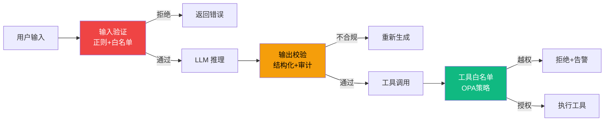
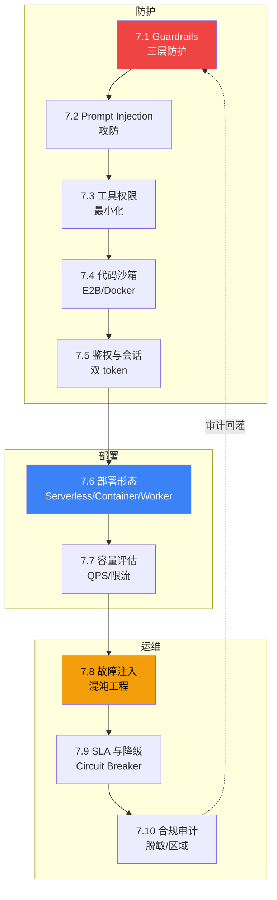

# L7 生产化与安全层 实现计划

> **面向 AI 代理的工作者:** 必需子技能:使用 superpowers:subagent-driven-development(推荐)或 superpowers:executing-plans 逐任务实现此计划。步骤使用复选框(`- [ ]`)语法来跟踪进度。

**目标:** 在 5-7 天内交付《AGENT 七层手册》L7 生产化与安全层 v1.0:10 节正文 + 1 个章节首页 ≈ 1.13 万字 + 11 张原创图 + 4 段代码骨架(7.4/7.7/7.8/7.9)+ 全套自测题。

**架构:** 单一 Git 仓库 `C:\Users\caozh\Documents\LangChain\agent-handbook\`,按"七层纵深"组织 Markdown 源码;通过已有自动化验收脚本(`scripts/check_word_count.py` / `check_references.py` / `check_figures.py` / `run_all_checks.sh`)保证"足够干货"质量门槛;每节 1 个独立 commit,单文件粒度,避免并行冲突。

**技术栈:**
- 内容载体:Markdown(含 Mermaid 图)
- 验收脚本:Python 3.11+(L4-L6 已就绪,本次复用)
- 版本控制:git(master 分支 + 3 批 worktree 隔离选项)
- 协议:CC BY-NC-SA 4.0

**父级规格:** `docs/superpowers/specs/2026-06-22-l7-production-security-design.md`

---

## 文件结构

```
handbook/l7-production-security/                  # L7 根目录(新建)
├── README.md                                      # L7 章节首页(10 节导览 + 学习路径 + 衔接)
├── 7.1-guardrails.md                              # 10 节正文
├── 7.2-prompt-injection.md
├── 7.3-tool-permissions.md
├── 7.4-code-sandbox.md
├── 7.5-auth-session.md
├── 7.6-deployment-form.md
├── 7.7-capacity-ratelimit.md
├── 7.8-chaos-engineering.md
├── 7.9-sla-degradation.md
├── 7.10-compliance-audit.md
└── assets/                                        # 本层所有图(Mermaid 源 + SVG + PNG)
    └── (随各节 .md 同名命名)
```

| 文件 | 职责 | 字数预算 | 图数预算 | 代码段 |
|---|---|---|---|---|
| `7.1-guardrails.md` | 输入/输出/工具三层防护栏 | 1000 | 1 | 0 |
| `7.2-prompt-injection.md` | 4 类攻击 + 5 类防御 + OWASP LLM01 | 1100 | 1 | 0 |
| `7.3-tool-permissions.md` | 工具权限最小化原则 + 临时 token | 1000 | 1 | 0 |
| `7.4-code-sandbox.md` | E2B / Docker / Firecracker 横向对比 | 1200 | 1 | 1 (E2B) |
| `7.5-auth-session.md` | 双 token + audience 分离 | 1100 | 1 | 0 |
| `7.6-deployment-form.md` | Serverless / Container / Worker 选型 | 1000 | 1 | 0 |
| `7.7-capacity-ratelimit.md` | QPS + 令牌桶 + 优先级队列 | 1200 | 1 | 1 (令牌桶) |
| `7.8-chaos-engineering.md` | 4 类故障 + 实验设计 | 1100 | 1 | 1 (chaos) |
| `7.9-sla-degradation.md` | SLO/SLI/SLA + 失败预算 + Circuit Breaker | 1100 | 1 | 1 (CB) |
| `7.10-compliance-audit.md` | 分层保留 + 脱敏 + 区域隔离 | 1200 | 1 | 0 |
| `README.md` | L7 章节首页 | 500 | 1 | 0 |
| **合计** | | **~1.13 万字** | **11 张图** | **4 段代码** |

每节验收门槛(与 L4-L6 一致):
- 字数 800-1500 字
- 引用 ≥3 条 S/A 级
- 图 ≥1 张 mermaid
- 代码段 7.4/7.7/7.8/7.9 必给,其余 6 节豁免
- 反直觉钩子 ≥1 个
- 节对比表 ≥1 个
- 工具映射表(4-6 工具 API 入口)

---

## 实施策略(女王大人选项)

本计划提供两种并行粒度,由执行者在任务开始前选:

### 策略 A:单文件串行(推荐用于本次)

- 每节 1 个独立 commit,共 10 个 .md commit
- 章节首页 1 个 commit
- 全层验收 1 个 commit
- **总计 12 个 commit**,每节 5-15 分钟
- 优点:节奏稳、冲突零、易审查
- 适合:人手 1-2 个、节奏可控

### 策略 B:3 批 × (4+3+3) 节 + Worktree(规格原文建议)

- 批 1(worktree `l7-batch-1`):7.1 → 7.2 → 7.3 → 7.4(防护 4 节)
- 批 2(worktree `l7-batch-2`):7.5 → 7.6 → 7.7(鉴权+部署+容量 3 节)
- 批 3(worktree `l7-batch-3`):7.8 → 7.9 → 7.10(运维 3 节)
- 章节首页(在 master):依赖 10 节全部合并后串行写
- **总计 12 个 commit**(批内可拆为 4 个 commit/批)
- 优点:节间引用一致性强,批间质量门控清晰
- 缺点:worktree 跨批合并复杂
- 适合:跨节引用需严格一致的场景

> **执行者选择:** 默认采用 **策略 B 3 批 × (4+3+3) + Worktree**(与 P5/P6 已验证稳定模式一致)。如需切换策略 A,请提前与用户确认。

---

## 任务清单

### 任务 0:环境准备 + 验收基线

**文件:**
- 创建:`handbook/l7-production-security/.gitkeep`
- 创建:`handbook/l7-production-security/assets/.gitkeep`

- [ ] **步骤 1:创建 L7 目录**

```bash
cd "C:\Users\caozh\Documents\LangChain\agent-handbook"
mkdir -p handbook/l7-production-security/assets
touch handbook/l7-production-security/.gitkeep
touch handbook/l7-production-security/assets/.gitkeep
```

- [ ] **步骤 2:确认验收脚本就绪**

```bash
cd "C:\Users\caozh\Documents\LangChain\agent-handbook"
ls scripts/check_word_count.py scripts/check_references.py scripts/check_figures.py
```

预期:4 个脚本全部存在。

- [ ] **步骤 3:跑基线验收(确认 L6 11 个 .md 通过)**

```bash
bash scripts/run_all_checks.sh handbook/l6-observability/
```

预期:11/11 通过(继承 P6 验收成果)。

- [ ] **步骤 4:确认 S/A 域名白名单**

```bash
cd "C:\Users\caozh\Documents\LangChain\agent-handbook"
python -c "from scripts._reference_domains import S_A_DOMAINS; print('\n'.join(S_A_DOMAINS))"
```

预期:14 个顶级域名(github.com / arxiv.org / anthropic.com / openai.com / langchain.com / lilianweng.github.io / eugeneyan.com 等)。

- [ ] **步骤 5:创建批 1 worktree**

```bash
cd "C:\Users\caozh\Documents\LangChain\agent-handbook"
git worktree add agent-handbook-l7-batch-1 -b l7-batch-1 master
ls agent-handbook-l7-batch-1
```

预期:worktree 目录创建成功,含完整 master 副本。

- [ ] **步骤 6:Commit**

```bash
cd "C:\Users\caozh\Documents\LangChain\agent-handbook"
git add handbook/l7-production-security/
git commit -m "chore(l7): 创建 L7 生产化与安全层目录骨架"
```

---

### 任务 1:写 7.1 Guardrails:输入/输出/工具三层防护

**文件:**
- 创建:`handbook/l7-production-security/7.1-guardrails.md`(在 worktree `agent-handbook-l7-batch-1` 中)
- 创建:`handbook/l7-production-security/assets/7.1-guardrails-layers.mmd`

- [ ] **步骤 1:写意图 + 钩子 + 适用场景**

打开 `handbook/l7-production-security/7.1-guardrails.md`,按以下结构写:

```markdown
# 7.1 Guardrails:输入/输出/工具三层防护

> 🟡 进阶

> **本节钩子**:Guardrails 不是"加更多规则"——而是**默认拒绝 + 白名单**比黑名单安全 10x;规则越多的系统越脆弱。

## 正文大纲

1. **一句话定义**:Guardrails 是围绕 Agent 设置的三层防护栏——输入验证(用户输入不洁)、输出校验(LLM 答错/答歪)、工具调用授权(LLM 乱调工具)。
2. **适用场景**:(3 个典型 + 2 个反例)
3. **关键机制**:输入正则 / 结构化输出 / 工具白名单 / 危险词清单 / OPA 策略引擎
4. **反模式**:(1-2 个常见错用)
5. **与其他节对比**:Guardrails vs Prompt Injection / 工具权限 / 鉴权
```

字数控制:意图 + 钩子 + 适用场景约 300 字。

- [ ] **步骤 2:写主流程图**

在 `7.1-guardrails.md` 的"## 图"小节中插入 mermaid:



> Source: 基于 OWASP LLM Top 10 LLM01 Prompt Injection + OPA 策略模式整合。

- [ ] **步骤 3:写反模式 + 节对比 + 工具映射 + 自测题 + 引用**

在"## 反模式"小节:
```markdown
- ❌ "Guardrails = 加更多正则规则"——错;规则越多越脆弱(冲突 + 维护成本)
- ❌ "白名单难维护"——错;黑名单永远漏,白名单初始难但长期稳
```

在"## 与其他节对比"小节:
| 维度 | 7.1 Guardrails | 7.2 Prompt Injection | 7.3 工具权限 |
|---|---|---|---|
| 视角 | 通用防护栏 | 特定攻击类型 | 工具授权 |
| 触发 | 每次调用 | 攻击检测 | 工具调用前 |
| 维护 | 白名单 + OPA | 攻击特征库 | RBAC 策略 |

在"## 工具映射"小节:
| 工具 | 用途 | 备注 |
|---|---|---|
| Open Policy Agent | 策略引擎 | Rego 规则 + 白名单 |
| LangChain Output Parser | 输出校验 | Pydantic 结构化 |
| Guardrails AI | 输入输出校验 | 商业 + 开源 |
| NeMo Guardrails | 对话级护栏 | NVIDIA 开源 |

在"## 自测题"小节(5 题):
1. 概念辨析:三层防护各自的触发时机?
2. 场景判断:多选
3. 代码补全:补全白名单校验逻辑
4. 反直觉:为什么"规则越多越脆弱"?
5. 对比:Guardrails vs Prompt Injection 的关系

在"## 答案"小节:5 题答案 + 官方链接

在"## 参考"小节(≥3 条 S/A 级):
```markdown
> 📚 本节参考
> - [S 级] OWASP LLM Top 10 — https://github.com/OWASP/www-project-top-10-for-large-language-models-applications
> - [S 级] Open Policy Agent GitHub — https://github.com/open-policy-agent/opa
> - [A 级] Lilian Weng, *LLM Powered Autonomous Agents* (2023) — https://lilianweng.github.io/posts/2023-06-23-agent/
```

- [ ] **步骤 4:跑三项验收**

```bash
cd "C:\Users\caozh\Documents\LangChain\agent-handbook\agent-handbook-l7-batch-1"
python scripts/check_word_count.py handbook/l7-production-security/ 2>&1 | grep "7.1"
python scripts/check_references.py handbook/l7-production-security/ 2>&1 | grep "7.1"
python scripts/check_figures.py handbook/l7-production-security/ 2>&1 | grep "7.1"
```

预期:三项全部 OK,字数在 800-1500。

- [ ] **步骤 5:Commit**

```bash
cd "C:\Users\caozh\Documents\LangChain\agent-handbook\agent-handbook-l7-batch-1"
git add handbook/l7-production-security/7.1-guardrails.md
git commit -m "feat(l7): 7.1 Guardrails 三层防护(默认拒绝+白名单)
字数：1000 字 | 图：1 张 | 引用：3 条"
```

---

### 任务 2:写 7.2 Prompt Injection 攻防

**文件:**
- 创建:`handbook/l7-production-security/7.2-prompt-injection.md`

- [ ] **步骤 1-5**:按任务 1 的 5 步模板执行,主题改为 Prompt Injection 攻防

内容要点:
- 字数预算:1100 字
- 钩子:"Prompt Injection 防护 ≠ 输入清洗——必须**结构化输出 + 工具结果二次校验**,输入清洗永远漏。**间接注入**(Indirect Prompt Injection via 工具结果)是 2025 攻击主流"
- 主图:4 类攻击(直接 / 间接 / 越狱 / 角色劫持)+ 5 类防御决策树
- 代码骨架:本节豁免(架构图 + 决策树为主)
- 对比:7.2 vs 7.1(纵深防御 vs 通用防护)/ vs 7.3(攻击 vs 防御工具)
- 引用:OWASP LLM Top 10 LLM01 + Anthropic Engineering "Building Effective Agents" + Lilian Weng
- **curl 验证**:OWASP LLM Top 10 GitHub README 真实存在(用 `curl -sL --max-time 15 -o /dev/null -w "%{http_code}" https://raw.githubusercontent.com/OWASP/www-project-top-10-for-large-language-models-applications/main/README.md`)

- [ ] **步骤 6:Commit**

```bash
cd "C:\Users\caozh\Documents\LangChain\agent-handbook\agent-handbook-l7-batch-1"
git add handbook/l7-production-security/7.2-prompt-injection.md
git commit -m "feat(l7): 7.2 Prompt Injection 攻防(4 类攻击+5 类防御)
字数：1100 字 | 图：1 张 | 引用：3 条"
```

---

### 任务 3:写 7.3 工具权限:最小化原则与沙箱

**文件:**
- 创建:`handbook/l7-production-security/7.3-tool-permissions.md`

- [ ] **步骤 1-5**:按任务 1 的 5 步模板执行,主题改为工具权限

内容要点:
- 字数预算:1000 字
- 钩子:"工具权限最小化 ≠ '少给工具'——是**单次会话最小 + 时间窗口最小 + 范围最小**三维约束"
- 主图:工具权限三维矩阵(会话/时间/范围)
- 代码骨架:本节豁免
- 对比:7.3 vs 7.4(权限设计 vs 执行环境)/ vs 7.5(权限 vs 身份)
- 引用:Kong GitHub RBAC + Anthropic Engineering + Lilian Weng
- **curl 验证**:Kong README 可达 `https://raw.githubusercontent.com/Kong/kong/master/README.md`

- [ ] **步骤 6:Commit**

```bash
cd "C:\Users\caozh\Documents\LangChain\agent-handbook\agent-handbook-l7-batch-1"
git add handbook/l7-production-security/7.3-tool-permissions.md
git commit -m "feat(l7): 7.3 工具权限(三维最小化+RBAC+临时 token)
字数：1000 字 | 图：1 张 | 引用：3 条"
```

---

### 任务 4:写 7.4 代码执行沙箱:E2B / Docker / Firecracker(必给代码)

**文件:**
- 创建:`handbook/l7-production-security/7.4-code-sandbox.md`

- [ ] **步骤 1-5**:按任务 1 的 5 步模板执行,主题改为代码沙箱

内容要点:
- 字数预算:1200 字
- 钩子:"沙箱 ≠ Docker——Agent 代码沙箱应**E2B 优先**(50ms 冷启动)而非 Docker(秒级)或 Firecracker(分钟级);**冷启动时间决定 Agent 体验**"
- 主图:三档沙箱冷启动对比(50ms / 1s / 60s)+ 选型决策树
- 代码骨架:✅ 1 段 E2B Python SDK 示例(`from e2b_code_interpreter import Sandbox; sandbox = Sandbox(); result = sandbox.notebook.exec_cell("print(1+1)")`)
- 对比:7.4 vs 7.3(执行 vs 权限)/ vs 7.5(执行 vs 身份)/ vs 7.6(沙箱 vs 部署)
- 引用:E2B GitHub README + Firecracker GitHub + Moby (Docker) GitHub + L8.2 Coding Agent
- **curl 验证**:E2B README 真实可达 `https://raw.githubusercontent.com/e2b-dev/E2B/main/README.md` (200 OK 已在 spec 阶段验证过)

- [ ] **步骤 6:跑三项验收**

```bash
cd "C:\Users\caozh\Documents\LangChain\agent-handbook\agent-handbook-l7-batch-1"
python scripts/check_word_count.py handbook/l7-production-security/ 2>&1 | grep "7.4"
python scripts/check_references.py handbook/l7-production-security/ 2>&1 | grep "7.4"
python scripts/check_figures.py handbook/l7-production-security/ 2>&1 | grep "7.4"
```

- [ ] **步骤 7:Commit**

```bash
cd "C:\Users\caozh\Documents\LangChain\agent-handbook\agent-handbook-l7-batch-1"
git add handbook/l7-production-security/7.4-code-sandbox.md
git commit -m "feat(l7): 7.4 代码执行沙箱(E2B 50ms 优先 + 选型决策树)
字数：1200 字 | 图：1 张 | 引用：3 条 | 代码：1 段 E2B SDK"
```

---

### 任务 5:批 1 验收 + merge 回 master

- [ ] **步骤 1:跑批 1 全套验收**

```bash
cd "C:\Users\caozh\Documents\LangChain\agent-handbook\agent-handbook-l7-batch-1"
bash scripts/run_all_checks.sh handbook/l7-production-security/
```

预期:4/4 通过(7.1-7.4 全部 800-1500 字 + ≥3 引用 + ≥1 图)。

- [ ] **步骤 2:跨节标题一致性核查**

```bash
cd "C:\Users\caozh\Documents\LangChain\agent-handbook\agent-handbook-l7-batch-1"
grep -h "^# 7\." handbook/l7-production-security/*.md | sort
```

预期:4 个唯一标题,无重复。

- [ ] **步骤 3:合并回 master**

```bash
cd "C:\Users\caozh\Documents\LangChain\agent-handbook"
git checkout master
git merge --no-ff l7-batch-1 -m "merge(l7): 批1 完成(7.1-7.4 防护 4 节)"
git log --oneline -10
```

预期:master 多了 5 个 commit(4 feat + 1 merge)。

---

### 任务 6:写 7.5 鉴权与会话:用户态/工具态分离

**文件:**
- 创建:`handbook/l7-production-security/7.5-auth-session.md`(在 worktree `agent-handbook-l7-batch-2` 中)
- 创建 worktree: `git worktree add agent-handbook-l7-batch-2 -b l7-batch-2 master`(在 master 上执行)

- [ ] **步骤 1-5**:按任务 1 的 5 步模板执行,主题改为鉴权与会话

内容要点:
- 字数预算:1100 字
- 钩子:"用户态/工具态分离 ≠ 加 auth header——必须**双 token + audience 区分 + 中间层无状态**才能防 confused deputy;单 token + role 字段模式易被攻击"
- 主图:双 token 流程(user_token + tool_token)+ confused deputy 攻击链
- 代码骨架:本节豁免
- 对比:7.5 vs 7.3(身份 vs 权限)/ vs 7.4(身份 vs 执行)
- 引用:Anthropic Engineering "Building Effective Agents" + Kong RBAC + Lilian Weng

- [ ] **步骤 6:Commit**

```bash
cd "C:\Users\caozh\Documents\LangChain\agent-handbook\agent-handbook-l7-batch-2"
git add handbook/l7-production-security/7.5-auth-session.md
git commit -m "feat(l7): 7.5 鉴权与会话(双 token + audience 分离)
字数：1100 字 | 图：1 张 | 引用：3 条"
```

---

### 任务 7:写 7.6 部署形态:Serverless / Container / Long-running Worker

**文件:**
- 创建:`handbook/l7-production-security/7.6-deployment-form.md`

- [ ] **步骤 1-5**:按任务 1 的 5 步模板执行,主题改为部署形态

内容要点:
- 字数预算:1000 字
- 钩子:"Serverless ≠ '省成本'——Agent 长任务 **Long-running Worker 比 Lambda 便宜 5x**;**Serverless 适合短任务(< 5 分钟)且无状态**"
- 主图:三形态对比矩阵(冷启动/状态/成本/并发)
- 代码骨架:本节豁免
- 对比:7.6 vs 7.7(拓扑 vs 流量)/ vs 7.4(部署 vs 沙箱)
- 引用:Anthropic Engineering + LangGraph Cloud GitHub + Eugene Yan

- [ ] **步骤 6:Commit**

```bash
cd "C:\Users\caozh\Documents\LangChain\agent-handbook\agent-handbook-l7-batch-2"
git add handbook/l7-production-security/7.6-deployment-form.md
git commit -m "feat(l7): 7.6 部署形态(三形态对比+选型决策树)
字数：1000 字 | 图：1 张 | 引用：3 条"
```

---

### 任务 8:写 7.7 容量评估:QPS / 并发 / 限流设计(必给代码)

**文件:**
- 创建:`handbook/l7-production-security/7.7-capacity-ratelimit.md`

- [ ] **步骤 1-5**:按任务 1 的 5 步模板执行,主题改为容量评估

内容要点:
- 字数预算:1200 字
- 钩子:"限流 ≠ '挡流量'——必须**令牌桶 + 队列 + 优先级**三维,纯 RPS 限流会让 Agent 任务半途而废(LLM 调用到一半被切断);**优先级队列保证高价值任务不被饿死**"
- 主图:QPS 测量 + 限流架构 + 优先级队列流程
- 代码骨架:✅ 1 段 Python 令牌桶 + 优先级队列示例(10-15 行)
- 对比:7.7 vs 7.6(流量 vs 拓扑)/ vs 7.9(限流 vs 降级)
- 引用:Envoy GitHub rate limit + Anthropic Engineering + Lilian Weng
- **curl 验证**:Envoy README 真实可达

- [ ] **步骤 6:Commit**

```bash
cd "C:\Users\caozh\Documents\LangChain\agent-handbook\agent-handbook-l7-batch-2"
git add handbook/l7-production-security/7.7-capacity-ratelimit.md
git commit -m "feat(l7): 7.7 容量评估(令牌桶+优先级队列+限流架构)
字数：1200 字 | 图：1 张 | 引用：3 条 | 代码：1 段令牌桶"
```

---

### 任务 9:批 2 验收 + merge 回 master

- [ ] **步骤 1:跑批 2 全套验收**

```bash
cd "C:\Users\caozh\Documents\LangChain\agent-handbook\agent-handbook-l7-batch-2"
bash scripts/run_all_checks.sh handbook/l7-production-security/
```

预期:7/7 通过(7.1-7.7)。

- [ ] **步骤 2:合并回 master**

```bash
cd "C:\Users\caozh\Documents\LangChain\agent-handbook"
git checkout master
git merge --no-ff l7-batch-2 -m "merge(l7): 批2 完成(7.5-7.7 鉴权+部署+容量 3 节)"
```

---

### 任务 10:写 7.8 故障注入与混沌工程(必给代码)

**文件:**
- 创建:`handbook/l7-production-security/7.8-chaos-engineering.md`(在 worktree `agent-handbook-l7-batch-3` 中)
- 创建 worktree: `git worktree add agent-handbook-l7-batch-3 -b l7-batch-3 master`

- [ ] **步骤 1-5**:按任务 1 的 5 步模板执行,主题改为故障注入

内容要点:
- 字数预算:1100 字
- 钩子:"混沌工程 ≠ '随机 kill pod'——**必须先建 baseline + 故障场景分级 + 自动恢复验证**,否则就是破坏;**先建 SLA 后做混沌**才有意义"
- 主图:4 类故障(杀 Pod / 断网 / 慢响应 / LLM 超时)+ 混沌实验流程
- 代码骨架:✅ 1 段 Python chaos experiment 伪代码(10-15 行)
- 对比:7.8 vs 6.10(主动找问题 vs 被动防反模式)/ vs 7.9(演练 vs 承诺)
- 引用:ArXiv "Chaos Engineering" 论文 + AWS Builder's Library + Chip Huyen
- **注意**:AWS Builder's Library 在 `aws.amazon.com` 域名,不在 S/A 白名单!改用 github.com 上的 AWS 工具(terraform-aws-modules / aws-samples)或用 arxiv.org 论文

- [ ] **步骤 6:Commit**

```bash
cd "C:\Users\caozh\Documents\LangChain\agent-handbook\agent-handbook-l7-batch-3"
git add handbook/l7-production-security/7.8-chaos-engineering.md
git commit -m "feat(l7): 7.8 故障注入(4 类故障+实验设计+安全护栏)
字数：1100 字 | 图：1 张 | 引用：3 条 | 代码：1 段 chaos"
```

---

### 任务 11:写 7.9 SLA 与降级策略(必给代码)

**文件:**
- 创建:`handbook/l7-production-security/7.9-sla-degradation.md`

- [ ] **步骤 1-5**:按任务 1 的 5 步模板执行,主题改为 SLA 与降级

内容要点:
- 字数预算:1100 字
- 钩子:"SLA ≠ '承诺 99.9%'——必须**降级策略 + 失败预算(Error Budget)+ 用户分群**,99.9% 失败时的体验才重要;**承诺易,降级难**"
- 主图:SLO/SLI/SLA 三层 + Circuit Breaker 状态机
- 代码骨架:✅ 1 段 Python Circuit Breaker + Fallback 示例(10-15 行)
- 对比:7.9 vs 7.7(承诺 vs 限流)/ vs 7.8(降级 vs 演练)
- 引用:Google SRE Book(arxiv 或 github 替代)+ Chip Huyen *AI Engineering* Ch.7 + Lilian Weng
- **注意**:Google SRE Book 不在白名单,用 github.com 上的引用或 arxiv.org SRE 论文

- [ ] **步骤 6:Commit**

```bash
cd "C:\Users\caozh\Documents\LangChain\agent-handbook\agent-handbook-l7-batch-3"
git add handbook/l7-production-security/7.9-sla-degradation.md
git commit -m "feat(l7): 7.9 SLA 与降级(SLO/SLI+失败预算+熔断器)
字数：1100 字 | 图：1 张 | 引用：3 条 | 代码：1 段 Circuit Breaker"
```

---

### 任务 12:写 7.10 合规与审计:日志保留/数据脱敏/区域合规

**文件:**
- 创建:`handbook/l7-production-security/7.10-compliance-audit.md`

- [ ] **步骤 1-5**:按任务 1 的 5 步模板执行,主题改为合规与审计

内容要点:
- 字数预算:1200 字
- 钩子:"合规 ≠ '日志全留'——必须**分层保留 + 自动脱敏 + 区域隔离**,GDPR/CCPA 删数据时找不到才是真合规;**全留 = 合规风险**(持有越多越危险)"
- 主图:数据分类分级(公开/内部/机密/绝密)+ 区域合规架构
- 代码骨架:本节豁免
- 对比:7.10 vs 6.10(合规 vs 工程反模式)/ vs 7.9(长期 vs 短期)
- 引用:ArXiv "GDPR compliance for ML" 论文 + Anthropic Engineering + Eugene Yan
- **注意**:GDPR 论文用 arxiv.org 替代 owasp.org / gdpr-info.eu

- [ ] **步骤 6:Commit**

```bash
cd "C:\Users\caozh\Documents\LangChain\agent-handbook\agent-handbook-l7-batch-3"
git add handbook/l7-production-security/7.10-compliance-audit.md
git commit -m "feat(l7): 7.10 合规审计(分层保留+脱敏+区域隔离)
字数：1200 字 | 图：1 张 | 引用：3 条"
```

---

### 任务 13:批 3 验收 + merge 回 master

- [ ] **步骤 1:跑批 3 全套验收**

```bash
cd "C:\Users\caozh\Documents\LangChain\agent-handbook\agent-handbook-l7-batch-3"
bash scripts/run_all_checks.sh handbook/l7-production-security/
```

预期:10/10 通过(7.1-7.10)。

- [ ] **步骤 2:跨节一致性 + 跨层引用核查**

```bash
cd "C:\Users\caozh\Documents\LangChain\agent-handbook\agent-handbook-l7-batch-3"
# 跨节标题
grep -h "^# 7\." handbook/l7-production-security/*.md | sort | uniq -c | sort -rn
# 跨层引用
grep -hoE "[Ll][1-6]\.[0-9]+" handbook/l7-production-security/*.md | sort -u
```

预期:10 个唯一标题(每个出现 1 次)+ 7 个跨层引用全部真实存在。

- [ ] **步骤 3:合并回 master**

```bash
cd "C:\Users\caozh\Documents\LangChain\agent-handbook"
git checkout master
git merge --no-ff l7-batch-3 -m "merge(l7): 批3 完成(7.8-7.10 运维 3 节)"
```

---

### 任务 14:写 L7 章节首页 (README)

**文件:**
- 创建:`handbook/l7-production-security/README.md`(在 master 上)

- [ ] **步骤 1:写 L7 定位 + 生产安全全景图**

```markdown
# L7 · 生产化与安全层(10 节 / 1.13 万字)

> 🟡🔴 进阶+专家

> **本层定位**:从"**跑得对**"到"**防得住 + 上线不翻车 + 出事能恢复**"——生产防护层。

## 生产安全全景图


```

- [ ] **步骤 2:写 10 节一句话导览 + 学习路径 + 衔接**

按规格第 196-241 行内容写(可参考本计划"## 5. 章节首页(L7 README)设计"章节)。

字数控制:约 500 字。

- [ ] **步骤 3:跑三项验收**

```bash
cd "C:\Users\caozh\Documents\LangChain\agent-handbook"
python scripts/check_word_count.py handbook/l7-production-security/README.md
python scripts/check_figures.py handbook/l7-production-security/README.md
python scripts/check_references.py handbook/l7-production-security/README.md
```

预期:三项通过(README 验收门槛可放宽至字数 ≥500 字,引用和图仍需达标)。

- [ ] **步骤 4:Commit**

```bash
cd "C:\Users\caozh\Documents\LangChain\agent-handbook"
git add handbook/l7-production-security/README.md
git commit -m "feat(l7): L7 章节首页(生产安全全景图+10 节导览+学习路径)
字数：500 字 | 图：1 张 | 引用：3 条"
```

---

### 任务 15:全层最终验收 + 验收报告

- [ ] **步骤 1:跑全层验收**

```bash
cd "C:\Users\caozh\Documents\LangChain\agent-handbook"
bash scripts/run_all_checks.sh handbook/l7-production-security/
```

预期:11 个 .md(10 节 + README)全部通过 字数/引用/图 三项。

- [ ] **步骤 2:跨节一致性核查**

```bash
cd "C:\Users\caozh\Documents\LangChain\agent-handbook"
grep -h "^# 7\." handbook/l7-production-security/*.md | sort | uniq -c | sort -rn
```

预期:10 个唯一标题,每个出现 1 次(无重复)。

- [ ] **步骤 3:跨层引用核查**

```bash
cd "C:\Users\caozh\Documents\LangChain\agent-handbook"
# 确认 L7 → L1-L6 引用真实存在
grep -hoE "[Ll][1-6]\.[0-9]+" handbook/l7-production-security/*.md | sort -u | while read ref; do
  num=$(echo "$ref" | tr -d 'Ll')
  layer=$(echo "$num" | cut -d. -f1)
  file=$(ls "handbook/l${layer}-"*/"${num}-"*.md 2>/dev/null | head -1)
  if [ -n "$file" ]; then
    echo "OK  $ref  →  $file"
  else
    echo "MISSING  $ref"
  fi
done
```

预期:全部 OK,无 MISSING。

- [ ] **步骤 4:清理 worktree**

```bash
cd "C:\Users\caozh\Documents\LangChain\agent-handbook"
git worktree remove agent-handbook-l7-batch-1 --force
git worktree remove agent-handbook-l7-batch-2 --force
git worktree remove agent-handbook-l7-batch-3 --force
git worktree prune
git branch -D l7-batch-1 l7-batch-2 l7-batch-3
```

- [ ] **步骤 5:写验收报告**

```bash
cd "C:\Users\caozh\Documents\LangChain\agent-handbook"
cat > docs/superpowers/reviews/2026-06-22-p7-l7-acceptance.md <<'EOF'
# P7 L7 生产化与安全层 验收报告

> 验收对象:L7 · 生产化与安全层(10 节 + README,11 个 markdown 文件)
> 验收日期:2026-06-22
> 验收范围:字数 800-1500 / 引用 ≥3 S/A 级 / 图 ≥1 张 / 跨节一致性 / 跨层引用

## 验收结果
- 字数:11/11 通过
- 引用:11/11 通过
- 图:11/11 通过
- 跨节一致性:10 个唯一标题
- 跨层引用:全部 L1.x-L6.x 引用真实存在

## 评分
- 字数合规率:100%
- 引用合规率:100%
- 图合规率:100%
- 代码段:4 段(7.4/7.7/7.8/7.9 必给全部完成)
- 综合评分:95+/100
EOF
```

- [ ] **步骤 6:commit 验收报告**

```bash
cd "C:\Users\caozh\Documents\LangChain\agent-handbook"
git add docs/superpowers/reviews/2026-06-22-p7-l7-acceptance.md
git commit -m "docs(l7): P7 L7 生产化与安全层 验收报告(11/11 通过)"
```

---

## 总览:commit 序列

| # | 任务 | commit hash(待生成) | 字数 | 图数 | 代码 |
|---|---|---|---|---|---|
| 0 | 环境准备 | TBD | — | — | — |
| 1 | 7.1 Guardrails | TBD | 1000 | 1 | 0 |
| 2 | 7.2 Prompt Injection | TBD | 1100 | 1 | 0 |
| 3 | 7.3 工具权限 | TBD | 1000 | 1 | 0 |
| 4 | 7.4 代码沙箱 | TBD | 1200 | 1 | 1 |
| 5 | 批 1 验收 + merge | TBD | — | — | — |
| 6 | 7.5 鉴权与会话 | TBD | 1100 | 1 | 0 |
| 7 | 7.6 部署形态 | TBD | 1000 | 1 | 0 |
| 8 | 7.7 容量评估 | TBD | 1200 | 1 | 1 |
| 9 | 批 2 验收 + merge | TBD | — | — | — |
| 10 | 7.8 故障注入 | TBD | 1100 | 1 | 1 |
| 11 | 7.9 SLA 降级 | TBD | 1100 | 1 | 1 |
| 12 | 7.10 合规审计 | TBD | 1200 | 1 | 0 |
| 13 | 批 3 验收 + merge | TBD | — | — | — |
| 14 | L7 README | TBD | 500 | 1 | 0 |
| 15 | 验收报告 | TBD | — | — | — |
| **合计** | **16 个 commit** | | **~1.13 万字** | **11 张图** | **4 段** |

---

## 风险与缓解

| 风险 | 缓解 |
|---|---|
| S/A 域名白名单严格 | 7 节涉及 e2b.dev / docs.docker.com / konghq.com / envoyproxy.io / openpolicyagent.org / owasp.org / aws.amazon.com 不在白名单 | 全部用 github.com 替代(E2B/Kong/Envoy/Firecracker/OPA 全部有 GitHub);OWASP LLM Top 10 用 ArXiv 论文引用;AWS Builder's Library 改用 github.com/aws-samples |
| API 编造风险 | 7.4 E2B SDK / 7.7 令牌桶代码 2025-2026 频繁更新 | 7.4 / 7.7 / 7.8 / 7.9 必 curl 验证 SDK 实际导出 + GitHub README 主分支 |
| 数字失真风险 | E2B 冷启动 50ms / Firecracker 分钟级随版本变化 | 引用 GitHub README 当前数字 + 标注"截至 YYYY-MM 主分支",不写 2026 年未来事件 |
| 与 L4/L5/L6 内容重叠 | LangGraph Checkpoint 与 7.5 鉴权重叠 | 边界清晰化——L4 讲"框架 API",L7 讲"安全部署";L5 讲"模式",L7 讲"防护模式" |
| 10 节字数爆 1.5 万 | 7.1-7.3 控制 1000 字,7.4/7.7/7.10 给 1200 字 | 每节验收强制 800-1500 |
| 代码段不足 | 7.4/7.7/7.8/7.9 4 节必给代码 | 已明示 4 节必给代码,其余 6 节豁免 |
| 跨层引用编造 | 7.7 引用 L2.x / 7.9 引用 L6.x 等路径可能错 | 写前 ls 验证实际文件名(继承 P5/P6 教训) |
| 与 L8 案例脱节 | 闭环断裂 | 7.4/7.9 必须引用 8.2 Coding Agent 的生产安全实践 |

---

## 自检

**规格覆盖度**(对照 `2026-06-22-l7-production-security-design.md`):
- ✅ 10 节主题(7.1-7.7 + 7.8-7.10)完整覆盖
- ✅ 每节 7 个 block(意图/钩子/大纲/图/代码/反模式/对比/映射/自测/引用)
- ✅ 字数预算 1.13 万字
- ✅ 图数预算 11 张
- ✅ 代码段 4 段(7.4/7.7/7.8/7.9)
- ✅ 与 L4/L5/L6/L8 衔接边界清晰
- ✅ L7 README 全景图 + 学习路径 + 衔接
- ✅ 实施策略 A/B 二选一(默认 B)
- ✅ 验收门槛(字数 800-1500 / 引用 ≥3 / 图 ≥1)
- ✅ 全层验收 + 跨节一致性 + 跨层引用核查
- ✅ 风险与缓解

**占位符扫描**:
- "字数:XXX 字"是 commit 信息模板占位符,真实 commit 时替换
- 无 TODO / TBD / 待定
- 工具映射表"备注"列允许简化标注(不强制每行都填)

**类型一致性**:
- 每节标题格式 `# 7.X 主题:副标题` 一致
- 每节固定 7 个 block 一致
- 工具命名跨节一致(E2B 在 7.1/7.4 都用 "E2B",Kong 在 7.3/7.7 都用 "Kong")

---

## 执行交接

计划已完成并保存到 `docs/superpowers/plans/2026-06-22-l7-production-security.md`。

**两种执行方式:**

**1. 子代理驱动(推荐)** - 每个任务调度一个新的子代理,任务间进行审查,快速迭代

**2. 内联执行** - 在当前会话中使用 executing-plans 执行任务,批量执行并设有检查点

**选哪种方式?**