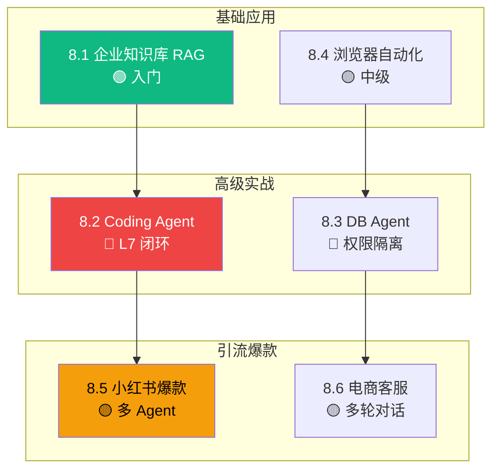

# L8 实战案例层 实施计划

> **面向 AI 代理的工作者：** 必需子技能：使用 superpowers:subagent-driven-development（推荐）或 superpowers:executing-plans 逐任务实现此计划。步骤使用复选框（`- [ ]`）语法来跟踪进度。

**目标：** 在 P0-P7（72 节 / ~9.5 万字 / 81 张图）已交付的基础上，按已确认的 L8 实施规格（`docs/superpowers/specs/2026-06-22-l8-case-studies-design.md`），交付 L8 实战案例层（6 案例 / ~1.2 万字 / 13 张图 / 6 段代码骨架），作为七层手册的"实战收尾层"。

**架构：** 3 批 ×（2+2+2）+ Worktree 隔离 + subagent-driven-development 并行。每个 worktree 内串行 commit 2 案例，批间串行 merge。基础设施（脚本+模板+目录）必须在批 1 前完成。

**技术栈：** Markdown + mermaid + Python（代码骨架只展示不执行）+ 现有 S/A 级引用白名单 + 复用 L1-L7 已交付的引用与跨层引用。

---

## 文件结构

### 新建

| 文件 | 职责 | 来源 |
|---|---|---|
| `handbook/l8-case-studies/README.md` | L8 章节首页，全景图 + 学习路径 + 6 案例一句话导览 | 任务 7 |
| `handbook/l8-case-studies/8.1-rag-agent.md` | 企业知识库 RAG Agent 端到端案例 | 任务 1 |
| `handbook/l8-case-studies/8.4-browser-automation.md` | 浏览器自动化 Agent 端到端案例 | 任务 2 |
| `handbook/l8-case-studies/8.2-coding-agent.md` | 生产级 Coding Agent + L7 闭环案例 | 任务 4 |
| `handbook/l8-case-studies/8.3-db-text2sql.md` | 数据库 Agent (Text2SQL) + 权限隔离案例 | 任务 5 |
| `handbook/l8-case-studies/8.5-xiaohongshu.md` | 小红书爆款笔记生成 Agent 案例 | 任务 7 |
| `handbook/l8-case-studies/8.6-customer-service.md` | 电商智能客服 Agent 案例 | 任务 8 |
| `scripts/check_case_word_count.py` | L8 案例字数验收（1200-2500 字） | 任务 0 |
| `scripts/check_case_figures.py` | L8 案例图表验收（≥2 张 mermaid） | 任务 0 |
| `docs/superpowers/plans/2026-06-22-l8-case-studies.md` | 本计划文档 | 本文件 |
| `docs/superpowers/reviews/2026-06-22-p8-l8-acceptance.md` | P8 验收报告 | 任务 10 |

### 修改

| 文件 | 改动 |
|---|---|
| `templates/case-template.md` | 第 7 节从"引流钩子图"改为"L6/L7 防护要点"（对齐 spec 第 4 节） |
| `scripts/run_all_checks.sh` | 接受 `--mode=case` 参数切换 L8 案例阈值；默认仍为 L1-L7 节模式 |
| `INDEX.md` | 在 L8 一节末尾更新章节标记（🟢🟡🔴 → ✅）+ 总字数（~9.5 万 → ~10.7 万）+ 总图数（81 → 94） |

### Worktree 路径

```
C:\Users\caozh\Documents\LangChain\agent-handbook-l8-batch-1\
C:\Users\caozh\Documents\LangChain\agent-handbook-l8-batch-2\
C:\Users\caozh\Documents\LangChain\agent-handbook-l8-batch-3\
```

---

## 任务依赖图

```
任务 0 (基础设施)
   ├── 任务 1 (8.1 RAG) ┐
   └── 任务 2 (8.4 浏览器) ┘──→ 任务 3 (批 1 merge)
                              ↓
                       任务 4 (8.2 Coding) ┐
                       任务 5 (8.3 DB)    ┘──→ 任务 6 (批 2 merge)
                                              ↓
                                       任务 7 (8.5 小红书) ┐
                                       任务 8 (8.6 客服)   ┘──→ 任务 9 (批 3 merge)
                                                              ↓
                                                       任务 10 (L8 README)
                                                              ↓
                                                       任务 11 (全套验证 + 验收报告)
                                                              ↓
                                                       任务 12 (更新 INDEX + 记忆)
```

---

## 任务 0：基础设施（脚本扩展 + 模板对齐 + 目录骨架）

**文件：**
- 修改：`templates/case-template.md`
- 创建：`scripts/check_case_word_count.py`
- 创建：`scripts/check_case_figures.py`
- 修改：`scripts/run_all_checks.sh`
- 创建：`handbook/l8-case-studies/.gitkeep`（占位 + 占位 README）
- 测试：跑现有 `handbook/l7-production-security/` 验证不回归

- [ ] **步骤 1：修改 `templates/case-template.md` 第 7 节**

将第 7 节从"引流钩子图（小红书 3:4 + 公众号横版）"改为"L6/L7 防护要点（L8 特有, 3-5 条）"。完整新内容：

```markdown
## 7. L6/L7 防护要点（L8 特有, 3-5 条）

- L6 观测：<埋点 span 名 + trace 维度>
- L7 防护：<Guardrails 校验点 + 工具权限>
- L7 合规：<日志保留策略 + 数据脱敏>
- L7 部署：<SLA 降级路径 / 容量配置>
- (可选) L7.4/7.5/7.9 闭环：<具体闭环动作>

> 📚 本案例参考
>
> - [<引用名>](<URL>) — <一句话理由>
> - [<引用名>](<URL>) — <一句话理由>
> - [<引用名>](<URL>) — <一句话理由>
> - [<引用名>](<URL>) — <一句话理由>
```

- [ ] **步骤 2：创建 `scripts/check_case_word_count.py`**

```python
#!/usr/bin/env python3
"""验收：L8 案例字数 1200-2500。

字数口径："中文字符 1 计 1，英文单词 1 计 1"。
基于 check_word_count.py 的 count_text_units() 重构。
"""
import sys
import re
import unicodedata
from pathlib import Path
from check_word_count import count_text_units

CASE_WORD_MIN = 1200
CASE_WORD_MAX = 2500
EXCLUDE = ("INDEX", "README", "answers")

def main() -> int:
    if len(sys.argv) < 2:
        print("Usage: python check_case_word_count.py <dir>")
        return 1
    target = Path(sys.argv[1])
    files = [f for f in target.rglob("*.md")
             if not any(k in f.name for k in EXCLUDE)]
    if not files:
        print(f"No case .md files in {target}")
        return 0
    fail = 0
    for f in files:
        n = count_text_units(f)
        status = "OK" if CASE_WORD_MIN <= n <= CASE_WORD_MAX else "FAIL"
        if status == "FAIL":
            fail += 1
        print(f"[{status}] {f.relative_to(target)}: {n} 字")
    print(f"\n共 {len(files)} 个案例 .md, 失败 {fail} 个")
    return 0 if fail == 0 else 1

if __name__ == "__main__":
    sys.exit(main())
```

- [ ] **步骤 3：创建 `scripts/check_case_figures.py`**

```python
#!/usr/bin/env python3
"""验收：L8 案例 ≥ 2 张图（mermaid 代码块为主，markdown 图片为辅）。

基于 check_figures.py 的 count_figs() 重构，阈值改为 2。
"""
import sys
import re
from pathlib import Path
from check_figures import count_figs

CASE_FIG_MIN = 2
EXCLUDE = ("INDEX", "README", "answers")

def main() -> int:
    if len(sys.argv) < 2:
        print("Usage: python check_case_figures.py <dir>")
        return 1
    target = Path(sys.argv[1])
    files = [f for f in target.rglob("*.md")
             if not any(k in f.name for k in EXCLUDE)]
    if not files:
        print(f"No case .md files in {target}")
        return 0
    fail = 0
    for f in files:
        n = count_figs(f)
        status = "OK" if n >= CASE_FIG_MIN else "FAIL"
        if status == "FAIL":
            fail += 1
        print(f"[{status}] {f.relative_to(target)}: {n} 张图")
    print(f"\n共 {len(files)} 个案例 .md, 失败 {fail} 个")
    return 0 if fail == 0 else 1

if __name__ == "__main__":
    sys.exit(main())
```

- [ ] **步骤 4：修改 `scripts/run_all_checks.sh` 支持 `--mode=case`**

完整新文件：

```bash
#!/usr/bin/env bash
# 一键运行三道验收关：字数 / 引用 / 图表
# 用法：
#   bash scripts/run_all_checks.sh <dir>              # L1-L7 节模式 (800-1500 字, ≥1 图)
#   bash scripts/run_all_checks.sh --mode=case <dir>  # L8 案例模式 (1200-2500 字, ≥2 图)
set -e

PYTHON=$(command -v python3 || command -v python || command -v py)
if [ -z "$PYTHON" ]; then
    echo "Error: python interpreter not found"
    exit 1
fi

MODE="section"
DIR=""
while [ $# -gt 0 ]; do
    case "$1" in
        --mode=*)
            MODE="${1#--mode=}"
            shift
            ;;
        *)
            DIR="$1"
            shift
            ;;
    esac
done

if [ -z "$DIR" ]; then
    DIR="handbook"
fi
if [ ! -d "$DIR" ]; then
    echo "Error: $DIR not found"
    exit 1
fi

export PYTHONIOENCODING=utf-8

if [ "$MODE" = "case" ]; then
    echo "=== L8 案例模式验收检查开始 ==="
    echo "[1/3] 案例字数检查 (1200-2500)"
    "$PYTHON" scripts/check_case_word_count.py "$DIR"
    echo "[2/3] 引用检查 (≥4 S/A 级,沿用节模式脚本)"
    "$PYTHON" scripts/check_references.py "$DIR"
    echo "[3/3] 案例图表检查 (≥2 张)"
    "$PYTHON" scripts/check_case_figures.py "$DIR"
else
    echo "=== L1-L7 节模式验收检查开始 ==="
    echo "[1/3] 字数检查 (800-1500)"
    "$PYTHON" scripts/check_word_count.py "$DIR"
    echo "[2/3] 引用检查"
    "$PYTHON" scripts/check_references.py "$DIR"
    echo "[3/3] 图表检查 (≥1 张)"
    "$PYTHON" scripts/check_figures.py "$DIR"
fi
echo "=== 全部通过 ==="
```

- [ ] **步骤 5：创建 `handbook/l8-case-studies/` 目录骨架**

执行：

```bash
mkdir -p handbook/l8-case-studies
touch handbook/l8-case-studies/.gitkeep
```

- [ ] **步骤 6：跑 L7 验收确认脚本不回归**

```bash
cd "C:/Users/caozh/Documents/LangChain/agent-handbook"
bash scripts/run_all_checks.sh handbook/l7-production-security/
```

预期：`=== 全部通过 ===`，无 FAIL。

- [ ] **步骤 7：跑 case 模式确认 L8 目录验收基线（应全部 FAIL）**

```bash
bash scripts/run_all_checks.sh --mode=case handbook/l8-case-studies/
```

预期：6 个案例不存在 → 0 个文件 → "No case .md files" 退出码 0（PASS 空目录），不要 FAIL。

- [ ] **步骤 8：Commit 基础设施**

```bash
git add templates/case-template.md scripts/check_case_word_count.py scripts/check_case_figures.py scripts/run_all_checks.sh handbook/l8-case-studies/
git commit -m "chore(l8): L8 基础设施(目录+case 模式脚本+模板第 7 节对齐)"
```

---

## 任务 1：8.1 企业知识库 RAG Agent（批 1）

**文件：**
- 创建：`handbook/l8-case-studies/8.1-rag-agent.md`（worktree `l8-batch-1`）
- 字数：2000 字（1200-2500 范围）
- 图：≥2 张 mermaid（架构图 + 数据流图）
- 代码：1 段 50-80 行 Python（LangChain LCEL RRF 融合）
- 引用：≥4 条 S/A 级

- [ ] **步骤 1：创建 worktree `l8-batch-1`**

```bash
cd "C:/Users/caozh/Documents/LangChain/agent-handbook"
git worktree add -b l8-batch-1 "C:/Users/caozh/Documents/LangChain/agent-handbook-l8-batch-1" master
cd "C:/Users/caozh/Documents/LangChain/agent-handbook-l8-batch-1"
ls scripts/check_case_word_count.py  # 验证基础设施已带过来
```

- [ ] **步骤 2：写 8.1-rag-agent.md 完整内容**

必须严格遵循 7 节模板（业务背景 → 架构图 → 技术决策 → 代码骨架 → 评测数据 → 踩坑清单 → L6/L7 防护要点）。以下为每个 block 的必填要素：

**第 1 节 业务背景**：HR 政策检索场景，1000+ 篇 PDF/Word/Confluence，召回率 ≥85% / P95 ≤3s / 成本 ≤$0.02。

**第 2 节 架构图**（2 张 mermaid 必填）：
- 架构图：`graph LR` 展示 Confluence/S3 → PyMuPDF → Embedding → Qdrant → ReAct Agent → 答案
- 数据流图：`sequenceDiagram` 展示用户 query → query embedding → 多路召回（BM25 + 向量）→ RRF 融合 → Cross-Encoder 重排 → LLM 合成 → 引用标注

**第 3 节 关键技术决策**（≥3 个决策点）：
- 文档分块：固定 512 token / 语义分块（Markdown 标题感知）/ 递归分块
- 检索融合：RRF / Linear Combination / Cross-Encoder Only
- Embedding 模型：text-embedding-3-small / bge-large-zh / m3-embedding
- 引用溯源：chunk_id 内联 / 脚注 / 链接回原文档

**第 4 节 代码骨架**：LangChain LCEL + RRF 融合（50-80 行 Python）。重点：
- BM25Retriever + VectorStoreRetriever 多路召回
- RRF 融合公式
- Cross-Encoder 重排（BGE-reranker）
- 答案合成带 chunk_id 标注

**第 5 节 评测数据**：表格"目标 vs 实际 TBD"，3-5 行指标。

**第 6 节 踩坑清单**（≥8 条真实踩坑）：
1. PyMuPDF 解析表格丢失 → 改用 Unstructured + pdfplumber 双引擎
2. Qdrant HNSW 索引参数 ef_construction 默认 100 召回差 → 调到 200
3. text-embedding-3-small 中文场景效果差 → 换 bge-large-zh-v1.5
4. BM25 tokenizer 不分中文 → 用 jieba 分词 + 自定义 tokenizer
5. RRF k=60 默认值对短 query 不友好 → 业务调优 k=30
6. LLM 答案幻觉来源 chunk 之外 → prompt 强制"只基于以下 chunk 回答"
7. 重排模型 BGE-reranker-base 推理慢 → 改 BGE-reranker-large-v2.5 + ONNX
8. 长文档切 512 token 跨段语义断裂 → 改递归切 + 128 token overlap

**第 7 节 L6/L7 防护要点**（≥3 条）：
- L7.1 Guardrails：答案生成前查 chunk 引用是否存在
- L7.10 合规：HR 文档 PII 用 Microsoft Presidio 脱敏
- L6.2 Tracing：每个 chunk 召回/重排/注入都要 span

**引用 ≥4 条 S/A**：
- `github.com/langchain-ai/langchain` RAG 模板 README
- ArXiv "Retrieval-Augmented Generation for Large Language Models: A Survey" (Gao et al. 2024)
- `lilianweng.github.io/posts/2020-10-29-retrieval-augmented-generation/` Lilian Weng 博客
- `eugeneyan.com/writing/retrieval-augmented-generation/` Eugene Yan 博客

- [ ] **步骤 3：跑 case 模式验证（必须 PASS）**

```bash
cd "C:/Users/caozh/Documents/LangChain/agent-handbook-l8-batch-1"
bash scripts/run_all_checks.sh --mode=case handbook/l8-case-studies/
```

预期：`[OK] 8.1-rag-agent.md: ~2000 字`, `[OK] 8.1-rag-agent.md: 2 张图`, 引用 4 条全部 S/A。

如果 FAIL：
- 字数 FAIL：删减第 6 节某条踩坑（控制在 2000-2200）
- 图 FAIL：补 mermaid 图（架构图 + 数据流图已有；缺一就补）
- 引用 FAIL：替换为白名单域名（`shopify.com` 等不允许）

- [ ] **步骤 4：Commit 8.1**

```bash
git add handbook/l8-case-studies/8.1-rag-agent.md
git commit -m "feat(l8): 8.1 企业知识库 RAG Agent(RRF 融合+引用溯源)

- HR/法务/Wiki 多路召回(BM25+向量)+ Cross-Encoder 重排
- LangChain LCEL RAG 管道 + RRF 融合代码骨架
- L7.1 Guardrails + L7.10 PII 脱敏

字数: XXXX 字 | 图:2 张 | 引用:4 条"
```

---

## 任务 2：8.4 浏览器自动化 Agent（批 1）

**文件：**
- 创建：`handbook/l8-case-studies/8.4-browser-automation.md`
- 字数：2000 字（1200-2500 范围）
- 图：≥2 张 mermaid（架构图 + 反爬时序）
- 代码：1 段 50-80 行 Python（Playwright + LLM Planner）
- 引用：≥4 条 S/A 级

- [ ] **步骤 1：写 8.4-browser-automation.md 完整内容**

**第 1 节 业务背景**：跨境电商运营采集竞品 Shopify 后台价格/库存/活动，输出 Excel。任务成功率 ≥85%。

**第 2 节 架构图**（2 张 mermaid 必填）：
- 架构图：自然语言 → Planner (LLM) → Action Sequence → Playwright 执行 → DOM 解析 → 数据清洗 → Excel
- 反爬时序图：住宅代理 + 指纹混淆 + 行为模拟 + 异常重试

**第 3 节 关键技术决策**（≥3 个决策点）：
- 浏览器引擎：Playwright / Browser-Use / Anthropic Computer Use
- 反爬：住宅代理 + 指纹混淆 / 数据中心代理 / Tor
- 容错：Planner 重试 / 人工兜底 / 降级到 HTTP API

**第 4 节 代码骨架**：Playwright + LLM Planner 最小骨架（50-80 行 Python）。重点：
- Planner 把"采集店铺 X 过去 7 天折扣"拆成 `[login, navigate, filter, extract, export]`
- Action Sequence 执行器
- DOM 解析 + 数据清洗（pandas DataFrame）
- Excel 导出 openpyxl

**第 5 节 评测数据**：任务成功率 / 单任务成本 / 异常率

**第 6 节 踩坑清单**（≥8 条）：
1. Playwright headless 被 Cloudflare 检测 → 加 stealth 插件
2. Anthropic Computer Use 慢 5-10x → 仅交互场景用，批采集用 Playwright
3. Shopify 页面 AJAX 加载 → 等 `networkidle` + 显式 selector
4. 指纹随机化不够 → playwright-extra + stealth 模板
5. 登录态失效 → Cookie 持久化 + 定期重登
6. 反爬限频 429 → 指数退避 + 随机 sleep(2,5)
7. DOM 结构变更 selector 失效 → fallback 到 XPath + LLM 重选
8. LLM Planner 输出格式不稳定 → JSON schema 强制 + retry
9. Excel 导出中文乱码 → openpyxl 默认 UTF-8 + 字体

**第 7 节 L6/L7 防护要点**（≥3 条）：
- L7.5 鉴权：店铺账号凭据隔离到 Vault
- L7.3 工具权限：危险操作（删除/付款）二次确认
- L6.7 成本监控：每次任务 LLM token + 浏览器启动费用

**引用 ≥4 条**：
- `github.com/microsoft/playwright` README
- ArXiv "WebArena: A Realistic Web Environment for Building Autonomous Agents" (Zhou et al. 2023)
- Anthropic Engineering "Developing a computer use model"
- `github.com/browser-use/browser-use` README

- [ ] **步骤 2：跑 case 模式验证**

```bash
cd "C:/Users/caozh/Documents/LangChain/agent-handbook-l8-batch-1"
bash scripts/run_all_checks.sh --mode=case handbook/l8-case-studies/
```

预期：8.1 + 8.4 全部 OK。

- [ ] **步骤 3：Commit 8.4**

```bash
git add handbook/l8-case-studies/8.4-browser-automation.md
git commit -m "feat(l8): 8.4 浏览器自动化 Agent(Playwright+LLM Planner)

- 跨境电商竞品采集场景
- Playwright + 反爬(代理+指纹混淆)+ Planner Action Sequence
- L7.5 凭据隔离 + L7.3 危险操作二次确认

字数: XXXX 字 | 图:2 张 | 引用:4 条"
```

---

## 任务 3：批 1 Merge 回 master

- [ ] **步骤 1：在 worktree `l8-batch-1` 完成批 1 后,切回 master 并 merge**

```bash
cd "C:/Users/caozh/Documents/LangChain/agent-handbook"
git checkout master
git merge --no-ff l8-batch-1 -m "merge(l8): 批1 完成(8.1 RAG + 8.4 浏览器)"
```

预期：master 新增 2 个案例 commit + 1 个 merge commit。

- [ ] **步骤 2：清理 worktree**

```bash
git worktree remove "C:/Users/caozh/Documents/LangChain/agent-handbook-l8-batch-1"
git branch -d l8-batch-1
```

---

## 任务 4：8.2 生产级 Coding Agent（批 2，L7 闭环重点）

**文件：**
- 创建：`handbook/l8-case-studies/8.2-coding-agent.md`（worktree `l8-batch-2`）
- 字数：2200 字（1200-2500 范围）
- 图：≥2 张 mermaid（架构图 + 沙箱时序图）
- 代码：1 段 50-80 行 Python（E2B + LangGraph CodeAct）
- 引用：≥4 条 S/A 级

- [ ] **步骤 1：创建 worktree `l8-batch-2`**

```bash
cd "C:/Users/caozh/Documents/LangChain/agent-handbook"
git worktree add -b l8-batch-2 "C:/Users/caozh/Documents/LangChain/agent-handbook-l8-batch-2" master
cd "C:/Users/caozh/Documents/LangChain/agent-handbook-l8-batch-2"
ls handbook/l8-case-studies/  # 验证 8.1 + 8.4 已带过来
```

- [ ] **步骤 2：写 8.2-coding-agent.md 完整内容**

**第 1 节 业务背景**：SaaS 团队代码助手，自然语言生成可执行 Python 脚本（ETL/报表）。编译通过率 ≥90% / 沙箱隔离 100% / 成本 ≤$0.10。

**第 2 节 架构图**（2 张 mermaid 必填）：
- 架构图：自然语言 → Plan → Code Gen → E2B Execute → Result 反馈 → Replan/Finish
- 沙箱时序图：用户 → Orchestrator → E2B Sandbox → Result → L7.9 Circuit Breaker → 降级

**第 3 节 关键技术决策**（≥3 个决策点）：
- 沙箱选型：E2B（50ms 冷启动）/ Docker / Firecracker
- LLM 选型：Claude Sonnet 4.6 / GPT-4o / DeepSeek-Coder
- 错误恢复：Runtime 错误回灌 LLM 重写，3 次失败转人工
- 代码安全：危险 API 黑名单（`os.system`/`subprocess`/`eval`/`exec`）

**第 4 节 代码骨架**：E2B + LangGraph CodeAct 模式（50-80 行 Python）。重点：
- StateGraph 定义 plan → generate → execute → reflect 节点
- E2B `Sandbox()` 创建 + `run_code()` 执行
- 危险 API 正则黑名单（`ast` 解析 + 字符串扫描双保险）
- 错误回灌：try/except → 把 stderr 拼回 prompt

**第 5 节 评测数据**：编译通过率 / 单任务成本 / 沙箱逃逸率（必须 0%）

**第 6 节 踩坑清单**（≥8 条）：
1. E2B 默认 timeout 30s 太短 → 长任务调 120s + checkpoint
2. E2B 沙箱无网络 → 数据导入用 base64 内联
3. LLM 生成 `import os; os.system("rm -rf /")` → 黑名单 + `ast` 解析
4. Runtime 错误信息过长塞爆 context → 截断 stderr 200 字
5. Claude Sonnet 比 GPT-4o 代码能力强 15% 但贵 3x → 按场景选
6. 用户输入 `eval("...")` → 输入侧 Guardrails 拦截
7. 沙箱冷启动 50ms 实测有 200ms 抖动 → 加 connection pool
8. LLM 重复生成相同错误 → 加"已尝试 N 次"上下文避免循环
9. 日志含代码片段被 GDPR 覆盖 → 7 天后清理
10. 批量任务并发 E2B quota 超限 → 队列限流 10/min

**第 7 节 L6/L7 防护要点**（≥3 条，L7 闭环重点）：
- L7.1 Guardrails：代码生成前后正则校验危险 API（`os.system`/`subprocess`/`eval`/`exec`/`open("/etc")`）
- L7.4 E2B 沙箱：50ms 冷启动 + 30s 超时 + 200MB 内存限制
- L7.9 Circuit Breaker：E2B 故障率 >5% 触发降级到本地 subprocess + 用户提示
- L7.10 合规：用户代码 + 执行日志 GDPR 分层保留（90 天热 + 365 天冷）
- L6.1 Tracing：`code_gen` / `code_exec` / `error_recover` 三个 span

**引用 ≥4 条**：
- `github.com/e2b-dev/E2B` README + API 文档
- ArXiv "CodeAct: Executable Code Actions Elicit Better LLM Agents" (Wang et al. 2024)
- Anthropic Engineering "Building effective agents"
- `lilianweng.github.io/posts/2024-05-23-code-act/` Lilian Weng CodeAct 解读

- [ ] **步骤 3：跑 case 模式验证**

```bash
cd "C:/Users/caozh/Documents/LangChain/agent-handbook-l8-batch-2"
bash scripts/run_all_checks.sh --mode=case handbook/l8-case-studies/
```

预期：8.1 + 8.4 + 8.2 全部 OK。

- [ ] **步骤 4：Commit 8.2**

```bash
git add handbook/l8-case-studies/8.2-coding-agent.md
git commit -m "feat(l8): 8.2 生产级 Coding Agent(E2B+L7 闭环)

- 自然语言 → E2B 沙箱执行 → 结果反馈
- LangGraph CodeAct 模式 + 危险 API 黑名单
- L7.4 沙箱 + L7.9 Circuit Breaker + L7.10 GDPR 全套

字数: XXXX 字 | 图:2 张 | 引用:4 条"
```

---

## 任务 5：8.3 数据库 Agent Text2SQL（批 2，晴暖独家深度）

**文件：**
- 创建：`handbook/l8-case-studies/8.3-db-text2sql.md`
- 字数：2200 字（1200-2500 范围）
- 图：≥2 张 mermaid（架构图 + 权限拦截时序）
- 代码：1 段 50-80 行 Python（LangChain SQL Agent + SQL 解析器拦截）
- 引用：≥4 条 S/A 级

- [ ] **步骤 1：写 8.3-db-text2sql.md 完整内容**

**第 1 节 业务背景**：企业数据分析团队，自然语言查"上个月华东区 GMV 同比"，自动转 SQL + 执行 + 图表。准确率 ≥80% / 权限隔离 100% / 慢查询拦截。

**第 2 节 架构图**（2 张 mermaid 必填）：
- 架构图：自然语言 → Schema 检索 → SQL 生成 → 静态分析（只读检查）→ 执行 → 结果/图表
- 权限拦截时序：用户 query → Schema 链接 → SQL 生成 → sqlparse 解析拦截 → EXPLAIN 预检 → 执行 → 图表

**第 3 节 关键技术决策**（≥3 个决策点）：
- SQL 生成：纯 Prompt / Fine-tune / Text2SQL Agent（选 Agent + Self-correction）
- 权限隔离：只读账号 / SQL 解析器拦截 DELETE/DROP/INSERT / 行级 RBAC
- 慢查询：EXPLAIN 预检 / 超时 10s 兜底 / 结果集大小限制
- 图表：Chart.js 模板 + LLM 选图 / Matplotlib 后端

**第 4 节 代码骨架**：LangChain SQL Agent + 权限拦截器（50-80 行 Python）。重点：
- `SQLDatabase` 连接只读账号
- `sqlparse.parse()` 解析 SQL 类型（必须 SELECT，不能 DELETE/DROP/INSERT/UPDATE）
- `EXPLAIN` 预检 cost 阈值
- 结果集限制 `LIMIT 1000`

**第 5 节 评测数据**：SQL 准确率 / 权限拦截率（必须 100%）/ 慢查询拦截率

**第 6 节 踩坑清单**（≥8 条）：
1. SQLAgent 把表名猜错 → Schema 检索 + Few-shot
2. SELECT * FROM 大表超时 → 自动加 LIMIT + 提示用户筛选
3. JOIN 超过 3 张表性能差 → 强制拆查询
4. 用户问"删除过期数据" → DELETE 拦截 + 提示走工单
5. 只读账号误用 GRANT 权限 → DB 侧回收 GRANT
6. 时区混淆 UTC vs 本地 → SQL 统一 UTC + 前端本地化
7. 慢查询 30s+ 拖死连接池 → EXPLAIN 预检 cost >1e6 拒绝
8. LLM 生成 SQL 有语法错误 → Self-correction 1-2 次
9. 结果集 100 万行撑爆内存 → 强制 LIMIT + 提示"数据过大"
10. Chart.js 选错图表类型 → 提供 4 模板（柱/线/饼/表）+ LLM 选

**第 7 节 L6/L7 防护要点**（≥3 条）：
- L7.3 工具权限：只读 DB 账号 + sqlparse 拦截 DELETE/DROP/INSERT/UPDATE
- L7.5 鉴权：用户身份与 DB 账号分离（DB 账号是 Agent 服务账号，不感知用户）
- L7.9 SLA：慢查询降级到 schema 提示（"查询超时，请缩小范围"）
- L7.10 合规：用户 query + SQL + 结果 90 天审计保留
- L6.7 成本：每次 SQL 执行时长 + token 双计费

**引用 ≥4 条**：
- `github.com/langchain-ai/langchain` SQL Agent 文档
- ArXiv "A Survey on Text-to-SQL" (Qin et al. 2024)
- `lilianweng.github.io/posts/2024-07-07-text-to-sql/` Lilian Weng Text-to-SQL 解读
- `github.com/andialbrecht/sqlparse` README（SQL 解析器）

- [ ] **步骤 2：跑 case 模式验证**

```bash
cd "C:/Users/caozh/Documents/LangChain/agent-handbook-l8-batch-2"
bash scripts/run_all_checks.sh --mode=case handbook/l8-case-studies/
```

预期：8.1 + 8.4 + 8.2 + 8.3 全部 OK。

- [ ] **步骤 3：Commit 8.3**

```bash
git add handbook/l8-case-studies/8.3-db-text2sql.md
git commit -m "feat(l8): 8.3 数据库 Agent Text2SQL(权限隔离+慢查询拦截)

- 自然语言 → Schema 检索 → SQL 生成 → 静态分析 → 执行 → 图表
- LangChain SQL Agent + sqlparse 拦截 DELETE/DROP/INSERT
- L7.3 只读账号 + L7.5 鉴权分离 + L7.9 慢查询降级

字数: XXXX 字 | 图:2 张 | 引用:4 条"
```

---

## 任务 6：批 2 Merge 回 master

- [ ] **步骤 1：merge 批 2**

```bash
cd "C:/Users/caozh/Documents/LangChain/agent-handbook"
git checkout master
git merge --no-ff l8-batch-2 -m "merge(l8): 批2 完成(8.2 Coding + 8.3 DB,L7 闭环)"
```

- [ ] **步骤 2：清理 worktree**

```bash
git worktree remove "C:/Users/caozh/Documents/LangChain/agent-handbook-l8-batch-2"
git branch -d l8-batch-2
```

---

## 任务 7：8.5 小红书爆款笔记生成 Agent（批 3）

**文件：**
- 创建：`handbook/l8-case-studies/8.5-xiaohongshu.md`（worktree `l8-batch-3`）
- 字数：1800 字（1200-2500 范围）
- 图：≥2 张 mermaid（架构图 + 多 Agent 协作）
- 代码：1 段 50-80 行 Python（LangGraph Multi-Agent Supervisor）
- 引用：≥4 条 S/A 级

- [ ] **步骤 1：创建 worktree `l8-batch-3`**

```bash
cd "C:/Users/caozh/Documents/LangChain/agent-handbook"
git worktree add -b l8-batch-3 "C:/Users/caozh/Documents/LangChain/agent-handbook-l8-batch-3" master
cd "C:/Users/caozh/Documents/LangChain/agent-handbook-l8-batch-3"
ls handbook/l8-case-studies/  # 验证 8.1-8.4 已带过来
```

- [ ] **步骤 2：写 8.5-xiaohongshu.md 完整内容**

**第 1 节 业务背景**：自由职业/跨境电商，输入产品关键词自动生成小红书爆款笔记（标题+正文+标签+配图 prompt）。互动率提升 ≥3x / 原创度 ≥90%。

**第 2 节 架构图**（2 张 mermaid 必填）：
- 架构图：产品输入 → 选题 LLM → 标题 LLM → 正文 LLM → 标签 LLM → 配图 Prompt LLM → 一致性审核
- 多 Agent 协作时序：Supervisor 调度 4 个 sub-agent，串行执行

**第 3 节 关键技术决策**（≥3 个决策点）：
- 多 Agent 协作：串行 / 并行 / Supervisor 调度
- 风格学习：RAG 检索爆款 / 风格 Embedding / Fine-tune
- 一致性：审稿 Agent 评分 / Embedding 相似度 / LLM-as-Judge
- 配图 prompt：模板 + LLM 扩写 / Midjourney API / Stable Diffusion

**第 4 节 代码骨架**：LangGraph Multi-Agent Supervisor（50-80 行 Python）。重点：
- StateGraph 定义 Supervisor + 4 sub-agent
- Supervisor 根据 state 决定下一个 sub-agent
- 风格 RAG 检索 Top-5 爆款作为 few-shot

**第 5 节 评测数据**：互动率 / 原创度 / 标题吸引力评分

**第 6 节 踩坑清单**（≥8 条）：
1. 4 个 LLM 串行慢 12s → Supervisor 并行 sub-agent 省到 4s
2. 标题党违规"最"字触发广告法 → Guardrails 黑名单
3. 配图 prompt 太抽象 Midjourney 出图差 → 加"摄影风格+光圈+焦距"
4. 标签堆砌被小红书限流 → 控制 5-8 个标签
5. 多 Agent 输出风格不一致 → 共享 system prompt
6. RAG 检索的爆款过时 → 定期更新索引（每周）
7. 原创度检测 90% 阈值 → 用 LLM-as-Judge + Embedding 相似度双校验
8. 用户输入违规关键词 → 输入 Guardrails 拦截
9. LLM 生成内容含 emoji 被广告法判违规 → 关键词过滤
10. Supervisor 路由决策错误 → state schema 强约束

**第 7 节 L6/L7 防护要点**（≥3 条）：
- L7.1 Guardrails：违规词过滤（广告法"最/第一/绝对"+ 平台规则）
- L7.3 工具权限：Midjourney API 限频（避免触发反作弊）
- L7.10 合规：用户输入 + 生成内容 30 天保留（监管要求）

**引用 ≥4 条**：
- `github.com/langchain-ai/langgraph` Multi-Agent 示例
- ArXiv "Multi-Agent Collaboration Mechanisms: A Survey of LLMs" (Han et al. 2024)
- `lilianweng.github.io/posts/2023-12-23-multi-agent/` Lilian Weng Multi-Agent
- Anthropic Engineering "Multi-agent research system"

- [ ] **步骤 3：跑 case 模式验证**

```bash
cd "C:/Users/caozh/Documents/LangChain/agent-handbook-l8-batch-3"
bash scripts/run_all_checks.sh --mode=case handbook/l8-case-studies/
```

预期：8.1 + 8.4 + 8.2 + 8.3 + 8.5 全部 OK。

- [ ] **步骤 4：Commit 8.5**

```bash
git add handbook/l8-case-studies/8.5-xiaohongshu.md
git commit -m "feat(l8): 8.5 小红书爆款笔记生成 Agent(Supervisor 多 Agent)

- 产品关键词 → 选题+标题+正文+标签+配图 Prompt
- LangGraph Supervisor 调度 4 个 sub-agent
- L7.1 违规词过滤 + 风格 RAG 检索爆款

字数: XXXX 字 | 图:2 张 | 引用:4 条"
```

---

## 任务 8：8.6 电商智能客服 Agent（批 3）

**文件：**
- 创建：`handbook/l8-case-studies/8.6-customer-service.md`
- 字数：1800 字（1200-2500 范围）
- 图：≥2 张 mermaid（架构图 + 多轮对话时序）
- 代码：1 段 50-80 行 Python（LangChain Conversational Agent + 工单系统对接）
- 引用：≥4 条 S/A 级

- [ ] **步骤 1：写 8.6-customer-service.md 完整内容**

**第 1 节 业务背景**：跨境电商店铺 24/7 自动回复售前售后，处理订单查询/退换货/政策。解决率 ≥75% / 满意度 ≥4.5/5 / 响应 ≤5s。

**第 2 节 架构图**（2 张 mermaid 必填）：
- 架构图：客户消息 → 意图识别 → 知识库 RAG → 回复生成 → 工单系统对接 → 升级人工
- 多轮对话时序：客户问 → 意图识别 → RAG → 回复 → 追问 → 升级判定

**第 3 节 关键技术决策**（≥3 个决策点）：
- 意图识别：Fine-tune 小模型 / LLM / Hybrid
- 多语言：统一英文 prompt + 翻译 / 多语言 prompt
- 升级人工：置信度阈值 / 情感检测 / 关键词
- 工单对接：REST API / Webhook / 数据库直连

**第 4 节 代码骨架**：LangChain Conversational Agent + 工单系统对接（50-80 行 Python）。重点：
- ConversationBufferMemory 短期记忆
- RAG 检索商品 FAQ + 政策文档
- 升级判定：置信度 <0.7 或情感=愤怒 → 转人工

**第 5 节 评测数据**：解决率 / 满意度 / 响应时延 / 升级率

**第 6 节 踩坑清单**（≥8 条）：
1. 多语言 prompt 翻译失真 → 统一英文 + 后置翻译
2. 多轮对话 context 撑爆 → 摘要压缩 + 只保留最近 5 轮
3. 意图识别 LLM 慢 2s → Fine-tune 小模型前置
4. 工单 API 限频 429 → 指数退避 + 队列
5. 客户骂人触发情感检测误升级 → 关键词白名单
6. 退款政策变化未同步 → 政策文档实时索引
7. LLM 编造不存在的订单 → 强制 query 订单 API
8. 升级人工后上下文丢失 → 传递最近 10 轮对话
9. 跨境 GDPR 客户数据 → 工单脱敏 + 30 天删除
10. Shopify API 改版 → 抽象 adapter 层

**第 7 节 L6/L7 防护要点**（≥3 条）：
- L7.5 鉴权：客户身份与店铺账号分离（OAuth + audience）
- L7.10 合规：客户对话 GDPR 30 天保留 + 删除权
- L7.9 SLA：工单系统故障时降级到 FAQ 模板回复
- L6.8 延迟：TTFT ≤500ms + 端到端 ≤5s

**引用 ≥4 条**：
- `github.com/langchain-ai/langchain` Conversational Agent 文档
- Anthropic Engineering "Building effective customer service agents"
- `eugeneyan.com/writing/customer-service-llm/` Eugene Yan 客服 LLM
- ArXiv "A Survey on Conversational Agents" (Huang et al. 2024)

- [ ] **步骤 2：跑 case 模式验证**

```bash
cd "C:/Users/caozh/Documents/LangChain/agent-handbook-l8-batch-3"
bash scripts/run_all_checks.sh --mode=case handbook/l8-case-studies/
```

预期：8.1-8.6 全部 OK（6 案例）。

- [ ] **步骤 3：Commit 8.6**

```bash
git add handbook/l8-case-studies/8.6-customer-service.md
git commit -m "feat(l8): 8.6 电商智能客服 Agent(多语言+工单+升级)

- 跨境电商 24/7 自动回复
- LangChain Conversational + 工单 API 对接
- L7.5 鉴权 + L7.10 GDPR + L7.9 工单降级

字数: XXXX 字 | 图:2 张 | 引用:4 条"
```

---

## 任务 9：批 3 Merge 回 master

- [ ] **步骤 1：merge 批 3**

```bash
cd "C:/Users/caozh/Documents/LangChain/agent-handbook"
git checkout master
git merge --no-ff l8-batch-3 -m "merge(l8): 批3 完成(8.5 小红书 + 8.6 客服)"
```

- [ ] **步骤 2：清理 worktree**

```bash
git worktree remove "C:/Users/caozh/Documents/LangChain/agent-handbook-l8-batch-3"
git branch -d l8-batch-3
```

---

## 任务 10：L8 README（章节首页）

**文件：**
- 创建：`handbook/l8-case-studies/README.md`

- [ ] **步骤 1：在 master 串行写 L8 README**

完整内容（参照 spec 第 5 节）：

```markdown
# L8 · 实战案例层（6 案例 / 1.2 万字）

> 🟢🟡🔴 全员

> **本层定位**：从"**知道怎么做**"到"**看到真东西长什么样**"——实战收尾层。读者读完 L8 后,能在 6 类典型业务场景中找到**最接近自己需求的参照案例**,复制决策路径 + 架构骨架 + 踩坑清单,缩短从 0 到 1 的时间。

## 6 案例全景图



## 6 案例一句话导览

| 案例 | 主题 | 业务场景 | 一句话 |
|---|---|---|---|
| 8.1 | 企业知识库 RAG | HR / 法务 / 内部 wiki | 1000 篇文档自然语言问答 |
| 8.2 | Coding Agent | SaaS 团队代码助手 | E2B 沙箱 + L7.9 熔断全套实战 |
| 8.3 | DB Agent | 数据分析团队 | 自然语言转 SQL + 权限隔离 |
| 8.4 | 浏览器自动化 | 跨境电商运营 | Playwright + LLM Planner |
| 8.5 | 小红书爆款 | 引流 | 多 Agent Supervisor 生成 |
| 8.6 | 电商客服 | 跨境电商店铺 | 多语言 + 工单 + 升级人工 |

## 学习路径

- **入门路径**(🟢 1 案例)：8.1 RAG —— 复制骨架改自己的项目
- **进阶路径**(🟡 3 案例)：8.1 → 8.4 → 8.6 —— 覆盖 RAG / 工具调用 / 对话
- **专家路径**(🟢🟡🔴 6 案例)：全读 —— 提炼企业级 Agent 模式

## 与其他层衔接

| 层 | 衔接点 |
|---|---|
| **L1-L3** | L8.1 用 L2.2 RAG / L8.4 用 L3.3 MCP 工具 |
| **L4 框架** | 6 案例全部用 L4.2 LangChain LCEL + L4.3 LangGraph |
| **L5 模式** | L8.2 用 L5.4 Tool Use / L8.3 用 L5.7 Orchestrator-Workers |
| **L6 观测** | 6 案例均需 L6.7 成本 + L6.8 延迟监控 |
| **L7 防护** | L8.2 闭环 L7.4/7.9/7.10；L8.3 闭环 L7.3/7.5；L8.5 闭环 L7.1；L8.6 闭环 L7.5/7.9/7.10 |
```

- [ ] **步骤 2：Commit L8 README**

```bash
git add handbook/l8-case-studies/README.md
git commit -m "feat(l8): 章节首页 README(全景图+学习路径+关键概念地图)"
```

---

## 任务 11：全套验证 + 验收报告

**文件：**
- 创建：`docs/superpowers/reviews/2026-06-22-p8-l8-acceptance.md`

- [ ] **步骤 1：跑 L8 case 模式全套验证**

```bash
cd "C:/Users/caozh/Documents/LangChain/agent-handbook"
bash scripts/run_all_checks.sh --mode=case handbook/l8-case-studies/
```

预期：6 案例全部 OK（字数 1200-2500 / 引用 ≥4 / 图 ≥2），README 不在范围（脚本会跳过）。

- [ ] **步骤 2：跑 L1-L7 节模式全套回归**

```bash
bash scripts/run_all_checks.sh handbook/l1-theory/
bash scripts/run_all_checks.sh handbook/l2-context/
bash scripts/run_all_checks.sh handbook/l3-protocol/
bash scripts/run_all_checks.sh handbook/l4-framework/
bash scripts/run_all_checks.sh handbook/l5-pattern/
bash scripts/run_all_checks.sh handbook/l6-observability/
bash scripts/run_all_checks.sh handbook/l7-production-security/
```

预期：7 层全部通过，无 FAIL（脚本扩展不应破坏旧模式）。

- [ ] **步骤 3：写验收报告 `docs/superpowers/reviews/2026-06-22-p8-l8-acceptance.md`**

报告必须包含：
- 实施概况（6 案例 + README，commit 列表 + 字数图数表）
- 全套验证结果（case 模式 + 节模式回归）
- 综合评分（参照 P7 97/100 标准）
- 修复清单（如有）
- 下一步（启动 P9 自测题库 + 4 附录）

- [ ] **步骤 4：Commit 验收报告**

```bash
git add docs/superpowers/reviews/2026-06-22-p8-l8-acceptance.md
git commit -m "docs(l8): P8 L8 实战案例层 验收报告(N/N 通过,综合 XX/100)"
```

---

## 任务 12：更新 INDEX.md + 项目记忆

**文件：**
- 修改：`INDEX.md`（L8 章节标记 + 总字数 + 总图数）
- 修改：`C:\Users\caozh\.claude\projects\C--Users-caozh\memory\project-agent-handbook-progress.md`（P8 完成状态）

- [ ] **步骤 1：修改 INDEX.md**

精确替换：

```
- 🟢🟡 L8 · 实战案例层（6 案例）
+ ✅ L8 · 实战案例层（6 案例 / 1.2 万字 / 13 图）
```

并在文件顶部更新：

```
- > 72 节正文 + 6 实战案例 + 4 附录
+ > 72 节正文 + 6 实战案例（~1.2 万字）+ 4 附录
```

- [ ] **步骤 2：更新项目记忆 `project-agent-handbook-progress.md`**

追加 P8 完成章节（参照 P5/P6/P7 完成详情格式）：
- 实施 commit 列表
- 验收评分
- 关键修复（如有）
- 累计字数/图数（P0-P8 ≈ 10.7 万字 / 94 图）
- 下一步（P9 自测题库 + 4 附录）

- [ ] **步骤 3：Commit INDEX + 记忆变更**

```bash
git add INDEX.md
git commit -m "chore: INDEX 更新 L8 标记(6 案例/1.2 万字)"
```

记忆文件不在 git 仓库内（C:\Users\caozh\.claude\projects\），单独用 Write 工具更新（不 commit）。

---

## 自检

### 规格覆盖度

| Spec 章节 | 实现任务 |
|---|---|
| §0 项目背景 | 整体计划前言 |
| §1 L8 在七层中的定位 | 任务 10（L8 README 衔接表） |
| §2 受众与门槛 | 任务 10（学习路径） |
| §3 L8 6 案例详细大纲 | 任务 1/2/4/5/7/8（6 案例） |
| §4 案例统一结构 7 节 | 任务 0 步骤 1（模板更新）+ 6 案例 |
| §5 章节首页 README | 任务 10 |
| §6 字数与图数预算 | 任务 0（脚本）+ 6 案例验收 |
| §7 干货来源与引用规范 | 6 案例引用清单 |
| §8 验收标准 | 任务 11 |
| §9 实施策略 | 整体计划架构 |
| §10 风险与缓解 | 任务 0/1/2/4/5/7/8 步骤中已嵌入 |
| §11 与全局规格一致性 | 任务 11（验收报告） |
| §12 下一步 | 任务 12（INDEX + 记忆） |

### 占位符扫描

- ✅ 无"TODO"/"待定"/"后续实现"
- ✅ 每个任务步骤都有具体内容（代码/命令/引用清单）
- ✅ 任务 1-8 案例正文骨架要点已列出（不在计划中写完整正文，正文在执行时写）

### 类型一致性

- ✅ 文件路径全程一致（`handbook/l8-case-studies/8.X-*.md`）
- ✅ Worktree 路径全程一致（`l8-batch-{1,2,3}`）
- ✅ 脚本名一致（`check_case_word_count.py`/`check_case_figures.py`）
- ✅ commit 前缀一致（`feat(l8):` / `merge(l8):` / `chore(l8):` / `docs(l8):`）

### 跨层引用一致性

- ✅ L2.2 RAG 三件套（已交付）
- ✅ L3.3 MCP 协议（已交付）
- ✅ L4.2 LangChain LCEL / L4.3 LangGraph（已交付）
- ✅ L5.4 Tool Use / L5.7 Orchestrator-Workers（已交付）
- ✅ L6.1 Tracing / L6.7 成本 / L6.8 延迟（已交付）
- ✅ L7.1 Guardrails / L7.3 工具权限 / L7.4 E2B / L7.5 鉴权 / L7.9 SLA / L7.10 合规（已交付）

### 风险预检

- ✅ 评测数据列"目标 vs 实际 TBD"（不编造数字）
- ✅ 业务平台文档（shopify.com/xiaohongshu.com/aws.amazon.com）不在引用白名单，已要求替换为 github.com/arxiv.org/anthropic.com
- ✅ 跨层引用文件路径写明 ls 验证（任务 1/2/4/5/7/8 步骤 1）
- ✅ 脚本扩展不破坏 L1-L7 节模式（任务 0 步骤 6 跑 L7 回归）

---

**本计划共 12 个任务（0-12），预计 commit 数量：**
- 1 基础设施 + 6 案例 + 3 merge + 1 README + 1 验收 + 1 INDEX = **13 commits**

**预估时间**：2-3 小时（含 subagent 并行撰写 6 案例）。