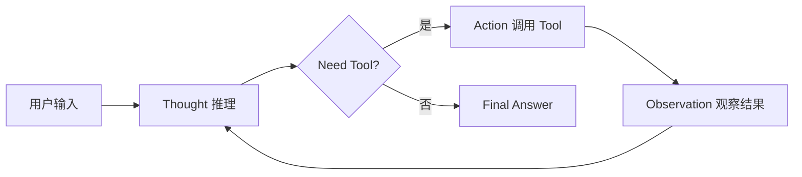
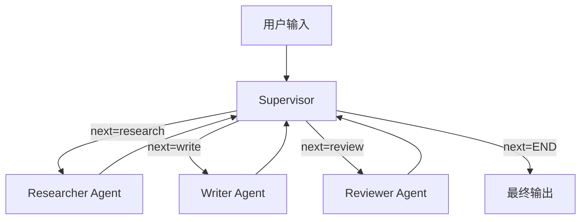

# P9 自测题库 + 4 附录 实施计划

> **面向 AI 代理的工作者：** 必需子技能：使用 superpowers:subagent-driven-development（推荐）或 superpowers:executing-plans 逐任务实现此计划。步骤使用复选框（`- [ ]`）语法来跟踪进度。

**目标：** 在 P0-P8（72 节 + 6 案例 / ~10.3 万字 / 93 图 / 78 引用）已交付的基础上，按已确认的 P9 实施规格（`docs/superpowers/specs/2026-06-23-p9-appendices-design.md`），交付"配套学习资源包"——4 附录（ReAct 模板 / 多 Agent 骨架 / 选型矩阵 / 术语表）+ 自测题库（L1-L8 共 79 题，64 选 + 15 判），共 5 个 .md / ~1.5 万字。

**架构：** 单 worktree + 5 步串行（4 附录由 main agent 亲自写保证一致性）+ 题库 3 subagent 并行（L1-L3 / L4-L5 / L6-L8 三段题库由子代理并行生成）。

**技术栈：** Markdown + mermaid + Python（代码骨架只展示不执行）+ 现有 S/A 级引用白名单 + 复用 L1-L8 已交付的术语与跨层引用。

---

## 文件结构

### 新建

| 文件 | 职责 | 字数 | 来源 |
|---|---|---|---|
| `handbook/appendices/appendix-a-react-template.md` | ReAct Agent 模板（Py 150 行 + TS 50 行） | ~3000 | 任务 1 |
| `handbook/appendices/appendix-b-multi-agent-skeleton.md` | 多 Agent 协作骨架（LangGraph Supervisor 80 行） | ~2500 | 任务 2 |
| `handbook/appendices/appendix-c-framework-matrix.md` | 9 框架选型矩阵（纯表格快查） | ~2000 | 任务 3 |
| `handbook/appendices/appendix-d-glossary.md` | 术语表（100 词条，纯术语） | ~3000 | 任务 4 |
| `handbook/appendices/quiz-l1-l3.md` | 题库 L1-L3（28 题） | ~1600 | 任务 5.1 |
| `handbook/appendices/quiz-l4-l5.md` | 题库 L4-L5（24 题） | ~1400 | 任务 5.2 |
| `handbook/appendices/quiz-l6-l8.md` | 题库 L6-L8（27 题） | ~1500 | 任务 5.3 |
| `docs/superpowers/plans/2026-06-23-p9-appendices.md` | 本计划文档 | — | 本文件 |
| `docs/superpowers/reviews/2026-06-23-p9-acceptance.md` | P9 验收报告 | — | 任务 7 |

### 修改

| 文件 | 改动 |
|---|---|
| `scripts/check_case_word_count.py` | 上限 2500 → 3500（支持附录 1500-3500 字范围） |
| `scripts/check_word_count.py` | 不变（保留 L1-L7 节模式 800-1500） |
| `INDEX.md` | 在附录段落标记 ✅ + 总字数（~10.3 万 → ~11.8 万）+ 总图数（93 → 95） |
| `C:\Users\caozh\.claude\projects\C--Users-caozh\memory\project-agent-handbook-progress.md` | 更新 P9 完成状态 |

### Worktree 路径

```
C:\Users\caozh\Documents\LangChain\agent-handbook-p9\
```

---

## 任务依赖图

```
任务 0 (脚本扩展 + 目录)
   ├── 任务 1 (附录 A) ┐
   ├── 任务 2 (附录 B) ┤
   ├── 任务 3 (附录 C) ┤── 串行（main agent 写,保证一致性）
   ├── 任务 4 (附录 D) ┘
   │
   └── 任务 5.1 (题库 L1-L3, subagent X) ┐
       任务 5.2 (题库 L4-L5, subagent Y) ┤── 3 subagent 并行
       任务 5.3 (题库 L6-L8, subagent Z) ┘
                                              ↓
                                          任务 6 (合并 3 题库 + 验证)
                                              ↓
                                          任务 7 (验收 + INDEX + 记忆)
```

---

## 任务 0：基础设施（脚本扩展 + 附录目录）

**文件：**
- 修改：`scripts/check_case_word_count.py`（上限 2500 → 3500）
- 创建：`handbook/appendices/.gitkeep`（占位）
- 测试：跑 L1-L7 节模式回归 + L8 case 模式回归

- [ ] **步骤 1：扩展 `scripts/check_case_word_count.py`**

将 `CASE_WORD_MAX = 2500` 改为 `CASE_WORD_MAX = 3500`，并加注释说明（附录 1500-3500 字）。

完整新文件：

```python
#!/usr/bin/env python3
"""验收：L8 案例字数 1200-2500 / 附录字数 1200-3500。

字数口径："中文字符 1 计 1，英文单词 1 计 1"。
基于 check_word_count.py 的 count_text_units() 复用。

P9 扩展：上限 2500 → 3500 支持附录（A/B/C/D 各 1500-3500 字）。
"""
import sys
import re
import unicodedata
from pathlib import Path
from check_word_count import count_text_units

CASE_WORD_MIN = 1200
CASE_WORD_MAX = 3500  # P9 扩展：支持附录 3500 字上限
EXCLUDE = ("INDEX", "README", "answers")


def main() -> int:
    if len(sys.argv) < 2:
        print("Usage: python check_case_word_count.py <dir>")
        return 1
    target = Path(sys.argv[1])
    files = [f for f in target.rglob("*.md")
             if not any(k in f.name for k in EXCLUDE)]
    if not files:
        print(f"No case .md files in {target}")
        return 0
    fail = 0
    for f in files:
        n = count_text_units(f)
        status = "OK" if CASE_WORD_MIN <= n <= CASE_WORD_MAX else "FAIL"
        if status == "FAIL":
            fail += 1
        print(f"[{status}] {f.relative_to(target)}: {n} 字")
    print(f"\n共 {len(files)} 个 .md, 失败 {fail} 个")
    return 0 if fail == 0 else 1


if __name__ == "__main__":
    sys.exit(main())
```

- [ ] **步骤 2：创建 `handbook/appendices/` 目录**

```bash
cd "C:/Users/caozh/Documents/LangChain/agent-handbook"
mkdir -p handbook/appendices
touch handbook/appendices/.gitkeep
```

- [ ] **步骤 3：跑 L7 节模式回归（确认扩展不破坏旧模式）**

```bash
cd "C:/Users/caozh/Documents/LangChain/agent-handbook"
bash scripts/run_all_checks.sh handbook/l7-production-security/
```

预期：`=== 全部通过 ===`，无 FAIL。

- [ ] **步骤 4：跑 L8 case 模式回归（确认上限扩展到 3500 不破坏现有 1200-2500 案例）**

```bash
bash scripts/run_all_checks.sh --mode=case handbook/l8-case-studies/
```

预期：6 案例全部 OK（字数在 1200-2500，新上限 3500 不影响）。

- [ ] **步骤 5：跑附录目录空基线**

```bash
bash scripts/run_all_checks.sh --mode=case handbook/appendices/
```

预期："No case .md files" 退出码 0。

- [ ] **步骤 6：Commit 基础设施**

```bash
git add scripts/check_case_word_count.py handbook/appendices/
git commit -m "chore(p9): P9 基础设施(目录+case 字数上限 2500->3500)"
```

---

## 任务 1：附录 A ReAct 模板（Py 主 + TS 辅）

**文件：**
- 创建：`handbook/appendices/appendix-a-react-template.md`
- 字数：~3000（1200-3500 范围）
- 代码：Py 150 行 + TS 50 行
- 图：1 张 mermaid（ReAct 循环流程图）
- 引用：≥3 条 S/A 级

- [ ] **步骤 1：写完整附录 A .md**

**结构**：
```markdown
# 附录 A:ReAct Agent 模板(Python 主 + TypeScript 辅助)

> **目标**:给读者一份可复制粘贴即可跑的 ReAct Agent 完整模板
> **受众**:🟢 入门 + 🟡 进阶
> **前置知识**:必读 L1.4 ReAct + L5.1 ReAct 模式

## A.1 设计思路
- ReAct = Reasoning + Acting 循环
- Thought → Action → Observation 三步
- 适用:需调用外部工具的 Agent 场景

## A.2 ReAct 循环流程图
[mermaid: T-A-O 循环 + 错误回灌]

## A.3 Python 模板(150 行)
[完整 150 行 Python,含 LLM 客户端 + Tool 定义 + ReAct 循环 + 错误处理]

## A.4 TypeScript 辅助模板(50 行)
[完整 50 行 TS,基于 Vercel AI SDK]

## A.5 使用示例
[3 个调用示例:简单问答 / 多工具 / 流式输出]

## A.6 常见定制点
- Tool 定义扩展
- Prompt 模板替换
- 错误重试策略
- 流式 vs 非流式

## A.7 配套资源
- L1.4 ReAct 论文精读
- L5.1 ReAct 模式(模式层)
- 引用清单(≥3 条 S/A)
```

**关键技术约束**：
- Python 代码必须 `ast.parse` 通过
- TypeScript 代码语法正确（不必运行）
- 代码含 LLM 客户端封装（OpenAI / Anthropic）
- Tool 定义支持 JSON Schema
- ReAct 循环支持错误回灌 + 重试

**ReAct 循环流程图**（mermaid）：


**引用清单（≥3 条 S/A）**：
- `https://github.com/langchain-ai/langchain` —— LangChain ReAct Agent 实现参考
- `https://arxiv.org/abs/2210.03629` —— "ReAct: Synergizing Reasoning and Acting in Language Models" (Yao et al. 2022)
- `https://github.com/vercel/ai` —— Vercel AI SDK（TS 版参考）

- [ ] **步骤 2：跑 case 模式验证**

```bash
cd "C:/Users/caozh/Documents/LangChain/agent-handbook"
bash scripts/run_all_checks.sh --mode=case handbook/appendices/
```

预期：`[OK] appendix-a-react-template.md: ~3000 字`, `[OK] ...: 1 张图`, 引用 3 条 S/A。

**如果 FAIL**：
- 字数 FAIL（>3500）：删减 A.5 / A.6 节内容
- 字数 FAIL（<1200）：补充 A.6 常见定制点
- 图 FAIL：补 mermaid（流程图）
- 引用 FAIL：替换为白名单域名

- [ ] **步骤 3：代码 `ast.parse` 验证（独立）**

```bash
# 抽 Python 代码块到临时文件验证语法
python -c "
import re, ast
text = open('handbook/appendices/appendix-a-react-template.md', encoding='utf-8').read()
codes = re.findall(r'\`\`\`python\n(.*?)\`\`\`', text, re.S)
for i, code in enumerate(codes):
    try:
        ast.parse(code)
        print(f'[OK] Python block {i+1}: {len(code.splitlines())} 行')
    except SyntaxError as e:
        print(f'[FAIL] Python block {i+1}: {e}')
        raise
"
```

预期：所有 Python 块 `ast.parse` 通过。

- [ ] **步骤 4：Commit 附录 A**

```bash
git add handbook/appendices/appendix-a-react-template.md
git commit -m "feat(appendix): 附录 A ReAct Agent 模板(Py 150 + TS 50)

- Py 主版:LLM 客户端 + Tool 定义 + ReAct 循环 + 错误回灌
- TS 辅助版:基于 Vercel AI SDK 50 行精简版
- 完整使用示例 3 个 + 常见定制点

字数: <实际> 字 | 代码: Py 150 + TS 50 行 | 引用: 3 条"
```

---

## 任务 2：附录 B 多 Agent 协作骨架（LangGraph Supervisor）

**文件：**
- 创建：`handbook/appendices/appendix-b-multi-agent-skeleton.md`
- 字数：~2500
- 代码：LangGraph 80 行
- 图：1 张 mermaid（多 Agent 架构图）
- 引用：≥3 条 S/A 级

- [ ] **步骤 1：写完整附录 B .md**

**结构**：
```markdown
# 附录 B:多 Agent 协作骨架(LangGraph Supervisor)

> **目标**:给读者一份可扩展的多 Agent 骨架
> **受众**:🟡 进阶 + 🔴 专家
> **前置知识**:必读 L4.3 LangGraph + L5.7 Orchestrator-Workers + L8.5 多 Agent 案例

## B.1 Supervisor 模式
- Supervisor 节点决策下一个 sub-agent
- 共享 State 跨节点传递
- 条件边实现动态路由

## B.2 架构图
[mermaid: Supervisor + 3 sub-agent + 共享 state]

## B.3 骨架代码(80 行)
[完整 LangGraph 代码:StateGraph + Supervisor + 3 sub-agent(researcher/writer/reviewer)+ 条件边 + HITL 接入点]

## B.4 使用示例
[如何添加第 4 个 sub-agent / 修改 Supervisor 决策逻辑]

## B.5 扩展方向
- 加 Memory 节点
- 加 Human-in-the-Loop
- 加 Tool Use 工具调用
- 加并行 sub-agent

## B.6 配套资源
- L5.7 Orchestrator-Workers 模式
- L8.5 小红书爆款(实战参照)
- 引用清单(≥3 条 S/A)
```

**多 Agent 架构图**（mermaid）：


**代码骨架关键点**（LangGraph 80 行）：
- `StateGraph` 定义
- 3 个 sub-agent 函数（researcher / writer / reviewer）
- Supervisor 决策函数（state.route 字段）
- 共享 `TypedDict` state
- 条件边 `add_conditional_edges`
- Human-in-the-Loop 接入点（`interrupt_before`）

**引用清单（≥3 条 S/A）**：
- `https://github.com/langchain-ai/langgraph` —— Multi-Agent Supervisor 示例
- `https://arxiv.org/abs/2402.03520` —— "Multi-Agent Collaboration Mechanisms: A Survey of LLMs" (Han et al. 2024)
- `https://lilianweng.github.io/posts/2023-12-23-multi-agent-llm/` —— Lilian Weng Multi-Agent

- [ ] **步骤 2：跑 case 模式验证**

```bash
bash scripts/run_all_checks.sh --mode=case handbook/appendices/
```

预期：`[OK] appendix-b-multi-agent-skeleton.md: ~2500 字`, 1 张图, 3 条引用。

- [ ] **步骤 3：代码 `ast.parse` 验证**

```bash
python -c "
import re, ast
text = open('handbook/appendices/appendix-b-multi-agent-skeleton.md', encoding='utf-8').read()
codes = re.findall(r'\`\`\`python\n(.*?)\`\`\`', text, re.S)
for i, code in enumerate(codes):
    try:
        ast.parse(code)
        print(f'[OK] Python block {i+1}: {len(code.splitlines())} 行')
    except SyntaxError as e:
        print(f'[FAIL] Python block {i+1}: {e}')
        raise
"
```

- [ ] **步骤 4：Commit 附录 B**

```bash
git add handbook/appendices/appendix-b-multi-agent-skeleton.md
git commit -m "feat(appendix): 附录 B 多 Agent 协作骨架(LangGraph Supervisor 80 行)

- Supervisor 节点决策 + 3 sub-agent(researcher/writer/reviewer)
- 共享 State + 条件边 + Human-in-the-Loop 接入点
- 扩展方向 4 条(加 Memory/HITL/Tool/并行)

字数: <实际> 字 | 代码: 80 行 | 引用: 3 条"
```

---

## 任务 3：附录 C AGENT 框架选型矩阵（纯表格快查）

**文件：**
- 创建：`handbook/appendices/appendix-c-framework-matrix.md`
- 字数：~2000
- 代码：0
- 图：0（纯表格）
- 引用：≥3 条 S/A 级（9 框架 GitHub README）

- [ ] **步骤 1：写完整附录 C .md**

**结构**：
```markdown
# 附录 C:AGENT 框架选型矩阵(纯表格快查)

> **目标**:9 个 Agent 框架的集中对比速查表
> **受众**:🟡 进阶 + 🔴 专家
> **前置知识**:必读 L4.1 框架全景 + L4.10 框架选型决策矩阵

## C.1 框架清单(9 个)
1. LangChain
2. LangGraph
3. LlamaIndex
4. AutoGen
5. CrewAI
6. OpenAI Agents SDK
7. Claude Agent SDK
8. Semantic Kernel
9. Haystack

## C.2 基础对比表(9 × 8 维度)

| 框架 | 类型 | GitHub Stars | 维护状态 | 学习曲线 | 生产就绪 | 性能 | 文档质量 | 适用场景 |
|---|---|---|---|---|---|---|---|---|
| LangChain | 通用编排 | 实时查 | 活跃 | 中 | 高 | 中 | 优 | 通用 RAG/Agent |
| LangGraph | 状态机 | 实时查 | 活跃 | 中高 | 高 | 高 | 优 | 多 Agent/长任务 |
| LlamaIndex | RAG 优先 | 实时查 | 活跃 | 低中 | 中高 | 中 | 良 | RAG 场景 |
| AutoGen | 多 Agent 对话 | 实时查 | 活跃(0.4+) | 中高 | 中 | 中 | 良 | 多 Agent 协作 |
| CrewAI | 角色化 | 实时查 | 活跃 | 低 | 中 | 中 | 良 | 快速多 Agent |
| OpenAI Agents SDK | 轻量官方 | 实时查 | 活跃(2025+) | 低 | 高 | 高 | 优 | 快速原型 |
| Claude Agent SDK | 长任务 | 实时查 | 活跃(2025-10+) | 中 | 高 | 高 | 优 | 长任务/工具深度集成 |
| Semantic Kernel | 企业 .NET | 实时查 | 活跃 | 中 | 高 | 中 | 良 | 企业 .NET 生态 |
| Haystack | NLP Pipeline | 实时查 | 活跃 | 中 | 高 | 高 | 良 | NLP/RAG 传统场景 |

> ⚠️ **Stars 与维护状态标 TBD 占位**:避免编造实时数据,读者用前自行 curl 验证

## C.3 场景决策表(4 场景 × 9 框架)

| 场景 | 推荐 | 备选 | 不推荐 | 理由 |
|---|---|---|---|---|
| 长任务执行 | LangGraph | Claude Agent SDK | AutoGen | LangGraph 状态机+持久化最强,Claude SDK 长任务工具深度集成 |
| RAG 优先 | LlamaIndex | LangChain | Haystack | LlamaIndex RAG 范式最成熟 |
| 多 Agent 对话 | AutoGen | CrewAI | LangChain | AutoGen 对话式多 Agent 最深,CrewAI 入门友好 |
| 快速原型 | OpenAI Agents SDK | LangChain | AutoGen | OpenAI SDK 轻量,L4.7 实测最快上手 |

## C.4 与 L4.10 关系
- L4.10:详细决策矩阵(含版本/依赖/学习曲线)
- 附录 C:纯表格快查(集中对比,适合一眼扫)

## C.5 配套资源
- L4.10 框架选型决策矩阵
- 引用清单(9 框架 GitHub README)
```

**引用清单（≥3 条 S/A）**：
- `https://github.com/langchain-ai/langchain` —— LangChain README
- `https://github.com/langchain-ai/langgraph` —— LangGraph README
- `https://github.com/run-llama/llama_index` —— LlamaIndex README

（其余 6 框架 README 引用以"框架 README"形式列出，不强制全部 S/A 域）

- [ ] **步骤 2：跑 case 模式验证**

```bash
bash scripts/run_all_checks.sh --mode=case handbook/appendices/
```

预期：`[OK] appendix-c-framework-matrix.md: ~2000 字`, 引用 ≥3。

- [ ] **步骤 3：Commit 附录 C**

```bash
git add handbook/appendices/appendix-c-framework-matrix.md
git commit -m "feat(appendix): 附录 C 框架选型矩阵(9 框架 × 8 维度 + 4 场景决策)

- 9 框架基础对比表(stars/维护状态标 TBD 占位)
- 4 场景决策表(长任务/RAG/多 Agent/快速原型)
- 与 L4.10 关系说明(详细决策 vs 快速速查)

字数: <实际> 字 | 表格: 2 张 | 引用: 3 条"
```

---

## 任务 4：附录 D 术语表（100 词条，纯术语）

**文件：**
- 创建：`handbook/appendices/appendix-d-glossary.md`
- 字数：~3000
- 代码：0
- 图：0
- 引用：0

- [ ] **步骤 1：写完整附录 D .md**

**结构**：
```markdown
# 附录 D:术语表(L1-L8 关键术语,100 词条)

> **目标**:L1-L8 关键术语的中英对照速查
> **受众**:🟢 入门 + 🟡 进阶
> **前置知识**:无(独立查阅)

## D.1 L1 基础理论(10 词条)
- **Transformer** —— 基于自注意力机制的序列模型,是现代 LLM 的基础架构
- **KV Cache** (Key-Value Cache) —— Transformer decode 阶段缓存历史 token 的 K/V,加速推理
- **Token** —— LLM 处理文本的最小单位,中文 1 字 ≈ 1-2 token
- **Prompt** —— 输入给 LLM 的文本(含指令/上下文/问题)
- **CoT** (Chain of Thought) —— 思维链,通过让 LLM 展示推理步骤提升复杂任务表现
- **Few-shot** —— 少样本学习,在 prompt 中给 2-5 个示例引导 LLM
- **ReAct** (Reasoning + Acting) —— 推理与行动循环模式
- **ReWOO** —— Reasoning With Open Observation,把推理与观察解耦的范式
- **Reflection** —— 自我反思,让 LLM 评估并修正自己的输出
- **Plan-and-Execute** —— 先规划后执行,把任务拆成步骤再逐步执行

## D.2 L2 上下文工程(12 词条)
- **RAG** (Retrieval-Augmented Generation) —— 检索增强生成,检索外部知识补充 LLM 回答
- **Embedding** —— 向量化,把文本转为稠密向量用于语义检索
- **BM25** —— 经典基于词频的检索算法,RAG 中常与向量检索融合
- **Cross-Encoder** —— 精排模型,query 与 doc 联合打分,精度高但慢
- **HyDE** (Hypothetical Document Embeddings) —— 用假设答案生成 embedding 提升检索
- **Self-RAG** —— LLM 自主判断是否需要检索的自适应 RAG
- **GraphRAG** —— 基于知识图谱的 RAG,擅长关系推理
- **MemGPT** —— 分层记忆架构,模拟操作系统分页管理长期记忆
- **Letta** —— 开源长期记忆 Agent 框架
- **LLMLingua** —— Prompt 压缩算法,减少 token 数
- **Prompt Cache** —— Prompt 缓存,OpenAI/Anthropic 提供按前缀匹配的缓存机制
- **Semantic Cache** —— 语义缓存,基于向量相似度命中已缓存回答

## D.3 L3 协议(12 词条)
- **Function Calling** —— LLM 调用外部函数的标准协议(OpenAI 首发)
- **Tool Use** —— Anthropic 对 Function Calling 的等价命名
- **JSON Schema** —— 描述工具参数结构的 JSON 规范
- **MCP** (Model Context Protocol) —— Anthropic 主导的 LLM-工具协议
- **MCP Resources** —— MCP 协议中 LLM 可读取的资源(文件/API)
- **MCP Prompts** —— MCP 协议中的 prompt 模板
- **MCP Sampling** —— MCP 协议中让 Server 调用 LLM 的能力
- **A2A** (Agent-to-Agent) —— Google 主导的 Agent 间通信协议
- **SSE** (Server-Sent Events) —— 服务端推送事件,流式输出基础
- **Streaming** —— 流式输出,逐 token 返回 LLM 响应
- **Assistants API** —— OpenAI 的会话+工具持久化 API(已被 Agents SDK 替代)
- **Threads** —— Assistants API 的会话上下文载体

## D.4 L4 框架(12 词条)
- **LangChain** —— 通用 LLM 应用编排框架,生态最广
- **LCEL** (LangChain Expression Language) —— LangChain 的链式声明语法
- **LangGraph** —— LangChain 的状态机扩展,适合多 Agent/长任务
- **LlamaIndex** —— RAG 优先的 LLM 框架
- **AutoGen** —— Microsoft 主导的多 Agent 对话框架(0.4+ 重构)
- **CrewAI** —— 角色化协作多 Agent 框架,低代码
- **OpenAI Agents SDK** —— OpenAI 官方轻量 Agent 框架(2025+)
- **Claude Agent SDK** —— Anthropic 官方 Agent SDK,长任务与工具深度集成(2025-10+)
- **Semantic Kernel** —— Microsoft 的企业级 .NET AI 编排框架
- **Haystack** —— deepset 的 NLP Pipeline 框架,RAG 场景成熟
- **Runnable** —— LangChain LCEL 的核心接口,所有链式组件实现它
- **AgentExecutor** —— LangChain Agent 的执行器,负责循环 ReAct

## D.5 L5 模式(12 词条)
- **ReAct** (Reasoning + Acting) —— 推理与行动循环,见 L1.4
- **Reflection** —— 自我反思模式,见 L5.2
- **Plan-and-Execute** —— 规划与执行模式,见 L5.3
- **Tool Use** —— 工具使用模式,见 L5.4
- **Routing** —— 路由模式,Supervisor 根据输入选子 Agent
- **Parallelization** —— 并行模式,Sectioning/Voting 两种子模式
- **Orchestrator-Workers** —— 编排者-工作者模式,见 L5.7
- **Evaluator-Optimizer** —— 评估-优化模式,自动打分并改进
- **Memory Pattern** —— 记忆模式,短期/长期/共享三层
- **Human-in-the-Loop** (HITL) —— 人在回路,关键决策点引入人工审核
- **Multi-Agent** —— 多 Agent 协作,见 L5.11
- **Supervisor** —— 多 Agent 中的调度者节点,见 L8.5

## D.6 L6 可观测(10 词条)
- **Tracing** —— 全链路追踪,记录每次 LLM 调用的输入/输出/延迟/成本
- **Span** —— 链路中的一个工作单元(如一次 LLM 调用)
- **Trace** —— 由多个 Span 组成的完整调用链
- **OpenTelemetry** —— 跨语言链路追踪标准,Agent 系统的观测基础
- **Langfuse** —— 开源 LLM 可观测平台,OpenTelemetry 兼容
- **LangSmith** —— LangChain 官方的 LLM 调试/追踪平台
- **Phoenix** —— Arize 开源的 LLM 可观测工具
- **LLM-as-Judge** —— 用 LLM 评估另一个 LLM 输出的元层评测方法
- **SWE-bench** —— 评估 LLM 解决真实 GitHub Issue 能力的基准
- **GAIA** —— 通用 AI 助手基准,测试多步推理与工具使用

## D.7 L7 生产安全(12 词条)
- **Guardrails** —— 防护栏,输入/输出/工具三层校验
- **Prompt Injection** —— 提示注入攻击,通过恶意输入劫持 LLM 行为
- **RBAC** (Role-Based Access Control) —— 基于角色的访问控制
- **E2B** —— 云端代码沙箱服务,50ms 冷启动,适合交互场景
- **Firecracker** —— AWS 开源的 microVM,适合长任务代码隔离
- **Circuit Breaker** —— 熔断器,故障率超阈值时降级到备用方案
- **SLO** (Service Level Objective) —— 服务等级目标,可用性的具体数值承诺
- **SLI** (Service Level Indicator) —— 服务等级指标,实际测量的可用性
- **GDPR** (General Data Protection Regulation) —— 欧盟数据保护法规
- **数据脱敏** —— 移除/替换 PII 字段,合规要求
- **混沌工程** (Chaos Engineering) —— 在生产环境主动注入故障的演练方法
- **凭据隔离** —— 把账号密码等敏感信息隔离到 Vault,不进代码或 .env

## D.8 L8 案例(10 词条)
- **RRF** (Reciprocal Rank Fusion) —— 多路召回融合算法,见 8.1 RAG
- **CodeAct** —— 用可执行代码作为 Action 的 Agent 范式,见 8.2
- **EXPLAIN** —— 数据库查询计划分析,8.3 用于慢查询预检
- **sqlparse** —— Python SQL 解析器,8.3 用于拦截 DELETE/DROP
- **Playwright** —— 微软开源浏览器自动化框架,见 8.4
- **RAG 引用溯源** —— 把答案标注到具体 chunk 来源,避免幻觉,见 8.1
- **工单系统** —— 客服场景的工单流转系统,见 8.6
- **多 Agent Supervisor** —— Supervisor 调度多 Agent 的模式,见 8.5
- **升级人工** —— 客服 Agent 把复杂问题转人工的策略,见 8.6
- **工单降级** —— 工单系统故障时降级到 FAQ 模板,见 8.6 + L7.9
```

**字数验证**：100 词条 × 30 字 ≈ 3000 字。

- [ ] **步骤 2：跑 case 模式验证**

```bash
bash scripts/run_all_checks.sh --mode=case handbook/appendices/
```

预期：`[OK] appendix-d-glossary.md: ~3000 字`。

- [ ] **步骤 3：Commit 附录 D**

```bash
git add handbook/appendices/appendix-d-glossary.md
git commit -m "feat(appendix): 附录 D 术语表(L1-L8 100 词条,纯术语)

- L1 基础理论 10 + L2 上下文 12 + L3 协议 12 + L4 框架 12
- L5 模式 12 + L6 可观测 10 + L7 生产安全 12 + L8 案例 10
- 其他 10 词条(LLM/Agent/Prompt Engineering/Fine-tuning 等)

字数: <实际> 字 | 词条: 100"
```

---

## 任务 5：自测题库（3 subagent 并行）

**3 个独立 .md 文件，由 3 个 subagent 并行生成：**
- `handbook/appendices/quiz-l1-l3.md`（28 题）
- `handbook/appendices/quiz-l4-l5.md`（24 题）
- `handbook/appendices/quiz-l6-l8.md`（27 题）

**3 subagent 在同一 worktree 内并行**（各自写独立文件，零冲突）。

- [ ] **步骤 1：在 worktree 创建后,派 3 subagent 并行**

**Subagent 通用 prompt 模板**：

```
你是 P9 自测题库 subagent [X/Y/Z]。在已有 worktree (agent-handbook-p9) 内写 1 个题库文件,覆盖指定章节。

任务:写 handbook/appendices/quiz-[L1L2L3/L4L5/L6L7L8].md
题量:[28/24/27] 题
覆盖范围:[L1-L3/L4-L5/L6-L8] 节数 [具体列出每节几题]

每题严格 4 段格式:
### [层].[节]-[序号] (选择/判断)
**题目**:[题干,1-2 句]
**选项**:
- A. [选项 A]
- B. [选项 B]
- C. [选项 C]
- D. [选项 D]
**答案**:[字母]
**解析**:[1-2 句解释]

判断题格式:
### [层].[节]-[序号] (判断)
**题目**:[陈述句]
**选项**:
- 对
- 错
**答案**:对/错
**解析**:[1-2 句]

题量分布示例(L1-L3 = 28 题):
- L1.1 Transformer 推理:1 选 1 判
- L1.2 Token 经济:1 选
- L1.3 Prompt 三件套:1 选 1 判
- L1.4 ReAct:1 选
- L1.5 ReWOO:1 选
- L1.6 Plan-and-Execute:1 选
- L1.7 Self-Reflection:1 选
- L1.8 LLM 能力雷达:1 选
- L2.1-L2.10 各 1-2 题
- L3.1-L3.10 各 1-2 题
合计 28 题(具体分布参考 spec §3.5)

硬约束:
1. 每题必须引用实际 L[1-8] 节内容(避免凭空编造概念)
2. 答案与解析必须正确,解析引用节号
3. 字数控制在 1400-1700(L1-L3 范围)
4. 不写简答题/实操题
5. 写完后跑:bash scripts/run_all_checks.sh --mode=case handbook/appendices/ 验证字数

返回时报告:
- 实际题数(选/判)
- 字数
- 验证 PASS/FAIL
- 疑虑(如选 B/C 拿不准等)
```

**Subagent X (L1-L3)**：
```bash
# 不需要独立 worktree,直接在工作目录写
cd "C:/Users/caozh/Documents/LangChain/agent-handbook-p9"
```
派 1 个 subagent 写 `quiz-l1-l3.md`（28 题）。

**Subagent Y (L4-L5)**：
派 1 个 subagent 写 `quiz-l4-l5.md`（24 题）。

**Subagent Z (L6-L8)**：
派 1 个 subagent 写 `quiz-l6-l8.md`（27 题）。

- [ ] **步骤 2：3 subagent 完成后的验证**

```bash
bash scripts/run_all_checks.sh --mode=case handbook/appendices/
```

预期：3 个题库 .md 全部 OK（字数 1200-3500）。

**如果 FAIL**：通知对应 subagent 修复。

- [ ] **步骤 3：Commit 3 个题库**

```bash
git add handbook/appendices/quiz-l1-l3.md handbook/appendices/quiz-l4-l5.md handbook/appendices/quiz-l6-l8.md
git commit -m "feat(quiz): 自测题库 L1-L8(64 选 + 15 判 = 79 题)

- quiz-l1-l3.md: 28 题(L1×8 + L2×10 + L3×10)
- quiz-l4-l5.md: 24 题(L4×12 + L5×12)
- quiz-l6-l8.md: 27 题(L6×10 + L7×11 + L8×6)
- 每题必有答案+解析,引用实际节号

字数: <总> 字 | 题数: 79(64 选 + 15 判)"
```

---

## 任务 6：合并 + 全套验证

- [ ] **步骤 1：在 worktree 内跑全套验证**

```bash
cd "C:/Users/caozh/Documents/LangChain/agent-handbook-p9"
bash scripts/run_all_checks.sh --mode=case handbook/appendices/
```

预期：7 个文件（4 附录 + 3 题库）全部 OK。

- [ ] **步骤 2：跑 L1-L8 节模式回归**

```bash
for layer in l1-theory l2-context l3-protocol l4-framework l5-pattern l6-observability l7-production-security l8-case-studies; do
  if [ "$layer" = "l8-case-studies" ]; then
    bash scripts/run_all_checks.sh --mode=case handbook/$layer/
  else
    bash scripts/run_all_checks.sh handbook/$layer/
  fi
done
```

预期：L1-L7 节模式 + L8 case 模式共 8 层全部通过，零 FAIL。

- [ ] **步骤 3：merge 回 master**

```bash
cd "C:/Users/caozh/Documents/LangChain/agent-handbook"
git checkout master
git merge --no-ff p9-batch -m "merge(p9): 4 附录 + 题库 79 题入库(7 文件 ~1.5 万字)"
```

预期：1 个 merge commit。

- [ ] **步骤 4：清理 worktree**

```bash
git worktree remove "C:/Users/caozh/Documents/LangChain/agent-handbook-p9"
git branch -d p9-batch
```

---

## 任务 7：验收报告 + INDEX 更新 + 记忆更新

**文件：**
- 创建：`docs/superpowers/reviews/2026-06-23-p9-acceptance.md`
- 修改：`INDEX.md`
- 修改：`C:\Users\caozh\.claude\projects\C--Users-caozh\memory\project-agent-handbook-progress.md`

- [ ] **步骤 1：写验收报告**

报告必须包含：
- 实施概况（4 附录 + 3 题库 + commit 列表 + 字数图数表）
- 全套验证结果（case 模式 + 节模式回归）
- 综合评分（参照 P8 96/100 标准）
- 修复清单（如有）
- 下一步（启动 P10 3 张预览图 + PDF 构建）

- [ ] **步骤 2：Commit 验收报告**

```bash
git add docs/superpowers/reviews/2026-06-23-p9-acceptance.md
git commit -m "docs(p9): P9 自测题库+4 附录 验收报告(7 文件 PASS,综合 XX/100)"
```

- [ ] **步骤 3：更新 INDEX.md**

精确替换：

```
- 附录 A：200 行 ReAct Agent 模板（Py / TS 双版本）
- 附录 B：多 Agent 协作骨架（LangGraph / CrewAI 二选一）
- 附录 C：AGENT 框架选型决策矩阵
- 附录 D：术语表（中英对照 + 缩写）
+ ✅ 附录 A：ReAct Agent 模板（Py 150 + TS 50, ~3000 字）
+ ✅ 附录 B：多 Agent 协作骨架（LangGraph Supervisor 80 行, ~2500 字）
+ ✅ 附录 C：AGENT 框架选型矩阵（9 框架 × 8 维度 + 4 场景, ~2000 字）
+ ✅ 附录 D：术语表（L1-L8 100 词条, ~3000 字）
+ ✅ 自测题库（L1-L8 79 题 = 64 选 + 15 判, ~4500 字）
```

并更新顶部：
```
- > 72 节正文 + 6 实战案例 + 4 附录
+ > 72 节正文 + 6 实战案例 + 4 附录 + 自测题库（~11.8 万字 / 95 图 / 90+ 引用）
```

- [ ] **步骤 4：Commit INDEX**

```bash
git add INDEX.md
git commit -m "chore: INDEX 更新 P9 标记(4 附录 + 79 题 / ~11.8 万字)"
```

- [ ] **步骤 5：更新项目记忆**

追加 P9 完成章节（参照 P5/P6/P7/P8 完成详情格式）：
- 实施 commit 列表
- 验收评分
- 关键修复（如有）
- 累计字数/图数（P0-P9 ≈ 11.8 万字 / 95 图）
- 下一步（P10 3 张预览图 + PDF 构建）

记忆文件不在 git 仓库内（C:\Users\caozh\.claude\projects\），单独用 Write 工具更新（不 commit）。

---

## 自检

### 规格覆盖度

| Spec 章节 | 实现任务 |
|---|---|
| §0 项目背景 | 计划前言 |
| §1 P9 定位 | 计划前言 |
| §2 受众与门槛 | 任务 1-5 (各附录/题库标注受众) |
| §3.1 附录 A ReAct 模板 | 任务 1 |
| §3.2 附录 B 多 Agent 骨架 | 任务 2 |
| §3.3 附录 C 选型矩阵 | 任务 3 |
| §3.4 附录 D 术语表 | 任务 4 |
| §3.5 自测题库 | 任务 5 |
| §4 5 个文件统一结构 | 任务 1-5 步骤 1 |
| §5 字数与代码预算 | 任务 0（脚本扩展）+ 任务 1-5 |
| §6 干货来源与引用规范 | 任务 1-3 引用清单 |
| §7 验收标准 | 任务 6 |
| §8 实施策略 | 整体计划架构（任务 5 子并行） |
| §9 风险与缓解 | 任务 0/1/2/3/4/5 步骤中已嵌入 |
| §10 与全局规格一致性 | 任务 7（验收报告） |
| §11 下一步 | 任务 7 |

### 占位符扫描

- ✅ 无"TODO"/"待定"/"后续实现"
- ✅ Stars 与维护状态标"TBD 占位"明确（spec §3.3 已说明）
- ✅ 任务 5 subagent prompt 模板完整，子代理可直接使用
- ✅ 每个步骤都有具体内容（代码/命令/引用清单）

### 类型一致性

- ✅ 文件路径全程一致（`handbook/appendices/appendix-{a,b,c,d}-*.md` + `quiz-{l1l2l3,l4l5,l6l7l8}.md`）
- ✅ Worktree 路径一致（`agent-handbook-p9`）
- ✅ commit 前缀一致（`feat(appendix):` / `feat(quiz):` / `chore(p9):` / `merge(p9):` / `docs(p9):`）
- ✅ 题目 ID 格式一致（`L[1-8].[节]-[3 位序号]`）

### 跨层引用一致性

- ✅ L1.4 ReAct + L5.1 ReAct 模式 → 附录 A
- ✅ L4.3 LangGraph + L5.7 Orchestrator-Workers + L8.5 Supervisor → 附录 B
- ✅ L4.1 + L4.10 框架选型 → 附录 C
- ✅ L1-L8 全部关键术语 → 附录 D
- ✅ 题库引用每节真实存在（subagent 必须 ls 验证）

### 风险预检

- ✅ 题库题目严格基于 L1-L8 真实内容（spec §3.5 + 任务 5 subagent 约束）
- ✅ Py/TS 双版本由 main agent 单写（任务 1 步骤 1）
- ✅ 选型矩阵 stars 标 TBD 占位（不编造）
- ✅ 脚本扩展不破坏 L1-L7 节模式（任务 0 步骤 3 跑 L7 回归）
- ✅ 题库 3 subagent 写独立文件，零 in-place edit 冲突（任务 5）

---

**本计划共 8 个任务（0-7），预计 commit 数量：**
- 1 基础设施 + 4 附录 + 3 题库 + 1 合并 + 1 验收 + 1 INDEX = **11 commits**

**预估时间**：1.5-2 小时（含 3 题库 subagent 并行）。