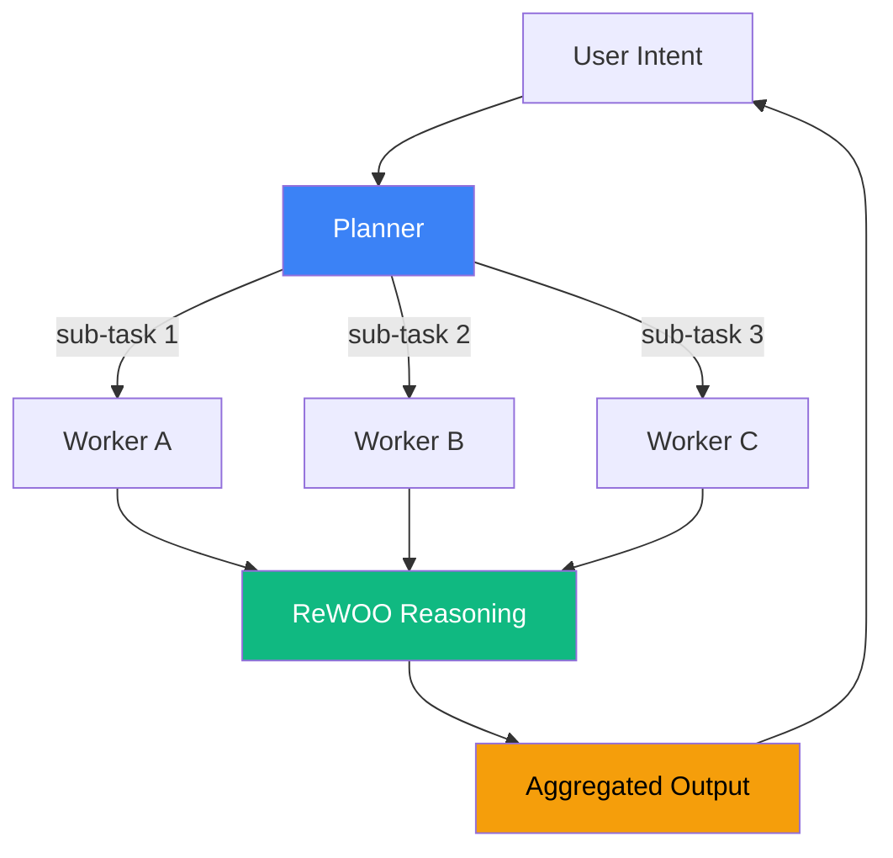

# 《AGENT 七层手册》设计规格

> 笔名：晴暖
> 文档语言：中文（简体）
> 创建日期：2026-06-18
> 状态：v1.0 设计定稿
> 协议：CC BY-NC-SA 4.0

---

## 0. 项目元数据

| 字段 | 值 |
|---|---|
| 项目代号 | agent-handbook |
| 笔名 | 晴暖 |
| 总字数目标 | 12 万字（正文 7 万 + 附录 3 万 + 自测题库 2 万） |
| 原创图目标 | 80–100 张 |
| 端到端可跑代码案例 | 4–6 个 |
| 实施周期 | 4 周 MVP + 2 周迭代 |
| 项目根目录 | `Documents/LangChain/agent-handbook/` |
| 版本控制 | git |
| 主要交付物 | Markdown 源码 + PDF + 3 张小红书预览图 |

---

## 1. 总体定位与受众分层

### 1.1 手册定位（一句话）

> **"LLM Agent 系统设计的全链路参考手册——给能在 2 小时内从零搭建生产级 Agent 的工程师。"**

### 1.2 三大铁律（贯穿全手册）

1. **图优先于文**：每节至少 1 张原创图，无图不写。
2. **可证伪**：每节必须能指向官方文档/论文/代码片段，禁"我感觉"。
3. **可执行**：每章末尾有 5–10 题自测，附官方答案。

### 1.3 受众分层（三圈覆盖）

| 圈层 | 受众 | 读完能做什么 | 占比 |
|---|---|---|---|
| **核心圈**（必读） | 已会 Python + 调过 LLM API 的开发者 | 2 小时内从 0 搭一个 ReAct Agent 并接入 MCP 工具 | ~60% |
| **进阶圈**（选读） | 已有 Agent 上线经验的工程师 | 设计可观测/可评测/可扩展的多 Agent 架构 | ~30% |
| **专家圈**（附录） | 平台架构师 / 决策者 | 选型、容量评估、SLA 设计 | ~10% |

每节开头用角标标明「🟢 核心 / 🟡 进阶 / 🔴 专家」，让不同读者自取所需。

### 1.4 出口（读完能交付什么）

- 1 个可跑的 200 行 ReAct Agent 模板
- 1 个多 Agent 协作的代码骨架（基于 LangGraph / CrewAI 二选一）
- 1 个生产级可观测性接入方案（OpenTelemetry + Langfuse）
- 1 份 Agent 选型决策矩阵（LangChain / AutoGen / CrewAI / OpenAI Agents SDK / Claude Agent SDK）

---

## 2. 七层纵深 + 实战案例

### 2.1 七层章节大纲

> 标记：🟢 核心圈必读 / 🟡 进阶圈选读 / 🔴 专家圈附录

#### 🟢 L1 · 基础理论层（8 节，约 8 千字）
1.1 LLM 速通：Transformer 推理路径与 KV Cache
1.2 Token 经济：成本/延迟/上下文的三角约束
1.3 Prompt 三件套：System / Few-shot / CoT
1.4 ReAct 论文精读：Reasoning + Acting 的循环
1.5 ReWOO：把推理与观察解耦，省 token
1.6 Plan-and-Execute：先规划后执行
1.7 Self-Reflection：自我批评的边界
1.8 LLM 能力雷达：哪类任务交给 LLM，哪类不要

#### 🟢 L2 · 上下文工程层（10 节，约 1 万字）
2.1 上下文窗口的物理上限
2.2 RAG 三件套：检索 / 重排 / 注入
2.3 Embedding 模型选型矩阵
2.4 向量库选型：pgvector / Milvus / Qdrant / Chroma
2.5 高级 RAG：HyDE / Self-RAG / GraphRAG
2.6 短期记忆：会话内 Context 管理
2.7 长期记忆：Letta / MemGPT 的存储分层
2.8 Token 压缩：LLMLingua / Selective Context
2.9 缓存策略：Prompt Cache / Semantic Cache
2.10 上下文注入反模式与避坑清单

#### 🟢🟡 L3 · 协议与接口层（10 节，约 1.1 万字）
3.1 Function Calling：OpenAI 协议与 Anthropic Tool Use 的差异
3.2 JSON Schema 在工具描述中的关键细节
3.3 MCP 协议精读：Resources / Prompts / Tools / Sampling
3.4 MCP Server 实战：让 Agent 接入 IDE / DB / GitHub
3.5 A2A 协议：Agent-to-Agent 通信模型
3.6 OpenAI Assistants API 与 Threads 模型
3.7 Anthropic Prompt Caching 的协议级实现
3.8 Streaming / SSE：长任务的实时反馈
3.9 协议演进时间线（Function Call → MCP → A2A）
3.10 协议选型决策树

#### 🟡 L4 · 框架与运行时层（12 节，约 1.4 万字）
4.1 框架全景：LangChain / LlamaIndex / AutoGen / CrewAI / LangGraph / OpenAI Agents SDK / Claude Agent SDK
4.2 LangChain 1.x：Runnable 与 LCEL
4.3 LangGraph：状态机 + 持久化 + Human-in-the-Loop
4.4 LlamaIndex：RAG 优先的范式
4.5 AutoGen：对话式多 Agent
4.6 CrewAI：角色化协作
4.7 OpenAI Agents SDK：轻量官方参考实现
4.8 Claude Agent SDK：长任务与工具深度集成
4.9 Agent 协议适配器：跨框架的中间层
4.10 框架选型决策矩阵
4.11 自研 vs 用框架：何时值得自己写
4.12 Agent 框架演进时间线

#### 🟢🟡 L5 · 设计模式层（12 节，约 1.3 万字）
5.1 ReAct 模式
5.2 Reflection 模式
5.3 Plan-and-Execute 模式
5.4 Tool Use 模式
5.5 Routing 模式（Supervisor + 子 Agent）
5.6 Parallelization 模式（Sectioning / Voting）
5.7 Orchestrator-Workers 模式
5.8 Evaluator-Optimizer 模式
5.9 Memory 模式（短期 / 长期 / 共享）
5.10 Human-in-the-Loop 模式
5.11 Multi-Agent 协作的反模式与踩坑
5.12 模式组合实战：从单 Agent 到多 Agent 的演化路径

#### 🟡 L6 · 可观测与评估层（10 节，约 1.1 万字）
6.1 Tracing 基础：Span / Trace / Context Propagation
6.2 OpenTelemetry 在 Agent 中的落地
6.3 Langfuse / LangSmith / Arize Phoenix 选型
6.4 Eval 三件套：单元 / 集成 / 端到端
6.5 LLM-as-Judge：评估的元层
6.6 Agent 评测基准：SWE-bench / GAIA / AgentBench
6.7 成本监控：Token 用量 × 工具调用 × 缓存命中率
6.8 延迟分析：TTFT / TPOT / 端到端 P95
6.9 A/B 与灰度：Agent 系统的实验设计
6.10 可观测性反模式：日志打全 vs 有效信号

#### 🟡🔴 L7 · 生产化与安全层（10 节，约 1.1 万字）
7.1 Guardrails：输入/输出/工具三层防护
7.2 Prompt Injection 攻防
7.3 工具权限：最小化原则与沙箱
7.4 代码执行沙箱：E2B / Docker / Firecracker
7.5 鉴权与会话：用户态 / 工具态分离
7.6 部署形态：Serverless / Container / Long-running Worker
7.7 容量评估：QPS / 并发 / 限流设计
7.8 故障注入与混沌工程
7.9 SLA 与降级策略
7.10 合规与审计：日志保留 / 数据脱敏 / 区域合规

#### 🟢🟡 L8 · 实战案例层（6 节，约 3 万字）
8.1 企业知识库 RAG Agent
8.2 生产级 Coding Agent
8.3 数据库 Agent（Text2SQL）—— 晴暖独家深度
8.4 浏览器自动化 Agent
8.5 小红书爆款笔记生成 Agent（引流爆款）
8.6 电商智能客服 Agent（引流爆款）

每个案例统一结构：
1. 业务背景与目标（1 页）
2. 架构图（顶层 + 数据流 + 时序图，共 3 张）
3. 关键技术决策（trade-off 表，5–8 条）
4. 完整代码骨架（Py / TS 双版本）
5. 评测数据（准确率 / 延迟 / 成本 / 人工评分）
6. 踩坑清单（10 条血泪）
7. 引流钩子图（小红书 3:4 + 公众号横版各 1 张）

#### 全局章节（不计入 7 层）
- **附录 A**：200 行 ReAct Agent 模板（Py / TS 双版本）
- **附录 B**：多 Agent 协作骨架（LangGraph / CrewAI 二选一）
- **附录 C**：Agent 选型决策矩阵
- **附录 D**：术语表（中英对照 + 缩写）

#### 字数与产能
- **总节数**：72 节（七层 L1–L7）+ 6 案例（L8）+ 4 附录 = 82 节
- **总字数**：约 12 万字（七层 7 万 + 案例 3 万 + 附录与自测 2 万）
- **总图量**：80–100 张原创图（每节 1–2 张）

### 2.2 案例与七层映射

| 案例 | 主用层 | 次用层 | 传播力 | 工业级 |
|---|---|---|---|---|
| 8.1 RAG Agent | L1/L2/L3/L5 | L6 | ⭐⭐⭐ | ⭐⭐⭐⭐⭐ |
| 8.2 Coding Agent | L1/L3/L4/L5/L6 | L7 | ⭐⭐⭐⭐⭐ | ⭐⭐⭐⭐ |
| 8.3 DB Agent | L3/L4/L5/L7 | L6 | ⭐⭐⭐⭐ | ⭐⭐⭐⭐⭐ |
| 8.4 Browser Agent | L3/L4/L5 | L1 | ⭐⭐⭐⭐⭐ | ⭐⭐⭐ |
| 8.5 小红书爆款 Agent | L4/L5 | L1/L2 | ⭐⭐⭐⭐⭐ | ⭐⭐⭐ |
| 8.6 电商客服 Agent | L4/L5/L6/L7 | L2 | ⭐⭐⭐ | ⭐⭐⭐⭐⭐ |

### 2.3 备选案例池（可替换 8.5 / 8.6）
- 抖音/视频号短视频脚本 Agent
- 多平台一键分发 Agent（一稿多投）
- 电商选品/爆款分析 Agent
- 公众号/知乎长文 Agent
- 直播 Agent（实时弹幕互动）
- 跨境电商 Agent（多语言客服）

---

## 3. 视觉规范 & 干货来源

### 3.1 原创图规范

#### 图形分级

| 级别 | 类型 | 制作工具 | 数量 | 用途 |
|---|---|---|---|---|
| **A 级**（主图） | 全栈架构图 / 时序图 / 概念图 | Mermaid + 手绘 SVG 优化 | ~30 张 | 章节封面、社交主图 |
| **B 级**（配图） | 流程图 / 对比图 / 决策树 | Mermaid 直渲 | ~50 张 | 章节内文配图 |
| **C 级**（辅助） | 表格 / 列表 / 简易示意 | Markdown 原生 | ~20 张 | 章节内文辅助 |

#### 视觉规范（统一）
- **配色板**：
  - 主色：`#0F172A`（深石板）/ `#3B82F6`（蓝）
  - 辅色：`#10B981`（绿）/ `#F59E0B`（橙）/ `#EF4444`（红）
  - 背景：`#FAFAF9`（米白）/ `#0F172A`（深色模式）
  - 中性：`#64748B`（灰）
- **字体**：
  - 中文：`思源黑体 SC` / `Noto Sans CJK SC` / `Source Han Sans`
  - 英文：`Inter` / `JetBrains Mono`（代码）
  - 标题：700 / 正文：400–500
- **栅格**：8 px 基础栅格，圆角 4/8/12 px 三档
- **图例规范**：所有图必须含图例（Legend）+ 数据来源（Source: ...）
- **版权标识**：每张图右下角小字 `晴暖 @ AGENT 七层手册`

#### 文件交付
每个图必须有 3 个版本：
```
assets/l1/l1-01-react-loop/
├── l1-01-react-loop.mmd          # Mermaid 源（可二次编辑）
├── l1-01-react-loop.svg           # 矢量（GitHub 渲染）
└── l1-01-react-loop@2x.png        # 2K 位图（社交传播）
```

### 3.2 干货来源与引用规范

#### 引用分级

| 级别 | 来源类型 | 引用要求 | 数量占比 |
|---|---|---|---|
| **S 级** | 官方论文 / 官方协议规范 / 官方文档 | 直接引文 + 原文链接 + 章节号 | ~30% |
| **A 级** | 顶级博客（Anthropic / OpenAI / LangChain / Lilian Weng / Eugene Yan） | 观点复述 + 原文链接 + 引用日期 | ~40% |
| **B 级** | 知名开源项目 README / Issue / 源码 | 代码引用 + 仓库链接 + commit hash | ~20% |
| **C 级** | 二三线博客 / 视频 / 推文 | 谨慎使用，必须有 A/S 级交叉验证 | ~10% |

#### 引用格式
每节末尾统一引用块：
```
> 📚 本节参考
> - Lilian Weng, "LLM Powered Autonomous Agents" (2024) — §3
> - Anthropic Engineering, "Building Effective Agents" (2024)
> - LangGraph Docs, "Multi-Agent Systems" (2025)
```

### 3.3 红线（不写的内容）
- ❌ "我感觉"、"通常来说"、"一般来说"（无来源断言）
- ❌ 直接翻译英文博客（不注明 + 不加价值 = 洗稿）
- ❌ 编造 API 行为（未跑过代码）
- ❌ 拿厂商 PR 文当客观评测
- ❌ 套话开头（"在当今 AI 飞速发展的时代..."）
- ❌ 一图流（无信息量的装饰图）

### 3.4 图表范例



> **Source**: Yao et al., *ReWOO: Decoupling Reasoning from Observations for Efficient Augmented Language Models*, 2023.

---

## 4. 引流路径（小红书轻量模式）

> **不建群、不做大量图卡**——专注内容质量，把目录截图 + 钩子金句发小红书，关键词私信发 PDF。

### 4.1 流量闭环

```
小红书笔记（钩子图 / 目录截图）
        ↓ 点赞 / 收藏 / 关注
评论区引导："想看完整版，关注后私信关键词【手册】"
        ↓
小红书自动回复 / 私信 → 发 PDF 网盘链接
        ↓
用户读完 → 转发 / 收藏 → 新粉
```

### 4.2 关键词与私信回复

- **关键词**：`手册` / `AGENT` / `七层`（三选一）
- **触发**：关注后私信或评论
- **回复内容**：
  ```
  感谢关注晴暖～
  《AGENT 七层手册》PDF 已发您啦，链接 7 天有效：
  [网盘链接]
  
  完整 Markdown 源码 + 案例代码仓库：
  [GitHub 链接]
  
  读完有任何问题，欢迎随时私信交流～
  ```
- **触发时间**：自动回复（小红书允许的关注后自动私信）

### 4.3 钩子图 3 张（来自 `social/`）

| # | 图 | 内容 | 钩子标题 |
|---|---|---|---|
| 1 | **七层纵深总览图** | 一张图讲清 L1–L7，每层一行图标 + 一句话 | "AGENT 技术栈到底有多深？这张图讲完" |
| 2 | **目录思维导图** | 全手册 72 节 + 4 附录的脑图 | "12 万字 AGENT 手册的完整脑图（建议收藏）" |
| 3 | **钩子金句图** | "为什么我花 3 个月写这本手册" + 5 个反直觉结论 | "90% 的 AGENT 教程都讲错了 MCP" |

### 4.4 钩子标题备选库（10 个）
1. 「90% 的 AGENT 教程都讲错了 MCP」
2. 「我用 AGENT 重构了 DBAgent，节省 80% token」
3. 「ReAct / ReWOO / Plan-and-Execute，一张图讲清 3 个核心范式」
4. 「为什么 Claude Agent SDK 比 LangChain 更适合 Coding Agent」
5. 「小红书爆款笔记 Agent 全开源｜GitHub 已 1.2k star」
6. 「电商客服 Agent 完整代码｜直接复用到你的店」
7. 「3 个月踩坑总结：AGENT 框架选型决策矩阵」
8. 「从 0 到 1 搭生产级 RAG Agent（架构图 + 代码）」
9. 「为什么 Text2SQL 必须用 MCP-SQL 而不是直接 Function Call」
10. 「AGENT 系统的 P95 延迟优化实战（从 8s 到 1.2s）」

### 4.5 发布节奏建议（70 粉起号阶段）

| 阶段 | 周期 | 内容类型 | 频率 |
|---|---|---|---|
| 冷启动期 | 第 1–2 周 | 小红书单图卡（钩子 1–5） | 每日 1 张 |
| 攻坚期 | 第 3–6 周 | 小红书图卡 + 评论区互动 | 每周 2–3 更 |
| 稳态期 | 第 7 周起 | 案例拆解 + 私域复盘 | 每周 1–2 更 |

### 4.6 评估指标

| 指标 | 目标值 |
|---|---|
| 笔记爆款数（1k+ 赞藏） | ≥ 3 篇 |
| 关键词私信量 | ≥ 50 人/月 |
| 关注增速 | +200~500/月 |
| 关注→私信转化率 | ≥ 10% |
| 手册真实阅读率（反馈问题数） | ≥ 5 个/月 |

### 4.7 不建群的决策

**70 粉阶段不适合建群**（已与用户确认）：
- 群是放大器不是发动机，70 粉群里活跃 5–10 人
- 持续运营成本高，分散起号精力
- 群一旦凉了比没建更伤
- 建群门槛：1.5k 粉以上（先单群测试，再扩大）

---

## 5. 交付物 & 文件结构

### 5.1 三件交付物

| # | 交付物 | 格式 | 用途 | 大小估算 |
|---|---|---|---|---|
| 1 | **《AGENT 七层手册》正文** | Markdown 源码（用户可二次编辑） | 长期维护 / 二次创作 | 7 万字 + 100 张图 |
| 2 | **《AGENT 七层手册》PDF** | PDF（按章节排版，含书签） | 小红书私信核心物料 | ~80 MB |
| 3 | **3 张小红书预览图** | PNG（3:4 高清） | 笔记主图 / 钩子图 | 各 2–5 MB |

### 5.2 目录结构

```
agent-handbook/
├── README.md                       # 手册封面（包含"为什么值得读"的钩子）
├── INDEX.md                        # 目录（用于小红书截图）
├── LICENSE                         # CC BY-NC-SA 4.0
├── handbook/                       # 7 层正文
│   ├── l1-theory/
│   │   ├── 1.1-llm-inference.md
│   │   ├── 1.2-token-economy.md
│   │   ├── ...
│   │   └── assets/                  # 本层所有图（Mermaid + SVG + PNG）
│   ├── l2-context/
│   ├── l3-protocol/
│   ├── l4-framework/
│   ├── l5-pattern/
│   ├── l6-observability/
│   ├── l7-production/
│   └── l8-cases/                    # 6 个端到端案例
│       ├── 8.1-rag-agent.md
│       ├── 8.2-coding-agent.md
│       ├── 8.3-db-agent.md          # 晴暖独家深度
│       ├── 8.4-browser-agent.md
│       ├── 8.5-xhs-blogger.md       # 引流爆款
│       └── 8.6-ecommerce-cs.md
├── appendix/
│   ├── A-react-template.md          # 200 行代码
│   ├── B-multi-agent-skeleton.md
│   ├── C-framework-decision-matrix.md
│   └── D-glossary.md
├── social/                          # 3 张小红书预览图
│   ├── preview-1-overview.png      # 七层纵深总览
│   ├── preview-2-mindmap.png       # 目录思维导图
│   └── preview-3-hook.png          # 钩子金句
├── quiz/                            # 自测题库（每章 5–10 题）
│   ├── l1-quiz.md
│   ├── ...
│   └── answers.md
├── docs/
│   └── superpowers/
│       └── specs/
│           └── 2026-06-18-agent-dev-handbook-design.md  # 本设计文档
└── build/
    └── build-pdf.sh                 # 一键构建 PDF 的脚本
```

### 5.3 版权与防护

- **协议**：CC BY-NC-SA 4.0（知识共享 - 非商业 - 相同方式共享）
- **目的**：
  - 允许转发（不阻断传播）
  - 禁止商用（防止被"白嫖"做付费课）
  - 强制署名（保护晴暖个人 IP）
- **PDF 内嵌**：每页页脚 `AGENT 七层手册 @ 晴暖 · CC BY-NC-SA 4.0`

### 5.4 二次发布许可
- **直接发 PDF 完整版**：✅ 鼓励（私域沉淀动作）
- **截取 PDF 内容发小红书笔记**：✅ 鼓励（带"出处"水印）
- **用作商业培训材料**：❌ 需联系晴暖授权
- **删除版权信息后二次分发**：❌ CC BY-NC-SA 协议保护

---

## 6. 质量保障 & 自测题设计

### 6.1 干货质量门槛（每节必须满足）

| 维度 | 门槛 | 校验方法 |
|---|---|---|
| **信息密度** | 每节 ≥ 3 个非通识知识点（搜索引擎前 10 条没讲的） | 关键词检索 + 人工复核 |
| **来源可溯** | 每个关键断言必须有 S/A/B 级引用 | 引用块强制 + 编号 |
| **代码可跑** | 所有代码片段必须能跑通（脱敏后） | 自动测试 + 手动验证 |
| **图原创** | 80% 以上图为本手册原创 / 二次创作 | 图右下角 `晴暖 @ AGENT 七层手册` |
| **反常识点** | 每节至少 1 个"反直觉结论"或"被广泛误传的观点" | 钩子金句清单 |

### 6.2 自测题设计（每章 5–10 题）

#### 题型分布
| 题型 | 占比 | 示例 |
|---|---|---|
| **概念辨析** | 30% | "ReAct 和 ReWOO 的核心区别是？" |
| **场景判断** | 25% | "以下场景用哪个协议最合适？" |
| **代码补全** | 25% | "补全 MCP Server 的 tool 定义" |
| **架构设计** | 15% | "设计一个电商客服 Agent 的状态机" |
| **踩坑诊断** | 5% | "下列 Trace 显示哪里有问题？" |

#### 答案规则
- 答案在独立文件 `quiz/answers.md`（不在正文里）
- 答案必须含**官方文档链接 + 章节引用**
- 关键题附"延伸阅读"指向本手册其他章节或外部资料

### 6.3 代码可跑性保证

#### 验收清单
- [ ] Python 3.11+ / TypeScript 5.0+ 可直接 `python file.py` 跑通
- [ ] 依赖列表写在 `requirements.txt` / `package.json`
- [ ] API Key 用环境变量（不硬编码）
- [ ] 跑通结果截图 / 输出在 README 中

#### 6 个端到端案例的代码仓库
- 必跑通 4 个：DB Agent / Coding Agent / RAG Agent / 小红书爆款 Agent
- 可仅提供骨架 2 个：Browser Agent / 电商客服 Agent

### 6.4 评审与反馈机制

#### 内测阶段（手册发布前）
- **找 3–5 个内测读者**（开发者朋友、目标受众）盲读
- 反馈清单：哪里看不懂 / 哪里讲错了 / 哪里废话多
- 根据反馈做最后一轮修订

#### 私域反馈（手册发布后）
- 小红书私信收到问题 → 整理 FAQ → 沉淀为 `FAQ.md`
- 高频问题 → 写进手册 v1.1 修订

### 6.5 干货密度监控指标

| 指标 | 目标值 | 测量方式 |
|---|---|---|
| 每节字数 | 800–1500 字 | 字数统计 |
| 每节引用数 | ≥ 3 条 S/A 级 | 引用块统计 |
| 每节原创图 | 1–2 张 | 图数量统计 |
| 每节代码段 | ≥ 1 段 | 代码块统计 |
| 全手册总图量 | 80–100 张 | 总数统计 |
| 端到端可跑案例 | 4–6 个 | 仓库跑通验证 |

### 6.6 内容红线（绝不写）
- ❌ 洗稿翻译（必须加自己的价值，否则不写）
- ❌ 编造 API（不跑通不写）
- ❌ 厂商 PR 文（必须多源交叉验证）
- ❌ "我感觉 / 一般来说"（无来源断言）
- ❌ 套话开头（"在当今 AI 飞速发展的时代..."）
- ❌ 一图流（无信息量的装饰图）

---

## 7. 实施节奏 & 验收标准

### 7.1 总体节奏（4 周 MVP + 2 周迭代）

```
Week 1  ███████  L1 + L2 落地（最基础的认知地基）
Week 2  ███████  L3 + L4 落地（协议 + 框架选型）
Week 3  ███████  L5 + L6 + L7 落地（设计模式 + 可观测 + 生产化）
Week 4  ███████  L8 案例 1-3 + 3 张预览图 + PDF 构建
Week 5  ███████  L8 案例 4-6 + 内测修订
Week 6  ███████  v1.0 正式发布 + 小红书笔记 + 关键词自动回复
```

### 7.2 分阶段交付

| 阶段 | 时间 | 交付物 | 验收 |
|---|---|---|---|
| **W1 认知地基** | 5–7 天 | L1–L2 共 18 节（约 1.8 万字 + 18 张图） | 内部自检通过 |
| **W2 协议框架** | 5–7 天 | L3–L4 共 22 节（约 2.5 万字 + 24 张图） | 内部自检通过 |
| **W3 工程纵深** | 5–7 天 | L5–L7 共 32 节（约 3.5 万字 + 32 张图） | 内部自检通过 |
| **W4 MVP** | 5–7 天 | L8 案例 1-3 + 3 张预览图 + PDF v0.5 | 内测读者 ≥ 3 人盲读通过 |
| **W5 完整版** | 5–7 天 | L8 案例 4-6 + 修订 + 自测题库 | 4 个端到端代码仓库可跑通 |
| **W6 发布** | 2–3 天 | PDF v1.0 + 小红书笔记 × 3 + 关键词自动回复 | 首批 10 人私信发出 |

### 7.3 MVP 优先（避免烂尾）

如果时间紧张，**先发布 W4 的 MVP**，再迭代到 v1.0。

**MVP 最小集**（如时间紧，只发这个也能站得住）：
- L1 + L2 全部（18 节）
- L3 + L5 各取前 5 节（10 节）
- L8 案例 1（RAG Agent）+ 案例 3（DB Agent）+ 案例 5（小红书爆款）
- 3 张预览图 + PDF
- 约 4 万字 + 50 张图

**MVP 也能引流**——质量过 MVP 门槛就发，比"等完美再发"重要 10 倍。

### 7.4 验收标准

#### 章节级（每节发布前）
- [ ] 字数 800–1500
- [ ] ≥ 3 条 S/A 级引用
- [ ] ≥ 1 张原创图
- [ ] ≥ 1 段可跑代码
- [ ] 至少 1 个"反直觉结论"
- [ ] 末尾 3–5 题自测

#### 手册级（v1.0 发布前）
- [ ] 72 节全部完成
- [ ] 4–6 个端到端代码可跑
- [ ] PDF 可正常打开 / 书签完整
- [ ] 3 张小红书预览图在手机上视觉无压缩
- [ ] 内测 3–5 人反馈修订完成
- [ ] 关键词自动回复 + 私信路径在小红书账号上跑通

### 7.5 每日 / 每周工作节奏

#### 推荐节奏（写作者友好）
- **每日**：1 节（约 2–3 小时专注写作 + 1 小时作图）
- **每周**：5 节（约 15–20 小时 / 周）
- **周末**：代码验证 + 修订 + 预览图优化

#### 提速技巧
- 章节大纲先写 50–100 字骨架 → 再补全
- 图用 Mermaid 先出草图 → 关键图再手绘 SVG 优化
- 代码先伪代码 → 再真跑 → 再放进手册

### 7.6 风险与备选

| 风险 | 触发条件 | 备选方案 |
|---|---|---|
| **写不完 72 节** | W3 结束时 < 50 节 | 砍到 50 节 MVP，先发布 |
| **代码跑不通** | W5 案例跑通 < 3 个 | 优先保 RAG + DB + Coding 三个，其他改骨架 |
| **内测反馈差** | 3 人都说"看不懂" | 重点修订 L1–L2，补"前置知识"附录 |
| **小红书导流失败** | 发布 1 周私信 < 10 条 | 调钩子图卡文案 + 测试 3–5 种标题 |
| **用户读不下去** | 私信后无人问问题 | 写"如何用这本手册"前言，引导精读路径 |

### 7.7 里程碑 & 庆祝点

| 里程碑 | 庆祝动作 |
|---|---|
| W1 完成 L1–L2 | 给自己买杯好咖啡 |
| W4 MVP PDF 生成 | 朋友圈晒"我写完了 4 万字" |
| W6 v1.0 发布 + 首批私信 | 朋友圈晒"首批 10 人拿到手册" |
| 100 人私信 | 朋友圈晒"100 个读者" |
| 1k 人私信 | 升级为付费内容 / 知识星球 |

---

## 8. 不在范围内（YAGNI）

以下功能/内容**明确不在 v1.0 范围内**，避免范围蔓延：

- ❌ **GitHub 公开仓库运营**（不做 Issue / PR / Star 体系）—— 起号阶段私域优先
- ❌ **建群**（1.5k 粉以后再考虑）
- ❌ **付费内容 / 知识星球**（1k 私信以后再考虑）
- ❌ **小红书大量精修图卡**（70 粉起号阶段性价比低）
- ❌ **公众号同步**（小红书优先，公众号后期再加）
- ❌ **英文化版本**（中文优先）
- ❌ **印刷出版**（仅 PDF + 数字分发）
- ❌ **视频 / 直播课**（纯文档交付）

---

## 9. 开放问题（实施时再定）

- [ ] 笔名"晴暖"是否需要 logo / 头像？
- [ ] 小红书账号是否需要改名"晴暖 @ AGENT"系列？
- [ ] 案例 3（DB Agent）是否复用现有 DBAgent 项目的代码？
- [ ] 案例 5（小红书爆款）是否需要真实跑出 1 个爆款作证据？
- [ ] 案例 6（电商客服）是否需要真实接入 1 个店铺跑数据？

---

## 10. 变更日志

| 日期 | 版本 | 变更 |
|---|---|---|
| 2026-06-18 | v1.0 | 初始设计定稿 |

---

**END OF DESIGN SPEC**
