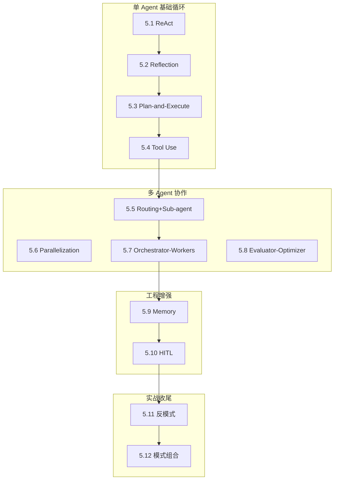

# L5 · 设计模式层 实施规格

> 笔名：晴暖
> 文档语言：中文（简体）
> 创建日期：2026-06-21
> 状态：v1.0 设计定稿
> 协议：CC BY-NC-SA 4.0
> 父级规格：`docs/superpowers/specs/2026-06-18-agent-dev-handbook-design.md`

---

## 0. 项目背景

P0-P4 已完成（项目骨架 + L1-L4 共 40 节 / ~5.3 万字 / 46 张图）。P5 启动 L5 设计模式层（12 节 / ~1.3 万字），是七层手册的"模式抽象层"——把 L4 框架层（L4 讲"具体框架怎么用"）抽象为可复用模式。

**L5 的核心价值**：跨框架的"模式词汇表"。读者读完 L5 后，遇到任何 Agent 框架都能用 12 个模式快速分类："这是 ReAct 风格" / "这是 Orchestrator-Workers 风格"——而非从零理解。

---

## 1. L5 在七层中的定位

```
L1 基础理论 → L2 上下文 → L3 协议 → L4 框架 → ★L5 模式★ → L6 可观测 → L7 生产 → L8 案例
                                                  ↑
                                            "跨框架词汇表"
```

| 维度 | L4 框架层 | L5 模式层 |
|---|---|---|
| 视角 | "LangGraph 怎么用" | "ReAct 是什么" |
| 抽象度 | 框架 API + 代码 | 模式定义 + 伪代码 |
| 可移植性 | 绑死具体框架 | 跨框架通用 |
| 字数预算 | 1.4 万字 | 1.3 万字 |
| 受众 | 🟡 进阶 | 🟢🟡 核心+进阶 |

---

## 2. 受众与门槛

| 圈层 | 受众 | 读完能做 | 占比 |
|---|---|---|---|
| 🟢 核心圈（必读） | 学完 L1-L4 的开发者 | 用 12 个模式词汇表描述任意 Agent 系统 | ~70% |
| 🟡 进阶圈（选读） | 已有 Agent 上线经验 | 设计多 Agent 架构 + 选模式 + 避反模式 | ~25% |
| 🔴 专家圈 | 平台架构师 | 模式组合 + 演化路径 + 工程权衡 | ~5% |

**前置知识**：必须读完 L1.4 ReAct 论文 + L3.1 Function Calling + L4.3 LangGraph（最小集合）。

---

## 3. L5 12 节详细大纲

> **结构总览**：
> - 单 Agent 基础循环（🟢 4 节）
> - 多 Agent 协作（🟡 4 节）
> - 工程增强（🟡 2 节）
> - 实战收尾（🟢🟡 2 节）

### 5.1 ReAct 模式 🟢

- **意图**：Reasoning + Acting 交替循环——LLM 先思考（Reasoning），再行动（Tool Use），观察结果（Observation），再回到 Reasoning。
- **反直觉钩子**：ReAct 不是"先想清楚再执行"，而是"边想边做"——每一步都可能修正上一步的计划。
- **适用场景**：单 Agent + 多工具 + 步骤数 < 10 的中等复杂度任务。
- **关键机制**：ReAct 论文精读（Yao et al. 2022）+ LangChain `create_react_agent` 落地 + Plan-and-Execute 派生。
- **与其他模式对比**：ReAct vs Plan-and-Execute（一次性规划 vs 边走边规划）/ ReAct vs Reflection（外部工具 vs 内部自评）。

### 5.2 Reflection 模式 🟡

- **意图**：Self-Critique 循环——Agent 生成结果后，让"评审员"（同 LLM 或不同 LLM）打分或提出修改意见，反复迭代提质量。
- **反直觉钩子**：Reflection 不只是"再问一次"——必须结构化批评（"具体哪里错" + "为什么错" + "怎么改"），否则变成"重新随机生成"。
- **适用场景**：写作 / 代码生成 / 长报告——质量高于速度的任务。
- **关键机制**：Self-Refine 论文 + Reflexion 论文 + Constitutional AI 思想。
- **与其他模式对比**：Reflection vs ReAct（自我批评 vs 工具调用）/ Reflection vs Evaluator-Optimizer（轻量 vs 重量评估）。

### 5.3 Plan-and-Execute 模式 🟢

- **意图**：先规划后执行——Planner 生成完整步骤列表，Executor 按步骤执行；Re-planner 在执行失败时重新规划。
- **反直觉钩子**：Plan-and-Execute 不是"ReAct 的优化版"——本质是"分离推理与执行"，节省 token（Planner 只调一次），但牺牲灵活性（计划固化后难改）。
- **适用场景**：步骤明确的多步任务（数据 ETL / 报告生成 / 多 API 调用链）。
- **关键机制**：LangChain `PlanAndExecute` agent + BabyAGI / AutoGPT 思想。
- **与其他模式对比**：Plan-and-Execute vs ReAct（一次性规划 vs 动态规划）/ vs Orchestrator-Workers（计划已知 vs 动态分发）。

### 5.4 Tool Use 模式 🟢

- **意图**：让 LLM 调用外部工具（Function Calling + MCP）—— LLM 输出结构化"工具调用指令"，由运行时执行，结果回灌 LLM。
- **反直觉钩子**：Tool Use 不是"LLM 直接调 API"——LLM 只生成"调用意图"，运行时负责"实际执行 + 错误处理 + 重试"。Tool 数量从 0 到 100+ 的扩展性靠 schema 描述质量，而非 LLM 能力。
- **适用场景**：几乎所有 Agent——Tool Use 是 L4 4.x 的基础协议。
- **关键机制**：OpenAI Function Calling + Anthropic Tool Use + MCP 协议（3.3）+ 工具描述质量（3.2 JSON Schema）。
- **与其他模式对比**：Tool Use vs Routing（工具是"被动执行"，Agent 是"主动决策"）。

### 5.5 Routing 模式（Supervisor + Sub-agent）🟡

- **意图**：Triage Agent（路由器）决定请求该派给哪个子 Agent / 子工具；Supervisor 风格 = 中心化分发。
- **反直觉钩子**：Routing 不只是"if-else 分发"——Supervisor 用 LLM 决策派给谁（动态），比硬编码路由灵活但慢；2025 年新趋势是 **Sub-agent Delegation**（Claude Agent SDK + LangGraph 都强化），父 Agent 把任务"完整委派"给子 Agent 而非"单步工具调用"。
- **适用场景**：客服分流（订单 Agent / 账单 Agent / 通用 Agent）/ 多领域专家系统。
- **关键机制**：LangGraph Supervisor + Claude Agent SDK sub-agents + OpenAI Agents SDK handoffs。
- **与其他模式对比**：Routing vs Orchestrator-Workers（静态分发 vs 动态委派）/ vs Parallelization（串行 vs 并行分发）。

### 5.6 Parallelization 模式（Sectioning / Voting）🟡

- **意图**：同一任务分给多个 Agent 并行处理，结果合并——Sectioning 切分任务后并行，Voting 多次执行后投票。
- **反直觉钩子**：Parallelization 不是"为了快"——主要价值是"提质量"（多次投票过滤错误）+ "提覆盖"（不同视角看同一问题）；token 成本是串行的 N 倍。
- **适用场景**：代码评审（多 reviewer 投票）/ 内容生成（多风格输出后选优）/ 高风险决策（多 LLM 共识）。
- **关键机制**：Anthropic 5 模式之一 + MapReduce 思想 + Self-Consistency。
- **与其他模式对比**：Parallelization vs Orchestrator-Workers（独立并行 vs 协调委派）/ vs Evaluator-Optimizer（生成一次 vs 多次）。

### 5.7 Orchestrator-Workers 模式 🟡

- **意图**：Orchestrator（中央调度）动态生成子任务，Workers 并行执行；Orchestrator 收集结果再决定下一步——循环直到目标达成。
- **反直觉钩子**：Orchestrator-Workers 不等于"主从架构"——Orchestrator 的输出是"任务描述 + Workers 列表 + 执行顺序"，不是"命令"；Workers 可以拒绝 / 反问 / 委派回 Orchestrator。
- **适用场景**：复杂研究（multi-source 数据采集）/ Coding Agent（sub-agent 委派）/ 报告生成。
- **关键机制**：LangGraph `Send` API + Claude Agent SDK `Task` tool + Anthropic 5 模式。
- **与其他模式对比**：Orchestrator-Workers vs Routing（计划已知 vs 动态生成）/ vs Plan-and-Execute（任务结构 vs 任务列表）。

### 5.8 Evaluator-Optimizer 模式 🟡

- **意图**：生成器（Generator）产生结果，评估器（Evaluator）打分，达不到阈值则回到生成器重试——直到通过或超最大迭代。
- **反直觉钩子**：Evaluator-Optimizer 不是"Reflection 的强化版"——Evaluator 是独立的"裁判 Agent"，可以基于规则（regex / 单元测试）或基于 LLM-as-Judge；与 Reflection 的"自我批评"不同，Evaluator 引入"外部视角"。
- **适用场景**：翻译质量 / 代码可运行性 / 报告合规性。
- **关键机制**：LLM-as-Judge + 结构化评估 prompt + 阈值 + 重试。
- **与其他模式对比**：Evaluator-Optimizer vs Reflection（独立裁判 vs 自我批评）/ vs Parallelization Voting（多次独立 vs 迭代改进）。

### 5.9 Memory 模式（短期 / 长期 / 共享）🟡

- **意图**：让 Agent "记住"——短期记忆（当前会话）/ 长期记忆（跨会话知识）/ 共享记忆（多 Agent 共享状态）。
- **反直觉钩子**：Memory 不是"无限 Context"——Memory 的本质是"选择性召回"（哪些进 Context / 哪些淘汰），而非"全部保留"。MemGPT / Letta 的"虚拟 Context"思想就是分层 Memory。
- **适用场景**：个人助手（长期偏好）/ 多 Agent 协作（共享任务状态）/ 长会话（短期摘要）。
- **关键机制**：Letta / MemGPT / LangGraph Checkpoint + Vector DB 召回。
- **与其他模式对比**：Memory vs Context Engineering（L2 讲 Context 压缩；L5 讲"哪些进 Context"）。

### 5.10 Human-in-the-Loop 模式 🟡

- **意图**：在关键决策点插入人工审批——Agent 暂停（interrupt），等人类批准 / 修改 / 拒绝，再恢复执行。
- **反直觉钩子**：HITL 不是"加个 confirm 按钮"——专业 HITL 必须设计"**何时打断**"（不是每个工具都打断）+ "**打断什么粒度**"（计划 / 工具调用 / 最终结果）+ "**恢复上下文**"（如何把人类反馈注入 LLM）。
- **适用场景**：高风险操作（删库 / 转账 / 发送邮件）/ 长任务 checkpoint / 合规审批。
- **关键机制**：LangGraph `interrupt()` + Claude Agent SDK permission mode + 审批 UI 设计。
- **与其他模式对比**：HITL vs Tool Use（人类是"工具"还是"决策者"）。

### 5.11 Multi-Agent 反模式与踩坑 🟢🟡

- **意图**：血泪清单——多 Agent 协作的 8 大反模式（踢皮球循环 / 信息孤岛 / 协调者瓶颈 / 通信成本爆炸 / 调试噩梦 / 共识陷阱 / 上下文蔓延 / 错误放大）。
- **反直觉钩子**：多 Agent 不是"越多人越快"——单 Agent 串行比 3 Agent 协作在 70% 场景下更快、更便宜、更稳定。多 Agent 的"复杂度税"在 < 5 步任务上**永远不划算**。
- **适用场景**：所有多 Agent 项目——此节是"避坑地图"。
- **关键机制**：8 大反模式 + 每个反模式的"症状 + 根因 + 修复"。
- **与其他模式对比**：本节是"模式的反例集"，与 5.5-5.8 形成正反对照。

### 5.12 模式组合实战：从单 Agent 到多 Agent 演化路径 🟢🟡

- **意图**：真实工程案例——同一个"研究助手"任务，从 ReAct（单 Agent）→ Plan-and-Execute + Reflection（单 Agent 进阶）→ Routing + Multi-Agent（多 Agent 起步）→ Orchestrator-Workers + HITL（生产级）。展示模式如何**叠加演化**，而非"选一个用"。
- **反直觉钩子**：生产级 Agent 不是"用了一个模式"，而是"用了 4-5 个模式叠加"——ReAct 做工具调用 + Reflection 做质量把控 + HITL 做关键审批 + Memory 做跨会话 + Routing 做子任务委派。
- **适用场景**：所有生产 Agent 的"演化路径图"。
- **关键机制**：1 个完整案例（"研究助手"演化 4 阶段）+ 1 张演化路径图 + 1 套代码骨架（每阶段 30-50 行 LangGraph）。
- **与其他模式对比**：本节是"模式如何组合使用"的总收尾，与 L8 案例形成"模式抽象 → 端到端实现"的递进。

---

## 4. 每节固定结构（模式卡模板）

每节统一 7 个 block，800-1100 字，1 张 mermaid 主图，1 段代码骨架：

```markdown
# 5.X 模式名：副标题

> 🟢 核心 / 🟡 进阶

> **本节钩子**：（1 句话 + 反直觉结论）

## 正文大纲

1. **意图**（1 句话定义）
2. **适用场景**（3 个典型 + 2 个反例）
3. **流程图**（mermaid 主图）
4. **代码骨架**（5-15 行伪代码 / LangGraph 参考实现）
5. **反模式**（1-2 个常见错用）
6. **与其他模式对比**（对比表：本模式 vs 相邻 2-3 个模式）

## 图

```mermaid
（主流程图，含 Source: 标注）
```

## 代码

```python
（5-15 行骨架代码）
```

实战要点：
1. （关键细节 1）
2. （关键细节 2）

## 框架映射

| 框架 | API 入口 | 备注 |
|---|---|---|
| LangGraph | `create_react_agent` / `StateGraph` | （一行说明） |
| AutoGen | `AssistantAgent` | |
| CrewAI | `Agent(role=...)` | |
| OpenAI Agents SDK | `Agent(tools=[...])` | |

## 自测题

（5 题：概念辨析 / 场景判断 / 代码补全 / 反直觉 / 对比）

**答案**：（5 题答案 + 官方文档链接）

> 📚 本节参考
> （≥3 条 S/A 级引用）
```

---

## 5. 章节首页（L5 README）设计

```markdown
# L5 · 设计模式层（12 节 / 1.3 万字）

> 🟢🟡 核心+进阶

> **本层定位**：跨框架的"模式词汇表"——用 12 个模式快速分类任意 Agent 系统。

## 模式全景图



## 12 节一句话导览

| 节 | 模式 | 一句话 |
|---|---|---|
| 5.1 | ReAct | 边想边做，工具调用循环 |
| 5.2 | Reflection | 自批评迭代提质量 |
| 5.3 | Plan-and-Execute | 先规划后执行，省 token |
| 5.4 | Tool Use | LLM 调外部工具的协议模式 |
| 5.5 | Routing+Sub-agent | Supervisor 分发 + 子 Agent 委派 |
| 5.6 | Parallelization | 并行加速 + 投票提质 |
| 5.7 | Orchestrator-Workers | 动态委派，LangGraph 主战场 |
| 5.8 | Evaluator-Optimizer | 外部裁判迭代 |
| 5.9 | Memory | 短期/长期/共享三层记忆 |
| 5.10 | HITL | 关键决策点人工审批 |
| 5.11 | 反模式 | 多 Agent 8 大踩坑 |
| 5.12 | 模式组合 | 从单 Agent 到多 Agent 演化 |

## 学习路径

- **必读路径**（🟢 核心 / 4 节）：5.1 → 5.4 → 5.11 → 5.12
- **进阶路径**（🟡 / 6 节）：5.2 → 5.3 → 5.5 → 5.7 → 5.9 → 5.10
- **速读路径**（4 节精华）：5.1 → 5.5 → 5.7 → 5.12

## 与其他层衔接

| 层 | 衔接点 |
|---|---|
| **L3 协议** | MCP/A2A 支撑 5.4 Tool Use / 5.5 Routing |
| **L4 框架** | LangGraph 是 5.7 Orchestrator-Workers / 5.10 HITL 主战场 |
| **L6 可观测** | 5.11 反模式中的"observability 盲点"指向 L6 |
| **L7 生产** | 5.10 HITL 的安全/合规意义在 L7 详细展开 |
| **L8 案例** | 5.12 模式组合在 L8 端到端落地（8.2 Coding Agent 等） |
```

---

## 6. 字数与图数预算

| 节 | 字数 | 图数 | 代码段 | 引用 |
|---|---|---|---|---|
| 5.1 ReAct | 1100 | 1 | 1 | ≥3 |
| 5.2 Reflection | 900 | 1 | 1 | ≥3 |
| 5.3 Plan-and-Execute | 1000 | 1 | 1 | ≥3 |
| 5.4 Tool Use | 1100 | 1 | 1 | ≥3 |
| 5.5 Routing | 1100 | 1 | 1 | ≥3 |
| 5.6 Parallelization | 1000 | 1 | 1 | ≥3 |
| 5.7 Orchestrator-Workers | 1100 | 1 | 1 | ≥3 |
| 5.8 Evaluator-Optimizer | 1000 | 1 | 1 | ≥3 |
| 5.9 Memory | 1100 | 1 | 1 | ≥3 |
| 5.10 HITL | 1100 | 1 | 1 | ≥3 |
| 5.11 反模式 | 1200 | 1 | 1 | ≥3 |
| 5.12 模式组合 | 1300 | 2 | 1 | ≥3 |
| **L5 README** | 800 | 1 | 0 | ≥3 |
| **合计** | **~1.38 万字** | **14 张图** | 12 段 | — |

验收阈值（与 L4 一致）：字数 800-1500 / 节，引用 ≥3 S/A 级 / 节，图 ≥1 张 / 节。

---

## 7. 干货来源与引用规范

每节 ≥3 条 S/A 级引用（与 L4 一致），主推来源：

| 级别 | 来源 |
|---|---|
| S | Anthropic *"Building Effective Agents"* (2024-10)、Anthropic *"How we built our multi-agent research system"* (2025)、OpenAI Agents SDK 官方文档、LangGraph 官方文档、Claude Agent SDK README、Yao et al. *ReAct* 论文 (2022)、Shinn et al. *Reflexion* 论文 (2023)、Wang et al. *Plan-and-Execute* 论文 (2023) |
| A | Lilian Weng *"LLM Powered Autonomous Agents"* (2023)、LangChain Blog *Multi-Agent Systems* (2025)、Chip Huyen *"AI Engineering"* (2024)、Eugene Yan 博客 |

---

## 8. 验收标准

每节必须满足：

| 维度 | 门槛 | 校验方法 |
|---|---|---|
| 字数 | 800-1500 字 | `scripts/check_word_count.py` |
| 引用 | ≥3 条 S/A 级 | `scripts/check_references.py` |
| 图 | ≥1 张 mermaid | `scripts/check_figures.py` |
| 代码 | ≥1 段骨架代码 | 人工核查 |
| 反直觉 | ≥1 个反直觉结论 | 钩子段强制 |
| 模式对比 | ≥1 个对比表 | "与其他模式对比" block |
| 框架映射 | 4 框架 API 入口 | "框架映射" block |

L5 全层验收：`bash scripts/run_all_checks.sh handbook/l5-pattern/` 必须全部通过。

---

## 9. 实施策略

**并行方案**（与 P5+ 已与用户确认）：
- **3 批 × 4 节 + Worktree 隔离**
- 批 1（单 Agent 基础循环）：5.1 → 5.2 → 5.3 → 5.4
- 批 2（多 Agent 协作）：5.5 → 5.6 → 5.7 → 5.8
- 批 3（工程增强 + 实战收尾）：5.9 → 5.10 → 5.11 → 5.12

**流程细节**：
1. 每批创建 worktree（`l5-batch-1` / `l5-batch-2` / `l5-batch-3`）
2. 批内 4 节串行 commit（避免 in-place edit 并发冲突）
3. 批间串行（批 2 依赖批 1 模式命名一致性）
4. 章节首页串行写（依赖 12 节全部完成）
5. 整体跑 `run_all_checks.sh` 验证
6. merge worktree 回 master

**每节 commit 信息模板**：
```
feat(l5): 5.X 模式名（副标题）

- 一句话定义 + 反直觉钩子
- 主流程图 mermaid
- 代码骨架（5-15 行）
- 框架映射（4 框架 API 入口）
- 自测题 5 题 + 答案
- S/A 级引用 ≥3 条

字数：XXX 字 | 图：1 张 | 引用：N 条
```

---

## 10. 风险与缓解

| 风险 | 影响 | 缓解 |
|---|---|---|
| 模式命名与 L1-L4 冲突 | 读者认知混乱 | 5.1-5.4 复用 L1 论文术语（ReAct / Reflection / Plan-and-Execute），5.5+ 沿用 Anthropic 命名 |
| 与 L4 内容重叠 | 字数浪费 | 边界清晰化——L4 讲"框架 API"，L5 讲"模式抽象"；L5 不贴完整框架代码 |
| 12 节字数爆 1.5 万 | 验收失败 | 5.1-5.4 控制 1000 字左右，5.11/5.12 给到 1200-1300 字 |
| 模式引用编造 API | 质量失真 | 5.5/5.7 必引用 LangGraph / Claude Agent SDK / OpenAI Agents SDK 官方 README curl 验证 |
| 与 L8 案例脱节 | 闭环断裂 | 5.12 必须引用 8.2 Coding Agent 作为"模式组合的端到端实现" |

---

## 11. 与全局规格的一致性

本规格完全对齐 `docs/superpowers/specs/2026-06-18-agent-dev-handbook-design.md` 第 112-124 行 L5 主题定义，并在以下 3 处做了**显式微调**：

1. **5.5 命名增强**：原 "Routing 模式（Supervisor + 子 Agent）" → 现 "Routing 模式（Supervisor + Sub-agent）"，吸收 2025 年 Claude Agent SDK Sub-agent Delegation 新趋势
2. **每节固定结构增强**：原 "钩子+大纲+图+代码+自测题" → 现加入"与其他模式对比"和"框架映射"两个新 block
3. **L5 README 增强**：原"12 节导览" → 现增加"模式全景图 + 学习路径 + 与 L3/L4/L6/L7/L8 衔接"

字数与图数预算在全局预算内（L5 占七层 ~13%）。

---

## 12. 下一步

1. ✅ 已完成：规格文档（本文档）
2. ⏳ 下一步：调用 `writing-plans` skill 写实施计划 `docs/superpowers/plans/2026-06-21-l5-design-patterns.md`
3. ⏳ 实施：按"3 批 × 4 节 + Worktree"策略启动 P5 写作

---

**本规格经 brainstorming skill 流程产出，请用户审查后再进入 writing-plans 阶段。**