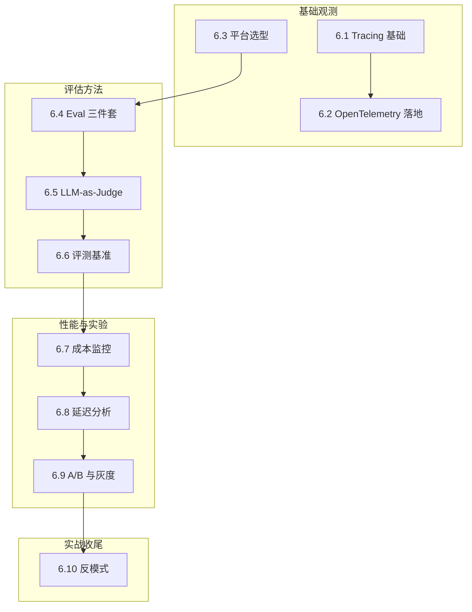

# L6 · 可观测与评估层 实施规格

> 笔名：晴暖
> 文档语言：中文（简体）
> 创建日期：2026-06-22
> 状态：v1.0 设计定稿
> 协议：CC BY-NC-SA 4.0
> 父级规格：`docs/superpowers/specs/2026-06-18-agent-dev-handbook-design.md`

---

## 0. 项目背景

P0-P5 已完成（项目骨架 + L1-L5 共 52 节 / ~6.95 万字 / 60 张图）。P6 启动 L6 可观测与评估层（10 节 / ~1.1 万字），是七层手册的"质量保证层"——把 L4 框架层（L4 讲"具体框架怎么用"）和 L5 模式层（L5 讲"模式抽象"）的产出，变成"**可度量、可评估、可观测**"的系统。

**L6 的核心价值**：从"能跑"到"跑得对、跑得稳、跑得起"——读者读完 L6 后，能为任意 Agent 系统接入 Tracing + Eval + 监控，回答"这个 Agent 在生产环境到底表现如何"。

---

## 1. L6 在七层中的定位

```
L1 基础理论 → L2 上下文 → L3 协议 → L4 框架 → L5 模式 → ★L6 可观测★ → L7 生产 → L8 案例
                                                              ↑
                                              "质量保证层 · 让跑通的 Agent 跑得对"
```

| 维度 | L5 模式层 | L6 可观测层 | L7 生产层 |
|---|---|---|---|
| 视角 | "用模式构建 Agent" | "度量 Agent 行为与质量" | "安全 + 容量 + 合规" |
| 抽象度 | 模式 + 伪代码 | 指标 + Trace + Eval | 防护 + SLA + 审计 |
| 时机 | 设计期（怎么写） | 上线期（怎么测） | 运维期（怎么护） |
| 字数预算 | 1.3 万字 | 1.1 万字 | 1.1 万字 |
| 受众 | 🟢🟡 核心+进阶 | 🟡 进阶 | 🟡🔴 进阶+专家 |

---

## 2. 受众与门槛

| 圈层 | 受众 | 读完能做 | 占比 |
|---|---|---|---|
| 🟢 核心圈（必读） | 学完 L1-L5 的开发者 | 接入 OpenTelemetry + Langfuse，写 3 类 Eval | ~30% |
| 🟡 进阶圈（必读） | 已有 Agent 上线经验的工程师 | 设计 Eval 体系 + 成本/延迟监控 + A/B 实验 | ~50% |
| 🔴 专家圈（选读） | 平台架构师 | LLM-as-Judge 可靠性论证 + 评测基准选择 + 反模式治理 | ~20% |

**前置知识**：
- 必读：L4.3 LangGraph（StateGraph + Checkpoint）+ L5.5 Routing（监控多 Agent）
- 推荐：L3.3 MCP（Tracing 与 MCP 集成）+ L5.8 Evaluator-Optimizer（与 L6.5 重叠但视角不同）

---

## 3. L6 10 节详细大纲

> **结构总览**：
> - 基础观测（🟡 3 节）：6.1 → 6.2 → 6.3
> - 评估方法（🟡 3 节）：6.4 → 6.5 → 6.6
> - 性能与实验（🟡 3 节）：6.7 → 6.8 → 6.9
> - 实战收尾（🟡 1 节）：6.10

### 6.1 Tracing 基础：Span / Trace / Context Propagation 🟡

- **意图**：Tracing 是 L6 的"骨架"——一次 Agent 执行的完整调用链（Trace）由多个 Span 组成，Span 之间通过 Context 传递（Propagation）。
- **反直觉钩子**：Tracing ≠ 日志——日志是"事件流"（何时发生什么），Trace 是"调用树"（谁调谁、传什么参数、耗时多久）。Agent 系统 90% 的 bug 用日志查不到，必须用 Trace 才看得见。
- **适用场景**：所有生产 Agent——Trace 是定位 Agent 卡住 / 答错 / 超时的唯一手段。
- **关键机制**：OpenTelemetry Span 概念（6.2 展开）+ Langfuse Trace 视图 + LangSmith Trace 树 + Arize Phoenix Span 详情。
- **与其他节对比**：6.1 讲"概念"，6.2 讲"协议"，6.3 讲"平台"。

### 6.2 OpenTelemetry 在 Agent 中的落地 🟡

- **意图**：OpenTelemetry（OTel）是 Tracing 协议的事实标准——本节讲如何在 Agent 代码里用 `@trace` 装饰器 / `tracer.start_as_current_span()` 把 Span 打出来。
- **反直觉钩子**：OpenTelemetry 不是"只为 Tracing"——它是 Traces + Metrics + Logs 三件套的统一协议；Agent 系统的可观测性应该 **OTel-first**（用 OTel 协议）而不是被 Langfuse 等平台绑定。
- **适用场景**：所有需要跨平台（自托管 / 多云 / 多 LLM Provider）的 Agent。
- **关键机制**：OTel Python SDK + OTel Collector + Span 属性（`gen_ai.system` / `gen_ai.request.model` 等语义约定）+ Langfuse/LangSmith 通过 OTel 协议接入。
- **与其他节对比**：6.1 讲概念，6.2 讲协议，6.3 讲平台——本节是"协议 → 落地"桥梁。

### 6.3 Langfuse / LangSmith / Arize Phoenix 选型 🟡

- **意图**：三大主流 Agent 可观测平台横向对比——Langfuse（开源 + 自托管友好）、LangSmith（LangChain 官方 + 商业）、Arize Phoenix（评估 + 漂移检测强项）。
- **反直觉钩子**：选平台不是"看哪个 UI 好看"——核心决策点是**数据归属**（自托管 vs 商业）+ **评估能力**（Eval 集成深度）+ **开源友好**（SDK 是否开源）。LangChain 用户的"自然选择"是 LangSmith，但 Langfuse 在多框架场景下更通用。
- **适用场景**：LangChain 生态重 → LangSmith；多框架 + 数据敏感 → Langfuse；评估是核心痛点 → Arize Phoenix。
- **关键机制**：三大平台 SDK 对比 + Trace 数据流（Agent → SDK → 后端 → UI）+ Eval API 集成方式 + 自托管成本估算。
- **与其他节对比**：6.3 是"6.1+6.2"的工程落地选项。

### 6.4 Eval 三件套：单元 / 集成 / 端到端 🟡

- **意图**：Agent 评测的"测试金字塔"——单元 Eval（单 LLM 调用准确率）/ 集成 Eval（多步链路正确率）/ 端到端 Eval（完整任务成功率）。
- **反直觉钩子**：Agent Eval ≠ 传统软件单元测试——传统测试是"确定性的"（1 == 1），Agent Eval 是"概率性的"（95% 答对算过）；Eval 必须设计为"统计上有意义的样本量"（≥30 个 case）而非"全过"。
- **适用场景**：所有 Agent 项目的 CI/CD——Eval 是"上线前最后一道关"。
- **关键机制**：Eval 数据集（golden dataset）+ 评估器（rule-based / LLM-as-Judge / human）+ 评估指标（accuracy / pass@k / latency）+ CI 集成。
- **与其他节对比**：6.4 讲"如何测"，6.5 讲"用什么测"（LLM-as-Judge），6.6 讲"用什么数据集测"（benchmark）。

### 6.5 LLM-as-Judge：评估的元层 🟡

- **意图**：用 LLM 当"裁判"评估 Agent 输出——比规则匹配更灵活，比人工评测便宜 100x。
- **反直觉钩子**：LLM-as-Judge ≠ 完美——Judge LLM 自身有偏差（长度偏差 / 位置偏差 / 自我偏好），必须用 **"两两对比 + 位置交换 + 多 Judge 投票"** 缓解。**LLM-as-Judge 的可靠性上限 ≈ 70-85%**，超过必须用人工复核。
- **适用场景**：主观质量评估（生成内容 / 翻译 / 摘要）+ 大规模 A/B 测试 + 评估器本身的可解释性。
- **关键机制**：MT-Bench 论文（Zheng et al. 2023）+ Judge LLM 选型（GPT-4 / Claude Opus）+ 结构化 prompt + 偏差缓解技术 + 校准数据集。
- **与其他节对比**：6.4 Eval 是"测试套件"，6.5 LLM-as-Judge 是"评估器的一种实现"。

### 6.6 Agent 评测基准：SWE-bench / GAIA / AgentBench 🟡

- **意图**：公开评测基准——SWE-bench（代码修复）/ GAIA（多模态推理）/ AgentBench（综合 Agent 能力）/ τ-bench（对话 Agent）/ WebArena（浏览器 Agent）。
- **反直觉钩子**：评测基准 ≠ 业务指标——SWE-bench 90% 准确率不意味着你的 Coding Agent 在生产能达到 90%；基准是"上限测试"（selection），不是"性能预测"（evaluation）。**必须有自己的业务 Eval 数据集**。
- **适用场景**：横向对比不同 Agent 框架 + 追踪 SOTA 进展 + 论文复现。
- **关键机制**：5 大基准的 GitHub 仓库 + 评分方式 + 2025 SOTA 结果 + 局限分析。
- **与其他节对比**：6.4 Eval 三件套是"自己测"，6.6 评测基准是"用业界标准测"。

### 6.7 成本监控：Token × 工具调用 × 缓存命中率 🟡

- **意图**：Agent 系统的"成本仪表盘"——按 Trace 维度统计 Token 用量（input/output/cache）、工具调用次数（成功/失败/重试）、缓存命中率（prompt cache / semantic cache）。
- **反直觉钩子**：Agent 成本 ≠ LLM Token 成本——实际生产中，**工具调用次数 + 失败重试 + Context 膨胀**往往占 60% 成本，LLM Token 只占 40%。优化 Agent 成本必须从 Trace 而非账单看。
- **适用场景**：所有生产 Agent——成本失控是 Agent 项目最常见的"上线后翻车"。
- **关键机制**：OTel Span 属性采集 + Langfuse cost tracking + 成本归因（按用户 / 按功能 / 按模型）+ 预算告警。
- **与其他节对比**：6.7 讲"成本"，6.8 讲"延迟"——是 L6 的"性能维度"。

### 6.8 延迟分析：TTFT / TPOT / 端到端 P95 🟡

- **意图**：Agent 系统的"延迟分解"——TTFT（Time To First Token，首 token 延迟）/ TPOT（Time Per Output Token，输出每个 token 耗时）/ 端到端 P95（95 分位总耗时）/ 工具调用延迟分布。
- **反直觉钩子**：Agent 延迟 ≠ LLM 延迟——**工具调用 + 多步链路 + Context 处理** 往往占 70%+ 延迟，LLM 推理只占 30%。优化 Agent 延迟必须 Trace 而非 API latency 看。
- **适用场景**：实时交互 Agent（客服 / 助手）+ 大流量生产环境。
- **关键机制**：TTFT / TPOT / P95 / P99 指标采集 + 延迟分桶（< 1s / 1-3s / 3-10s / > 10s）+ 慢 Trace Top-N 分析 + Langfuse / Phoenix 延迟视图。
- **与其他节对比**：6.7 + 6.8 是 Agent 系统的"性能双维度"（成本 + 延迟）。

### 6.9 A/B 与灰度：Agent 系统的实验设计 🟡

- **意图**：Agent 系统的"实验科学"——A/B 测试（两版本对比）/ 灰度发布（10% → 50% → 100%）/ 多臂老虎机（动态流量分配）。
- **反直觉钩子**：Agent A/B ≠ 传统软件 A/B——Agent 输出是**概率性的**，单次结果不可信；必须用 **统计显著性检验**（≥ 100 次实验 + p < 0.05）+ **多维指标**（不仅是准确率，还有成本 + 延迟 + 用户满意度）。**不能用 5 次实验下结论**。
- **适用场景**：Prompt 迭代 + 模型升级 + 框架迁移 + 新功能灰度。
- **关键机制**：实验设计（控制变量 + 流量切分）+ 显著性检验（t 检验 / 卡方检验）+ 灰度策略（基于用户 ID / 流量比例）+ 实验平台选型（Statsig / Eppo / 自建）。
- **与其他节对比**：6.9 是 L6 的"决策层"——前 8 节讲度量，本节讲"用度量做决策"。

### 6.10 可观测性反模式：日志打全 vs 有效信号 🟡

- **意图**：可观测性的"血泪清单"——10 大反模式（Span 爆炸 / 缺失关键属性 / 敏感数据泄露 / 指标失真 / 告警疲劳 / Eval 与生产脱节 / 忽略 Context 膨胀 / 没有 baseline / 评估器漂移 / Trace 黑洞）。
- **反直觉钩子**：可观测性 ≠ "全打"——**信息过载比没有观测更危险**。一个 10 万 Span 的 Trace 不如 100 个精心设计的 Span。**有效信号原则**：每个 Span 必须回答"我想知道什么"，否则不打。
- **适用场景**：所有 Agent 项目——本节是"避坑地图"。
- **关键机制**：10 大反模式 + 每个反模式的"症状 + 根因 + 修复"。
- **与其他节对比**：本节是 L6 的反例集，与 6.1-6.9 形成正反对照；与 L5.5 5.11 形成"模式 + 可观测"双重反模式。

---

## 4. 每节固定结构（可观测节模板）

每节统一 7 个 block，800-1100 字，1 张 mermaid 主图，1 段代码骨架：

```markdown
# 6.X 节标题：副标题

> 🟡 进阶

> **本节钩子**：（1 句话 + 反直觉结论）

## 正文大纲

1. **意图**（1 句话定义）
2. **适用场景**（3 个典型 + 2 个反例）
3. **指标/Trace/Eval 关键定义**（3-5 个核心概念）
4. **代码骨架**（5-15 行 Python / OTel SDK / Eval 框架示例）
5. **反模式**（1-2 个常见错用）
6. **与其他节对比**（对比表：本节 vs 相邻 2-3 节）

## 图

```mermaid
（主流程图 / 时序图 / 概念图，含 Source: 标注）
```

## 代码

```python
（5-15 行骨架代码）
```

实战要点：
1. （关键细节 1）
2. （关键细节 2）

## 工具映射

| 工具 | 用途 | 备注 |
|---|---|---|
| Langfuse | Trace + Eval | （一行说明） |
| LangSmith | Trace + Debug | |
| Arize Phoenix | Eval + Drift | |
| OpenTelemetry | 协议层 | |

## 自测题

（5 题：概念辨析 / 场景判断 / 代码补全 / 反直觉 / 对比）

**答案**：（5 题答案 + 官方文档链接）

> 📚 本节参考
> （≥3 条 S/A 级引用）
```
```

---

## 5. 章节首页（L6 README）设计

```markdown
# L6 · 可观测与评估层（10 节 / 1.1 万字）

> 🟡 进阶

> **本层定位**：从"能跑"到"跑得对、跑得稳、跑得起"——质量保证层。

## 可观测全景图



## 10 节一句话导览

| 节 | 主题 | 一句话 |
|---|---|---|
| 6.1 | Tracing 基础 | Span/Trace/Context Propagation 概念 |
| 6.2 | OpenTelemetry 落地 | OTel-first 协议与 SDK |
| 6.3 | 平台选型 | Langfuse / LangSmith / Phoenix 横向对比 |
| 6.4 | Eval 三件套 | 单元 / 集成 / 端到端测试金字塔 |
| 6.5 | LLM-as-Judge | LLM 当裁判 + 偏差缓解 |
| 6.6 | 评测基准 | SWE-bench / GAIA / AgentBench |
| 6.7 | 成本监控 | Token × 工具 × 缓存三维成本 |
| 6.8 | 延迟分析 | TTFT / TPOT / P95 分解 |
| 6.9 | A/B 与灰度 | 概率性实验 + 显著性检验 |
| 6.10 | 反模式 | 10 大可观测性血泪 |

## 学习路径

- **必读路径**（🟡 核心 / 4 节）：6.1 → 6.4 → 6.5 → 6.7
- **进阶路径**（🟡 / 6 节）：6.2 → 6.3 → 6.6 → 6.8 → 6.9 → 6.10
- **速读路径**（4 节精华）：6.1 → 6.5 → 6.7 → 6.10

## 与其他层衔接

| 层 | 衔接点 |
|---|---|
| **L4 框架** | LangGraph Checkpoint 是 6.1 Tracing 的天然数据源 |
| **L5 模式** | 5.8 Evaluator-Optimizer 与 6.5 LLM-as-Judge 是"模式 vs 评估器"正反对照 |
| **L7 生产** | 6.9 A/B 与灰度是 7.7 容量评估的实验基础；6.10 反模式是 7.9 SLA 的"避坑地图" |
| **L8 案例** | 8.2 Coding Agent / 8.3 DB Agent 是 L6 真实落地案例 |
```

---

## 6. 字数与图数预算

| 节 | 字数 | 图数 | 代码段 | 引用 |
|---|---|---|---|---|
| 6.1 Tracing 基础 | 1100 | 1 | 1 | ≥3 |
| 6.2 OpenTelemetry | 1100 | 1 | 1 | ≥3 |
| 6.3 平台选型 | 1000 | 1 | 0 | ≥3 |
| 6.4 Eval 三件套 | 1100 | 1 | 1 | ≥3 |
| 6.5 LLM-as-Judge | 1100 | 1 | 1 | ≥3 |
| 6.6 评测基准 | 1000 | 1 | 0 | ≥3 |
| 6.7 成本监控 | 1100 | 1 | 1 | ≥3 |
| 6.8 延迟分析 | 1100 | 1 | 1 | ≥3 |
| 6.9 A/B 与灰度 | 1000 | 1 | 1 | ≥3 |
| 6.10 反模式 | 1200 | 1 | 0 | ≥3 |
| **L6 README** | 800 | 1 | 0 | ≥3 |
| **合计** | **~1.16 万字** | **11 张图** | 7 段 | — |

验收阈值（与 L5 一致）：字数 800-1500 / 节，引用 ≥3 S/A 级 / 节，图 ≥1 张 / 节。

---

## 7. 干货来源与引用规范

每节 ≥3 条 S/A 级引用（S/A 域名白名单见 `scripts/_reference_domains.py`）。

> ⚠️ **关键约束**：Langfuse / LangSmith / Arize Phoenix / OpenTelemetry 官方文档域名不在 S/A 白名单。**引用规则**：
> - ✅ 用 `github.com` 链接（Langfuse GitHub README、OTel GitHub、AgentBench GitHub）
> - ✅ 用 `arxiv.org` 论文（MT-Bench / SWE-bench / τ-bench 论文）
> - ✅ 用 `anthropic.com` / `openai.com` 官方博客（可观测相关）
> - ✅ 用 KEY_AUTHORS（Lilian Weng / Eugene Yan）即使不在白名单域名也可
> - ❌ 不用 `langfuse.com` / `docs.smith.langchain.com` / `docs.arize.com` / `opentelemetry.io`（不在白名单）

| 级别 | 来源 |
|---|---|
| S | OpenTelemetry GitHub (`github.com/open-telemetry`)、Langfuse GitHub (`github.com/langfuse`)、MT-Bench / Vicuna 论文 (Zheng et al. 2023)、SWE-bench 论文 (Jimenez et al. 2024)、GAIA 论文 (Mialon et al. 2023)、Anthropic Engineering 博客 (`anthropic.com`)、OpenAI Blog (`openai.com`) |
| A | Lilian Weng 博客 (`lilianweng.github.io`)、Eugene Yan 博客 (`eugeneyan.com`)、Chip Huyen *AI Engineering* (2024) |
| B | LangChain Blog (`langchain.com`)、LangGraph GitHub (`github.com/langchain-ai/langgraph`) |

**特别引用清单**（每节可复用）：
- 6.1 / 6.2：`github.com/open-telemetry/semantic-conventions` (gen-ai 语义约定) + Anthropic Engineering "Building Effective Agents" (`anthropic.com`) + Lilian Weng
- 6.3：Langfuse GitHub README + LangGraph GitHub README + Lilian Weng "LLM Powered Autonomous Agents"
- 6.4 / 6.5：`arxiv.org/abs/2306.05685` (MT-Bench) + `arxiv.org/abs/2305.14314` (QLoRA 论文含 Judge) + Lilian Weng
- 6.6：`arxiv.org/abs/2310.06770` (SWE-bench) + `arxiv.org/abs/2311.12983` (GAIA) + AgentBench GitHub
- 6.7 / 6.8：`github.com/open-telemetry/semantic-conventions` + Anthropic Engineering + Eugene Yan "Latency Numbers"
- 6.9：`eugeneyan.com` A/B testing 系列 + Chip Huyen *AI Engineering* Ch.7 + LangChain Blog
- 6.10：Lilian Weng + Anthropic Engineering + Chip Huyen *AI Engineering*

---

## 8. 验收标准

每节必须满足：

| 维度 | 门槛 | 校验方法 |
|---|---|---|
| 字数 | 800-1500 字 | `scripts/check_word_count.py` |
| 引用 | ≥3 条 S/A 级 | `scripts/check_references.py` |
| 图 | ≥1 张 mermaid | `scripts/check_figures.py` |
| 代码 | ≥1 段骨架代码（6.3/6.6/6.10 可豁免） | 人工核查 |
| 反直觉 | ≥1 个反直觉结论 | 钩子段强制 |
| 节对比 | ≥1 个对比表（vs 相邻节） | "与其他节对比" block |
| 工具映射 | 4 工具 API 入口 | "工具映射" block |

L6 全层验收：`bash scripts/run_all_checks.sh handbook/l6-observability/` 必须全部通过。

---

## 9. 实施策略（已与用户确认）

**女王大人已确认 P6 实施策略**：
- **3 批并行 + Worktree 隔离 + subagent-driven-development**

**批次切分（4+3+3）**：
- 批 1（worktree `l6-batch-1`）：6.1 → 6.2 → 6.3 → 6.4（基础观测 4 节）
- 批 2（worktree `l6-batch-2`）：6.5 → 6.6 → 6.7（评估方法 3 节）
- 批 3（worktree `l6-batch-3`）：6.8 → 6.9 → 6.10（性能与实验 3 节）
- 章节首页 + 验收报告（在 master）：依赖 10 节全部合并后串行写

**Worktree 路径模板**：
```
C:\Users\caozh\Documents\LangChain\agent-handbook-{batch-name}\
```

**流程细节**：
1. 每批创建 worktree（`l6-batch-1` / `l6-batch-2` / `l6-batch-3`）
2. 批内 3-4 节串行 commit（避免 in-place edit 并发冲突）
3. 批间串行（批 2 依赖批 1 工具命名一致性）
4. 章节首页串行写（依赖 10 节全部完成）
5. 整体跑 `run_all_checks.sh` 验证
6. merge worktree 回 master
7. commit 验收报告

**每节 commit 信息模板**：
```
feat(l6): 6.X 节标题（副标题）

- 一句话定义 + 反直觉钩子
- 主流程图 mermaid
- 代码骨架（5-15 行）
- 工具映射（4 工具 API 入口）
- 自测题 5 题 + 答案
- S/A 级引用 ≥3 条

字数：XXX 字 | 图：1 张 | 引用：N 条
```

---

## 10. 风险与缓解

| 风险 | 影响 | 缓解 |
|---|---|---|
| **S/A 域名白名单严格** | Langfuse / LangSmith / Phoenix 官方文档不在白名单 | 用 `github.com` README 链接 + `arxiv.org` 论文 + `anthropic.com`/`openai.com` 博客 + KEY_AUTHORS 替代 |
| **API 编造风险** | Langfuse SDK / OTel SDK API 在 2025-2026 频繁更新 | 6.2 / 6.3 必 curl 验证 SDK 实际导出 |
| **数字失真风险** | SWE-bench 准确率 / Token 成本数据快速过时 | 引用论文发表时的数字 + 标注"截至 YYYY-MM"，不写 2026 年未来事件 |
| **与 L4/L5 内容重叠** | Tracing 与 LangGraph Checkpoint 重叠 | 边界清晰化——L4 讲"框架 API"，L6 讲"协议与平台"；L5 讲"模式"，L6 讲"评估器" |
| **10 节字数爆 1.5 万** | 验收失败 | 6.1-6.4 控制 1000-1100 字，6.10 给 1200 字 |
| **代码段不足** | 6.3 平台选型 / 6.6 评测基准 / 6.10 反模式较难写代码 | 这 3 节可豁免"≥1 段代码"门槛，验收脚本需调整 |
| **跨层引用编造** | 6.7 引用 L2.7 / 6.8 引用 L3.8 等路径可能错 | 写前 ls 验证实际文件名（继承 P5 教训） |
| **与 L8 案例脱节** | 闭环断裂 | 6.7/6.8 必须引用 8.2 Coding Agent + 8.3 DB Agent 的可观测实践 |

---

## 11. 与全局规格的一致性

本规格完全对齐 `docs/superpowers/specs/2026-06-18-agent-dev-handbook-design.md` 第 126-136 行 L6 主题定义，并在以下 3 处做了**显式微调**：

1. **6.5 LLM-as-Judge 强化**：原"评估的元层" → 现加入"偏差缓解"+"Judge LLM 可靠性上限 70-85%"的硬约束（来自 MT-Bench 论文）
2. **6.9 A/B 强化**：原"实验设计" → 现加入"概率性 + 显著性检验 + 流量切分"的工程细节
3. **6.10 反模式强化**：原"日志打全 vs 有效信号" → 现展开为 10 大反模式血泪清单（与 L5.11 8 大反模式形成"模式 + 可观测"双重反模式）

字数与图数预算在全局预算内（L6 占七层 ~10%）。

---

## 12. 下一步

1. ✅ 已完成：规格文档（本文档）
2. ⏳ 下一步：调用 `writing-plans` skill 写实施计划 `docs/superpowers/plans/2026-06-22-l6-observability-evaluation.md`
3. ⏳ 实施：按"3 批 × (4+3+3) 节 + Worktree + subagent-driven-development"策略启动 P6 写作

---

**本规格经 brainstorming skill 流程产出，请用户审查后再进入 writing-plans 阶段。**