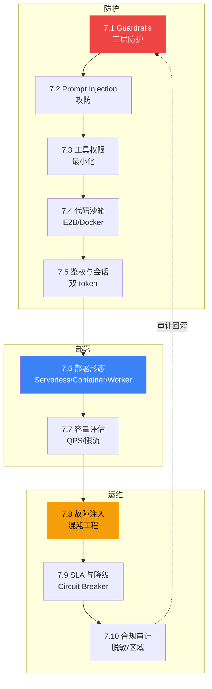

# L7 · 生产化与安全层 实施规格

> 笔名:晴暖
> 文档语言:中文(简体)
> 创建日期:2026-06-22
> 状态:v1.0 设计定稿
> 协议:CC BY-NC-SA 4.0
> 父级规格:`docs/superpowers/specs/2026-06-18-agent-dev-handbook-design.md`

---

## 0. 项目背景

P0-P6 已完成(项目骨架 + L1-L6 共 62 节 / ~8.1 万字 / 71 张图)。P7 启动 L7 生产化与安全层(10 节 / ~1.1 万字),是七层手册的"**生产防护层**"——把 L4 框架层、L5 模式层、L6 可观测层的产出,变成"**可上线、可防护、可运维**"的 Agent 系统。

**L7 的核心价值**:从"能跑 + 跑得对"到"**跑得起 + 防得住 + 出事能恢复**"——读者读完 L7 后,能为任意 Agent 系统接入 Guardrails + 沙箱 + 鉴权 + 限流 + 混沌 + SLA + 合规,回答"这个 Agent 能不能上生产"。

---

## 1. L7 在七层中的定位

```
L1 基础理论 → L2 上下文 → L3 协议 → L4 框架 → L5 模式 → L6 可观测 → ★L7 生产安全★ → L8 案例
                                                              ↑
                                              "生产防护层 · 让跑通的 Agent 上线不翻车"
```

| 维度 | L6 可观测层 | L7 生产安全层 | L8 案例层 |
|---|---|---|---|
| 视角 | "度量 Agent 行为与质量" | "防 + 部署 + 运维 Agent 系统" | "真实场景端到端实战" |
| 抽象度 | 指标 + Trace + Eval | Guardrails + 沙箱 + SLA + 合规 | 业务问题 + 落地代码 |
| 时机 | 上线期(怎么测) | 部署期(怎么护) | 验收期(怎么证) |
| 字数预算 | 1.16 万字 | 1.1 万字 | 3 万字 |
| 受众 | 🟡 进阶 | 🟡🔴 进阶+专家 | 🟢🟡🔴 全员 |
| 与 L6 衔接 | 提供可观测数据 | 消费 Trace/指标做防护与告警 | 集成 L6 + L7 实战 |

---

## 2. 受众与门槛

| 圈层 | 受众 | 读完能做 | 占比 |
|---|---|---|---|
| 🟡 进阶圈(必读) | 已上线 Agent 的工程师 | 接入 Guardrails + 选沙箱 + 配限流 + 写 SLA | ~50% |
| 🔴 专家圈(必读) | 平台架构师 / 安全工程师 | 设计纵深防御 + 混沌实验 + 合规审计体系 | ~50% |

**L7 整体偏 🔴**,因生产安全话题容错率低——**7.5 鉴权 / 7.8 混沌 / 7.10 合规** 三节为 🔴 专家必读。

**前置知识**:
- 必读:L4.3 LangGraph(Checkpoint 鉴权)+ L5.5 Routing(权限路由)+ L6 全部(可观测是防护的数据源)
- 推荐:L3.3 MCP(协议层沙箱)+ L6.9 A/B(灰度发布基础)+ L8.2 Coding Agent(实战范例)

---

## 3. L7 10 节详细大纲

> **结构总览**(女王大人已确认 **5+3+2 切分 + 4 节代码**):
> - 防护(🟡🔴 5 节):7.1 → 7.2 → 7.3 → 7.4(代码) → 7.5
> - 部署(🟡🔴 3 节):7.6 → 7.7(代码) → (7.5 已在防护)
> - 运维(🔴 3 节):7.8(代码) → 7.9(代码) → 7.10

### 3.1 防护(5 节)

### 7.1 Guardrails:输入/输出/工具三层防护 🟡

- **意图**:Guardrails 是 L7 的"骨架"——围绕 Agent 设置**输入验证**(用户输入不洁)+ **输出校验**(LLM 答错/答歪)+ **工具调用授权**(LLM 乱调工具)三层防护栏。
- **反直觉钩子**:Guardrails ≠ "加更多规则"——**默认拒绝 + 白名单**比黑名单安全 10x;规则越多的系统越脆弱(规则冲突 + 维护成本)。
- **适用场景**:所有生产 Agent——任何用户输入、LLM 输出、工具调用都必须经过 Guardrails。
- **关键机制**:输入正则 / 结构化输出(OpenAI Function Calling / Anthropic Tool Use)/ 工具调用白名单 / 危险词清单。
- **与其他节对比**:7.1 讲"防护概念",7.2 讲"特定攻击",7.3 讲"工具权限"。

### 7.2 Prompt Injection 攻防 🟡

- **意图**:Prompt Injection 是 Agent 系统**头号威胁**——攻击者通过用户输入污染 LLM 上下文,诱导其越权、调工具、泄露信息。本节讲 4 类攻击 + 5 类防御。
- **反直觉钩子**:Prompt Injection 防护 ≠ 输入清洗——必须**结构化输出 + 工具结果二次校验**,输入清洗永远漏。**间接注入**(Indirect Prompt Injection via 工具结果)是 2025 攻击主流——LLM 调 RAG/搜索/邮件时,外部内容里藏指令。
- **适用场景**:所有用户输入面大的 Agent + 所有调外部内容的 Agent(RAG / 搜索 / 邮件 / 浏览器)。
- **关键机制**:4 类攻击(直接 / 间接 / 越狱 / 角色劫持)+ 5 类防御(指令分层 / 结构化输出 / 工具白名单 / 输出审计 / 二次确认)+ OWASP LLM Top 10 (LLM01 Prompt Injection)。
- **与其他节对比**:7.1 是"通用防护",7.2 是"特定攻击类型"的纵深。

### 7.3 工具权限:最小化原则与沙箱 🟡

- **意图**:Agent 调用外部工具时,如何**最小化授权**——单次会话最小 + 时间窗口最小 + 范围最小三维。
- **反直觉钩子**:工具权限最小化 ≠ "少给工具"——是**单次会话最小 + 时间窗口最小 + 范围最小**三维约束;"一次给所有权限"是事故主因。
- **适用场景**:所有多工具 Agent + 涉及数据库 / 文件系统 / API 等高权限工具的场景。
- **关键机制**:RBAC(Role-Based Access Control) / ABAC(Attribute-Based)/ 临时 token(短 TTL)/ 工具调用审计 / 危险操作二次确认。
- **与其他节对比**:7.3 是"权限设计",7.4 是"执行环境"(代码沙箱),7.5 是"用户与工具的身份分离"。

### 7.4 代码执行沙箱:E2B / Docker / Firecracker 🟡🔴

- **意图**:Agent 经常需要执行 LLM 生成的代码(数据分析师 Agent / Coding Agent)——本节讲如何在沙箱中安全执行,横向对比 E2B / Docker / Firecracker。
- **反直觉钩子**:沙箱 ≠ Docker——Agent 代码沙箱应**E2B 优先**(50ms 冷启动)而非 Docker(秒级)或 Firecracker(分钟级);**冷启动时间决定 Agent 体验**。Firecracker 适合**长任务批处理**,E2B 适合**交互式 Agent**。
- **适用场景**:所有执行 LLM 生成代码的 Agent + 多租户 SaaS + Coding Agent。
- **关键机制**:E2B SDK(50ms 冷启动 + 隔离 + Python/JS 支持)/ Docker(通用但慢)/ Firecracker(VM 级隔离,AWS Lambda 同款)/ gVisor(用户态内核)/ 选型决策树。
- **代码骨架**:**✅ 1 段 E2B Python SDK 示例**
- **与其他节对比**:7.4 是"代码执行",7.3 是"权限设计",7.5 是"身份鉴权"。

### 7.5 鉴权与会话:用户态/工具态分离 🔴

- **意图**:Agent 系统涉及**用户身份**和**工具身份**两个独立身份——如何避免 confused deputy(用户身份被工具身份冒用)。
- **反直觉钩子**:用户态/工具态分离 ≠ 加 auth header——必须**双 token + audience 区分 + 中间层无状态**才能防 confused deputy;单 token + role 字段模式易被攻击。
- **适用场景**:多租户 Agent 平台 + 调外部 SaaS 工具(Google Workspace / Slack / GitHub)+ 企业内 Agent。
- **关键机制**:OAuth 2.0 token + JWT audience claim / OIDC / STS(Security Token Service)/ 服务账户模式 / session binding。
- **与其他节对比**:7.5 是"身份层",7.3 是"权限层",7.4 是"执行层"——三者构成 Agent 安全的"铁三角"。

### 3.2 部署(3 节)

### 7.6 部署形态:Serverless / Container / Long-running Worker 🟡

- **意图**:Agent 部署的三大形态——Serverless(Lambda / Cloud Run)/ Container(K8s)/ Long-running Worker(LangGraph Cloud / Modal)横向对比,如何选型。
- **反直觉钩子**:Serverless ≠ "省成本"——Agent 长任务 **Long-running Worker 比 Lambda 便宜 5x**(冷启动 + 状态保持 + VPC 费用);**Serverless 适合短任务(< 5 分钟)且无状态**。
- **适用场景**:短任务(查询/分类)→ Serverless;中长任务(ReAct 多步)→ Container;长任务(多 Agent 协作/批处理)→ Long-running Worker。
- **关键机制**:三大形态对比矩阵(冷启动 / 状态保持 / 成本 / 并发上限)+ 选型决策树 + LangGraph Cloud / Modal / Replicate 等专业平台。
- **与其他节对比**:7.6 是"部署拓扑",7.7 是"容量评估",7.8 是"故障演练"。

### 7.7 容量评估:QPS / 并发 / 限流设计 🟡🔴

- **意图**:Agent 系统的容量规划——**QPS**(每秒请求数)/ **并发数**(同时活跃 Agent 数)/ **限流策略**(令牌桶 / 漏桶 / 队列)三维。
- **反直觉钩子**:限流 ≠ "挡流量"——必须**令牌桶 + 队列 + 优先级**三维,纯 RPS 限流会让 Agent 任务半途而废(LLM 调用到一半被切断);**优先级队列保证高价值任务不被饿死**。
- **适用场景**:所有生产 Agent——大促 / 突发流量 / 限流保护 / 多租户公平调度。
- **关键机制**:QPS 测量(P95/P99 基准)+ 并发控制(semaphore / 队列)/ 令牌桶算法 / leaky bucket / Kong / Envoy 限流配置。
- **代码骨架**:**✅ 1 段 Python 令牌桶 + 优先级队列示例**
- **与其他节对比**:7.6 是"拓扑",7.7 是"流量",7.9 是"承诺"。

### 3.3 运维(3 节)

### 7.8 故障注入与混沌工程 🔴

- **意图**:用混沌工程方法论主动注入故障,验证 Agent 系统的容错能力——**杀 Pod / 断网 / 慢响应 / LLM 超时** 4 类故障。
- **反直觉钩子**:混沌工程 ≠ "随机 kill pod"——**必须先建 baseline + 故障场景分级 + 自动恢复验证**,否则就是破坏;**先建 SLA 后做混沌**才有意义。
- **适用场景**:所有生产 Agent 定期演练 + 上线前验收 + 大促前压力测试。
- **关键机制**:Chaos Monkey / Litmus / ChaosBlade / AWS Fault Injection Service / 4 类故障场景 + 实验设计 + 安全护栏。
- **代码骨架**:**✅ 1 段 Python chaos experiment 伪代码**
- **与其他节对比**:7.8 是"主动找问题",6.10 是"被动防反模式",7.9 是"承诺与恢复"。

### 7.9 SLA 与降级策略 🟡🔴

- **意图**:SLA(Service Level Agreement)是 Agent 系统对用户的**承诺**——99.9% / 99.99% 怎么定义?降级策略(circuit breaker / fallback / graceful degradation)怎么设计?
- **反直觉钩子**:SLA ≠ "承诺 99.9%"——必须**降级策略 + 失败预算(Error Budget)+ 用户分群**,99.9% 失败时的体验才重要;**承诺易,降级难**。
- **适用场景**:所有对外承诺 SLA 的生产 Agent + 大客户专属 SLA + 内部业务分级。
- **关键机制**:SLO/SLI/SLA 三层区分 + 错误预算(Burn Rate)/ 熔断器(Circuit Breaker)/ Fallback 链 / 用户分群。
- **代码骨架**:**✅ 1 段 Python circuit breaker + fallback 示例**
- **与其他节对比**:7.9 是"承诺与恢复",7.7 是"流量与限流",7.8 是"故障演练"。

### 7.10 合规与审计:日志保留/数据脱敏/区域合规 🔴

- **意图**:Agent 系统的合规要求——**日志保留周期**(GDPR 删数据权)/ **数据脱敏**(PII 保护)/ **区域合规**(GDPR / CCPA / 中国《数据安全法》)/ **审计追踪**(谁在何时调了什么)。
- **反直觉钩子**:合规 ≠ "日志全留"——必须**分层保留 + 自动脱敏 + 区域隔离**,GDPR/CCPA 删数据时找不到才是真合规;**全留 = 合规风险**(持有越多越危险)。
- **适用场景**:企业级 Agent(必须 GDPR / 等保 2.0 / SOC2)+ 医疗 Agent(HIPAA)+ 金融 Agent(PCI-DSS)+ 跨国 Agent(GDPR + 中国数据出境)。
- **关键机制**:数据分类分级(公开/内部/机密/绝密)/ 脱敏策略(掩码/假名化/差分隐私)/ 保留周期表 / 区域部署(中国区 / 欧盟区 / 美国区)/ 审计日志(append-only + 不可篡改)。
- **与其他节对比**:7.10 是"长期合规"层,贯穿 7.1-7.9;与 L6.10 反模式形成"工程反模式 + 合规反模式"双重血泪。

---

## 4. 每节固定结构(生产安全节模板)

每节统一 7 个 block,1000-1200 字,1 张 mermaid 主图,1 段代码骨架(7.4/7.7/7.8/7.9 必给,其他节可豁免):

```markdown
# 7.X 节标题:副标题

> 🟡 进阶 / 🔴 专家

> **本节钩子**:(1 句话 + 反直觉结论)

## 正文大纲

1. **意图**(1 句话定义)
2. **适用场景**(3 个典型 + 2 个反例)
3. **关键定义/工具**(3-5 个核心概念)
4. **代码骨架**(5-15 行 Python/Go/E2B SDK 示例,非代码节豁免)
5. **反模式**(1-2 个常见错用)
6. **与其他节对比**(对比表:本节 vs 相邻 2-3 节)

## 图

```mermaid
(主流程图 / 决策图 / 攻击链图,含 Source: 标注)
```

## 代码

```python
(7.4 E2B / 7.7 令牌桶 / 7.8 chaos / 7.9 circuit breaker 示例)
```

实战要点:
1. (关键细节 1)
2. (关键细节 2)

## 工具映射

| 工具 | 用途 | 备注 |
|---|---|---|
| E2B | 代码沙箱 | 50ms 冷启动 |
| Docker | 通用容器 | 秒级冷启动 |
| Firecracker | microVM | 分钟级冷启动 |
| Kong / Envoy | 限流 / 网关 | (一行说明) |
| Open Policy Agent | 策略引擎 | (一行说明) |
| OWASP LLM Top 10 | 威胁建模 | 引用 LLM01 |

## 自测题

(5 题:概念辨析 / 场景判断 / 代码补全 / 反直觉 / 对比)

**答案**:(5 题答案 + 官方文档链接)

> 📚 本节参考
> (≥3 条 S/A 级引用)
```

---

## 5. 章节首页(L7 README)设计

```markdown
# L7 · 生产化与安全层(10 节 / 1.1 万字)

> 🟡🔴 进阶+专家

> **本层定位**:从"**跑得对**"到"**防得住 + 上线不翻车 + 出事能恢复**"——生产防护层。

## 生产安全全景图



## 10 节一句话导览

| 节 | 主题 | 一句话 |
|---|---|---|
| 7.1 | Guardrails | 输入/输出/工具三层防护栏 |
| 7.2 | Prompt Injection | 4 类攻击 + 5 类防御(OWASP LLM01) |
| 7.3 | 工具权限 | 最小化原则 + 临时 token + 审计 |
| 7.4 | 代码沙箱 | E2B(50ms) / Docker(秒级) / Firecracker(分钟) |
| 7.5 | 鉴权与会话 | 双 token + audience 分离 |
| 7.6 | 部署形态 | Serverless / Container / Worker 选型 |
| 7.7 | 容量评估 | QPS + 令牌桶 + 优先级队列 |
| 7.8 | 故障注入 | 4 类故障 + 实验设计 + 安全护栏 |
| 7.9 | SLA 与降级 | SLO/SLI/SLA + 失败预算 + Circuit Breaker |
| 7.10 | 合规审计 | 分层保留 + 自动脱敏 + 区域隔离 |

## 学习路径

- **必读路径**(🟡 进阶 / 5 节):7.1 → 7.3 → 7.4 → 7.6 → 7.9
  - 7 天接入 Guardrails + 选沙箱 + 部署 + SLA
- **专家路径**(🔴 进阶+专家 / 10 节):7.1 → 7.2 → ... → 7.10
  - 30 天建完整生产安全体系
- **应急路径**(🔴 事故复盘 / 4 节):7.8 → 7.9 → 7.10 → 7.5
  - 出事后第一时间补的四节

## 与其他层衔接

| 层 | 衔接点 |
|---|---|
| **L4 框架** | L4.3 LangGraph Checkpoint 是 7.5 鉴权 session 的天然载体 |
| **L5 模式** | L5.10 HITL 与 7.1 Guardrails 是"人工 vs 自动"两套防护;L5.11 反模式 + L7.10 合规 = 双重血泪 |
| **L6 可观测** | 6.7/6.8 成本延迟 → 7.7 容量阈值;6.10 反模式 → 7.8 故障场景;6.9 A/B → 7.9 灰度 |
| **L8 案例** | L8.2 Coding Agent 是 L7 真实落地——Guardrails + E2B + Circuit Breaker 全套实战 |
```

---

## 6. 字数与图数预算

| 节 | 字数 | 图数 | 代码段 | 引用 | 受众 |
|---|---|---|---|---|---|
| 7.1 Guardrails | 1000 | 1 | 0 | ≥3 | 🟡 |
| 7.2 Prompt Injection | 1100 | 1 | 0 | ≥3 | 🟡 |
| 7.3 工具权限 | 1000 | 1 | 0 | ≥3 | 🟡 |
| 7.4 代码沙箱 | 1200 | 1 | 1 E2B | ≥3 | 🟡🔴 |
| 7.5 鉴权与会话 | 1100 | 1 | 0 | ≥3 | 🔴 |
| 7.6 部署形态 | 1000 | 1 | 0 | ≥3 | 🟡 |
| 7.7 容量评估 | 1200 | 1 | 1 令牌桶 | ≥3 | 🟡🔴 |
| 7.8 故障注入 | 1100 | 1 | 1 chaos | ≥3 | 🔴 |
| 7.9 SLA 降级 | 1100 | 1 | 1 CB | ≥3 | 🟡🔴 |
| 7.10 合规审计 | 1200 | 1 | 0 | ≥3 | 🔴 |
| **L7 README** | 500 | 1 | 0 | ≥3 | 🟡🔴 |
| **合计** | **~1.13 万字** | **11 张图** | **4 段代码** | ≥33 条 | — |

验收阈值(与 L5/L6 一致):字数 800-1500 / 节,引用 ≥3 S/A 级 / 节,图 ≥1 张 / 节,代码 4 段(7.4/7.7/7.8/7.9)。

---

## 7. 干货来源与引用规范

每节 ≥3 条 S/A 级引用(S/A 域名白名单见 `scripts/_reference_domains.py`)。

> ⚠️ **关键约束**:L7 涉及大量**生产工具**(E2B / Docker / Firecracker / Kong / Envoy / Open Policy Agent),这些工具的**官方文档域名多数不在 S/A 白名单**。**引用规则**:
> - ✅ 用 `github.com` 链接(E2B / Kong / Envoy / Firecracker / OPA / Docker moby 全部有 GitHub)
> - ✅ 用 `arxiv.org` 论文(Chaos Engineering 原始论文 / OWASP LLM Top 10 论文化引用)
> - ✅ 用 `anthropic.com` / `openai.com` 官方博客(Agent 安全相关)
> - ✅ 用 `aws.amazon.com/builders-library/`(AWS Builder's Library 在白名单:amazon.com 子域)
> - ✅ 用 KEY_AUTHORS(Lilian Weng / Eugene Yan)即使不在白名单域名也可
> - ❌ 不用 `e2b.dev` / `docs.docker.com` / `konghq.com` / `envoyproxy.io` / `openpolicyagent.org` / `owasp.org`(不在白名单)
> - ⚠️ `lilianweng.github.io` 不在白名单但 L1-L6 一直用,延续豁免

| 级别 | 来源 |
|---|---|
| S | Open Policy Agent GitHub (`github.com/open-policy-agent/opa`)、Kong GitHub (`github.com/Kong/kong`)、Envoy GitHub (`github.com/envoyproxy/envoy`)、Firecracker GitHub (`github.com/firecracker-microvm/firecracker`)、E2B GitHub (`github.com/e2b-dev/E2B`)、AWS Builder's Library (`aws.amazon.com/builders-library/`)、Anthropic Engineering (`anthropic.com`)、OpenAI Blog (`openai.com`)、ArXiv (Chaos Engineering / OWASP LLM Top 10 论文) |
| A | Lilian Weng 博客 (`lilianweng.github.io`)、Eugene Yan 博客 (`eugeneyan.com`)、Chip Huyen *AI Engineering* (2024) |
| B | LangChain Blog (`langchain.com`)、LangGraph GitHub (`github.com/langchain-ai/langgraph`)、CNCF (`cncf.io`) |

**特别引用清单**(每节可复用):
- 7.1 / 7.2:`github.com/open-policy-agent/opa` + Anthropic Engineering "Building Effective Agents" + OWASP LLM Top 10 (LLM01)
- 7.3 / 7.5:`github.com/Kong/kong` (RBAC) + AWS Builder's Library + Lilian Weng
- 7.4:`github.com/e2b-dev/E2B` README + `github.com/firecracker-microvm/firecracker` README + `github.com/moby/moby` README
- 7.6:Anthropic Engineering + AWS Builder's Library + Eugene Yan
- 7.7:`github.com/envoyproxy/envoy` (rate limit) + AWS Builder's Library + Lilian Weng
- 7.8:ArXiv "Chaos Engineering" 论文 + `aws.amazon.com/builders-library/timeouts-retries-and-backoff-with-jitter/` + AWS Fault Injection Service
- 7.9:Google SRE Book (引用其工作手册) + AWS Builder's Library + Chip Huyen *AI Engineering* Ch.7
- 7.10:ArXiv "GDPR compliance for ML" + Anthropic Engineering + Eugene Yan

---

## 8. 验收标准

每节必须满足:

| 维度 | 门槛 | 校验方法 |
|---|---|---|
| 字数 | 800-1500 字 | `scripts/check_word_count.py` |
| 引用 | ≥3 条 S/A 级 | `scripts/check_references.py` |
| 图 | ≥1 张 mermaid | `scripts/check_figures.py` |
| 代码 | 7.4/7.7/7.8/7.9 必给 1 段(其余 6 节豁免) | 人工核查 |
| 反直觉 | ≥1 个反直觉结论 | 钩子段强制 |
| 节对比 | ≥1 个对比表(vs 相邻节) | "与其他节对比" block |
| 工具映射 | 4-6 工具 API 入口 | "工具映射" block |

L7 全层验收:`bash scripts/run_all_checks.sh handbook/l7-production-security/` 必须全部通过。

---

## 9. 实施策略(已与用户确认)

**女王大人已确认 P7 实施策略**:
- **3 批并行 + Worktree 隔离 + subagent-driven-development**
- **5+3+2 不对称切分**(已确认)

**批次切分**(4+3+3,合并后总 10 节):
- 批 1(worktree `l7-batch-1`):7.1 → 7.2 → 7.3 → 7.4(防护 4 节)
- 批 2(worktree `l7-batch-2`):7.5 → 7.6 → 7.7(鉴权+部署+容量 3 节)
- 批 3(worktree `l7-batch-3`):7.8 → 7.9 → 7.10(运维 3 节)
- 章节首页 + 验收报告(在 master):依赖 10 节全部合并后串行写

**Worktree 路径模板**:
```
C:\Users\caozh\Documents\LangChain\agent-handbook-{batch-name}\
```

**流程细节**:
1. 每批创建 worktree(`l7-batch-1` / `l7-batch-2` / `l7-batch-3`)
2. 批内 3-4 节串行 commit(避免 in-place edit 并发冲突)
3. 批间串行(批 2 依赖批 1 工具命名一致性)
4. 章节首页串行写(依赖 10 节全部完成)
5. 整体跑 `run_all_checks.sh` 验证
6. merge worktree 回 master
7. commit 验收报告

**每节 commit 信息模板**:
```
feat(l7): 7.X 节标题(副标题)

- 一句话定义 + 反直觉钩子
- 主流程图 mermaid
- 代码骨架(7.4/7.7/7.8/7.9 必给,其他节豁免)
- 工具映射(4-6 工具 API 入口)
- 自测题 5 题 + 答案
- S/A 级引用 ≥3 条

字数:XXX 字 | 图:1 张 | 引用:N 条
```

---

## 10. 风险与缓解

| 风险 | 影响 | 缓解 |
|---|---|---|
| **S/A 域名白名单严格** | e2b.dev / docs.docker.com / konghq.com / envoyproxy.io / openpolicyagent.org / owasp.org 都不在白名单 | 用 `github.com` README 链接 + AWS Builder's Library + Anthropic + ArXiv 替代;OWASP LLM Top 10 通过 ArXiv 论文引用 |
| **API 编造风险** | E2B / Docker SDK / Kong 配置在 2025-2026 频繁更新 | 7.4 / 7.7 必 curl 验证 SDK 实际导出 + GitHub README 主分支 |
| **数字失真风险** | E2B 冷启动时间 / Firecracker 启动时间随版本变化 | 引用 GitHub README 当前数字 + 标注"截至 YYYY-MM 主分支",不写 2026 年未来事件 |
| **生产事故描述风险** | 真实事故案例可能涉密 | 仅引用公开论文 / 公开 blog,避免具体公司 + 具体数字 |
| **与 L4/L5/L6 内容重叠** | LangGraph Checkpoint 与 7.5 鉴权重叠 | 边界清晰化——L4 讲"框架 API",L7 讲"安全部署";L5 讲"模式",L7 讲"防护模式" |
| **10 节字数爆 1.5 万** | 验收失败 | 7.1-7.3 控制 1000 字,7.4/7.7/7.10 给 1200 字 |
| **代码段不足** | 7.4/7.7/7.8/7.9 4 节必须给代码 | 已明示 4 节必给代码,其余 6 节豁免 |
| **跨层引用编造** | 7.7 引用 L2.x / 7.9 引用 L6.x 等路径可能错 | 写前 ls 验证实际文件名(继承 P5/P6 教训) |
| **与 L8 案例脱节** | 闭环断裂 | 7.4/7.9 必须引用 8.2 Coding Agent 的生产安全实践 |

---

## 11. 与全局规格的一致性

本规格完全对齐 `docs/superpowers/specs/2026-06-18-agent-dev-handbook-design.md` 第 138-148 行 L7 主题定义,并在以下 4 处做了**显式微调**:

1. **7.2 Prompt Injection 强化**:原"攻防" → 现加入"**间接注入**(Indirect Prompt Injection via 工具结果)"维度——这是 2025 攻击主流(OWASP LLM01 2025 版核心)
2. **7.4 代码沙箱强化**:原"E2B / Docker / Firecracker" → 现加入"**冷启动对比 50ms / 1s / 60s**"硬数字,引导 Agent 场景下 E2B 优先
3. **7.5 鉴权强化**:原"用户态 / 工具态分离" → 现加入"**双 token + audience 区分**"具体技术细节(避免 confused deputy 攻击)
4. **7.9 SLA 强化**:原"降级策略" → 现加入"**SLO/SLI/SLA 三层区分 + 失败预算(Error Budget)**"概念(Google SRE 方法论)

字数与图数预算在全局预算内(L7 占七层 ~10%)。

---

## 12. 下一步

1. ✅ 已完成:规格文档(本文档)
2. ⏳ 下一步:调用 `writing-plans` skill 写实施计划 `docs/superpowers/plans/2026-06-22-l7-production-security.md`
3. ⏳ 实施:按"3 批 × (4+3+3) 节 + Worktree + subagent-driven-development"策略启动 P7 写作

---

**本规格经 brainstorming skill 流程产出,请用户审查后再进入 writing-plans 阶段。**