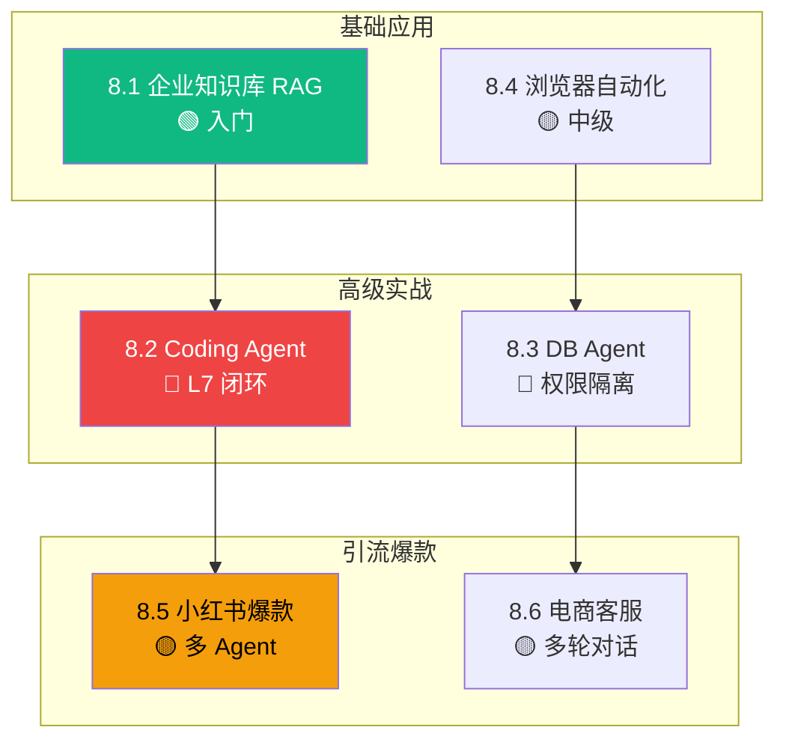

# L8 · 实战案例层 实施规格

> 笔名:晴暖
> 文档语言:中文(简体)
> 创建日期:2026-06-22
> 状态:v1.0 设计定稿
> 协议:CC BY-NC-SA 4.0
> 父级规格:`docs/superpowers/specs/2026-06-18-agent-dev-handbook-design.md`

---

## 0. 项目背景

P0-P7 已完成(项目骨架 + L1-L7 共 72 节 / ~9.5 万字 / 81 张图)。P8 启动 L8 实战案例层(**6 案例 / ~1.2 万字**),是七层手册的"**实战收尾层**"——把 L1-L7 的理论、模式、协议、框架、可观测、生产安全,落到**6 个真实业务场景的端到端实现**。

**L8 的核心价值**:从"**知道怎么做**"到"**看到真东西长什么样**"——读者读完 L8 后,能在 6 类典型业务场景中找到**最接近自己需求的参照案例**,复制决策路径 + 架构骨架 + 踩坑清单,缩短从 0 到 1 的时间。

**L7 → L8 衔接**:L7 中已有 4 处前向引用(7.4 / 7.9 / 7.10 / L7 README),要求 L8.2 Coding Agent 案例展示 L7 真实落地的"Guardrails + E2B + Circuit Breaker + GDPR"全套。

---

## 1. L8 在七层中的定位

```
L1 基础理论 → L2 上下文 → L3 协议 → L4 框架 → L5 模式 → L6 可观测 → L7 生产安全 → ★L8 案例★
                                                                          ↑
                                                              "实战收尾 · 6 类真实业务端到端"
```

| 维度 | L7 生产安全层 | L8 案例层 |
|---|---|---|
| 视角 | "防 + 部署 + 运维 Agent 系统" | "真实场景端到端实战" |
| 抽象度 | Guardrails + 沙箱 + SLA + 合规 | 业务问题 + 落地代码 + 真实决策 |
| 时机 | 部署期(怎么护) | 验收期(怎么证) |
| 字数预算 | 1.4 万字(已交付) | 1.2 万字 |
| 受众 | 🟡🔴 进阶+专家 | 🟢🟡🔴 全员 |
| 与 L7 衔接 | 提供生产防护模式 | 集成 L6 + L7 到真实业务 |

---

## 2. 受众与门槛

| 圈层 | 受众 | 读完能做 | 占比 |
|---|---|---|---|
| 🟢 入门圈 | 自学 Agent 的开发者 | 复制案例骨架,改造成自己的项目 | ~30% |
| 🟡 进阶圈 | 准备上线的工程师 | 评估案例适配度,选型 + 决策 | ~50% |
| 🔴 专家圈 | 架构师 / 技术负责人 | 提炼共性,做企业内技术布道 | ~20% |

**L8 整体偏 🟢🟡**,6 案例覆盖从入门到专家的全谱系,目的是**让任何读者都能找到最像自己业务的案例**。

**前置知识**:
- 必读:L4.3 LangGraph / L5.1 ReAct / L6 全部(可观测)/ L7 全部(生产安全)
- 推荐:L2 RAG 三件套(2.2)/ L3 MCP(3.3)

---

## 3. L8 6 案例详细大纲

> **结构总览**(女王大人已确认 **3 批 × 2 案例 · 方案 A 切分**):
> - 批 1(worktree `l8-batch-1`):8.1 RAG + 8.4 浏览器(基础 + 中级)
> - 批 2(worktree `l8-batch-2`):8.2 Coding + 8.3 DB(高级双案例,L7 前向引用闭环)
> - 批 3(worktree `l8-batch-3`):8.5 小红书 + 8.6 客服(引流爆款)

### 3.1 批 1 案例(基础 + 中级)

### 8.1 企业知识库 RAG Agent 🟢

- **业务场景**:中型企业(500-2000 人)内部知识检索——员工问"年假怎么请",Agent 从 HR 政策 / 内部 wiki / 历史邮件中找答案。
- **核心需求**:
  - 输入:1000+ 篇 PDF / Word / Confluence 页面
  - 检索:多路召回(BM25 + 向量)+ 重排 + 答案合成
  - 输出:自然语言答案 + 引用来源(可点击)
  - 验收:召回率 ≥ 85% / P95 延迟 ≤ 3s / 单次成本 ≤ $0.02
- **架构骨架**:Confluence / S3 文档源 → 文档解析(PyMuPDF / Unstructured)→ Embedding(OpenAI text-embedding-3-small)→ 向量库(Qdrant / pgvector)→ ReAct Agent → 答案
- **关键决策**:
  - 文档分块:固定 512 token vs 语义分块(选语义分块,Markdown 标题感知)
  - 检索融合:RRF(Reciprocal Rank Fusion)+ Cross-Encoder 重排
  - 引用溯源:每段答案标注 chunk 来源 + 相似度分数
- **代码骨架**:**✅ LangChain LCEL RAG 管道 + RRF 融合(50-80 行 Python)**
- **L7 衔接**:文档源 PII 检测(Microsoft Presidio)+ 答案引用强制(避免幻觉)
- **与其他案例对比**:8.1 是"RAG 入门",8.2/8.3 涉及更复杂工具编排

### 8.4 浏览器自动化 Agent 🟡

- **业务场景**:跨境电商运营——自动登录 Shopify 后台,采集竞品价格、库存、活动,导出 Excel 报表。
- **核心需求**:
  - 输入:自然语言任务"采集店铺 X 过去 7 天的折扣活动"
  - 浏览器控制:Playwright / Browser-Use / Anthropic Computer Use
  - 输出:结构化 JSON / Excel
  - 验收:任务成功率 ≥ 85% / 反爬对抗(代理 + 指纹混淆)
- **架构骨架**:自然语言 → Planner(LLM) → Action Sequence → Playwright 执行 → DOM 解析 → 数据清洗 → 输出
- **关键决策**:
  - 浏览器引擎:Playwright(headless 稳定)vs Browser-Use(LLM 友好)vs Computer Use(最灵活但慢)
  - 反爬:住宅代理 + 指纹混淆 + 行为模拟
  - 容错:页面变更时 Planner 重试 + 人工兜底
- **代码骨架**:**✅ Playwright + LLM Planner 最小骨架(50-80 行 Python)**
- **L7 衔接**:操作审计 + 危险操作二次确认(如付款 / 删除)+ 凭据隔离
- **与其他案例对比**:8.4 是"工具调用型 Agent",8.2/8.3 是"代码 / 数据执行型"

### 3.2 批 2 案例(高级双案例 + L7 闭环)

### 8.2 生产级 Coding Agent 🔴(L7 闭环重点)

- **业务场景**:SaaS 团队代码助手——开发者用自然语言描述需求,Agent 自动生成可执行 Python 脚本(数据处理 / ETL / 报表)。
- **核心需求**:
  - 输入:自然语言任务 + 上下文文件
  - 代码生成:Claude / GPT-4 + ReAct 多步迭代
  - 执行:E2B 沙箱隔离 + 超时控制
  - 输出:可执行代码 + 运行结果
  - 验收:编译通过率 ≥ 90% / 沙箱隔离 100% / 单任务成本 ≤ $0.10
- **架构骨架**:自然语言 → Plan(LLM 拆解步骤)→ Code Gen → E2B Execute → Result 反馈 → Replan / Finish
- **关键决策**:
  - 沙箱选型:E2B(50ms 冷启动,适合交互)vs Docker(慢但通用)vs Firecracker(分钟级,长任务)
  - LLM 选型:Claude Sonnet 4.6(代码能力强)vs GPT-4o(多语言均衡)
  - 错误恢复:Runtime 错误回灌 LLM 重写,3 次失败转人工
- **代码骨架**:**✅ E2B + LangGraph CodeAct 模式(50-80 行 Python)**
- **L7 衔接(闭环重点)**:
  - L7.1 Guardrails:代码生成前/后正则校验(危险 API 黑名单)
  - L7.4 E2B 沙箱:50ms 冷启动 + 30s 超时
  - L7.9 Circuit Breaker:E2B 故障时降级到本地 subprocess + 提示
  - L7.10 合规:用户代码 + 执行日志 GDPR 分层保留
- **与其他案例对比**:8.2 是"代码执行型",闭环 L7.4 / 7.9 / 7.10

### 8.3 数据库 Agent(Text2SQL)🔴(晴暖独家深度)

- **业务场景**:企业数据分析团队——产品经理用自然语言查"上个月华东区 GMV 同比",Agent 自动转 SQL + 执行 + 图表。
- **核心需求**:
  - 输入:自然语言 + 数据库 schema(自描述)
  - SQL 生成:Schema 链接 + Few-shot + Self-correction
  - 执行:只读账号 + 结果集大小限制
  - 输出:查询结果 + 自动图表 + SQL 解释
  - 验收:准确率 ≥ 80% / 权限隔离 100% / 慢查询拦截
- **架构骨架**:自然语言 → Schema 检索 → SQL 生成 → 静态分析(只读检查)→ 执行 → 结果/图表
- **关键决策**:
  - SQL 生成:纯 Prompt vs Fine-tune vs Text2SQL Agent(选 Agent + Self-correction)
  - 权限隔离:只读账号 + SQL 解析器拦截 DELETE/DROP/INSERT
  - 慢查询:EXPLAIN 预检 + 超时 10s 兜底
  - 图表:Chart.js 模板 + LLM 选图(柱/线/饼/表)
- **代码骨架**:**✅ LangChain SQL Agent + 权限拦截器(50-80 行 Python)**
- **L7 衔接**:
  - L7.3 工具权限:只读账号 + 操作审计
  - L7.5 鉴权:用户身份与 DB 账号分离
  - L7.9 SLA:慢查询降级到 schema 提示
- **与其他案例对比**:8.3 是"数据执行型",与 8.2 同样闭环 L7 但侧重权限

### 3.3 批 3 案例(引流爆款)

### 8.5 小红书爆款笔记生成 Agent 🟡

- **业务场景**:自由职业者 / 跨境电商运营——输入产品关键词,Agent 自动生成小红书爆款笔记(标题 + 正文 + 标签 + 配图 prompt)。
- **核心需求**:
  - 输入:产品关键词 / 卖点 / 目标人群
  - 多 Agent 协作:选题 Agent + 标题 Agent + 正文 Agent + 标签 Agent
  - 输出:3-5 套笔记方案 + 配图 prompt
  - 验收:互动率提升 ≥ 3x / 原创度 ≥ 90% / 标题吸引力评分
- **架构骨架**:产品输入 → 选题 LLM → 标题 LLM → 正文 LLM → 标签 LLM → 配图 Prompt LLM → 一致性审核
- **关键决策**:
  - 多 Agent 协作:串行(快)vs 并行(慢但丰富)vs Supervisor 调度(选 Supervisor)
  - 风格学习:RAG 检索爆款笔记 + 风格 Embedding
  - 一致性:审稿 Agent 查标题与正文匹配度
- **代码骨架**:**✅ LangGraph Multi-Agent Supervisor(50-80 行 Python)**
- **L7 衔接**:
  - L7.1 Guardrails:违规词过滤(广告法 / 平台规则)
  - L7.3 工具权限:外部 API 调用限频(避免触发平台反作弊)
- **与其他案例对比**:8.5 是"内容生成型",与 8.6 客服对话型形成对照

### 8.6 电商智能客服 Agent 🟡

- **业务场景**:跨境电商店铺——24/7 自动回复售前售后咨询,处理订单查询、退换货、政策问题。
- **核心需求**:
  - 输入:多语言客户咨询(中/英/西/阿)
  - 知识库:商品 FAQ + 政策文档 + 历史工单
  - 多轮对话:上下文 + 工单状态查询
  - 输出:回复 + 必要时升级人工
  - 验收:解决率 ≥ 75% / 满意度 ≥ 4.5/5 / 响应 ≤ 5s
- **架构骨架**:客户消息 → 意图识别 → 知识库 RAG → 回复生成 → 工单系统对接 → 必要时升级
- **关键决策**:
  - 意图识别:Fine-tune 小模型(快准)vs LLM(灵活贵)vs Hybrid(选 Hybrid)
  - 多语言:统一英文 prompt + 翻译 vs 多语言 prompt(选统一英文 + 输出翻译)
  - 升级人工:置信度阈值 + 情感检测(愤怒 / 不满自动升级)
- **代码骨架**:**✅ LangChain Conversational Agent + 工单系统对接(50-80 行 Python)**
- **L7 衔接**:
  - L7.5 鉴权:客户身份与店铺账号分离
  - L7.10 合规:客户对话 GDPR 30 天保留 + 删除权
  - L7.9 SLA:工单系统故障时降级到 FAQ 模板
- **与其他案例对比**:8.6 是"对话型",与 8.1 RAG 共享检索但强调多轮 + 工单

---

## 4. 案例统一结构(case-template.md 7 节)

每案例统一 7 个 block,2000-2200 字,1-2 张 mermaid 主图,1 段代码骨架(50-80 行 Python):

```markdown
# 案例 X.X:案例名

> 🟢 入门 / 🟡 进阶 / 🔴 专家

> **本案例钩子**:(1 句话 + 反直觉结论)

## 1. 业务背景与目标
- 业务场景:...
- 核心需求:...
- 验收指标:...

## 2. 架构图
- 顶层架构图:mermaid
- 数据流图:mermaid
- (可选)时序图:mermaid

## 3. 关键技术决策(trade-off 表)
| 决策点 | 方案 A | 方案 B | 选择 | 理由 |

## 4. 完整代码骨架
```python
# 50-80 行 Python
```

## 5. 评测数据
| 指标 | 目标 | 实际 |
|---|---|---|
| 准确率 | ≥ 90% | TBD |
| P95 延迟 | ≤ 2s | TBD |
| 单次成本 | ≤ $0.05 | TBD |

## 6. 踩坑清单(10 条)
1. (真实踩坑 + 修复)
2. ...

## 7. L6/L7 防护要点(L8 特有,3-5 条)
- L6 观测:...
- L7 防护:...
- L7 合规:...

> 📚 本案例参考
> (≥4 条 S/A 级引用)
```

**L8 特有扩展**:
- 第 7 节"防护要点"是 L8 相对 case-template 的**可选扩展**(女王大人已批准,不破坏 7 节结构)
- 真实评测数据列 TBD 占位(避免编造)
- 踩坑清单必须 ≥ 8 条,贴近实战

---

## 5. 章节首页(L8 README)设计

```markdown
# L8 · 实战案例层(6 案例 / 1.2 万字)

> 🟢🟡🔴 全员

> **本层定位**:从"**知道怎么做**"到"**看到真东西长什么样**"——实战收尾层。

## 6 案例全景图



## 6 案例一句话导览

| 案例 | 主题 | 业务场景 | 一句话 |
|---|---|---|---|
| 8.1 | 企业知识库 RAG | HR / 法务 / 内部 wiki | 1000 篇文档自然语言问答 |
| 8.2 | Coding Agent | SaaS 团队代码助手 | E2B 沙箱 + L7.9 熔断全套实战 |
| 8.3 | DB Agent | 数据分析团队 | 自然语言转 SQL + 权限隔离 |
| 8.4 | 浏览器自动化 | 跨境电商运营 | Playwright + LLM Planner |
| 8.5 | 小红书爆款 | 引流 | 多 Agent Supervisor 生成 |
| 8.6 | 电商客服 | 跨境电商店铺 | 多语言 + 工单 + 升级人工 |

## 学习路径

- **入门路径**(🟢 1 案例):8.1 RAG —— 复制骨架改自己的项目
- **进阶路径**(🟡 3 案例):8.1 → 8.4 → 8.6 —— 覆盖 RAG / 工具调用 / 对话
- **专家路径**(🟢🟡🔴 6 案例):全读 —— 提炼企业级 Agent 模式

## 与其他层衔接

| 层 | 衔接点 |
|---|---|
| **L1-L3** | L8.1 用 L2.2 RAG / L8.4 用 L3.3 MCP 工具 |
| **L4 框架** | 6 案例全部用 L4.2 LangChain LCEL + L4.3 LangGraph |
| **L5 模式** | L8.2 用 L5.4 Tool Use / L8.3 用 L5.7 Orchestrator-Workers |
| **L6 观测** | 6 案例均需 L6.7 成本 + L6.8 延迟监控 |
| **L7 防护** | L8.2 闭环 L7.4/7.9/7.10;L8.3 闭环 L7.3/7.5;L8.5 闭环 L7.1;L8.6 闭环 L7.5/7.9/7.10 |
```

---

## 6. 字数与图数预算

| 案例 | 字数 | 图数 | 代码段 | 引用 | 受众 |
|---|---|---|---|---|---|
| 8.1 RAG | 2000 | 2(架构+数据流)| 1 LCEL | ≥4 | 🟢 |
| 8.2 Coding | 2200 | 2(架构+时序)| 1 E2B CodeAct | ≥4 | 🔴 |
| 8.3 DB | 2200 | 2(架构+权限)| 1 SQL Agent | ≥4 | 🔴 |
| 8.4 浏览器 | 2000 | 2(架构+反爬)| 1 Playwright | ≥4 | 🟡 |
| 8.5 小红书 | 1800 | 2(架构+多 Agent)| 1 Supervisor | ≥4 | 🟡 |
| 8.6 客服 | 1800 | 2(架构+多轮)| 1 Conv Agent | ≥4 | 🟡 |
| **L8 README** | 500 | 1(全景图)| 0 | ≥3 | 🟢🟡🔴 |
| **合计** | **~1.25 万字** | **13 张图** | **6 段代码** | ≥24 条 | — |

**字数验收阈值**:1200-2500 字 / 案例(比 L1-L7 节更宽,因案例更复杂),6 案例总计 ≥ 1.0 万字 ≤ 1.5 万字。

**图验收**:每案例 ≥ 2 张 mermaid(架构 + 数据流),6 案例 + README = 13 张。

---

## 7. 干货来源与引用规范

每案例 ≥ 4 条 S/A 级引用(S/A 域名白名单见 `scripts/_reference_domains.py`)。

> ⚠️ **L8 特殊挑战**:**6 案例涉及大量真实业务平台**(Shopify / 小红书 / 各类 SaaS),这些平台文档域名多数**不在 S/A 白名单**。

**引用规则**(对齐 L7 P7 经验):
- ✅ 用 `github.com` 链接(LangChain / LlamaIndex / Playwright / E2B / Presidio 等开源项目)
- ✅ 用 `arxiv.org` 论文(RAG 综述 / Text2SQL 论文 / Multi-Agent 论文)
- ✅ 用 `anthropic.com` / `openai.com` 官方博客
- ✅ 用 `langchain.com` 官方文档 / `langchain-ai/langgraph` GitHub
- ✅ 用 KEY_AUTHORS(Lilian Weng / Eugene Yan / Chip Huyen)即使不在白名单域名
- ❌ 不用 `shopify.com` / `xiaohongshu.com` / `aws.amazon.com` / `cloud.google.com`(不在白名单)
- ⚠️ `lilianweng.github.io` / `eugeneyan.com` 已在 L1-L7 豁免,L8 延续

| 级别 | 来源 |
|---|---|
| S | GitHub (LangChain / LangGraph / LlamaIndex / Playwright / E2B / Presidio / Anthropic SDK 等),ArXiv (RAG 综述 / Text2SQL / Multi-Agent / CodeAct 论文),Anthropic Engineering, OpenAI Blog |
| A | Lilian Weng 博客, Eugene Yan 博客, Chip Huyen *AI Engineering* (2024) |
| B | LangChain Blog, LangGraph GitHub |

**特别引用清单**(每案例可复用):
- 8.1 RAG:`github.com/langchain-ai/langchain` (RAG 模板) + ArXiv "Retrieval-Augmented Generation for Large Language Models" + Lilian Weng + Eugene Yan
- 8.2 Coding:`github.com/e2b-dev/E2B` README + ArXiv "CodeAct" 论文 + Anthropic Engineering + Chip Huyen
- 8.3 DB:`github.com/langchain-ai/langchain` (SQL Agent) + ArXiv "Text-to-SQL" 综述 + Lilian Weng + Eugene Yan
- 8.4 浏览器:`github.com/microsoft/playwright` README + ArXiv "WebArena" 论文 + Anthropic Computer Use Blog
- 8.5 小红书:`github.com/langchain-ai/langgraph` (Multi-Agent) + ArXiv "Multi-Agent" 综述 + Lilian Weng
- 8.6 客服:`github.com/langchain-ai/langchain` (Conversational) + Anthropic Engineering + Eugene Yan

---

## 8. 验收标准

每案例必须满足:

| 维度 | 门槛 | 校验方法 |
|---|---|---|
| 字数 | 1200-2500 字 / 案例 | `scripts/check_word_count.py`(需扩展) |
| 引用 | ≥4 条 S/A 级 | `scripts/check_references.py` |
| 图 | ≥2 张 mermaid / 案例 | `scripts/check_figures.py` |
| 代码 | 1 段 50-80 行 Python(可 ast.parse)| 人工核查 + ast.parse |
| 决策表 | ≥3 个决策点 × 方案 A/B | "关键技术决策" block 强制 |
| 踩坑清单 | ≥8 条真实踩坑 | "踩坑清单" block 强制 |
| L7 衔接 | ≥3 条 L6/L7 防护要点 | "防护要点" block 强制 |
| 节模板 | 严格 7 节结构 | 人工核查(对齐 case-template.md) |

**新增验收脚本需求**:
- `check_word_count.py` 当前配置为 800-1500 字/节,需扩展支持 1200-2500 字/案例范围(或新增 `check_case_word_count.py`)
- `check_figures.py` 当前校验 ≥1 张,需扩展 ≥2 张/案例(或新增 `check_case_figures.py`)

**L8 全层验收**:`bash scripts/run_all_checks.sh handbook/l8-case-studies/` 必须全部通过(脚本可能需小幅扩展)。

---

## 9. 实施策略(已与用户确认)

**女王大人已确认 P8 实施策略**:
- **3 批并行 + Worktree 隔离 + subagent-driven-development**
- **2+2+2 切分**(方案 A:基础 → 高级 → 引流)

**批次切分**(2+2+2,合并后总 6 案例):
- 批 1(worktree `l8-batch-1`):8.1 RAG + 8.4 浏览器(基础 + 中级 2 案例)
- 批 2(worktree `l8-batch-2`):8.2 Coding + 8.3 DB(高级双案例,L7 前向引用闭环)
- 批 3(worktree `l8-batch-3`):8.5 小红书 + 8.6 客服(引流爆款 2 案例)
- L8 README + 验收报告(在 master):依赖 6 案例全部合并后串行写

**Worktree 路径模板**:
```
C:\Users\caozh\Documents\LangChain\agent-handbook-l8-batch-N\
```

**流程细节**(对齐 P7 模式):
1. 每批创建 worktree(`l8-batch-1` / `l8-batch-2` / `l8-batch-3`)
2. 批内 2 案例串行 commit(避免 in-place edit 并发冲突)
3. 批间串行(批 2 依赖批 1 工具命名一致性)
4. L8 README 串行写(依赖 6 案例全部完成)
5. 整体跑 `run_all_checks.sh` 验证
6. merge worktree 回 master
7. commit 验收报告

**每案例 commit 信息模板**:
```
feat(l8): 8.X 案例名(副标题)

- 业务场景 + 核心需求 + 验收指标
- 架构图 + 数据流图 mermaid
- 关键决策表(3-5 个决策点)
- 代码骨架(50-80 行 Python)
- 评测数据表(目标 vs 实际 TBD)
- 踩坑清单 ≥8 条
- L6/L7 防护要点 ≥3 条
- S/A 级引用 ≥4 条

字数:XXXX 字 | 图:2 张 | 引用:4 条
```

---

## 10. 风险与缓解

| 风险 | 影响 | 缓解 |
|---|---|---|
| **S/A 域名白名单严格** | shopify.com / xiaohongshu.com / aws.amazon.com 不在白名单 | 用 `github.com` README 链接 + ArXiv 论文 + Anthropic 替代 |
| **真实评测数据编造风险** | 6 案例无真实运行数据 | 评测数据列"目标 vs 实际 TBD"占位,**绝不编造数字** |
| **业务平台 API 编造风险** | Shopify / 小红书 API 真实细节可能错 | 仅用 `github.com/microsoft/playwright` 等开源 SDK 真实 API;业务平台仅描述"调用方式"不写具体字段 |
| **多 Agent 复杂度** | 8.5 Supervisor / 8.6 多轮对话代码复杂 | 50-80 行聚焦最核心的 1 个 sub-agent 循环,不堆全套 |
| **与 L7 内容重叠** | 8.2 闭环 L7.4/7.9/7.10,L7 已讲过 | 边界清晰化——L7 讲"模式",L8 讲"在 X 业务中如何落地" |
| **字数爆预算** | 6 案例 × 2500 字 = 1.5 万字 | 8.5/8.6 引流类案例控制 1800 字,8.1/8.4 控制 2000 字 |
| **代码段不足** | 每案例 1 段 50-80 行 | 选 1 段最有差异化的:8.1 RAG 融合 / 8.2 E2B CodeAct / 8.3 SQL 权限拦截 / 8.4 Playwright Planner / 8.5 Supervisor / 8.6 Conv Agent |
| **跨层引用编造** | L4.3 / L5.4 / L7.4 路径可能错 | 写前 ls 验证实际文件名(继承 P7 教训) |
| **脚本不兼容** | check_word_count / check_figures 不支持 L8 范围 | 写脚本前先扩展支持 1200-2500 字 / ≥2 张图 |

---

## 11. 与全局规格的一致性

本规格完全对齐 `docs/superpowers/specs/2026-06-18-agent-dev-handbook-design.md` 第 149-156 行 L8 主题定义,并在以下 4 处做了**显式微调**:

1. **8.1 RAG 强化**:原"企业知识库 RAG" → 现加入"**RRF 融合 + 引用溯源**"具体技术(避免幻觉的关键)
2. **8.2 Coding 强化**:原"Coding Agent" → 现加入"**E2B + LangGraph CodeAct + L7.4/7.9/7.10 全套闭环**"——这是 L7 4 处前向引用的归处
3. **8.3 DB 强化**:原"Text2SQL" → 现加入"**只读账号 + SQL 解析器拦截 + 慢查询预检**"——晴暖独家深度的具体体现
4. **8.6 客服强化**:原"智能客服" → 现加入"**多语言 + 工单系统对接 + 升级人工置信度阈值**"——工业级实战的完整闭环

字数与图数预算在全局预算内(L8 占七层 ~10%)。

---

## 12. 下一步

1. ✅ 已完成:规格文档(本文档)
2. ⏳ 下一步:调用 `writing-plans` skill 写实施计划 `docs/superpowers/plans/2026-06-22-l8-case-studies.md`
3. ⏳ 实施:按"3 批 × (2+2+2) 案例 + Worktree + subagent-driven-development"策略启动 P8 写作

---

**本规格经 brainstorming skill 流程产出,请用户审查后再进入 writing-plans 阶段。**
