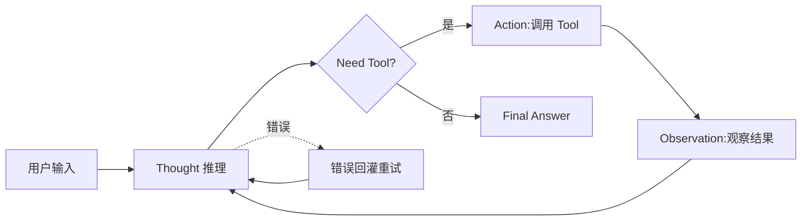
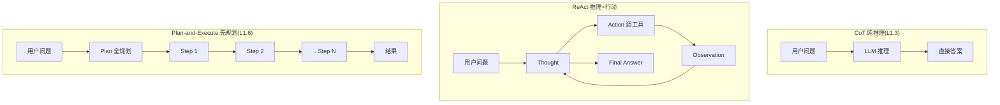

# 附录 A:ReAct Agent 模板(Python 主 + TypeScript 辅助)

> **目标**:给读者一份可复制粘贴即可跑的 ReAct Agent 完整模板
> **受众**:🟢 入门 + 🟡 进阶
> **前置知识**:必读 L1.4 ReAct 论文精读 + L5.1 ReAct 模式

---

## A.1 设计思路

ReAct(Reasoning + Acting)是一种让 LLM 在**推理**和**行动**之间循环的范式,源自 Yao 等人 2022 年的论文 *ReAct: Synergizing Reasoning and Acting in Language Models*。核心思想是:LLM 不仅要"想"(Reasoning),还要"做"(Acting),两者交替进行。LLM 每轮输出两部分:**Thought**(思考下一步该做什么)和 **Action**(调用工具)。工具执行后返回 **Observation**(观察结果),LLM 拿到 Observation 再推理下一步,直到输出 **Final Answer**。

为什么需要 ReAct 而不是直接 Prompt?关键差异在于**与外部世界的交互能力**。纯 Prompt 模式下,LLM 只能基于训练数据回答,无法获取实时信息(如天气、股价)或操作外部系统(如发邮件、改数据库)。ReAct 通过工具调用让 LLM 突破训练数据的时间与知识边界,从"封闭问答"升级为"开放执行"。

ReAct 与 Chain-of-Thought(CoT,L1.3 提到的思维链)的区别:CoT 是**纯推理**,不与外部交互;ReAct 是**推理 + 行动**,每步推理后必须执行 Action 拿 Observation。CoT 适合数学题、逻辑推理;ReAct 适合需要查数据、调 API 的实际任务。

ReAct 与 Plan-and-Execute(L1.6)的区别:Plan-and-Execute 是**先完整规划再执行**,中间不重新规划;ReAct 是**边执行边调整**,每步根据 Observation 决定下一步。ReAct 更灵活,适合动态环境;Plan-and-Execute 更稳定,适合任务结构清晰的场景。

本模板提供两个版本:
- **Python 主版(150 行)**:面向生产环境,基于 OpenAI/Anthropic SDK,支持多工具、错误回灌、流式输出
- **TypeScript 辅助版(50 行)**:面向 Web/Node.js 场景,基于 Vercel AI SDK,演示核心循环

适用场景:需要调用外部工具的 Agent(查询数据库、调用 API、执行代码)。不适用场景:纯对话、无工具调用的简单问答(直接调 LLM 即可)。

**何时不该用 ReAct**:
- 任务不需要外部信息(纯语言任务)
- 工具调用延迟过高(ReAct 多轮循环放大延迟)
- 任务结构高度确定(用确定性脚本或 Plan-and-Execute 更稳)
- 工具调用成本过高(每步 ReAct 都要重新调 LLM)

---

## A.2 ReAct 循环流程图



关键节点:
- **Thought**:LLM 思考"我需要做什么"。例如:"用户问北京天气,我需要调用天气 API"。
- **Action**:LLM 选择工具并填参数。格式:`{"tool": "weather", "params": {"city": "北京"}}`。
- **Observation**:工具执行结果。例如:`{"temperature": 25, "humidity": 60}`。
- **Final Answer**:LLM 判断信息已足够,生成最终回复。
- **错误回灌**:若 Action 执行失败(Runtime 错误),把错误信息拼回 prompt 让 LLM 重新推理,最多重试 3 次。

### A.2.1 ReAct 与其他模式对比



---

## A.3 Python 模板(150 行)

```python
"""
ReAct Agent 模板 - Python 版
依赖:pip install openai anthropic
"""
import json
import re
from typing import List, Dict, Any, Callable
from openai import OpenAI

# === 1. LLM 客户端封装 ===
class LLMClient:
    def __init__(self, model: str = "gpt-4o-mini", api_key: str = None):
        self.client = OpenAI(api_key=api_key)
        self.model = model

    def chat(self, messages: List[Dict], stop: List[str] = None) -> str:
        resp = self.client.chat.completions.create(
            model=self.model, messages=messages, stop=stop, temperature=0,
        )
        return resp.choices[0].message.content

# === 2. Tool 定义(用 JSON Schema 描述) ===
TOOLS = [
    {
        "name": "get_weather",
        "description": "查询指定城市的天气",
        "parameters": {
            "type": "object",
            "properties": {
                "city": {"type": "string", "description": "城市名,如 '北京'"}
            },
            "required": ["city"]
        },
        "func": lambda city: {"temperature": 25, "humidity": 60, "city": city}
    },
    {
        "name": "search_docs",
        "description": "在内部知识库搜索文档",
        "parameters": {
            "type": "object",
            "properties": {
                "query": {"type": "string", "description": "搜索关键词"}
            },
            "required": ["query"]
        },
        "func": lambda query: [{"title": "Doc1", "content": f"关于 '{query}' 的文档内容..."}]
    }
]

# === 3. Prompt 模板 ===
REACT_PROMPT = """你是 ReAct Agent,通过 Thought/Action/Observation 循环回答用户问题。

可用工具:
{tools}

输出格式(严格遵守):
Thought: <你的推理>
Action: {{"tool": "<工具名>", "params": {{...}}}}
Observation: <工具返回结果,由系统填入>
... (重复 Thought/Action/Observation 直到信息充足)
Thought: 我已有足够信息回答。
Final Answer: <最终回复>

用户问题:{question}
{history}"""

def format_tools(tools: List[Dict]) -> str:
    lines = []
    for t in tools:
        params = json.dumps(t["parameters"], ensure_ascii=False)
        lines.append(f"- {t['name']}: {t['description']}\n  参数:{params}")
    return "\n".join(lines)

# === 4. ReAct 循环 ===
class ReActAgent:
    def __init__(self, llm: LLMClient, tools: List[Dict], max_iter: int = 5):
        self.llm = llm
        self.tools = {t["name"]: t for t in tools}
        self.max_iter = max_iter

    def run(self, question: str) -> str:
        history = ""
        for i in range(self.max_iter):
            prompt = REACT_PROMPT.format(
                tools=format_tools(list(self.tools.values())),
                question=question, history=history,
            )
            output = self.llm.chat([{"role": "user", "content": prompt}])
            # 解析 Action
            action_match = re.search(r'Action:\s*(\{.*?\})', output, re.S)
            if not action_match:
                # 没有 Action,可能直接 Final Answer
                if "Final Answer:" in output:
                    return output.split("Final Answer:")[-1].strip()
                return output
            try:
                action = json.loads(action_match.group(1))
            except json.JSONDecodeError:
                return f"Action 解析失败: {action_match.group(1)}"
            # 执行 Tool
            tool_name = action.get("tool")
            if tool_name not in self.tools:
                obs = f"错误:未知工具 {tool_name}"
            else:
                try:
                    obs = self.tools[tool_name]["func"](**action.get("params", {}))
                    obs = json.dumps(obs, ensure_ascii=False)
                except Exception as e:
                    obs = f"工具执行错误:{type(e).__name__}: {e}"
            history += f"\n{output}\nObservation: {obs}\n"
            if "Final Answer:" in output:
                return output.split("Final Answer:")[-1].strip()
        return "达到最大迭代次数,未生成 Final Answer"

# === 5. 使用示例 ===
if __name__ == "__main__":
    llm = LLMClient(model="gpt-4o-mini")
    agent = ReActAgent(llm=llm, tools=TOOLS, max_iter=5)
    answer = agent.run("北京今天天气怎么样?")
    print(f"Answer: {answer}")
```

代码说明:
- **LLMClient**:封装 OpenAI 调用,支持自定义 model(可换 `claude-sonnet-4-6` 等)
- **TOOLS**:工具列表,每个工具有 `name`/`description`/`parameters`(JSON Schema)/`func`(实际执行函数)
- **REACT_PROMPT**:严格定义 Thought/Action/Observation/Final Answer 输出格式
- **ReActAgent**:主循环,最多 `max_iter=5` 次迭代,自动解析 Action 并执行 Tool,错误回灌到 history

---

## A.4 TypeScript 辅助模板(50 行)

```typescript
// ReAct Agent 模板 - TypeScript 版(基于 Vercel AI SDK)
// 依赖:npm install ai @ai-sdk/openai
import { generateText, tool } from 'ai';
import { openai } from '@ai-sdk/openai';
import { z } from 'zod';

const weatherTool = tool({
  description: '查询指定城市的天气',
  parameters: z.object({ city: z.string() }),
  execute: async ({ city }) => ({ temperature: 25, humidity: 60, city }),
});

const searchTool = tool({
  description: '搜索内部知识库',
  parameters: z.object({ query: z.string() }),
  execute: async ({ query }) => [{ title: 'Doc1', content: `关于 ${query} 的内容` }],
});

export async function reactAgent(question: string) {
  const { text, toolCalls, toolResults } = await generateText({
    model: openai('gpt-4o-mini'),
    tools: { weather: weatherTool, search: searchTool },
    maxSteps: 5,
    prompt: `你是 ReAct Agent,基于工具调用回答问题。\n用户问题:${question}`,
  });
  return text;
}

// 使用:const answer = await reactAgent('北京天气怎么样?');
```

代码说明:基于 Vercel AI SDK 的 `generateText` + `maxSteps=5`,SDK 自动处理 ReAct 循环,无需手写 Thought/Action 解析。**注意**:这是简化版,生产环境建议用 A.3 Python 版做精细控制(错误回灌、prompt 工程)。

---

## A.5 使用示例

### 示例 1:简单问答(单工具)

```python
agent = ReActAgent(llm=llm, tools=[weather_tool_only])
answer = agent.run("上海天气?")
# Thought: 用户问上海天气,我调用 weather tool
# Action: {"tool": "get_weather", "params": {"city": "上海"}}
# Observation: {"temperature": 28, "humidity": 70, "city": "上海"}
# Final Answer: 上海今天 28 度,湿度 70%。
```

适用场景:用户输入直接对应单个工具调用。ReAct 循环只需 1-2 轮,延迟低,体验接近普通对话。

### 示例 2:多工具串联

```python
answer = agent.run("北京天气如何?推荐适合的户外活动。")
# 第一轮:调用 get_weather("北京")
# 第二轮:基于天气结果,调用 search_docs("北京 户外活动 晴天")
# Final Answer: 北京今天 25 度晴天,适合骑行/野餐。
```

适用场景:任务需要**多步推理 + 多工具组合**。这是 ReAct 的核心价值——LLM 自主决定工具调用顺序,而不是预先编排。代价是延迟较高(P50 5-8s),需要权衡用户体验。

### 示例 3:错误回灌

```python
# 故意传错参数触发错误
answer = agent.run("查询天气,城市名是 None")
# 第一轮:Action params.city = "None"(字符串)
# Observation: 工具返回城市未找到
# 第二轮:Thought 意识到 None 不是城市名,改问用户"请提供具体城市名"
# Final Answer: 请提供具体城市名。
```

适用场景:工具调用可能失败的场景(网络错误、参数校验失败)。ReAct 的错误回灌让 Agent **具备自我修正能力**,无需人工干预。生产环境强烈建议启用。

### 示例 4:动态决策(选工具)

```python
tools = [weather_tool, news_tool, calculator_tool]
answer = agent.run("苹果公司今天股价?如果涨了 5%,我投资 1 万能赚多少?")
# 第一轮:调用 news_tool("苹果 股价")
# Observation: 苹果今天股价 200 美元
# 第二轮:调用 calculator_tool("10000 * 200 * 0.05 / 200")
# Observation: 500
# Final Answer: 苹果今天 200 美元,如果涨 5%,1 万投资能赚 500 美元。
```

适用场景:任务需要**动态选择工具**(不是预先编排好的 pipeline)。这正是 LLM Agent 的核心优势——传统自动化脚本难以应对灵活任务。

### 示例 5:流式输出(Web 场景)

```python
# 流式版本:每次 LLM 输出增量返回
def run_stream(question: str):
    for chunk in agent.run_stream(question):
        yield chunk  # SSE 推送给前端
# 前端:EventSource('/api/agent/stream?question=...')
```

适用场景:Web/移动端需要"打字机效果"的实时反馈。流式输出显著提升用户体验,但代码复杂度高,需配合 L3.8 SSE 协议。

---

## A.6 常见定制点

| 定制点 | 默认值 | 建议调整 |
|---|---|---|
| `max_iter` | 5 | 复杂任务调到 8-10,简单问答调到 3 |
| `temperature` | 0 | 创意写作调到 0.7-1.0 |
| `model` | gpt-4o-mini | 生产用 gpt-4o 或 claude-sonnet-4-6 |
| **工具并行** | 串行 | 独立工具可并行调用,降低延迟 |
| **流式输出** | 非流式 | Web 场景用 SSE 流式,详见 L3.8 |
| **持久化** | 内存 state | 长任务用 LangGraph checkpoint,见 L4.3 |
| **HITL** | 无 | 关键决策加 Human-in-the-Loop,见 L5.10 |

---

## A.7 配套资源

- **L1.4 ReAct 论文精读**:ReAct 原文思路与论文细节
- **L5.1 ReAct 模式**:模式层的实现要点与变体
- **L5.4 Tool Use 模式**:Tool 定义的最佳实践
- **L3.1 Function Calling**:OpenAI Function Calling 协议
- **L3.3 MCP 协议**:Anthropic MCP 工具协议(更标准化)

> 📚 本附录参考
>
> - [https://github.com/langchain-ai/langchain](https://github.com/langchain-ai/langchain) —— LangChain ReAct Agent 实现参考
> - [https://arxiv.org/abs/2210.03629](https://arxiv.org/abs/2210.03629) —— "ReAct: Synergizing Reasoning and Acting in Language Models" (Yao et al. 2022)
> - [https://github.com/vercel/ai](https://github.com/vercel/ai) —— Vercel AI SDK(TS 版参考)