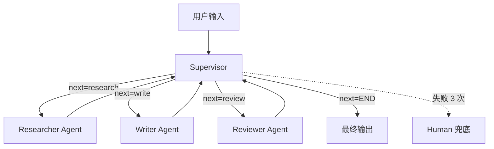
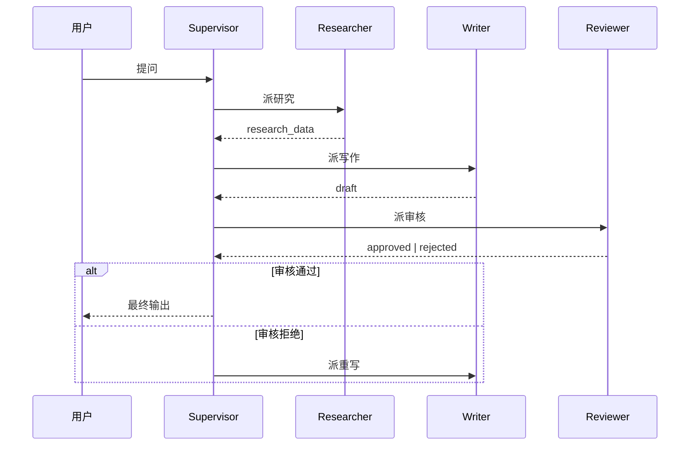

# 附录 B:多 Agent 协作骨架(LangGraph Supervisor)

> **目标**:给读者一份可扩展的多 Agent 骨架,基于 LangGraph Supervisor 模式
> **受众**:🟡 进阶 + 🔴 专家
> **前置知识**:必读 L4.3 LangGraph + L5.7 Orchestrator-Workers + L8.5 多 Agent 实战案例

---

## B.1 Supervisor 模式

Supervisor(监督者)是多 Agent 协作中最经典的模式之一。其核心思想是:**有一个中心调度节点(Supervisor)负责决策下一步由哪个 sub-agent 执行**,而不是让所有 Agent 自由通信。这种集中式调度带来三大优势:

1. **可观测性**:所有决策集中在 Supervisor,易于埋点和调试(L6.1 Tracing)。
2. **可控性**:Supervisor 可以强制某些路径(如 Human-in-the-Loop 兜底)。
3. **可扩展性**:新增 sub-agent 只需修改 Supervisor 的路由逻辑,无需改动其他 Agent。

与 L5.7 Orchestrator-Workers 模式的关系:Supervisor 是 Orchestrator-Workers 的**特殊形态**——Orchestrator 只负责任务分发,Supervisor 还负责决策下一步该分发谁。本质区别在于**决策粒度**:Orchestrator 一次分发所有任务,Supervisor 逐步分发。

适用场景:
- 复杂研究任务(研究员/写作者/审核员分工)
- 内容生产流水线(选题/写作/编辑/审核)
- 客服多轮对话(意图识别/知识检索/回复生成)

不适用场景:
- 简单一对一对话(用单 Agent ReAct 即可)
- 所有 sub-agent 完全独立可并行(用 L5.6 Parallelization 更高效)
- 需要 sub-agent 之间自由通信(用 AutoGen 的对话式多 Agent)

### B.1.1 与其他多 Agent 模式对比

| 模式 | 调度方式 | 通信拓扑 | 适用场景 | 代表框架 |
|---|---|---|---|---|
| **Supervisor**(本骨架) | 中心节点决策 | 星型,所有 sub-agent → Supervisor | 流水线任务,可观测性优先 | LangGraph |
| **Orchestrator-Workers**(L5.7) | 中心节点分发 | 星型,一次分完 | 任务可一次性切分,如 MapReduce | LangGraph, LlamaIndex |
| **对话式多 Agent** | 自由对话 | 网状,sub-agent 互相通信 | 协商/辩论/头脑风暴 | AutoGen, CrewAI |
| **分层 Supervisor** | 多层 Supervisor | 树型,Supervisor 嵌套 | 大型组织,职责分层 | 自研,OpenAI Swarm |

Supervisor 与 AutoGen 对话式多 Agent 的关键区别:**对话式多 Agent** 让 sub-agent 互相 @ 发言,灵活性高但难以追踪决策路径(谁说了什么触发了什么),生产环境调试成本极高;**Supervisor** 所有调度集中在一个节点,Decision Log 清晰可埋点,但牺牲了 sub-agent 之间的自由度。

Supervisor 与 L5.6 Parallelization 的关键区别:**Parallelization** 让多个 sub-agent 完全独立并行处理同一输入(如多个 reviewer 投票),结果汇总;**Supervisor** 是**逐步串行决策**,每一轮 Supervisor 根据当前 state 选择下一个 sub-agent,适合需要前一步结果才能决策下一步的场景。

### B.1.2 何时不该用 Supervisor

- **任务完全无状态**:如果每步之间没有数据依赖,直接用 `Send()` 并行更高效。
- **sub-agent 数量 > 10**:Supervisor 的路由表会爆炸,应改用分层 Supervisor 或子领域拆分。
- **sub-agent 需要共享大量上下文**:Supervisor 的中心 state 会成为瓶颈,此时用对话式更直接。
- **实时性要求极高**:Supervisor 每步多一次 LLM 决策,延迟叠加,实时场景建议用确定性规则路由。

---

## B.2 架构图

### B.2.1 整体架构



### B.2.2 状态流转



---

## B.3 骨架代码(LangGraph 80 行)

```python
"""
多 Agent 协作骨架 - LangGraph Supervisor 版
依赖:pip install langgraph langchain-openai
"""
from typing import TypedDict, Literal
from langgraph.graph import StateGraph, END
from langchain_openai import ChatOpenAI

# === 1. 共享 State ===
class AgentState(TypedDict):
    question: str
    research_data: str
    draft: str
    review_feedback: str
    approved: bool
    retry_count: int
    route: Literal["researcher", "writer", "reviewer", "human", "__end__"]

# === 2. 三个 sub-agent ===
llm = ChatOpenAI(model="gpt-4o-mini", temperature=0)

def researcher(state: AgentState) -> AgentState:
    """研究员:搜集背景资料"""
    resp = llm.invoke(f"为问题 '{state['question']}' 搜集关键事实,列出 3-5 个要点。")
    state["research_data"] = resp.content
    state["route"] = "writer"
    return state

def writer(state: AgentState) -> AgentState:
    """写作者:基于研究结果起草"""
    prompt = f"基于以下研究:{state['research_data']}\n撰写回答草稿。"
    state["draft"] = llm.invoke(prompt).content
    state["route"] = "reviewer"
    return state

def reviewer(state: AgentState) -> AgentState:
    """审核员:评估草稿质量"""
    prompt = f"评估草稿质量,返回 JSON: {{'approved': bool, 'feedback': str}}\n草稿:{state['draft']}"
    resp = llm.invoke(prompt).content
    import json
    try:
        result = json.loads(resp)
        state["approved"] = result["approved"]
        state["review_feedback"] = result["feedback"]
    except json.JSONDecodeError:
        state["approved"] = False
        state["review_feedback"] = "审核格式错误"
    state["route"] = "__end__" if state["approved"] else "writer"
    state["retry_count"] = state.get("retry_count", 0) + (0 if state["approved"] else 1)
    if state["retry_count"] >= 3:
        state["route"] = "human"
    return state

# === 3. Supervisor 决策 ===
def supervisor(state: AgentState) -> str:
    return state["route"]

# === 4. 人工兜底节点 ===
def human_handoff(state: AgentState) -> AgentState:
    print(f"[HITL] 触发人工兜底。草稿:{state['draft']},反馈:{state['review_feedback']}")
    return state

# === 5. 组装 StateGraph ===
g = StateGraph(AgentState)
g.add_node("researcher", researcher)
g.add_node("writer", writer)
g.add_node("reviewer", reviewer)
g.add_node("human", human_handoff)
g.set_entry_point("researcher")
for node in ["researcher", "writer", "reviewer"]:
    g.add_edge(node, supervisor)
g.add_conditional_edges("supervisor", supervisor, {
    "researcher": "researcher", "writer": "writer",
    "reviewer": "reviewer", "human": "human", "__end__": END,
})
agent = g.compile()

# === 6. 使用 ===
if __name__ == "__main__":
    result = agent.invoke({"question": "什么是 ReAct?", "retry_count": 0, "route": "researcher"})
    print(f"最终输出:{result['draft']}")
```

代码说明:
- **AgentState**:共享状态,包含 question/research_data/draft 等字段,所有 sub-agent 读写它。
- **3 个 sub-agent**:Researcher/Writer/Reviewer 各司其职,通过修改 `state["route"]` 决定下一步。
- **supervisor 函数**:返回 `state["route"]`,作为条件边的目标。
- **retry_count**:审核失败 3 次后转人工兜底,避免无限循环。
- **HITL 接入点**:`human` 节点可对接 LangGraph 的 `interrupt_before` 实现真正的人工审核(L5.10)。

---

## B.4 使用示例

### 示例 1:基本调用

```python
result = agent.invoke({"question": "ReAct 和 CoT 的区别?", "retry_count": 0, "route": "researcher"})
# Researcher 搜集 CoT 与 ReAct 论文要点
# Writer 起草对比分析
# Reviewer 审核质量,通过则 END,否则回到 Writer 重写
print(result["draft"])
```

### 示例 2:添加第 4 个 sub-agent

```python
def translator(state: AgentState) -> AgentState:
    """翻译:把草稿翻译成英文"""
    state["draft"] = llm.invoke(f"翻译成英文:{state['draft']}").content
    state["route"] = "__end__"
    return state

g.add_node("translator", translator)
g.add_conditional_edges("supervisor", supervisor, {
    ... "translator": "translator",
})
```

修改 Supervisor 路由表,即可新增 sub-agent。其他 sub-agent 无需改动,符合**开闭原则**。

### 示例 3:修改 Supervisor 决策逻辑

```python
# 原版:Supervisor 只看 state["route"]
def supervisor(state: AgentState) -> str:
    return state["route"]

# 升级版:Supervisor 根据 draft 长度动态决策
def smart_supervisor(state: AgentState) -> str:
    if len(state["draft"]) < 100:
        return "writer"  # 太短,重写
    if state.get("approved") is False and state.get("retry_count", 0) < 3:
        return "writer"
    return "__end__"
```

Supervisor 可以变得"聪明",但要注意**复杂度边界**——Supervisor 不应承担太多逻辑,否则反而成了"上帝节点",难以维护。

---

## B.5 扩展方向

### B.5.1 加 Memory 节点

把每次对话的历史压缩后存到长期记忆,下次会话自动加载。L2.7 详细讨论过 Letta/MemGPT 等方案,这里给出 LangGraph 接入示例:

```python
from letta import create_client

def memory_node(state: AgentState) -> AgentState:
    """把历史对话存到长期记忆(基于 Letta)"""
    client = create_client()
    agent_id = state.get("memory_agent_id")
    client.user_message(agent_id=agent_id, message=f"Q: {state['question']}\nA: {state['draft']}")
    summary = client.get_context(agent_id=agent_id)  # 压缩后的历史
    state["memory_summary"] = summary
    return state

# 在 Supervisor 路由表中加入 memory 节点
g.add_node("memory", memory_node)
g.add_edge("writer", "memory")  # 写完后存记忆
g.add_conditional_edges("supervisor", supervisor, {
    ... "memory": "memory",
})
```

参考 L2.7 长期记忆(Letta/MemGPT)。

### B.5.2 加 Human-in-the-Loop

```python
agent = g.compile(interrupt_before=["human"])  # human 节点前暂停
# 运行时:人工审核后从 checkpoint 恢复
config = {"configurable": {"thread_id": "user-123"}}
for chunk in agent.stream(None, config=config):
    if chunk.get("__interrupt__"):
        # 弹窗让用户审核
        feedback = input(f"草稿:{chunk['draft']}\n通过? (y/n): ")
        agent.update_state(config, {"human_feedback": feedback, "route": "__end__"})
        break
agent.invoke(None, config=config)
```

参考 L5.10 Human-in-the-Loop 模式。**生产建议**:对每个 sub-agent 都设置 `interrupt_before`,而非仅在 human 节点前拦截,可控性更强但操作成本高。

### B.5.3 加 Tool Use 工具调用

```python
from langchain.tools import tool

@tool
def web_search(query: str) -> str:
    """搜索网络"""
    return search_web(query)  # 接入 Tavily / SerpAPI

@tool
def calc(expression: str) -> str:
    """计算数学表达式"""
    return eval(expression)  # 注意沙箱安全

def researcher_with_tools(state: AgentState) -> AgentState:
    """研究员 v2:可自主决定调用工具"""
    llm_with_tools = llm.bind_tools([web_search, calc])
    resp = llm_with_tools.invoke(f"研究问题:{state['question']}")
    if resp.tool_calls:
        for call in resp.tool_calls:
            if call["name"] == "web_search":
                obs = web_search.invoke(call["args"])
                resp = llm_with_tools.invoke([resp, obs])
    state["research_data"] = resp.content
    state["route"] = "writer"
    return state
```

参考 L5.4 Tool Use 模式 + L8.4 浏览器自动化。**注意**:工具调用会让 sub-agent 行为不可预测,Supervisor 应在 `researcher_with_tools` 后增加一轮"结果校验"节点。

### B.5.4 加并行 sub-agent

Supervisor 模式默认串行。如果某些 sub-agent 无依赖,可以并行执行:

```python
# 用 LangGraph 的 Send() 实现并行
from langgraph.constants import Send

def parallel_supervisor(state: AgentState) -> list:
    """并行派发:同时让 researcher 和 fact_checker 工作"""
    return [
        Send("researcher", {**state, "route": "writer"}),
        Send("fact_checker", {**state, "route": "__end__"}),
    ]

# 注册并行路由
g.add_conditional_edges("start", parallel_supervisor, ["researcher", "fact_checker"])
# 合并节点:两个并行分支汇合后再到 writer
def aggregator(state: AgentState) -> AgentState:
    research = state.get("research_data", "")
    fact = state.get("fact_check_result", "")
    state["research_data"] = f"研究:{research}\n事实核查:{fact}"
    state["route"] = "writer"
    return state
g.add_node("aggregator", aggregator)
```

参考 L5.6 Parallelization 模式。**注意**:并行分支共享 state 会有 race condition,建议每个 `Send()` 传入独立的 state 副本(用 `{**state, ...}` 隔离)。

---

## B.6 与 L8.5 实战案例对照

L8.5 小红书爆款生成 Agent 用的就是 Supervisor 模式:
- **选题 LLM** → **标题 LLM** → **正文 LLM** → **标签 LLM** → **配图 LLM** → **审稿 LLM**
- 每个 sub-agent 专精一个环节
- Supervisor 按 state.route 顺序调度
- 风格 RAG 作为共享上下文

附录 B 是 L8.5 的**通用骨架版**,L8.5 是**业务定制版**。读者可基于本骨架改造 L8.5 的业务场景,也能反向把 L8.5 改造为通用版。

---

## B.7 配套资源

- **L4.3 LangGraph**:LangGraph 状态机、持久化、Human-in-the-Loop 详解
- **L5.7 Orchestrator-Workers**:Orchestrator-Workers 与 Supervisor 的对比
- **L8.5 小红书 Agent**:Supervisor 模式的真实业务落地
- **L5.11 Multi-Agent 反模式**:多 Agent 协作的常见踩坑

> 📚 本附录参考
>
> - [https://github.com/langchain-ai/langgraph](https://github.com/langchain-ai/langgraph) —— Multi-Agent Supervisor 示例
> - [https://arxiv.org/abs/2402.03520](https://arxiv.org/abs/2402.03520) —— "Multi-Agent Collaboration Mechanisms: A Survey of LLMs" (Han et al. 2024)
> - [https://lilianweng.github.io/posts/2023-12-23-multi-agent-llm/](https://lilianweng.github.io/posts/2023-12-23-multi-agent-llm/) —— Lilian Weng Multi-Agent 综述