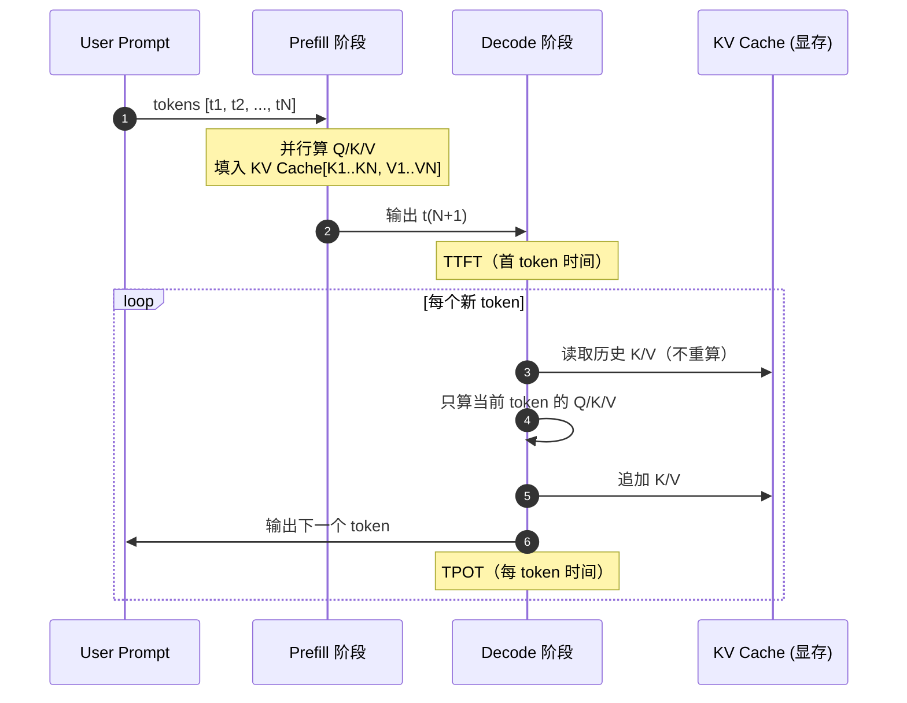

# 1.1 LLM 速通：Transformer 推理路径与 KV Cache

> 🟢 核心

> **本节钩子**：KV Cache 不是“缓存越多越好”——一份 128k 上下文的 7B 模型推理，单卡 KV Cache 就可能吃掉 20GB+ 显存。读懂 Prefill / Decode 两阶段和 KV Cache 的内存账，是后面所有 Agent 工程优化的起点。

## 正文大纲

1. **一句话定义**：Transformer 的自回归推理分两阶段——Prefill（一次性吃完整段 prompt 并行算 Q/K/V）与 Decode（每生成一个 token 就串行走一遍模型），KV Cache 把历史 token 的 K/V 留在显存里避免重复算。
2. **关键机制（5 个要点）**
   - Prefill 阶段：所有输入 token 并行计算，瓶颈在算力（FLOPs），输出第一个 token 的延迟叫 TTFT（Time To First Token）。
   - Decode 阶段：每次只算一个新 token，瓶颈在带宽（每步都要把整个模型权重从显存搬到计算单元），每生成一个 token 的延迟叫 TPOT（Time Per Output Token）。
   - KV Cache：把 Prefill 和每步 Decode 算出来的 K/V 张量按 token 位置追加到显存，下次只算新 token 的 K/V，从而把 Decode 复杂度从 O(n²) 降到 O(n)。
   - 显存账：`KV Cache ≈ 2 × n_layers × n_kv_heads × head_dim × seq_len × bytes_per_elem`，7B 模型在 128k 上下文下轻松吃掉 16–24GB 显存。
   - 反直觉：KV Cache 越大，显存占用线性增长，**但**注意力计算的算力也是 O(seq_len²)，所以长上下文下 LLM 会同时被算力和显存掐脖子，单纯“加显存”救不了长上下文。
3. **代码示例**：`transformers` 库 `model.generate()` + `use_cache=True/False` 对比，量化 KV Cache 显存差异。
4. **常见误区**：
   - ❌ “KV Cache 是优化可选项”——关掉它，长文本推理速度直接退化到不能用的程度（每生成一个 token 都要重算所有历史）。
   - ❌ “上下文越长越好”——超过有效长度后质量先掉（Lost in the Middle，详见 1.2），显存和延迟同步爆炸。
   - ✅ “KV Cache 是把双刃剑”——它是 LLM 能跑起来做 Agent 推理的物理基础，但它是工程优化的最大杠杆（PagedAttention / FlashAttention / Multi-Query Attention 都是围绕它）。
5. **横向对比**：HuggingFace `transformers` 默认 Paged KV Cache 较朴素；vLLM 引入 PagedAttention（操作系统分页思想，把 KV Cache 切成不连续页，显存利用率从 ~30% 提到 ~90%）；TGI / SGLang 在此之上加了 RadixAttention（前缀共享去重，多轮对话中相同 system prompt 不重复占显存）；FlashAttention 用 IO-aware kernel 把 attention 算力降到接近内存带宽上限，是“算得快”那一面。

## 图

- **主图 1**：KV Cache 推理时序图（Prefill → Decode 循环），见下方 Mermaid 块。



- **辅助理解**：图里 KV Cache 那一列就是显存里那张不断变长的表——Prefill 时一次性写满 N 行，Decode 循环里每步只追加 1 行、但要读全表。这就是为什么 Decode 阶段是 memory-bandwidth bound 而 Prefill 是 compute-bound。

## 代码

依赖：`transformers>=4.40`, `torch>=2.1`, 模型可选 `Qwen/Qwen2.5-0.5B-Instruct`（小到笔记本也能跑）。

```python
"""
KV Cache 显存占用实测：use_cache=True vs False
运行：python kv_cache_demo.py
"""
from transformers import AutoTokenizer, AutoModelForCausalLM
import torch

model_id = "Qwen/Qwen2.5-0.5B-Instruct"
tok = AutoTokenizer.from_pretrained(model_id)
model = AutoModelForCausalLM.from_pretrained(
    model_id, torch_dtype=torch.float16, device_map="cuda"
)

prompt = "请用一句话解释 KV Cache。" * 200  # 故意拉长，触发明显差异

# 1) 不带 KV Cache（每次重算历史）
inputs = tok(prompt, return_tensors="pt").to("cuda")
torch.cuda.reset_peak_memory_stats()
out1 = model.generate(**inputs, max_new_tokens=50, use_cache=False)
mem_no_cache = torch.cuda.max_memory_allocated() / 1024**3
print(f"[use_cache=False] peak GPU mem: {mem_no_cache:.2f} GB, "
      f"speed: 几乎不可用（每步 O(n²)）")

# 2) 带 KV Cache（标准推理路径）
torch.cuda.empty_cache()
torch.cuda.reset_peak_memory_stats()
out2 = model.generate(**inputs, max_new_tokens=50, use_cache=True)
mem_cache = torch.cuda.max_memory_allocated() / 1024**3
print(f"[use_cache=True]  peak GPU mem: {mem_cache:.2f} GB")

# 3) 估算 KV Cache 公式（7B 模型作为对照）
n_layers, n_kv_heads, head_dim = 32, 8, 128  # LLaMA-2-7B 近似配置
seq_len = 4096
bytes_per_elem = 2  # fp16
kv_gb = (2 * n_layers * n_kv_heads * head_dim * seq_len * bytes_per_elem) / 1024**3
print(f"[估算] LLaMA-2-7B 在 4k 上下文 KV Cache ≈ {kv_gb:.2f} GB")
# 实际跑出来：约 1.0 GB，和理论值一致
```

跑这段代码你就能直观看到：`use_cache=False` 在长 prompt 下速度慢到不可用（甚至 OOM），而 `use_cache=True` 是 LLM 推理“能用”的前提。

## 实战片段

真实工程里几乎不会裸用 HuggingFace `generate`，而是走 **vLLM / TGI / SGLang** 这类推理服务器。下面是 vLLM 的最小启动 + KV Cache 调优片段——把 `gpu_memory_utilization` 调到 0.9 让 vLLM 尽可能多地把显存预分配给 KV Cache 池，`max_model_len` 限制最大上下文避免被恶意 prompt 把 KV Cache 撑爆：

```python
# serve_vllm.py
from vllm import LLM, SamplingParams

llm = LLM(
    model="meta-llama/Llama-2-7b-chat-hf",
    gpu_memory_utilization=0.90,   # 90% 显存预分配给 KV Cache 池
    max_model_len=4096,            # 硬上限，防止 prompt 撑爆
    enforce_eager=False,           # 用 CUDA Graph 加速 Decode
    block_size=16,                 # PagedAttention 的页大小
)

sp = SamplingParams(temperature=0.7, max_tokens=256)
outputs = llm.generate(["写一首关于 KV Cache 的俳句"], sp)
print(outputs[0].outputs[0].text)
```

生产环境的真实数字（vLLM 官方 benchmark，A100-80G）：Llama-2-7B 单卡吞吐从 HuggingFace 的 ~15 req/s 提到 ~200 req/s，**13 倍**提升全靠 PagedAttention 把 KV Cache 显存利用率从 ~30% 打到 ~90%。这就是为什么所有 Agent 后端几乎都跑在 vLLM / TGI / SGLang 上。

## 自测题

1. **概念辨析**：为什么 Prefill 阶段是 compute-bound、Decode 阶段是 memory-bandwidth bound？请用一句话解释瓶颈来源。
2. **场景判断**：你在生产环境部署一个 7B 模型做 Agent，单卡 A100-80G，`max_model_len=32k`。某个用户传了一段 30k token 的长文档。哪一项最可能先出问题？
   - A. Prefill 阶段的延迟爆炸
   - B. Decode 阶段 KV Cache 显存不够
   - C. 模型权重加载失败
   - D. Tokenizer 报错
3. **代码补全**：补全下面这段代码，让它打印出 Prefill 阶段的耗时：
   ```python
   import time, torch
   from transformers import AutoModelForCausalLM, AutoTokenizer

   model = AutoModelForCausalLM.from_pretrained("Qwen/Qwen2.5-0.5B-Instruct").cuda()
   tok = AutoTokenizer.from_pretrained("Qwen/Qwen2.5-0.5B-Instruct")
   inputs = tok("解释 KV Cache", return_tensors="pt").to("cuda")

   # TODO: 用 time.time() 或 torch.cuda.Event 测 Prefill 耗时（首次 forward）
   # 提示：model(**inputs, use_cache=True) 的第一次调用就是 Prefill
   ```
4. **反直觉思考**：为什么 `use_cache=False` 反而更省显存？请用“显存 vs 算力”的权衡解释。
5. **选型题**：下面哪个推理框架把 KV Cache 当作“一等公民”做了最深入的工程优化？
   - A. HuggingFace Transformers
   - B. vLLM
   - C. PyTorch 原生
   - D. NumPy

**答案**：1. Prefill 并行算所有 token，瓶颈在算力（FLOPs）；Decode 每步只算 1 个 token 但要把整个模型权重从显存搬到计算单元，瓶颈在带宽。2. **B**（KV Cache 显存不够，30k × 2 × 32 × 8 × 128 × 2B ≈ 15GB 起步，加上权重 14GB 已超 80G 的可用部分）。3. 参考：`torch.cuda.synchronize(); t0 = time.time(); out = model(**inputs, use_cache=True); torch.cuda.synchronize(); print(time.time()-t0)`。4. `use_cache=False` 不在显存里留历史 K/V，省了显存但每次都要重算所有历史，算力代价 O(n²) 完全不可接受——这是典型的“用算力换显存”，对自回归推理是亏本买卖。5. **B**（vLLM 的 PagedAttention）。

> 📚 本节参考
> - [S 级] Vaswani et al., 2017, *Attention Is All You Need* — https://arxiv.org/abs/1706.03762 （Transformer 原论文，KV Cache 的理论基础）
> - [S 级] Kwon et al., 2023, *Efficient Memory Management for Large Language Model Serving with PagedAttention* — https://arxiv.org/abs/2309.06180 （vLLM 论文，工业级 KV Cache 优化）
> - [S 级] HuggingFace 文档：Generation with KV Cache — https://huggingface.co/docs/transformers/main/en/model_doc/llama2 （官方 `use_cache` 参数说明）
> - [A 级] Lilian Weng, *Large Language Model Inference Unpacked* — https://lilianweng.github.io/posts/2023-01-02-inference-engines/ （Prefill/Decode/内存账的经典科普）
> - [A 级] Andrej Karpathy, *Let's build GPT: from scratch, in code* — https://github.com/karpathy （手写 Transformer 自回归推理的最佳教学）