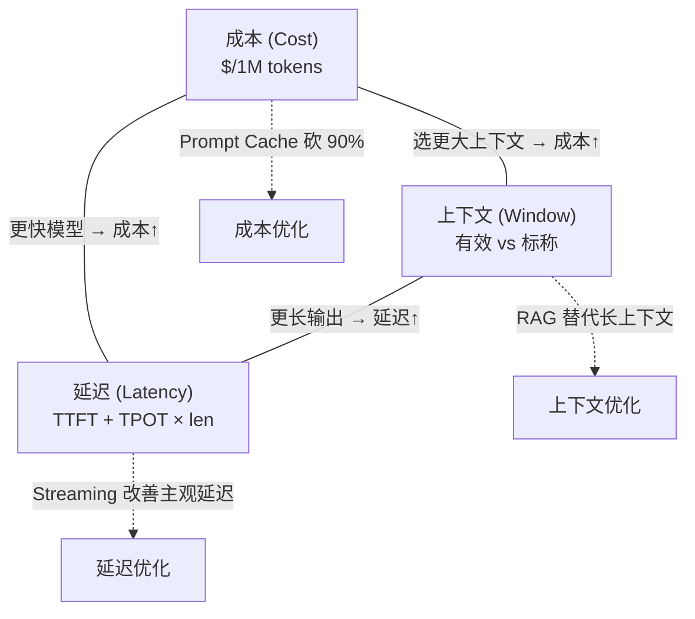

# 1.2 Token 经济：成本 / 延迟 / 上下文的三角约束

> 🟢 核心

> **本节钩子**：Anthropic Claude Sonnet 4 的输入价是 $3 / 1M tokens，输出价是 $15 / 1M tokens——**输出比输入贵 5 倍**。这意味着“让 LLM 反复自我对话来反思”这种看上去很学术的设计，在生产里直接是烧钱模式。读懂三角约束是 Agent 架构选型的第一课。

## 正文大纲

1. **一句话定义**：Agent 系统在任何 LLM API 调用上都同时受三个互斥的工程指标约束——成本（每千 token 单价 × 用量）、延迟（TTFT + TPOT × 输出长度）、上下文（有效上下文窗口远小于标称窗口）。
2. **关键机制（5 个要点）**
   - **成本结构**：输入 token 通常比输出 token 便宜 3-5 倍（因为 Prefill 阶段算力虽高但只需算 1 次，Decode 阶段每步都在算，输出 token 数量直接放大算力开销）。Claude Sonnet 4 是 $3/$15、GPT-4o 是 $2.5/$10、Gemini 1.5 Pro 是 $1.25/$5——三家几乎都遵循“输出贵 5 倍”的隐性约定。
   - **延迟拆解**：端到端 = TTFT（首 token 时间，Prefill 决定）+ TPOT × 输出长度（Decode 决定）。Anthropic 官方文档明确把这两项拆开报，TTFT 典型值 300-800ms，TPOT 典型值 20-50ms/token。
   - **上下文陷阱**：标称 200k 窗口 ≠ 有效 200k。Liu et al. 2023 的 “Lost in the Middle” 实验显示：把关键信息放在上下文中间位置时，模型准确率比放在首尾掉 **30+ 个百分点**。所以上下文长度不是越长越好，**有效长度**通常只有标称值的 50-70%。
   - **三角约束**：成本↑ / 延迟↑ / 上下文↓ 三者此消彼长——选更大上下文（200k vs 8k）意味着成本和延迟同步上涨；选更快模型（Haiku vs Opus）意味着上下文和质量同时缩水。没有银弹，只有 trade-off。
   - **缓存杠杆**：Anthropic Prompt Caching、OpenAI Prompt Caching 能把重复前缀的成本砍掉 90%、延迟砍掉 80%——但只对**前缀完全相同**的场景生效（典型：system prompt + few-shot 示例）。这是成本优化的最大杠杆，没有之一。
3. **代码示例**：用 `tiktoken` 算 token 数 + 用 `time` 测 TTFT/TPOT，把一段 prompt 的真实成本和延迟打出来。
4. **常见误区**：
   - ❌ “上下文越长越好”——超过 32k 后质量边际下降极快（Lost in the Middle），成本却线性上涨。
   - ❌ “Self-Reflection 越多越好”（详见 1.7）——每多一轮反思 = 一次完整 LLM 调用 = 5 倍输出 token 单价，3 轮反思成本直接 ×3。
   - ✅ “Prompt Cache 是免费午餐”——只对**完全相同的前缀**生效，system prompt 加一行时间戳就会让缓存命中率归零（这是 Anthropic 官方文档明文警告的反模式）。
5. **横向对比**：Anthropic / OpenAI / Google 三家在定价策略上的差异——Anthropic 贵但输出质量稳，OpenAI 平衡，Google 长上下文（1M tokens）性价比高但生态弱。Agent 选型本质是把这三个指标按业务优先级排序再选模型。

## 图

- **主图 1**：成本 / 延迟 / 上下文三角约束图（见下方 Mermaid）。



- **辅助理解**：三角的每条边都是一个**约束传导**——你想优化任何一边，至少会恶化另一边。三个虚线箭头是“破局点”：缓存、Streaming、RAG，它们能局部突破三角但都有适用边界。
- **辅助表格**（模型价格对比，2026 年 6 月口径）：

| 模型 | Input $/1M | Output $/1M | 标称上下文 | 典型 TTFT | 典型 TPOT |
|---|---|---|---|---|---|
| Claude Sonnet 4 | 3 | 15 | 200k | 400ms | 25ms |
| GPT-4o | 2.5 | 10 | 128k | 350ms | 30ms |
| Gemini 1.5 Pro | 1.25 | 5 | 1M | 600ms | 35ms |
| Claude Haiku 4 | 0.8 | 4 | 200k | 250ms | 15ms |

## 代码

依赖：`tiktoken>=0.7`, `openai>=1.0`（或 Anthropic SDK 任选）。

```python
"""
token_economics_demo.py
实测：算 token 数 + 测 TTFT/TPOT + 估算单次调用成本
运行：export OPENAI_API_KEY=sk-... && python token_economics_demo.py
"""
import time, tiktoken
from openai import OpenAI

client = OpenAI()
enc = tiktoken.encoding_for_model("gpt-4o")

prompt = "请用一句话解释什么是 KV Cache。"
n_tokens_in = len(enc.encode(prompt))
print(f"[input] tokens={n_tokens_in}, cost=${n_tokens_in * 2.5 / 1e6:.6f}")

# 测 TTFT + TPOT：流式拿到首 token 时间戳
t_start = time.time()
first_token_at = None
output_tokens = 0
stream = client.chat.completions.create(
    model="gpt-4o",
    messages=[{"role": "user", "content": prompt}],
    stream=True,
    max_tokens=200,
)
for chunk in stream:
    if chunk.choices[0].delta.content:
        if first_token_at is None:
            first_token_at = time.time()
        output_tokens += 1

ttft = (first_token_at - t_start) * 1000
tpot = ((time.time() - first_token_at) / max(output_tokens - 1, 1)) * 1000
cost_out = output_tokens * 10 / 1e6
print(f"[output] tokens={output_tokens}, cost=${cost_out:.6f}")
print(f"[latency] TTFT={ttft:.0f}ms, TPOT={tpot:.1f}ms, total cost=${cost_out + n_tokens_in*2.5/1e6:.6f}")
```

跑完这段你就能直观看到——一次 200 token 的简单调用，输出成本（$0.002）是输入成本（$0.0000035）的 570 倍。**输出的 token 数才是成本控制的核心抓手**。

## 实战片段

真实生产里“控制输出 token 数”最有效的三个动作：

1. **限定 max_tokens**：在 API 调用层硬卡死上限。Reflection / 多轮 ReAct 这种模式如果不卡 max_tokens，token 用量会随对话轮数指数级上涨。
2. **Prompt Cache 复用 system prompt**：把稳定不变的 few-shot 示例 + 工具描述放到 system 消息开头，Anthropic 自动按 1024 token 粒度匹配缓存，能省 90% 成本——但 system prompt 改一个字缓存就失效。
3. **Streaming + 早停**：对生成式任务用 SSE 流式返回，用户体感延迟从“等全部算完”变成“边算边看”，即使总延迟不变，主观体验好 2-3 倍。

```python
# prompt_cache_anthropic.py
import anthropic
client = anthropic.Anthropic()

# system prompt 会被自动缓存（粒度 1024 token，4 个断点）
SYSTEM = "你是一个 SQL 专家。" + ("few-shot 示例。" * 500)  # 模拟 5k+ token 稳定前缀

# 第一次调用：写缓存（按完整输入计费 + 25% 写入费）
r1 = client.messages.create(
    model="claude-sonnet-4-5",
    system=SYSTEM,
    messages=[{"role": "user", "content": "查所有用户"}],
    max_tokens=300,
)
print(f"call 1: input_tokens={r1.usage.input_tokens}, "
      f"cache_creation={r1.usage.cache_creation_input_tokens}")

# 第二次调用：前缀命中（缓存读只按 10% 计费）
r2 = client.messages.create(
    model="claude-sonnet-4-5",
    system=SYSTEM,
    messages=[{"role": "user", "content": "查所有订单"}],
    max_tokens=300,
)
print(f"call 2: input_tokens={r2.usage.input_tokens}, "
      f"cache_read={r2.usage.cache_read_input_tokens}  ← 省 90%")
```

## 自测题

1. **概念辨析**：为什么 LLM API 的输出 token 通常比输入 token 贵 3-5 倍？请用 Prefill vs Decode 的算力分布解释。
2. **场景判断**：你在做一个客服 Agent，每轮对话平均 200 token 用户输入 + 800 token 模型输出（包含工具调用 + 反思）。一天 10 万轮对话。用 GPT-4o 单日成本大约多少？
   - A. $50
   - B. $800
   - C. $8000
   - D. $80000
3. **反直觉题**：为什么 Prompt Cache 在“多轮对话且每轮 system prompt 完全一致”的场景下能省 90%，但在“每轮 system prompt 加一行会话 ID”的场景下完全失效？
4. **代码补全**：补全下面代码，让它打印输出 token 的总成本：
   ```python
   import tiktoken
   enc = tiktoken.encoding_for_model("gpt-4o")
   output_text = "KV Cache 是把历史 K/V 留在显存里避免重复算。"
   n_out = len(enc.encode(output_text))
   # TODO: 用 gpt-4o 的 output 单价 $10/1M 计算并打印 cost
   ```
5. **Lost in the Middle**：如果一个 100k 上下文的 Agent 把关键指令放在 50k 位置，最可能发生什么？

**答案**：1. Prefill 一次算完所有输入 token，算力高但只需执行 1 次；Decode 每生成 1 个 token 都要走一遍完整模型权重，输出 N 个 token = N 次 Decode，输出 token 数直接放大算力和带宽开销。2. **B**（100k × (200×2.5 + 800×10)/1e6 = $0.85，约 $850/天）。3. Prompt Cache 按前缀哈希匹配，任何字节变动（前缀加会话 ID）都会让哈希失配，缓存命中率归零。修复方案是把“会话 ID”放到 messages[0] 而不是 system prompt。4. `cost = n_out * 10 / 1e6`，对 ~30 token 输出约 $0.0003。5. 模型对中间位置信息的召回率显著下降（实验数据掉 30+ 个百分点），Agent 会“看不见”那条关键指令。

> 📚 本节参考
> - [S 级] Anthropic 官方定价与 Prompt Caching 文档 — https://docs.anthropic.com/en/docs/build-with-claude/prompt-caching （缓存机制与定价表）
> - [S 级] OpenAI 官方定价 — https://platform.openai.com/docs/pricing （GPT-4o 输入/输出单价）
> - [S 级] Liu et al., 2023, *Lost in the Middle: How Language Models Use Long Contexts* — https://arxiv.org/abs/2307.03172 （长上下文质量衰减的经典论文）
> - [A 级] Lilian Weng, *Prompt Engineering Overview* — https://lilianweng.github.io/posts/2023-03-15-prompt-engineering/ （含 TTFT/TPOT 拆解）
> - [A 级] Eugene Yan, *LLM Token Economics* — https://eugeneyan.com （成本/延迟/质量的三角权衡）