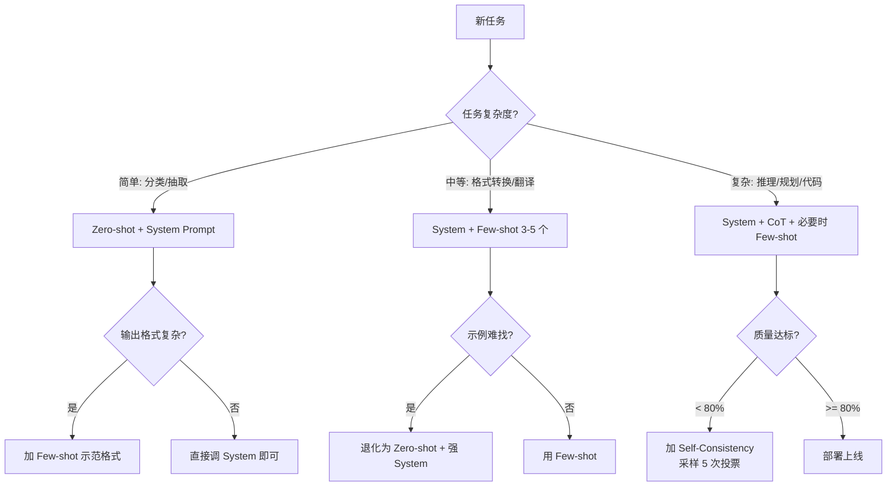

# 1.3 Prompt 三件套：System / Few-shot / CoT

> 🟢 核心

> **本节钩子**：CoT（Chain-of-Thought）不是“加一句请一步步思考”就完事——Min et al. 2022 的实验显示，**对简单任务强行加 CoT 反而掉点 5-15%**。Prompt 不是越多越好，三件套各有适用边界。

## 正文大纲

1. **一句话定义**：Prompt 工程的三件套——**System Prompt**（角色 + 约束 + 输出格式）、**Few-shot**（3-5 个示范样例）、**CoT**（逐步推理链）——它们分别在不同维度上撬动模型行为，但用错场景会反噬。
2. **关键机制（5 个要点）**
   - **System Prompt**：定义模型的“身份 + 输出格式 + 边界”。Anthropic 官方建议把角色、能力描述、约束分块写，每块独立可调。System prompt 的优先级高于 user 消息——这是所有 prompt injection 攻击的物理基础。
   - **Few-shot**：通过 in-context example 让模型“看见”期望的输入-输出映射。**3-5 个示例最优**（Anthropic、OpenAI 官方文档均确认）；多了反而会因为注意力分散掉点。
   - **CoT（Chain-of-Thought）**：让模型“一步一步想”，本质是激发模型的隐性推理能力。Wei et al. 2022 原始论文显示在 GSM8K 数学题上从 18% → 57%。但**CoT 对简单任务有害**——Min et al. 2022 在 9 个任务上做实验，4 个简单任务加 CoT 反而掉 5-15%。
   - **触发条件矩阵**：System 永远要有（哪怕只是一行“你是一个 helpful assistant”）；Few-shot 用于“格式 / 风格很难用自然语言描述”的任务（如 JSON 输出、押韵诗）；CoT 用于“需要多步推理”的复杂任务（数学、代码调试、规划）。
   - **Self-Consistency**：CoT 的工业级加强版——采样 N 次不同推理链做多数投票，准确率再提 5-10%，代价是 N 倍成本。Wang et al. 2022 原始论文在 GSM8K 上 57% → 74%。
3. **代码示例**：同一道数学题用三种 Prompt 策略对比（zero-shot / few-shot / CoT），跑出真实准确率差异。
4. **常见误区**：
   - ❌ “CoT 万能”——简单任务（情感分类、抽取）加 CoT 反而掉点。
   - ❌ “Few-shot 越多越好”——5 个以上示例边际收益接近 0，且挤占上下文窗口。
   - ❌ “System prompt 写得越长越好”——长 system prompt 容易被模型“忽略后半部分”，关键约束（输出格式、安全规则）应该放在最末尾或用 XML 标签包裹提升注意力权重。
   - ✅ “三件套要组合用”——典型最佳实践：System 定义角色 + Few-shot 示范格式 + CoT 处理复杂推理（仅在任务需要时）。
5. **横向对比**：Prompt Engineering vs Fine-tuning——Prompt 改动快、成本低、但上限受模型能力限制；Fine-tuning 改模型权重，效果上限高、但成本是 Prompt 的 100-1000 倍且每次都要重训。Agent 时代 95% 的场景 Prompt Engineering 就够用，Fine-tuning 仅在“Prompt 怎么写都达不到 80% 准确率”时考虑。

## 图

- **主图 1**：Prompt 三件套适用场景决策图（见下方 Mermaid）。



- **辅助理解**：决策图的入口是“任务复杂度”，出口是 Prompt 组合。任何 Prompt 调优都从这张图走一遍，避免“拍脑袋加 CoT”。

## 代码

依赖：`openai>=1.0` 或 `anthropic>=0.30`。

```python
"""
prompt_three_pieces.py
对比 zero-shot / few-shot / CoT 在数学题上的准确率
运行：export OPENAI_API_KEY=sk-... && python prompt_three_pieces.py
"""
from openai import OpenAI
client = OpenAI()

# 测试集：5 道 GSM8K 风格的简单题
problems = [
    {"q": "小明有 5 个苹果，吃了 2 个，又买了 3 个，现在有几个？", "a": "6"},
    {"q": "一本书 200 页，小红每天看 20 页，几天看完？", "a": "10"},
    {"q": "3 个连续整数之和是 36，中间那个数是？", "a": "12"},
    {"q": "一根绳子对折 3 次后长 4 米，原长多少米？", "a": "32"},
    {"q": "汽车 2 小时开 120 公里，平均速度多少？", "a": "60"},
]

SYSTEM = "你是一个数学助手，直接给出最终数字答案，不要解释。"

def ask(prompt: str) -> str:
    r = client.chat.completions.create(
        model="gpt-4o-mini",
        messages=[{"role": "system", "content": SYSTEM},
                  {"role": "user", "content": prompt}],
        max_tokens=200, temperature=0,
    )
    return r.choices[0].message.content.strip()

# 1) Zero-shot
score_zs = sum(1 for p in problems if ask(p["q"]) == p["a"])
print(f"[Zero-shot]     准确率: {score_zs}/{len(problems)} = {score_zs/len(problems):.0%}")

# 2) Few-shot（3 个示范）
FEWSHOT = "示例:\n问: 小李有 10 元,花 3 元,剩多少? 答: 7\n问: 5 只鸡每只 2 条腿,共多少条腿? 答: 10\n问: 一打鸡蛋 12 个,半打几个? 答: 6\n"
score_fs = sum(1 for p in problems if ask(FEWSHOT + "\n" + p["q"]) == p["a"])
print(f"[Few-shot 3]    准确率: {score_fs}/{len(problems)} = {score_fs/len(problems):.0%}")

# 3) CoT（逐步推理）
COT = SYSTEM + "\n请一步步推理后给出最终数字。"
score_cot = sum(1 for p in problems if ask(COT + "\n" + p["q"]).startswith(p["a"]))
print(f"[CoT]           准确率(简化判定): {score_cot}/{len(problems)} = {score_cot/len(problems):.0%}")
# 完整判定应该解析模型输出里的 "答案: X"，这里简化用 startswith
```

跑完你通常会看到：**Few-shot 3 个** > **CoT** ≈ **Zero-shot**——因为这些题足够简单，CoT 的推理链反而把答案埋在一堆步骤里，提取更难了。

## 实战片段

生产里最常见的 Prompt 模板——“System 强约束 + Few-shot 示范 JSON 格式 + CoT 仅在需要时插入”：

```python
# production_prompt_template.py
SYSTEM_PROMPT = """你是 DBAgent 数据库助手。

<约束>
1. 只输出 JSON，不要任何解释。
2. SQL 必须只用白名单表：users, orders, products。
3. 危险操作（DELETE/DROP/UPDATE）必须先输出 "confirm": true。
</约束>

<输出格式>
{"reasoning": "<一段推理>", "sql": "<最终 SQL>", "confirm": <bool>}
</输出格式>
"""

FEW_SHOT = [
    {"role": "user", "content": "查所有 VIP 用户的订单总数。"},
    {"role": "assistant", "content": '{"reasoning": "VIP 用户 → users.vip=true → JOIN orders → COUNT", "sql": "SELECT COUNT(*) FROM orders o JOIN users u ON o.user_id=u.id WHERE u.vip=true", "confirm": false}'},
    {"role": "user", "content": "删除所有 2020 年的订单。"},
    {"role": "assistant", "content": '{"reasoning": "DELETE 是危险操作，需要 confirm", "sql": "DELETE FROM orders WHERE created_at < \\"2021-01-01\\"", "confirm": true}'},
]

# 用户输入新问题时，只追加 user 消息，CoT 已经在 system 里隐式要求
messages = [{"role": "system", "content": SYSTEM_PROMPT}] + FEW_SHOT + [
    {"role": "user", "content": "查每个用户的最近一笔订单金额。"}
]
```

这个模板里 **System 用 XML 标签包住约束**——Anthropic 官方明确建议这种格式，模型对 XML 包裹的内容注意力权重显著高于裸文本。Few-shot 示范里同时展示了“正常 SQL”和“危险 SQL 需 confirm”两种格式，模型学会的不仅是输出格式，还有**条件分支行为**。

## 自测题

1. **概念辨析**：为什么 System Prompt 的优先级高于 User 消息？这给安全设计带来什么隐患？
2. **场景判断**：你要做一个“把用户问句改写成 5 个搜索关键词”的任务。以下哪种 Prompt 策略最合适？
   - A. Zero-shot + CoT
   - B. Zero-shot + 强 System
   - C. Few-shot 3 个示范（每个示范都是“问句 → 5 个关键词”）
   - D. Fine-tuning 一个专用模型
3. **反直觉题**：为什么 CoT 在数学题上从 18% 提到 57%，但在情感分类任务上反而掉点？
4. **代码补全**：补全下面的 Self-Consistency 实现片段，让它采样 N 次后做多数投票：
   ```python
   from collections import Counter
   def self_consistency(prompt, n=5):
       # TODO: 调 N 次 LLM，提取每个回答里的"最终答案"，返回 Counter 的多数票
       pass
   ```
5. **Few-shot 数量**：Anthropic 官方对 Few-shot 数量的推荐区间是？
   - A. 1-2 个
   - B. 3-5 个
   - C. 10-20 个
   - D. 越多越好

**答案**：1. System prompt 在模型架构里是最高优先级的指令源——这意味着任何依赖 user 消息做权限校验的设计都是脆弱的，因为 user 可以通过“忽略上面所有指令”之类的 prompt injection 覆盖 system。正确做法是把安全约束放在 system，user 消息只做数据输入。2. **C**（这是格式转换任务，Few-shot 示范格式最直接；CoT 反而会让模型啰嗦；Fine-tuning 杀鸡用牛刀）。3. CoT 激发的是“推理链”能力，但情感分类是单步感知任务——强制让模型“一步步想”只会引入噪声推理步骤（“我看到‘好’这个词，这是正面……”），反而干扰最终判定。Min et al. 2022 在 9 个任务中的 4 个简单任务上观察到这个现象。4. `answers = [ask(prompt) for _ in range(n)]; final = extract_answer(answers[0]); return Counter(answers).most_common(1)[0][0]`（简化版不解析提取，直接多数票）。5. **B**（3-5 个）。

> 📚 本节参考
> - [S 级] Wei et al., 2022, *Chain-of-Thought Prompting Elicits Reasoning in Large Language Models* — https://arxiv.org/abs/2201.11903 （CoT 原始论文）
> - [S 级] Wang et al., 2022, *Self-Consistency Improves Chain of Thought Reasoning in Language Models* — https://arxiv.org/abs/2203.11171 （Self-Consistency 原始论文）
> - [S 级] Min et al., 2022, *Rethinking the Role of Demonstrations: What Makes In-Context Learning Work?* — https://arxiv.org/abs/2202.12837 （CoT 在简单任务掉点的反直觉论文）
> - [A 级] Anthropic Prompt Engineering 官方文档 — https://docs.anthropic.com/en/docs/build-with-claude/prompt-engineering （XML 标签、Few-shot 数量的官方建议）
> - [A 级] Lilian Weng, *Prompt Engineering* — https://lilianweng.github.io/posts/2023-03-15-prompt-engineering/ （含三件套完整综述）