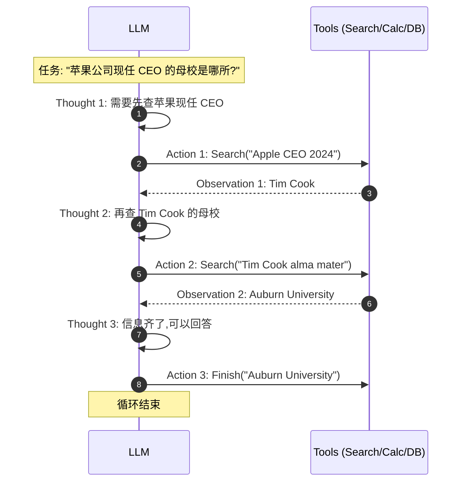
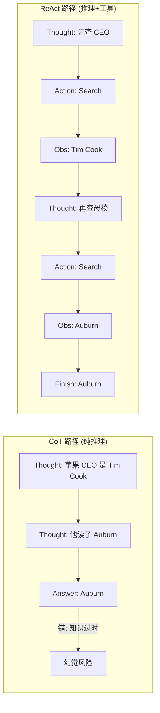

# 1.4 ReAct 论文精读：Reasoning + Acting 的循环

> 🟢 核心

> **本节钩子**：ReAct 让 LLM 在 HotpotQA 上从 CoT 的 28.7% 提到 **35.1%**，看起来数字不大——但它真正的突破不是“准”，而是让 LLM 第一次**能与外部环境实时交互**。这是所有现代 Agent（AutoGPT、LangChain Agent、Claude Tool Use）的祖师爷模式。

## 正文大纲

1. **一句话定义**：ReAct（Yao et al., 2022）把 LLM 的输出格式锁定为 **Thought → Action → Observation** 三元循环——Thought 让模型“自言自语”拆解任务，Action 调外部工具，Observation 把工具结果喂回给模型继续循环，直到模型判断任务完成为止。
2. **关键机制（5 个要点）**
   - **Prompt 模板**：原始论文里 ReAct 的 few-shot prompt 包含若干 (Thought, Action, Observation) 轨迹，模型在推理时严格按这个格式继续写。Action 限定在一组预定义工具（Search、Lookup、Finish 等）。
   - **循环终止条件**：模型输出 `Action: Finish[answer]` 时停止——这相当于让模型自己判断“任务完成”。相比写死循环次数，模型自终止更鲁棒但也更危险（可能陷入死循环，需要 max_steps 兜底）。
   - **与 CoT 的本质区别**：CoT 是纯推理（Thought 链），不接触外部世界；ReAct 是 Thought + Action + Observation，**Observation 是真值来源**——当模型推理出错时，工具返回的事实能纠正它。HotpotQA 上 ReAct 35.1% > CoT 28.7% > 仅 Action（无 Thought） 的 25.7%。
   - **失败模式**：① Thought 写得太啰嗦烧光 token（ReAct token 消耗是 CoT 的 3-5 倍）；② Action 格式写错导致解析失败；③ Observation 信息密度低导致 Thought 卡住。三个坑在生产里都是必踩的。
   - **现代演进**：ReAct 是 2022 年范式，2024 年后逐渐被 **Tool Use 协议**（OpenAI Function Calling、Anthropic Tool Use）取代——后者把 Action 从“自然语言字符串”升级为结构化 JSON，解析稳定性提升一个量级。但 Tool Use 的本质仍然是 ReAct 循环，只是格式更工程化。
3. **代码示例**：用 50 行 Python 复刻 ReAct 循环（不用任何 Agent 框架），跑一道 HotpotQA 风格的多跳问答。
4. **常见误区**：
   - ❌ “ReAct 已经过时了”——错，ReAct 是**模式**（Pattern），Tool Use 只是**协议**（Protocol）。所有现代 Agent SDK（LangGraph、OpenAI Agents、CrewAI）的底层状态机都是 ReAct 循环。
   - ❌ “ReAct 步骤越多越好”——ReAct token 消耗随步骤线性增长，5 步就能烧光一次 Opus 调用。生产里几乎都要搭配 Early Stopping + Token Budget。
   - ✅ “ReAct + CoT 混合”——先 ReAct 跑两步拿数据，再切到纯 CoT 做综合判断，能省 30%+ token。Self-Ask、IRCoT 都是这个思路的变种。
5. **横向对比**：
   - **CoT**：纯推理，无外部信息源。适合“模型知识够用”的任务。
   - **ReAct**：推理 + 工具。适合“需要实时/外部信息”的任务。
   - **Plan-and-Execute**（1.6 节）：先完整规划再执行。适合“任务步骤可预测、工具调用确定”的场景，比 ReAct 省 token。
   - **ReWOO**（1.5 节）：把 ReAct 的动态循环改成静态规划，进一步省 token，但失去动态调整能力。

## 图

- **主图 1**：ReAct 循环示意图（与 CoT 对比），见下方 Mermaid。



- **对比图**：CoT vs ReAct 推理路径（同样任务）



- **辅助理解**：CoT 路径短但每一步都是模型“猜”，错了就错到底；ReAct 路径长但每一步都“落地”到外部世界，Observation 是事实而不是猜测。

## 代码

依赖：标准库 `re` + `json`，外加一个能模拟工具的函数。生产里把 mock 工具替换成真实 API（Search → Google Search API、Calc → Python REPL）即可。

```python
"""
react_minimal.py
50 行复刻 ReAct 循环（Yao 2022 核心思想）
运行：python react_minimal.py
无需 API key（用 mock LLM 和 mock Tools）
"""
import re

# Mock LLM：实际生产替换成 openai/Anthropic 调用
def mock_llm(prompt: str) -> str:
    """模拟 ReAct 的 Thought-Action-Observation 模式。"""
    if "现任 CEO" in prompt:
        return "Thought: 需要查 Apple 现任 CEO。\nAction: Search[Apple CEO 2024]"
    if "母校" in prompt or "Auburn" in prompt:
        return "Thought: CEO 是 Tim Cook, 现在查他的母校。\nAction: Search[Tim Cook alma mater]"
    return "Thought: 信息齐全了。\nAction: Finish[Auburn University]"

# Mock 工具
TOOLS = {
    "Search": lambda q: "Tim Cook" if "CEO" in q else "Auburn University",
}

# ReAct Prompt 模板（简化版）
REACT_PROMPT = """回答问题: {question}

{history}
"""

def react(question: str, max_steps: int = 5) -> str:
    history = ""
    for step in range(max_steps):
        thought_action = mock_llm(REACT_PROMPT.format(question=question, history=history))
        # 解析 Thought 和 Action
        m = re.search(r"Action:\s*(\w+)\[(.*?)\]\s*$", thought_action, re.M)
        if not m:
            return f"解析失败: {thought_action}"
        tool, arg = m.group(1), m.group(2)

        if tool == "Finish":
            return arg  # 终止

        # 执行工具 → Observation
        obs = TOOLS.get(tool, lambda x: "未知工具")(arg)
        history += f"{thought_action}\nObservation: {obs}\n"

    return "超过 max_steps 未完成"

print(react("苹果公司现任 CEO 的母校是哪所?"))
# 输出: Auburn University
```

跑完这段你就掌握了 ReAct 的全部骨架——**解析 Action → 执行工具 → 拼 Observation 回 prompt → 再调 LLM**。所有 LangGraph / LangChain Agent 的源码里都能找到这 4 步循环。

## 实战片段

生产里 ReAct 通常会被“结构化 + 加防护”地实现。下面是一段 Anthropic Tool Use 版的 ReAct（注意：API 形态变了，但循环本质还是 Thought → Action → Observation）：

```python
# react_with_anthropic_tools.py
import anthropic
client = anthropic.Anthropic()

TOOLS = [
    {"name": "search", "description": "搜索网页",
     "input_schema": {"type": "object", "properties": {"query": {"type": "string"}}, "required": ["query"]}},
    {"name": "calculate", "description": "数学计算",
     "input_schema": {"type": "object", "properties": {"expr": {"type": "string"}}, "required": ["expr"]}},
]

def react_loop(question: str, max_steps: int = 8):
    messages = [{"role": "user", "content": question}]
    for step in range(max_steps):
        r = client.messages.create(
            model="claude-sonnet-4-5", max_tokens=1024,
            tools=TOOLS, messages=messages,
        )
        # 收集 tool_use blocks
        tool_uses = [b for b in r.content if b.type == "tool_use"]
        if not tool_uses:
            # 没有 tool_use 就是最终文本答案
            return r.content[0].text

        # 把 assistant 的 tool_use 加进历史
        messages.append({"role": "assistant", "content": r.content})
        # 执行工具 → tool_result 回喂
        tool_results = []
        for tu in tool_uses:
            if tu.name == "search":
                result = f"模拟搜索结果: {tu.input['query']}"
            elif tu.name == "calculate":
                result = str(eval(tu.input["expr"]))  # 生产用 safe eval
            else:
                result = "未知工具"
            tool_results.append({"type": "tool_result", "tool_use_id": tu.id, "content": result})
        messages.append({"role": "user", "content": tool_results})
    return "max_steps exceeded"

print(react_loop("Tim Cook 哪年出生? 他的出生年份的平方根是多少?"))
```

和原始 ReAct 论文对比：协议从“字符串 Action”升级为“结构化 JSON tool_use”，循环从“模型自己解析”升级为“框架自动注入 tool_result”——但 **Thought → Action → Observation** 的循环本质完全没变。

## 自测题

1. **概念辨析**：ReAct 论文里 HotpotQA 准确率 35.1% 比 CoT 高 6 个百分点，但 token 消耗是 CoT 的 3-5 倍。这个 trade-off 在生产里该如何权衡？
2. **场景判断**：下面哪个任务**最不适合**用 ReAct？
   - A. 实时查询“今天上海天气”
   - B. 写一首关于秋天的诗
   - C. 多步推理“A 公司收购 B 公司的金额乘以汇率是多少”
   - D. 需要先查 DB 再算指标的客服问题
3. **反直觉题**：为什么 ReAct 论文里 “仅 Action（无 Thought）” 在 HotpotQA 上只有 25.7%，比 CoT 28.7% 还低？
4. **代码补全**：补全下面这段 ReAct 循环的终止判定：
   ```python
   def react_loop(question, max_steps=10):
       history = ""
       for step in range(max_steps):
           out = llm(prompt(question, history))
           # TODO: 当模型输出包含 "Finish[<answer>]" 时返回答案, 否则继续
           # 提示: 用 re.search 匹配 Finish[...]
       return "max_steps exceeded"
   ```
5. **历史地位**：下面哪个现代 Agent 框架的底层状态机不是 ReAct 循环？
   - A. LangGraph ReAct Agent
   - B. OpenAI Assistants API
   - C. 纯文本生成（无工具）
   - D. Claude Tool Use Agent

**答案**：1. 对成本敏感的高频任务（客服）走“轻量 ReAct”（max_steps=3 + 用小模型）；对准确率敏感的低频任务（研究助手）走“重 ReAct”（max_steps=10 + Self-Consistency）。ReAct 的 token 消耗不是 bug，是模型“思考-行动-观察”必须付出的代价。2. **B**（写诗不需要外部工具，纯 CoT/直接生成就够；ReAct 的 token 开销完全浪费）。3. 仅 Action 没有 Thought 让模型无法规划下一步，只能基于上一轮 Observation 做局部反应，容易陷入“查-查-查-查不到”的死循环；CoT 至少有全局推理链但没事实；ReAct 两者结合效果最好。4. `m = re.search(r"Finish\[(.+?)\]", out); if m: return m.group(1); history += out + "\n"`。5. **C**（纯文本生成没有循环，没有 Observation，是 CoT-like 而非 ReAct）。

> 📚 本节参考
> - [S 级] Yao et al., 2022, *ReAct: Synergizing Reasoning and Acting in Language Models* — https://arxiv.org/abs/2210.03629 （ReAct 原始论文，HotpotQA/Fever 实验均在此）
> - [S 级] Anthropic Tool Use 官方文档 — https://docs.anthropic.com/en/docs/agents-and-tools/tool-use/overview （现代 ReAct 协议级实现）
> - [A 级] Lilian Weng, *LLM Powered Autonomous Agents* — https://lilianweng.github.io/posts/2023-06-23-agent/ （ReAct 完整综述 + 后续演进）
> - [A 级] LangChain ReAct Agent 源码 — https://github.com/langchain-ai/langchain （工业级 ReAct 实现的参考）
> - [A 级] Chip Huyen, *Building LLM-powered Apps* — https://github.com/chiphuyen （含 ReAct vs Plan-and-Execute 的工程对比）