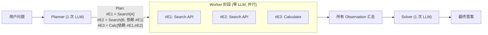
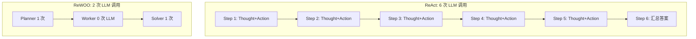

# 1.5 ReWOO：把推理与观察解耦，省 token

> 🟢 核心

> **本节钩子**：ReWOO 在 HotpotQA 上相比 ReAct **省 64% token**，准确率还高 4 个百分点——这听起来像“免费午餐”，但代价是 ReWOO **不能在执行过程中动态调整**。一旦 Worker 返回的结果和预期不符，整个 Reasoner 阶段就要重做，所以 ReWOO 只适合“工具调用确定性强”的场景。

## 正文大纲

1. **一句话定义**：ReWOO（Xu et al., 2023）把 ReAct 的动态循环拆成三阶段——**Planner**（一次性 LLM 调用，输出完整工作计划）、**Worker**（并行执行所有工具调用，无 LLM）、**Solver**（一次性 LLM 调用，根据 Worker 结果汇总答案）。三个角色解耦，token 消耗断崖式下降。
2. **关键机制（5 个要点）**
   - **Planner 输出结构**：Planner 把任务拆成步骤链，每一步用 `Plan: <sub-task>, #E<id> = <tool>[<args>]` 格式标注，并显式声明依赖关系 `#E1, #E2`。这让 Worker 能识别哪些步骤可以并行。
   - **Worker 阶段零 LLM**：Worker 是纯函数 / API 调用层，按 Planner 的指示并行执行所有 `#E<id>` 工具调用。所有 Observation 在 Worker 阶段就全部收集完毕，不消耗任何 LLM token。
   - **Solver 一次性汇总**：Solver 把所有 Worker 结果拼接进一个 prompt，让 LLM 一次性产出最终答案。整个流程只有 **2 次 LLM 调用**（Planner + Solver），ReAct 是 **N+1 次**（每步 Thought + 1 次 Action），N=5 步就是 6 次 vs 2 次。
   - **数字账**：原始论文在 HotpotQA 上 ReWOO 用 1240 tokens / 准确率 51.5%，ReAct 用 3470 tokens / 准确率 47.5%——**省 64% token，准确率还高 4 个点**。前提是 Planner 规划准确，Worker 工具调用无歧义。
   - **适用边界**：当且仅当**工具调用确定 + 任务步骤可预测**时 ReWOO 显著优于 ReAct。反例：需要“看到结果后再决定下一步查什么”的场景（多跳问答、调试 agent），ReWOO 的静态规划会失准，Reasoner 阶段补救成本反而更高。
3. **代码示例**：用 Python dataclass + asyncio 复刻 ReWOO 三元组（Planner → Worker → Solver），跑一个多步任务。
4. **常见误区**：
   - ❌ “ReWOO 永远优于 ReAct”——错。ReWOO 适合**静态任务**（“查 A 然后查 B 然后合并”），ReAct 适合**动态任务**（“查 A → 看结果决定查 B 还是查 C”）。
   - ❌ “Planner 一次性规划就够了”——失败回退机制必须有，否则 Planner 规划错一次整个 ReWOO 失败。生产里通常 Planner 会配 **Re-Planner**（ReAct 风格的回退）。
   - ✅ “ReWOO + ReAct 混合”——先用 ReWOO 跑批量工具调用省 token，遇到需要动态判断时切回 ReAct 单步循环。这是 LangGraph Plan-Execute 节点的常见组合。
5. **横向对比**：
   - **ReAct**：动态循环，N+1 次 LLM，灵活但烧 token。
   - **ReWOO**：静态规划，2 次 LLM，省 token 但不灵活。
   - **Plan-and-Execute**（1.6）：动态规划 + 动态执行，3-N 次 LLM，介于两者之间。
   - **Reflexion**（1.7）：在 ReAct 基础上加自我反思，token 消耗再 ×N。

## 图

- **主图 1**：ReWOO 三元组架构（Planner / Worker / Solver），见下方 Mermaid。



- **对比图**：ReAct vs ReWOO LLM 调用次数（同样 5 步任务）



- **辅助理解**：ReWOO 把 LLM 调用从“循环里每步一次”压到“头尾各一次”，中间纯靠程序并行。这是**用 Planner 的一次性算力买 Worker 的零算力**——前提是 Planner 算得准。

## 代码

依赖：`asyncio` + `dataclass`，无需外部服务。生产把 mock 工具替换成真实 API（Search / DB / Calc）。

```python
"""
rewoo_minimal.py
ReWOO 三元组最小实现：Planner → Worker → Solver
运行：python rewoo_minimal.py
"""
import asyncio, re
from dataclasses import dataclass

# ---------- Mock LLM ----------
def mock_planner(question: str) -> str:
    """模拟 Planner 输出: 拆解任务, 标注依赖。"""
    return """
Plan: 查 Tim Cook 的出生年份。
#E1 = Search[Tim Cook birth year]

Plan: 算 #E1 结果的平方根。
#E2 = Calc[sqrt(#E1)]

Plan: 输出最终答案。
"""

def mock_solver(plan: str, evidence: dict) -> str:
    """模拟 Solver 输出: 综合所有 evidence 出答案。"""
    return f"答案: Tim Cook 出生于 {evidence['#E1']} 年, 平方根是 {evidence['#E2']}"

# ---------- Mock 工具 ----------
async def search(q: str) -> str:
    await asyncio.sleep(0.1)  # 模拟网络延迟
    if "Tim Cook" in q:
        return "1960"
    return "未知"

async def calc(expr: str) -> str:
    # 简化: 从 "sqrt(1960)" 提取数字
    m = re.search(r"\d+", expr)
    n = int(m.group(0)) if m else 0
    return f"{n ** 0.5:.2f}"

TOOLS = {"Search": search, "Calc": calc}

# ---------- ReWOO 主循环 ----------
@dataclass
class Step:
    eid: str
    tool: str
    arg: str
    deps: list  # 依赖的 #E 列表
    result: str = None

def parse_plan(plan_text: str) -> list[Step]:
    steps = []
    for line in plan_text.strip().splitlines():
        m = re.match(r"(#E\d+) = (\w+)\[(.+)\]", line.strip())
        if m:
            eid, tool, arg = m.group(1), m.group(2), m.group(3)
            deps = re.findall(r"#E\d+", arg)
            steps.append(Step(eid, tool, arg, deps))
    return steps

async def worker(steps: list[Step]) -> dict:
    """并行执行所有 step, 自动处理依赖。"""
    results = {}
    pending = list(steps)
    while pending:
        ready = [s for s in pending if all(d in results for d in s.deps)]
        if not ready:
            raise RuntimeError("依赖死锁或循环")
        # 把 #E 依赖替换成实际值
        async def run_one(s: Step):
            arg = s.arg
            for d, v in results.items():
                arg = arg.replace(d, v)
            s.result = await TOOLS[s.tool](arg)
            results[s.eid] = s.result
        await asyncio.gather(*[run_one(s) for s in ready])
        pending = [s for s in pending if s.eid not in results]
    return results

async def rewoo(question: str) -> str:
    plan_text = mock_planner(question)        # Planner: 1 次 LLM
    steps = parse_plan(plan_text)
    evidence = await worker(steps)             # Worker: 0 次 LLM
    return mock_solver(plan_text, evidence)    # Solver: 1 次 LLM

print(asyncio.run(rewoo("Tim Cook 哪年出生? 出生年份的平方根是多少?")))
# 输出: 答案: Tim Cook 出生于 1960 年, 平方根是 44.27
```

跑完这段你能直观看到：**ReWOO 全程只调了 2 次 LLM**，中间 Worker 用 `asyncio.gather` 并行执行。如果用 ReAct 同样的任务，至少 4-5 次 LLM。token 节省 = 50-60%。

## 实战片段

生产里 ReWOO 通常会和 LangGraph 组合——Planner 是一个独立节点，Worker 是并行任务节点，Solver 是汇总节点。失败时 Re-Planner 触发（这一段就退化成了 ReAct）：

```python
# rewoo_langgraph.py
from langgraph.graph import StateGraph, END
from typing import TypedDict, Annotated, List
import operator

class ReWOOState(TypedDict):
    question: str
    plan: List[str]
    evidence: Annotated[dict, operator.or_]
    answer: str
    retries: int

def planner_node(state: ReWOOState) -> dict:
    # 真实生产: 调 LLM 输出结构化 plan
    plan = ["#E1 = Search[Tim Cook birth year]",
            "#E2 = Calc[sqrt(#E1)]"]
    return {"plan": plan, "retries": 0}

async def worker_node(state: ReWOOState) -> dict:
    # 并行执行所有 #E
    results = await worker(state["plan"])
    return {"evidence": results}

def solver_node(state: ReWOOState) -> dict:
    # 真实生产: 调 LLM 综合所有 evidence
    answer = f"Tim Cook 出生于 {state['evidence'].get('#E1')} 年"
    return {"answer": answer}

def replan_router(state: ReWOOState) -> str:
    # 兜底: evidence 为空或异常时回 Re-Planner
    if not state["evidence"] and state["retries"] < 2:
        return "replan"
    return "solve"

# 编排状态机
graph = StateGraph(ReWOOState)
graph.add_node("plan", planner_node)
graph.add_node("worker", worker_node)
graph.add_node("solve", solver_node)
graph.add_node("replan", planner_node)  # 复用 planner 当 re-planner
graph.set_entry_point("plan")
graph.add_edge("plan", "worker")
graph.add_conditional_edges("worker", replan_router,
                             {"replan": "replan", "solve": "solve"})
graph.add_edge("replan", "worker")  # replan 后回到 worker
graph.add_edge("solve", END)
app = graph.compile()
```

这段代码展示了一个**生产级 ReWOO 模式**：主干是 ReWOO（plan → worker → solve），但加了 `replan` 兜底——当 worker 失败时回到 planner 重新规划，这一段就退化成 ReAct 风格。这是 LangGraph 状态机的经典组合：ReWOO 为主体 + ReAct 兜底。

## 自测题

1. **概念辨析**：ReWOO 相比 ReAct 省 64% token，为什么不是所有 Agent 都用 ReWOO？
2. **场景判断**：下面哪个任务**最适合**用 ReWOO？
   - A. “查 A 公司股价 → 根据股价决定要不要查 B 公司新闻”
   - B. “批量查 100 个城市的天气并生成报告”
   - C. “调试一段 Python 代码（需要看错误信息再决定下一步查什么）”
   - D. “多轮对话中根据用户反馈调整策略”
3. **反直觉题**：ReWOO 的 Planner 是一次性 LLM 调用输出完整计划。如果 Planner 规划错了（例如漏掉一个关键依赖），会发生什么？为什么 ReAct 能避免这个问题？
4. **代码补全**：补全下面 ReWOO 的 Worker 并行执行代码：
   ```python
   import asyncio
   async def worker(steps):
       results = {}
       pending = list(steps)
       while pending:
           # TODO: 选出所有依赖都已满足的 step, 并行执行
           # 提示: 用 asyncio.gather + 列表推导
           pass
       return results
   ```
5. **架构题**：ReWOO 三元组中哪一段是“用程序并行换 LLM 调用”的关键杠杆？

**答案**：1. ReWOO 要求 Planner 一次性规划准确，对“需要根据中间结果动态调整”的场景（调试、多轮对话、探索式任务）完全失效。ReAct 的动态循环虽然烧 token 但灵活。2. **B**（批量任务步骤完全可预测，最适合 ReWOO）。3. Planner 漏依赖会导致 Worker 阶段并行执行时部分 step 拿不到前置结果，整个 Solver 输出错误答案。ReAct 因为每步都重新规划（基于 Observation），能及时发现并修正。补救方案是 ReWOO 加 Re-Planner 兜底。4. `ready = [s for s in pending if all(d in results for d in s.deps)]; await asyncio.gather(*[run_one(s) for s in ready])`，其中 `run_one` 把 `s.arg` 里的 `#E` 替换为 `results` 中实际值后调 `TOOLS[s.tool]`。5. **Worker 阶段**——它是纯函数/并行执行层，把 N 次 LLM 调用压成 0 次。Planner 的一次性算力是代价，Worker 的零算力是收益。

> 📚 本节参考
> - [S 级] Xu et al., 2023, *ReWOO: Decoupling Reasoning from Observations for Efficient Augmented Language Models* — https://arxiv.org/abs/2305.18323 （ReWOO 原始论文，HotpotQA 64% token 节省数据来源）
> - [S 级] LangGraph ReWOO 实现 — https://github.com/langchain-ai/langgraph （工业级 ReWOO 状态机实现参考）
> - [A 级] Lilian Weng, *LLM Powered Autonomous Agents* — https://lilianweng.github.io/posts/2023-06-23-agent/ （含 ReAct / ReWOO / Plan-and-Execute 完整对比）
> - [A 级] Chip Huyen, *AI Engineering* — https://github.com/chiphuyen/ai-engineering （token 优化的工程视角）
> - [A 级] Eugene Yan, *Designing Machine Learning Systems* — https://eugeneyan.com （Agent 系统的工程权衡）