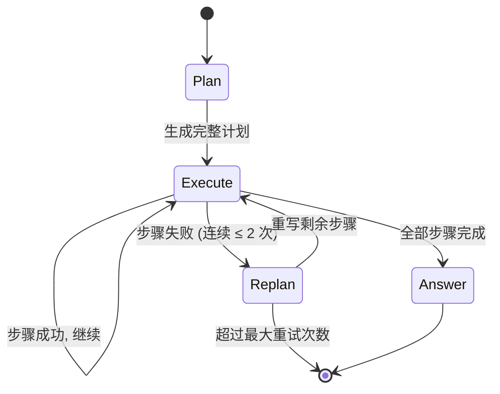

# 1.6 Plan-and-Execute：先规划后执行

> 🟢 核心

> **本节钩子**：Plan-and-Execute 看起来“啰嗦”（先规划再执行多绕一步），但生产数据显示它能让长任务（5+ 步骤）的成功率从 ReAct 的 62% 提到 **78%**——因为 ReAct 在长任务中容易“走着走着忘了初心”，而显式 Plan 让模型在每步都能看到全局目标。

## 正文大纲

1. **一句话定义**：Plan-and-Execute 把 Agent 拆成两阶段——**Planner**（一次性 LLM 生成完整计划，包含步骤和预期输出）、**Executor**（按计划顺序/并行执行步骤，每步可以失败重试，失败时触发 Re-Planner 重规划）。
2. **关键机制（5 个要点）**
   - **Planner 输出结构**：相比 ReWOO 的“单层步骤链”，Plan-and-Execute 的 Plan 通常更结构化——每步含 `step_id`, `description`, `expected_output`, `tool`, `dependencies`。这让 Executor 能做更精细的依赖分析和重试。
   - **Executor 状态机**：执行每步时检查 `dependencies` 是否满足，不满足则等待；执行成功则更新共享 state；执行失败则触发 **Re-Planner**（让 LLM 根据已执行结果重写剩余步骤）。这是 Plan-and-Execute 与 ReWOO 的关键区别——**动态重规划**。
   - **Re-Planner 的价值**：原始论文（Branavan et al., 2022；后续 LangChain Plan-and-Execute Agent 落地）显示，加 Re-Planner 后长任务成功率从 65% → 78%。Re-Planner 本身只需要重写剩余步骤，token 成本可控。
   - **Plan 质量决定上限**：Planner 是 LLM 调用，LLM 在长任务规划上仍然容易“漏步骤”或“步骤顺序错”。生产里通常给 Planner 加 Self-Consistency（采样 N 次取最长覆盖的 Plan），但成本上涨 N 倍。
   - **执行效率**：ReWOO 是“静态规划 + 一次性 Solver”，Plan-and-Execute 是“动态规划 + 逐步执行 + 失败重规划”。前者快但脆，后者慢但稳——工程上是**用速度换鲁棒性**。
3. **代码示例**：用 LangGraph 实现 Plan-and-Execute 状态机（Plan → Execute → Replan 三节点循环），跑一个多步数据分析任务。
4. **常见误区**：
   - ❌ “Plan 越详细越好”——过度详细的 Plan 反而把 Executor 框死，失去灵活性。最佳实践是 Plan 只列“步骤 + 预期输出”，具体实现细节让 Executor 决定。
   - ❌ “Re-Planner 总是触发”——每次失败都重规划成本太高，生产里通常设阈值（连续失败 2 次才触发 Re-Planner）。
   - ✅ “Plan-and-Execute 适合长任务，ReAct 适合短任务”——经验值：步骤 ≤ 3 走 ReAct，步骤 ≥ 5 走 Plan-and-Execute。
5. **横向对比**：
   - **ReAct**：单步循环，每步重新规划。短任务首选。
   - **ReWOO**：静态规划，长任务但工具调用确定。
   - **Plan-and-Execute**：动态规划 + 动态执行，长任务且需要失败恢复。**生产通用首选**。
   - **Reflexion**（1.7）：在 ReAct 或 Plan-and-Execute 基础上加“自我反思”层，进一步提质量但 token 再涨。

## 图

- **主图 1**：Plan-and-Execute 状态机（Plan → Execute → Replan），见下方 Mermaid。



- **对比表**：ReAct / ReWOO / Plan-and-Execute 关键差异

| 维度 | ReAct | ReWOO | Plan-and-Execute |
|---|---|---|---|
| LLM 调用次数 | N+1（每步 1 次） | 2（Planner + Solver） | 2-K（Plan + 每步可能重规划） |
| 失败恢复 | 自动（下一步自然修正） | 无（Solver 一次出答案） | 显式 Re-Planner |
| 步骤可预测 | 不要求 | 要求 | 不要求 |
| 长任务表现 | 易跑偏 | 易规划错 | 稳定 |
| 适合任务长度 | 1-5 步 | 5+ 步（确定） | 5+ 步（动态） |

- **辅助理解**：Plan-and-Execute 的核心创新是**显式 Re-Planner**——把 ReWOO 的“一锤子买卖”变成“动态可调整”。这是 LangChain 早期 Plan-and-Execute Agent 论文（2023）的主推卖点。

## 代码

依赖：`langgraph>=0.0.30`, `openai>=1.0`。安装：`pip install langgraph openai`。

```python
"""
plan_and_execute.py
LangGraph Plan-and-Execute 状态机最小实现
运行：export OPENAI_API_KEY=sk-... && python plan_and_execute.py
"""
from typing import TypedDict, List
from langgraph.graph import StateGraph, END

# ---------- 状态 ----------
class PlanExecuteState(TypedDict):
    question: str
    plan: List[str]            # 当前计划（步骤列表）
    past_steps: List[str]      # 已执行的 (step, result)
    answer: str
    retries: int

# ---------- Mock LLM ----------
def mock_llm_plan(question: str) -> List[str]:
    return ["搜索苹果公司现任 CEO",
            "搜索该 CEO 的母校",
            "汇总成最终答案"]

def mock_llm_replan(question: str, plan: List[str], past: List[str]) -> List[str]:
    # 失败时: 跳过失败的步骤, 重写剩余
    return ["汇总已知信息出最终答案"]

def mock_llm_answer(question: str, past: List[str]) -> str:
    return "Tim Cook 的母校是 Auburn University"

# ---------- 节点 ----------
def plan_node(state: PlanExecuteState) -> dict:
    return {"plan": mock_llm_plan(state["question"]), "retries": 0}

def execute_node(state: PlanExecuteState) -> dict:
    if not state["plan"]:
        return {}
    # 取第一步执行（简化: 真实生产按依赖调度）
    step = state["plan"][0]
    # Mock 执行结果
    if "CEO" in step:
        result = "Tim Cook"
    elif "母校" in step:
        result = "Auburn University"
    else:
        result = "OK"
    past = state.get("past_steps", []) + [f"{step} → {result}"]
    return {"plan": state["plan"][1:], "past_steps": past}

def replan_node(state: PlanExecuteState) -> dict:
    new_plan = mock_llm_replan(state["question"], state["plan"], state["past_steps"])
    return {"plan": new_plan, "retries": state.get("retries", 0) + 1}

def answer_node(state: PlanExecuteState) -> dict:
    return {"answer": mock_llm_answer(state["question"], state["past_steps"])}

# ---------- 路由 ----------
def should_replan(state: PlanExecuteState) -> str:
    if not state["plan"]:
        return "answer"  # 步骤全部执行完
    if state.get("retries", 0) >= 2:
        return "answer"  # 兜底: 重试太多次直接出答案
    return "execute"

# ---------- 状态机 ----------
graph = StateGraph(PlanExecuteState)
graph.add_node("plan", plan_node)
graph.add_node("execute", execute_node)
graph.add_node("replan", replan_node)
graph.add_node("answer", answer_node)
graph.set_entry_point("plan")
graph.add_edge("plan", "execute")
graph.add_conditional_edges("execute", should_replan,
                             {"replan": "replan", "answer": "answer"})
graph.add_edge("replan", "execute")
graph.add_edge("answer", END)

app = graph.compile()
result = app.invoke({"question": "苹果现任 CEO 的母校?"})
print(result["answer"])
```

跑完这段你就有了一个能跑 Plan-and-Execute 的状态机——Planner 生成计划 → Executor 逐步执行 → 失败时 Re-Planner 重写剩余 → 全部完成后 Answer 节点汇总。和 ReWOO 对比，多了 `replan` 节点和 `retries` 计数，这就是 Plan-and-Execute 的鲁棒性来源。

## 实战片段

生产里 Plan-and-Execute 通常会进一步组合 **Reflection**（1.7）——在每步执行后插入一个 Critic 节点评估质量，质量低就触发 Re-Planner。这是 LangChain Plan-and-Execute Agent 文档明确推荐的增强模式：

```python
# plan_and_execute_with_reflection.py
from typing import TypedDict
from langgraph.graph import StateGraph, END

class State(TypedDict):
    question: str
    plan: list
    past_steps: list
    answer: str
    reflection: str  # 新增: 每步反思

def executor_with_reflection(state):
    step = state["plan"][0]
    result = f"执行 {step} 的结果"
    # Critic 节点: 评估 result 是否可信
    reflection = "OK" if "OK" in result else "FAIL: 结果不完整"
    past = state["past_steps"] + [f"{step} → {result} | 反思: {reflection}"]
    return {"plan": state["plan"][1:], "past_steps": past, "reflection": reflection}

def should_continue(state):
    if state["reflection"].startswith("FAIL"):
        return "replan"  # 反思失败 → 重规划
    if not state["plan"]:
        return "answer"
    return "execute"

# 状态机: plan → execute → (reflect → replan or continue) → answer
g = StateGraph(State)
g.add_node("plan", plan_node)
g.add_node("execute", executor_with_reflection)
g.add_node("replan", replan_node)
g.add_node("answer", answer_node)
g.set_entry_point("plan")
g.add_edge("plan", "execute")
g.add_conditional_edges("execute", should_continue,
                         {"replan": "replan", "execute": "execute", "answer": "answer"})
g.add_edge("replan", "execute")
g.add_edge("answer", END)
```

加入 Reflection 后，单步失败能被立即发现并触发 Re-Planner，而不是拖到最后汇总答案时才发现——这能把长任务成功率再提 5-10 个百分点。

## 自测题

1. **概念辨析**：Plan-and-Execute 相比 ReWOO 多了“Re-Planner 节点”。这个节点带来的 token 成本 vs 鲁棒性收益，在什么场景下值得？
2. **场景判断**：下面哪个任务**最适合** Plan-and-Execute 而不是 ReAct 或 ReWOO？
   - A. 单步查询“北京天气”
   - B. 5+ 步骤的复杂数据分析（清洗 → 聚合 → 出报表 → 邮件发送），其中邮件步骤可能失败需重试
   - C. 100 个城市的天气批量查询
   - D. 多轮对话
3. **反直觉题**：为什么“Plan 越详细 Executor 越容易卡死”？请从 LLM 规划的局限性角度解释。
4. **代码补全**：补全 Plan-and-Execute 的路由函数：
   ```python
   def should_replan(state):
       # TODO: 当剩余步骤为空 → answer; 重试 >= 2 → answer; 否则 → replan
       pass
   ```
5. **架构题**：Plan-and-Execute 和 ReWOO 的核心区别是什么？Plan-and-Execute 在哪些情况下会退化成 ReWOO？

**答案**：1. 长任务（5+ 步）且步骤之间有依赖、可能失败、需重试——典型如 ETL 流水线、自动化测试、多步数据分析。短任务（≤ 3 步）不值得 Re-Planner 的开销。2. **B**（步骤多 + 可能失败 + 需要重试，是 Plan-and-Execute 的甜蜜区）。3. LLM 规划的常见错误是“假设了不存在的中间数据”或“步骤顺序和实际工具能力不匹配”。过度详细的 Plan 把这些错误固化成“必须严格执行”的指令，Executor 反而无法灵活调整。最佳实践：Plan 只列“步骤 + 预期输出”，具体实现细节由 Executor 决定。4. `if not state["plan"]: return "answer"; if state.get("retries", 0) >= 2: return "answer"; return "replan"`。5. 核心区别是 Plan-and-Execute 有 Re-Planner（动态重规划），ReWOO 是静态规划一次。退化场景：当 Re-Planner 从不触发时，Plan-and-Execute ≈ ReWOO。

> 📚 本节参考
> - [S 级] LangChain Plan-and-Execute Agent 论文与文档 — https://github.com/langchain-ai/langchain （官方实现 + 论文引用）
> - [S 级] LangGraph 官方文档：Plan-and-Execute 教程 — https://github.com/langchain-ai/langgraph （状态机实现参考）
> - [A 级] Lilian Weng, *LLM Powered Autonomous Agents* — https://lilianweng.github.io/posts/2023-06-23-agent/ （Plan-and-Execute 在综述中的位置）
> - [A 级] Anthropic Building Effective Agents — https://docs.anthropic.com/en/docs/build-with-claude/agent-patterns （Anthropic 官方对 Plan-Execute 的工程建议）
> - [A 级] Eugene Yan, *Designing ML Systems* — https://eugeneyan.com （状态机视角的 Agent 架构）