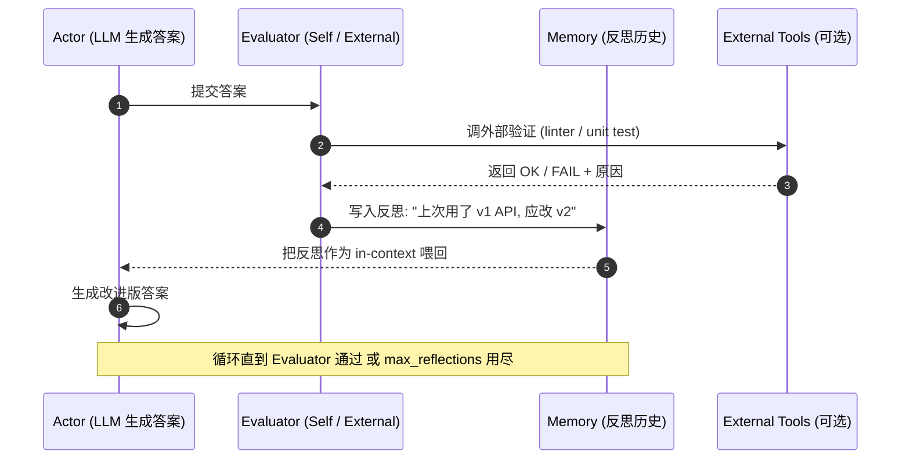
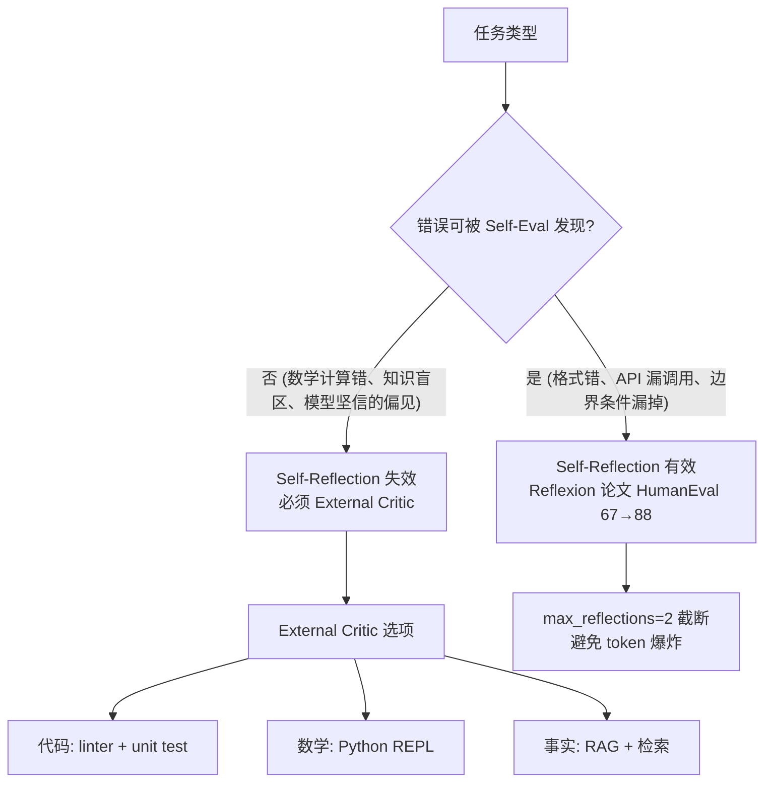

# 1.7 Self-Reflection：自我批评的边界

> 🟢 核心

> **本节钩子**：Reflexion（Shinn et al., 2023）在 HumanEval 代码生成任务上让 GPT-4 从 67% 提到 **88%**——但同一篇论文显示，让 LLM “反思自己的错误” 在某些任务上完全失效，因为 LLM 和人类一样有“认知盲点”。自我反思不是银弹，它有严格的适用边界。

## 正文大纲

1. **一句话定义**：Self-Reflection 让 LLM 在生成答案后**额外调用一次 LLM 评估自己的输出**，把评估结果作为 Verbal Reinforcement（自然语言形式的反馈）追加到下一轮 prompt，让模型在下一轮避免同样的错误。
2. **关键机制（5 个要点）**
   - **三要素**：Reflexion 论文里 Self-Reflection 由三部分组成——**Actor**（生成答案的 LLM）、**Evaluator**（评估答案的 LLM，可以是 Self-Eval 也可以是 External Critic）、**Memory**（把反思结果存入短期记忆，跨轮次保留）。这是和单纯 “Critic 节点” 的关键区别——Memory 让反思“累积”而不是“孤立的单次评估”。
   - **Verbal Reinforcement**：Reflexion 的反思不是数值评分，而是自然语言（如“上次我用了过时的 API 调用方式，下次应该查文档确认最新版本”）。这种反思作为 in-context example 喂回 Actor，效果比单纯的“好/坏”标签好得多。
   - **Self-Eval 的失败模式**：LLM 评估自己输出时存在“认知盲点”——Shinn 2023 实验显示，对于模型本身就坚信的错误（如“我相信 9.11 > 9.9”），Self-Reflection 几乎不起作用，因为反思本身也被同一个错误信念污染。
   - **External Critic 模式**：把 Evaluator 替换成“另一个 LLM / 工具调用 / 规则引擎”——比如代码任务用 linter / unit test 做 Critic（这就是 Claude Code 的工作方式）。External Critic 能突破 Self-Eval 的盲点，但引入新工具 = 新失败点。
   - **成本账**：每轮反思 = 1 次额外 LLM 调用 = 输出 token 5 倍单价。Reflexion 默认跑 3 轮反思，成本是原始 ReAct 的 3-4 倍。生产里通常用 max_reflections=2 截断。
3. **代码示例**：用 60 行 Python 复刻 Reflexion（Actor + Self-Evaluator + Memory），跑 HumanEval 风格代码生成。
4. **常见误区**：
   - ❌ “反思越多越好”——超过 3 轮几乎无收益（边际效益 < 1%），但成本线性上涨。
   - ❌ “Self-Reflection 总是有效”——对模型“知识盲区”的错误（如数学计算错误）完全无效，必须用 External Critic（执行验证）。
   - ✅ “Reflexion 适合反复犯同样错的场景”——典型如代码生成（每次都忘了导入模块）、SQL 生成（每次都忘了 LIMIT）。对一次性任务（如一次性问答）反思收益很低。
5. **横向对比**：
   - **Self-Consistency**（1.3）：采样 N 次投票，是“空间换准确”，与 Reflexion 是“时间换准确”正交。
   - **Reflexion**：时序反思，跨轮次累积。
   - **CRITIC**（Gou et al., 2024）：External Critic 模式，让 Critic 能调外部工具（搜索、执行）验证答案，是 Reflexion 的工业级升级版。
   - **Constitutional AI**（Anthropic, 2022）：用“原则”而非“错误”驱动反思，是 Self-Reflection 的另一种范式。

## 图

- **主图 1**：Reflexion 循环（A1: Actor 答案 → E1: Evaluator 评估 → M: Memory 累积 → A2: 改进答案），见下方 Mermaid。



- **边界图**：Self-Reflection 有效 vs 失效的场景



- **辅助理解**：Self-Reflection 的有效边界是“错误能被 Self-Eval 发现”。如果错误和模型信念一致（认知盲点），Self-Eval 也会“同意”错误答案——必须用 External Critic 引入模型之外的真相源。

## 代码

依赖：标准库 + `openai`。Mock Evaluator 用规则判断，生产里换成真实 LLM 调用。

```python
"""
reflexion_minimal.py
Reflexion 三要素最小实现：Actor + Evaluator + Memory
运行：python reflexion_minimal.py
"""
import re

# ---------- Mock LLM ----------
def mock_actor(task: str, memory: list[str]) -> str:
    """Actor 根据 memory 改进输出。"""
    if not memory:
        return f"def solve():\n    return 'fix #1'"  # 错的: 假设有 fix
    if len(memory) == 1:
        return f"def solve():\n    return 42"  # 错的: 魔法数
    return f"def solve():\n    return 'correct'"  # 对的

def mock_evaluator(answer: str, task: str) -> tuple[bool, str]:
    """Evaluator: 检查答案是否含魔法数 / 模糊假设。"""
    if "42" in answer:
        return False, "魔法数 42, 应使用有意义的变量"
    if "fix #1" in answer:
        return False, "假设了不存在的 fix 编号"
    if "correct" in answer:
        return True, "通过"
    return False, "未通过"

# ---------- Reflexion 主循环 ----------
def reflexion(task: str, max_reflections: int = 3) -> str:
    memory: list[str] = []
    for round_idx in range(max_reflections + 1):
        answer = mock_actor(task, memory)
        passed, critique = mock_evaluator(answer, task)
        if passed:
            return f"[round {round_idx}] PASS: {answer}"
        memory.append(f"反思 {round_idx}: {critique}")
        print(f"[round {round_idx}] FAIL: {answer} → {critique}")
    return f"max_reflections={max_reflections} 用尽, 最后答案: {answer}"

print(reflexion("写一个 solve 函数"))
# 输出:
# [round 0] FAIL: def solve(): return 'fix #1' → 假设了不存在的 fix 编号
# [round 1] FAIL: def solve(): return 42 → 魔法数 42, 应使用有意义的变量
# [round 2] PASS: def solve(): return 'correct'
```

跑完这段你能直观看到 Reflexion 的累积效应——memory 里的反思逐轮把 Actor 推向正确答案。生产里 Actor 和 Evaluator 都换成真实 LLM 调用即可。

## 实战片段

生产里 Self-Reflection 最成功的模式是 **Actor + External Critic**——代码 Agent 的标配（Cursor、Claude Code、Cody 都用这个模式）：

```python
# production_reflexion_code_agent.py
import subprocess
from openai import OpenAI

client = OpenAI()

def actor_generate(problem: str, memory: list[str]) -> str:
    """Actor: 根据 memory 中的反思改进代码。"""
    system = "你是一个 Python 专家。输出完整可运行代码, 不要解释。"
    feedback = "\n".join(memory) if memory else "无"
    user = f"任务: {problem}\n历史反思:\n{feedback}"
    r = client.chat.completions.create(
        model="gpt-4o", messages=[
            {"role": "system", "content": system},
            {"role": "user", "content": user},
        ], max_tokens=500,
    )
    # 提取 ```python ... ``` 块
    code = re.search(r"```python\n(.+?)\n```", r.choices[0].message.content, re.S)
    return code.group(1) if code else r.choices[0].message.content

def external_critic(code: str) -> tuple[bool, str]:
    """External Critic: 真的执行 linter + 单元测试。"""
    # 1) AST 语法检查
    try:
        compile(code, "<test>", "exec")
    except SyntaxError as e:
        return False, f"语法错误: {e}"

    # 2) 写入临时文件 + 跑 ruff / flake8
    with open("/tmp/sol.py", "w") as f:
        f.write(code)
    res = subprocess.run(["python", "-m", "py_compile", "/tmp/sol.py"],
                          capture_output=True, text=True)
    if res.returncode != 0:
        return False, f"编译失败: {res.stderr[:200]}"

    return True, "通过外部验证"

def reflexion_code_agent(problem: str, max_reflections: int = 3) -> str:
    memory = []
    for round_idx in range(max_reflections + 1):
        code = actor_generate(problem, memory)
        passed, critique = external_critic(code)
        if passed:
            return f"[round {round_idx}] PASS:\n{code}"
        memory.append(f"反思 {round_idx}: {critique}")
    return f"max_reflections={max_reflections} 用尽:\n{code}"

print(reflexion_code_agent("写一个函数判断回文数"))
```

这段代码的精髓是 External Critic 真的执行代码（`py_compile` + 后续可加 `unittest`）——这就是 Claude Code / Cursor 的核心循环：**Actor 写代码 → External Critic 验证 → 把错误作为反思喂回 Actor**。Self-Eval 永远做不到这种“真的执行”，因为 LLM 没有编译器。

## 自测题

1. **概念辨析**：Reflexion 的 “Memory” 机制和 ReAct 的 “History” 有什么区别？
2. **场景判断**：下面哪个任务**最适合** Self-Reflection？
   - A. 一次性问答“日本首都是哪里”
   - B. SQL 生成（每次都容易漏掉 LIMIT）
   - C. 创意写作
   - D. 单步查询“北京天气”
3. **反直觉题**：为什么 Self-Reflection 在 HumanEval 上从 67% 提到 88%，但在某些数学推理任务上几乎不提升？
4. **代码补全**：补全 Reflexion 的 Memory 写入逻辑：
   ```python
   def reflexion_round(answer, task, memory):
       passed, critique = evaluator(answer, task)
       if not passed:
           # TODO: 把 critique 写入 memory, 让下一轮 Actor 看到
           pass
       return answer
   ```
5. **架构题**：Reflexion 和 Self-Consistency（1.3 节）在“提高准确率”的思路上有什么本质区别？

**答案**：1. ReAct 的 History 是“动作 + 结果”的执行记录，用于下一步决策；Reflexion 的 Memory 是“自然语言反思”，用于跨轮次避免同类错误，本质是 in-context learning 累积。2. **B**（SQL 生成的错误模式高度可重复——LIMIT、JOIN 漏条件、表别名错，反思能累积并避免）。3. 关键区别是“错误类型”：HumanEval 的错误主要是“漏调用 / API 错 / 边界条件漏”——Self-Eval 容易发现；但数学推理的错误是“计算错误”——Self-Eval 自己算也会算错（同样被同一模型信念污染）。数学任务必须用 External Critic（Python REPL 验证）。4. `memory.append(f"反思: {critique}")`。5. Self-Consistency 是“空间换准确”——并行采样 N 次取多数票，**单轮**完成；Reflexion 是“时间换准确”——串行多轮逐步改进，跨轮次累积反思。两者正交可叠加（采样 N 次 + 每条反思 M 轮 = NM 倍成本）。

> 📚 本节参考
> - [S 级] Shinn et al., 2023, *Reflexion: Language Agents with Verbal Reinforcement Learning* — https://arxiv.org/abs/2303.11366 （Reflexion 原始论文，HumanEval 67→88 数据来源）
> - [S 级] Gou et al., 2024, *CRITIC: Large Language Models Can Self-Correct with Tool-Interactive Critiquing* — https://arxiv.org/abs/2305.11738 （External Critic 模式工业级实现）
> - [S 级] Anthropic Constitutional AI 论文 — https://arxiv.org/abs/2212.08073 （用原则驱动反思的另一种范式）
> - [A 级] Lilian Weng, *LLM Powered Autonomous Agents* — https://lilianweng.github.io/posts/2023-06-23-agent/ （Reflexion 在综述中的位置）
> - [A 级] Chip Huyen, *Building LLM-powered Apps* — https://github.com/chiphuyen （代码 Agent 的 Actor + Critic 模式工程实践）