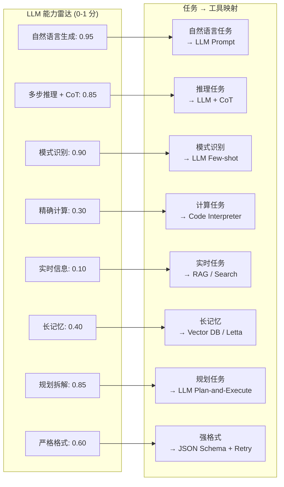
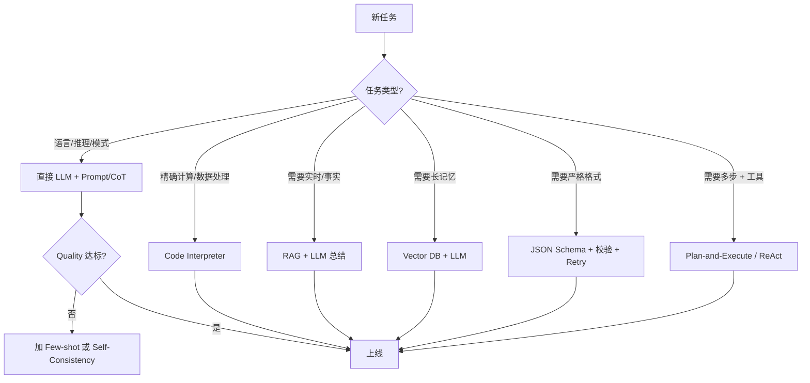

# 1.8 LLM 能力雷达：哪类任务交给 LLM，哪类不要

> 🟢 核心

> **本节钩子**：让 LLM 算 “1234567 × 8910111” 这种中等位数乘法，准确率大概只有 30%；但让它写一段 Python 代码再调工具算，准确率接近 100%。**80% “看起来应该 LLM 做”的任务实际用代码更稳定**——LLM 不是万能的，它有清晰的能力雷达边界。

## 正文大纲

1. **一句话定义**：LLM 能力雷达把 LLM 擅长的能力（自然语言、推理、规划、模式识别）和不擅长的能力（精确计算、实时信息、长记忆、严格格式）画成一张多维图，帮助 Agent 架构师决定“哪些环节交给 LLM，哪些环节交给专用工具”。
2. **关键机制（5 个要点）**
   - **强项区**（0.8+ 准确率）：自然语言生成（写文章、改写、翻译）、多步推理（CoT 触发的复杂任务）、模式识别（分类、抽取、情感）、规划（拆解任务）、代码生成（写代码片段）。
   - **弱项区**（< 0.5 准确率）：精确算术（多位乘法、大数运算）、实时信息（训练数据截止后的事件）、长记忆（超出上下文的细节）、严格格式（复杂 JSON、嵌套 schema）、多模态精确对齐（图像中数清人数）。
   - **决策矩阵**：任务 → 判断 LLM 强项还是弱项 → 强项走 Prompt / CoT → 弱项走专用工具（Code Interpreter、Search/RAG、Vector DB、Calculator）。这是 Anthropic、OpenAI 官方 Agent 设计文档反复强调的核心原则。
   - **反直觉案例**：① 排序“给我按销量排序这 100 个产品”——LLM 直接做准确率 < 50%，让它生成 sort 代码后执行准确率 100%；② 计算 “π 的第 100 位”——LLM 永远错，调 Python REPL 1 秒出答案；③ “列出 2024 年诺贝尔奖得主”——LLM 知识截止 2023 会幻觉，RAG 检索 + LLM 总结 100% 准确。
   - **能力雷达的动态性**：模型升级时雷达会扩大——GPT-3 不能做代码解释，GPT-4 + Claude 都内置 Code Interpreter；早期模型不能看图，GPT-4V / Claude 3 都能看图。架构决策需要按模型版本重新评估。
3. **代码示例**：用 6 个能力维度（自然语言 / 推理 / 规划 / 计算 / 实时 / 长记忆）打分，画雷达图。
4. **常见误区**：
   - ❌ “LLM 万能”——把多位数乘法、长记忆、强格式要求交给裸 LLM 是 99% 失败。
   - ❌ “工具越多越好”——每个工具都是新失败点。最小工具集 + 强 System Prompt 通常优于“大而全的工具库”。
   - ✅ “LLM + 工具 = 1 + 1 > 2”——LLM 的强项是“理解意图 + 编排工具”，专用工具的强项是“精确执行 + 实时数据”。组合后 Agent 能力远超单方。
5. **横向对比**：
   - **LLM only**：Prompt + CoT，适合 LLM 强项任务（写作、分类、推理）。
   - **LLM + Tools**：Tool Use 协议（Function Calling / Tool Use），适合需要外部数据的任务。
   - **LLM + RAG**：检索增强生成，适合需要事实/实时/私有知识的任务。
   - **LLM + Code Interpreter**：沙箱里执行代码，适合需要精确计算/数据处理的任务。
   - **Multi-Agent**：多 LLM 协作，适合需要多视角/多角色/复杂流水线。

## 图

- **主图 1**：LLM 能力雷达图（6 个维度）+ 任务-工具映射表



- **决策树**：新任务该交给 LLM 还是工具？



- **辅助理解**：能力雷达的“弱项区”恰好是工具的“强项区”——这是 LLM + Tools 范式的物理基础。架构师的本职工作是**判断任务落在雷达的哪一块**，再决定 LLM 自己干还是借工具。

## 代码

依赖：`matplotlib`（画雷达图），标准库。运行：`pip install matplotlib && python radar_chart.py`。

```python
"""
radar_chart.py
绘制 LLM 能力雷达图（6 个维度）
运行：python radar_chart.py
输出：llm_capability_radar.png
"""
import matplotlib.pyplot as plt
import numpy as np

# 6 个能力维度 + LLM vs Tool 的对比分数
dimensions = ["自然语言", "推理", "规划", "模式识别", "计算", "实时", "长记忆", "严格格式"]
llm_scores   = [0.95, 0.85, 0.85, 0.90, 0.30, 0.10, 0.40, 0.60]
tool_scores  = [0.10, 0.20, 0.30, 0.40, 1.00, 1.00, 1.00, 1.00]

# 计算角度
angles = np.linspace(0, 2 * np.pi, len(dimensions), endpoint=False).tolist()
llm_scores += llm_scores[:1]
tool_scores += tool_scores[:1]
angles += angles[:1]

# 画图
fig, ax = plt.subplots(figsize=(8, 8), subplot_kw=dict(polar=True))
ax.plot(angles, llm_scores, "o-", linewidth=2, label="LLM", color="#3b82f6")
ax.fill(angles, llm_scores, alpha=0.25, color="#3b82f6")
ax.plot(angles, tool_scores, "s-", linewidth=2, label="Tools", color="#ef4444")
ax.fill(angles, tool_scores, alpha=0.25, color="#ef4444")
ax.set_thetagrids(np.degrees(angles[:-1]), dimensions)
ax.set_ylim(0, 1)
ax.set_title("LLM vs Tools Capability Radar", pad=20)
ax.legend(loc="upper right", bbox_to_anchor=(1.3, 1.1))
ax.grid(True)
plt.tight_layout()
plt.savefig("llm_capability_radar.png", dpi=100, bbox_inches="tight")
print("Saved llm_capability_radar.png")
```

跑完你会看到一张典型的“互补型”雷达图——LLM 和 Tools 在不同维度上各占一极。**这就是为什么 Agent 范式（LLM + Tools）的天花板远高于纯 LLM**。

## 实战片段

生产里“任务 → 工具”的决策通常封装成一个 Router 节点。下面是一段 LangGraph 风格的 Router——根据任务关键词分配到不同处理链：

```python
# capability_router.py
from langgraph.graph import StateGraph, END
from typing import TypedDict, Literal

class State(TypedDict):
    task: str
    route: str
    result: str

def router_node(state: State) -> dict:
    """根据任务关键词判断走哪条处理链。"""
    t = state["task"]
    # 精确计算关键词
    if any(k in t for k in ["计算", "乘", "除", "求", "积分", "导数"]):
        return {"route": "calc"}
    # 实时信息关键词
    if any(k in t for k in ["今天", "最新", "现在", "2024", "2025", "新闻"]):
        return {"route": "rag"}
    # 强格式关键词
    if any(k in t for k in ["JSON", "yaml", "schema", "格式"]):
        return {"route": "structured"}
    # 多步工具调用
    if any(k in t for k in ["查", "然后", "接着", "再", "步骤"]):
        return {"route": "plan_execute"}
    # 默认 LLM 直接处理
    return {"route": "llm"}

def llm_node(state: State) -> dict:
    # 直接 LLM 处理（语言/推理/模式）
    return {"result": f"[LLM] {state['task']}"}

def calc_node(state: State) -> dict:
    # Code Interpreter
    return {"result": f"[Python REPL] 计算: {state['task']}"}

def rag_node(state: State) -> dict:
    # RAG 检索 + LLM 总结
    return {"result": f"[RAG] 检索+总结: {state['task']}"}

def structured_node(state: State) -> dict:
    # JSON Schema + Retry
    return {"result": f"[Structured] 强格式输出: {state['task']}"}

def plan_execute_node(state: State) -> dict:
    # Plan-and-Execute
    return {"result": f"[Plan-Execute] 多步: {state['task']}"}

# 编排
g = StateGraph(State)
g.add_node("router", router_node)
g.add_node("llm", llm_node)
g.add_node("calc", calc_node)
g.add_node("rag", rag_node)
g.add_node("structured", structured_node)
g.add_node("plan_execute", plan_execute_node)

g.set_entry_point("router")
g.add_conditional_edges("router", lambda s: s["route"],
                         {"llm": "llm", "calc": "calc", "rag": "rag",
                          "structured": "structured", "plan_execute": "plan_execute"})
for n in ["llm", "calc", "rag", "structured", "plan_execute"]:
    g.add_edge(n, END)

app = g.compile()
print(app.invoke({"task": "计算 1234567 × 8910111"})["result"])
# 输出: [Python REPL] 计算: 计算 1234567 × 8910111
print(app.invoke({"task": "今天上海天气"})["result"])
# 输出: [RAG] 检索+总结: 今天上海天气
```

这段 Router 把“任务 → 工具映射表”固化成可执行的状态机——架构师不再“凭感觉”决定每个任务走哪条路，而是由规则引擎自动分发。这是 LLM Agent 工程化的核心模式。

## 自测题

1. **概念辨析**：为什么“LLM + Tools”的能力天花板远高于纯 LLM？请用能力雷达的“互补性”解释。
2. **场景判断**：下面哪个任务**最适合**直接交给 LLM（不用工具）？
   - A. “计算 1234567 的平方根”
   - B. “把这段中文翻译成英文”
   - C. “2025 年欧冠冠军是谁”
   - D. “执行这段 Python 代码并返回结果”
3. **反直觉题**：LLM 在“写 Python 代码”任务上准确率 85%+，但在“算 1234567 × 8910111”上准确率 < 30%。为什么会这样？
4. **代码补全**：补全 Router 节点的判定逻辑：
   ```python
   def router_node(state):
       t = state["task"]
       # TODO: 当任务含 "积分" "求导" 关键词时返回 "calc" 路由, 否则 "llm"
       pass
   ```
5. **架构题**：能力雷达中“长记忆”维度 LLM 只有 0.4 分。生产里用什么工具补足？补 2-3 个具体方案。

**答案**：1. 雷达图显示 LLM 和 Tools 在不同维度上各占一极——LLM 强语言/推理/规划，Tools 强计算/实时/长记忆/格式。两者结合形成“全维度覆盖”，单方都有明显短板。2. **B**（翻译是 LLM 强项，纯 Prompt 即可；A/C/D 都需要工具）。3. LLM 是“下一个 token 预测器”——它的算术能力来自训练数据中的模式记忆，多位数乘法的进位链太长（>10 步推理），模式记忆命中率骤降。但“写代码”是 LLM 训练数据里最丰富的模式之一，训练充分 → 准确率高。Code Interpreter 实际上是把“算”这件事外包给 Python 解释器，绕开 LLM 的算术短板。4. `if any(k in t for k in ["积分", "求导", "平方根", "乘", "除"]): return {"route": "calc"}; return {"route": "llm"}`。5. Vector DB（pgvector / Milvus）+ 检索；Letta / MemGPT 的存储分层；Redis 短期缓存 + Postgres 长期持久化；以及 LangChain 的 `ConversationSummaryBufferMemory` 自动摘要历史。

> 📚 本节参考
> - [S 级] Anthropic, *Building Effective Agents* — https://docs.anthropic.com/en/docs/build-with-claude/agent-patterns （官方对“任务-工具映射”的工程建议）
> - [S 级] OpenAI Agents SDK 文档 — https://github.com/openai/openai-agents-python （轻量级 Router + Tool Use 参考实现）
> - [A 级] Lilian Weng, *LLM Powered Autonomous Agents* — https://lilianweng.github.io/posts/2023-06-23-agent/ （能力雷达的完整综述）
> - [A 级] Chip Huyen, *AI Engineering* — https://github.com/chiphuyen/ai-engineering （LLM + Tools 工程化）
> - [A 级] Eugene Yan, *Designing ML Systems* — https://eugeneyan.com （Agent 系统的能力边界设计）