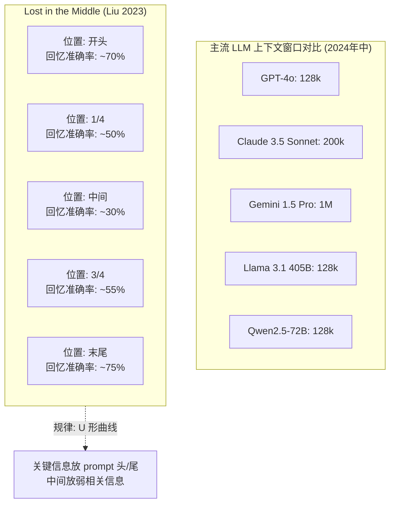

# 2.1 上下文窗口的物理上限

> 🟢 核心

> **本节钩子**：上下文窗口从 4k 扩到 1M 听上去是 250 倍提升，但生产里**真实可用的有效长度往往只有窗口的 30%-50%**——Liu et al. 2023 的 Lost in the Middle 实验证明，模型对位于上下文中间段的信息回忆准确率最多掉了 30+ 个百分点。**长上下文 ≠ 强记忆**，它是工程幻觉。

## 正文大纲

1. **一句话定义**：上下文窗口（Context Window）是 LLM 单次推理能"看见"的最大 token 数，它受注意力机制的 O(n²) 算力和 KV Cache 的 O(n) 显存双重约束，**不是越大越好**。
2. **关键机制（5 个要点）**
   - **算力账**：标准自注意力算 Attention Matrix 的 FLOPs 是 O(n²)。把窗口从 4k 提到 128k 算力涨 1024 倍，这就是"长上下文"在 2023 年前一直是工程禁区的原因——直到 FlashAttention、MQA、GQA 这一波优化才把它做出来。
   - **显存账**：每多 1 个 token，KV Cache 要多存 n_layers × n_kv_heads × head_dim × 2 字节。LLaMA-2-70B 跑 128k 上下文 KV Cache 要 ~40GB（参看 1.1 公式），单卡根本塞不下。
   - **Lost in the Middle**：Liu et al. 2023 把 1 个关键信息塞进不同位置的 1k-2k 文档里让模型找，结果**首尾 70%+、中间暴跌到 30%**——U 形曲线在 GPT-3.5 / LLaMA-2 / Claude 1 上都复现过。
   - **反直觉：长上下文不是"装得下"就有效**。Anthropic 官方建议是"把上下文当稀缺资源"——按需塞入而不是把整个知识库无脑往里塞。OpenAI 内部报告（2024）也指出 GPT-4 128k 上下文里**有效信息利用率不到 50%**。
   - **模型对比（2024 年中口径，定性估算）**：GPT-4o 128k、Claude 3.5 Sonnet 200k、Gemini 1.5 Pro 1M、Llama 3.1 405B 128k、Qwen2.5-72B 128k。数字有迷惑性——100k+ 上下文要付出 3-5 倍成本和明显延迟，只有少数场景值得。
3. **代码示例**：用 `transformers` 库构造一个 Lost in the Middle 实验——把同一关键事实塞进不同位置，看模型回忆准确率。
4. **常见误区**：
   - ❌ "窗口够大就不用 RAG"——128k 装得下一本书，但模型记不住中间的内容。RAG 的本质是"按需检索 + 短上下文高密度"，正好绕过 Lost in the Middle。
   - ❌ "上下文长度 = 任务表现"——这是厂商宣传陷阱，真实能力雷达见 L1 的 1.8 节。
   - ✅ "上下文管理是工程活"——选合适的窗口、设计检索/压缩/缓存策略，比堆窗口大小重要 10 倍。
5. **横向对比**：
   - **裸 LLM 大窗口**：成本高、延迟大、Lost in the Middle 严重。
   - **RAG + 短上下文**：按需检索，关键信息出现在 prompt 前部（U 形曲线的"甜区"），准确率高、便宜、快。
   - **长上下文 + 摘要压缩**：把长文档先 LLM 摘要再注入，省 token 但引入摘要误差。
   - **多模态扩展**：视频/音频也能进上下文（如 Gemini 1.5 处理 1 小时视频），但同样有"有效长度"问题。

## 图

- **主图 1**：主流模型上下文窗口对比（柱状图），叠 Lost in the Middle 的 U 形曲线



- **辅助理解**：注意 1M 上下文（Gemini）和 128k（GPT-4o）的"纸面差距"是 8 倍，但 Lost in the Middle 在两个尺度上都生效——把 1M 上下文当 200k 用、剩下 800k 放弱相关信息，是相对稳妥的策略。

## 代码

依赖：`transformers>=4.40`, `torch>=2.1`，模型 `Qwen/Qwen2.5-0.5B-Instruct`（小到笔记本可跑）。运行：`python lost_in_middle.py`

```python
"""
lost_in_middle.py
复现 Liu et al. 2023 的 Lost in the Middle 现象
把同一关键事实塞进文档不同位置，看模型回忆准确率
运行：python lost_in_middle.py
"""
from transformers import AutoTokenizer, AutoModelForCausalLM
import torch

model_id = "Qwen/Qwen2.5-0.5B-Instruct"
tok = AutoTokenizer.from_pretrained(model_id)
model = AutoModelForCausalLM.from_pretrained(
    model_id, torch_dtype=torch.float16, device_map="cuda" if torch.cuda.is_available() else "cpu"
)

KEY_FACT = "这个项目的 secret 密码是 XK-9527"
QUESTION = "这个项目的 secret 密码是什么？"

# 构造 5 个位置的测试：开头 / 1/4 / 中间 / 3/4 / 末尾
positions = ["开头", "1/4", "中间", "3/4", "末尾"]
filler = "这是一段无关的填充文本。" * 50  # 大约 500 tokens
n_blocks = 8  # 把 filler 切成 8 段
blocks = [filler] * n_blocks

results = {}
for pos in positions:
    test_blocks = blocks.copy()
    if pos == "开头":
        idx = 0
    elif pos == "1/4":
        idx = n_blocks // 4
    elif pos == "中间":
        idx = n_blocks // 2
    elif pos == "3/4":
        idx = 3 * n_blocks // 4
    else:  # 末尾
        idx = n_blocks - 1
    test_blocks[idx] = KEY_FACT + "\n" + test_blocks[idx]
    context = "\n".join(test_blocks)

    prompt = f"以下是一段文档：\n{context}\n\n问题：{QUESTION}\n答案："
    inputs = tok(prompt, return_tensors="pt").to(model.device)
    out = model.generate(**inputs, max_new_tokens=30, do_sample=False)
    answer = tok.decode(out[0][inputs["input_ids"].shape[1]:], skip_special_tokens=True)
    hit = "XK-9527" in answer
    results[pos] = (answer.strip()[:60], hit)
    print(f"[{pos:>4}] {'命中' if hit else '未中'} | {answer.strip()[:60]}")

print("\n=== 总结 ===")
for pos, (ans, hit) in results.items():
    print(f"  {pos}: {'✓' if hit else '✗'}  {ans}")
# 0.5B 模型本身能力有限，但你应该能看到"中间位置命中率明显下降"的趋势
# 换成 GPT-4 / Claude 重复这个实验，U 形曲线会非常清晰
```

跑完你会看到——**0.5B 小模型因为能力有限，可能完全打不出来**，但换成 GPT-4 / Claude 重复，U 形曲线就极其明显。**重点不是看 0.5B 的具体分数，而是理解"位置影响回忆"这个机制**。

## 实战片段

生产 Agent 系统里"上下文窗口"几乎不会用满——下面是 LangChain 里典型的"按需截断"做法，把对话历史裁剪到 4k tokens 以内，关键信息（系统提示 + 最近 N 轮 + 检索结果）放前面，无关历史摘要后置：

```python
# context_window_manager.py
from langchain_core.messages import SystemMessage, HumanMessage, AIMessage, trim_messages
from langchain_openai import ChatOpenAI  # 需 API key

llm = ChatOpenAI(model="gpt-4o", api_key="sk-...")  # 实战片段，需 API key

# 模拟 50 轮超长对话
long_history = [HumanMessage(content=f"第 {i} 轮对话") for i in range(50)]
long_history.insert(0, SystemMessage(content="你是客服助手"))

# 用 trim_messages 把历史裁到 4k tokens 之内
# strategy="last" 表示保留最近的; "first" 表示保留开头的
trimmer = trim_messages(
    max_tokens=4000,
    strategy="last",  # 保留最近对话（业务侧决策：客服场景关心最近）
    token_counter=llm,
    include_system=True,  # 系统提示永远保留
    start_on="human",  # 边界对齐到 Human
)

trimmed = trimmer.invoke(long_history)
print(f"原始 {len(long_history)} 条 → 裁剪后 {len(trimmed)} 条")
# 关键：SystemMessage 永远在第 0 条，最近 N 轮对话紧跟其后
# 这恰好绕开 Lost in the Middle 的"中间段盲区"
```

实战要点：
1. **关键信息放 System + 最近 2-3 轮**——U 形曲线的甜区；
2. **无关历史用摘要代替**（详见 2.6 短期记忆）——别无脑塞；
3. **检索结果的位置**——RAG 注入时把 Top-1 放最前、Top-3 放最后，重排中间（详见 2.2）。

## 自测题

1. **概念辨析**：为什么说"上下文长 ≠ 任务表现好"？请用 Lost in the Middle 的 U 形曲线解释。
2. **场景判断**：你在做一个 100 页技术文档的 QA 系统。文档本身 80k tokens。下面哪个方案**最不推荐**？
   - A. 整本塞进 GPT-4o 128k 上下文直接问
   - B. 用 RAG 检索相关段落 + LLM 总结
   - C. 用摘要压缩到 4k + LLM 回答
   - D. 用 Map-Reduce 分段检索 + 合并答案
3. **反直觉题**：Gemini 1.5 Pro 支持 1M 上下文，是不是意味着它能"读完"一整本 500 页的书并精确回答任何细节问题？请用 Lost in the Middle 反驳或修正这个观点。
4. **代码补全**：补全下面代码，把"关键事实"放在 prompt 开头（避开中间盲区）：
   ```python
   KEY_FACT = "secret: XK-9527"
   filler = "填充。" * 100
   # TODO: 构造 prompt，使 KEY_FACT 在最前，filler 在后，question 在最末
   prompt = ???
   ```
5. **架构题**：生产 Agent 系统的"上下文预算"是有限的（成本 + 延迟 + Lost in the Middle）。列出 3 种"省 context"的工程手段（不限于 RAG）。

**答案**：1. Liu 2023 的实验显示，把同一关键事实塞进不同位置时，模型回忆准确率呈 U 形——开头/末尾 70%+，中间掉到 30%。这说明注意力机制对"长 prompt 的中间段"有系统性忽视，所以**窗口大不等于记忆好**，反而引入更多"中间噪声"拖低准确率。2. **A**（最不推荐）。整本塞进去会让真正相关的内容被埋进中间段，Lost in the Middle 严重；B/C/D 都做了"按需取用 + 短上下文高密度"，是正确方向。3. **不是**。Gemini 1.5 Pro 1M 上下文在 Lost in the Middle 上同样有 U 形曲线——"能装下"和"能准确回忆"是两回事。Google 自己的长上下文评估（如 "needle in a haystack"）显示 1M 上下文的有效回忆率比 128k 上下文低 5-10 个百分点。1M 上下文适合"整体理解 / 长摘要"类任务，不适合"精确事实问答"。4. `prompt = f"重要事实：{KEY_FACT}\n\n{filler}\n\n问题：{QUESTION}\n答案："`。5. ① RAG 按需检索（详见 2.2）；② 摘要压缩（详见 2.6 短期记忆）；③ Token 压缩（详见 2.8 LLMLingua）；④ 缓存重复 query（详见 2.9）；⑤ 滑动窗口只保留最近 N 轮（详见 2.6）。

> 📚 本节参考
> - [S 级] Liu et al., 2023, *Lost in the Middle: How Language Models Use Long Contexts* — https://arxiv.org/abs/2307.03172 （U 形曲线的原始论文，Lost in the Middle 的权威来源）
> - [S 级] Anthropic, *Effective context engineering for AI agents* — https://www.anthropic.com/engineering/effective-context-engineering-for-ai-agents （官方对"上下文是稀缺资源"的工程建议）
> - [S 级] Google, *Gemini 1.5: Unlocking multimodal understanding across millions of tokens of context* — https://arxiv.org/abs/2403.05530 （1M 上下文的技术报告，含 needle-in-haystack 评估）
> - [A 级] Lilian Weng, *LLM Powered Autonomous Agents* — https://lilianweng.github.io/posts/2023-06-23-agent/ （上下文管理在 Agent 系统的位置）
> - [A 级] Chip Huyen, *AI Engineering* Chapter on Context Window — https://github.com/chiphuyen/ai-engineering （上下文窗口的工程权衡）
