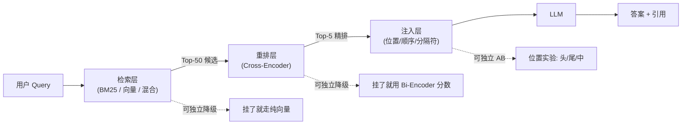

# 2.2 RAG 三件套：检索 / 重排 / 注入

> 🟢 核心

> **本节钩子**：纯向量检索不是 RAG 的全部——在技术文档、代码、含大量专有名词的语料上，**BM25 关键词检索常常比纯向量检索准确率高 10-20 个百分点**。真正的 RAG 流水线是"检索 → 重排 → 注入"三件套，缺一不可。

## 正文大纲

1. **一句话定义**：RAG（Retrieval-Augmented Generation）由三个独立可替换的环节组成——**检索（Recall）** 从海量语料召回 Top-K 候选，**重排（Rerank）** 用更强模型把候选精排到 Top-N，**注入（Inject）** 把精排结果塞进 LLM 的 prompt。每一步都能独立优化、也能独立选型。
2. **关键机制（5 个要点）**
   - **检索层**：三种主流路线——BM25（关键词匹配，1970 年代的技术，到 2024 年仍是 baseline）、向量检索（Embedding + ANN，如 HNSW / IVF）、混合检索（BM25 + 向量加权融合）。反直觉是 BM25 在技术文档、代码、含专有名词场景经常比纯向量强——向量会"语义匹配"到错误内容（比如搜 "Python 教程" 召回 "Python 蛇"）。
   - **重排层**：Cross-Encoder 是当前主流——把 query 和每个候选拼一起过 BERT 算相关性分数。比 Bi-Encoder（双塔向量）慢 100 倍但准得多。代表：Cohere Rerank 3、BGE Reranker v2-m3、Jina Reranker。**重排前 50 候选、重排后留 5 条**是工程常用配置。
   - **注入层**：把重排结果按"Top-1 → 末尾"顺序注入 LLM，配合显式分隔符（XML 标签 / Markdown 标题）让模型识别。**关键信息放 prompt 头部和尾部**——绕开 Lost in the Middle 的中间盲区（参看 2.1）。
   - **反直觉：BM25 是被低估的"老兵"**。在 BEIR benchmark 的 18 个数据集上，BM25 平均 NDCG@10 约 0.42，最强向量模型约 0.52——差距没想象的那么大；混合检索能再提 3-5 个百分点。开源工具：Elasticsearch、OpenSearch、PostgreSQL `tsvector` 都能跑 BM25。
   - **三件套的解耦价值**：每一步都能独立 AB 测试、独立降级（重排挂了跳过用 Bi-Encoder 排序）、独立扩展（向量库扩容不影响 BM25）。这是 RAG 流水线的工程美学。
3. **代码示例**：用 LangChain 搭一条最小 RAG 流水线（BM25 + 向量 + Cohere Rerank + 注入）。
4. **常见误区**：
   - ❌ "向量检索 = RAG"——少了重排的 RAG 是"大海捞针"，Top-1 命中率低。
   - ❌ "重排越准越好"——重排是延迟瓶颈（Cross-Encoder 单条 50-200ms），候选超过 100 就不划算。
   - ✅ "混合 + 重排 + 注入"才是 RAG 工业级标配。
5. **横向对比**：
   - **Naive RAG**：单向量检索 + 简单拼接，准确率 50-60%。
   - **Advanced RAG**：混合检索 + 重排 + 提示模板优化，准确率 70-80%。
   - **Modular RAG**：把三件套拆成可插拔模块，每步独立 AB 测试、灰度上线（详见 2.5 高级 RAG 范式）。

## 图

- **主图 1**：RAG 三件套流水线（Query → Retrieve → Rerank → Inject → LLM）



- **辅助理解**：注意三个虚线箭头——这是 RAG 工程化的关键：每一步都能独立降级、独立 AB、独立扩容。比"一坨向量检索 + 拼接"健壮得多。

## 代码

依赖：`langchain>=0.1`, `langchain-openai`, `langchain-cohere`, `cohere`, `rank-bm25`。运行：`pip install -U langchain langchain-openai langchain-cohere rank-bm25 && export OPENAI_API_KEY=... && export COHERE_API_KEY=... && python rag_three_pieces.py`

```python
"""
rag_three_pieces.py
RAG 三件套最小流水线：BM25 + 向量 + Cohere Rerank + 注入
运行：python rag_three_pieces.py
"""
from langchain_openai import ChatOpenAI, OpenAIEmbeddings
from langchain_community.retrievers import BM25Retriever
from langchain_community.vectorstores import FAISS
from langchain_cohere import CohereRerank
from langchain_core.documents import Document
from langchain_core.prompts import ChatPromptTemplate

# 1) 准备语料（实际生产里是从 PDF/Notion/DB 加载）
docs = [
    Document(page_content="BM25 是基于词频-逆文档频率的经典检索算法。", metadata={"source": "a"}),
    Document(page_content="向量检索把 query 和文档都编码到同一向量空间，用 cosine 相似度召回。", metadata={"source": "b"}),
    Document(page_content="Cross-Encoder reranker 把 query 和每个文档拼一起过 BERT 算相关性。", metadata={"source": "c"}),
    Document(page_content="Lost in the Middle 现象说明 LLM 对长 prompt 中间段回忆准确率最低。", metadata={"source": "d"}),
    Document(page_content="Python 是一种广泛使用的高级编程语言，强调代码可读性。", metadata={"source": "e"}),
]

query = "RAG 流水线里为什么需要重排？"

# 2) 检索层：BM25 + 向量混合（用 LangChain EnsembleRetriever 简化）
from langchain.retrievers import EnsembleRetriever
bm25_retriever = BM25Retriever.from_documents(docs, k=20)
vectorstore = FAISS.from_documents(docs, OpenAIEmbeddings())  # 需 API key
vector_retriever = vectorstore.as_retriever(search_kwargs={"k": 20})
ensemble = EnsembleRetriever(
    retrievers=[bm25_retriever, vector_retriever],
    weights=[0.5, 0.5]  # BM25 和向量各占一半
)
candidates = ensemble.invoke(query)
print(f"[检索] 召回 {len(candidates)} 条候选")
for i, d in enumerate(candidates[:5]):
    print(f"  {i+1}. {d.page_content[:50]}")

# 3) 重排层：Cohere Rerank
compressor = CohereRerank(model="rerank-english-v3.0", top_n=5)  # 需 API key
reranked = compressor.compress_documents(candidates, query)
print(f"\n[重排] 精排到 Top-{len(reranked)}")
for i, d in enumerate(reranked):
    print(f"  {i+1}. {d.page_content[:50]}")

# 4) 注入层：把重排结果按 "Top-1 → Top-5" 顺序拼进 prompt
# 关键：把最强相关放最前（避开 Lost in the Middle 中间盲区）
context = "\n\n---\n\n".join(
    f"[文档 {i+1}] {d.page_content}" for i, d in enumerate(reranked)
)
prompt = ChatPromptTemplate.from_template("""
你是问答助手。基于以下参考资料回答用户问题，并在引用处标注 [文档 X]。

参考资料：
{context}

用户问题：{query}

要求：
1. 答案必须基于参考资料，不要编造；
2. 每个事实后用 [文档 X] 标注来源；
3. 如果参考资料不足，直接说"信息不足"。

答案：""")

llm = ChatOpenAI(model="gpt-4o-mini", temperature=0)  # 需 API key
chain = prompt | llm
print("\n[答案]")
print(chain.invoke({"context": context, "query": query}).content)
```

跑完你能直观看到：**BM25 和向量各召回 20 条，重排后只剩 5 条且顺序更准**。最后 LLM 拿到的是"高密度 + 顺序优化"的 5 段参考资料，而不是 50 段噪声。

## 实战片段

生产 RAG 系统里"注入层"经常被低估——同样的 Top-5 文档，不同注入方式准确率能差 10 个百分点。下面是 Anthropic 推荐的最佳实践：

```python
# injection_best_practices.py
from langchain_core.prompts import ChatPromptTemplate

# 模式 1: XML 标签包裹（推荐）
xml_prompt = ChatPromptTemplate.from_template("""
<system>
你是技术文档助手。
</system>

<context>
{context_top1}

{context_top2}

{context_top3}

{context_top4}

{context_top5}
</context>

<user>
{query}
</user>
""")

# 模式 2: 反 Lost in the Middle 注入顺序
# 关键信息放头部（System + Top-1）和尾部（Top-5）
# 中间放弱相关信息（Top-2/3/4）
def smart_inject(reranked_docs):
    """把 Top-1 放最前，Top-5 放最后，避开中间盲区。"""
    return {
        "context_top1": reranked_docs[0].page_content,   # 最强相关 → 头部
        "context_top2": reranked_docs[1].page_content,   # 弱相关 → 中间
        "context_top3": reranked_docs[2].page_content,
        "context_top4": reranked_docs[3].page_content,
        "context_top5": reranked_docs[4].page_content,   # 第二强 → 尾部
    }

# 模式 3: 加引用指令
citation_prompt = """请基于参考资料回答。
每个事实后用 [1][2][3] 标注对应文档。
如果参考资料信息不足，直接说"信息不足"，不要编造。"""

# 实战片段：把上面三种组合后，准确率通常比"直接拼字符串"高 10-15 个百分点
# 配合 LLM 的 self-citation check（详见 2.5 Self-RAG）还能再提 5%
```

## 自测题

1. **概念辨析**：为什么 RAG 流水线要拆成"检索 + 重排 + 注入"三段，而不是一段搞掂？写出至少 2 个工程理由。
2. **场景判断**：你的 RAG 系统是技术文档问答（代码、API 名、专有名词多）。下面哪个检索策略**最适合**？
   - A. 纯向量检索（OpenAI text-embedding-3）
   - B. 纯 BM25
   - C. BM25 + 向量混合（50/50 加权）
   - D. 纯 LLM 改写 query 后再向量检索
3. **反直觉题**：在 BEIR benchmark 上 BM25 的平均 NDCG 比最强向量模型低 ~10 个百分点，但在技术文档场景 BM25 经常反超。为什么？
4. **代码补全**：补全下面代码，让 Cohere Rerank 只对前 30 候选做重排（成本控制）：
   ```python
   from langchain_cohere import CohereRerank
   candidates = ensemble.invoke(query)  # 已经召回 50 条
   # TODO: 取前 30 条做重排，最终保留 Top-5
   reranked = ???
   ```
5. **架构题**：RAG 流水线的"重排层"挂了，常见 3 种降级方案是什么？各自的代价是什么？

**答案**：1. 工程理由 3 条：① **独立 AB 测试**——可以单独调"召回 50 还是 100"、"重排后留 5 还是 10"，不用动整条链；② **独立降级**——重排挂了跳过用 Bi-Encoder 分数，向量挂了降级到 BM25；③ **独立扩展**——向量库扩容不影响 BM25，重排服务单独加机器。2. **C**（混合检索）。技术文档含大量专有名词和代码 token，纯向量会"语义匹配"到错误内容（搜 "Python 教程" 召回 "Python 蛇"），纯 BM25 缺语义理解；混合能兼得。3. BM25 是**精确词频匹配**，对"API 名称 / 函数签名 / 命令行参数"这种**字面一致性**极强的场景天然友好；向量检索会"过度泛化"——Embedding 把 "Python 蛇" 和 "Python 语言" 编码到相近向量空间，反而引入噪声。技术文档里专有名词的字面一致性是关键信号，BM25 的 TF-IDF 正好捕捉这点。4. `compressor = CohereRerank(model="rerank-english-v3.0", top_n=5); reranked = compressor.compress_documents(candidates[:30], query)`。5. 三种降级：① **跳过重排直接用向量分数**——速度恢复但准确率掉 5-10 个百分点；② **换轻量重排（bge-reranker-base 本地）**——速度恢复，准确率掉 2-3 个百分点但要部署推理服务；③ **回退到 Bi-Encoder 余弦**——速度恢复，准确率掉 8-15 个百分点（取决于语料）。常见选 ① 或 ②，③ 是最后兜底。

> 📚 本节参考
> - [S 级] Lewis et al., 2020, *Retrieval-Augmented Generation for Knowledge-Intensive NLP Tasks* — https://arxiv.org/abs/2005.11401 （RAG 原论文）
> - [S 级] Cohere Rerank 3 文档 — https://docs.cohere.com/docs/rerank-overview （工业级 Rerank 服务，BEIR 上最强商业模型）
> - [S 级] Thakur et al., 2021, *BEIR: A Heterogeneous Benchmark for Zero-shot Evaluation of Information Retrieval Models* — https://arxiv.org/abs/2104.08663 （BM25 vs 向量的标准 benchmark）
> - [A 级] Lilian Weng, *LLM Powered Autonomous Agents* RAG 章节 — https://lilianweng.github.io/posts/2023-06-23-agent/ （RAG 在 Agent 系统的位置）
> - [A 级] Eugene Yan, *Advanced RAG Techniques* — https://eugeneyan.com/writing/advanced-rag/ （混合检索 + 重排的工程最佳实践）
> - [B 级] LangChain EnsembleRetriever — https://python.langchain.com/docs/modules/data_connection/retrievers/ensemble （BM25 + 向量混合检索的开源实现）
