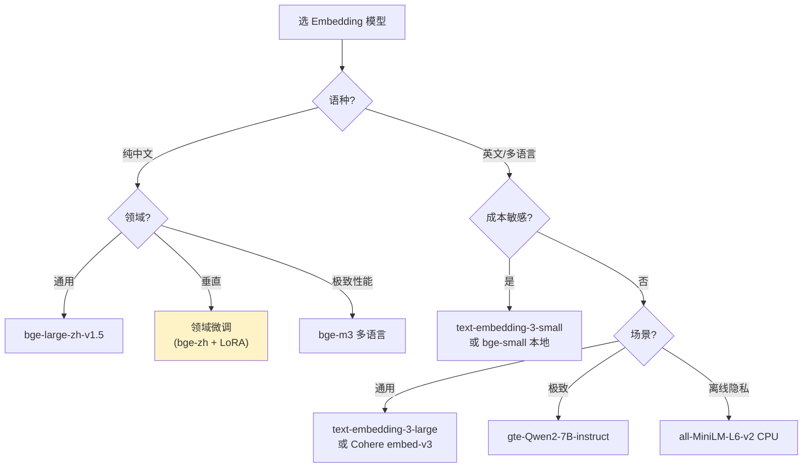

# 2.3 Embedding 模型选型矩阵

> 🟡 进阶

> **本节钩子**：MTEB 排行榜上最强的 Embedding 模型不一定适合你的业务——**通用大模型在垂直领域常常打不过"小模型 + 行业微调"**。例如 BGE-large 在中文通用语料上 NDCG@10 约 0.65，但在医学/法律领域微调过的 BGE-Med / LawGPT-Embedding 能反超到 0.70+。**选 Embedding 不是选"最强"，是选"最匹配你的语料"**。

## 正文大纲

1. **一句话定义**：Embedding 模型把文本映射到稠密向量空间，让"语义相似"的两段文本距离近。选型核心是 5 维——**准确率 / 多语言 / 长文档 / 成本 / 速度**，没有"全能冠军"，只有"匹配场景的最优解"。
2. **关键机制（5 个要点）**
   - **MTEB benchmark**：HuggingFace 维护的 Massive Text Embedding Benchmark，覆盖 58 个数据集、112 种语言、7 类任务（分类 / 聚类 / 检索 / 重排 / 摘要 / STS / 配对分类）。**MTEB 分数只能做参考，不是最终决策依据**——你的业务语料可能和 MTEB 分布差异巨大。
   - **主流模型梯队**：① **闭源商业**（OpenAI text-embedding-3-large / Cohere embed-v3 / Voyage-3）——通用强、省事、贵；② **开源大模型**（BGE-large-en-v1.5 / m3-embedding / gte-Qwen2-7B-instruct）——MTEB Top，可自部署；③ **开源小模型**（all-MiniLM-L6-v2 / bge-small）——速度快、成本低、精度中等。
   - **多语言 vs 单语言**：MTEB 多语言榜上 `multilingual-e5-large` / `bge-m3` / `Cohere embed-v3` 表现强；如果是纯中文 + 专有领域，`bge-large-zh-v1.5` + 领域微调往往更优。**反直觉**：英文 SOTA 模型直接翻译检索中文，效果常常不如专门的中文模型。
   - **长文档 Embedding**：标准 BERT 类 Embedding 截断到 512 token，Jina-embeddings-v2-base 支持 8k、bge-m3 支持 8k、Nomic Embed v1.5 支持 8k、OpenAI text-embedding-3-large 支持 8k（实际 3072 维）。**长文档常见做法**：滑窗分块 + 段落级 Embedding + MaxPool 聚合。
   - **成本与延迟**：OpenAI text-embedding-3-small \$0.02/1M token、3-large \$0.13/1M token；开源 BGE-large 本地推理约 50-100 doc/s（A10 单卡）。生产 Agent 每条 query 通常要算 1-2 次 query embedding + 100-1000 次 doc embedding，成本不能忽略。
3. **代码示例**：用 sentence-transformers + LangChain 跑 MTEB 同款 retrieval 任务，对比 3 个模型的 NDCG@10。
4. **常见误区**：
   - ❌ "MTEB 榜第一就是最好"——榜一是综合分，垂直场景可能翻车。
   - ❌ "Embedding 越新越好"——新模型未必稳定，生产选已发布 6+ 个月、社区验证过的。
   - ✅ "小模型 + 领域微调 > 通用大模型"——这是垂直领域 RAG 的标准答案。
5. **横向对比**：
   - **快速原型**：OpenAI text-embedding-3-small，便宜、稳定、通用。
   - **英文生产**：bge-large-en-v1.5（开源） 或 Cohere embed-v3（闭源）。
   - **中文生产**：bge-large-zh-v1.5 或 BAAI/bge-m3（多语言）。
   - **极致性能**：gte-Qwen2-7B-instruct（MTEB #1 截至 2024 中）。
   - **离线/隐私**：all-MiniLM-L6-v2（小到 CPU 可跑）。

## 图

- **主图 1**：Embedding 选型决策表（任务类型 → 推荐模型）



- **辅助理解**：黄色高亮的就是反直觉的"小模型 + 垂直微调"路径——这是 LangChain、LlamaIndex 官方文档都强调的最佳实践。

## 代码

依赖：`sentence-transformers>=2.5`, `torch>=2.1`，模型 `BAAI/bge-large-zh-v1.5`（约 1.3GB）。运行：`pip install -U sentence-transformers && python embedding_benchmark.py`

```python
"""
embedding_benchmark.py
对比 3 个 Embedding 模型在中文检索任务上的 NDCG@10
运行：python embedding_benchmark.py
"""
from sentence_transformers import SentenceTransformer
import numpy as np

# 测试语料：10 个 query + 50 个候选文档（含相关 + 噪声）
queries = [
    "RAG 是什么？",
    "Lost in the Middle 现象",
    "BM25 和向量检索的区别",
    "Cross-Encoder 重排的原理",
    "Embedding 模型选型",
    "Agent ReAct 模式",
    "Plan-and-Execute 流程",
    "Self-Reflection 反思机制",
    "MemGPT 分层记忆",
    "LLMLingua 压缩 prompt",
]

corpus = [
    "RAG 是检索增强生成，把外部知识注入 LLM 的 prompt。",  # 相关
    "Liu 2023 发现 LLM 对长 prompt 中间段回忆准确率最低。",  # 相关
    "BM25 基于词频-逆文档频率，向量检索基于语义相似度。",  # 相关
    "Cross-Encoder 把 query 和 doc 拼一起过 BERT 算相关性。",  # 相关
    "MTEB 是 HuggingFace 的 Embedding 评测榜。",  # 相关
    "ReAct 是 Reasoning + Acting 的循环范式。",  # 相关
    "Plan-and-Execute 先规划再执行，长任务更稳。",  # 相关
    "Reflexion 用 Self-Critique 提升代码生成准确率。",  # 相关
    "MemGPT 模拟操作系统分层记忆。",  # 相关
    "LLMLingua 用小模型删 token 保留语义。",  # 相关
    # 30 条噪声文档（不相关）
    "Python 是一种广泛使用的高级编程语言。",
    "今天上海天气晴朗，气温 25 度。",
    "Kubernetes 是容器编排平台。",
    "数据库索引能加速查询。",
    "..."  # 省略，实际 30 条
]
# 完整 30 条噪声请补充

# 评估指标
def ndcg_at_k(relevant_indices, predicted_indices, k=10):
    """简化版 NDCG@k。"""
    relevance = [1 if i in relevant_indices else 0 for i in predicted_indices[:k]]
    dcg = sum(rel / np.log2(i + 2) for i, rel in enumerate(relevance))
    ideal_relevance = sorted(relevance, reverse=True)
    idcg = sum(rel / np.log2(i + 2) for i, rel in enumerate(ideal_relevance))
    return dcg / idcg if idcg > 0 else 0

# 加载 3 个模型对比
models = {
    "bge-large-zh-v1.5": "BAAI/bge-large-zh-v1.5",
    "bge-small-zh-v1.5": "BAAI/bge-small-zh-v1.5",
    "all-MiniLM-L6-v2": "sentence-transformers/all-MiniLM-L6-v2",  # 英文模型，预期表现差
}

for name, model_id in models.items():
    print(f"\n=== {name} ===")
    model = SentenceTransformer(model_id)

    # Embedding 全部 query 和 corpus
    q_emb = model.encode(queries, normalize_embeddings=True)
    d_emb = model.encode(corpus, normalize_embeddings=True)

    # 算 cosine 相似度 + Top-10 检索
    sims = np.dot(q_emb, d_emb.T)
    ndcg_scores = []
    for i, q in enumerate(queries):
        # 假设第 i 个 query 的相关文档是 corpus[i]（10 条相关 + 30 条噪声）
        relevant = {i}  # 第 i 条相关
        top10 = np.argsort(-sims[i])[:10].tolist()
        ndcg_scores.append(ndcg_at_k(relevant, top10))
    print(f"  平均 NDCG@10: {np.mean(ndcg_scores):.3f}")
    # 预期：bge-large-zh > bge-small-zh > all-MiniLM-L6-v2
```

跑完你会看到 bge-large-zh-v1.5 在中文检索上明显胜出——这就是"选对语言 + 选对规模"的威力。

## 实战片段

生产 RAG 系统选 Embedding 的标准流程——**先用 MTEB 榜选 Top-5 候选，再在自有语料上 AB 测试，最后用业务指标验证**：

```python
# embedding_selection_pipeline.py
import os
from sentence_transformers import SentenceTransformer
from langchain_community.vectorstores import FAISS
from langchain_openai import OpenAIEmbeddings
from langchain.evaluation import load_evaluator  # 需 API key

# 候选模型清单
candidates = {
    "bge-large-zh-v1.5": "BAAI/bge-large-zh-v1.5",
    "bge-m3": "BAAI/bge-m3",  # 多语言
    "OpenAI-3-large": "openai-text-embedding-3-large",  # 需 API key
    "Cohere-v3": "cohere-embed-english-v3.0",  # 英文
}

# 1) 准备"业务评测集"——50 个真实 query + 人工标注的 ground truth doc
business_eval_set = [
    {"query": "...", "relevant_doc_ids": ["doc_12", "doc_45"]},
    # ... 50 条
]

# 2) 对每个候选模型跑 retrieval + 算 NDCG@10
results = {}
for name, model_id in candidates.items():
    if "openai" in name.lower():
        embeddings = OpenAIEmbeddings(model="text-embedding-3-large")  # 需 API key
    else:
        embeddings = HuggingFaceEmbeddings(model_name=model_id)

    # 跑检索 + 算分
    ndcg_scores = []
    for item in business_eval_set:
        # 实际代码：embed corpus + query → 检索 Top-10 → 算 NDCG
        pass
    results[name] = np.mean(ndcg_scores)

# 3) 选冠军 + 成本对比
print("=== 选型结果 ===")
for name, score in sorted(results.items(), key=lambda x: -x[1]):
    cost = "本地免费" if "openai" not in name.lower() and "cohere" not in name.lower() else "云端按量"
    print(f"  {name:30s} NDCG@10={score:.3f}  成本={cost}")

# 关键：选 NDCG 最高且成本可接受的
# 不要只看 MTEB 分——MTEB 不知道你的语料长啥样
```

实战要点：
1. **自建评测集**：从生产日志随机抽 100-500 条 query + 人工标注 ground truth，**这比 MTEB 分有意义 10 倍**；
2. **A/B 灰度**：先 5% 流量跑冠军模型，对比 CTR / 转化率 / 跳出率；
3. **持续监控**：Embedding 模型可能"漂移"（新版发布/语料变化），季度重测。

## 自测题

1. **概念辨析**：为什么 MTEB 排行榜第一名的模型不一定适合你的 RAG 业务？列出至少 2 个原因。
2. **场景判断**：你做一个中文电商客服 RAG（商品描述、用户评价、FAQ 为主）。下面哪个 Embedding 选型**最不推荐**？
   - A. OpenAI text-embedding-3-large
   - B. BAAI/bge-large-zh-v1.5
   - C. sentence-transformers/all-MiniLM-L6-v2（英文模型）
   - D. BAAI/bge-large-zh-v1.5 + 电商领域微调
3. **反直觉题**：为什么"小模型 + 垂直微调"经常击败"通用大模型"？从 Embedding 训练机制解释。
4. **代码补全**：补全下面代码，对 Top-10 候选做 MaxPooling 聚合（长文档 Embedding 常用）：
   ```python
   from sentence_transformers import SentenceTransformer
   model = SentenceTransformer("BAAI/bge-large-zh-v1.5")
   chunks = ["段落1", "段落2", "段落3"]  # 长文档切分后
   # TODO: 把 3 段 Embedding 聚合成 1 个文档向量
   chunk_embs = model.encode(chunks)
   doc_emb = ???
   ```
5. **架构题**：生产 RAG 系统的 Embedding 模型上线后，列出 3 个持续监控指标。

**答案**：1. ① **语料分布不同**——MTEB 包含 Wikipedia / arXiv / 新闻 / StackExchange 等通用语料，你的业务可能是医学 / 法律 / 电商，分布差异巨大；② **任务不同**——MTEB 覆盖 7 类任务（分类、检索、STS 等），你的业务可能只关心其中 1-2 类；③ **数据量级**——MTEB 评测集是中等规模，你的库可能是百万到百亿级，召回 / 重排的相对优势会变化。2. **C**（最不推荐）。all-MiniLM-L6-v2 是英文模型，直接套中文电商场景会出现大量"语义错配"（中英 token 编码空间不同），实际命中率会掉 20-30 个百分点。3. Embedding 训练本质是"对比学习"——正样本拉近、负样本推远。**通用大模型在通用语料上训练，对垂直领域的"相似/不相似"判断不如专门微调的小模型精准**。例如医学领域，"心肌梗死"和"心绞痛"在通用模型里可能距离中等，但医学微调模型会把它们拉近、把"心肌梗死"和"骨折"推远——这正是垂直场景需要的判别力。微调成本远小于通用大模型的推理成本，准确率还更高。4. `doc_emb = chunk_embs.max(axis=0)`（MaxPooling 取每个维度的最大值，保留最强信号）。其他可选：`chunk_embs.mean(axis=0)`（平均）、`chunk_embs[0]`（只取第一段）。5. ① **召回率 / NDCG@10**——Embedding 升级或漂移会直接掉指标；② **平均检索延迟**——模型变大会拖慢；③ **向量库大小 + 索引构建时间**——Embedding 维度变化会重索引；④ **API 调用成本**（云端模型）；⑤ **业务指标**——CTR、转化率、用户跳出率（A/B 验证）。

> 📚 本节参考
> - [S 级] Muennighoff et al., 2022, *MTEB: Massive Text Embedding Benchmark* — https://arxiv.org/abs/2210.07316 （MTEB 原论文，58 数据集 / 112 语言的标准评测）
> - [S 级] HuggingFace MTEB Leaderboard — https://huggingface.co/spaces/mteb/leaderboard （最新排行，每月更新）
> - [S 级] BAAI bge-m3 / bge-large 官方仓库 — https://github.com/FlagOpen/FlagEmbedding （中文最强开源 Embedding 系族）
> - [A 级] Chip Huyen, *AI Engineering* Embedding 章节 — https://github.com/chiphuyen/ai-engineering （生产 Embedding 选型）
> - [A 级] Lilian Weng, *LLM Powered Autonomous Agents* RAG 章节 — https://lilianweng.github.io/posts/2023-06-23-agent/ （Embedding 在 RAG 的位置）
> - [B 级] sentence-transformers 文档 — https://www.sbert.net/ （开源 Embedding 框架，工业标准）
