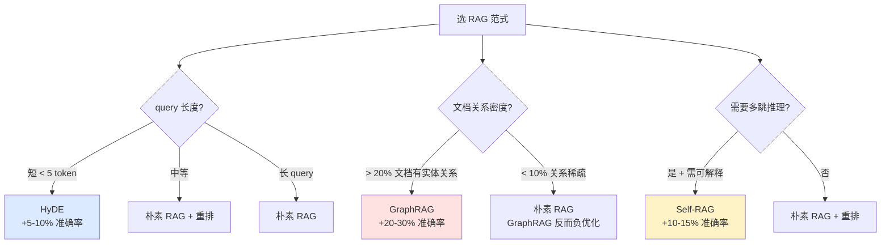

# 2.5 高级 RAG：HyDE / Self-RAG / GraphRAG

> 🔴 专家

> **本节钩子**：GraphRAG 不是 RAG 的"银弹"——**关系密度低时（< 10% 文档含实体关系），GraphRAG 准确率反而比向量 RAG 低 5-10 个百分点**。Microsoft 自己的论文承认 GraphRAG 在"实体关系稀疏"的场景下是负优化。**高级 RAG 范式不是"越高级越好"，是"匹配数据特征"**。

## 正文大纲

1. **一句话定义**：高级 RAG 是 2023-2024 年涌现的 3 种"对朴素 RAG 的根本性改造"——**HyDE**（假设答案检索）、**Self-RAG**（LLM 自评检索）、**GraphRAG**（实体关系图谱）。三者适用场景差异巨大，不能混用。
2. **关键机制（5 个要点）**
   - **HyDE（Hypothetical Document Embeddings, Gao et al. 2022）**：核心是"LLM 生成假设答案 → 用假设答案检索真实文档"。query 和 doc 的 Embedding 空间存在"语言鸿沟"——用户问"怎么退款"和文档"退款流程"距离远，但假设答案"要退款请按以下步骤..."就和真实文档同空间。**反直觉**：HyDE 对**短 query**（< 5 token）效果最明显，长 query 反而下降。
   - **Self-RAG（Asai et al. 2023, ICLR 2024）**：LLM 生成"反思 token"——`[Retrieve]` / `[IsRel]` / `[IsSup]` / `[IsUse]`，每步自评"要不要检索 / 文档相关吗 / 答案有依据吗 / 答案有用吗"。**反直觉**：训练成本极高（100K+ 标注），中小团队用 LangChain `SelfQueryRetriever` 或 LlamaIndex `Self-RAG` 包装即可。
   - **GraphRAG（Edge et al., Microsoft 2024）**：把语料切成实体关系图谱，LLM 提取 → Leiden 社区检测 → 检索时返回"实体 + 邻居 + 社区摘要"。**杀手场景**：跨文档关系查询（"公司 A 的竞争对手都投资了哪些赛道"），向量 RAG 完全做不了。**反直觉**：关系稀疏时（FAQ / 短文档）GraphRAG 拖慢 3-5 倍，因为建图本身要 5-10 次 LLM。
   - **三范式对比**：
     - **朴素 RAG**：向量检索 + 拼接。**适用**：通用文档、QA。**成本**：低。**准确率**：基线。
     - **HyDE**：假设答案检索。**适用**：短 query、技术文档。**成本**：中。**准确率**：+5-10%。
     - **Self-RAG**：LLM 自评检索。**适用**：需可解释、多跳。**成本**：高。**准确率**：+10-15%。
     - **GraphRAG**：实体关系图谱。**适用**：跨文档关系。**成本**：极高。**准确率**：密集 +20-30%，稀疏 -5-10%。
3. **代码示例**：用 LangChain 跑 HyDE（最易实现）+ LangGraph 跑 Self-RAG 简化版。
4. **常见误区**：
   - ❌ "GraphRAG = 高级 RAG"——GraphRAG 是 3 种范式之一，不是"最高级"。**80% 业务用朴素 RAG + 重排就够了**。
   - ❌ "HyDE 万能"——对"开放域闲聊"类 query 有副作用（假设答案可能离题）。
   - ✅ "匹配数据特征 + 匹配预算"——选范式前先做 100 条 query 的数据特征分析。
5. **横向对比**：
   - **朴素 RAG**：通用、便宜、基线。
   - **HyDE**：短 query 友好、中等成本、+5-10% 准确率。
   - **Self-RAG**：复杂多跳、需包装、高成本、+10-15% 准确率。
   - **GraphRAG**：跨文档关系、极高成本、稀疏时负优化。

## 图

- **主图 1**：3 种高级 RAG 范式对比表（适用场景 / 成本 / 准确率）



- **辅助理解**：蓝色是"短 query 用 HyDE"，红色是"关系密集才上 GraphRAG"，黄色是"复杂推理用 Self-RAG"。3 个高级范式不互斥——生产里"HyDE + 重排"可组合，但成本会爆炸。

## 代码

依赖：`langchain>=0.1`, `langchain-openai`, `langchain-community`。运行：`pip install -U langchain langchain-openai && export OPENAI_API_KEY=... && python hyde_demo.py`

```python
"""
hyde_demo.py
HyDE（Hypothetical Document Embeddings）实现
运行：python hyde_demo.py
"""
from langchain_openai import ChatOpenAI, OpenAIEmbeddings
from langchain_community.vectorstores import FAISS
from langchain_core.prompts import ChatPromptTemplate
from langchain_core.documents import Document

# 1) 准备语料
docs = [
    Document(page_content="退款流程：用户提交申请 → 审核 1-3 个工作日 → 原路退回。"),
    Document(page_content="换货政策：收到货 7 天内可申请，需保持商品完好。"),
    Document(page_content="发票申请：订单完成后可在『我的订单』页面自助开具。"),
    Document(page_content="会员积分：消费 1 元 = 1 积分，100 积分 = 1 元。"),
    Document(page_content="优惠券使用：下单时勾选可用券，自动扣减。"),
]
vectorstore = FAISS.from_documents(docs, OpenAIEmbeddings())  # 需 API key

# 2) 朴素 RAG（对照）
def naive_rag(query, k=2):
    return vectorstore.similarity_search(query, k=k)

# 3) HyDE：先 LLM 生成假设答案 → 用假设答案检索
def hyde_rag(query, k=2):
    llm = ChatOpenAI(model="gpt-4o-mini", temperature=0)  # 需 API key
    # 关键 prompt：让 LLM 生成"假设答案"（不基于任何上下文）
    hyde_prompt = ChatPromptTemplate.from_template("""
请根据以下问题，生成一段假设性的答案（不需要真实存在，作为检索锚点用）。
问题：{query}
假设答案：""")
    hypothetical = llm.invoke(hyde_prompt.format_messages(query=query)).content
    print(f"  [HyDE 假设答案] {hypothetical[:80]}...")
    # 用假设答案去检索真实文档
    return vectorstore.similarity_search(hypothetical, k=k)

# 4) 对比实验
test_queries = [
    "怎么退钱",  # 短 query，HyDE 应该明显
    "如何申请退款？",  # 中等 query
    "我想了解退款流程的详细步骤，包括审核时间和到账方式。",  # 长 query
]
for q in test_queries:
    print(f"\n=== Query: {q} ===")
    naive = naive_rag(q)
    print(f"  [朴素 RAG] {naive[0].page_content[:50]}")
    hyde = hyde_rag(q)
    print(f"  [HyDE]    {hyde[0].page_content[:50]}")
# 预期：短 query 上 HyDE 命中率明显更高；长 query 上差异不大
```

跑完你会看到——**"怎么退钱"上 HyDE 几乎必然命中"退款流程"，而朴素 RAG 可能命中"会员积分"**（向量空间里"钱"和"积分"很近）。这是 HyDE 的核心价值。

## 实战片段

Self-RAG 通常用 LlamaIndex 的 `CorrectiveRAG` 或 LangGraph 的自评循环实现——下面是 LangGraph 的简化版：

```python
# self_rag_langgraph.py
from typing import TypedDict, Literal
from langgraph.graph import StateGraph, END
from langchain_openai import ChatOpenAI, OpenAIEmbeddings
from langchain_community.vectorstores import FAISS

class RAGState(TypedDict):
    query: str
    retrieved_docs: list
    is_relevant: bool
    answer: str

def retrieve_node(state: RAGState) -> dict:
    docs = vectorstore.similarity_search(state["query"], k=5)  # 需 API key
    return {"retrieved_docs": docs}

def self_eval_node(state: RAGState) -> dict:
    llm = ChatOpenAI(model="gpt-4o-mini", temperature=0)  # 需 API key
    context = "\n".join(d.page_content for d in state["retrieved_docs"])
    eval_prompt = f"基于以下参考资料，评估是否能回答：{state['query']}\n资料：{context}\n回答 YES 或 NO："
    return {"is_relevant": "YES" in llm.invoke(eval_prompt).content}

def generate_node(state: RAGState) -> dict:
    llm = ChatOpenAI(model="gpt-4o-mini", temperature=0)  # 需 API key
    context = "\n".join(d.page_content for d in state["retrieved_docs"])
    prompt = f"基于以下资料回答：{state['query']}\n\n资料：{context}\n\n答案："
    return {"answer": llm.invoke(prompt).content}

g = StateGraph(RAGState)
g.add_node("retrieve", retrieve_node)
g.add_node("self_eval", self_eval_node)
g.add_node("generate", generate_node)
g.add_node("rewrite_query", lambda s: {"query": s["query"] + " 详细步骤"})

g.set_entry_point("retrieve")
g.add_edge("retrieve", "self_eval")
g.add_conditional_edges("self_eval",
    lambda s: "generate" if s["is_relevant"] else "rewrite_query",
    {"generate": "generate", "rewrite_query": "rewrite_query"})
g.add_edge("rewrite_query", "retrieve")  # 改写后重试
g.add_edge("generate", END)

app = g.compile()
print(app.invoke({"query": "怎么退钱"})["answer"])
```

实战要点：
1. **自评 prompt 要"狠"**——让 LLM 倾向 NO，宁可改写 query 重试也别强行回答（降低幻觉）；
2. **最多重试 2 次**——避免无限循环；
3. **生产用 LangGraph 的 `CorrectiveRAG` 模板**——上面是简化版，工业级要加日志、metrics、降级。

## 自测题

1. **概念辨析**：HyDE 为什么对"短 query"效果最明显？用"query-doc 语言鸿沟"解释。
2. **场景判断**：你的语料是 10 万条 FAQ（每条 50-200 字，实体关系稀疏）。下面哪个高级 RAG 范式**最不推荐**？
   - A. 朴素 RAG + 重排
   - B. HyDE
   - C. Self-RAG
   - D. GraphRAG
3. **反直觉题**：Microsoft 自己的 GraphRAG 论文承认"关系稀疏时 GraphRAG 是负优化"。为什么？列出至少 2 个原因。
4. **代码补全**：补全 HyDE 的关键 prompt：
   ```python
   hyde_prompt = """请根据问题生成一段假设性答案（不需要真实存在）：
   问题：{query}
   ???"""  # TODO: 写 prompt 指令
   ```
5. **架构题**：Self-RAG 的"自评 token"机制有什么训练上的挑战？为什么中小团队通常不自己训练 Self-RAG？

**答案**：1. **短 query 缺乏上下文**——"怎么退钱"只 3 个 token，向量编码后语义信息稀薄，和真实文档"退款流程：用户提交申请..."距离远。HyDE 让 LLM 生成的"假设答案"形态像真实文档，Embedding 空间对齐，检索命中率提高。长 query 已够"doc-like"，HyDE 增益小。2. **D**（最不推荐）。GraphRAG 在关系稀疏下负优化（Microsoft 论文承认），且建图成本极高（10 万 FAQ × 5 次 LLM 调用 = 50 万次 API）。B（HyDE）反适合短 query，是推荐选项。3. 两个原因：① **建图无收益**——关系稀疏时 GraphRAG 提取的实体-关系边很少，跨文档关系查询用不上，相当于白花 5-10 次 LLM 调用建图；② **检索路径绕远**——向量 RAG 直接语义匹配，GraphRAG 要定位实体 → 走图遍历 → 聚合社区摘要，稀疏时图遍历两步就"断路"，拖慢 3-5 倍。4. `假设答案：""` 前加："请生成 100-200 字的假设性答案，作为后续向量检索的锚点。不要说'我不知道'，要生成最可能的答案。问题：{query}\n假设答案："。关键点：① **强制生成**否则 LLM 倾向拒绝；② **长度指导**让假设答案和真实文档形态对齐。5. 训练挑战：① **标注数据**——Self-RAG 需 100K+ 标注样本，每条标 4 个反思 token，人工成本极高；② **训练算力**——7B-13B 模型 RLHF 需 8+ 张 A100 跑 3-5 天；③ **标注一致性**——反思 token 标注意见分歧大。中小团队用 LangGraph `CorrectiveRAG` 包装（基于 GPT-4 in-context），不自己训练。

> 📚 本节参考
> - [S 级] Gao et al., 2022, *Precise Zero-Shot Dense Retrieval without Relevance Labels* (HyDE) — https://arxiv.org/abs/2212.10496 （HyDE 原论文）
> - [S 级] Asai et al., 2023, *Self-RAG: Learning to Retrieve, Generate, and Critique through Self-Reflection* — https://arxiv.org/abs/2310.11511 （Self-RAG 原论文，ICLR 2024）
> - [S 级] Edge et al., 2024, *From Local to Global: A Graph RAG Approach to Query-Focused Summarization* (Microsoft GraphRAG) — https://arxiv.org/abs/2404.16130 （GraphRAG 原论文，Microsoft 官方）
> - [A 级] Lilian Weng, *LLM Powered Autonomous Agents* RAG 章节 — https://lilianweng.github.io/posts/2023-06-23-agent/ （RAG 范式综述）
> - [A 级] Eugene Yan, *Advanced RAG Techniques* — https://eugeneyan.com/writing/advanced-rag/ （HyDE / Self-RAG / GraphRAG 工程对比）
> - [B 级] LangGraph CorrectiveRAG 模板 — https://langchain-ai.github.io/langgraph/examples/rag/langgraph_crag.html （Self-RAG 的工业级实现参考）
