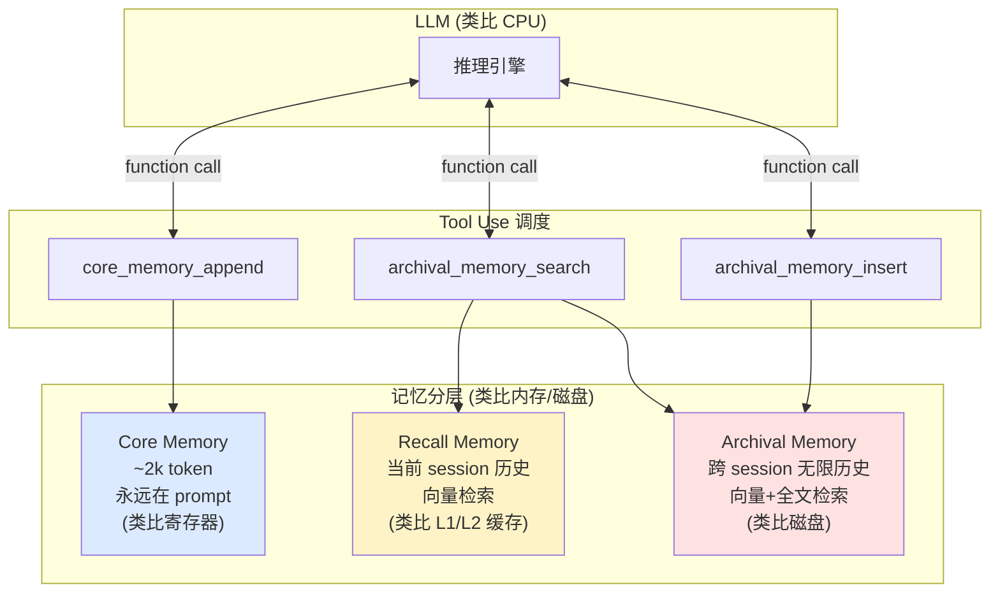

# 2.7 长期记忆：Letta / MemGPT 的存储分层

> 🔴 专家

> **本节钩子**：长期记忆不是"无限历史 + 全部塞进 prompt"——**MemGPT（Packer et al., 2023）的核心洞察是把 LLM 当操作系统，记忆按"页表式"分层管理**。Core Memory（核心，< 2k token 永远在 prompt）/ Archival Memory（档案库，向量存储无限历史）/ Recall Memory（召回，按 query 检索）。**反直觉：长期记忆的瓶颈不是"存多少"，是"何时召回"**。

## 正文大纲

1. **一句话定义**：长期记忆（Long-term Memory）解决"跨 session、跨用户、跨时间"的记忆持久化与按需召回。MemGPT 论文（Packer et al., 2023）的核心思想是**把 LLM 当 CPU、记忆分层当内存/磁盘**——通过 function call 让 LLM 主动"调页"（page in / page out）记忆。
2. **关键机制（5 个要点）**
   - **分层架构**（MemGPT 原文）：① **Core Memory**（核心，约 2k token 永远在 prompt，存用户偏好、当前任务状态）；② **Recall Memory**（召回，向量库存当前 session 的历史消息，**按 query 检索**）；③ **Archival Memory**（档案库，向量 + 全文检索存跨 session 的无限历史）。这 3 层模拟操作系统的"寄存器/缓存/磁盘"分层。
   - **Tool Use 调度**：LLM 通过 function call 主动管理记忆——`core_memory_append`（追加核心记忆）、`core_memory_replace`（替换）、`archival_memory_insert`（插入档案）、`archival_memory_search`（检索档案）。**反直觉**：让 LLM 自己决定"什么该记、什么该忘"，比固定规则更智能但也更不可控。
   - **Letta 开源实现**：Letta（前 MemGPT 开源版，2024 年改名为 Letta）提供完整的分层记忆 + REST API + 多 LLM 后端（OpenAI / Anthropic / 本地 vLLM）。生产里用 Letta Cloud 或自部署 Letta Server，能省下自建记忆系统的 1-2 个月工作量。
   - **成本账**：Core Memory 永远在 prompt → 每次推理多花 2k token（约 \$0.01/次 GPT-4o）；Recall/Archival 检索每次 1 次 Embedding + 1 次向量召回（< 50ms）。比"全量历史塞 prompt"便宜 5-10 倍（按 10 万 token 历史估算）。
   - **适用场景 vs 短期记忆**：短期记忆（参看 2.6）管"当前 session"，长期记忆管"跨 session"——比如客服记住用户上次聊的订单、个性化助手记住用户偏好、代码助手记住项目代码库。**反直觉**：不是所有 Agent 都需要长期记忆——单次任务（翻译、生成）反而被长期记忆干扰。
3. **代码示例**：用 Letta 启一个带长期记忆的 Agent，演示"记住用户偏好"+"跨 session 召回"。
4. **常见误区**：
   - ❌ "MemGPT = 无限记忆"——MemGPT 是"分层管理 + 按需召回"，不是"无脑全塞"。Core Memory 只有 2k token。
   - ❌ "长期记忆 = LangChain Memory"——LangChain 默认 Memory 是 session 内（短期），跨 session 要自己接 Redis / Postgres。
   - ✅ "匹配场景"——单次任务用短期记忆，跨 session 个性化用 MemGPT / Letta。
5. **横向对比**：
   - **LangChain `ConversationBufferMemory`**：session 内全量，跨 session 不行。
   - **LangChain + Redis/Postgres**：跨 session 持久化但要自己管调度。
   - **Letta / MemGPT**：完整分层 + Tool Use 调度，**跨 session 首选**。
   - **Zep**：第三方长期记忆服务，提供 RAG over session 历史，2024 年获融资。
   - **自建 PG + 向量库**：最灵活但工程量大（2-4 周）。

## 图

- **主图 1**：MemGPT 分层记忆架构图（Core / Archival / Recall / Working）



- **辅助理解**：蓝色 Core Memory 永远在 prompt（甜区，模型必看）；黄色 Recall Memory 是当前 session 缓存（按需检索）；红色 Archival Memory 是无限历史"冷存储"（按需检索 + 写入）。**LLM 主动调页**——这就是 MemGPT 的精髓。

## 代码

依赖：`letta>=0.6`（需 Python 3.10+）。运行：`pip install letta && export OPENAI_API_KEY=... && letta run`

```python
"""
long_term_memory_letta.py
Letta 长期记忆最小示例
前置：pip install letta && export OPENAI_API_KEY=...
运行：letta run  # 启动 Letta Server，然后跑这个客户端脚本
"""
import requests
from letta import create_client

# 1) 连接 Letta Server
client = create_client()  # 默认连 http://localhost:8283

# 2) 创建一个带长期记忆的 Agent
agent = client.create_agent(
    name="customer_service",
    memory_blocks=[
        {"label": "persona", "value": "你是耐心的客服助手。"},
        {"label": "user_preference", "value": "用户偏好未知，等待告知。"},
    ],
    tools=["archival_memory_insert", "archival_memory_search"],
)

# 3) 第一次会话：用户告知偏好
response = client.send_message(
    agent_id=agent.id,
    message="我叫 Alice，偏好中文回答，技术问题用代码示例说明。"
)
print(f"AI: {response.messages[-1].text}")
# AI 会自动调用 archival_memory_insert 把偏好存入档案库

# 4) 第二次会话（"跨 session"）：用新的 client 模拟不同 session
# 实际上 Letta 用 agent_id 维持 agent 状态
response2 = client.send_message(
    agent_id=agent.id,
    message="我叫什么名字？偏好什么？"
)
print(f"AI: {response2.messages[-1].text}")
# 预期：AI 答出 "Alice" 和 "中文回答 + 代码示例"（从 Archival Memory 召回）

# 5) 查看 Agent 的内部记忆
agent_state = client.get_agent(agent_id=agent.id)
print("\n=== Core Memory ===")
for block in agent_state.memory.blocks:
    print(f"  [{block.label}] {block.value}")
# 预期：persona 块 + user_preference 块（Core Memory 永远在 prompt）

# 6) 查看 Archival Memory
archival = client.get_archival_memory(agent_id=agent.id, limit=10)
print("\n=== Archival Memory ===")
for mem in archival:
    print(f"  [{mem.created_at}] {mem.content[:60]}")
# 预期：第一次会话的对话被存到 Archival
```

跑完你会看到——**第一次会话后 Core Memory 多了 `user_preference` 块，Archival Memory 存了对话历史**。第二次会话时，AI 能从 Archival 召回用户偏好。**这就是跨 session 长期记忆**。

## 实战片段

Letta 提供了生产级 REST API + SDK，下面是"客服 Agent + 长期记忆"的工程化集成：

```python
# long_term_memory_production.py
from letta import create_client

# 1) 启动时创建一个 Agent（每个用户一个 agent_id）
client = create_client()

def get_or_create_agent(user_id: str):
    """按 user_id 找已有 Agent，没有就新建。"""
    agents = client.list_agents()
    for a in agents:
        if a.name == f"agent_{user_id}":
            return a
    return client.create_agent(
        name=f"agent_{user_id}",
        memory_blocks=[
            {"label": "persona", "value": "你是耐心的客服助手。"},
            {"label": "user_profile", "value": "用户信息待完善。"},
        ],
    )

# 2) 处理用户消息
def handle_user_message(user_id: str, message: str) -> str:
    agent = get_or_create_agent(user_id)
    response = client.send_message(agent_id=agent.id, message=message)
    return response.messages[-1].text

# 3) 业务侧用法
print(handle_user_message("alice", "我想退款订单 #12345"))  # 第一次：AI 问细节
print(handle_user_message("alice", "我已经提交申请了"))     # 第二次（跨 session）：AI 记得 #12345

# 4) 监控：定期导出 Archival Memory 做分析
def export_user_history(user_id: str):
    agent = get_or_create_agent(user_id)
    return client.get_archival_memory(agent_id=agent.id, limit=1000)

# 关键配置：
# 1. Core Memory 块大小：默认 2k token，超出会自动压缩
# 2. Archival 检索 top_k：默认 5，可调到 10 增加召回
# 3. LLM 后端：OpenAI GPT-4o / Claude 3.5 / 本地 vLLM 都支持
# 4. 部署：letta server 启动后用 nginx 反代，加 Prometheus 监控
```

## 自测题

1. **概念辨析**：MemGPT 的"分层记忆"为什么要分 Core / Recall / Archival 三层？只用 Archival 一层存所有历史不行吗？列出 2 个理由。
2. **场景判断**：你的 Agent 是"代码补全工具"（单次任务、不跨 session、用户偏好不重要）。下面哪个记忆方案**最不推荐**？
   - A. 不做记忆
   - B. MemGPT / Letta 长期记忆
   - C. LangChain `ConversationBufferWindowMemory`（k=2）
   - D. Redis 滑动窗口 3 轮
3. **反直觉题**：MemGPT 让 LLM 自己决定"什么该记、什么该忘"（通过 function call），这种"自主调度"有什么风险？
4. **代码补全**：补全 Letta 创建 Agent 的代码，添加 `user_profile` 块：
   ```python
   from letta import create_client
   client = create_client()
   agent = client.create_agent(
       name="my_agent",
       # TODO: 加 user_profile 块（初值"待完善"）+ 启用 archival_memory_search 工具
       ???
   )
   ```
5. **架构题**：生产 Agent 系统为什么 Core Memory 必须限定在 ~2k token？无限大会怎样？

**答案**：1. 两个理由：① **Core Memory 永远在 prompt**——必须小（< 2k token）才不会挤占对话窗口，否则 Context Window 爆掉；Archival 通过检索按需召回，不占 prompt 空间。② **检索效率**——Archival 是向量库，海量数据按 query 检索；Core 是 hash 表（直接读 O(1)），高频访问的关键信息（用户偏好、当前任务）放 Core 性能远好于"每次都去 Archival 检索"。2. **B**（最不推荐）。代码补全是单次任务，不需要跨 session 记忆，MemGPT 长期记忆是过度工程化——Core Memory 维护成本、Archival 检索开销、Tool Use 调度延迟都是浪费。A 或 C / D 即可。3. 风险：① **成本不可控**——LLM 可能"过度记忆"（什么话都写 Archival），导致存储爆炸 + 检索慢；② **行为不可控**——LLM 自主决定"忘什么"可能丢掉用户的关键偏好；③ **延迟不可控**——每次 function call 都要调 LLM，决定"记什么"本身就是一次推理；④ **幻觉风险**——LLM 可能在 Recall 时"编造"不存在的记忆。生产里通常加**写入阈值**（"用户偏好类"才写 Archival）和**定期 review**。4. `memory_blocks=[{"label": "persona", "value": "你是助手。"}, {"label": "user_profile", "value": "待完善"}], tools=["archival_memory_search", "archival_memory_insert"]`。5. ① **Context Window 限制**——Core 永远在 prompt，2k token 已占 GPT-4o 128k 的 1.5%；无限大会挤占用户对话空间。② **注意力稀释**——Core 越大，prompt 越长，Lost in the Middle 越严重，关键信号被淹没。③ **成本线性增长**——Core 每多 1 token，每次推理多花 \$0.00001/1k token（GPT-4o），10 万次/天多花 \$1。④ **写入冲突**——Core 写是 function call，多轮并发时 Core 修改可能冲突。**经验值 2k token 是工程平衡点**——够存 50 条用户偏好 + 10 条当前任务状态，又不挤占对话窗口。

> 📚 本节参考
> - [S 级] Packer et al., 2023, *MemGPT: Towards LLMs as Operating Systems* — https://arxiv.org/abs/2310.08560 （MemGPT 原论文，分层记忆的奠基）
> - [S 级] Letta 开源仓库 — https://github.com/letta-ai/letta （MemGPT 的官方开源实现，2024 年改名 Letta）
> - [S 级] Letta 官方文档 — https://docs.letta.com/ （API + 部署指南）
> - [A 级] Lilian Weng, *LLM Powered Autonomous Agents* Memory 章节 — https://lilianweng.github.io/posts/2023-06-23-agent/ （长期 vs 短期记忆的划分）
> - [A 级] Chip Huyen, *AI Engineering* Memory 章节 — https://github.com/chiphuyen/ai-engineering （生产级长期记忆系统的工程建议）
> - [B 级] Zep 长期记忆服务 — https://www.getzep.com/ （第三方长期记忆服务，商业替代）
