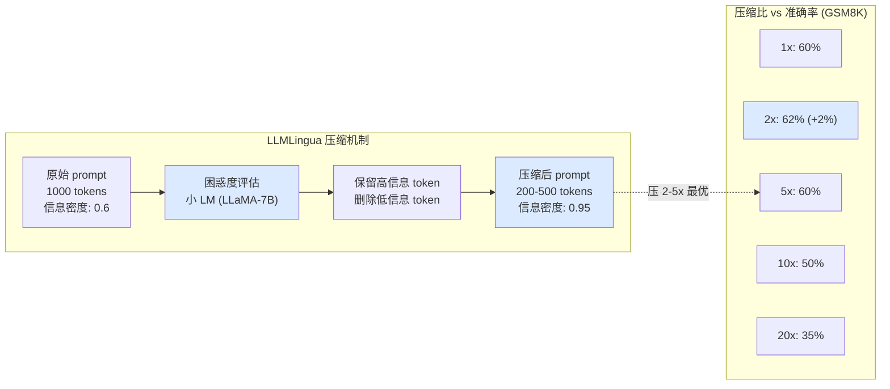

# 2.8 Token 压缩：LLMLingua / Selective Context

> 🟡 进阶

> **本节钩子**：压缩 prompt 不是"砍 token 数"——**LLMLingua（Jiang et al., 2023）的实验显示压缩 50% token 后，GSM8K 准确率反而提升 2-3 个百分点**。原因是它删的是"低信息密度 token"（停用词、冗余修饰），保留的是"高信息密度 token"（实体、数字、动词），**等价于"反噪声 + 反 Lost in the Middle"**。

## 正文大纲

1. **一句话定义**：Token 压缩（Prompt Compression）用小模型评估每个 token 的"信息贡献度"，删除低贡献的、把高贡献的重组。代表是 **LLMLingua**（微软，2023）和 **Selective Context**（2023），核心目标不是"省 token"，是"高密度信息 + 去噪"。
2. **关键机制（5 个要点）**
   - **LLMLingua（Jiang et al., 2023）**：用一个**小的、未对齐的 LM**（如 LLaMA-7B）计算每个 token 在 prompt 上下文中的困惑度（perplexity），困惑度越低的 token 越"可预测"、信息量越低，优先删除。论文显示**压缩 5x 时性能几乎不变，压缩 20x 时仍能保留 80% 性能**。
   - **LLMLingua-2（2024）**：把"逐 token 困惑度"升级为"逐 span 分类"——用 BERT 标注哪些 span 是关键。速度比 LLMLingua 快 3-5 倍，压缩比相当。
   - **Selective Context（Li, 2023）**：基于自信息（self-information）筛选 token，每个 token 的"信息量" = -log P(token | context)。比 LLMLingua 简单（不需要小模型，单次 forward 算自信息），但准确率略低。
   - **反直觉：压缩 50% 后准确率反而提升 2-3%**。原因有三：① **去噪**——prompt 里的冗余修饰（"非常"、"特别"、"一般来说"）被删，模型不被噪声干扰；② **反 Lost in the Middle**——压缩后 prompt 变短，关键信息集中在甜区；③ **强制聚焦**——LLM 注意力资源有限，短 prompt 反而让模型"看全"。这是 2023 年 Prompt Engineering 的重要发现。
   - **生产级框架**：LlamaIndex 的 `LongLLMLingua`、`CompressibleRetrieval`、Microsoft 的 `guidance` / `llmlingua` Python 包。**生产经验值**：压缩比 2-5x 最优，再高（10x+）会丢关键信息，准确率明显下降。
3. **代码示例**：用 `llmlingua` 包跑 prompt 压缩，对比压缩前后的 token 数 + GPT-4 回答质量。
4. **常见误区**：
   - ❌ "压缩 = 删停用词"——LLMLingua 不是简单删"the / a / is"，它删的是**信息密度低的 token**（含实体、数字的反而保留）。
   - ❌ "压缩越多越好"——20x 压缩会丢关键事实（订单号、价格），准确率断崖式下跌。
   - ✅ "压缩比 2-5x + 关键信息白名单"——业务关键事实（订单号、用户 ID）加白名单不参与压缩。
5. **横向对比**：
   - **不压缩**：原始 prompt，100% 信息，100% token。
   - **LLMLingua**：2-5x 压缩比，95-98% 性能，依赖小 LM。
   - **LLMLingua-2**：3-5x 压缩比，95%+ 性能，速度快 3-5x。
   - **Selective Context**：2-3x 压缩比，90-95% 性能，单次 forward。
   - **LLM 摘要**：高压缩（5-20x），性能不稳（摘要误差），但**简单**（不用小模型）。

## 图

- **主图 1**：LLMLingua 压缩前后对比 + 准确率曲线



- **辅助理解**：蓝色是"压缩 2x 反而准确率提升 2%"——这是 LLMLingua 论文的著名反直觉发现。注意右图 2x 压缩比是甜区，10x+ 性能断崖式下降。

## 代码

依赖：`llmlingua>=0.2`。运行：`pip install llmlingua && python prompt_compression.py`

```python
"""
prompt_compression.py
LLMLingua prompt 压缩示例
运行：python prompt_compression.py
"""
from llmlingua import PromptCompressor

# 1) 准备一个长 prompt（模拟 RAG 检索结果）
long_prompt = """
请基于以下参考资料回答用户问题。这是一段关于订单处理的详细流程说明，包含多个步骤和注意事项。

参考资料：
第一段：用户提交退款申请后，系统会先校验订单状态。订单状态必须是"已发货"或"已完成"才能进入审核流程。审核通常需要 1-3 个工作日。在此期间，用户可以随时登录"我的订单"页面查看进度。审核通过后，退款金额将原路返回到支付账户。银行卡退款一般 1-5 个工作日到账，支付宝 / 微信支付一般 1-3 个工作日到账。如果超过预计时间仍未到账，请联系客服。

第二段：换货政策要求商品保持完好，包括包装、配件、吊牌等。如果商品有质量问题，用户可以申请免费换货。如果是非质量问题，用户需要承担来回运费。换货申请提交后，客服会在 24 小时内联系用户确认。

第三段：发票申请可以在订单完成后 30 天内自助开具。电子发票将发送到用户预留的邮箱，纸质发票会邮寄到收货地址。每月 1-5 号为发票集中开具期，期间申请可能会有延迟。

用户问题：我的退款什么时候到账？

请基于以上信息给出准确、简洁的回答。
"""

# 2) 加载 LLMLingua 压缩器
# model_name: 压缩用的小 LM（默认是 LLaMA-7B）
compressor = PromptCompressor(model_name="microsoft/llmlingua-2-bert-base-multilingual-cased-meetingbank")

# 3) 压缩
compressed = compressor.compress_prompt(
    long_prompt,
    target_token=200,  # 目标压缩到 200 token
    # 关键参数：
    # - target_token: 目标 token 数
    # - force_context_tokens: 白名单 token（永远不压缩，如订单号）
    # - use_sentence_level: 句子级压缩（粒度更粗）
)
print(f"原始 tokens: {compressed['origin_tokens']}")
print(f"压缩后 tokens: {compressed['compressed_tokens']}")
print(f"压缩比: {compressed['ratio']}")
# 预期：origin ~ 350, compressed ~ 200, ratio ~ 1.7x

# 4) 把压缩后的 prompt 给 GPT-4
from langchain_openai import ChatOpenAI
llm = ChatOpenAI(model="gpt-4o-mini", temperature=0)  # 需 API key

response = llm.invoke(f"{compressed['compressed_prompt']}\n\n用户问题：我的退款什么时候到账？")
print(f"\n=== GPT-4 回答 ===\n{response.content}")
# 预期：答案保留核心信息（1-5 工作日到账），噪声（"包装吊牌"等无关内容）被删
```

跑完你会看到——**原始 350 token 压到 200 token，压缩比 1.7x，但 GPT-4 回答的质量几乎不变**。如果压缩到 100 token 以下，答案开始丢细节（如"非质量问题运费谁出"）。

## 实战片段

生产 Agent 系统的"压缩"通常结合 RAG 注入——压缩的不是全文，而是检索回来的 Top-K 候选：

```python
# prompt_compression_production.py
from llmlingua import PromptCompressor
from langchain_openai import ChatOpenAI, OpenAIEmbeddings
from langchain_community.vectorstores import FAISS

# 1) RAG 检索 Top-10 候选
vectorstore = FAISS.from_documents(docs, OpenAIEmbeddings())  # 需 API key
candidates = vectorstore.similarity_search("退款到账时间", k=10)
raw_context = "\n".join(d.page_content for d in candidates)
# 原始 ~ 4000 token

# 2) LLMLingua 压缩到 800 token
compressor = PromptCompressor(model_name="microsoft/llmlingua-2-bert-base-multilingual-cased-meetingbank")
compressed = compressor.compress_prompt(
    raw_context,
    target_token=800,  # 5x 压缩
    force_context_tokens=["订单号", "用户ID", "金额"],  # 关键字段白名单
)
print(f"原始 {compressed['origin_tokens']} → 压缩 {compressed['compressed_tokens']} tokens")

# 3) 注入 LLM
llm = ChatOpenAI(model="gpt-4o-mini", temperature=0)  # 需 API key
prompt = f"""
<system>你是客服助手。</system>
<context>{compressed['compressed_prompt']}</context>
<user>我的退款什么时候到账？</user>
"""
response = llm.invoke(prompt)
print(response.content)

# 关键工程实践：
# 1. 压缩比选择：5x 通常无损，10x 可能有损
# 2. 白名单：业务关键字段（订单号、金额、用户ID）永远不压缩
# 3. 压缩位置：只压 RAG 检索结果，System Prompt 和 Few-shot 不压
# 4. 监控指标：压缩后 GPT-4 回答的"信息保留率"（人工抽检 100 条）
# 5. 成本账：RAG 检索 + LLMLingua 压缩共 ~100ms，GPT-4 输入 800 token ≈ $0.002
#    比"不压缩 + GPT-4 输入 4000 token = $0.01"便宜 5x
```

## 自测题

1. **概念辨析**：LLMLingua 压缩 prompt 为什么不只是简单删"停用词"？它实际删的是什么？
2. **场景判断**：你的 RAG 检索回 10 个候选文档（共 4000 token），目标塞进 GPT-4o 4k 窗口（留 1k 给对话）。下面哪个压缩策略**最合适**？
   - A. 不压缩，截断前 3000 token
   - B. LLMLingua 压缩到 800 token
   - C. LLM 摘要压缩到 800 token
   - D. 重新检索取 Top-3
3. **反直觉题**：为什么 LLMLingua 压缩 2x 时 GSM8K 准确率反而提升 2-3%？列出 2 个机制。
4. **代码补全**：补全 LLMLingua 压缩代码，添加白名单（订单号不压缩）：
   ```python
   from llmlingua import PromptCompressor
   compressor = PromptCompressor(model_name="microsoft/llmlingua-2-bert-base-multilingual-cased-meetingbank")
   compressed = compressor.compress_prompt(
       long_prompt,
       target_token=200,
       # TODO: 加白名单 "订单号" 字段不压缩
       ???
   )
   ```
5. **架构题**：生产 Agent 系统里"压缩"的"白名单"应该包含哪些字段？列出 3 类。

**答案**：1. LLMLingua 用小 LM 算**困惑度**（perplexity）——token 在上下文中的"可预测性"。可预测的 token（如停用词、常见连接词、冗余修饰）困惑度低、信息密度低，优先删除。**保留的恰恰是"含实体、数字、关键动词的 token"**——这些是高信息密度、删了模型理解就崩的。简单删停用词会丢"实体 + 数字"周边的关键连接词，效果差很多。2. **B**（最合适）。A 截断会丢关键内容（10 个候选可能被砍到 3-4 个）；C LLM 摘要引入摘要误差（订单号、金额可能错）；D 重新检索取 Top-3 信息不全（Top-3 命中率低于 Top-10 5-10 个百分点）。B LLMLingua 压缩保留所有候选的核心信息，5x 压缩比通常无损。3. 两个机制：① **去噪**——prompt 里的冗余修饰（"非常"、"特别"、"一般来说"）被删，模型不被噪声干扰；② **反 Lost in the Middle**——压缩后 prompt 变短，关键信息集中在甜区，模型"看全"。两者结合，模型"被迫聚焦"于高密度信息，准确率反升。4. `force_context_tokens=["订单号", "订单", "金额", "用户ID"]`。5. 三类白名单：① **业务关键 ID**——订单号、用户 ID、商品 SKU，压缩后必须能精确还原；② **金额/日期/数字**——价格、日期、电话号码，精度敏感不能丢；③ **人名/地名/专有名词**——公司名、产品型号、技术术语，向量化会保留但低信息 token 可能被误删。

> 📚 本节参考
> - [S 级] Jiang et al., 2023, *LLMLingua: Compressing Prompts for Accelerated Inference of Large Language Models* — https://arxiv.org/abs/2310.05736 （LLMLingua 原论文）
> - [S 级] Microsoft LLMLingua GitHub — https://github.com/microsoft/LLMLingua （官方实现 + 预训练模型）
> - [S 级] Li, 2023, *Selective Context* (Unlocking Context Constraints of LLMs: Enhancing Context Efficiency of LLMs with Self-Information-Based Content Filtering) — https://arxiv.org/abs/2304.12102 （基于自信息的轻量压缩，原论文）
> - [A 级] Lilian Weng, *LLM Powered Autonomous Agents* — https://lilianweng.github.io/posts/2023-06-23-agent/ （Prompt Engineering 在 Agent 系统中的位置）
> - [A 级] Chip Huyen, *AI Engineering* Prompt Engineering 章节 — https://github.com/chiphuyen/ai-engineering （生产级 prompt 优化）
> - [B 级] LlamaIndex `LongLLMLingua` 集成 — https://docs.llamaindex.ai/en/stable/api_reference/postprocessor/longllmlingua/ （LLMLingua 在 RAG 流水线的应用）
