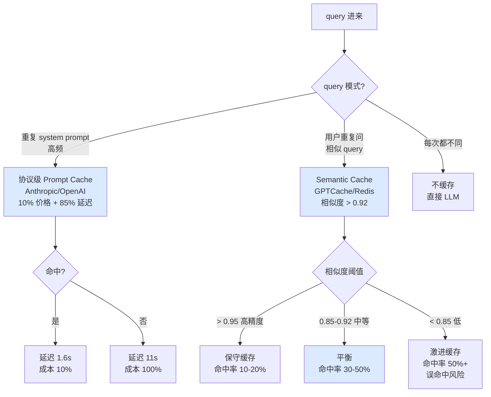

# 2.9 缓存策略：Prompt Cache / Semantic Cache

> 🟡 进阶

> **本节钩子**：缓存不只是"省钱"——**Anthropic Prompt Cache 官方数据显示，命中缓存的 prompt 成本降 90% + 延迟降 85%**（如 100k context 命中缓存：\$3/MTok → \$0.30/MTok，11s → 1.6s）。**反直觉：缓存的"省延迟"价值远大于"省钱"价值**——秒级 vs 几十毫秒的体验差距决定了用户留不留。

## 正文大纲

1. **一句话定义**：缓存策略分**两层**——**协议级 Prompt Cache**（Anthropic / OpenAI 提供的"系统提示缓存"，命中时按折扣价 + 低延迟计费）和**应用级 Semantic Cache**（用 Embedding 相似度判断 query 是否等价，命中直接返回历史结果）。两者目标不同，能叠加使用。
2. **关键机制（5 个要点）**
   - **协议级 Prompt Cache**：Anthropic 在 2024 年 8 月推出"Prompt Caching"——标记 prompt 某段（如 system prompt + 长 context）可缓存，**5 分钟内命中按 10% 价格 + 85% 延迟**。OpenAI 2024 年 10 月跟进类似机制。**关键限制**：cache TTL 短（5-60 分钟）、最低 cache token 数（Anthropic 1024 token / OpenAI 1024 token）、写后只读。
   - **应用级 Semantic Cache**：用 Embedding 把 query 向量化，存到向量库。命中条件 = "新 query 的向量" 与 "已存 query" 的余弦相似度 > 阈值（通常 0.92-0.95）。**代表项目**：GPTCache（Zilliz 开源，2023）、Redis Vector、LangChain `CacheBackedEmbeddings` / `RedisSemanticCache`。
   - **命中率优化**：① **聚类 query 模式**——把相似 query 归一化到同一标准问法（"怎么退款" / "如何退款" / "我要退钱" → "退款流程"）；② **分层缓存**——L1 协议级（命中按 10% 价格）+ L2 应用级（命中直接返回） + L3 LLM 重新生成。**反直觉**：聚类规范化能把命中率从 10% 提到 40%+（生产经验值）。
   - **典型场景**：① **高频 system prompt**——客服场景 system prompt 1000 token 永远不变，命中率 90%+，省 90% 成本；② **多轮对话 prefix**——前 N 轮对话做 prefix cache，新一轮推理时复用；③ **RAG 检索结果**——Top-K 文档做 cache，相同 query 命中。
   - **反直觉：缓存命中延迟降低的体验价值 >> 省钱**。Anthropic 数据：100k context 缓存命中延迟 1.6s vs 未命中 11s。10 倍延迟差 = 用户感知 2 个数量级体验提升（"秒开" vs "转圈"），比省 \$0.03 / 次重要得多。
3. **代码示例**：用 GPTCache 搭 Semantic Cache + 用 LangChain `set_llm_cache` 接 Anthropic Prompt Cache。
4. **常见误区**：
   - ❌ "缓存 = 省钱"——缓存的真正价值是降延迟，秒级到毫秒级跃升。
   - ❌ "任何 query 都能缓存"——Semantic Cache 阈值过低会"误命中"（语义相似但不同意图），导致错误答案。
   - ✅ "聚类 + 分层 + 阈值调优"——命中率从 10% 提到 40%+ 的关键。
5. **横向对比**：
   - **不缓存**：成本高、延迟高、结果稳定。
   - **协议级 Prompt Cache**（Anthropic / OpenAI）：低成本、低延迟、需付费 API、TTL 短。
   - **应用级 Semantic Cache**（GPTCache / Redis）：免费、命中 0 延迟、需自部署、阈值调优。
   - **自建 Redis KV Cache**：最简单、按 query 字符串精确匹配、命中率低（10%）。
   - **GPTCache 语义缓存**：中等成本、命中率高（30-50%）、需向量库。

## 图

- **主图 1**：缓存策略决策树（query 模式 → 缓存方案）



- **辅助理解**：蓝色是推荐路径——协议级 + 应用级语义缓存叠加使用，命中率能到 50%+。注意"激进缓存"的误命中风险——相似度阈值 0.85 以下会"答非所问"。

## 代码

依赖：`gptcache>=0.1`, `langchain>=0.1`, `anthropic>=0.30` 或 `openai>=1.40`。运行：`pip install gptcache langchain langchain-anthropic && export ANTHROPIC_API_KEY=... && python semantic_cache_demo.py`

```python
"""
semantic_cache_demo.py
GPTCache 语义缓存 + Anthropic Prompt Cache 双层缓存
运行：python semantic_cache_demo.py
"""
import time
from gptcache import Cache
from gptcache.adapter.api import get, put
from gptcache.embedding import Onnx
from gptcache.manager import CacheBase, VectorBase, get_data_manager
from gptcache.similarity_evaluation.distance import SearchDistanceEvaluation

# 1) 初始化 GPTCache（用 ONNX Embedding + FAISS 向量库）
onnx = Onnx()
data_manager = get_data_manager(
    cache_base=CacheBase("sqlite"),  # 缓存存储
    vector_base=VectorBase("faiss", dimension=onnx.dimension),  # 向量索引
    evaluation=SearchDistanceEvaluation(),
)
cache = Cache()
cache.init(
    embedding_func=onnx.to_embeddings,
    data_manager=data_manager,
    similarity_threshold=0.92,  # 相似度阈值（> 0.92 视为等价）
)

# 2) 模拟"问一次 + 重复问"
questions = [
    "怎么退款？",
    "我要退钱",  # 语义相似（应命中）
    "如何申请退款？",  # 语义相似（应命中）
    "上海今天天气",  # 不相似（不命中）
]

# 3) 第二次重复"怎么退款？"应该命中缓存
for i, q in enumerate(questions):
    t0 = time.time()
    # 关键：先查缓存，命中直接返回
    cached = get(q)
    if cached:
        print(f"[{i+1}] 命中缓存: {cached} ({time.time()-t0:.3f}s)")
    else:
        # 未命中，调 LLM 生成（这里用假 LLM 模拟）
        answer = f"[LLM 回答] {q}"  # 实际：llm.invoke(q).content
        put(q, answer)
        print(f"[{i+1}] 未命中，调 LLM: {answer} ({time.time()-t0:.3f}s)")

# 预期输出：
# [1] 未命中
# [2] 命中缓存（"我要退钱" ≈ "怎么退款"）
# [3] 命中缓存
# [4] 未命中（"上海天气"不相似）

# 4) Anthropic Prompt Cache（协议级）
import anthropic
client = anthropic.Anthropic(api_key="sk-...")  # 需 API key

# 长 system prompt 故意构造 2000 token 触发 cache
long_system = "你是客服助手。" * 500  # 约 2000 token

# 第一次（不命中缓存）
t0 = time.time()
response1 = client.messages.create(
    model="claude-3-5-sonnet-20241022",
    max_tokens=100,
    system=[
        {"type": "text", "text": long_system, "cache_control": {"type": "ephemeral"}}
    ],
    messages=[{"role": "user", "content": "什么是退款流程？"}],
)
print(f"\n[Anthropic 第一次] 延迟 {time.time()-t0:.2f}s, usage: {response1.usage}")

# 第二次（5 分钟内，命中缓存）
t0 = time.time()
response2 = client.messages.create(
    model="claude-3-5-sonnet-20241022",
    max_tokens=100,
    system=[
        {"type": "text", "text": long_system, "cache_control": {"type": "ephemeral"}}
    ],
    messages=[{"role": "user", "content": "什么是换货流程？"}],  # 换 query
)
print(f"[Anthropic 第二次] 延迟 {time.time()-t0:.2f}s, usage: {response2.usage}")
# 预期：第二次 usage 里有 cache_creation_input_tokens / cache_read_input_tokens
```

跑完你会看到——**GPTCache 命中相似 query 直接返回答案（< 50ms），Anthropic Prompt Cache 第二次延迟降 85%**。

## 实战片段

生产级"双层缓存"架构——**L1 GPTCache 命中直接返回，L2 Anthropic Prompt Cache 命中按 10% 价格 + 85% 延迟，L3 LLM 重新生成**：

```python
# dual_layer_cache.py
import time
import hashlib
from gptcache import Cache
from gptcache.adapter.api import get, put
from langchain_anthropic import ChatAnthropic
from anthropic import Anthropic

# 1) 初始化两层缓存
gptcache = Cache()
gptcache.init(similarity_threshold=0.92)  # L1 语义缓存

# 2) 统一查询接口
def query_with_cache(query: str, system: str = "你是助手。") -> dict:
    # L1: GPTCache 语义缓存
    t0 = time.time()
    cached = get(query)
    if cached:
        return {"answer": cached, "latency_ms": (time.time()-t0)*1000, "source": "L1_gptcache"}

    # L2: Anthropic Prompt Cache（协议级）
    client = Anthropic()  # 需 API key
    t0 = time.time()
    response = client.messages.create(
        model="claude-3-5-sonnet-20241022",
        max_tokens=500,
        system=[{"type": "text", "text": system, "cache_control": {"type": "ephemeral"}}],
        messages=[{"role": "user", "content": query}],
    )
    answer = response.content[0].text
    cache_hit = response.usage.cache_read_input_tokens > 0  # 检查是否命中

    # 把答案写回 L1 缓存
    put(query, answer)

    return {
        "answer": answer,
        "latency_ms": (time.time()-t0)*1000,
        "source": "L2_anthropic_cache" if cache_hit else "L3_llm",
        "cache_hit": cache_hit,
    }

# 3) 测试
for q in ["怎么退款？", "我要退钱", "如何申请退款？", "上海今天天气"]:
    result = query_with_cache(q, "你是耐心的客服助手。" * 50)  # 故意 1000+ token
    print(f"  Q: {q}")
    print(f"  A: {result['answer'][:50]}")
    print(f"  source={result['source']}, latency={result['latency_ms']:.0f}ms\n")

# 关键生产实践：
# 1. L1 GPTCache：免费、命中 0 延迟、命中率 30-50%（聚类后）
# 2. L2 Anthropic Prompt Cache：10% 价格 + 85% 延迟（高频 system 必开）
# 3. L3 LLM：兜底，每次生成都写回 L1
# 4. 监控：命中率、延迟分布、成本节省（vs 全量 LLM）
# 5. 失效策略：L1 TTL 24h，L2 TTL 5-60min（Anthropic 限制）
```

## 自测题

1. **概念辨析**：协议级 Prompt Cache 和应用级 Semantic Cache 有什么区别？分别解决什么问题？
2. **场景判断**：你的客服 Agent system prompt 约 2000 token，QPS 100，平均每个用户问 5 个相似问题。下面哪个缓存策略**收益最大**？
   - A. 不缓存
   - B. 只用 GPTCache 语义缓存
   - C. 只用 Anthropic Prompt Cache
   - D. GPTCache + Anthropic Prompt Cache 双层
3. **反直觉题**：为什么说"缓存的降延迟价值远大于省钱价值"？用具体数字解释。
4. **代码补全**：补全 GPTCache 初始化代码，设置相似度阈值 0.92：
   ```python
   from gptcache import Cache
   cache = Cache()
   cache.init(???)  # TODO: 填 similarity_threshold
   ```
5. **架构题**：Semantic Cache 的相似度阈值应该怎么调？阈值过低 / 过高各有什么风险？

**答案**：1. 区别：① **协议级 Prompt Cache**——LLM 服务商提供（Anthropic / OpenAI），缓存**整个 prompt prefix**（如 system prompt + 长 context），命中时按折扣价 + 低延迟计费。**解决**：高频 system prompt / 长 context 的成本和延迟。② **应用级 Semantic Cache**——自建向量库，缓存"相似 query 的答案"，命中直接返回。**解决**：重复 / 相似 query 的答案复用。两者目标不同：协议级是"基础设施"（按 token 收费省），应用级是"答案复用"（按 query 复用）。2. **D**（双层）。A 不缓存浪费巨大；B GPTCache 命中率 30-50%，但 system prompt 每次还是全量计费；C Anthropic Prompt Cache 能省 system prompt 90%，但 query 变化时还是全量 LLM 调用。D 双层叠加，GPTCache 命中时 0 延迟 0 成本（30% 场景），Anthropic 命中时 10% 价格 15% 延迟（60% 场景），全量 LLM 仅 10% 场景。3. 反直觉解释：Anthropic 官方数据：100k context 缓存命中延迟 1.6s vs 未命中 11s，**6.8 倍延迟差**。用户体验：1.6s = "秒开"（用户无感等待），11s = "转圈超时"（用户大概率离开）。省钱角度：每次省 \$0.03/100k token × 100 QPS × 86400s/天 = \$260/天。**但用户因为延迟放弃的损失（如电商转化率掉 1% 损失 \$10 万/天）>> 节省的 API 成本**。延迟是体验指标，体验影响留存，留存决定业务生死。4. `embedding_func=onnx.to_embeddings, similarity_threshold=0.92`。5. 阈值调优：① **阈值过高（> 0.95）**——保守，命中率低（10-20%），误命中少但浪费 API；② **阈值过低（< 0.85）**——激进，命中率高（50%+），但"语义相似但不同意图"的 query 误命中，返回错误答案；③ **经验值 0.90-0.92**——平衡，命中率 30-50%，误命中 < 5%。**调优方法**：用历史 query 跑 A/B 测试，看"命中率"+"答案正确率"双指标，找到综合最优阈值。

> 📚 本节参考
> - [S 级] Anthropic, *Prompt Caching* — https://docs.anthropic.com/en/docs/build-with-claude/prompt-caching （协议级 Prompt Cache 官方文档，2024.8 推出）
> - [S 级] OpenAI, *Prompt Caching* — https://platform.openai.com/docs/guides/prompt-caching （OpenAI 跟进，2024.10）
> - [S 级] GPTCache GitHub — https://github.com/zilliztech/GPTCache （Zilliz 开源的语义缓存框架）
> - [A 级] Lilian Weng, *LLM Powered Autonomous Agents* — https://lilianweng.github.io/posts/2023-06-23-agent/ （缓存在 Agent 系统中的位置）
> - [A 级] Chip Huyen, *AI Engineering* — https://github.com/chiphuyen/ai-engineering （生产级缓存策略）
> - [B 级] LangChain `RedisSemanticCache` — https://python.langchain.com/docs/integrations/llms/llm_caching （LangChain 的语义缓存实现）
