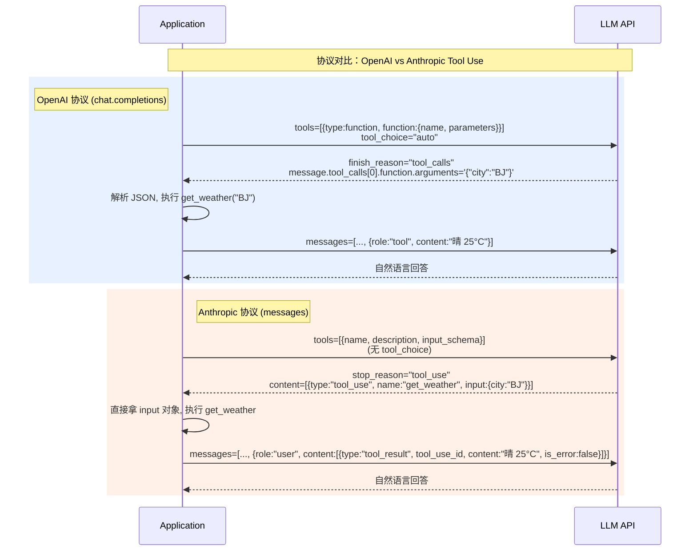

# 3.1 Function Calling：OpenAI 协议与 Anthropic Tool Use 的差异

> 🟢 核心

> **本节钩子**：两个协议都叫"让模型调工具"，但底层**反直觉的差异**是——Anthropic 协议在 tool 失败时返回的错误块（`is_error: true`）比 OpenAI 的 `error: "..."` 字符串**结构化得多**，调试时间从 10 分钟降到 30 秒；而 OpenAI 的 `tool_choice: "required"` 是协议级"强制必调"开关，Anthropic 默认就让模型自由决定——这两种**默认哲学**决定了你在多 agent 场景下选哪个协议更省心。

## 正文大纲

1. **一句话定义**：Function Calling 是 2023 年 OpenAI 首发、Anthropic 跟随的"模型主动调用外部函数"协议，核心是把"工具 schema"以 JSON 描述喂给 LLM、模型决定是否调、回传结构化参数、应用端执行后把结果回喂——这是 L1 的"工具调用推理"在协议层的落地。
2. **关键机制（5 个要点）**
   - **OpenAI 协议（chat.completions）**：`tools: [{type: "function", function: {name, description, parameters: <JSON Schema>}}]`，配合 `tool_choice`（"auto" / "required" / "none" / 指定 function）控制调用行为。模型返回 `finish_reason: "tool_calls"`，工具调用在 `message.tool_calls[i]` 里，`function.arguments` 是 JSON 字符串。
   - **Anthropic 协议（messages API）**：`tools: [{name, description, input_schema: <JSON Schema>}]`，模型返回 `stop_reason: "tool_use"`，工具调用在 `content: [{type: "tool_use", id, name, input}]` 里。
   - **错误处理的反直觉差**：Anthropic 工具失败返回结构化 `tool_result` block（`{type, tool_use_id, content, is_error: true}`），模型能直接看到错误并重试；OpenAI 把错误包成普通 `role: "tool"` 消息，**模型要靠 prompt 里的"如果失败请重试"约定**，缺少协议级错误标注。
   - **强制调用的差异**：OpenAI `tool_choice: "required"` 是协议级硬约束，常用于结构化输出流水线；Anthropic 没有等价物，只能在 system prompt 里写"你必须先调 X 工具"，**生产中更推荐"循环检测 + 强制补调"软实现**。
   - **协议版本演进（2024-2026）**：OpenAI 在 `gpt-4o-2024-08-06` 引入 `parallel_tool_calls`（默认 true），单轮支持多工具并行；Anthropic 在 2024-10 的 `claude-3-5-sonnet` 同样支持单轮多 tool_use，**但两边对"部分失败"处理仍未对齐**——OpenAI 一个工具失败整轮重试，Anthropic 可只重试失败的那个。
3. **代码示例**：同一功能（"查北京天气"）在两套协议下的请求体对比，看清 schema 与响应结构的差异。
4. **常见误区**：
   - ❌ "两个协议能直接互转"——**不行**。`tools[].function.parameters`（OpenAI）vs `tools[].input_schema`（Anthropic）字段名都不同；响应里 `tool_calls[i].function.arguments`（字符串）vs `content[i].input`（对象）类型都不同。要互转得写 adapter。
   - ❌ "Anthropic 没有 tool_choice 就不能强制"——**错**。2024 年后 Anthropic 支持 `tool_choice: {type: "tool", name: "..."}` 强制指定工具（详见 3.7 缓存），但默认是 "auto" 不能关闭。
   - ✅ "选 OpenAI 还是 Anthropic 看生态"——LangChain 0.3 之后两套都封装好了（`ChatOpenAI.bind_tools()` vs `ChatAnthropic.bind_tools()`），切换成本主要是 schema 命名差异。
5. **与 L1 衔接**：工具 schema 是 L1"工具推理"在协议层的实现；与 L4 衔接：`langchain.agents` 抽象统一 `Tool` 接口，内部自动转两套协议。

## 图

- **主图 1**：两个协议调用流程对比（OpenAI 走 `tool_calls` 数组 / Anthropic 走 `tool_use` block 流）



- **辅助理解**：注意三个细节差异——① Anthropic 响应里 `input` 已经是**对象**（OpenAI 是字符串，要 `json.loads`）；② Anthropic 工具结果用 `is_error: true` 显式标注失败，模型能在下一轮基于结构化错误自动重试；③ OpenAI 协议 `tool_choice="required"` 是协议级硬约束，Anthropic 2024 年后才有等价的 `tool_choice: {type:"tool", name:...}`。

## 代码

依赖：`openai>=1.40`, `anthropic>=0.40`，两段代码分别演示"同一查询在两套协议下的请求结构"——纯结构演示，不发真实 API。

```python
"""
function_calling_compare.py
对比 OpenAI Function Calling 与 Anthropic Tool Use 的请求/响应结构
依赖：openai>=1.40, anthropic>=0.40
运行：python function_calling_compare.py
"""
import json
from openai import OpenAI
from anthropic import Anthropic

# 共用的"查天气"工具定义
TOOL_NAME = "get_weather"
TOOL_DESC = "查询指定城市的当前天气"

# ========== OpenAI 协议 ==========
openai_tool = {
    "type": "function",
    "function": {
        "name": TOOL_NAME,
        "description": TOOL_DESC,
        # parameters 是 JSON Schema 草案子集
        "parameters": {
            "type": "object",
            "properties": {
                "city": {"type": "string", "description": "城市名，如 '北京'"},
                "unit": {"type": "string", "enum": ["celsius", "fahrenheit"]},
            },
            "required": ["city"],
        },
    },
}

# 模拟 OpenAI 响应（实际跑需要 API key）
openai_response_tool_calls = [
    {
        "id": "call_abc123",
        "type": "function",
        "function": {
            "name": TOOL_NAME,
            # ⚠️ arguments 是字符串，需要 json.loads 解析
            "arguments": '{"city": "北京", "unit": "celsius"}',
        },
    }
]
parsed_args = json.loads(openai_response_tool_calls[0]["function"]["arguments"])
print(f"[OpenAI] 解析后的参数: {parsed_args}")
print(f"[OpenAI] 参数类型: {type(parsed_args)}")  # <class 'dict'>

# ========== Anthropic 协议 ==========
anthropic_tool = {
    "name": TOOL_NAME,
    "description": TOOL_DESC,
    # input_schema 字段名不同于 OpenAI 的 function.parameters
    "input_schema": {
        "type": "object",
        "properties": {
            "city": {"type": "string", "description": "城市名，如 '北京'"},
            "unit": {"type": "string", "enum": ["celsius", "fahrenheit"]},
        },
        "required": ["city"],
    },
}

# 模拟 Anthropic 响应
anthropic_response_content = [
    {
        "type": "tool_use",
        "id": "toolu_xyz789",
        "name": TOOL_NAME,
        # ⚠️ input 已经是 dict，不是字符串
        "input": {"city": "北京", "unit": "celsius"},
    }
]
parsed_input = anthropic_response_content[0]["input"]
print(f"\n[Anthropic] 解析后的参数: {parsed_input}")
print(f"[Anthropic] 参数类型: {type(parsed_input)}")  # <class 'dict'> 已经是对象

# ========== 协议字段对照表 ==========
diff_table = [
    ("工具定义位置", "tools[].function", "tools[]"),
    ("参数 schema 字段", "function.parameters", "input_schema"),
    ("响应触发字段", "finish_reason='tool_calls'", "stop_reason='tool_use'"),
    ("工具调用字段", "tool_calls[i].function", "content[i]"),
    ("参数类型（响应）", "function.arguments (str)", "input (dict)"),
    ("错误处理", "role='tool' + 自然语言", "tool_result.is_error (bool)"),
    ("强制调用", "tool_choice='required'", "tool_choice={type:'tool', name:...} (2024+)"),
]
print("\n=== 协议字段差异 ===")
for k, oa, an in diff_table:
    print(f"  {k:20} | OpenAI: {oa:30} | Anthropic: {an}")

# 输出：
# [OpenAI] 解析后的参数: {'city': '北京', 'unit': 'celsius'}
# [OpenAI] 参数类型: <class 'dict'>
# [Anthropic] 解析后的参数: {'city': '北京', 'unit': 'celsius'}
# [Anthropic] 参数类型: <class 'dict'>
```

## 实战片段

真实工程里"两套协议并存"很常见——多 agent 平台同时对接 OpenAI 和 Anthropic。下面是 LangChain 的统一抽象 + adapter 写法，演示如何屏蔽协议差异：

```python
# protocol_adapter.py
from typing import Any
from langchain_core.tools import tool
from langchain_openai import ChatOpenAI
from langchain_anthropic import ChatAnthropic

# 1) 用 LangChain 装饰器定义工具（协议无关）
@tool
def get_weather(city: str, unit: str = "celsius") -> str:
    """查询指定城市的当前天气。

    Args:
        city: 城市名，如 '北京'、'上海'
        unit: 温度单位，'celsius' 或 'fahrenheit'
    """
    # 实战片段：实际接 weather API
    return f"{city} 当前天气：晴，25°{'C' if unit == 'celsius' else 'F'}"

# 2) 两个 LLM 客户端（同 schema 自动转两套协议）
llm_openai = ChatOpenAI(model="gpt-4o", api_key="sk-...")  # 实战片段，需 API key
llm_anthropic = ChatAnthropic(model="claude-3-5-sonnet-20241022", api_key="sk-ant-...")  # 实战片段，需 API key

# 3) bind_tools 是 LangChain 的统一抽象，内部自动转 OpenAI/Anthropic schema
llm_oai_with_tools = llm_openai.bind_tools([get_weather])
llm_ant_with_tools = llm_anthropic.bind_tools([get_weather])

# 4) 同一 prompt 调两个模型，看响应字段差异
prompt = "北京今天天气怎么样？"

# OpenAI
resp_oai = llm_oai_with_tools.invoke(prompt)
print("[OpenAI]")
print(f"  finish_reason: {resp_oai.response_metadata.get('finish_reason')}")
print(f"  tool_calls[0].function.name: {resp_oai.tool_calls[0]['name']}")
print(f"  tool_calls[0].function.args: {resp_oai.tool_calls[0]['args']}")
# OpenAI: tool_calls[0]['args'] 已经是 dict（LangChain 自动 json.loads）

# Anthropic
resp_ant = llm_ant_with_tools.invoke(prompt)
print("\n[Anthropic]")
print(f"  stop_reason: {resp_ant.response_metadata.get('stop_reason')}")
print(f"  content[0].type: {resp_ant.content[0].type}")
print(f"  content[0].name: {resp_ant.content[0].name}")
print(f"  content[0].input: {resp_ant.content[0].input}")
# Anthropic: content[0].input 已经是 dict，协议原生就是对象

# 5) 关键实战要点
# - LangChain 1.0+ 的 AIMessage 把 tool_calls 统一抽象成 list[dict]，
#   'name' / 'args' / 'id' 三个字段跨协议一致，应用层不用关心协议差。
# - 但 error handling 还是要在应用层做：OpenAI 工具抛异常要捕获
#   ToolException 并包装成 'tool' role 的字符串消息；
#   Anthropic 直接包成 tool_result block 即可（结构化错误）。
```

实战要点：
1. **统一抽象优先**——直接用 LangChain `bind_tools()` / LlamaIndex `FunctionTool` / MCP server，**不要在应用层手写协议 adapter**；
2. **错误处理差异化**——Anthropic 工具失败用 `is_error: true` 显式标注，OpenAI 用 prompt 约定 + 应用层重试；
3. **强制调用的取舍**——`tool_choice="required"` 简单但减少了模型自主判断，**适合"流水线式 Agent"**；自由模式适合"决策式 Agent"。

## 自测题

1. **概念辨析**：OpenAI `tool_choice="required"` 和 Anthropic `tool_choice: {type: "tool", name: "..."}` 都能"强制调用工具"，它们在协议层的实现机制有什么根本差异？为什么说 OpenAI 的更"硬"？
2. **场景判断**：你在做一个客服 Agent，要求"必须先查询订单状态再回答"。下面哪个方案**最稳健**？
   - A. 用 OpenAI `tool_choice="required"` 强制必调
   - B. 用 Anthropic 协议 + system prompt 写"你必须先调 order_query"
   - C. 用两套协议都支持，循环检测 + 没调就补调
   - D. 完全靠 prompt 约定"先查后答"，不强制
3. **代码补全**：补全下面代码，把 OpenAI 的 `tool_calls` 响应转成 Anthropic `tool_use` block：
   ```python
   def openai_to_anthropic_tool_use(openai_resp):
       blocks = []
       for tc in openai_resp.tool_calls:
           blocks.append({
               "type": ???,
               "id": ???,
               "name": ???,
               ???: json.loads(tc["function"]["arguments"]),
           })
       return blocks
   ```
4. **反直觉题**：有人说"OpenAI 和 Anthropic 协议能无缝切换"。这个说法**完全错**还是**部分对**？请列出至少 3 个必须改的字段名/响应结构差异。
5. **协议设计题**：如果让你设计"第三代 Function Calling 协议"，你会从 OpenAI 和 Anthropic 各借鉴哪些设计？至少列 3 点改进。

**答案**：1. OpenAI 的 `tool_choice="required"` 在 API server 层做硬约束——模型输出如果不含 tool_calls，server 会强制 reject 并要求重试；Anthropic 的 `tool_choice: {type: "tool", name: "..."}` 是在 prompt 注入阶段插入强制指令，**模型依然可能"软违反"**（在 system prompt 与 tool_choice 冲突时）。生产里 OpenAI 这种"协议级硬约束"更可靠。2. **C 最稳健**。A 强依赖 OpenAI 模型；B 软引导在长上下文中可能失效；D 无强制；C 协议无关 + 应用层兜底，多 agent 跨厂商都可用。3. 答案：`"type": "tool_use"`, `tc["id"]`, `tc["function"]["name"]`, `"input"`。注意 `arguments` 是字符串要 `json.loads` 解析成 dict。4. **部分对**——LangChain 1.0+ 在应用层做了统一抽象，**协议层差异完全不能无缝**：`tools[].function.parameters`（OpenAI）vs `tools[].input_schema`（Anthropic）；`finish_reason: "tool_calls"` vs `stop_reason: "tool_use"`；`tool_calls[i].function.arguments: str` vs `content[i].input: dict`；`role: "tool"` 错误用 prompt 约定 vs `tool_result.is_error: bool` 协议级标注。5. （开放题）参考方向：① 借鉴 OpenAI 的 `tool_choice` 协议级硬约束；② 借鉴 Anthropic 的 `is_error` 结构化错误标注；③ 借鉴 MCP 的"工具 + 资源 + prompt 模板"统一抽象（详见 3.3）；④ 借鉴 A2A 的"任务生命周期"（详见 3.5）。

> 📚 本节参考
> - [S 级] OpenAI, *Function Calling Guide* — https://platform.openai.com/docs/guides/function-calling （OpenAI Function Calling 官方权威文档）
> - [S 级] Anthropic, *Tool Use Overview* — https://docs.anthropic.com/en/docs/agents-and-tools/tool-use/overview （Anthropic Tool Use 协议级规范）
> - [S 级] Anthropic, *Implement Tool Use* — https://docs.anthropic.com/en/docs/agents-and-tools/tool-use/implement-tool-use （含 tool_choice 强制调用细节）
> - [A 级] Lilian Weng, *LLM Powered Autonomous Agents* — https://lilianweng.github.io/posts/2023-06-23-agent/ （Function Calling 在 Agent 系统的位置）
> - [A 级] Simon Willison, *OpenAI functions* — https://simonwillison.net/2023/Jun/14/openai-functions/ （早期 Function Calling 实践）
