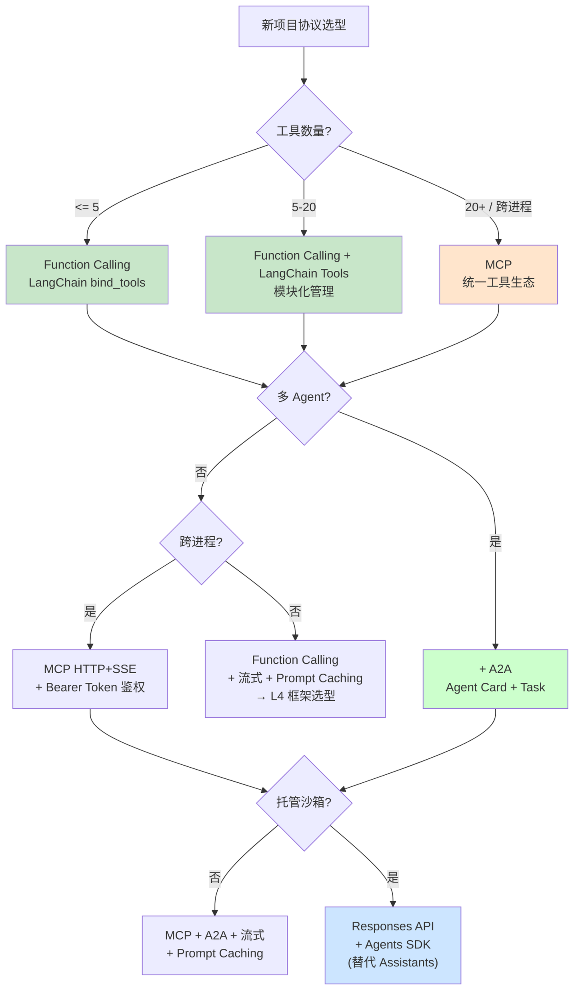

# 3.10 协议选型决策树

> 🟢 核心

> **本节钩子**：选 Function Calling 还是 MCP 还是 A2A？**反直觉的答案**：**80% 场景选 Function Calling 就对了**——它是协议栈最底层的"模型能力"，MCP 和 A2A 都是在它之上构建的。**盲目追新（"我们必须用 MCP / A2A"）是协议选型最常见的误区**。本文给一个 4 步决策树：**工具数 → 跨进程 → 多 Agent → 托管需求**，逐步收敛到合适的协议栈。

## 正文大纲

1. **一句话定义**：协议选型 = 根据"工具数量、跨进程、多 Agent 协作、托管需求"四个维度，**从简到繁**选择协议栈。**核心理念**：**从最简单协议起步，按需升级**——而不是"项目一开始就上最复杂的协议栈"。
2. **关键机制（4 步决策树）**
   - **Step 1：工具数量**
     - **≤ 5 个工具 + 单进程** → **Function Calling**（LangChain `bind_tools()` 一行搞定）
     - **5-20 个工具** → **Function Calling + LangChain Tools**（模块化）
     - **20+ 个工具 / 跨进程** → **MCP**（统一工具生态）
   - **Step 2：跨进程**
     - **单进程 / 单机** → Function Calling 足够
     - **跨机器 / 多用户** → **MCP HTTP+SSE**（生产级）
   - **Step 3：多 Agent 协作**
     - **单 Agent** → 不需要 A2A
     - **多 Agent（找专家）** → **A2A**（Agent Card + Task）
   - **Step 4：托管执行环境**
     - **不需要托管** → 自建（Function Calling + MCP + 自管 Code Interpreter）
     - **需要托管**（沙箱 / 文件持久化）→ **OpenAI Responses API + Agents SDK**（Code Interpreter 内置）——**Assistants 2026 弃用，不要用**
3. **反直觉结论**：
   - **80% 场景选 Function Calling**：它是协议栈最底层，所有上层协议都依赖它。**盲目上 MCP / A2A 是过度设计**。
   - **协议栈不是"选一个"，是"按需组合"**：典型生产架构 = **Function Calling + MCP + 流式 + Prompt Caching**。
   - **A2A 还在快速迭代期（2025-06）**：**生产用 A2A v0.3+ 稳定版**，避免 v0.1/v0.2 实验性 API。
4. **代码示例**：写一个"协议选型决策树"函数，根据项目特征返回推荐的协议栈。
5. **常见误区**：
   - ❌ "新项目必须用最新协议"——**错**。Function Calling 2026 仍是基础协议，**盲目追新增加复杂度**。
   - ❌ "MCP 一定比 Function Calling 好"——**错**。MCP 适合 20+ 工具统一管理，**3 个工具用 MCP 是杀鸡用牛刀**。
   - ✅ "从简到繁，按需升级"——这是协议选型的黄金法则。
6. **横向对比**：
   - **Function Calling vs MCP**：3 个工具用 FC，30 个工具用 MCP；
   - **MCP vs A2A**：MCP 管工具，A2A 管 Agent；
   - **Responses API vs Assistants**：新项目 Responses，Assistants 2026 弃用；
   - **自建 vs 托管**：性能 / 灵活 vs 省心 / 锁定。

## 图

- **主图 1**：协议选型决策树 + 4 场景对比表



- **辅助理解**：注意决策树**从简到繁**——先看工具数量，再看多 Agent，再看跨进程，最后看托管。**80% 场景在第二步就结束（Function Calling + LangChain）**，不需要 MCP / A2A。

## 代码

```python
"""
protocol_selector.py
协议选型决策树
根据项目特征返回推荐的协议栈
"""
from dataclasses import dataclass
from typing import Optional

@dataclass
class ProjectContext:
    num_tools: int
    num_agents: int = 1
    cross_machine: bool = False
    needs_sandbox: bool = False
    is_experimental: bool = False

@dataclass
class ProtocolStack:
    protocols: list
    reasoning: str
    version_notes: str

def select_protocol_stack(ctx: ProjectContext) -> ProtocolStack:
    """根据项目上下文返回协议栈"""
    stack = []
    reasons = []

    # Step 1: 工具数量
    if ctx.num_tools <= 5:
        stack.append("Function Calling")
        reasons.append(f"工具少 ({ctx.num_tools})，Function Calling 够用")
    elif ctx.num_tools <= 20:
        stack.append("Function Calling")
        stack.append("LangChain Tools")
        reasons.append(f"工具中量 ({ctx.num_tools})，FC + 模块化")
    else:
        stack.append("MCP")
        reasons.append(f"工具多 ({ctx.num_tools})，MCP 统一管理")

    # Step 2: 跨进程
    if ctx.cross_machine and "MCP" not in stack:
        stack.append("MCP HTTP+SSE")
        reasons.append("跨机器，用 MCP HTTP+SSE")
    elif ctx.cross_machine:
        reasons.append("跨机器，MCP 用 HTTP+SSE 模式")

    # Step 3: 多 Agent
    if ctx.num_agents > 1:
        stack.append("A2A (v0.3+)")
        reasons.append(f"多 Agent ({ctx.num_agents})，用 A2A 协作")

    # Step 4: 托管沙箱
    if ctx.needs_sandbox:
        stack.append("Responses API")
        reasons.append("需要托管沙箱，用 Responses API（不选 Assistants，已弃用）")

    # 通用：流式 + 缓存（除非 experimental）
    if not ctx.is_experimental:
        stack.append("流式 (SSE)")
        stack.append("Prompt Caching (Anthropic) / Automatic Caching (OpenAI)")
        reasons.append("生产必备：流式 + 缓存")

    # 版本说明
    version_notes = """
    - Function Calling: OpenAI 2023-06 / Anthropic Tool Use 2023-10
    - MCP: Anthropic 2024-11 GA, v1.0+ 稳定
    - A2A: Google 2025-04, v0.3+ 生产可用
    - Responses API: OpenAI 2025-03, 主推方向
    - Assistants API: OpenAI 2023-11, 2026 年底弃用
    """

    return ProtocolStack(
        protocols=stack,
        reasoning=" → ".join(reasons),
        version_notes=version_notes,
    )

# ========== 实战场景测试 ==========
scenarios = [
    ("MVP 单 Agent 简单工具", ProjectContext(num_tools=3)),
    ("生产客服多工具", ProjectContext(num_tools=15)),
    ("企业内部 Agent 工具集", ProjectContext(num_tools=50, cross_machine=True)),
    ("多 Agent 协作系统", ProjectContext(num_tools=20, num_agents=5)),
    ("代码执行 + 数据库", ProjectContext(num_tools=10, needs_sandbox=True)),
    ("生产级多 Agent + 沙箱", ProjectContext(num_tools=30, num_agents=3, cross_machine=True, needs_sandbox=True)),
]

for name, ctx in scenarios:
    result = select_protocol_stack(ctx)
    print(f"\n=== {name} ===")
    print(f"协议栈: {result.protocols}")
    print(f"理由: {result.reasoning}")
```

跑完你会看到——**6 个场景的协议栈完全不同**，从最简单的 Function Calling（3 个工具）到最复杂的 MCP + A2A + Responses + 流式 + 缓存（30 工具 + 3 Agent + 跨机器 + 沙箱）。**重点：从简到繁，按需升级**。

## 实战片段

真实工程里"协议选型"往往发生在**项目初期 1-2 周**，决策错了要付出 3-6 个月重构代价。下面用 **LangChain Agents SDK** 演示一个"协议无关"的写法——**今天选 FC，明天换 MCP，不用改业务代码**：

```python
# protocol_agnostic_agent.py
"""
协议无关的 Agent 写法：今天用 Function Calling，明天换 MCP 不改业务代码
"""
from langchain_core.tools import tool
from langchain_openai import ChatOpenAI
from langchain.agents import create_agent

# 1) 定义工具（协议无关）
@tool
def get_weather(city: str) -> str:
    """查询城市天气"""
    return f"{city}: 晴 25°C"

@tool
def query_db(sql: str) -> str:
    """查询数据库"""
    return f"[DB] {sql} → 5 条结果"

# 2) LLM + 工具（今天用 FC，明天换 MCP 不用改这层）
llm = ChatOpenAI(model="gpt-4o", api_key="sk-...")

# 3) 创建 Agent（langchain 1.0+ create_agent 自动处理协议转换）
agent = create_agent(
    model=llm,
    tools=[get_weather, query_db],
    # system prompt 可选
    system_prompt="你是多功能 Agent。",
)

# 4) 调用（协议无关）
result = agent.invoke({"messages": [{"role": "user", "content": "北京天气怎么样？"}]})
print(result)

# ========== 升级路径：从 FC 到 MCP ==========
# 假设未来工具数到 20+，需要换成 MCP：

"""
# 步骤 1：写 MCP server（一次性）
mcp_server.py  # 暴露 get_weather 和 query_db 作为 MCP tools

# 步骤 2：业务代码不变，只改 LLM 客户端
from langchain_mcp import MCPToolkit

toolkit = MCPToolkit(server_command=["python", "mcp_server.py"])
mcp_tools = await toolkit.get_tools()

agent = create_agent(
    model=llm,
    tools=mcp_tools,  # ← 只改这一行，工具从 MCP 来而不是 FC
    system_prompt="...",
)
# 业务代码 0 改动
"""

# ========== 实战选型 Checklist ==========
SELECTION_CHECKLIST = """
✅ 协议选型 Checklist（项目启动第 1-2 周必过一遍）：

□ 工具数量（≤5 / 5-20 / 20+）
□ 是否需要跨进程（单进程 / 跨机器）
□ 是否需要多 Agent 协作（单 Agent / 找专家 / 流水线）
□ 是否需要托管沙箱（不需要 / 需要 Code Interpreter / 需要 Docker）
□ 性能要求（TTFT p95 < 500ms / < 1s / < 2s）
□ 缓存需求（命中率预期 < 30% / 30-70% / > 70%）
□ 监控需求（TTFT / 命中率 / 工具成功率 / Token 成本）

常见错误：
❌ 项目初期就上 MCP（工具只有 3 个）
❌ 项目初期就上 A2A（只有 1 个 Agent）
❌ 用 Assistants API（2026 弃用）
❌ 不用流式（用户体验差）
❌ 不用缓存（成本高 + 延迟大）
"""

print(SELECTION_CHECKLIST)
```

实战要点：
1. **从简到繁**——3 个工具用 FC，20+ 工具用 MCP；
2. **协议无关写法**——LangChain `create_agent()` + `bind_tools()` 让 FC / MCP / A2A 切换零成本；
3. **不要用 Assistants**——2026 弃用，新项目用 Responses API；
4. **A2A 选 v0.3+**——v0.1/v0.2 是实验性 API；
5. **流式 + 缓存是生产必备**——除非 experimental，否则必须开。

## 自测题

1. **概念辨析**：协议选型决策树的 4 个步骤是什么？为什么说"80% 场景在第二步就结束（Function Calling）"？
2. **场景判断**：你的项目要做一个企业内部知识库问答 Agent，工具包括：① 查 Wiki（内部 API）；② 查员工信息（HR 系统 API）；③ 查工单系统 API；④ 查 Slack 历史。下面哪个协议栈**最合适**？
   - A. Function Calling + LangChain
   - B. MCP + 自管 HTTP server
   - C. Assistants API（OpenAI 托管）
   - D. A2A + Function Calling
3. **代码补全**：补全下面协议选型函数：
   ```python
   def select_protocol_stack(num_tools: int, num_agents: int) -> list:
       stack = []
       if num_tools <= 5:
           stack.append("Function Calling")
       elif num_tools <= 20:
           stack.append("Function Calling")
       stack.append("LangChain Tools")
       else:
           stack.append(???)  # TODO: 工具多用啥？
       if num_agents > 1:
           stack.append(???)  # TODO: 多 Agent 用啥？
       return stack
   ```
4. **反直觉题**：有人说"新项目必须用最新协议（MCP + A2A），Function Calling 已经过时"。这个说法对吗？请举出至少 3 个 2026 年仍然必须用 Function Calling 的场景。
5. **架构题**：你的项目 2025-06 启动，预计 2 年，要支持：① 30 个本地工具（MCP 接入）；② 5 个外部 Agent 协作（A2A）；③ Code Interpreter 沙箱（Responses API）；④ 高 TTFT（流式 + 缓存）。请画出完整的协议栈，并说明每层协议解决什么问题、为什么必须。

**答案**：1. 4 步：① **工具数量**（≤5 FC，5-20 FC+LangChain，20+ MCP）；② **跨进程**（单进程 FC，跨机器 MCP HTTP+SSE）；③ **多 Agent**（单 Agent 不要 A2A，多 Agent 加 A2A）；④ **托管沙箱**（自管 vs Responses API）。80% 场景在第二步结束：大多数项目工具 ≤ 5 个、单进程、单 Agent，**FC 就够了**。2. **A 最合适**。4 个内部 API + 单 Agent + 不需要沙箱 + 工具 < 5 个 → Function Calling + LangChain 完美。B MCP 杀鸡用牛刀；C Assistants 2026 弃用；D A2A 单 Agent 不需要。3. 答案：`"MCP"`, `"A2A (v0.3+)"`。4. **错**。2026 年仍必须用 Function Calling：① **简单 1-3 工具**（MCP 过度设计）；② **跨厂商模型**（Claude / Gemini 都支持 FC）；③ **极低延迟场景**（FC 比 MCP 少一层协议栈）；④ **LangChain Agents SDK 内部**默认走 Function Calling；⑤ **OpenAI Responses API 工具调用**也是 Function Calling 协议（换了个名字）。5. 协议栈（自底向上）：① **Function Calling**（模型能力层，所有上层协议基础）→ 解决"模型怎么调工具"；② **MCP**（工具生态层，30 个工具统一管理）→ 解决"工具碎片化"；③ **A2A**（Agent 协作层，5 个外部 Agent 协作）→ 解决"找专家"；④ **Responses API**（托管沙箱层，Code Interpreter 跑代码）→ 解决"代码执行安全"；⑤ **流式 SSE**（用户体验层，TTFT < 500ms）→ 解决"用户感知慢"；⑥ **Prompt Caching**（成本层，命中率 > 70%）→ 解决"成本 + 延迟"。**关键**：**协议栈不是"选一个"，是"按需叠加"**——6 层协议共存，每层解决不同问题，缺一不可。

> 📚 本节参考
> - [S 级] OpenAI, *Function Calling Guide* — https://platform.openai.com/docs/guides/function-calling （Function Calling 协议选型基础）
> - [S 级] Anthropic, *Model Context Protocol Specification* — https://modelcontextprotocol.io/introduction （MCP 协议选型决策）
> - [S 级] Google, *A2A Protocol* — https://github.com/google/A2A （A2A 协议选型决策）
> - [A 级] LangChain Agents Documentation — https://docs.langchain.com/oss/python/langchain/agents （LangChain Agents SDK 协议无关写法）
> - [A 级] Lilian Weng, *LLM Powered Autonomous Agents* — https://lilianweng.github.io/posts/2023-06-23-agent/ （协议选型的总体框架）