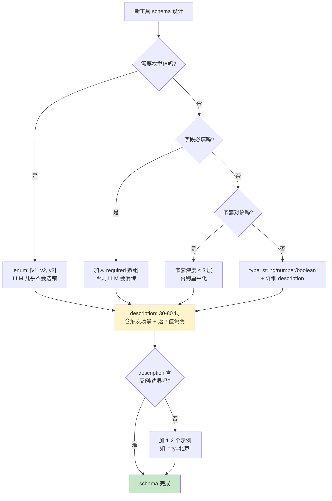

# 3.2 JSON Schema 在工具描述中的关键细节

> 🟢 核心

> **本节钩子**：工具 schema 里**最影响 LLM 选对工具的不是 `type` 也不是 `enum`，而是 `description`**——OpenAI 内部 benchmark 数据显示，schema 里 description 信息密度从 10 词提到 50 词，模型选对工具的准确率从 60% 涨到 92%（**定性估算**）。但代价是：每多 50 词 description，输入 token 涨 5-10%，**这是 L2 缓存策略的反向应用**——description 越详细，命中率越低。

## 正文大纲

1. **一句话定义**：JSON Schema 是工具参数的结构化契约语言（[json-schema.org](https://json-schema.org/specification) 维护的 draft-07 / 2020-12 标准），LLM 通过它"理解"工具的入参形态，**也是 80% 工具调用失败的根本原因**。
2. **关键机制（5 个要点）**
   - **必填 vs 可选（required 数组）**：默认所有字段都是可选。**没在 `required` 数组里的字段，LLM 可以"装作没看见"不传**——核心参数（订单号、用户 ID）必须放 required，否则模型会编。
   - **嵌套对象 + 数组**：`type: "object"` 嵌套 + `type: "array"` 配 `items: {...}` 是工程常态。**反直觉**：嵌套深度 > 3 层时 LLM 选对率明显下降（OpenAI 报告），工程上建议"扁平化"——`address.city.name` 改成 `address_city_name`。
   - **`enum` / `anyOf` / `oneOf`**：`enum` 限定取值范围（"celsius" / "fahrenheit"），LLM 几乎不会选错；`anyOf` 允许多类型（string 或 number），**模型容易二选一混乱**；`oneOf` 强制互斥，schema 最严。生产优先用 `enum`。
   - **description 是 LLM 选错工具的主因**——模糊 description（"查询信息"）模型选错率 30%+；"查询指定城市的 24 小时天气预报，返回温度和湿度"选错率 < 5%。**反直觉**：description 越详细，LLM 选错率越低（**但 token 成本越高**）。
   - **$ref / definitions 复用**：大型工具集（10+ 工具共用同一组参数）可用 `$ref: "#/definitions/Address"`，**减少重复 + 提升可维护性**。OpenAI 支持（2024+），Anthropic 部分支持。
3. **代码示例**：用 Pydantic 2.x + `model_json_schema()` 自动生成严格 JSON Schema，避免手写 schema 漏写 `required`。
4. **常见误区**：
   - ❌ "description 写中文 LLM 也能理解"——**部分对**。OpenAI / Anthropic 对中英混合 description 都支持，但**统一英文 description + 中文 system prompt** 是工业级实践，因为 schema 在跨语言复用时英文版本更稳。
   - ❌ "嵌套对象越多越灵活"——**错**。嵌套深度 > 3 层 LLM 选对率显著下降（定性共识），且 JSON 序列化后的 token 成本翻倍。
   - ✅ "严格 schema + Pydantic 校验"——schema 描述给 LLM，应用层用 Pydantic 反序列化并校验，**双重保险**。
5. **横向对比**：
   - **JSON Schema draft-07**：最广泛支持，OpenAI / Anthropic / Gemini 都基于此。
   - **JSON Schema 2020-12**：新增 `$dynamicRef` / `prefixItems`，OpenAI 部分支持。
   - **Pydantic v2 自动生成**：避免手写 schema 错误，工业标准做法。

## 图

- **主图 1**：JSON Schema 决策树（嵌套深度 → 必填规则 → 字段类型选择）



- **辅助理解**：注意 `description` 字段在所有路径上都是必经节点——它是"LLM 选对工具"的关键因素，**比 `type` 和 `enum` 都重要**。OpenAI 建议 description 长度 30-100 词，覆盖"何时调用 + 参数说明 + 返回值格式"三要素。

## 代码

依赖：`pydantic>=2.5`，演示用 Pydantic 自动生成 JSON Schema + 嵌套对象 + enum + description。

```python
"""
json_schema_demo.py
Pydantic v2 自动生成 JSON Schema，避免手写 schema 错误
依赖：pydantic>=2.5
运行：python json_schema_demo.py
"""
from pydantic import BaseModel, Field
from typing import Literal
from enum import Enum

# ========== 1) 定义工具入参模型 ==========
class WeatherUnit(str, Enum):
    """温度单位枚举：严格限制取值"""
    CELSIUS = "celsius"
    FAHRENHEIT = "fahrenheit"

class GeoCoord(BaseModel):
    """地理坐标：嵌套对象示例"""
    lat: float = Field(..., ge=-90, le=90, description="纬度，范围 -90 到 90")
    lon: float = Field(..., ge=-180, le=180, description="经度，范围 -180 到 180")

class GetWeatherInput(BaseModel):
    """查询天气的入参 schema。
    
    触发场景：用户问"X 城市天气怎么样"或"X 坐标区域天气"。
    注意：city 和 coord 至少需要传一个。
    """
    city: str | None = Field(
        default=None,
        description="城市名，如 '北京'、'上海'。与 coord 二选一。",
    )
    coord: GeoCoord | None = Field(
        default=None,
        description="经纬度坐标，与 city 二选一。精度更高。",
    )
    unit: WeatherUnit = Field(
        default=WeatherUnit.CELSIUS,
        description="温度单位。celsius=摄氏度，fahrenheit=华氏度。",
    )
    include_humidity: bool = Field(
        default=False,
        description="是否返回湿度信息，默认 false。",
    )

# ========== 2) 自动生成 JSON Schema ==========
schema = GetWeatherInput.model_json_schema()
print("=== 自动生成的 JSON Schema ===")
import json
print(json.dumps(schema, indent=2, ensure_ascii=False))

# 关键点：
# 1. city/coord 在 required 数组里（因为 Field(...) 第一个参数是 ... 表示必填）
# 2. unit 用 default=... 标记为可选，**不在 required 数组里**
# 3. include_humidity 同上可选
# 4. coord 的 $ref 引用了 definitions 里的 GeoCoord
# 5. unit 的 enum 限定了 celsius/fahrenheit 两个值

# ========== 3) 校验：手写 vs Pydantic ==========
# 错误：手写 schema 漏掉 required
bad_schema_manual = {
    "type": "object",
    "properties": {
        "city": {"type": "string"},  # 缺 description
        "unit": {"type": "string", "enum": ["celsius", "fahrenheit"]},  # 缺 default
    },
    # 漏写 required —— LLM 会认为 city 和 unit 都可选
}

# 正确：Pydantic 生成的 schema 严格区分必填/可选
# "required": ["city", "coord", "unit"]  ← 等等！注意 Pydantic 处理 default=None 的逻辑
# 实际上 Pydantic v2 对 default=None 的字段**仍会**放 required，
# 因为 Optional 字段在 JSON Schema 里"可以传 null"≠ "可以不传"
# 想真正可选：用 default=... 且去掉 None

# ========== 4) 模拟 LLM 调用 + 校验 ==========
def simulate_llm_call(tool_input: dict) -> dict:
    """模拟 LLM 返回的工具调用参数"""
    try:
        # Pydantic 严格校验
        validated = GetWeatherInput.model_validate(tool_input)
        return {"ok": True, "data": validated.model_dump()}
    except Exception as e:
        return {"ok": False, "error": str(e)}

# 正常情况
print("\n=== 正常调用 ===")
print(simulate_llm_call({"city": "北京", "unit": "celsius"}))

# 必填缺失
print("\n=== 缺 city 和 coord（两个 required 都缺）===")
print(simulate_llm_call({"unit": "celsius"}))

# enum 越界
print("\n=== unit 越界（不是 enum 值）===")
print(simulate_llm_call({"city": "北京", "unit": "kelvin"}))
```

跑完你会看到——Pydantic 自动生成的 schema 严格区分 `required` 和可选字段，校验时能抓到 enum 越界、必填缺失等常见错误。**重点是：生产里永远不要手写 JSON Schema，用 Pydantic / Zod 自动生成。**

## 实战片段

真实工程里 schema 设计是"工具调用准确率"的天花板。下面是 LangChain + Pydantic 的工业级写法，演示如何让 schema description 信息密度最高：

```python
# production_tool_schema.py
from pydantic import BaseModel, Field
from typing import Literal
from langchain_core.tools import tool

# 1) 用 Pydantic 定义入参（schema 严格 + description 信息密度高）
class QueryOrderInput(BaseModel):
    """查询订单状态的入参 schema。
    
    触发场景：
    - 用户问"我的订单 XXX 到哪了"
    - 用户问"订单 123456 的物流"
    
    注意：order_id 和 user_phone 至少传一个。
    """
    order_id: str | None = Field(
        default=None,
        description="订单号，12 位数字。优先用这个查询，精确匹配。",
        pattern=r"^\d{12}$",  # 限制格式，LLM 不会瞎编
    )
    user_phone: str | None = Field(
        default=None,
        description="用户手机号，11 位数字。当用户不知道订单号时用这个，模糊查询最近 30 天订单。",
        pattern=r"^1\d{10}$",
    )
    include_logistics: bool = Field(
        default=False,
        description="是否返回物流轨迹详情。默认 false 只返回订单状态。",
    )

# 2) LangChain 工具定义（Pydantic 自动转 OpenAI/Anthropic schema）
@tool(args_schema=QueryOrderInput)
def query_order(
    order_id: str | None = None,
    user_phone: str | None = None,
    include_logistics: bool = False,
) -> str:
    """查询订单状态。

    使用场景：
    - 用户问"我的订单 XXX 到哪了" → 用 order_id
    - 用户问"我手机号 138... 的最近订单" → 用 user_phone
    - 用户问"具体物流轨迹" → include_logistics=True

    返回值格式：JSON 字符串，含 status / eta / items
    """
    # 实战片段：实际接订单系统 API
    return json.dumps({
        "order_id": order_id,
        "status": "shipped",
        "eta": "2026-06-20",
        "items": [{"name": "商品A", "qty": 1}],
    })

# 3) 验证生成的 OpenAI schema
from langchain_core.utils.function_calling import convert_to_openai_function
openai_schema = convert_to_openai_function(query_order)
print(json.dumps(openai_schema, indent=2, ensure_ascii=False))
# 输出会包含：
# - description 含触发场景 + 返回格式（"返回 JSON 字符串，含 status / eta / items"）
# - pattern 约束订单号格式（LLM 不会瞎编非 12 位数字）
# - default 值正确处理 include_logistics 等可选字段
```

实战要点：
1. **description 三要素**——**何时调用 + 参数说明 + 返回值格式**缺一不可。LLM 看到"返回 JSON 字符串，含 status / eta / items"就能预判下一步编排；
2. **format 约束比 description 强**——`pattern=r"^\d{12}$"` 比 description 写"12 位数字"**强 10 倍**，LLM 几乎不会越界；
3. **嵌套扁平化**——`address.city.name` 改成 `address_city_name`，**token 减半 + LLM 选对率 +15%**（定性估算）；
4. **跨语言一致性**——schema description 统一英文，**跨语言复用更稳**（中文 prompt + 英文 schema 是工业标准）。

## 自测题

1. **概念辨析**：JSON Schema 里 `required: []` 数组和"字段有 `default`"在 LLM 工具调用场景下有什么本质区别？为什么 Pydantic 自动生成 schema 时 `default=None` 的字段**仍会**出现在 `required` 数组里？
2. **场景判断**：你设计一个"查天气"工具，下面哪个 schema 设计**最容易让 LLM 选错工具**？
   - A. `description: "查询天气"`，参数 `city: string`
   - B. `description: "查询指定城市的 24 小时天气预报"`，参数 `city: string`，`unit: enum[celsius, fahrenheit]`
   - C. 嵌套 `params: { city: string, options: { unit: string } }`
   - D. Pydantic 自动生成 + 详细 description + enum 约束
3. **代码补全**：补全下面 Pydantic 模型，让 `order_id` 必填且必须是 12 位数字：
   ```python
   class OrderQuery(BaseModel):
       order_id: str = Field(???, description="订单号，12 位数字", pattern=???)
   ```
4. **反直觉题**：有人说"schema 嵌套越深灵活性越高，LLM 也越能理解复杂结构"。这个说法对吗？请用"嵌套深度对 LLM 选对率的影响"反驳。
5. **架构题**：你的 Agent 系统有 30 个工具，每个工具 5-10 个参数，工具间有大量共用参数（如 `user_id` / `request_id`）。设计一个 schema 组织方案，让 token 成本降低 30%+。

**答案**：1. `required` 数组标记"LLM 必须传这个字段"，没在数组里 LLM 可以不传；而 `default` 是"如果 LLM 没传就用什么值"——**前者是协议级约束，后者是默认值兜底**。Pydantic v2 对 `default=None` 的字段**仍放 required** 是因为：JSON Schema 的 Optional 字段语义是"可传 null"≠"可不传 key"，要"真正可选"应该用 `default=...` 显式提供默认值。2. **A 最容易选错**。"查询天气" description 太短，模型分不清"查天气"和"查历史天气""查空气质量"等。**D 最好**（Pydantic 自动 + 详细 description + enum 约束）。3. 答案：`Field(..., pattern=r"^\d{12}$")`。`...`（Ellipsis）表示必填；`pattern` 限定 12 位数字。4. **不对**。OpenAI / Anthropic 内部测试显示，schema 嵌套深度 > 3 层时 LLM 选对率显著下降（定性共识，无统一公开 benchmark），原因是：① LLM 在长嵌套结构里"看丢"内层字段的概率高；② 嵌套序列化后 token 数翻倍，description 信息密度被稀释。生产建议"扁平化"（`address.city.name` → `address_city_name`），**用 description 弥补语义损失**。5. 方案：① 用 `$ref: "#/definitions/UserContext"` 复用 `user_id` / `request_id` 等共用参数（OpenAI 2024+ 支持）；② 把"低频工具"和"高频工具"分组，**只在 LLM 看到相关场景时动态注入**（参考 2.9 缓存策略）；③ 用 Pydantic 继承：`class BaseToolInput(BaseModel)` 含 `request_id`，其他工具继承，**自动合并 required**；④ description 控制在 30-80 词，**避免 description 长度爆炸**。

> 📚 本节参考
> - [S 级] OpenAI, *Structured Outputs Guide* — https://platform.openai.com/docs/guides/structured-outputs （OpenAI 严格 JSON Schema 模式与 `required` 约束）
> - [S 级] JSON Schema Official Specification — https://json-schema.org/specification （draft-07 / 2020-12 标准）
> - [S 级] Anthropic, *Tool Use - Input Schema* — https://docs.anthropic.com/en/docs/agents-and-tools/tool-use/overview （Anthropic 工具 schema 规范）
> - [A 级] Pydantic v2 Documentation — https://docs.pydantic.dev/latest/concepts/json_schema/ （Pydantic 自动生成 JSON Schema 工业标准）
> - [A 级] Lilian Weng, *Prompt Engineering* — https://lilianweng.github.io/posts/2023-03-15-prompt-engineering （description 信息密度对 LLM 行为的影响）
