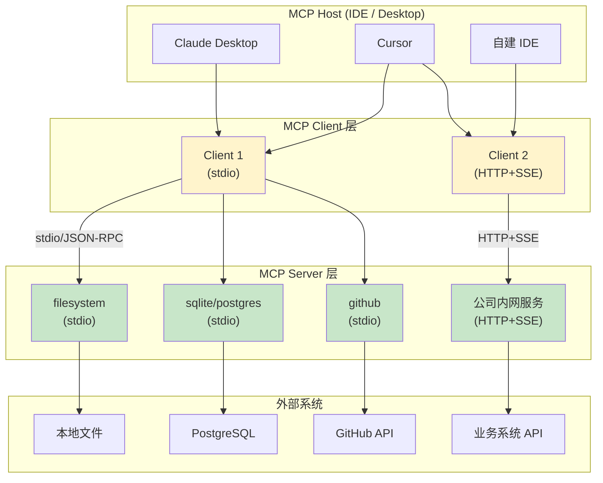

# 3.4 MCP Server 实战：让 Agent 接入 IDE / DB / GitHub

> 🟡 进阶

> **本节钩子**：写一个 MCP server 接入 Cursor 不超过 50 行代码——但**反直觉**的是：80% 的工程坑不在 MCP 协议本身，而在**传输层选型**（stdio vs HTTP+SSE）和**安全沙箱**（filesystem 限制目录、DB 用只读账号、GitHub 用 fine-grained token）。选错传输层 → 生产部署踩坑；忽视沙箱 → 一次 Prompt Injection 就被删库。

## 正文大纲

1. **一句话定义**：MCP Server 实战 = 用 `mcp` Python SDK 写一个符合 JSON-RPC 2.0 协议的服务端，**让任何 MCP Host（Claude Desktop / Cursor / 自建 IDE）通过标准协议接入**。3.3 讲协议，3.4 讲落地。
2. **关键机制（5 个要点）**
   - **stdio 模式（默认）**：server 作为子进程跑在 host 内部，stdin/stdout 走 JSON-RPC。**优点**：零网络配置、启动快、适合本地工具。**缺点**：不能跨机器、不能水平扩展。**适用**：filesystem / git / 本地 CLI 工具。
   - **HTTP+SSE 模式（生产）**：server 独立部署为 HTTP 服务，client 用 Server-Sent Events 接收消息。**优点**：可跨机器、可水平扩展、可观测（metrics / log）。**缺点**：要处理鉴权、TLS、负载均衡。**适用**：公司内网共享服务、多租户 SaaS。
   - **三个官方 server 示例**：`@modelcontextprotocol/server-filesystem`（文件读写）、`@modelcontextprotocol/server-postgres`（只读 SQL 查询）、`@modelcontextprotocol/server-github`（PR/Issue 操作）。**生产里 90% 场景用这三个起步**。
   - **Cursor 集成**：Cursor 内置 MCP client，在 `~/.cursor/mcp.json` 配置 server 即可。**注意**：Cursor 0.45+ 支持 MCP 资源列表，0.40+ 支持 tools 调用。
   - **Claude Desktop 集成**：编辑 `~/Library/Application Support/Claude/claude_desktop_config.json`（macOS）或 `%APPDATA%\Claude\claude_desktop_config.json`（Windows），重启 Claude Desktop 即生效。
3. **代码示例**：用 `mcp` Python SDK 写一个 "SQLite 数据库查询 server"，暴露 `query` 和 `list_tables` 两个工具，运行在 stdio 模式。
4. **常见误区**：
   - ❌ "stdio 模式也能上生产"——**部分对**。stdio 适合单机本地，**生产多用户多机用 HTTP+SSE**。
   - ❌ "MCP server 不需要鉴权"——**错**。HTTP+SSE 模式必须加 Bearer Token / OAuth，**否则任何人都能调你的 server**。
   - ✅ "先用官方 server 起步"——`@modelcontextprotocol/server-*` 覆盖 80% 场景，自定义 server 只解决 20% 长尾需求。
5. **横向对比**：
   - **stdio vs HTTP+SSE**：单机本地 vs 多机远程；
   - **官方 server vs 自定义 server**：80% 场景 vs 20% 长尾；
   - **Cursor vs Claude Desktop vs 自建 IDE**：商业 IDE vs 商业 IDE vs 内部系统——**MCP 协议统一三者的工具接入**。

## 图

- **主图 1**：MCP Client-Server 架构 + IDE 集成示意图



- **辅助理解**：注意 stdio 模式的 server 是**进程内**的（IDE 启动子进程），HTTP+SSE 模式的 server 是**独立服务**（部署在 K8s / VM）。**生产架构：stdio 跑 80% 短平快工具，HTTP+SSE 跑 20% 重量级共享服务**。

## 代码

依赖：`mcp>=1.0`，演示一个 SQLite 数据库查询 MCP server。运行：`python sqlite_mcp_server.py`

```python
"""
sqlite_mcp_server.py
SQLite 数据库查询 MCP server，暴露 query 和 list_tables 两个工具
依赖：mcp>=1.0
运行：python sqlite_mcp_server.py
"""
import asyncio
import sqlite3
from pathlib import Path
from mcp.server import Server
from mcp.server.stdio import stdio_server
from mcp.types import Tool, TextContent

app = Server("sqlite-mcp-server")
DB_PATH = Path("./example.db")  # ⚠️ 生产用绝对路径 + 只读账号

# 1) 注册工具：list_tables
@app.list_tools()
async def list_tools() -> list[Tool]:
    return [
        Tool(
            name="list_tables",
            description="列出数据库中所有表名",
            inputSchema={"type": "object", "properties": {}},
        ),
        Tool(
            name="query",
            description="执行 SQL 查询（仅 SELECT）",
            inputSchema={
                "type": "object",
                "properties": {
                    "sql": {
                        "type": "string",
                        "description": "SQL 查询语句，必须是 SELECT",
                    },
                },
                "required": ["sql"],
            },
        ),
    ]

# 2) 工具实现：只允许 SELECT，防止 LLM 误删
ALLOWED_PREFIXES = ("SELECT", "WITH")

def is_safe_sql(sql: str) -> bool:
    sql_upper = sql.strip().upper()
    return any(sql_upper.startswith(p) for p in ALLOWED_PREFIXES)

@app.call_tool()
async def call_tool(name: str, arguments: dict) -> list[TextContent]:
    if name == "list_tables":
        with sqlite3.connect(DB_PATH) as conn:
            rows = conn.execute(
                "SELECT name FROM sqlite_master WHERE type='table'"
            ).fetchall()
        tables = ", ".join(r[0] for r in rows)
        return [TextContent(type="text", text=f"Tables: {tables or 'none'}")]

    if name == "query":
        sql = arguments["sql"]
        if not is_safe_sql(sql):
            return [TextContent(
                type="text",
                text=f"Error: 仅允许 SELECT/WITH 查询，禁止 {sql[:20]}...",
            )]
        try:
            with sqlite3.connect(DB_PATH) as conn:
                rows = conn.execute(sql).fetchall()
                cols = [d[0] for d in conn.execute(sql).description]
            result = "\n".join(
                ",".join(cols) + "\n" +  # header
                "\n".join(",".join(str(c) for c in row) for row in rows)
            )
            return [TextContent(type="text", text=result or "(empty result)")]
        except Exception as e:
            return [TextContent(type="text", text=f"Error: {e}")]

    raise ValueError(f"Unknown tool: {name}")

async def main():
    async with stdio_server() as (read_stream, write_stream):
        await app.run(read_stream, write_stream, app.create_initialization_options())

if __name__ == "__main__":
    asyncio.run(main())

# 配置文件（Cursor）：~/.cursor/mcp.json
# {
#   "mcpServers": {
#     "sqlite": {
#       "command": "python",
#       "args": ["/path/to/sqlite_mcp_server.py"]
#     }
#   }
# }
```

跑完你会看到——Cursor / Claude Desktop 通过 stdio 启动这个 server，调用 `list_tables` 拿到表名，调 `query` 跑 SQL（带 SELECT 限制防删库）。**重点：生产里必须加 SQL 注入防护 + 只读账号**。

## 实战片段

真实工程里"接 GitHub MCP server"是最常见需求——下面演示如何配置 GitHub MCP server，并展示三个高频工具的典型用法：

```python
# github_mcp_config.py
# GitHub MCP server 配置（Claude Desktop 配置文件）
# 文件位置（macOS）: ~/Library/Application Support/Claude/claude_desktop_config.json
# 文件位置（Windows）: %APPDATA%\Claude\claude_desktop_config.json

github_mcp_config = {
    "mcpServers": {
        "github": {
            "command": "npx",
            "args": ["-y", "@modelcontextprotocol/server-github"],
            "env": {
                # ⚠️ 实战片段，需 API key
                # 用 GitHub Fine-grained Token，限定 repo 范围，最小权限
                "GITHUB_PERSONAL_ACCESS_TOKEN": "github_pat_xxx",
            },
        },
    }
}

# 三个高频工具用法（在 Cursor/Claude Desktop 里说自然语言即可）
# 1) "看 PR #123 改了什么"
#    → LLM 调 list_pull_requests / get_pull_request_files
# 2) "给 PR #123 写代码评审"
#    → LLM 调 get_pull_request_diff + create_issue_comment
# 3) "把 issue #456 分配给 @alice"
#    → LLM 调 update_issue (assignees: ["alice"])

# ========== 实战 HTTP+SSE 模式 ==========
# 写一个 HTTP+SSE 模式的 MCP server（公司内网共享服务）
# （下面会单独拆出一个独立的 python 代码块展示完整实现）
github_http_sse_hint = "完整 HTTP+SSE server 见下方独立代码块"
```

下面是 **HTTP+SSE 模式的 MCP server** 完整实现——公司内网共享服务场景：

```python
"""
http_sse_mcp_server.py
依赖：mcp>=1.0, starlette, uvicorn
运行：python http_sse_mcp_server.py
"""
import asyncio
from mcp.server import Server
from mcp.server.sse import SseServerTransport
from starlette.applications import Starlette
from starlette.routing import Mount, Route
from starlette.responses import Response
import uvicorn

app = Server("http-sse-mcp-server")

@app.list_tools()
async def list_tools():
    from mcp.types import Tool
    return [Tool(name="ping", description="心跳检测", inputSchema={"type": "object"})]

@app.call_tool()
async def call_tool(name: str, arguments: dict):
    from mcp.types import TextContent
    if name == "ping":
        return [TextContent(type="text", text="pong")]
    raise ValueError(name)

# SSE 传输层（生产里加 Bearer Token 鉴权）
sse = SseServerTransport("/messages/")

async def handle_sse(request):
    async with sse.connect_sse(request.scope, request.receive, request._send) as streams:
        await app.run(streams[0], streams[1], app.create_initialization_options())
    return Response()

starlette_app = Starlette(routes=[
    Route("/sse", endpoint=handle_sse),
    Mount("/messages/", app=sse.handle_post_message),
])

if __name__ == "__main__":
    # 实战片段：绑 0.0.0.0 + 鉴权中间件 + HTTPS
    uvicorn.run(starlette_app, host="127.0.0.1", port=8000)
    # 客户端连接：SSEEndpoint("http://127.0.0.1:8000/sse")
```

实战要点：
1. **stdio 起步**：本地工具 80% 用 stdio，配置简单（改 json 文件即可）；
2. **GitHub token 用 fine-grained**：限定 repo + 限定权限（read-only / write），**不要用 classic token**；
3. **HTTP+SSE 必加鉴权**：Bearer Token / mTLS / OAuth，**否则 MCP server 等于裸奔**；
4. **SQL 防护**：白名单 `SELECT/WITH` 前缀，**别用黑名单**（防不住 `SELECT ... ; DELETE`）；
5. **版本说明**：mcp Python SDK v1.0+（2025-04 稳定版），`@modelcontextprotocol/server-*` v0.5+（2025-04）。
```

实战要点：
1. **stdIO 模式**——本地工具 80% 用 stdio，配置简单（改 JSON 文件即可）；
2. **GitHub token 用 fine-grained**——限定 repo + 限定权限，**不要用 classic token**；
3. **HTTP+SSE 必加鉴权**——Bearer Token / mTLS，**否则 MCP server 等于裸奔**；
4. **SQL 防护**——白名单 `SELECT/WITH`，**别用黑名单**（防不住 `SELECT; DELETE`）。

## 自测题

1. **概念辨析**：stdio 模式和 HTTP+SSE 模式各适合什么场景？为什么说"stdio 跑 80% 短平快工具，HTTP+SSE 跑 20% 重量级共享服务"？
2. **场景判断**：你在公司内部署一个 MCP server 给 50 个开发者用，server 需要访问生产数据库。下面哪个方案**最安全 + 最可维护**？
   - A. stdio 模式 + 每个开发者本地启动 server
   - B. HTTP+SSE 模式 + Bearer Token + DB 只读账号
   - C. HTTP+SSE 模式 + 不加鉴权 + DB 读写账号
   - D. stdio 模式 + 生产 DB 读写账号
3. **代码补全**：补全下面 MCP server 代码，让 `query` 工具拒绝所有非 SELECT 语句：
   ```python
   def is_safe_sql(sql: str) -> bool:
       sql_upper = sql.strip().upper()
       return ???  # TODO: 只允许 SELECT/WITH 前缀
   ```
4. **反直觉题**：有人说"stdio 模式也能上生产，只要加 sandbox"。这个说法对吗？stdIO 模式的根本限制是什么？
5. **架构题**：设计一个"MCP server 接入公司内网 3 个系统（GitLab / Wiki / 工单系统）"的方案，说明传输层选型、鉴权方案、沙箱设计。

**答案**：1. stdio 适合**本地工具**——零网络配置、零攻击面，但**不能跨机器、不能水平扩展**；HTTP+SSE 适合**远程共享服务**——可独立部署、可水平扩展，但要处理鉴权/TLS/可观测。生产 80% 场景用 stdio 跑本地工具（filesystem / git），20% 重量级共享服务（公司内网 API）用 HTTP+SSE。2. **B 最安全 + 最可维护**。A 每个开发者本地启 50 个 server 难管理；C 无鉴权等于裸奔；D stdIO + 读写账号是灾难。3. 答案：`return any(sql_upper.startswith(p) for p in ("SELECT", "WITH"))`。注意是白名单（只允许），不是黑名单。4. **部分对**。stdio 模式可加 sandbox（限制文件系统/网络），但**根本限制是"不能跨机器 + 不能水平扩展"**——多用户多机场景必须用 HTTP+SSE。Sandbox 不能解决"进程隔离"问题（stdio server 跑在 IDE 进程内，崩溃会拖垮 IDE）。5. 方案：① **传输层**：HTTP+SSE（公司内网共享），部署在 K8s；② **鉴权**：OAuth 2.0 + 公司 SSO（每个开发者用自己的账号），server 端用 token 调 GitLab/Wiki/工单 API；③ **沙箱**：① 只读账号（GitLab/Wiki/工单默认是 read scope，**工单系统必须用只读 + 单独审批写 scope**）；② API 调用加 rate limit；③ 审计日志：所有 tool 调用记到 ELK，敏感操作（删 issue）需要二次确认；④ 网络隔离：MCP server 跑在独立 namespace，**不能直接访问生产 DB**。

> 📚 本节参考
> - [S 级] MCP Python SDK — https://github.com/modelcontextprotocol/python-sdk （官方 Python SDK，含 stdio + HTTP+SSE 实现）
> - [S 级] MCP Official Servers — https://github.com/modelcontextprotocol/servers （filesystem / github / postgres / sqlite 等官方实现）
> - [S 级] MCP Specification — Transport — https://modelcontextprotocol.io/docs/getting-started/intro （stdio / HTTP+SSE 传输层规范）
> - [A 级] Lilian Weng, *LLM Powered Autonomous Agents* — https://lilianweng.github.io/posts/2023-06-23-agent/ （MCP server 在 Agent 系统的位置）
> - [A 级] GitHub MCP Server README — https://github.com/modelcontextprotocol/servers/tree/main/src/github （官方 GitHub server 实现源码与配置说明）
