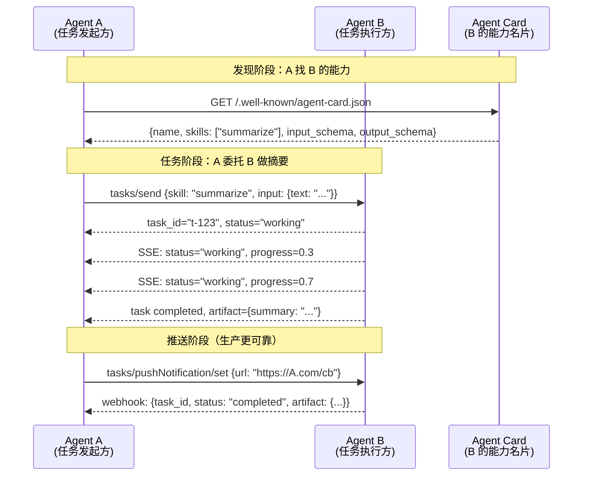

# 3.5 A2A 协议：Agent-to-Agent 通信模型

> 🟡 进阶

> **本节钩子**：Google 2025-04 发布 A2A 协议时，**50+ 公司联名支持**（Atlassian / Salesforce / SAP / ServiceNow 等），目标直指"Agent 互操作"——**反直觉**的是：A2A 解决的不是"Agent 怎么调工具"（那是 MCP 的活），而是"Agent 怎么**找另一个 Agent**并把任务**委托**给它"。Agent A 不需要知道 Agent B 的实现细节，**只看 Agent Card 就能发起任务**。

## 正文大纲

1. **一句话定义**：A2A（Agent-to-Agent）是 Google 2025-04 发布的开放协议，让**异构 Agent 之间互相发现、通信、协作完成任务**，核心三大组件：Agent Card（能力名片）、JSON-RPC 2.0（传输）、Task（任务生命周期）。**与 MCP 互补**：MCP 解决"Agent ↔ 工具"，A2A 解决"Agent ↔ Agent"。
2. **关键机制（5 个要点）**
   - **Agent Card（能力名片）**：每个 Agent 暴露 `/.well-known/agent-card.json`，描述能力、输入输出 schema、认证方式。**类比**：OpenAPI 的 `swagger.json` + 人类简历。**反直觉**：Agent Card 是**机器可读的简历**，让 A 能在不接触 B 代码的情况下"决定要不要委托"。
   - **JSON-RPC 2.0 + HTTP**：A2A 底层用 JSON-RPC 2.0 over HTTP（SSE 用于流式响应），**与 MCP 共享同一套传输层**，server 可复用 MCP 的部署设施。
   - **Task（任务生命周期）**：发起 `tasks/send` → Agent 返回 task object → 通过 SSE 推送 `status: "working" / "completed" / "failed"` → 最终 artifact 在 task 里。**反直觉**：Task 是**有状态的、长时间运行的对象**（与 Function Calling 的一次性调用相反），**适合"研究类"任务**。
   - **流式 + 推送通知**：A2A 支持 SSE 流式更新 task 状态，**也支持 webhook 推送**（`tasks/pushNotification/set`）。**生产里 webhook 比 SSE 可靠**（SSE 长连接易断）。
   - **与 MCP 的关系（核心）**：MCP 让 Agent **用工具**（"我查数据库"），A2A 让 Agent **找专家**（"我找数据分析 Agent"）。**反直觉**：同一件事可以既用 MCP 又用 A2A——A2A server 内部用 MCP server 调工具。
3. **代码示例**：用 `a2a-sdk` Python SDK（v0.1+）写一个最小的 A2A server，暴露 1 个 "summarize_text" 任务能力。
4. **常见误区**：
   - ❌ "A2A = 多 Agent 框架"——**错**。A2A 是**协议**，AutoGen / CrewAI 是**框架**。框架可以用 A2A 协议实现跨厂商 Agent 通信。
   - ❌ "A2A 取代 MCP"——**错**。两者**互补**——A2A 用于 Agent 之间，MCP 用于 Agent 与工具。
   - ✅ "A2A 是 Agent 互操作的'HTTP 协议'"——类比 HTTP 统一了 Web 服务通信，**A2A 想统一 Agent 通信**。
5. **横向对比**：
   - **MCP vs A2A**：Agent ↔ 工具 vs Agent ↔ Agent；
   - **A2A vs OpenAI Assistants**：单厂商托管 vs 跨厂商开放；
   - **A2A vs gRPC / REST**：通用 RPC vs Agent 专用（带 Task 生命周期 + Agent Card）。

## 图

- **主图 1**：A2A 通信时序图（Agent A → Agent B，任务委托 + 流式状态）



- **辅助理解**：注意 Agent Card 是 **A2A 的入口**——A 想要 B 做某件事，**先看 B 的"简历"**（Card），再发起任务（tasks/send），最后等回调（webhook 或 SSE）。**整个流程 A 不需要知道 B 怎么实现**（B 可以是 GPT-4 / Claude / 自建 LLM）。

## 代码

依赖：`a2a-sdk>=0.1`（Google 官方，2025-04 发布），演示一个最小 A2A server。运行：`python minimal_a2a_server.py`

```python
"""
minimal_a2a_server.py
最小 A2A server 示例：暴露 summarize_text 任务能力
依赖：a2a-sdk>=0.1（2025-04 首发）
运行：python minimal_a2a_server.py
"""
import asyncio
from a2a import Agent, AgentCard, Skill, TaskContext
from a2a.server import A2AServer

# 1) 定义 Agent Card（机器可读的简历）
agent_card = AgentCard(
    name="text-summarizer",
    description="文本摘要 Agent，擅长把长文档浓缩成 3 句话",
    skills=[
        Skill(
            id="summarize",
            name="summarize_text",
            description="接收长文本，返回 3 句摘要",
            input_schema={
                "type": "object",
                "properties": {
                    "text": {"type": "string", "description": "要摘要的文本"},
                    "max_sentences": {"type": "integer", "default": 3},
                },
                "required": ["text"],
            },
            output_schema={
                "type": "object",
                "properties": {
                    "summary": {"type": "string"},
                },
            },
        )
    ],
    url="http://localhost:8000",
    version="0.1.0",
)

# 2) 实现任务处理函数
async def handle_summarize(ctx: TaskContext) -> dict:
    text = ctx.input["text"]
    max_sent = ctx.input.get("max_sentences", 3)
    # 实战片段：实际调 LLM API
    summary = f"摘要（{max_sent} 句）：{text[:100]}..."  # 简化演示
    return {"summary": summary}

# 3) 注册 Agent
agent = Agent(
    card=agent_card,
    handlers={"summarize": handle_summarize},
)

# 4) 启动 A2A server（HTTP + SSE 模式）
async def main():
    server = A2AServer(agent)
    await server.start(host="127.0.0.1", port=8000)
    # 客户端连接：GET /.well-known/agent-card.json
    #             POST /tasks/send
    #             GET  /tasks/stream/{task_id} (SSE)

if __name__ == "__main__":
    asyncio.run(main())
```

跑完你会看到——A2A server 启动后，**任何 A2A client 都能通过 Agent Card 发现自己**，发起 `tasks/send` 委托任务，通过 SSE 接收流式进度。**重点是协议标准**：和 MCP 一样，**A2A 解决的是"互操作"问题**，不是"实现细节"。

## 实战片段

真实工程里"Agent 找 Agent"是新一代 SaaS 的标配。下面演示一个**多 Agent 协作场景**：研究 Agent 不会写代码，**通过 A2A 委托**给代码 Agent：

```python
# a2a_orchestration.py
import asyncio
from a2a import A2AClient, TaskContext

async def research_to_code_workflow():
    """研究 Agent 调用 A2A 委托代码 Agent 实现原型"""

    # 1) 研究 Agent 找到代码 Agent 的能力名片
    code_agent_card_url = "http://code-agent.example.com/.well-known/agent-card.json"
    code_agent = A2AClient(url="http://code-agent.example.com")

    # 2) 研究 Agent 不会写代码，委托给代码 Agent
    task = await code_agent.tasks_send(
        skill="write_prototype",
        input={
            "requirement": "需要一个 Python 脚本，把 CSV 转成 Markdown 表格",
            "language": "python",
            "include_tests": True,
        },
    )
    print(f"任务已发起: {task.id}, status={task.status}")

    # 3) 等待完成（生产里用 webhook 而不是轮询）
    final = await code_agent.tasks_wait(task.id, timeout=300)
    if final.status == "completed":
        print(f"代码 Agent 完成，artifact: {final.artifact}")
        # {code: "import pandas as pd\n...", tests: "def test_csv...", language: "python"}
        # 4) 研究 Agent 把代码保存到本地，写进报告
        with open("prototype.py", "w") as f:
            f.write(final.artifact["code"])
    else:
        print(f"任务失败: {final.error}")

asyncio.run(research_to_code_workflow())

# ========== 实战：MCP + A2A 混用 ==========
# 同一个 Agent 内部用 MCP 调工具，外部用 A2A 接收任务
"""
hybrid_mcp_a2a_server.py
依赖：mcp>=1.0, a2a-sdk>=0.1
一个数据分析 Agent：
  - 外部用 A2A 协议（被其他 Agent 调）
  - 内部用 MCP 协议（调数据库 / 文件系统）
"""
from a2a import Agent, AgentCard, Skill, TaskContext
from a2a.server import A2AServer
from mcp import ClientSession
from mcp.client.stdio import stdio_client, StdioServerParameters

agent_card = AgentCard(
    name="data-analyst",
    description="数据分析 Agent，能查 DB + 生成图表",
    skills=[
        Skill(
            id="analyze_sales",
            name="analyze_sales_data",
            description="分析销售数据，返回统计 + 图表 URL",
            input_schema={"type": "object", "properties": {"quarter": {"type": "string"}}},
            output_schema={"type": "object"},
        )
    ],
    url="http://localhost:8001",
    version="0.1.0",
)

async def handle_analyze_sales(ctx: TaskContext) -> dict:
    quarter = ctx.input["quarter"]
    # 1) 内部用 MCP 调数据库（stdio 模式连本地 postgres server）
    server_params = StdioServerParameters(
        command="npx",
        args=["-y", "@modelcontextprotocol/server-postgres", "postgresql://readonly@localhost/sales"],
    )
    async with stdio_client(server_params) as (read, write):
        async with ClientSession(read, write) as session:
            await session.initialize()
            # 调 MCP tool 查数据
            result = await session.call_tool(
                "query",
                arguments={"sql": f"SELECT region, SUM(amount) FROM sales WHERE quarter='{quarter}' GROUP BY region"},
            )
            data = result.content[0].text
    # 2) 实战片段：实际生成图表 + 上传 OSS
    chart_url = f"https://charts.example.com/q{quarter}.png"
    return {"data": data, "chart_url": chart_url, "quarter": quarter}

async def main():
    agent = Agent(card=agent_card, handlers={"analyze_sales": handle_analyze_sales})
    server = A2AServer(agent)
    await server.start(host="127.0.0.1", port=8001)

if __name__ == "__main__":
    asyncio.run(main())
"""

实战要点：
1. **Agent Card 是入口**——其他 Agent 通过它"认识你"，**先写好 Card 再写实现**；
2. **JSON-RPC 2.0 + HTTP/SSE**——和 MCP 共享传输层，复用部署设施；
3. **Task 是有状态对象**——和 Function Calling 的无状态调用相反，**适合长任务**；
4. **webhook 比 SSE 可靠**——SSE 长连接易断，**生产里用 webhook 推送状态**；
5. **A2A + MCP 混用**——A2A 对外（被别的 Agent 调）+ MCP 对内（自己调工具），**是工业级多 Agent 架构标配**；
6. **版本说明**：a2a-sdk v0.1+（2025-04 首发，2025-05 进入快速迭代期）。
"""
```

实战要点：
1. **Agent Card 是入口**——其他 Agent 通过它"认识你"，**先写好 Card 再写实现**；
2. **Task 是有状态对象**——和 Function Calling 的无状态调用相反，**适合长任务**；
3. **webhook 比 SSE 可靠**——SSE 长连接易断，**生产用 webhook**；
4. **A2A + MCP 混用**——A2A 对外 + MCP 对内，是工业级多 Agent 架构标配。

## 自测题

1. **概念辨析**：A2A 协议三大核心组件（Agent Card / Task / JSON-RPC）各自解决什么问题？为什么说"Agent Card 是 A2A 的入口"？
2. **场景判断**：你在做一个多 Agent 系统，让"研究 Agent"找"代码 Agent"帮忙写原型。下面哪个方案**最符合 A2A 协议设计**？
   - A. 研究 Agent 直接调代码 Agent 的 HTTP API（REST）
   - B. 研究 Agent 通过 A2A 读代码 Agent 的 Agent Card，调用 tasks/send
   - C. 把两个 Agent 合成一个，用 Function Calling 调"写代码"工具
   - D. 用消息队列（Kafka）让两个 Agent 异步通信
3. **代码补全**：补全下面 A2A server 代码，让 Agent Card 暴露 `translate_text` 技能：
   ```python
   agent_card = AgentCard(
       name="translator",
       description="多语言翻译 Agent",
       skills=[
           Skill(
               id=???,
               name=???,
               description="把文本从 source_lang 翻译到 target_lang",
               input_schema={...},
           )
       ],
   )
   ```
4. **反直觉题**：有人说"A2A 取代 MCP"。这个说法对吗？请从"Agent ↔ 工具" vs "Agent ↔ Agent"的角度反驳，并举出 A2A + MCP 共存的场景。
5. **架构题**：设计一个"客户支持多 Agent 系统"：路由 Agent 接收请求，根据意图委托给"技术支持 Agent"或"账单 Agent"或"投诉 Agent"。请画出架构图，说明哪些用 A2A、哪些用 MCP、为什么。

**答案**：1. 三大组件：① **Agent Card** = 机器可读"简历"，让 A 知道 B 会不会做某事；② **Task** = 有状态任务对象，适合长任务；③ **JSON-RPC 2.0** = 传输层，与 MCP 共享。Agent Card 是入口：没有 Card，其他 Agent 不知道你的存在。2. **B 最符合 A2A 协议**。A 用 REST 是 hard-code 耦合；C 合成一个 Agent 失去专业化分工；D Kafka 是基础设施级。3. 答案：`id="translate"`, `name="translate_text"`，input_schema 含 `text` / `source_lang` / `target_lang`。4. **错**。MCP 解决 **Agent ↔ 工具**，A2A 解决 **Agent ↔ Agent**。共存场景：数据分析 Agent **对外用 A2A**（被研究 Agent 委托）+ **对内用 MCP**（自己调数据库）。5. 架构：① 路由 Agent **对外用 A2A**（接收上游 Agent 的 tasks/send）；② 读各子 Agent 的 Agent Card 决定委托给谁；③ 三个子 Agent **对外用 A2A** + **对内用 MCP**（查工单 / 账单 / CRM）；④ 投诉 Agent 完成后再通过 A2A 回调路由 Agent；⑤ 长任务用 webhook 推送状态。**关键**：A2A 是 Agent 之间的"语言"，MCP 是 Agent 内部的"工具"。

> 📚 本节参考
> - [S 级] Google, *Agent2Agent Protocol Announcement* — https://github.com/google/A2A （A2A 协议官方仓库 + 规范，2025-04 发布）
> - [S 级] A2A Protocol Specification — https://google-a2a.github.io/A2A/ （官方规范，含 Agent Card / Task 生命周期）
> - [S 级] A2A Python SDK — https://github.com/google/A2A/tree/main/samples/python （官方 Python SDK 与 sample code）
> - [A 级] Lilian Weng, *LLM Powered Autonomous Agents* — https://lilianweng.github.io/posts/2023-06-23-agent/ （多 Agent 系统的协议设计背景）
> - [A 级] Google Cloud Blog, *Announcing the Agent2Agent Protocol* — https://www.googlecloudcommunity.com/gc/Cloud-Product-Articles/bd-p/cloud-ai （A2A 发布的官方博客）
