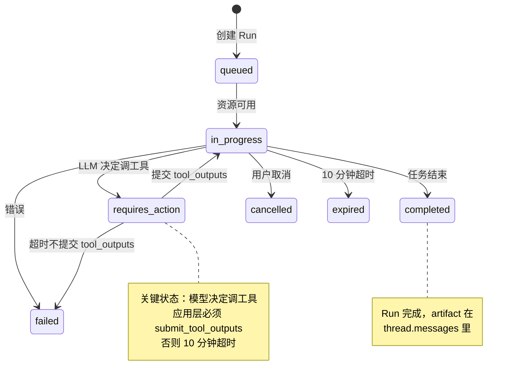

# 3.6 OpenAI Assistants API 与 Threads 模型

> 🟡 进阶

> **本节钩子**：Assistants API 让 OpenAI **替你托管 Agent 执行环境**——你不用自己管消息历史、工具调用循环、Code Interpreter 沙箱，**全部由 OpenAI 服务端维护**。**反直觉**的是：这种"省心"的代价是**灵活性大幅下降**——你无法精细控制每个 tool call 的重试、无法在工具之间插入自定义逻辑、无法跨模型切换（绑死 OpenAI 模型）。**截至 2026-05，OpenAI 已宣布 Assistants API 将在 2026 年底弃用，建议迁移到 Responses API + Agents SDK**——这是个值得记住的"协议演进反例"。

## 正文大纲

1. **一句话定义**：Assistants API（2023-11 发布）是 OpenAI 的**托管 Agent 平台**，三大核心对象：**Assistant**（Agent 配置）、**Thread**（会话）、**Run**（执行）。**与 Function Calling 的关键区别**：Assistants 把"工具调用循环、消息历史、Code Interpreter 沙箱"全部托管，**你只调 API 拿结果**。
2. **关键机制（5 个要点）**
   - **Assistant 对象**：定义 Agent 的 system_instructions + model + tools（code_interpreter / file_search / function）。**类比**：LangChain 的 `create_agent()` 返回的 compiled graph，但 Assistants 是**托管**的。
   - **Thread 对象**：代表一个**会话**，含消息历史。**OpenAI 服务端持久化** Thread，最长可保留数月。**反直觉**：Thread 让"会话"从应用层概念变成**资源对象**，增删改查都是 REST API。
   - **Run 对象**：代表一次"Agent 执行"。**生命周期**：`queued` → `in_progress` → `requires_action`（等工具调用）→ `completed` / `failed` / `cancelled` / `expired`。**反直觉**：Run 是**异步的**，你必须轮询或用 webhook 拿结果。
   - **内置工具**：① **Code Interpreter**：Python 沙箱，**持久化文件**（上传 CSV → 跑 pandas → 输出图表），生成的图表自动存 OpenAI 内部；② **File Search**：RAG-as-a-Service，OpenAI 自动 chunk + embed + retrieve，**你不用接向量库**；③ **Function Calling**：与 3.1 一致，但**走 Assistant 配置**。
   - **历史包袱与迁移**：Assistants API **2026 年底将被弃用**，OpenAI 推荐迁移到 **Responses API（2025-03 发布）** + **Agents SDK**。Responses API 把 Assistants 的托管能力拆成更细粒度的 primitive（`response.create`、`conversation.create`、`tool.execute`），**更灵活但需要自己管状态**。
3. **代码示例**：用 `openai` Python SDK（v1.40+）创建一个 Assistant + Thread + Run，演示完整生命周期。
4. **常见误区**：
   - ❌ "Assistants API 是 Agent 未来"——**错**。OpenAI 已宣布 2026 弃用，**生产新项目用 Responses API**。
   - ❌ "Code Interpreter 可以访问外网"——**错**。沙箱**完全离线**，无法 `requests.get()`，只能跑 Python 标准库 + numpy / pandas / matplotlib。
   - ✅ "Assistants 适合内部工具 / POC"——托管省心，但**生产级灵活性差**。
5. **横向对比**：
   - **Assistants API vs Function Calling**：托管 vs 自管；
   - **Assistants API vs LangGraph**：OpenAI 托管 vs 自建运行时；
   - **Assistants API vs Responses API**：即将弃用 vs 推荐迁移；
   - **Code Interpreter vs 自建 Docker 沙箱**：托管离线 vs 自建可联网。

## 图

- **主图 1**：Assistants API 状态机（Run lifecycle）+ 三大核心对象关系



- **辅助理解**：注意 `requires_action` 是**最容易踩坑的状态**——模型决定调工具时，Run 进入此状态等待应用层提交 `tool_outputs`。**10 分钟不提交就 expired**——生产里必须用 webhook / 异步任务及时处理。

## 代码

依赖：`openai>=1.40`，演示完整 Assistant + Thread + Run 生命周期。

```python
"""
assistants_demo.py
演示 OpenAI Assistants API 的完整生命周期
依赖：openai>=1.40
⚠️ 实战片段：需 API key
"""
from openai import OpenAI

client = OpenAI(api_key="sk-...")  # 实战片段，需 API key

# 1) 创建 Assistant（一次性配置）
assistant = client.beta.assistants.create(
    name="数据分析师",
    instructions="你是数据分析师。用户上传 CSV 后，用 pandas 分析并生成图表。",
    model="gpt-4o",
    tools=[
        {"type": "code_interpreter"},  # 内置 Code Interpreter
        # {"type": "file_search"},  # 可选：内置 RAG
        # {"type": "function", "function": {...}},  # 可选：自定义 Function
    ],
)
print(f"创建 Assistant: {assistant.id}")

# 2) 创建 Thread（会话）
thread = client.beta.threads.create()
print(f"创建 Thread: {thread.id}")

# 3) 添加用户消息到 Thread
message = client.beta.threads.messages.create(
    thread_id=thread.id,
    role="user",
    content="分析这份销售数据：上个月销量前 3 的产品是哪些？",
    # attachments=[...]  # 可选：附加文件给 Code Interpreter
)
print(f"添加消息: {message.id}")

# 4) 创建 Run（触发执行）
run = client.beta.threads.runs.create(
    thread_id=thread.id,
    assistant_id=assistant.id,
)
print(f"创建 Run: {run.id}, status={run.status}")

# 5) 轮询 Run 状态（生产里用 webhook）
import time
while run.status in ("queued", "in_progress", "requires_action"):
    time.sleep(1)
    run = client.beta.threads.runs.retrieve(thread_id=thread.id, run_id=run.id)
    print(f"  status={run.status}")

    # 关键：如果需要工具调用，提交 tool_outputs
    if run.status == "requires_action":
        tool_calls = run.required_action.submit_tool_outputs.tool_calls
        tool_outputs = []
        for tc in tool_calls:
            # 这里处理 Function Calling（Code Interpreter 不需要这一步）
            output = f"工具 {tc.function.name} 的结果（演示）"
            tool_outputs.append({"tool_call_id": tc.id, "output": output})
        run = client.beta.threads.runs.submit_tool_outputs(
            thread_id=thread.id,
            run_id=run.id,
            tool_outputs=tool_outputs,
        )

# 6) 拿到最终结果
if run.status == "completed":
    messages = client.beta.threads.messages.list(thread_id=thread.id)
    final = messages.data[0].content[0].text.value
    print(f"\nAgent 回复: {final}")
elif run.status == "failed":
    print(f"Run 失败: {run.last_error.message}")
```

跑完你会看到——完整的"创建 Assistant → 创建 Thread → 添加消息 → 创建 Run → 轮询 → 提交工具结果 → 拿最终回复"流程。**重点是 Run 状态机**：必须处理 `requires_action` 状态，否则 10 分钟超时。

## 实战片段

生产里 Assistants API 经常被**与 LangChain 混用**——用 Assistants 的 Code Interpreter 跑代码，用 LangChain 管工具编排：

```python
# assistants_with_langchain.py
from openai import OpenAI
from langchain_openai import ChatOpenAI
from langchain_core.tools import tool

# 1) Assistants 客户端（跑 Code Interpreter）
assistants_client = OpenAI(api_key="sk-...")  # 实战片段，需 API key

# 2) LangChain LLM（跑 Function Calling）
llm = ChatOpenAI(model="gpt-4o", api_key="sk-...")

# 3) 自定义工具（LangChain）
@tool
def query_database(sql: str) -> str:
    """查询生产数据库（仅 SELECT）。"""
    # 实战片段：实际接 DB
    return f"[DB] {sql} 的结果（演示）"

llm_with_tools = llm.bind_tools([query_database])

# 4) 双轨架构
def handle_user_query(user_message: str, thread_id: str):
    """先用 Assistants 跑 Code Interpreter，再用 LangChain 处理工具调用"""

    # 轨道 1：Assistants（Code Interpreter 跑代码）
    assistants_msg = assistants_client.beta.threads.messages.create(
        thread_id=thread_id,
        role="user",
        content=user_message,
    )
    run = assistants_client.beta.threads.runs.create(
        thread_id=thread_id,
        assistant_id="asst_xxx",
    )
    # ... 轮询 + 处理 requires_action ...

    # 轨道 2：LangChain（Function Calling 调 DB）
    response = llm_with_tools.invoke(user_message)
    if response.tool_calls:
        for tc in response.tool_calls:
            result = query_database.invoke(tc["args"])
            print(f"工具结果: {result}")

    return response.content

# 5) Assistants 的 File Search（RAG-as-a-Service）配置
file_search_assistant = assistants_client.beta.assistants.create(
    name="文档问答助手",
    model="gpt-4o",
    tools=[{"type": "file_search"}],  # 内置 RAG
    # vector_store 配置：上传文件自动 chunk + embed
)
# 注意：file_search 自动用 OpenAI 的 text-embedding-3-large，
# 你不能选其他 embedding 模型

# 6) 清理
# assistants_client.beta.assistants.delete(assistant.id)
# assistants_client.beta.threads.delete(thread.id)

# ========== 迁移建议：Assistants → Responses API ==========
"""
OpenAI 2025-03 发布 Responses API，2026 年底 Assistants 弃用。
迁移路径：Assistants 的 Thread → Responses 的 conversation，Run → response.create。
"""
from openai import OpenAI

new_client = OpenAI(api_key="sk-...")

# 新写法（Responses API）
response = new_client.responses.create(
    model="gpt-4o",
    input="分析这份销售数据",  # 单次调用
    tools=[{"type": "code_interpreter"}],
    conversation="conv_xxx",  # 类似 Thread
)
print(response.output_text)

# 对比：旧 Assistants 需要 5 步（assistant + thread + message + run + poll）
# 新 Responses API 只需要 1 步，状态由 OpenAI 服务端管理
```

实战要点：
1. **新项目不要用 Assistants**——2026 弃用，**直接用 Responses API + Agents SDK**；
2. **Code Interpreter 离线**——沙箱不能联网，只能跑 Python 标准库 + numpy/pandas/matplotlib；
3. **Run requires_action 必须及时处理**——10 分钟不提交 `tool_outputs` 就 expired；
4. **Thread 持久化**——OpenAI 服务端存消息历史，**最长数月**，但**应用层无法精细控制**；
5. **版本说明**：openai Python SDK v1.40+（2024-08），Assistants API beta 通道；Responses API v1.50+（2025-04）；Agents SDK v0.1+（2025-04）。

## 自测题

1. **概念辨析**：Assistants API 的三大核心对象（Assistant / Thread / Run）各自代表什么？为什么说"Run 是有状态异步对象"？
2. **场景判断**：你要做一个"代码执行 + 数据库查询"的 Agent。下面哪个方案**最不推荐**？
   - A. Assistants API 托管（Code Interpreter + Function Calling 查 DB）
   - B. LangChain 自建（PythonREPL 工具 + SQL 工具）
   - C. Assistants API + LangChain 混用
   - D. 直接 Responses API + 自管 Code Interpreter 沙箱
3. **代码补全**：补全下面代码，处理 Run 的 `requires_action` 状态：
   ```python
   while run.status in ("queued", "in_progress", ???):
       time.sleep(1)
       run = client.beta.threads.runs.retrieve(thread_id=thread.id, run_id=run.id)
       if run.status == ???:
           tool_outputs = process_tool_calls(run.required_action.submit_tool_outputs.tool_calls)
           run = client.beta.threads.runs.submit_tool_outputs(...)
   ```
4. **反直觉题**：有人说"Assistants API 是 Agent 的未来方向，因为 OpenAI 帮你托管一切"。这个说法对吗？2025 年后我们应该怎么选型？
5. **架构题**：设计一个"数据分析 Agent"，支持文件上传、Code Interpreter 跑 pandas、查询 MySQL、自动生成可视化图表。请说明哪些功能用 Assistants、哪些用 LangChain、哪些用自建，为什么。

**答案**：1. 三大对象：① **Assistant** = Agent 配置（instructions + model + tools），一次性创建；② **Thread** = 会话，**OpenAI 服务端持久化**消息历史；③ **Run** = 一次 Agent 执行，**异步**（queued/in_progress/requires_action/completed/failed/cancelled/expired），必须轮询或 webhook。Run 是有状态异步对象：状态由 OpenAI 服务端管理，应用层通过 poll retrieve 拿状态。2. **A 最不推荐**（对长期项目）。Assitants 2026 弃用，**新项目不要用**。B 自建灵活但要自己管沙箱；C 混用增加复杂度；D **最推荐**（Responses API + 自管沙箱，OpenAI 主推方向）。3. 答案：`"requires_action"`, `"requires_action"`。4. **部分错**。Assistants "托管一切"省心，**但代价是灵活性差 + 厂商锁定 + 即将弃用**。2025 年后选型：① 新项目用 **Responses API + Agents SDK**（OpenAI 主推）；② 跨厂商用 **LangGraph / AutoGen**（不绑 OpenAI）；③ 简单工具调用用 **Function Calling**（最灵活）。5. 方案：① **文件上传** → Assistants 的 Code Interpreter（持久化文件、自动沙箱）或自建 S3；② **Code Interpreter 跑 pandas** → Assistants 内置（省心）或自建 Docker 沙箱（更灵活）；③ **查询 MySQL** → 自建 LangChain SQL Agent（**不要用 Assistants 的 Function Calling**，因为重试逻辑自己控制更好）；④ **可视化图表** → Assistants 的 Code Interpreter（自动输出图）或 self-built matplotlib + OSS 上传；⑤ **总结回复** → 用 LangChain 的 Agent 编排（**不要用 Assistants 的 Run**，因为多步工具调用 LangChain 更灵活）。**关键**：**Assitants 只在"沙箱 + 文件"场景有优势**，其他场景用 LangChain / Responses API。

> 📚 本节参考
> - [S 级] OpenAI, *Assistants API Overview* — https://platform.openai.com/docs/assistants/overview （Assistants API 官方文档）
> - [S 级] OpenAI, *Responses API Documentation* — https://platform.openai.com/docs/api-reference/responses （2025-03 新发布的 Responses API，Assitants 的替代方案）
> - [S 级] OpenAI, *Code Interpreter Guide* — https://platform.openai.com/docs/assistants/tools/code-interpreter （Code Interpreter 沙箱与文件处理）
> - [A 级] Lilian Weng, *LLM Powered Autonomous Agents* — https://lilianweng.github.io/posts/2023-06-23-agent/ （Assistants API 与 Agent 系统的关系）
> - [A 级] OpenAI Cookbook, *Assistants API Migration Guide* — https://cookbook.openai.com/examples/assistants_api_overview_python （Assitants → Responses 迁移示例）