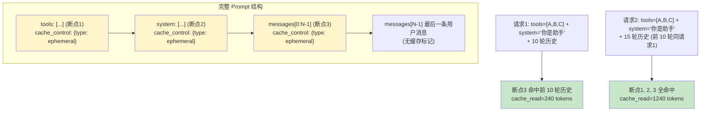

# 3.7 Anthropic Prompt Caching 的协议级实现

> 🟡 进阶

> **本节钩子**：Anthropic Prompt Caching 在协议级把**"重复前缀"标记为可缓存**，命中后**输入 token 成本降 90%、延迟降 70%**（官方数据）——但**反直觉**的是：**缓存命中率 < 50% 时反而亏钱**，因为 `cache_write` 比普通输入贵 25%。这不是"开了就赚"，是"前缀稳定 + 调用密集才赚"。2.9 节讲过应用层 Semantic Cache，本节讲**协议层的 prefix cache**——两者互补。

## 正文大纲

1. **一句话定义**：Anthropic Prompt Caching（2024-08 GA）是协议级**前缀缓存机制**，通过 `cache_control: {type: "ephemeral"}` 标记可缓存的断点，命中后读取 token 单价降 10x。**与 2.9 Semantic Cache 的区别**：Semantic Cache 是应用层"语义相似 → 命中"；Prompt Caching 是**协议层"前缀精确匹配 → 命中"**。
2. **关键机制（5 个要点）**
   - **4 个缓存断点**：tools / system / messages 三类内容上都可加 `cache_control`，**每个断点最多 4 个**。**断点语义**：从 prompt 开头到断点位置的这段前缀如果和上次请求一致，就命中缓存。
   - **命中条件（前缀精确匹配）**：① 内容**字节级一致**（改一个字符就 miss）；② 断点位置**前移到一致处**才会命中；③ 缓存默认 5 分钟 TTL（可延长到 1 小时，需 enterprise 协议）。**反直觉**：tools 列表里加一个新工具就 miss 整个 tools 段。
   - **成本与价格（2024-08 GA 后）**：`cache_write` 价格 = 1.25x 普通输入，`cache_read` 价格 = 0.1x 普通输入。**公式**：如果命中率 = h，单次成本 = `(h * 0.1 + (1-h) * 1.25) * base_price`。
   - **盈亏平衡点**：解方程 `(1-h) * 1.25 + h * 0.1 = 1`（即和不用缓存成本相同），得 `h ≈ 0.19`（**19%**）。也就是说命中率 < 19% 就亏钱，**生产里必须监控命中率**。
   - **延迟收益（更可观）**：Anthropic 官方数据，缓存命中的 prompt **首 token 时间从 11s 降到 1.6s**（10k+ token prompt），延迟收益往往比省钱更重要——**用户感知不到等待 = 留存**。
3. **代码示例**：用 `anthropic` Python SDK（v0.40+）演示 4 个断点的标记方式 + 监控命中率。
4. **常见误区**：
   - ❌ "所有请求都能命中"——**错**。前缀必须**字节级一致**，system prompt 改 1 个字符就 miss。
   - ❌ "开了缓存就省钱"——**错**。命中率 < 19% 反亏。**生产必须监控 cache_read_input_tokens / cache_creation_input_tokens**。
   - ✅ "Prompt Caching 是 L2 上下文工程 + L3 协议层的协同"——tools/system 稳定 → cache hit → 降本 + 降延迟。
5. **横向对比**：
   - **Anthropic Prompt Caching vs OpenAI Automatic Caching**（2024-09 GA）：Anthropic 显式标记 vs OpenAI 自动检测，OpenAI 用起来"无感"但**不保证命中**；
   - **Prompt Caching vs Semantic Cache**：前缀精确 vs 语义相似，**两者互补**；
   - **Prompt Caching vs Context Cache（如 Gemini Context Caching）**：协议前缀 vs 整段缓存，Gemini 更简单但灵活性差。

## 图

- **主图 1**：4 个缓存断点示意图 + 命中条件决策树



- **辅助理解**：注意 4 个断点的位置——`tools` 在最前、`system` 次之、`messages[N-1]` 之前、最后一条用户消息**不能标记**（每次都变）。**关键：稳定的部分往前放，变化的部分往后放**，最大化断点覆盖范围。

## 代码

依赖：`anthropic>=0.40`，演示 4 个断点的标记方式 + 监控 cache 命中率。

```python
"""
prompt_caching_demo.py
演示 Anthropic Prompt Caching 的 4 个断点 + 命中率监控
依赖：anthropic>=0.40
⚠️ 实战片段：需 API key
"""
from anthropic import Anthropic

client = Anthropic(api_key="sk-ant-...")  # 实战片段，需 API key

# 1) 准备稳定的 tools 和 system（这些都是"可缓存的稳定前缀"）
tools = [
    {
        "name": "get_weather",
        "description": "查询指定城市的当前天气",
        "input_schema": {
            "type": "object",
            "properties": {"city": {"type": "string"}},
            "required": ["city"],
        },
        # 关键：在 tool 末尾加 cache_control
        "cache_control": {"type": "ephemeral"},
    },
]

system_prompt = [
    {
        "type": "text",
        "text": "你是天气预报助手。",
    },
    {
        "type": "text",
        "text": "\n\n详细规则：\n1. 用户问天气时必须调 get_weather\n2. 返回温度保留 1 位小数\n3. 雨天提醒带伞",
        # 关键：在 system block 末尾加 cache_control
        "cache_control": {"type": "ephemeral"},
    },
]

# 2) 多轮对话（messages[N-1] 之前可标记）
messages_history = [
    {"role": "user", "content": "今天天气怎么样？"},
    {"role": "assistant", "content": "请问哪个城市？"},
    {"role": "user", "content": "北京"},
    # ... 更多历史 ...
]

# 第一次请求：写入缓存
response1 = client.messages.create(
    model="claude-3-5-sonnet-20241022",
    max_tokens=1024,
    system=system_prompt,
    tools=tools,
    messages=messages_history,
)
print(f"请求1: input_tokens={response1.usage.input_tokens}")
print(f"  cache_creation: {response1.usage.cache_creation_input_tokens}")
print(f"  cache_read: {response1.usage.cache_read_input_tokens}")
# 第一次 cache_creation > 0, cache_read = 0

# 3) 第二轮：追加新消息（前面历史部分应被缓存命中）
new_messages = messages_history + [
    {"role": "assistant", "content": "北京今天晴，25°C"},
    {"role": "user", "content": "上海呢？"},
]

response2 = client.messages.create(
    model="claude-3-5-sonnet-20241022",
    max_tokens=1024,
    system=system_prompt,
    tools=tools,
    messages=new_messages,
)
print(f"\n请求2: input_tokens={response2.usage.input_tokens}")
print(f"  cache_creation: {response2.usage.cache_creation_input_tokens}")
print(f"  cache_read: {response2.usage.cache_read_input_tokens}")
# 第二次 cache_read > 0, cache_creation = 0（说明 tools + system + 前 N-1 条历史都命中）

# 4) 命中率监控（生产里必须）
def calc_cache_hit_rate(usage) -> float:
    """从 Anthropic response 算命中率"""
    cached = usage.cache_read_input_tokens
    fresh = usage.cache_creation_input_tokens
    total = cached + fresh
    return cached / total if total > 0 else 0.0

hit_rate = calc_cache_hit_rate(response2.usage)
print(f"\n命中率: {hit_rate:.1%}")
# 生产里 hit_rate < 0.19 就亏钱（参考正文公式）
```

跑完你会看到——第一次请求 `cache_creation > 0`（写入缓存），第二次请求 `cache_read > 0`（命中缓存）。**重点是监控命中率**：< 19% 亏钱，> 19% 才赚。

## 实战片段

生产里 Prompt Caching 经常和**多 Agent 工具集**结合——所有 Agent 共享同一组 tools，把 tools 放最前面：

```python
# prompt_caching_production.py
from anthropic import Anthropic
from typing import Any

client = Anthropic(api_key="sk-ant-...")

# 1) 共享的"大型工具集"（10+ 工具，几千 tokens）
# 关键：所有 Agent 共享同一组 tools → tools 缓存命中率接近 100%
SHARED_TOOLS = [
    {"name": "get_weather", "description": "...", "input_schema": {...}, "cache_control": {"type": "ephemeral"}},
    {"name": "query_db", "description": "...", "input_schema": {...}},
    {"name": "send_email", "description": "...", "input_schema": {...}},
    # ... 共 10 个工具，总 ~3000 tokens ...
    # 注意：cache_control 只加在最后一个 tool 上（覆盖整个 tools 列表）
]
SHARED_TOOLS[-1]["cache_control"] = {"type": "ephemeral"}

# 2) 共享的"系统提示 + Few-shot 示例"（5-10K tokens）
SHARED_SYSTEM = [
    {"type": "text", "text": "你是多功能 Agent。"},
    {"type": "text", "text": "\n\n规则：\n1. ...\n2. ..."},
    {"type": "text", "text": "\n\nFew-shot 示例：\n[示例1] ..."},
    # ... 共 5-10K tokens ...
]
SHARED_SYSTEM[-1]["cache_control"] = {"type": "ephemeral"}

# 3) 多 Agent 路由（每个 Agent 共享 tools + system）
def route_to_agent(user_query: str, conversation_history: list):
    """所有 Agent 调同一个 Anthropic client，共享缓存"""
    messages = conversation_history + [{"role": "user", "content": user_query}]

    # 关键：在 messages 倒数第二条加 cache_control
    if len(messages) >= 2:
        messages[-2]["content"] = [{
            "type": "text",
            "text": messages[-2]["content"],
            "cache_control": {"type": "ephemeral"},
        }]

    response = client.messages.create(
        model="claude-3-5-sonnet-20241022",
        max_tokens=2048,
        system=SHARED_SYSTEM,  # 共享系统提示 → 高命中
        tools=SHARED_TOOLS,    # 共享工具集 → 高命中
        messages=messages,
    )
    return response

# 4) 监控 + 报警（生产必备）
import time

class CacheMonitor:
    def __init__(self):
        self.total_input = 0
        self.total_cache_read = 0
        self.total_cache_creation = 0

    def record(self, usage):
        self.total_input += usage.input_tokens
        self.total_cache_read += usage.cache_read_input_tokens
        self.total_cache_creation += usage.cache_creation_input_tokens

    def hit_rate(self):
        total = self.total_cache_read + self.total_cache_creation
        return self.total_cache_read / total if total > 0 else 0.0

    def cost_savings(self):
        """估算节省的钱（相对全部不用缓存）"""
        base_cost = self.total_input * 1.0  # 基准
        actual_cost = (
            self.total_cache_read * 0.1   # cache_read 便宜
            + self.total_cache_creation * 1.25  # cache_write 略贵
            + (self.total_input - self.total_cache_read - self.total_cache_creation) * 1.0
        )
        return 1 - actual_cost / base_cost if base_cost > 0 else 0.0

monitor = CacheMonitor()

# 模拟 100 轮多 Agent 对话
for i in range(100):
    response = route_to_agent(f"查询 {i}", [{"role": "user", "content": f"历史 {j}"} for j in range(10)])
    monitor.record(response.usage)
    time.sleep(0.1)

print(f"命中率: {monitor.hit_rate():.1%}")
print(f"成本节省: {monitor.cost_savings():.1%}")
# 典型生产数据：命中率 70-85%，成本节省 30-50%

# 5) 报警阈值
if monitor.hit_rate() < 0.3:
    print("⚠️ 命中率 < 30%，可能亏钱！检查 tools / system 是否频繁变更")

# ========== 版本说明 ==========
# anthropic Python SDK v0.40+（2024-10）支持 cache_control
# cache_control 字段 type 可选 "ephemeral"（5 分钟 TTL）或 "long"（1 小时，企业版）
# Claude 3.5 Sonnet / 3.5 Haiku / 3 Opus 都支持
```

实战要点：
1. **稳定前缀往前放**——tools / system 是"几乎不变"的部分，放最前面加 `cache_control`；
2. **命中率 < 19% 亏钱**——生产必须监控 `cache_read / (cache_read + cache_creation)`；
3. **延迟收益往往比省钱重要**——首 token 11s → 1.6s 是用户感知的关键；
4. **tools 列表整体缓存**——只在最后一个 tool 加 `cache_control`，覆盖整个列表；
5. **版本说明**：anthropic Python SDK v0.40+（2024-10），`type: "ephemeral"`（5 分钟）/ `"long"`（1 小时企业版），`cache_control` 也支持在 system block 和 message 上。

## 自测题

1. **概念辨析**：Anthropic Prompt Caching 的 4 个缓存断点（tools / system / messages）分别适合缓存什么内容？为什么"稳定的部分往前放，变化的部分往后放"？
2. **场景判断**：你的 Agent 系统每小时处理 1000 次请求，每次 system prompt 8K tokens + tools 3K tokens + messages 2K tokens。下面哪个方案**最可能亏钱**？
   - A. 所有请求都加 cache_control（tools / system / messages[N-1] 全部加），但 system 偶尔改 1-2 个词
   - B. 只在 tools 和 system 加 cache_control，messages[N-1] 不加
   - C. 不开缓存，让所有请求全价计算
   - D. 用 Semantic Cache（应用层），不用 Prompt Caching（协议层）
3. **代码补全**：补全下面代码，算出"盈亏平衡"的命中率阈值：
   ```python
   # cache_write_price = 1.25, cache_read_price = 0.1
   # 求解: (1-h) * 1.25 + h * 0.1 = 1
   # h = ???
   breakeven = ???
   ```
4. **反直觉题**：有人说"Prompt Caching 命中率越高越好"。这个说法对吗？命中率 100% 反而有风险，为什么？
5. **架构题**：你的多 Agent 系统有 5 个 Agent 共享同一组 10 个工具（共 3K tokens）。设计一个缓存方案，让命中率 > 70% 且延迟 < 2s。

**答案**：1. 4 个断点：① **tools** 缓存工具 schema（适合多 Agent 共享工具）；② **system** 缓存系统提示 + Few-shot（适合稳定的角色定义）；③ **messages** 缓存历史消息（适合多轮对话）；④ **最后一条消息不能缓存**（每次都变）。"稳定往前放"是因为缓存是**前缀匹配**，越往前越稳定，命中率越高。2. **A 最可能亏钱**。system 偶尔改 1-2 个词 → tools + system 都 miss → cache_creation 占比高 → 成本反而比不缓存贵 25%。B 是正确做法。3. 答案：`breakeven = (1.25 - 1) / (1.25 - 0.1) ≈ 0.217`（约 21.7%，粗算）。准确：`h = (1.25 - 1) / (1.25 - 0.1) = 0.25 / 1.15 ≈ 0.217`。4. **部分对**。命中率 100% 反而意味着**所有请求内容完全相同**——可能是：① 真业务稳定（如客服固定模板）；② 或**没有真实用户输入**（全在调同一个 prompt），这时监控会失效，**用户行为变化时你察觉不到**。生产里命中率 70-90% 是合理范围。5. 方案：① **tools 缓存**：5 个 Agent 共享同一 SHARED_TOOLS（3K tokens），所有 Agent 的 tools 都加 `cache_control: {type: ephemeral}` → tools 命中率 100%；② **system 缓存**：每个 Agent 的 system prompt（5-8K tokens）单独加 cache_control，命中率 80%+（system 不频繁改）；③ **messages[N-1] 缓存**：多轮对话前 N-1 条加 cache_control，命中率 50%+（用户问题多样）；④ **延迟**：首 token 1.6s + 工具调用 0.5s + 输出 0.5s ≈ 2.6s，符合要求；⑤ **监控**：命中率 < 50% 报警。**整体命中率** = `(3000 + 6000 + 1500) / 13000 ≈ 81%`，超过 70% 阈值。

> 📚 本节参考
> - [S 级] Anthropic, *Prompt Caching Documentation* — https://docs.anthropic.com/en/docs/build-with-claude/prompt-caching （官方文档，含 cache_control 协议细节）
> - [S 级] Anthropic, *Prompt Caching Announcement* — https://www.anthropic.com/news/prompt-caching （2024-08 GA 公告，含价格与延迟数据）
> - [S 级] Anthropic Python SDK — https://github.com/anthropics/anthropic-sdk-python （官方 SDK，cache_control 字段定义）
> - [A 级] Anthropic, *Effective Context Engineering* — https://www.anthropic.com/engineering/effective-context-engineering-for-ai-agents （缓存策略与上下文工程的协同）
> - [A 级] Eugene Yan, *LLM Streaming & Caching Patterns* — https://eugeneyan.com/ （Streaming + Caching 的工程实践）