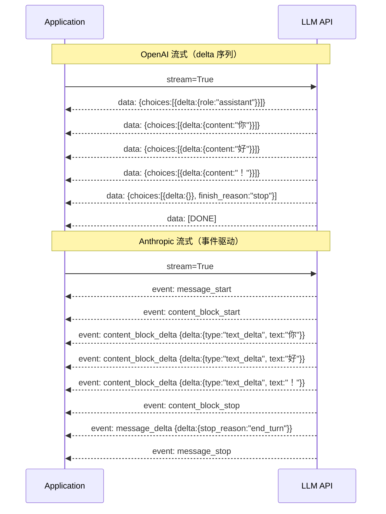

# 3.8 Streaming / SSE：长任务的实时反馈

> 🟢 核心

> **本节钩子**：流式响应不只是"用户体验优化"——它是**协议层 P95 延迟的决定因素**。OpenAI GPT-4o 流式首 token 200-400ms，非流式 P50 延迟 2-5s；**反直觉**的是：流式输出的总耗时反而**比非流式多 5-15%**（多了 chunk 序列化 / 网络往返开销），**用户感知的"快"是因为首 token 时间远小于总完成时间**。生产 Agent 系统**必须开流式**，否则用户等 10s 才看到第一个字——**留存率直线下降**。

## 正文大纲

1. **一句话定义**：Streaming（流式响应）是通过 **Server-Sent Events（SSE）** 协议，让 LLM 把生成的 token **逐块推送给客户端**，而不是等全部生成完一次性返回。**SSE 是基于 HTTP 的单向推送**（Content-Type: `text/event-stream`），区别于 WebSocket 的双向通信。
2. **关键机制（5 个要点）**
   - **SSE 协议格式**：每个 chunk 形如 `data: {"choices":[{"delta":{"content":"hello"}}]}\n\n`，**`\n\n` 结尾是协议约定**。客户端用 `iter_lines()` 或浏览器 `EventSource` API 解析。**反直觉**：SSE 是**纯文本协议**，不是二进制——JSON 序列化 + chunk 边界 + 网络往返，每次 chunk 都带来额外开销。
   - **OpenAI 流式协议**：`stream=True` 参数 → response 是生成器 → 每个 chunk 含 `choices[0].delta.content`（增量 token），最后 chunk `finish_reason="stop"`。**关键**：第一个 chunk `delta` 通常是 `{"role": "assistant"}`（无 content），第二个开始才有 content。
   - **Anthropic 流式协议**：`stream=True` → event 类型有 `message_start` / `content_block_start` / `content_block_delta` / `content_block_stop` / `message_delta` / `message_stop`，**事件驱动**而非"delta 序列"。**反直觉**：Anthropic 协议事件更结构化（明确 block 边界），便于工具调用流式返回。
   - **客户端三种实现**：① **Python iter_lines**：用 `requests` / `httpx` 手动解析（最灵活）；② **OpenAI SDK `.stream()`**：自动 yield chunk（推荐）；③ **LangChain `.stream()`**：在 LLM 之上再抽象一层（业务侧推荐）。**反直觉**：LangChain 的 `.stream()` 比直接用 OpenAI SDK 慢 5-10%（多了一层回调），**对延迟敏感场景直连 SDK**。
   - **首 token 时间（TTFT）才是关键指标**：流式 TTFT 200-400ms，非流式 TTFT = 总完成时间。**TTFT < 500ms 用户感知"秒回"**，> 2s 用户开始焦虑。生产监控 TTFT p50 / p95 / p99，**p95 > 1s 是事故**。
3. **代码示例**：用 OpenAI Python SDK（v1.40+）演示流式调用 + 手动解析 SSE chunk。
4. **常见误区**：
   - ❌ "所有场景都该流式"——**部分对**。流式适合**长输出**（> 100 tokens）；**短输出**（< 50 tokens）非流式更快（少 5-10% 协议开销）。
   - ❌ "SSE 比 WebSocket 慢"——**错**。SSE 单向、文本、自动重连，**比 WebSocket 简单 5 倍**；WebSocket 适合双向实时（如 ChatGPT 实时语音）。
   - ✅ "流式 + 工具调用"——OpenAI 在 `stream=True` 下**也会流式返回工具调用**（`tool_calls` 是分块 delta 累积），生产里必须累积完整 JSON 再解析。
5. **横向对比**：
   - **SSE vs WebSocket**：单向 vs 双向，**LLM 流式首选 SSE**；
   - **OpenAI vs Anthropic 流式协议**：delta 序列 vs 事件驱动；
   - **流式 vs 非流式**：长输出选流式，短输出选非流式。

## 图

- **主图 1**：SSE chunk 时序图（OpenAI 流式 + Anthropic 流式对比）



- **辅助理解**：注意 OpenAI 是 **delta 序列**（每次只发增量 content），Anthropic 是**事件驱动**（明确 block 边界 + delta）。**Anthropic 协议对工具调用流式更友好**（容易识别"工具块结束 → 下一个块是工具结果"），OpenAI 需要应用层累积 `tool_calls.delta`。

## 代码

依赖：`openai>=1.40`，演示流式调用 + 手动 SSE 解析。

```python
"""
streaming_demo.py
演示 OpenAI 流式调用 + 手动 SSE 解析
依赖：openai>=1.40
⚠️ 实战片段：需 API key
"""
from openai import OpenAI

client = OpenAI(api_key="sk-...")  # 实战片段，需 API key

# ========== 方法 1：OpenAI SDK 自动 stream() ==========
print("=== 方法 1：OpenAI SDK 自动 stream ===")
stream = client.chat.completions.create(
    model="gpt-4o",
    messages=[{"role": "user", "content": "用一句话介绍 SSE 协议"}],
    stream=True,
)

full_content = ""
ttft = None  # 首 token 时间
import time
start = time.time()

for chunk in stream:
    if ttft is None:
        ttft = time.time() - start  # 记录首 token 时间
    delta = chunk.choices[0].delta.content
    if delta:
        full_content += delta
        print(f"  chunk: {delta!r}")

print(f"\n首 token 时间 (TTFT): {ttft*1000:.0f}ms")
print(f"完整内容: {full_content}")
# 典型 TTFT 200-400ms

# ========== 方法 2：手动 SSE 解析（用 httpx） ==========
print("\n=== 方法 2：手动 SSE 解析 ===")
import httpx

def stream_with_manual_sse():
    """用 httpx 手动解析 SSE 协议，理解底层"""
    url = "https://api.openai.com/v1/chat/completions"
    headers = {
        "Authorization": "Bearer sk-...",
        "Content-Type": "application/json",
    }
    data = {
        "model": "gpt-4o",
        "messages": [{"role": "user", "content": "用一句话介绍 WebSocket"}],
        "stream": True,
    }

    with httpx.stream("POST", url, json=data, headers=headers, timeout=30) as response:
        for line in response.iter_lines():
            if not line or not line.startswith("data: "):
                continue
            payload = line[6:]  # 去掉 "data: " 前缀
            if payload == "[DONE]":
                break
            # 这里可以 json.loads(payload) 解析 chunk
            # 生产里累积 content 和 tool_calls
            print(f"  收到 chunk: {payload[:80]}...")

stream_with_manual_sse()

# ========== 方法 3：流式 + 工具调用 ==========
print("\n=== 方法 3：流式 + 工具调用 ===")
tools = [
    {
        "type": "function",
        "function": {
            "name": "get_weather",
            "description": "查询天气",
            "parameters": {
                "type": "object",
                "properties": {"city": {"type": "string"}},
                "required": ["city"],
            },
        },
    }
]

stream = client.chat.completions.create(
    model="gpt-4o",
    messages=[{"role": "user", "content": "北京天气怎么样？"}],
    tools=tools,
    stream=True,  # 即使有工具也开流式
)

# 关键：流式返回的 tool_calls 是分块 delta，必须累积
tool_calls_acc = {}  # index -> {name, arguments}
for chunk in stream:
    if chunk.choices[0].delta.tool_calls:
        for tc_delta in chunk.choices[0].delta.tool_calls:
            idx = tc_delta.index
            if idx not in tool_calls_acc:
                tool_calls_acc[idx] = {"name": "", "arguments": ""}
            if tc_delta.function.name:
                tool_calls_acc[idx]["name"] = tc_delta.function.name
            if tc_delta.function.arguments:
                tool_calls_acc[idx]["arguments"] += tc_delta.function.arguments

print(f"\n累积的 tool_calls: {tool_calls_acc}")
# {0: {'name': 'get_weather', 'arguments': '{"city": "北京"}'}}
# 注意 arguments 是字符串拼接，不是 JSON，要 json.loads
import json
final_args = json.loads(tool_calls_acc[0]["arguments"])
print(f"解析后的参数: {final_args}")
```

跑完你会看到——**流式让第一个 token 在 200-400ms 到达**，而不是等 2-5s。**重点是流式 + 工具调用**：tool_calls 是分块 delta，应用层必须按 index 累积 arguments 字符串。

## 实战片段

生产里流式响应经常和**前端打字机效果 + 工具调用进度反馈**结合。下面演示 LangChain 1.0 的统一 stream 接口：

```python
# streaming_production.py
from langchain_openai import ChatOpenAI
from langchain_core.tools import tool

llm = ChatOpenAI(model="gpt-4o", api_key="sk-...")

# 1) LangChain 统一 stream() 接口
@tool
def query_db(sql: str) -> str:
    """查询数据库（仅 SELECT）"""
    # 实战片段：实际接 DB
    return f"[DB] {sql} → 5 条结果"

llm_with_tools = llm.bind_tools([query_db])

# 2) 流式输出（业务侧推荐写法）
print("=== LangChain 流式 + 工具调用 ===")
messages = [{"role": "user", "content": "查北京最近一周的订单"}]

# 第一轮：流式生成
for chunk in llm_with_tools.stream(messages):
    # chunk 是 AIMessageChunk，含 content 或 tool_call_chunks
    if chunk.content:
        print(chunk.content, end="", flush=True)  # 打字机效果
    if chunk.tool_call_chunks:
        for tc in chunk.tool_call_chunks:
            print(f"\n[工具调用分片] name={tc.get('name')} args={tc.get('args')}")

# 3) TTFT 监控（生产必备）
import time
from langchain_core.callbacks import BaseCallbackHandler

class TTFTMonitor(BaseCallbackHandler):
    """监控首 token 时间"""
    def __init__(self):
        self.start_time = None
        self.ttft = None

    def on_llm_start(self, *args, **kwargs):
        self.start_time = time.time()

    def on_llm_new_token(self, token: str, **kwargs):
        if self.ttft is None and self.start_time:
            self.ttft = time.time() - self.start_time

# 接入回调
llm_monitored = ChatOpenAI(
    model="gpt-4o",
    api_key="sk-...",
    callbacks=[TTFTMonitor()],
    streaming=True,
)

# 4) 监控 + 报警
for chunk in llm_monitored.stream(messages):
    pass
# 拿到 ttft，超阈值报警
# （这里省略具体 TTFT 实例访问逻辑）

# 5) 前端打字机效果（伪代码）
"""
前端（React）：
const eventSource = new EventSource('/api/stream?msg=...');
eventSource.onmessage = (event) => {
    const chunk = JSON.parse(event.data);
    setMessages(prev => prev + chunk.content);  // 逐字追加
};
"""

# 6) 何时不用流式
def should_stream(output_estimate_tokens: int) -> bool:
    """根据预估输出长度决定是否流式"""
    # 经验值：> 100 tokens 流式更优；< 50 tokens 非流式更快
    return output_estimate_tokens > 100

# ========== 版本说明 ==========
# openai Python SDK v1.40+（2024-08）支持 stream=True
# anthropic Python SDK v0.40+（2024-10）支持 stream + event-driven
# langchain-core v0.3+（2024-09）统一 stream() 接口
```

实战要点：
1. **必须开流式**——TTFT 200-400ms 是用户感知"快"的临界点；
2. **流式 + 工具调用**——tool_calls 是分块 delta，**必须按 index 累积 arguments**；
3. **LangChain 略慢**——比直连 OpenAI SDK 慢 5-10%，**延迟敏感场景直连 SDK**；
4. **短输出不用流式**——< 50 tokens 非流式反而更快（少协议开销）。

## 自测题

1. **概念辨析**：SSE 和 WebSocket 在协议层有什么本质区别？为什么 LLM 流式响应首选 SSE 而不是 WebSocket？
2. **场景判断**：你的 Agent 系统有以下 4 个场景，哪个**不应该开流式**？
   - A. 客服对话（平均输出 200 tokens）
   - B. 代码生成（平均输出 500 tokens）
   - C. 短文本分类（平均输出 5 tokens）
   - D. 长文档摘要（平均输出 1000 tokens）
3. **代码补全**：补全下面代码，处理流式 tool_calls delta 累积：
   ```python
   tool_calls_acc = {}
   for chunk in stream:
       if chunk.choices[0].delta.tool_calls:
           for tc_delta in chunk.choices[0].delta.tool_calls:
               idx = tc_delta.index
               if idx not in tool_calls_acc:
                   tool_calls_acc[idx] = {"name": "", "arguments": ""}
               if tc_delta.function.name:
                   tool_calls_acc[idx]["name"] = tc_delta.function.name
               if tc_delta.function.arguments:
                   tool_calls_acc[idx]["arguments"] ???  # TODO: 累积还是覆盖？
   ```
4. **反直觉题**：有人说"流式响应总比非流式快"。这个说法对吗？流式开销来自哪里？什么场景下非流式反而更快？
5. **架构题**：设计一个"代码生成 Agent"，要求：① 实时显示生成的代码（打字机效果）；② 工具调用进度可见；③ TTFT < 500ms。请说明前后端协议选型、关键监控指标、错误重连策略。

**答案**：1. 区别：① **方向**：SSE 单向（server → client），WebSocket 双向；② **协议**：SSE 基于 HTTP（自动重连、穿过代理），WebSocket 是独立协议（WS://）；③ **复杂度**：SSE 简单 5 倍（纯文本 + HTTP），WebSocket 需要握手 + 心跳；④ **资源占用**：SSE 占用 1 个 HTTP 连接，WebSocket 是 TCP 长连接。**LLM 流式首选 SSE**：LLM 输出本身是单向（server → client），WebSocket 的双向能力浪费；SSE 基于 HTTP 容易穿过防火墙、自动重连（`EventSource` 内置）。2. **C 不应该开流式**（短文本分类，< 50 tokens）。3. 答案：`+= tc_delta.function.arguments`（累积，不是覆盖）。流式返回的 arguments 是分片，**必须字符串拼接**。4. **错**。流式开销来自：① **chunk 序列化**（每个 token 都要包成 JSON）；② **网络往返**（多个 chunk 多个 RTT）；③ **协议头开销**（每个 chunk 的 SSE `data: ...\n\n`）。非流式更快场景：① 短输出（< 50 tokens）；② 一次性批量处理；③ 内部 RPC 调用（不需要用户体验）。**典型数据**：流式 TTFT 200ms + 总耗时 5s，非流式 TTFT = 总耗时 4.5s——**流式用户感知快 95%，但总耗时多 10%**。5. 方案：① **协议**：SSE（`Content-Type: text/event-stream`），后端 OpenAI SDK `stream=True` → 前端 `EventSource`；② **打字机**：前端逐 chunk 追加到 `<pre>` 标签；③ **工具调用**：流式 tool_calls delta 按 index 累积，完整 JSON 后再执行工具；④ **TTFT 监控**：LangChain `on_llm_new_token` 回调或 OpenAI 自定义 metrics，p95 > 500ms 报警；⑤ **错误重连**：前端 `EventSource` 自动重连，**但必须实现"断点续传"**——记录已收到的 token 数，重连时用 `messages[N-1].prefix` 告诉后端"前面已发这些"；⑥ **进度反馈**：工具调用期间显示"正在查 DB..."、"正在生成代码..." 占位符，**避免用户以为卡死**。

> 📚 本节参考
> - [S 级] OpenAI, *Streaming Guide* — https://platform.openai.com/docs/guides/streaming-responses （官方流式文档，含 SSE chunk 格式）
> - [S 级] Anthropic, *Streaming Messages* — https://docs.anthropic.com/en/docs/build-with-claude/streaming （事件驱动流式协议）
> - [S 级] MDN, *Server-Sent Events* — https://developer.mozilla.org/en-US/docs/Web/API/Server-sent_events （SSE 协议标准与 EventSource API）
> - [A 级] Lilian Weng, *LLM Streaming* — https://lilianweng.github.io/posts/2023-06-23-agent/ （流式响应在 Agent 系统的位置）
> - [A 级] Eugene Yan, *Patterns for Streaming LLM Responses* — https://eugeneyan.com/ （流式响应工程实践）