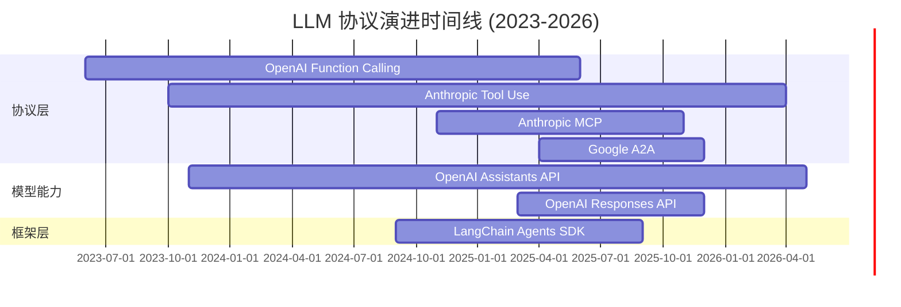
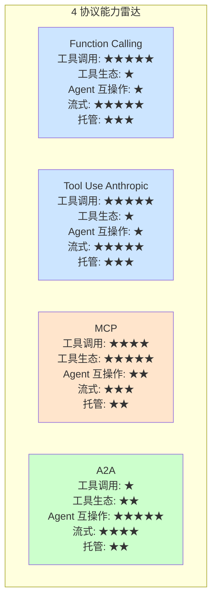

# 3.9 协议演进时间线（Function Call → MCP → A2A）

> 🟢 核心

> **本节钩子**：LLM 协议演进 18 个月走过 Web 协议 18 年的路——从 2023-06 OpenAI Function Calling 首发，到 2024-11 Anthropic MCP，再到 2025-04 Google A2A，**反直觉**的是：**协议演进不是"替代"，而是"层叠"**。Function Calling 还在用、MCP 不是替代它、A2A 也不是替代 MCP——它们各自解决不同层的问题（**模型 ↔ 工具** / **Agent ↔ 工具** / **Agent ↔ Agent**）。**生产系统是"协议栈"，不是"单协议"**。

## 正文大纲

1. **一句话定义**：协议演进时间线 = LLM 应用协议从"工具调用"到"Agent 互操作"的 3 个里程碑，**核心理念**：每个新协议都是为解决"上一个协议无法解决的新问题"而生，**不是替代而是补充**。
2. **关键机制（5 个要点）**
   - **2023-06 OpenAI Function Calling 首发**：gpt-4 / gpt-3.5-turbo 引入 `tools` 数组 + `tool_calls` 响应，**把"工具调用"从 prompt 工程提升到协议级**。**问题**：单厂商、单模型、能力有限（仅"调用工具"）。
   - **2023-10 Anthropic Tool Use 跟随**：Claude 3 引入 `tools` + `tool_use` block，**错误处理结构化**（`is_error: true`）。**问题**：仍未解决"工具生态碎片化"——每个团队都要自己接 DB / 文件 / GitHub。
   - **2024-11 Anthropic MCP 发布**：开放协议 + 四大原语（Resources / Prompts / Tools / Sampling）+ JSON-RPC 2.0，**统一"Agent ↔ 工具"的通信标准**。**关键**：开源 + 官方 SDK + 官方 server 仓库（filesystem / github / postgres / sqlite），**降低 80% 重复造轮子**。
   - **2025-04 Google A2A 发布**：Agent Card + Task + JSON-RPC 2.0，**统一"Agent ↔ Agent"的通信标准**。50+ 公司联名（Atlassian / Salesforce / SAP / ServiceNow），**A2A 解决的是"找另一个 Agent 帮忙"而不是"自己调工具"**。
   - **2025-2026 演进趋势**：① **协议层 OSS 化**（MCP / A2A 都是开源，厂商中立）；② **协议栈共存**（Function Calling + MCP + A2A 同时存在）；③ **从"协议"到"运行时"**（LangChain Agents SDK / Anthropic Agent SDK 统一协议调用）；④ **OpenAI 转向 Responses API**（2026 弃用 Assistants），**协议收敛到"以 Response 为中心"**。
3. **代码示例**：用 Mermaid 画协议演进时间线 + 4 协议能力雷达对比。
4. **常见误区**：
   - ❌ "MCP 取代 Function Calling"——**错**。MCP 是协议层，Function Calling 是模型能力层，**两者共存**。
   - ❌ "A2A 是终极协议"——**错**。A2A 还在快速迭代（2025-04 才发布），**生产用要谨慎**。
   - ✅ "协议选型要看场景"——3.10 决策树会详细讲。
5. **横向对比**：
   - **Function Calling vs Tool Use**：OpenAI 协议 vs Anthropic 协议（详见 3.1）；
   - **MCP vs OpenAPI**：Agent ↔ 工具 vs Web Service ↔ Client；
   - **A2A vs gRPC**：Agent 互操作 vs 通用 RPC；
   - **演进速度**：LLM 协议 18 个月 vs Web 协议 18 年（HTTP 1991 → REST 2000 → GraphQL 2015）。

## 图

- **主图 1**：协议演进时间线 + 4 协议能力雷达对比



- **辅助理解**：注意三个里程碑——**Function Calling（2023-06）→ MCP（2024-11）→ A2A（2025-04）**，间隔从 17 个月 → 5 个月，**协议迭代速度在加快**。每个协议都解决"上一个协议解决不了的新问题"——工具调用 → 工具生态 → Agent 互操作。

## 代码



- **辅助理解**：注意每个协议**不是"全能选手"**——Function Calling 工具调用强但生态弱，MCP 生态强但 Agent 互操作弱，A2A Agent 互操作强但工具调用弱。**生产系统是"协议栈"：Function Calling + MCP + A2A 共存**。

## 实战片段

真实工程里"协议演进"对架构选型影响巨大。下面用一个 6 个月项目的时间线展示"如何跟着协议演进调整架构"：

```python
# protocol_evolution_journey.py
"""
6 个月项目演进：跟着协议走，而不是赌单一协议
"""
from dataclasses import dataclass

@dataclass
class ArchitectureSnapshot:
    date: str
    protocol_stack: list
    reason: str

# 2024-12：项目启动
m1 = ArchitectureSnapshot(
    date="2024-12",
    protocol_stack=["Function Calling (OpenAI)", "LangChain Tools"],
    reason="项目初期 3 个工具，Function Calling 够用，MCP 还在 GA 前",
)

# 2025-02：工具增多
m2 = ArchitectureSnapshot(
    date="2025-02",
    protocol_stack=["Function Calling", "MCP (filesystem + sqlite)"],
    reason="工具到 10+ 个，MCP 统一管理本地工具，Function Calling 保留给云 API",
)

# 2025-04：A2A 发布
m3 = ArchitectureSnapshot(
    date="2025-04",
    protocol_stack=["Function Calling", "MCP", "A2A (实验性)"],
    reason="需要找外部 Agent 帮忙做数据分析，先实验 A2A + MCP 混用",
)

# 2025-06：A2A 稳定 + 迁移 Responses API
m4 = ArchitectureSnapshot(
    date="2025-06",
    protocol_stack=["Responses API", "MCP (生产)", "A2A (生产)"],
    reason="A2A v0.3+ 稳定 + OpenAI 推 Responses API，迁移 Assistants → Responses",
)

# 架构演进决策树
def decide_protocol_stack(
    num_tools: int,
    need_external_agents: bool,
    is_experimental: bool,
) -> list:
    """根据项目阶段决定协议栈"""
    stack = []

    # 1. 必有：Function Calling（除非用 MCP 替代）
    if num_tools <= 5:
        stack.append("Function Calling")
    else:
        stack.append("MCP (统一工具生态)")

    # 2. 多 Agent 才用 A2A
    if need_external_agents:
        stack.append("A2A (谨慎用，还在快速迭代)")

    # 3. OpenAI 生态：Assistants → Responses
    if not is_experimental:
        stack.append("Responses API (取代 Assistants)")

    return stack

# 典型决策
print(decide_protocol_stack(num_tools=8, need_external_agents=True, is_experimental=False))
# ['MCP (统一工具生态)', 'A2A (谨慎用，还在快速迭代)', 'Responses API (取代 Assistants)']

# ========== 反直觉：协议选型不是"选最新" ==========
# 1. Function Calling 2023 年的协议，2026 年仍在广泛使用
# 2. MCP 2024 年发布，2025 年成为"Agent 工具生态的事实标准"
# 3. A2A 2025 年发布，2025-06 仍在快速迭代期，生产用要谨慎
# 4. Assistants 2026 弃用，新项目用 Responses API

# ========== 版本说明 ==========
# OpenAI Function Calling: 2023-06 首发，至今未弃用
# Anthropic Tool Use: 2023-10 首发，至今未弃用
# Anthropic MCP: 2024-11 GA，2025-04 v1.0 稳定
# Google A2A: 2025-04 发布，2025-06 v0.3+ 快速迭代
# OpenAI Assistants API: 2026 年底弃用
# OpenAI Responses API: 2025-03 发布，2025-06 主推方向
```

实战要点：
1. **协议不是替代是层叠**——Function Calling + MCP + A2A 共存是常态；
2. **跟协议演进，不赌单一协议**——项目初期 Function Calling，工具增多换 MCP，多 Agent 加 A2A；
3. **MCP 是 2025 事实标准**——v1.0 稳定 + 官方 server 仓库 + 50+ 工具支持；
4. **A2A 谨慎用**——2025-06 仍在快速迭代期，**生产用选 v0.3+ 稳定版**；
5. **OpenAI Assistants → Responses**——2026 弃用 Assistants，**新项目直接 Responses API**。

## 自测题

1. **概念辨析**：LLM 协议演进的 3 个里程碑（Function Calling / MCP / A2A）各自解决什么"上一个协议解决不了的新问题"？为什么说"协议不是替代而是层叠"？
2. **场景判断**：你的项目 2025-06 启动，预计运行 2 年，需要 15 个本地工具 + 3 个外部 Agent 协作。下面哪个协议栈**最合适**？
   - A. Function Calling + 自建 HTTP API 调外部 Agent
   - B. MCP + A2A + Responses API
   - C. Assistants API（OpenAI 托管）+ MCP
   - D. Function Calling + MCP + Kafka 消息队列
3. **代码补全**：补全下面"协议选型"函数：
   ```python
   def decide_protocol_stack(num_tools: int, need_external_agents: bool) -> list:
       stack = []
       if num_tools <= 5:
           stack.append("Function Calling")
       else:
           stack.append(???)  # TODO: 工具多用什么？
       if need_external_agents:
           stack.append(???)  # TODO: 多 Agent 协作用什么？
       return stack
   ```
4. **反直觉题**：有人说"MCP 是 Function Calling 的升级版，会取代 Function Calling"。这个说法对吗？Function Calling 在 2026 年还有哪些场景必须用？
5. **架构题**：设计一个"协议演进路线图"，覆盖项目从 0 到 1、从 1 到 100、从 100 到 10000 三个阶段的协议栈变化。

**答案**：1. 三个里程碑：① **Function Calling（2023-06）**——把工具调用从 prompt 工程提升到协议级，但**单厂商单模型，工具生态碎片化**；② **MCP（2024-11）**——统一 Agent ↔ 工具的通信标准，**解决"每个团队都重写 DB / 文件 / GitHub 接入"问题**；③ **A2A（2025-04）**——统一 Agent ↔ Agent 通信，**解决"Agent 找不到专家"问题**。协议层叠：Function Calling 还在用（模型能力），MCP 解决生态，A2A 解决互操作，**三者互补**。2. **B 最合适**（MCP + A2A + Responses API）。A 用 HTTP API 调外部 Agent 不是标准协议；C Assistants 2026 弃用；D Kafka 是基础设施级不是 Agent 协议。3. 答案：`"MCP"`, `"A2A"`。4. **错**。Function Calling 不会被取代，因为它是**模型能力层**（模型决定调什么工具），MCP 是**协议层**（统一工具接入）。2026 年 Function Calling 仍必须用的场景：① 简单 1-3 个工具；② 跨厂商模型（Claude / Gemini 都支持 Function Calling）；③ 极低延迟场景（Function Calling 比 MCP 多一层协议栈开销）。5. 路线图：① **0 → 1（MVP）**：Function Calling + LangChain Agents，**单一 LLM + 1-3 个工具**，跑通最小闭环；② **1 → 100（生产）**：Function Calling + MCP（10+ 工具统一管理）+ 流式响应 + Prompt Caching，**多 LLM + 大量工具 + 性能优化**；③ **100 → 10000（规模化）**：MCP + A2A + Responses API + LangGraph，**多 Agent 协作 + 跨厂商 + 自建运行时**。**关键**：每个阶段不是"替换"上一阶段，是"叠加"——Function Calling 始终是基础，MCP 是工具层，A2A 是协作层。

> 📚 本节参考
> - [S 级] OpenAI, *Function Calling Announcement (2023-06)* — https://platform.openai.com/docs/guides/function-calling （Function Calling 首发协议）
> - [S 级] Anthropic, *Model Context Protocol Launch (2024-11)* — https://www.anthropic.com/news/model-context-protocol （MCP 发布的官方公告）
> - [S 级] Google, *A2A Protocol Launch (2025-04)* — https://github.com/google/A2A （A2A 协议官方仓库）
> - [A 级] Lilian Weng, *LLM Powered Autonomous Agents* — https://lilianweng.github.io/posts/2023-06-23-agent/ （Agent 协议演进的总体脉络）
> - [A 级] Chip Huyen, *AI Engineering* — https://github.com/chiphuyen/ai-engineering （协议演进的工程视角）