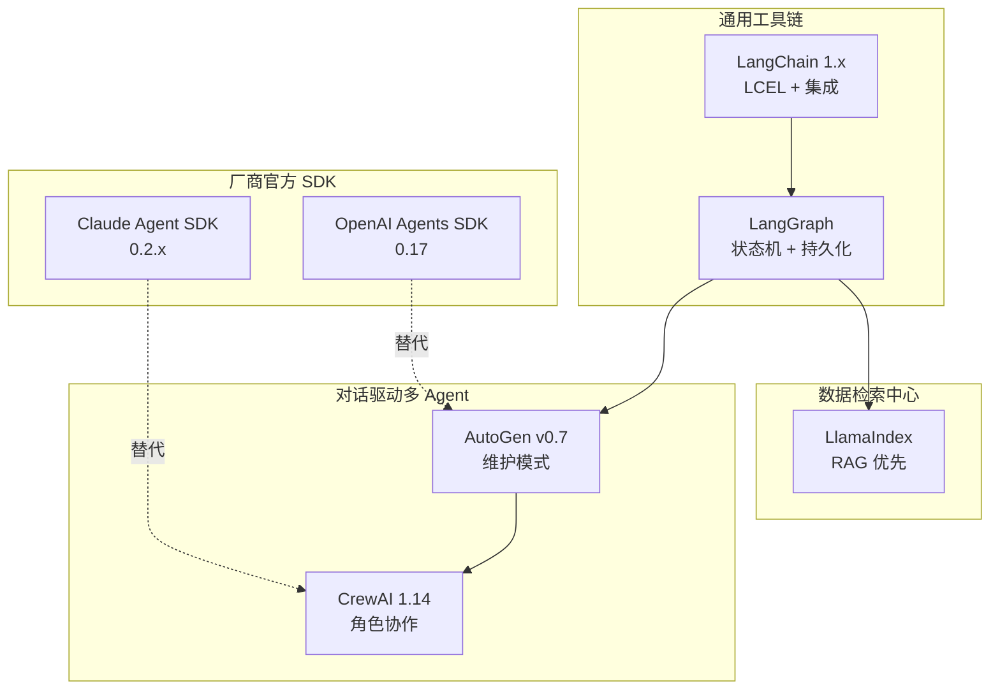

# 4.1 框架全景：7 大 Agent 框架的横向对比

> 🟢 核心

> **本节钩子**：选框架不是"哪个最好"的问题，而是"哪个匹配你的不匹配"。LangChain 全栈但抽象层数高、LangGraph 状态机最稳但要自己写工具、LlamaIndex 强在 RAG 但多 Agent 弱——7 个框架覆盖 7 个**正交维度**，把它们放进同一张图就看清了：**没有任何框架能覆盖所有维度**。

## 正文大纲

1. **一句话定义**：本节用一张对比矩阵和一张特性雷达图，把 7 个 2025 年主流 Agent 框架放在统一坐标系下对比——**维度**包括易用性、可扩展性、生产化、多 Agent、工具生态、学习曲线、社区活跃。
2. **关键机制（5 个要点）**
   - **通用工具链型**（LangChain / LangGraph）：通用抽象 + 任意场景，强调"链式组合 + 状态机"。
   - **数据/检索中心型**（LlamaIndex）：以 RAG 为原语，向 Workflows 演化但起点是"文档 → 索引 → 查询"。
   - **对话驱动多 Agent**（AutoGen / CrewAI）：把 Agent 抽象成"角色 + 消息"，靠对话流驱动协作。
   - **官方轻量 SDK**（OpenAI Agents SDK / Claude Agent SDK）：由模型厂商提供，与自家模型和工具深度集成。
   - **演进规律**：从"单 Agent 循环"到"多 Agent 编排"再到"长任务持久化"，框架抽象在 2022-2025 三年走过了 Web 框架十年的路。
3. **代码示例**：7 框架的"hello agent"代码对照——同一个任务"总结 README"在不同框架下的最小代码。
4. **常见误区**：
   - ❌ "选 stars 最多的就对了"——LangChain 139k stars 最多但抽象层数最深，新手容易卡在 callback/LCEL 上；CrewAI 53k stars 但多 Agent 上手最快。
   - ❌ "新框架一定比老的好"——AutoGen 已进入维护模式（社区推荐新项目用 Microsoft Agent Framework），但现有教程/案例最丰富。
   - ✅ "用 framework 对比维度打分"——见下方矩阵；不要用"主观感觉"。
5. **与其他层的关系**：L3 协议层定义"Agent 怎么说话"，L4 框架层把协议封装成"可调用的对象"。**典型路径**：3.1 Function Calling → LangChain `bind_tools()` → 4.2 Runnable；3.3 MCP → Claude Agent SDK `create_sdk_mcp_server`。

## 图

- **主图 1**：7 框架特性雷达对比图（用 `graph` 拉出对比卡片）



- **辅助理解**：注意 4 个集群——LangChain/LangGraph 一脉相承（同一团队），LlamaIndex 独立 RAG 路线，AutoGen/CrewAI 都是多 Agent 但哲学不同（对话 vs 角色），OpenAI/Claude SDK 走"厂商深度集成"路线。每个集群内是**互补**而非竞争关系。

## 代码

下面用一段**对照表**展示 7 框架的"hello agent"风格——同一任务"读 README 并总结"在不同框架下的最小代码骨架（结构演示，不发真实 API）：

```python
"""
framework_minimal_compare.py
7 框架最小"hello agent"代码对照
仅演示结构差异，运行时需各自安装+API key
"""
from typing import Protocol

class HelloAgent(Protocol):
    def run(self, task: str) -> str: ...

# ========== 1. LangChain 1.x — Runnable pipe ==========
from langchain.chat_models import init_chat_model
from langchain_core.prompts import ChatPromptTemplate
from langchain_core.output_parsers import StrOutputParser

lc_chain = (
    ChatPromptTemplate.from_template("总结以下文本:{text}")
    | init_chat_model("openai:gpt-5.5")
    | StrOutputParser()
)

# ========== 2. LangGraph — 显式状态机 ==========
from typing import TypedDict
from langgraph.graph import StateGraph, START, END

class LGState(TypedDict):
    text: str
    summary: str

def summarize_node(state: LGState):
    # 真实实现里调用 LLM
    return {"summary": f"[LG 摘要] {state['text'][:50]}"}

lg_graph = (
    StateGraph(LGState)
    .add_node("summarize", summarize_node)
    .add_edge(START, "summarize")
    .add_edge("summarize", END)
    .compile()
)

# ========== 3. LlamaIndex — 数据为中心 ==========
from llama_index.core import SimpleDirectoryReader, VectorStoreIndex, Settings
from llama_index.core.query_engine import RetrieverQueryEngine

documents = SimpleDirectoryReader("./docs").load_data()
index = VectorStoreIndex.from_documents(documents)
li_engine = index.as_query_engine()

# ========== 4. AutoGen v0.7 — 对话流 ==========
from autogen_agentchat.agents import AssistantAgent
from autogen_ext.models.openai import OpenAIChatCompletionClient

ag_agent = AssistantAgent(
    "summarizer",
    model_client=OpenAIChatCompletionClient(model="gpt-4.1"),
    system_message="你是一个 README 总结助手",
)

# ========== 5. CrewAI 1.14 — 角色 + 任务 ==========
from crewai import Agent, Task, Crew

cr_agent = Agent(
    role="README 总结员",
    goal="从给定文本提取核心信息",
    backstory="你擅长技术文档摘要",
)
cr_task = Task(description="总结 README", agent=cr_agent, expected_output="一段摘要")
cr_crew = Crew(agents=[cr_agent], tasks=[cr_task])

# ========== 6. OpenAI Agents SDK — 官方轻量 ==========
from agents import Agent, Runner

oai_agent = Agent(
    name="README 助手",
    instructions="总结用户提供的 README 文本",
)
# 调用：result = Runner.run_sync(oai_agent, readme_text)

# ========== 7. Claude Agent SDK — 长任务 + 工具 ==========
from claude_agent_sdk import query, ClaudeAgentOptions

# query 是 async generator,演示用 anyio 异步驱动
# import anyio
# async def run():
#     async for msg in query(
#         prompt="总结 README",
#         options=ClaudeAgentOptions(allowed_tools=["Read"]),
#     ):
#         print(msg)
# anyio.run(run)
```

> 实战要点：**结构差异**一眼可见——LangChain 链式管道、LangGraph 显式节点、LlamaIndex 数据驱动、AutoGen/CrewAI 类化抽象、OpenAI/Claude SDK 简洁函数调用。代码**总行数**也对应学习曲线（LangChain/LangGraph 中等、LlamaIndex 短、AutoGen/CrewAI 中、官方 SDK 最短）。

## 实战片段（200-500 行场景示例）

真实选型中，最常问的不是"哪个最好"，而是"我的项目该用哪个"。下面是按**项目类型**的选型建议清单：

| 项目类型 | 推荐框架 | 理由 |
|---|---|---|
| 单 Agent + 简单工具 | OpenAI Agents SDK / Claude Agent SDK | API 简洁，与模型深度集成 |
| RAG / 文档问答 | LlamaIndex | 数据为中心，文档加载/索引/检索最成熟 |
| 复杂多 Agent + 状态 | LangGraph | 状态机 + 持久化 + HITL 一站式 |
| 角色化业务流 | CrewAI | 角色 + 任务抽象最自然 |
| 已有 LangChain 栈升级 | LangGraph（沿用 LangChain 生态） | 0 迁移成本，与 LangChain 1.x 兼容 |
| 多厂商模型混合 | LangChain / LangGraph | 抽象统一，支持 OpenAI/Anthropic/本地模型 |
| 长任务（小时级） | Claude Agent SDK | 原生长任务、Sub-agents、内置 Claude Code 工具 |
| 学术研究/实验 | LangChain / LangGraph | 可扩展性最高，能自定义节点 |

> 反直觉结论：**80% 场景下，你不需要"全套框架"**——很多生产 Agent 用纯 OpenAI/Anthropic SDK + 几行自研编排就够了。框架解决的是"通用工程问题"（retry、streaming、持久化），不是"业务问题"。

## 自测题

1. **概念辨析**：LangChain 1.x 和 LangGraph 的关系是什么？它们是替代关系还是补充关系？哪类项目**应该直接用 LangGraph**而不是 LangChain？
2. **场景判断**：你在做一个"读用户上传的 PDF 并回答问题"的 RAG 产品。下面哪个选型最匹配？
   - A. LangChain（通用工具链）
   - B. LlamaIndex（数据为中心）
   - C. AutoGen（多 Agent 对话）
   - D. OpenAI Agents SDK（轻量官方）
3. **代码补全**：下面代码缺什么？补全让 CrewAI 真正运行：
   ```python
   from crewai import Agent, Crew
   researcher = Agent(role="研究员", goal="找资料", backstory="...")
   writer = Agent(role="写手", goal="写文章", backstory="...")
   # 缺什么才能让 Crew.run() 工作？
   ```
4. **反直觉题**：有人说"AutoGen 5 万+ stars，所以新项目应该选它"。这个推断**正确吗**？为什么？请引用官方仓库的实际状态。
5. **选型题**：如果你的项目同时包含 RAG、多 Agent 协作、长任务（小时级）、多厂商模型支持，**只用 1 个框架**够吗？还是必须多框架组合？请给出最小可行的组合。

**答案**：1. **补充关系**——LangChain 提供"工具 + 集成 + Runnable 抽象"，LangGraph 在 LangChain 之上提供"状态机 + 持久化 + HITL"。需要**循环 / 持久化 / 人工介入**的场景应直接用 LangGraph。2. **B 最匹配**——LlamaIndex 是数据/检索中心型，对 PDF/Word/网页的 `SimpleDirectoryReader` + `VectorStoreIndex` 一条龙；其他选项要么太通用要么不擅长 RAG。3. 缺 `Task` 和 `Crew(agents=[...], tasks=[...])`，且 `Crew(...)` 还需要 `process=`(默认 sequential)。最小可运行代码需要 `Task(description="...", agent=researcher)`、`Task(description="...", agent=writer, context=[task1])`、`Crew(agents=[researcher, writer], tasks=[task1, task2])`。4. **不正确**——AutoGen 仓库 README 自 2025 年起标注"Maintenance Mode"，官方推荐新项目用 Microsoft Agent Framework (MAF)。Stars 是历史指标，不应单独作为新项目的选型依据；应结合"维护状态 + API 演进速度 + 社区迁移路径"。5. **不够**——RAG 选 LlamaIndex、多 Agent 选 LangGraph 或 CrewAI、长任务选 Claude Agent SDK、多厂商选 LangChain。最小组合：LangGraph（编排 + 多 Agent + 多厂商）+ LlamaIndex 作为 RAG 子模块（嵌入为节点）+ Claude Agent SDK 作为可选"长任务子智能体"。

> 📚 本节参考
> - [S 级] LangChain 官方 README — https://github.com/langchain-ai/langchain （"The agent engineering platform" 最新定位与生态结构）
> - [S 级] LangGraph 官方 README — https://github.com/langchain-ai/langgraph （"Build resilient agents" 持久化 / HITL / 内存特性总览）
> - [S 级] AutoGen 官方 README — https://github.com/microsoft/autogen （标注"Maintenance Mode"，新项目推荐 Microsoft Agent Framework）
> - [S 级] CrewAI 官方 README — https://github.com/crewAIInc/crewAI （Crews + Flows 双层架构，自称"完全独立于 LangChain"）
> - [A 级] LlamaIndex GitHub — https://github.com/run-llama/llama_index （RAG 优先的定位）