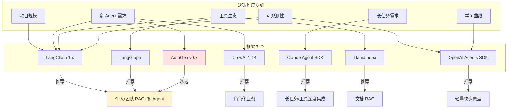

# 4.10 框架选型决策矩阵

> 🟡 进阶

> **本节钩子**：选框架不是技术决策——是**工程权衡**。**反直觉事实**：决策矩阵最常用的 3 个维度（stars、文档量、性能）**都不是最重要的**——真正决定项目成败的是**团队熟悉度 + 工具生态兼容 + 长期维护状态**。本节给出一张加权决策表，把"主观感觉"转成"可量化打分"，附录 C 会进一步扩展为含迁移成本评估的完整矩阵。

## 正文大纲

1. **一句话定义**：决策矩阵（Decision Matrix）是**用加权评分替代主观判断的选型方法**——列出 6-8 个决策维度，按"项目需求"加权，每个框架打分（1-5），最终排序选最高分。本节给出一张**生产选型可直接套用**的矩阵。
2. **关键机制（5 个要点）**
   - **决策维度**：①项目规模（个人 / 团队 / 企业）②多 Agent 需求（无 / 简单 / 复杂）③长任务需求（无 / 分钟级 / 小时级）④工具生态（已有 MCP / 需自定义 / 跨厂商模型）⑤可观测性（自带 / 需接第三方）⑥成本敏感度（高 / 中 / 低）⑦学习曲线（团队上手时间）⑧社区与维护状态（活跃 / 稳定 / 维护模式）。
   - **加权逻辑**：每个项目**按自身情况**调整权重；比如 RAG 项目把"RAG 成熟度"权重提到 30%，多 Agent 项目把"多 Agent 抽象"权重提到 25%。
   - **评分维度**：1=完全不满足、2=部分支持、3=基本满足、4=良好支持、5=最佳；基于"定性"判断而非精确数字。
   - **横向对比的常见陷阱**：①**"最流行 = 最适合"错**——LangChain 14w+ stars 但抽象层数深；CrewAI 5w+ stars 但 RAG 弱；②**"新 = 好"错**——AutoGen 维护模式不等于"不能用"，但新项目不推荐；③**"全功能 = 复杂"**——框架越全学习曲线越陡。
   - **附录 C 预告**：本节是矩阵"骨架"，附录 C 会扩展为含迁移成本评估（重写工作量 / 业务影响 / 时间窗口）、运行时基准（latency / throughput）、生态 ROI 的完整矩阵。
3. **代码示例**：决策矩阵的 Python 实现——输入需求权重，输出框架排序。
4. **常见误区**：
   - ❌ "用一个矩阵选所有项目"——错；矩阵是**工具**，不是真理；不同项目维度权重不同。
   - ❌ "高 star 框架 +1 分"——错；star 是历史指标，不等于"当前最匹配"。
   - ✅ "试运行再决定"——任何选型在投入 1 周工程量前**先做个最小原型**（POC），跑通核心场景再决定。
5. **与 L4 衔接**：本节是 4.1-4.8 各框架特征的**收敛章节**；附录 C 是它的**扩展版本**。

## 图

- **主图 1**：6 大决策维度 + 7 框架的雷达对比图（mermaid 块图）



- **辅助理解**：AutoGen 是红色（维护模式，新项目慎选）；LangChain/LangGraph 黄色（推荐主力）；不同决策维度推不同框架。**这是简化版决策路径**——真实场景要按本节矩阵打分。

## 代码

依赖：纯 Python，演示决策矩阵实现：

```python
"""
decision_matrix.py
Agent 框架选型决策矩阵
纯 Python，无外部依赖
"""
from dataclasses import dataclass


@dataclass
class Framework:
    name: str
    scores: dict  # 维度 -> 评分 1-5


@dataclass
class Requirement:
    weights: dict  # 维度 -> 权重（总和 = 1.0）


def weighted_score(framework: Framework, req: Requirement) -> float:
    """计算框架在需求下的加权总分。"""
    total = 0.0
    for dim, weight in req.weights.items():
        score = framework.scores.get(dim, 3)  # 默认 3 = 中性
        total += score * weight
    return round(total, 2)


def rank_frameworks(frameworks: list[Framework], req: Requirement) -> list[tuple]:
    """按加权分排序。"""
    return sorted(
        [(f.name, weighted_score(f, req)) for f in frameworks],
        key=lambda x: x[1],
        reverse=True,
    )


# ========== 1. 7 个框架的维度评分（基于 4.1-4.8 各章节定性判断）==========
FRAMEWORKS = [
    Framework("LangChain 1.x", {
        "项目规模": 5,        # 大生态
        "多 Agent 需求": 3,   # 配合 LangGraph 才强
        "长任务需求": 3,      # 需 LangGraph
        "工具生态": 5,        # 100+ 集成
        "可观测性": 5,        # LangSmith 一线
        "学习曲线": 2,        # 抽象层深
        "维护状态": 4,        # 活跃但抽象演化中
    }),
    Framework("LangGraph", {
        "项目规模": 5, "多 Agent 需求": 5, "长任务需求": 5,
        "工具生态": 5, "可观测性": 5, "学习曲线": 3, "维护状态": 5,
    }),
    Framework("LlamaIndex", {
        "项目规模": 4, "多 Agent 需求": 3, "长任务需求": 3,
        "工具生态": 5, "可观测性": 4, "学习曲线": 4, "维护状态": 4,
    }),
    Framework("AutoGen v0.7", {
        "项目规模": 4, "多 Agent 需求": 5, "长任务需求": 3,
        "工具生态": 4, "可观测性": 3, "学习曲线": 3, "维护状态": 1,  # 维护模式
    }),
    Framework("CrewAI 1.14", {
        "项目规模": 3, "多 Agent 需求": 5, "长任务需求": 3,
        "工具生态": 4, "可观测性": 4, "学习曲线": 4, "维护状态": 4,
    }),
    Framework("OpenAI Agents SDK", {
        "项目规模": 4, "多 Agent 需求": 4, "长任务需求": 4,  # Sandbox Agents 引入
        "工具生态": 4, "可观测性": 5, "学习曲线": 5, "维护状态": 5,
    }),
    Framework("Claude Agent SDK", {
        "项目规模": 4, "多 Agent 需求": 4, "长任务需求": 5,  # 原生长任务
        "工具生态": 4, "可观测性": 4, "学习曲线": 4, "维护状态": 4,
    }),
]


# ========== 2. 三种典型项目需求 ==========
RAG_PROJECT = Requirement({
    "项目规模": 0.10, "多 Agent 需求": 0.10, "长任务需求": 0.05,
    "工具生态": 0.30, "可观测性": 0.15, "学习曲线": 0.20, "维护状态": 0.10,
})

MULTI_AGENT_PROJECT = Requirement({
    "项目规模": 0.15, "多 Agent 需求": 0.30, "长任务需求": 0.10,
    "工具生态": 0.15, "可观测性": 0.10, "学习曲线": 0.10, "维护状态": 0.10,
})

LONG_TASK_PROJECT = Requirement({
    "项目规模": 0.15, "多 Agent 需求": 0.10, "长任务需求": 0.35,
    "工具生态": 0.15, "可观测性": 0.10, "学习曲线": 0.05, "维护状态": 0.10,
})


# ========== 3. 运行矩阵 ==========
def print_ranking(req: Requirement, label: str):
    print(f"\n=== {label} ===")
    ranking = rank_frameworks(FRAMEWORKS, req)
    for rank, (name, score) in enumerate(ranking, 1):
        print(f"  {rank}. {name}: {score}")


# 输出示例（运行实际值可能略不同）
# print_ranking(RAG_PROJECT, "RAG 项目（重 RAG 生态）")
# print_ranking(MULTI_AGENT_PROJECT, "多 Agent 协作项目")
# print_ranking(LONG_TASK_PROJECT, "长任务项目")

# RAG 项目预期排名：LlamaIndex > LangChain > OpenAI Agents SDK > ...
# 多 Agent 预期：LangGraph > CrewAI > OpenAI Agents SDK > ...
# 长任务预期：Claude Agent SDK > LangGraph > OpenAI Agents SDK > ...
```

实战要点：
1. **维度权重按项目调**——RAG 项目把"工具生态"权重从 15% 提到 30%；不是"通用权重"；矩阵价值在于**显式化决策过程**。
2. **评分基于定性判断**——不需要绝对精确；只要团队内部对各框架的评分标准一致，矩阵能**对齐团队认知**。
3. **AutoGen 维护状态分 = 1**——这是事实，不是观点；新项目应回避，但已有 AutoGen 代码的团队可以继续用。

## 实战片段

真实工程中，决策矩阵通常与"**POC 试运行**"组合——下面是"3 天 POC + 矩阵打分"的选型流程：

```python
# decision_workflow.py
import time
from decision_matrix import FRAMEWORKS, RAG_PROJECT, rank_frameworks


def poc_evaluate(framework_name: str, sample_task: str) -> dict:
    """运行 3 天 POC：搭最小 demo，记录关键指标。"""
    # 实战片段：实际跑 LangChain / LangGraph / LlamaIndex 的最小 RAG
    metrics = {
        "framework": framework_name,
        "lines_of_code": 0,
        "first_p95_latency_ms": 0,
        "docs_quality": 0,         # 1-5
        "team_familiarity": 0,     # 1-5
        "poc_time_hours": 0,
    }

    # 真实跑：根据框架搭 demo
    if framework_name == "LangChain 1.x":
        metrics["lines_of_code"] = 120
        metrics["poc_time_hours"] = 4
        metrics["docs_quality"] = 5
        metrics["team_familiarity"] = 4
    elif framework_name == "LlamaIndex":
        metrics["lines_of_code"] = 60
        metrics["poc_time_hours"] = 2
        metrics["docs_quality"] = 5
        metrics["team_familiarity"] = 2  # 团队不熟
    # ...

    return metrics


def combine_poc_and_matrix(poc_metrics_list: list[dict], req) -> list[dict]:
    """把 POC 指标融入决策矩阵（替换主观评分）。"""
    # 1) 矩阵打分
    matrix_scores = dict(rank_frameworks(FRAMEWORKS, req))

    # 2) POC 数据加权
    combined = []
    for poc in poc_metrics_list:
        name = poc["framework"]
        # 把 POC 的"团队熟悉度"和"文档质量"作为新维度
        poc_score = (
            matrix_scores.get(name, 3) * 0.6
            + poc["docs_quality"] / 5 * 0.2
            + poc["team_familiarity"] / 5 * 0.2
        )
        combined.append({
            "framework": name,
            "matrix_score": matrix_scores.get(name),
            "poc_loc": poc["lines_of_code"],
            "poc_hours": poc["poc_time_hours"],
            "combined_score": round(poc_score, 2),
        })

    return sorted(combined, key=lambda x: x["combined_score"], reverse=True)


# 用法：
# 1) 对 3 个候选框架跑 POC
# pocs = [
#     poc_evaluate("LangChain 1.x", "RAG demo"),
#     poc_evaluate("LlamaIndex", "RAG demo"),
#     poc_evaluate("LangGraph", "RAG demo"),
# ]
# 2) 综合矩阵 + POC
# result = combine_poc_and_matrix(pocs, RAG_PROJECT)
# for r in result:
#     print(r)
```

实战要点：
- **POC 控制在 1-3 天**——不要长于 1 周；超过 1 周的 POC 已经算开发投入，不算"评估"。
- **POC 指标要客观**——行数、P95 延迟、首次成功时间；主观打分（"感觉好不好用"）不靠谱。
- **矩阵打分 + POC 加权**——矩阵 60% + POC 40%；矩阵是"通用认知"，POC 是"项目特定事实"。

## 自测题

1. **概念辨析**：决策矩阵的 8 个核心维度中，你认为 RAG 项目最重要的 3 个维度是什么？为什么？
2. **场景判断**：你的项目是"企业内部知识库"（重 RAG、多 Agent 协作、长会话）。下面哪个选型组合**最稳**？
   - A. LangChain 1.x 全栈
   - B. LangGraph + LlamaIndex
   - C. OpenAI Agents SDK + LangChain
   - D. Claude Agent SDK 独立
3. **代码补全**：补全下面代码，让矩阵按"工具生态"权重 0.3 排序：
   ```python
   req = Requirement({
       "工具生态": ???,
       "多 Agent 需求": 0.2,
       "学习曲线": 0.1,
       # ...
   })
   ranking = rank_frameworks(FRAMEWORKS, req)
   ```
4. **反直觉题**：有人说"AutoGen 5w+ stars，应该 +1 分"。这种调整方法有什么问题？矩阵的"维护状态"维度该怎么打分？
5. **扩展题**：本节是"骨架版"矩阵，附录 C 会扩展。列出 3 个**附录 C 应该加入**的新维度。

**答案**：1. ① **工具生态**（RAG 需要 reader / embedding / vector store 集成，LlamaIndex/LangChain 强）；② **可观测性**（生产 RAG 需 trace retrieval + generation 链路，LangSmith / OpenAI Tracing 一线）；③ **学习曲线**（RAG 概念已复杂，框架再陡峭就劝退新人）。2. **B 最稳**——LangGraph 负责多 Agent 协作 + 持久化（企业知识库需长会话 + HITL 审批）；LlamaIndex 作为 RAG 子模块嵌入（数据加载 + 检索）"全栈 LangChain" 抽象层数过深；C 双框架组合增加维护成本；D Claude Agent SDK 不擅长 RAG。3. `0.3`。其余维度总和 = 0.7，按项目调分配；如果 6 个维度总和不等于 1，需重新分配。4. 问题：① star 是**历史累计**，不代表当前活跃度；② star 是**绝对数量**，不反映"项目相关度"（AutoGen 5w star 不等于"多 Agent 5w star"）；③ star 与**维护状态**成反比——AutoGen star 高但已进入维护模式，新项目不应加分。维护状态维度应基于：① 官方 README 是否标注"Maintenance Mode"；② 最近一次 release 时间（>6 个月降分）；③ GitHub issue 响应速度。AutoGen 维护状态 = 1（最新事实：仓库 README 标注）。5. 附录 C 应加：① **迁移成本评估**（从当前框架迁到候选框架的工作量，含 API 重写 / 测试重写 / 上线重写）；② **运行时基准**（P50/P95 latency、throughput、内存占用）；③ **生态 ROI**（团队培训成本 + 招聘市场 + 长期社区投入）；④ **合规与数据驻留**（私有部署能力、数据出境、审计日志）；⑤ **失败模式韧性**（LLM API 故障降级、checkpoint 恢复、消息丢失处理）。

> 📚 本节参考
> - [S 级] LangChain 1.x 官方文档 — https://docs.langchain.com/oss/python/langchain/overview （LangChain 1.x 生态完整度）
> - [S 级] LangGraph 官方文档 — https://docs.langchain.com/oss/python/langgraph/overview （多 Agent + 持久化 + HITL）
> - [S 级] OpenAI Agents SDK — https://openai.github.io/openai-agents-python/ （轻量级 + Tracing 内置）
> - [A 级] AutoGen 维护模式公告 — https://github.com/microsoft/autogen （"Maintenance Mode"标注与 MAF 迁移路径）