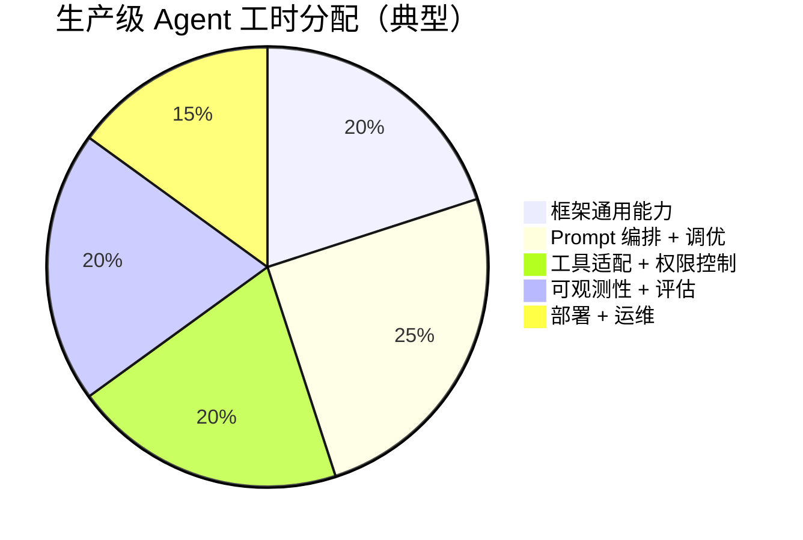

# 4.11 自研 vs 用框架：何时值得自己写

> 🟡 进阶

> **本节钩子**：本节是 L4 最"反共识"的一节——**反直觉事实**：生产级 Agent **80% 时间花在自研 prompt 编排 / 可观测性 / 工具适配**，框架只解决 20%。**这不是说框架没用**，而是框架解决的是"通用工程问题"（retry / streaming / 持久化），不解决"业务问题"（prompt 调优 / 工具设计 / 业务编排）。理解这一点，团队才不会陷入"换框架能解决一切"的幻觉。

## 正文大纲

1. **一句话定义**："自研 vs 框架"不是非此即彼——**大多数生产项目用"框架做骨架 + 自研做血肉"**；本节给出一张决策清单（团队规模 / 项目周期 / 性能要求 / 长期维护），并在文末给出"80/20 反直觉结论"。
2. **关键机制（5 个要点）**
   - **框架解决的 20%**：①基础设施（HTTP 客户端 / 重试 / 限流）②协议抽象（Function Calling 跨厂商转）③通用编排（sequential / parallel / conditional）④可观测性基础（trace / log）⑤工具生态（300+ 集成）。
   - **必须自研的 80%**：①**Prompt 编排**——业务专属的 system prompt 调优、few-shot 示例、tool routing logic；②**业务级可观测性**——业务指标的 trace（不只是 LLM trace）、A/B 实验、failure 分析；③**工具适配**——业务系统的私有 API 包装、权限控制、错误恢复；④**评估体系**——agent 评估数据集、ground truth、自动化打分；⑤**部署 & 运维**——容器化、灰度发布、熔断降级。
   - **决策清单**：①**团队规模**（<5 人 → 框架，5-20 人 → 框架 + 自研扩展，>20 人 → 自研核心 + 框架组件）；②**项目周期**（<3 个月 → 框架，3-12 个月 → 框架 + 选 1-2 个自研点，>12 个月 → 自研核心）；③**性能要求**（P95 < 1s 通常框架够，P95 < 100ms 需自研 streaming / 缓存层）；④**长期维护**（业务会持续 3 年以上 → 自研核心可避免框架升级绑架）。
   - **混合架构是常态**：用 LangGraph 做"主流程编排"（状态机 / 持久化），自研"业务节点"（prompt 模板 / 工具调用 / 评估）；用 LangChain 1.x 的 `init_chat_model()` 做协议抽象，自研"工具路由层"（业务专属的 tool 选择策略）。
   - **常见误区**：①"用框架就完事"——框架解决通用问题，业务问题还得写；②"自研 = 一切自己写"——错；可以**框架做骨架 + 自研做关键节点**；③"框架无关 = 自研"——错；抽象层仍是必要的（UnifiedTool / Function Calling 协议）。
3. **代码示例**：混合架构——LangGraph 做骨架 + 自研业务节点。
4. **常见误区**：
   - ❌ "换框架能解决性能问题"——错；性能瓶颈通常在 prompt / retrieval / cache，框架只是"调度器"。
   - ❌ "自研 = 重写 LLM 客户端"——错；自研的重点是"业务逻辑"，HTTP 客户端、retry 用现成的。
   - ✅ "用框架解决通用问题，自研解决业务问题"——这是 P4 的核心方法论。
5. **与 L4 衔接**：4.10 决策矩阵的"项目规模 / 长期维护"维度直接对应本节；附录 C 扩展。

## 图

- **主图 1**：框架 vs 自研的 80/20 工时分配饼图（mermaid pie chart）



- **辅助理解**：橙色"框架"只占 20%；其余 80% 是**业务专属工作**，框架帮不了。这是为什么"换框架不能解决业务问题"——业务问题（prompt / 工具 / 可观测性）从 0 到 1 都要自研，框架只提供脚手架。

## 代码

依赖：`langgraph>=0.4`, `langchain-openai`，演示"框架做骨架 + 自研做业务节点"的混合架构：

```python
"""
hybrid_architecture.py
框架（LangGraph）+ 自研（业务节点）的混合架构
依赖：langgraph>=0.4, langchain-openai
"""
from typing import TypedDict, Annotated
from operator import add
from langgraph.graph import StateGraph, START, END
from langgraph.checkpoint.memory import InMemorySaver
from langchain.chat_models import init_chat_model
from langchain_core.messages import HumanMessage, BaseMessage


# ========== 1. State schema（框架能力）==========
class AgentState(TypedDict):
    messages: Annotated[list[BaseMessage], add]
    user_id: str
    context: dict


# ========== 2. 业务节点 1：自研"Prompt 编排" ==========
def business_prompt_node(state: AgentState) -> dict:
    """自研节点：把业务上下文注入 prompt 模板。

    框架不擅长：业务专属的 system prompt 模板、few-shot 示例、user context 注入。
    """
    user_id = state["user_id"]
    user_role = state["context"].get("user_role", "guest")
    history = state["messages"][-5:]  # 最近 5 轮

    # 业务专属的 prompt 模板（自研核心）
    system_prompt = f"""你是 {user_role} 角色的助手。
    - 回答必须基于我们公司的产品文档
    - 用户 ID {user_id} 的偏好：{state["context"].get("preferences", {})}
    - 回答长度 < 200 字，避免长篇大论
    """

    # 把 system prompt 拼到消息开头（自研组装逻辑）
    from langchain_core.messages import SystemMessage
    new_messages = [SystemMessage(content=system_prompt)] + history
    return {"messages": new_messages}


# ========== 3. 业务节点 2：自研"Tool Routing" ==========
def business_tool_routing(state: AgentState) -> dict:
    """自研节点：根据业务规则决定暴露哪些工具。

    框架不擅长：业务专属的 tool 选择策略（按用户角色 / 配额 / 风险）。
    """
    user_role = state["context"].get("user_role", "guest")

    # 业务规则：guest 用户不能调退款工具
    available_tools = ["search_docs", "get_weather"]
    if user_role in ["vip", "admin"]:
        available_tools.append("refund_order")
    if user_role == "admin":
        available_tools.append("query_revenue_dashboard")

    return {"context": {**state["context"], "available_tools": available_tools}}


# ========== 4. 框架节点：LangGraph 的 ReAct Agent（用框架）==========
def react_agent_node(state: AgentState) -> dict:
    """框架节点：调 LangGraph prebuilt ReAct Agent 做工具调用循环。

    用框架：通用 ReAct 循环（LLM 决定调工具 + 执行 + 重试）。
    """
    from langgraph.prebuilt import create_react_agent

    # 自研：tool 列表来自前面节点的 state
    # 简化：实际从 state["context"]["available_tools"] 取工具对象
    tools = []  # 实战片段：构造可用 tool 列表

    llm = init_chat_model("openai:gpt-4o-mini")
    agent = create_react_agent(llm, tools)
    result = agent.invoke({"messages": state["messages"]})

    return {"messages": result["messages"]}


# ========== 5. 业务节点 3：自研"业务评估" ==========
def business_evaluator(state: AgentState) -> dict:
    """自研节点：业务评估（不仅是 LLM-as-judge，还有业务 KPI）。

    框架不擅长：业务专属的评估指标（如"是否推荐了竞品"、"是否泄露 PII"）。
    """
    last_response = state["messages"][-1].content

    # 业务规则：检查 PII 泄露
    pii_keywords = ["身份证", "手机号", "邮箱"]
    leaked_pii = any(kw in last_response for kw in pii_keywords)

    # 业务规则：检查是否提到竞品（合规要求）
    competitor_keywords = ["竞品A", "竞品B"]
    mentioned_competitor = any(kw in last_response for kw in competitor_keywords)

    evaluation = {
        "leaked_pii": leaked_pii,
        "mentioned_competitor": mentioned_competitor,
        "response_length": len(last_response),
    }

    return {"context": {**state["context"], "evaluation": evaluation}}


# ========== 6. 状态机编排（框架）==========
workflow = (
    StateGraph(AgentState)
    .add_node("prompt_engineering", business_prompt_node)   # 自研
    .add_node("tool_routing", business_tool_routing)        # 自研
    .add_node("react_agent", react_agent_node)              # 框架
    .add_node("evaluator", business_evaluator)              # 自研
    .add_edge(START, "prompt_engineering")
    .add_edge("prompt_engineering", "tool_routing")
    .add_edge("tool_routing", "react_agent")
    .add_edge("react_agent", "evaluator")
    .add_edge("evaluator", END)
    .compile(checkpointer=InMemorySaver())
)
```

实战要点：
1. **黄色节点（业务节点）**——80% 是自研；灰色节点（ReAct Agent）——20% 是框架。
2. **业务节点的位置很关键**——通常在入口（prompt 编排）、路由（tool routing）、出口（评估）；框架节点放中间做工具调用循环。
3. **状态 dict 跨节点共享**——`state["context"]` 是业务节点写入、框架节点读取的桥梁。

## 实战片段

真实工程里，混合架构通常配"**业务可观测性 + 评估体系**"——下面是一个"自研业务 trace + LangSmith LLM trace"双层监控的生产模式：

```python
# hybrid_production.py
import time
from typing import TypedDict
from langgraph.graph import StateGraph, START, END
from langgraph.checkpoint.postgres import PostgresSaver
from langsmith import traceable  # 框架能力：LLM trace


# ========== 1. 自研业务 Trace ==========
class BusinessTrace:
    """自研：业务级 trace（不是 LangSmith 的 LLM trace）。"""

    def __init__(self, session_id: str, user_id: str):
        self.session_id = session_id
        self.user_id = user_id
        self.events = []

    def event(self, name: str, **attrs):
        """记录业务事件。"""
        self.events.append({
            "ts": time.time(),
            "name": name,
            "session_id": self.session_id,
            "user_id": self.user_id,
            **attrs,
        })

    def flush_to_db(self):
        """实战片段：发到 ClickHouse / BigQuery。"""
        # 业务 KPI：转化率 / 失败率 / 用户路径分析
        pass


# ========== 2. 业务节点带 trace ==========
class AgentState(TypedDict):
    messages: list
    user_id: str
    business_trace: dict  # 业务 trace 对象（自研）


def business_node_with_trace(state: AgentState) -> dict:
    """自研节点 + 业务 trace 记录。"""
    trace = BusinessTrace(
        session_id="s-123",
        user_id=state["user_id"],
    )
    trace.event("enter_prompt_engineering", input_state=state)

    # ... 业务逻辑 ...

    trace.event("exit_prompt_engineering", output=result)
    trace.flush_to_db()
    return {"messages": result, "business_trace": trace.events}


# ========== 3. 框架节点带 LangSmith trace ==========
@traceable(name="react_agent_node")  # LangSmith 装饰器
def react_agent_with_langsmith(state: AgentState) -> dict:
    """框架节点：ReAct Agent + LangSmith 自动 trace。"""
    from langgraph.prebuilt import create_react_agent
    agent = create_react_agent(...)  # 框架自动 trace 所有 LLM/tool_call
    result = agent.invoke({"messages": state["messages"]})
    return {"messages": result["messages"]}


# ========== 4. 混合编排 ===========
workflow = (
    StateGraph(AgentState)
    .add_node("business_1", business_node_with_trace)       # 自研 + 业务 trace
    .add_node("framework_1", react_agent_with_langsmith)    # 框架 + LangSmith
    .add_node("business_2", business_evaluator_with_trace)  # 自研 + 业务 trace
    .add_edge(START, "business_1")
    .add_edge("business_1", "framework_1")
    .add_edge("framework_1", "business_2")
    .add_edge("business_2", END)
    .compile(checkpointer=PostgresSaver(...))
)
```

实战要点：
- **双层 trace 不可替代**——LangSmith 看 LLM 调用（哪些 prompt 触发了哪些工具），业务 trace 看业务路径（用户走了哪条流、转化率多少）；只看 LangSmith 找不到业务问题。
- **业务节点通常要 trace**——80% 调试时间花在"为什么业务指标掉了"，不是"为什么 LLM 出错了"。
- **框架节点的 trace 免费**——LangSmith / OpenAI Tracing / Langfuse 等都是"装饰器 + 自动 trace"，你只管写业务逻辑。

## 自测题

1. **概念辨析**：生产级 Agent 工时的 80% 花在哪 4 类工作上？为什么说"换框架不能解决业务问题"？
2. **场景判断**：5 人小团队，3 个月交付一个企业内部 RAG 产品。下面哪个**最务实**？
   - A. 完全自研
   - B. 框架 + 自研扩展
   - C. 用框架就完事
   - D. 等框架成熟
3. **代码补全**：补全下面节点，让"业务评估"写入 state["evaluation"]：
   ```python
   def business_evaluator(state: AgentState) -> dict:
       last_response = state["messages"][-1].content
       leaked_pii = "身份证" in last_response
       return {"context": {**state["context"], "evaluation": {"leaked_pii": ???}}}
   ```
4. **反直觉题**：有人说"用了 LangGraph 就解决了 agent 工程问题"。这个说法对吗？LangGraph 解决 vs 不解决的问题分别是什么？
5. **决策题**：你的项目决定走"自研核心 + 框架组件"。请列出 3 个**应该自研的核心模块**和 3 个**应该用框架的组件**。

**答案**：1. ①Prompt 编排（25%），②工具适配+权限（20%），③可观测性+评估（20%），④部署+运维（15%）。换框架不能解决业务问题，因为：①业务 prompt 与业务强相关，没有通用框架；②业务工具是私有 API，框架不替你写；③业务评估是 KPI 导向（不只 LLM 准确率）。框架只解决通用工程问题。2. **B 最务实**——5 人 + 3 个月，时间紧；框架做骨架（LangGraph 编排 + LangChain 协议抽象）+ 自研扩展（业务 prompt / 工具 / 评估）。A 完全自研 3 个月做不完；C "用框架就完事"忽视了业务节点；D "等框架成熟"延误交付。3. `leaked_pii: leaked_pii`（左是 dict key，右是变量值）。也可以写成 `{"leaked_pii": leaked_pii, "response_length": len(last_response)}` 加更多指标。4. **不对**——LangGraph 解决的是"通用状态机 + 持久化 + HITL 框架"（节点编排、checkpoint、interrupt），**不解决**：①业务 prompt 设计；②业务工具适配；③业务评估指标；④业务部署 & 运维。LangGraph 是脚手架，业务问题要业务自己写。5. 自研核心：①**业务 prompt 模板** + few-shot 示例；②**业务工具**（私有 API 包装 + 权限控制）；③**业务评估**（PII 检查 / 竞品过滤 / KPI 指标）。框架组件：①**HTTP 客户端 + retry**（用 LangChain 1.x 的 ChatModel）；②**协议抽象**（Function Calling 跨厂商）；③**状态机编排**（用 LangGraph StateGraph）。

> 📚 本节参考
> - [S 级] LangGraph 官方文档 — https://docs.langchain.com/oss/python/langgraph/overview （框架能解决 vs 不能解决的问题边界）
> - [S 级] LangChain LCEL — https://docs.langchain.com/oss/python/langchain/runnables （Runnable 抽象作为"骨架"基础）
> - [S 级] Anthropic Tool Use 协议 — https://docs.anthropic.com/en/docs/agents-and-tools/tool-use/overview （工具调用的协议基础）
> - [A 级] LangSmith 可观测性 — https://www.langchain.com/langsmith （LLM trace 工具，仅是 20% 的可观测性解决方案）