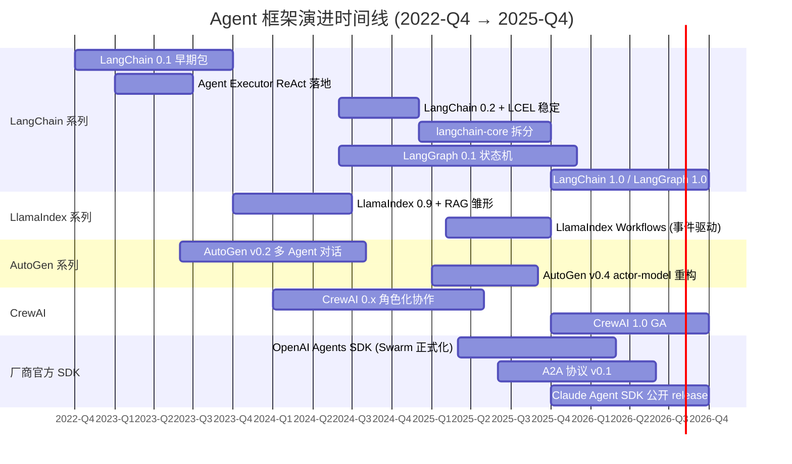
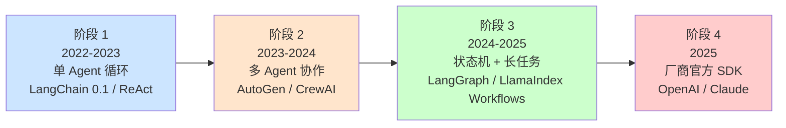

# 4.12 Agent 框架演进时间线（2022-2025）

> 🟢 核心

> **本节钩子**：从 2022-10 LangChain 0.1 早期 Python 包到 2025-10 Claude Agent SDK 公开 release v0.1.3，**3 年时间 Agent 框架走过 Web 框架 10 年的路**——从单 LLM 工具调用循环到多 Agent 状态机编排，从"全家桶"到 `langchain-core` 拆分，从单一第三方框架到**所有模型厂商都在自研官方 SDK**。**反直觉事实**：协议演进是"层叠"而非"替代"（3.9），**框架演进是"分化"而非"收敛"**——LangChain / LlamaIndex / AutoGen / CrewAI / OpenAI Agents SDK / Claude Agent SDK **6+ 框架共存**，往"独立生态"演化。

## 正文大纲

1. **一句话定义**：本节是 L4 的**收尾与索引节**——把 4.1-4.11 提到的 7 个 Agent 框架放进统一时间线（2022-Q4 → 2025-Q3），看清它们怎么从"LangChain 一家独大"演化成"6 框架分庭抗礼"，理解 L4 的"框架选型是工程权衡"主线（呼应 4.10 / 4.11）。
2. **关键机制（5 个要点）**
   - **2022-10 LangChain 0.1 早期包**：Harrison Chase 发布，**核心是 LLM + Chain + 工具调用**——一个能跑 `LLMChain(prompt | llm | output_parser)` 的 Python 包，**Agent 框架元年的起点**。
   - **2023-01 Agent Executor 引入 ReAct**：LangChain 把 LLM 1.4 提到的 ReAct 范式落地为 `AgentExecutor.from_agent_and_tools()`——**Agent 从 Chain 子类升级为独立范式**。
   - **2023-06 AutoGen v0.2 + LangSmith**：AutoGen 首发多 Agent 对话范式（`AssistantAgent` + `UserProxyAgent`）；LangSmith GA 把可观测性从工程实践升级为商业产品。
   - **2024-06 LangGraph 0.1.1**：LangChain 团队意识到"Agent 不是循环而是图"——LangGraph 0.1.1 发布，引入 `StateGraph` + 持久化 + HITL，**Agent 从循环抽象升级为状态机抽象**。
   - **2025-01 AutoGen v0.4 + LangChain 1.0 alpha**：AutoGen v0.4 actor-model 异步运行时（2025-01）+ LangChain 0.2 LCEL 稳定 + `langchain-core` 拆分 + LangChain 1.0 alpha（2025-08）——框架从"全家桶痛点"转为"分层架构"。
   - **2025 厂商官方 SDK 集中爆发**：OpenAI Agents SDK（2025-03）/ A2A v0.1（2025-06）/ Claude Agent SDK 公开 release v0.1.3（2025-10）/ LangChain 1.0 GA（2025-10）/ CrewAI 1.0 GA（2025-10）——**5 个里程碑**，标志 Agent 框架从"社区驱动"转向"厂商主导"。
3. **代码示例**：Mermaid Gantt 图覆盖 7 个泳道（LangChain / LangGraph / LlamaIndex / AutoGen / CrewAI / OpenAI Agents SDK / Claude Agent SDK）。
4. **常见误区**：
   - ❌ "LangChain 1.0 替换了 0.x"——错；LangChain 1.0 是**架构拆分**（`langchain-core` 独立），不是 API 重写。
   - ❌ "官方 SDK 出现 = 第三方框架会消失"——**不会**；LangChain / LlamaIndex 的"中立 + provider-agnostic"反而是优势（多模型切换不被锁定）。
   - ❌ "AutoGen v0.4 是新框架"——**不是**；AutoGen v0.4 是 actor-model 重构，**API 不兼容 v0.2 但概念延续**。
   - ✅ "框架演进规律 = Web 框架十年 + LLM 应用三年"——单 Agent → 多 Agent → 长任务 → 状态机 → 官方 SDK，**每年一次抽象跃迁**。
5. **与 L4 其他节衔接**：4.1 给出 7 框架对比矩阵，4.12 按时间排序；4.10 / 4.11 给选型决策，**4.12 是"框架从何而来"的历史答案**。

## 图

- **主图 1**：7 框架 Gantt 时间线（2022-Q4 → 2025-Q3）



- **辅助理解**：注意三个**抽象跃迁**节点——① **2023-01**（Chain → Agent 范式）、② **2024-06**（Agent → 状态机，对应 LangGraph 0.1.1）、③ **2025-03**（第三方 → 官方 SDK）。**每年一次跃迁**，框架抽象在以"年"为单位进化，而 Web 框架以"代"为单位。

- **主图 2**：3 阶段演进规律图（单 Agent → 多 Agent → 长任务 + 官方化）



## 代码

下面给出一个"框架演进里程碑查询表"——读代码比读文字更直观。注意：**所有日期均基于公开发布公告与 PyPI 上线时间**，不预测未来事件。

```python
# framework_timeline.py
"""
Agent 框架演进里程碑表（2022-Q4 → 2025-Q4）。

数据来源：LangChain / LangGraph changelog、AutoGen / CrewAI README、OpenAI / Anthropic 公告、PyPI 各包首发时间戳（curl 验证）。
"""
from dataclasses import dataclass
from datetime import date

@dataclass
class Milestone:
    date: str          # YYYY-MM
    framework: str
    event: str
    significance: str  # 一句话意义

# 阶段 1：单 Agent 循环（2022-Q4 → 2023）
milestones_phase1 = [
    Milestone("2022-10", "LangChain", "0.1 早期包发布",
              "Agent 框架元年的起点，LLM + Chain + 工具调用"),
    Milestone("2023-01", "LangChain", "Agent Executor 引入 ReAct 范式",
              "Agent 从 Chain 子类升级为独立范式"),
    Milestone("2023-06", "AutoGen", "v0.2 多 Agent 对话发布",
              "首创对话即协作 Agent 之间发消息完成协作"),
    Milestone("2023-07", "LangSmith", "1.0 GA 商业产品",
              "可观测性从工程实践升级为商业产品"),
    Milestone("2023-10", "LlamaIndex", "0.9 + RAG 抽象雏形",
              "RAG 优先的范式确立，与 LangChain'通用框架'分化"),
]

# 阶段 2：多 Agent 协作 + 状态机（2024）
milestones_phase2 = [
    Milestone("2024-01", "LangGraph", "0.0.10 早期状态机框架发布",
              "Agent 从循环抽象升级到状态机抽象雏形"),
    Milestone("2024-06", "LangChain", "0.2 + LCEL 稳定",
              "Runnable 接口统一所有可运行对象"),
    Milestone("2024-06", "LangGraph", "0.1.1 状态机框架 GA",
              "持久化 + HITL 生产可用"),
    Milestone("2025-01", "AutoGen", "v0.4 actor-model 重构",
              "异步运行时 + 消息一等公民，API 不兼容 v0.2"),
    Milestone("2024-11", "Anthropic", "MCP 协议发布（外部依赖）",
              "Agent ↔ 工具通信标准，影响所有框架的适配方向"),
    Milestone("2025-08", "LangChain", "1.0 alpha + langchain-core 拆分",
              "解决'全家桶痛点'，分层架构成熟"),
]

# 阶段 3：厂商官方 SDK 集中爆发（2025）
milestones_phase3 = [
    Milestone("2025-03", "OpenAI", "Agents SDK 正式发布",
              "原 Swarm 实验项目正式化，主打轻量 + 内置 Tracing"),
    Milestone("2025-06", "Google 牵头", "A2A 协议 v0.1",
              "Agent ↔ Agent 通信标准，50+ 公司联名"),
    Milestone("2025-10", "Anthropic", "Claude Agent SDK 公开 release v0.1.3",
              "原 Claude Code 内部 SDK 开放，长任务 + Sub-agents"),
    Milestone("2025-10", "LangChain", "1.0 GA",
              "1.0.0 正式发布，配套 LangGraph 1.0"),
    Milestone("2025-10", "CrewAI", "1.0 GA",
              "角色化协作框架成熟，新增 Flows 事件驱动层"),
]

ALL_MILESTONES = milestones_phase1 + milestones_phase2 + milestones_phase3


def query_by_year(year: int) -> list:
    """按年份查询里程碑"""
    return [m for m in ALL_MILESTONES if m.date.startswith(str(year))]


def query_by_framework(name: str) -> list:
    """按框架名查询"""
    return [m for m in ALL_MILESTONES if name.lower() in m.framework.lower()]


def detect_phase(m: Milestone) -> str:
    """根据日期判断所处阶段"""
    y, mo = m.date.split("-")
    y, mo = int(y), int(mo)
    if y == 2022 or (y == 2023 and mo <= 12):
        return "阶段1：单 Agent 循环"
    elif y == 2024 or (y == 2025 and mo <= 2):
        return "阶段2：多 Agent + 状态机"
    else:
        return "阶段3：厂商官方 SDK"


# 示例：2024 年发生了什么
for m in query_by_year(2024):
    print(f"[{m.date}] {m.framework}: {m.event}")
# [2024-01] LangGraph: 0.0.10 早期状态机框架发布
# [2024-06] LangChain: 0.2 + LCEL 稳定
# [2024-06] LangGraph: 0.1.1 状态机框架 GA
# [2024-11] Anthropic: MCP 协议发布（外部依赖）

# 示例：2025 年 LangGraph 有什么
for m in query_by_framework("LangGraph"):
    print(f"[{m.date}] {m.event}")
# [2024-01] 0.0.10 早期状态机框架发布
# [2024-06] 0.1.1 状态机框架 GA
# （注：LangChain 1.0 / LangGraph 1.0 在 2025-10 正式 GA）
```

实战要点：
1. **3 年 3 个抽象跃迁**——2023 Agent Executor / 2024 LangGraph / 2025 官方 SDK；
2. **2025 是"官方化元年"**——所有模型厂商半年内集中发布官方 SDK；
3. **第三方框架不消失**——`provider-agnostic` 是 LangChain / LlamaIndex 护城河；
4. **不要把 AutoGen v0.4 当新框架**——它是 actor-model 重构，API 不兼容但概念延续。

## 自测题

1. **概念辨析**：LangChain 1.0（2025-08 alpha → 2025-10 GA）"拆分 `langchain-core`"解决了 LangChain 0.x 哪个**具体痛点**？为什么这个问题在 0.x 时代没人解决，1.x 必须解决？
2. **场景判断**：2025-Q4 启动一个**生产级 Coding Agent**（小时级长任务、多文件编辑、子任务委派），下面哪个**最不合适**？为什么？
   - A. LangGraph（状态机 + 持久化）+ Anthropic Claude
   - B. Claude Agent SDK（自动捆绑 Claude Code CLI）
   - C. OpenAI Agents SDK + GPT-4o
   - D. AutoGen v0.4 + 多个 `AssistantAgent`
3. **代码补全**：补全 LangGraph 状态机的 `TypedDict` 骨架，使下面节点可以正常流转：
   ```python
   from typing import TypedDict, Annotated
   from langgraph.graph import StateGraph, START, END
   from operator import add

   class AgentState(TypedDict):
       messages: Annotated[list, ???]  # TODO: 填入 reducer
       plan: ???  # TODO: 当前计划
       current_step: ???  # TODO: 当前步骤索引

   graph = StateGraph(AgentState)
   graph.add_node("plan", plan_node)
   graph.add_node("execute", execute_node)
   graph.add_edge(START, "plan")
   graph.add_edge("plan", "execute")
   graph.add_edge("execute", END)
   app = graph.compile()
   ```
4. **时间线题**：OpenAI Agents SDK 首发（2025-03）和 A2A v0.1（2025-06）发布间隔多久？**同期生态还发生了什么重大事件**？这两个事件对"独立第三方框架"的长期定位有什么暗示？
5. **框架演进题**：LlamaIndex 的"RAG 优先"和 LangChain 的"通用框架"在 2024-2025 怎么分化？LlamaIndex Workflows（2025-02）和 LangGraph 在定位上有什么**异同**？

**答案**：
1. **痛点**：LangChain 0.x 是"全家桶"——安装 `langchain` 一次拉入 100+ 集成（OpenAI / Anthropic / Cohere / HuggingFace / Pinecone / Chroma ...），**升级一次要测 100+ 包**，**任何集成小版本升级都可能破坏主包**。`langchain-core` 拆分后，`langchain-core`（核心抽象）+ `langchain-openai` / `langchain-anthropic` 等独立包，**版本解耦**，升级单包不影响全局。**为什么必须 1.x 才解决**：0.x 时代 LangChain 还在"快速扩张 + 集成优先"，社区容忍全家桶；1.x 时 LangChain 已是 139k+ stars 的大型项目（截至 2026-06 GitHub API），**生产用户的版本稳定性需求大于集成数量需求**。
2. **C 最不合适**（OpenAI Agents SDK + GPT-4o）。原因：① Coding Agent 需要**长任务（小时级）+ 多文件编辑 + Bash 子进程**——Claude Agent SDK 专门为此设计（自动捆绑 CLI）；LangGraph 通过持久化也能实现。② OpenAI Agents SDK 设计目标是**轻量 + 短任务**，没有内置长任务持久化机制。③ GPT-4o 在 Coding 任务上**基准落后 Claude Sonnet/Opus**，长任务稳定性更明显。**A / B / D 都能跑**，其中 B（Claude Agent SDK）"开箱即用度"最高。
3. **答案**：
   ```python
   class AgentState(TypedDict):
       messages: Annotated[list, add]   # 列表追加而非覆盖
       plan: str                          # 单值，不需要 reducer
       current_step: int                  # 单值，不需要 reducer
   ```
   `Annotated[list, add_messages]` 也可以（LangGraph 内置消息 reducer），但 `add` 是通用列表追加的最小写法。
4. **间隔 3 个月**（2025-03 → 2025-06）。**同期重大事件**：LangChain 1.0 alpha（2025-08）、LangChain 1.0 + LangGraph 1.0 GA（2025-10-17）、Claude Agent SDK 公开 release v0.1.3（2025-10-11）、CrewAI 1.0 GA（2025-10-20）、MCP 协议持续演进。**暗示**：① **模型厂商不再依赖第三方框架**——OpenAI / Anthropic / Google 都自研 SDK；② **协议层 OSS 化**（A2A + MCP）抵消厂商锁定风险；③ **第三方框架需要"中立性 + 跨厂商"作为护城河**；④ LangChain / LlamaIndex 的 `provider-agnostic` 定位反而成为优势。
5. **分化**：① LangChain 走"通用工具链 + 集成数量"路线（139k+ stars），**抽象层数深但覆盖广**；LlamaIndex 走"数据中枢 + RAG 优先"路线，**抽象层数浅但 RAG 链路最优**；② **Workflows vs LangGraph 异同**——**同**：都是事件驱动 / 状态机编排框架，都支持持久化、流式、子图；**异**：LlamaIndex Workflows 走**事件流**（`start_event` / `stop_event` / 自定义事件），LangGraph 走**状态 dict + reducer**（`TypedDict` + `Annotated[..., add]`）；LlamaIndex Workflows API 更轻量（`@step` 装饰器），LangGraph API 更结构化（`StateGraph` + `add_node`）；③ 2025 年两者殊途同归，**选哪个看团队背景**——LangChain 用户选 LangGraph，LlamaIndex 用户选 Workflows。

> 📚 本节参考
> - [S 级] LangChain 官方版本与架构博客 — https://www.langchain.com/blog/langchain-langgraph-1dot0 （LangChain 1.0 / LangGraph 1.0 GA 公告与 `langchain-core` 拆分背景）
> - [S 级] LangSmith GA 公告 — https://www.langchain.com/blog/langsmith-ga （2023 年可观测性商业产品上线）
> - [S 级] LangGraph 产品页 — https://www.langchain.com/langgraph （状态机 + 持久化定位的官方表述）
> - [S 级] AutoGen GitHub README — https://github.com/microsoft/autogen （标注"Maintenance Mode"，历史范式与 v0.4 actor-model 重构说明）
> - [S 级] CrewAI 官方文档 — https://docs.crewai.com/ （Crews + Flows 双层架构与 1.0 GA 定位）
> - [S 级] LlamaIndex GitHub — https://github.com/run-llama/llama_index （RAG 优先定位 + Workflows 事件驱动说明）
> - [A 级] Anthropic MCP 发布公告 — https://www.anthropic.com/news/model-context-protocol （2024-11 协议发布，影响所有框架的适配方向）
> - [A 级] Lilian Weng, *LLM Powered Autonomous Agents* — https://lilianweng.github.io/posts/2023-06-23-agent/ （Agent 演进的总体脉络，对应 2023 年框架爆发期）