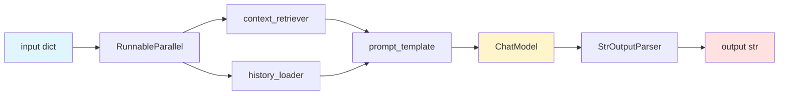

# 4.2 LangChain 1.x：Runnable 与 LCEL

> 🟢 核心

> **本节钩子**：LangChain 0.x 的"Chain/Agent/Retriever"三大抽象在 0.1 之后被一刀切到底——**所有可运行对象都是 `Runnable`**，统一接口 `invoke/stream/batch`，配合 LCEL（LangChain Expression Language）的 `|` 管道操作符，让你能像写 Unix pipeline 一样组合 LLM 应用。**反直觉事实**：`prompt | llm | parser` 不是语法糖，而是**协议级抽象**——所有节点都实现了同一组方法，框架才能做并行、缓存、持久化的统一调度。

## 正文大纲

1. **一句话定义**：`Runnable` 是 LangChain 的统一抽象接口；LCEL 是用 `|` 操作符组合 Runnable 的表达语言。所有组件（ChatModel、PromptTemplate、OutputParser、Retriever、Tool）都是 Runnable，所以 LCEL 管道可以任意嵌套和并行。
2. **关键机制（5 个要点）**
   - **统一接口**：每个 Runnable 都暴露 `invoke / ainvoke / stream / astream / batch / abatch`，输入输出都是单一类型（str → str、dict → str 等），**协议无关**。
   - **LCEL 管道**：`chain = prompt | llm | parser`，`|` 实际调用 `Runnable.__or__` 返回新的 `RunnableSequence`，**自动获得 streaming、async、batch、retry、tracing 能力**。
   - **辅助原语**：`RunnableParallel`（字段级并行）、`RunnablePassthrough.assign`（透传 + 新增）、`RunnableLambda`（把普通函数提升为 Runnable）、`RunnablePick`（从 dict 取单个键）。
   - **LangChain 1.x 关键变化（2025-08 → 2025-10）**：`langchain-core` 拆分为独立 PyPI 包（`langchain-core` ≥ 0.3），第三方集成迁移到 `langchain-<provider>`（`langchain-openai` / `langchain-anthropic`）；`init_chat_model()` 统一入口；agent 创建从 `initialize_agent` 改为 `langchain.agents.create_agent`（1.x 高阶封装），需要 ReAct + 状态机时改用 `langgraph.prebuilt.create_react_agent`。
   - **统一模型入口**：`init_chat_model("openai:gpt-4o")` / `init_chat_model("anthropic:claude-3-5-sonnet-20241022")`，**协议差异被屏蔽在内部**，应用层无感。
3. **代码示例**：一个完整 LCEL 链——从 prompt 到 streaming 输出。
4. **常见误区**：
   - ❌ "LCEL 只是 `|` 操作符"——它实际是个**状态机**（每节点决定下节点输入）；如果你以为它像函数组合那样"立即执行"，会踩"运行时才解析 prompt 变量"的坑。
   - ❌ "用 LangChain 0.x 的 `LLMChain`"——已弃用，新代码全用 LCEL。
   - ✅ "Runnable 可以嵌套 Runnable"——`chain1 | (branch_a | branch_b)` 完全合法。
5. **与 L3 衔接**：L3.1 Function Calling 在 LangChain 通过 `bind_tools()` 暴露，自动转 OpenAI/Anthropic 协议；L3.8 Streaming 由 LCEL 原生支持（`chain.stream()`）。

## 图

- **主图 1**：LCEL 管道的数据流图（输入 → prompt → llm → parser → 输出，含并行分支）



- **辅助理解**：注意 `RunnableParallel` 不是"并行执行所有"——它是**字典映射**，每个键一个 Runnable；LCEL 运行时调度器决定是否真正并发。ChatModel 是黄色（协议转换点），它的输入是 dict、输出是 `AIMessage`，前面必须把所有变量填齐。

## 代码

依赖：`langchain>=1.0`, `langchain-openai`, `langchain-anthropic`，下面演示 LCEL 管道 + streaming：

```python
"""
lcel_basic.py
LCEL 管道 + streaming + async 演示
依赖：langchain>=1.0, langchain-openai, langchain-anthropic
运行：python lcel_basic.py  (需要 OPENAI_API_KEY 或 ANTHROPIC_API_KEY)
"""
import asyncio
from langchain.chat_models import init_chat_model
from langchain_core.prompts import ChatPromptTemplate
from langchain_core.output_parsers import StrOutputParser
from langchain_core.runnables import (
    RunnableParallel,
    RunnablePassthrough,
    RunnableLambda,
)

# ========== 1. 基础管道：prompt | llm | parser ==========
prompt = ChatPromptTemplate.from_messages([
    ("system", "你是一个 helpful 助手。用{language}回答。"),
    ("human", "{question}"),
])

# 统一入口 init_chat_model，支持 openai: / anthropic: / ollama: 等命名空间
llm = init_chat_model("openai:gpt-4o-mini")  # 实战片段：需 API key
# llm_anthropic = init_chat_model("anthropic:claude-3-5-sonnet-20241022")
parser = StrOutputParser()

basic_chain = prompt | llm | parser

# invoke 同步调用
# result = basic_chain.invoke({"language": "中文", "question": "1+1=?"})
# print(result)  # "1+1 等于 2。"

# stream 流式输出（首 token < 500ms）
# for chunk in basic_chain.stream({"language": "中文", "question": "讲个笑话"}):
#     print(chunk, end="", flush=True)

# batch 批量（自动并发）
# results = basic_chain.batch([
#     {"language": "中文", "question": "1+1=?"},
#     {"language": "中文", "question": "2+2=?"},
# ])


# ========== 2. RunnableParallel：字段级并行 ==========
def fake_retriever(query: str) -> str:
    # 实战片段：真实用 VectorStoreRetriever
    return f"[检索片段] 与 '{query}' 相关的上下文..."

retrieval_chain = (
    RunnableParallel({
        "context": RunnableLambda(fake_retriever),
        "question": RunnablePassthrough(),  # 透传原 input
    })
    | prompt
    | llm
    | parser
)

# result = retrieval_chain.invoke("LangChain 是什么")
# 此时 prompt 拿到 context + question 两个字段


# ========== 3. async 模式（生产首选）==========
async def async_demo():
    result = await basic_chain.ainvoke({"language": "中文", "question": "Async?"})
    print(f"async result: {result}")

# asyncio.run(async_demo())


# ========== 4. 与 Function Calling 衔接（bind_tools）==========
from langchain_core.tools import tool

@tool
def get_weather(city: str) -> str:
    """查询天气。"""
    return f"{city}:晴,25°C"

llm_with_tools = llm.bind_tools([get_weather])
# resp = llm_with_tools.invoke("北京天气?")
# resp.tool_calls  # list of tool call dicts
```

实战要点：
1. **`init_chat_model` 是 LangChain 1.x 推荐入口**——`langchain.chat_models.init_chat_model` 统一 openai/anthropic/ollama/openrouter 等 100+ 提供商，模型名用 `provider:model` 格式。
2. **LCEL 自动获得 5 个能力**——streaming / async / batch / retry / tracing；你写一个 pipe，免费拿到 5 个特性。
3. **并行不是免费的**——`RunnableParallel` 在某些 runtime 下并不真正并行（同步 LLM 客户端阻塞），需要 `abatch` + async LLM 客户端才能并发。

## 实战片段

真实工程里，LCEL 链通常与 LangSmith（observability）配合。下面是一个**带回调 + 失败重试**的生产级管道：

```python
# lcel_production.py
from langchain.chat_models import init_chat_model
from langchain_core.prompts import ChatPromptTemplate
from langchain_core.output_parsers import StrOutputParser
from langchain_core.runnables import RunnableConfig

llm = init_chat_model("openai:gpt-4o", temperature=0)
prompt = ChatPromptTemplate.from_template("总结：{text}")
chain = prompt | llm | StrOutputParser()

# 1) 带 trace 的 invoke（自动上报 LangSmith）
result = chain.invoke(
    {"text": "..."},
    config=RunnableConfig(
        run_name="summarize",
        tags=["production", "summarization"],
        metadata={"user_id": "u-123", "request_id": "r-456"},
    ),
)

# 2) 失败重试：LCEL 默认不带 retry，需用 with_retry
retry_chain = chain.with_retry(
    stop_after_attempt=3,        # 最多 3 次
    wait_exponential_jitter=True, # 指数退避 + 抖动
)

# 3) 失败 fallback：LLM 不可用时降级到本地小模型
from langchain_core.runnables import RunnableWithFallbacks
fallback_chain = RunnableWithFallbacks(
    runnable=chain,
    fallbacks=[init_chat_model("ollama:qwen2.5:7b") | StrOutputParser()],
)

# 4) 流式 + 中途取消
import asyncio
async def streaming_with_cancel():
    async for chunk in chain.astream({"text": "..."}):
        print(chunk, end="")
        # 真实场景：检测到 stop event 就 break
```

实战要点：
- **生产链路 4 件套**：trace（LangSmith）+ retry（with_retry）+ fallback（RunnableWithFallbacks）+ timeout（with_config）；LCEL 用 4 个 `with_*` 方法即插即用。
- **`RunnableConfig` 透传 metadata**——这是把 trace_id 关联到业务请求的关键。

## 自测题

1. **概念辨析**：LangChain 1.x 的 `Runnable` 接口暴露哪些方法？`invoke` / `stream` / `batch` 三者的语义差是什么？
2. **场景判断**：你在做一个 RAG 应用，要求"先检索再生成"。下面哪个**不是** Runnable？
   - A. `ChatPromptTemplate`
   - B. `init_chat_model("openai:gpt-4o")`
   - C. `StrOutputParser()`
   - D. `lambda x: x.upper()`（裸 Python lambda）
3. **代码补全**：把下面 LCEL 链补完整，让 `context` 与 `question` 都能作为 prompt 输入：
   ```python
   chain = (
       RunnableParallel({
           "context": retriever,
           ???: RunnablePassthrough(),
       })
       | prompt
       | llm
       | parser
   )
   ```
4. **反直觉题**：有人说"LCEL 的 `|` 就是个语法糖，跟函数组合一样"。请列出至少 2 个反直觉差异。
5. **迁移题**：你有一个 0.x 时代的 `LLMChain` 代码，想迁到 1.x。请写出最小迁移方案（提示：`LLMChain(prompt=..., llm=...)` 怎么改写）。

**答案**：1. 6 个方法——`invoke` / `ainvoke`（同步/异步单次）、`stream` / `astream`（流式）、`batch` / `abatch`（批量）。`invoke` 阻塞等全部 token 完成后返回；`stream` 边生成边 yield；`batch` 自动并发执行多个输入（默认走 ThreadPool）。2. **D**——裸 `lambda` 不是 Runnable。正确做法是 `RunnableLambda(lambda x: x.upper())`，把函数包装成 Runnable 才会触发 LCEL 的 tracing/streaming 能力。3. `"question"`（透传原 input 字段）。`RunnablePassthrough()` 把上游输入原封不动作为 `"question"` 字段，与 `retriever` 输出 `"context"` 并列。4. ① **`|` 在 invoke 时才执行**——不是"组合时立即计算"，你不能在 chain 外面做 `print(chain)` 看到结果，只能看到对象表示。② **`RunnableParallel` 不一定并发**——同步 LLM 客户端下，多个 Runnable 串行执行；要并发需要 `abatch` + async LLM。③ **失败处理点不同**——链中某节点失败会抛异常，LCEL 不会自动重试，需显式 `with_retry`。5. 最小迁移：`LLMChain(prompt=p, llm=llm)` → `p | llm | StrOutputParser()`（默认加 StrOutputParser 拿纯文本）。如果原代码用 `chain.run(input)`，新版改 `chain.invoke(input)`。如要保留原有 `AgentExecutor`，1.x 推荐用 LangGraph 的 `create_react_agent`（见 4.3）。

> 📚 本节参考
> - [S 级] LangChain LCEL 官方文档 — https://docs.langchain.com/oss/python/langchain/runnables （Runnable 接口、LCEL 表达式、5 种 with_* 方法权威说明）
> - [S 级] LangChain Core README — https://github.com/langchain-ai/langchain/tree/master/libs/core （`langchain-core` 包定位与稳定版本策略）
> - [S 级] LangChain 1.x 迁移指南 — https://docs.langchain.com/oss/python/migrate/langchain-v1 （0.x → 1.x 主要破坏性变更清单）
> - [A 级] LangChain Runnable 概念文档 — https://reference.langchain.com/python/langchain_core/runnables/ （Runnable / RunnableSequence / RunnableParallel API 参考）