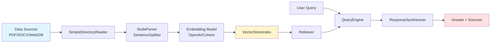

# 4.4 LlamaIndex：RAG 优先的范式

> 🟢 核心

> **本节钩子**：LangChain 是"工具胶水"，LlamaIndex 是"数据中枢"——同一个 RAG 任务，LangChain 要拼 `Document Loader + Text Splitter + Embeddings + VectorStore + Retriever + QA Chain` 六块，LlamaIndex 用 `SimpleDirectoryReader + VectorStoreIndex + as_query_engine()` 三行搞定。**反直觉事实**：LlamaIndex 2025 年发布的 **Workflows** 已经在"超越 RAG"——它是事件驱动的异步编排框架，和 LangGraph 的状态机路线殊途同归。

## 正文大纲

1. **一句话定义**：LlamaIndex 是**以数据为中心的 Agent 框架**——把"加载 → 切分 → 索引 → 检索 → 合成回答"做成默认开箱即用的高层抽象；2025 年起通过 **Workflows** 提供异步多步事件编排。
2. **关键机制（5 个要点）**
   - **核心抽象**：`Document`（原始数据）→ `Node`（切分后单元）→ `Index`（索引结构）→ `QueryEngine` / `ChatEngine`（查询接口）→ `Response`（合成响应）。
   - **`SimpleDirectoryReader`**：一行加载 `./data` 目录下所有 PDF/DOCX/MD/PNG，自动调用对应 Reader，**支持 300+ 数据格式**（LlamaHub 集成）。
   - **`VectorStoreIndex`**：默认的向量索引；底层走 `BaseNodeParser`（默认 `SentenceSplitter` chunk 1024 / overlap 200）→ `embed_model`（默认 `OpenAIEmbedding`）→ `VectorStore`（默认内存 SimpleVectorStore）。
   - **`QueryEngine` vs `ChatEngine`**：QueryEngine 是单次问答（无状态），ChatEngine 是多轮对话（有 memory，底层是 `CondenseQuestionChatEngine` / `ReActAgentChatEngine`）。
   - **Workflows（2025 新）**：`@step` 装饰器 + `Workflow` 类，定义 `start_event` / `stop_event` 与自定义事件，支持异步分支、循环、外部事件注入；定位为 LangGraph 的"更轻量替代"。
3. **代码示例**：从目录加载 PDF 到 `query_engine.query()` 返回答案的最小流程。
4. **常见误区**：
   - ❌ "LlamaIndex = LangChain 的 RAG 模块"——错；LlamaIndex 有自己的 Agent 抽象（FunctionAgent / ReActAgent）、Tools、Workflows，**生态独立**。
   - ❌ "Workflows 等于 LangGraph"——定位接近但 API 完全不同；LlamaIndex Workflows 走**事件**而非**状态 dict**。
   - ✅ "LlamaIndex 适合'文档重'的应用"——PDF / 网页 / 数据库 / Slack 历史，LlamaHub 的 300+ Reader 覆盖最广。
5. **与 L3 衔接**：L3.3 MCP resources 在 LlamaIndex 是 `Tool`（用 `LlamaIndexMCPTool` 包装）；L3.2 JSON Schema 通过 `FunctionTool.from_defaults()` 自动转换。**与 L4 衔接**：LlamaIndex 与 LangChain 互操作——`from llama_index.core.langchain_helpers` 提供 `LangchainEmbedding` / `LangchainLLM` adapter，可用 LangChain 的 ChatModel 作 LlamaIndex 后端，反之亦然。

## 图

- **主图 1**：LlamaIndex RAG 数据流图（Document → Node → Index → Query → Response）



- **辅助理解**：LlamaIndex 的"4 阶段管道"——**Loading**（Reader 把异构数据转 Document）→ **Indexing**（Parser + Embedding + Store）→ **Retrieving**（Retriever 找相关 Node）→ **Querying**（ResponseSynthesizer 把 Node 合成 Answer）。**RAG 默认包揽 4 阶段**，对比 LangChain 你要手动拼 6 块。

## 代码

依赖：`llama-index>=0.12`, `llama-index-embeddings-openai`, `llama-index-llms-openai`，完整 RAG + Workflows 示例：

```python
"""
llamaindex_basic.py
LlamaIndex RAG 最小示例 + Workflows 进阶
依赖：llama-index>=0.12, llama-index-embeddings-openai, llama-index-llms-openai
运行：python llamaindex_basic.py  (需 OPENAI_API_KEY)
"""
from pathlib import Path
from llama_index.core import (
    SimpleDirectoryReader,
    VectorStoreIndex,
    Settings,
    Document,
)
from llama_index.core.node_parser import SentenceSplitter
from llama_index.embeddings.openai import OpenAIEmbedding
from llama_index.llms.openai import OpenAI
from llama_index.core.workflow import (
    Workflow,
    StartEvent,
    StopEvent,
    Event,
    Context,
    step,
)


# ========== 1. RAG 最小流程（3 行核心）==========
# 全局配置（LangChain 风格 init）
Settings.llm = OpenAI(model="gpt-4o-mini")
Settings.embed_model = OpenAIEmbedding(model="text-embedding-3-small")
Settings.node_parser = SentenceSplitter(chunk_size=1024, chunk_overlap=200)

# 加载 → 索引 → query engine（核心 3 行）
documents = SimpleDirectoryReader("./data").load_data()
index = VectorStoreIndex.from_documents(documents)
query_engine = index.as_query_engine(similarity_top_k=3)

# 单次问答
# response = query_engine.query("这份文档讲什么？")
# print(response)               # str 合成答案
# for src in response.source_nodes:
#     print(f"- {src.node.text[:100]}...")


# ========== 2. ChatEngine：多轮对话 ==========
chat_engine = index.as_chat_engine(
    chat_mode="condense_question",  # 自动用上下文重写问题
    verbose=True,
)
# response = chat_engine.chat("作者是谁？")  # 单轮
# response = chat_engine.chat("他写过哪些书？")  # 多轮，引擎自动补全"他"指代


# ========== 3. Workflows（2025 新异步编排）==========
class IndexLoadedEvent(Event):
    """自定义事件：索引加载完成后触发。"""
    index: VectorStoreIndex

class QueryEvent(Event):
    query: str

class RAGWorkflow(Workflow):
    """事件驱动 RAG：加载 → 索引 → 查询 → 答复。"""

    @step
    async def load_docs(
        self, ctx: Context, ev: StartEvent
    ) -> IndexLoadedEvent:
        """第 1 步：加载文档（异步 IO）。"""
        path = ev.get("data_path", "./data")
        docs = SimpleDirectoryReader(path).load_data()
        index = VectorStoreIndex.from_documents(docs)
        await ctx.set("index", index)
        return IndexLoadedEvent(index=index)

    @step
    async def query_index(
        self, ctx: Context, ev: QueryEvent
    ) -> StopEvent:
        """第 2 步：执行查询（依赖 load_docs 完成）。"""
        index = await ctx.get("index")
        engine = index.as_query_engine()
        answer = engine.query(ev.query)
        return StopEvent(result=str(answer))


# 异步运行 workflow
# import asyncio
# wf = RAGWorkflow(timeout=120)
# async def run():
#     result = await wf.run(data_path="./docs", query="核心技术是什么？")
#     print(result)
# asyncio.run(run())
```

实战要点：
1. **全局 `Settings`**——`Settings.llm` / `Settings.embed_model` / `Settings.node_parser` 是 LlamaIndex 推荐配置方式，无需每个组件单独传。
2. **`as_query_engine()` 默认参数**——`similarity_top_k=2`、`response_mode="compact"`（把 chunks 拼成一个 prompt）。调高 top_k 到 5-10 通常能提升召回，但增加 token。
3. **Workflows vs LangGraph**：LlamaIndex Workflows 走**事件流**（每个 step 接收 Event 返回 Event 或 StopEvent），LangGraph 走**状态 dict**（每个节点读/写全局 state）。两者都能做循环、分支、持久化；选哪个看团队习惯。

## 实战片段

真实工程里 LlamaIndex 常与 LlamaParse 配合——后者是 LlamaIndex 团队的商业 OCR/parsing 服务：

```python
# llamaindex_production.py
from llama_index.core import SimpleDirectoryReader, VectorStoreIndex, Settings
from llama_index.core.node_parser import SentenceSplitter
from llama_index.embeddings.openai import OpenAIEmbedding
from llama_index.llms.openai import OpenAI
from llama_index.core.tools import QueryEngineTool, FunctionTool
from llama_index.core.agent import FunctionCallingAgent

# 1) LlamaParse 解析复杂 PDF（表格 / 公式 / 多栏）
from llama_parse import LlamaParse

parser = LlamaParse(
    api_key="llx-...",  # 实战片段：llama-index-indices-managed-llama-parse
    result_type="markdown",  # 输出 markdown 而非纯文本
    parsing_instruction="保留表格结构",
)

file_extractor = {".pdf": parser}
docs = SimpleDirectoryReader(
    "./financial_reports",
    file_extractor=file_extractor,
).load_data()

# 2) 索引 + 元数据过滤
Settings.llm = OpenAI(model="gpt-4o", temperature=0)
Settings.embed_model = OpenAIEmbedding(model="text-embedding-3-large")

index = VectorStoreIndex.from_documents(
    docs,
    transformations=[SentenceSplitter(chunk_size=512, chunk_overlap=50)],
)

# 3) 多 Index Agent：每个报告一个 query engine
report_engines = {}
for fname in set(d.metadata["file_name"] for d in docs):
    report_docs = [d for d in docs if d.metadata.get("file_name") == fname]
    sub_idx = VectorStoreIndex.from_documents(report_docs)
    report_engines[fname] = sub_idx.as_query_engine()

# 4) Function Tool：把每个报告引擎包成工具
tools = [
    QueryEngineTool.from_defaults(
        query_engine=engine,
        name=f"report_{i}",
        description=f"用于查询{i}报告内容的工具。",
    )
    for i, engine in enumerate(report_engines.values())
]

# 5) Function Calling Agent：跨报告综合分析
agent = FunctionCallingAgent.from_tools(tools, llm=Settings.llm, verbose=True)

# response = agent.chat("对比 2024Q1 和 2024Q2 的营收变化，给出趋势分析")
```

实战要点：
- **LlamaParse vs SimpleDirectoryReader 默认 PDF 解析**——后者用 PyPDF2（纯文本，无表格识别）；LlamaParse 走云端 OCR 引擎，**准确率显著高于开源方案**，适合财报/合同/学术论文。
- **`QueryEngineTool.from_defaults()` 是工具封装**——把任意 query_engine 包成 LLM 可调用的 tool，description 决定路由成功率（参考 L3.2）。
- **`FunctionCallingAgent` 是 LLM 选工具 + 调工具的循环**——本质是 ReAct，但 LLM 走 Function Calling 协议（非 prompt 约定），更稳。

## 自测题

1. **概念辨析**：LlamaIndex 的 `Document` / `Node` / `Index` 三层抽象分别是什么？为什么不直接用 Document 检索？
2. **场景判断**：你的产品要从"1000 份内部 PDF 合同"中查找"含某条款的合同"。下面哪个最匹配？
   - A. `VectorStoreIndex.as_query_engine()` 单索引
   - B. 每个 PDF 一个子引擎 + `FunctionCallingAgent` 调度
   - C. `SimpleDirectoryReader` + LangChain
   - D. LlamaParse + LlamaIndex Workflows
3. **代码补全**：补全下面代码，让 query_engine 检索时返回 top 5 片段并用"tree_summarize"方式合成：
   ```python
   query_engine = index.as_query_engine(
       similarity_top_k=???,
       response_mode=???,
   )
   ```
4. **反直觉题**：有人说"LlamaIndex Workflows = 第二个 LangGraph"。这个理解**完全对**还是**部分对**？请列出 1 个根本差异。
5. **迁移题**：你原有一个 LangChain 的 RAG 链（`Document Loader + FAISS + RetrievalQA`），想用 LlamaIndex 重写。最小迁移是什么？

**答案**：1. `Document` 是原始数据（含元数据），`Node` 是切分后的 chunk（含 `node_id` / `relationships`），`Index` 是 Node 的结构化组织（向量索引 / 列表索引 / 知识图谱索引）。不直接用 Document 检索是因为 Document 粒度太粗（一整篇 PDF），检索召回的 chunk 长度超过 LLM 上下文；Node 是 LLM 友好的最小单元。2. **D 最匹配**——1000 份 PDF 涉及复杂版式（合同有表格 / 签字栏），LlamaParse 解析准确率高；Workflows 用于并行处理大规模文档。A 单索引太粗；B 多引擎调度适合"少文档 + 跨文档推理"；C 走 LangChain 不是 LlamaIndex。3. `similarity_top_k=5, response_mode="tree_summarize"`（tree_summarize 递归合并 chunks，适合大量 chunks 综合）。`compact`（默认）把所有 chunks 拼成单 prompt，超过窗口会失败。4. **部分对**——两者都做异步多步事件/状态编排，但根本差异：**LangGraph 走状态 dict 共享**（每节点读/写全局 state）；**LlamaIndex Workflows 走事件流**（step 接收 Event 返回 Event，状态通过 `ctx.set/get` 显式持久化）。事件流的好处是"天然支持外部事件"（用户中途发新问题不会污染已有状态）。5. 最小迁移：`Document Loader → SimpleDirectoryReader`、`TextSplitter → SentenceSplitter(chunk_size, chunk_overlap)`、`FAISS.from_documents + RetrievalQA → VectorStoreIndex.from_documents().as_query_engine()`。注意：LlamaIndex 默认 chunk 1024 / overlap 200，与 LangChain `RecursiveCharacterTextSplitter` 默认参数差异不大；如原代码用 `k=4`，对应 `similarity_top_k=4`。

> 📚 本节参考
> - [S 级] LlamaIndex GitHub README — https://github.com/run-llama/llama_index （"the leading document agent and OCR platform" 最新定位）
> - [S 级] LlamaIndex 官方文档站 — https://docs.llamaindex.ai/en/stable/ （RAG 4 阶段、Workflows API 权威说明）
> - [S 级] LangChain LCEL Runnable 概念 — https://docs.langchain.com/oss/python/langchain/runnables （LlamaIndex 与 LangChain 互操作的 Runnable 基础）
> - [A 级] Anthropic Claude 文档 — https://docs.anthropic.com/en/docs/build-with-claude/overview （LlamaIndex 通过 `Anthropic` LLM 类接入 Claude 系列模型的官方接入路径）
> - [A 级] LlamaHub 集成目录 — https://llamahub.ai/ （300+ 数据源 Reader / 工具集成清单）