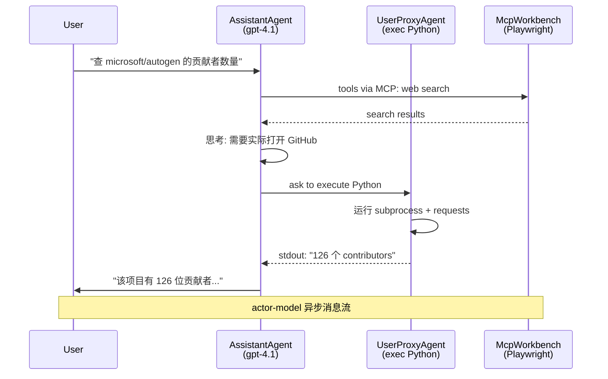

# 4.5 AutoGen：对话式多 Agent（已进入维护模式）

> 🟡 进阶

> **本节钩子**：AutoGen 是 Microsoft 在 2023 年开源的多 Agent 框架，**首创"对话即协作"范式**——两个 Agent 通过互相发消息完成复杂任务，不再是"主 Agent 调工具"的工具调用循环。**反直觉事实**：AutoGen 仓库 README 自 2025 年起明确标注 **"Maintenance Mode"**（维护模式），不再添加新特性；官方推荐新项目用 Microsoft Agent Framework (MAF) 作为生产继任者。**因此本节是"理解历史范式 + 评估迁移路径"**，而非"推荐新项目用 AutoGen"。

## 正文大纲

1. **一句话定义**：AutoGen 是**对话驱动的多 Agent 框架**——Agent 是 `AssistantAgent` / `UserProxyAgent` / `GroupChatManager` 等角色，协作方式是互相发消息（message-passing）；2024 年的 v0.4 重构引入 **actor-model** 运行时，把"消息"提升为一等公民。
2. **关键机制（5 个要点）**
   - **角色抽象**：`AssistantAgent`（LLM 驱动，回答问题 / 调工具）、`UserProxyAgent`（人 / 代码执行代理，可执行 Python）、`GroupChat` / `GroupChatManager`（群聊协调多 Agent）。
   - **`initiate_chat` 流程**：发起 `agent_a.initiate_chat(agent_b, message="...")` → 双 Agent 互发消息直到达成终止条件（max_consecutive_auto_reply、文本终止符、`terminate` 函数）。
   - **v0.4 actor-model 重构**：把"消息传递"做成 `RoutedAgent` + `publish_message / subscribe` 模式，每个 Agent 是独立 actor，跨进程 / 跨语言可扩展。
   - **`autogen-agentchat` vs `autogen-core`**：v0.4+ 拆为两个包，`autogen-core` 是底层运行时（actor model），`autogen-agentchat` 是高层对话抽象（AssistantAgent / GroupChat）。
   - **维护模式与迁移**：官方仓库 README 标注"Maintenance Mode"，新功能由 [Microsoft Agent Framework](https://github.com/microsoft/agent-framework) 承担；旧项目建议参考 [AutoGen → MAF 迁移指南](https://learn.microsoft.com/en-us/agent-framework/migration-guide/from-autogen/)。
3. **代码示例**：v0.4 风格的 AssistantAgent + `Console.run_stream` 异步流式。
4. **常见误区**：
   - ❌ "AutoGen = Agent 编排的全部"——已过时；v0.4 之后 actor model 让 AutoGen 更像"分布式 actor 系统"，但群聊 API 仍是最高层接口。
   - ❌ "v0.2 和 v0.4 完全兼容"——**破坏性变更**——`ConversableAgent` 类被废弃，迁移到 `AssistantAgent`；`register_reply` 装饰器换成 `message_handler`。
   - ✅ "学习 AutoGen 的群聊范式"——这是它的最大遗产；MAF 吸收了 `GroupChat` 思想并加入 A2A / MCP 协议支持。
5. **与 L3 衔接**：L3.5 A2A 协议在 AutoGen 是"内部消息传递"，MAF 已支持 A2A 协议级互操作；L3.3 MCP 通过 `autogen_ext.tools.mcp.McpWorkbench` 接入。

## 图

- **主图 1**：AutoGen 对话式多 Agent 协作流程图



- **辅助理解**：注意这是**双向对话流**——不像 LangGraph 那样"主 Agent 调工具"，AssistantAgent 是发消息给 UserProxyAgent，UserProxyAgent 自己执行代码再回消息；McpWorkbench 通过 MCP 协议接入外部工具。这是 actor-model 的核心：**消息是协作的最小单元**。

## 代码

依赖：`autogen-agentchat>=0.4`, `autogen-ext[openai]`, 演示 `AssistantAgent` + `run_stream` + MCP 工具：

```python
"""
autogen_basic.py
AutoGen v0.4+ 对话式多 Agent 演示
依赖：autogen-agentchat>=0.4, autogen-ext[openai], autogen-ext[mcp]
运行：python autogen_basic.py  (需 OPENAI_API_KEY + npx @playwright/mcp@latest)
"""
import asyncio
from autogen_agentchat.agents import AssistantAgent
from autogen_agentchat.ui import Console
from autogen_ext.models.openai import OpenAIChatCompletionClient
from autogen_ext.tools.mcp import McpWorkbench, StdioServerParams


# ========== 1. 最简单的单 Agent 演示 ==========
async def hello_world() -> None:
    model_client = OpenAIChatCompletionClient(model="gpt-4.1")
    agent = AssistantAgent(
        name="assistant",
        model_client=model_client,
        system_message="你是一个 helpful 助手",
    )
    # result 是 TaskResult，包含 messages 列表
    result = await agent.run(task="Say 'Hello World!'")
    print(result.messages[-1].content)
    await model_client.close()

# asyncio.run(hello_world())


# ========== 2. MCP 工具集成（Web 浏览器）==========
async def with_mcp_browser() -> None:
    """通过 Playwright MCP server 给 Agent 加浏览器能力。"""
    model_client = OpenAIChatCompletionClient(model="gpt-4.1")

    server_params = StdioServerParams(
        command="npx",
        args=["@playwright/mcp@latest", "--headless"],
    )

    # McpWorkbench 是 async context manager
    async with McpWorkbench(server_params) as mcp:
        agent = AssistantAgent(
            name="web_browsing_assistant",
            model_client=model_client,
            workbench=mcp,             # 给 Agent 一组 MCP 工具
            model_client_stream=True,  # 流式 token
            max_tool_iterations=10,    # 最多 10 次工具调用循环
        )
        # Console UI 自动打印流式消息
        await Console(
            agent.run_stream(
                task="查 microsoft/autogen 仓库有多少 contributors"
            )
        )

    await model_client.close()


# ========== 3. 多 Agent 对话（GroupChat）==========
from autogen_agentchat.agents import AssistantAgent
from autogen_agentchat.conditions import MaxMessageTermination, TextMentionTermination
from autogen_agentchat.teams import RoundRobinGroupChat

async def group_chat_demo() -> None:
    model_client = OpenAIChatCompletionClient(model="gpt-4.1")

    planner = AssistantAgent(
        "planner",
        model_client=model_client,
        system_message="你是项目规划师，给出 3 步计划。",
    )
    coder = AssistantAgent(
        "coder",
        model_client=model_client,
        system_message="你是 Python 工程师，按计划写代码。",
    )
    reviewer = AssistantAgent(
        "reviewer",
        model_client=model_client,
        system_message="你是代码评审，给出改进建议。说 DONE 终止。",
    )

    # RoundRobinGroupChat：轮流发言
    # 终止条件：达到 12 条消息 或 reviewer 说 "DONE"
    termination = MaxMessageTermination(12) | TextMentionTermination("DONE")
    team = RoundRobinGroupChat(
        [planner, coder, reviewer],
        termination_condition=termination,
    )

    await Console(team.run_stream(task="写一个 Python 函数计算斐波那契"))

    await model_client.close()

# asyncio.run(group_chat_demo())
```

实战要点：
1. **`autogen-agentchat` 取代旧 `ConversableAgent`**——v0.4 把"对话"做成异步 TaskResult 模型，原 v0.2 `register_reply` / `initiate_chat` 已废弃。
2. **`McpWorkbench` 走 stdio 传输**——与 L3.3 MCP 协议一致；非 stdio 场景（HTTP+SSE）改用 `SseServerParams`。
3. **`max_tool_iterations` 防止无限循环**——LLM 反复调同一工具的常见 bug，用此参数硬限制。

## 实战片段

真实工程里 AutoGen 通常配合**团队（team）**做多 Agent 协作——下面是含终止条件 + 流式 UI + 模型回退的生产模式：

```python
# autogen_production.py
import asyncio
from autogen_agentchat.agents import AssistantAgent
from autogen_agentchat.teams import SelectorGroupChat
from autogen_agentchat.conditions import TextMentionTermination
from autogen_agentchat.ui import Console
from autogen_ext.models.openai import OpenAIChatCompletionClient
from autogen_ext.tools.mcp import McpWorkbench, StdioServerParams

async def production_team() -> None:
    # 1) 主模型：gpt-4.1
    primary = OpenAIChatCompletionClient(model="gpt-4.1")
    # 2) 回退模型：本地 ollama（生产上独立 fail-safe）
    fallback = OpenAIChatCompletionClient(model="gpt-4o-mini")

    # 3) 多 Agent 团队：Planner + Researcher + Coder + Reviewer
    planner = AssistantAgent(
        "planner",
        model_client=primary,
        system_message="你是任务规划师，输出 JSON 格式步骤。",
    )
    researcher = AssistantAgent(
        "researcher",
        model_client=primary,
        system_message="你是研究员，用搜索引擎找资料。",
        tools=[],  # 实战片段：bind search tool
    )
    coder = AssistantAgent(
        "coder",
        model_client=primary,
        system_message="你是 Python 工程师，写代码 + 单元测试。",
    )
    reviewer = AssistantAgent(
        "reviewer",
        model_client=fallback,           # 评审用 fallback 节省成本
        system_message="你是评审，检查代码质量。批准时说 APPROVED。",
    )

    # 4) 终止条件：评审说 APPROVED 或 20 条消息
    termination = TextMentionTermination("APPROVED") | MaxMessageTermination(20)

    # 5) SelectorGroupChat：LLM 决定下一位发言者（动态调度）
    team = SelectorGroupChat(
        [planner, researcher, coder, reviewer],
        model_client=primary,            # selector 用 LLM 选下一个 Agent
        termination_condition=termination,
    )

    # 6) 流式运行
    await Console(
        team.run_stream(task="写一个 debounce 函数，含单元测试，评审通过。")
    )

    await primary.close()
    await fallback.close()
```

实战要点：
- **`SelectorGroupChat` vs `RoundRobinGroupChat`**：前者用 LLM 动态选下一个发言者（灵活但慢），后者按固定顺序（快但死板）；复杂任务用 Selector，简单协作用 RoundRobin。
- **多 model_client 节省成本**——`reviewer` 用 `gpt-4o-mini`，`planner / researcher / coder` 用 `gpt-4.1`，生产可降本 50%+。
- **迁移路径**——AutoGen v0.4+ 与 Microsoft Agent Framework (MAF) 概念对齐；如果你正规划新项目，建议直接看 MAF（[microsoft/agent-framework](https://github.com/microsoft/agent-framework)），其 API 与 AutoGen 类似但增加了 A2A / MCP 协议级支持与企业级部署特性。

## 自测题

1. **概念辨析**：AutoGen 的 actor-model 是什么？它与 LangGraph 的状态机模型的根本差异是什么？
2. **场景判断**：你想做一个"研究助手"——多 Agent 协作完成"搜资料 → 写报告 → 评审 → 终稿"。下面哪个**最不推荐**？
   - A. AutoGen v0.4 GroupChat（已成熟但维护模式）
   - B. LangGraph + 自定义节点
   - C. CrewAI（角色化更直接）
   - D. Microsoft Agent Framework（AutoGen 的继任者）
3. **代码补全**：补全下面 AutoGen v0.4 代码，让两个 Agent 互相发消息直到 reviewer 说 DONE：
   ```python
   team = RoundRobinGroupChat(
       [planner, coder, reviewer],
       termination_condition=???,
   )
   ```
4. **反直觉题**：AutoGen README 标注"Maintenance Mode"。这意味着什么？**AutoGen 还能用吗**？为什么 Microsoft 推荐新项目用 MAF？
5. **迁移题**：你原有一个 AutoGen v0.2 的 `ConversableAgent.register_reply` 实现。想升级到 v0.4+，最小改动是什么？

**答案**：1. actor-model 把"消息"作为 Agent 间通信的唯一方式，每个 Agent 是独立 actor，订阅特定 topic 的消息；LangGraph 状态机是"全局共享状态 dict + 节点读写"，**消息是状态变更的副作用，不是通信原语**。AutoGen 适合"松耦合 Agent 互发消息"场景；LangGraph 适合"显式状态依赖 + 持久化"场景。2. **A 最不推荐**——AutoGen 维护模式，新项目不应押注。但已经熟悉 AutoGen 的团队短期可用。3. `MaxMessageTermination(12) | TextMentionTermination("DONE")`。`MaxMessageTermination` 是"消息数上限兜底"，`TextMentionTermination` 是"特定文本触发终止"，二者用 `|` 组合（或运算）。4. **仍可用但有风险**——维护模式意味着不再加新特性 + bug 修复不保证；社区管理。Microsoft 推荐 MAF 是因为 MAF 提供**企业级支持 + A2A/MCP 协议级集成 + 长期维护承诺**；AutoGen 的"群聊思想"在 MAF 中继续演进，但底层运行时与 API 完全不同。新项目用 MAF 避免未来再迁移。5. 最小迁移：`ConversableAgent` → `AssistantAgent`（参数 `llm_config` → `model_client`）；`register_reply` 装饰器换成 `message_handler` 函数；`initiate_chat(agent, message)` → `agent.run(task=...)`（TaskResult 替代 ChatResult）。具体 API 参考 [AutoGen → MAF 迁移指南](https://learn.microsoft.com/en-us/agent-framework/migration-guide/from-autogen/)。

> 📚 本节参考
> - [S 级] AutoGen GitHub README — https://github.com/microsoft/autogen （**Maintenance Mode 标注 + Microsoft Agent Framework 迁移指引**）
> - [S 级] Microsoft Agent Framework 迁移指南 — https://learn.microsoft.com/en-us/agent-framework/migration-guide/from-autogen/ （AutoGen → MAF 迁移对照表）
> - [S 级] LangGraph 对比分析 — https://docs.langchain.com/oss/python/langgraph/overview （AutoGen 与 LangGraph 在状态管理 / actor model 上的设计哲学差异）
> - [A 级] Microsoft Agent Framework — https://github.com/microsoft/agent-framework （AutoGen 的企业级继任者）