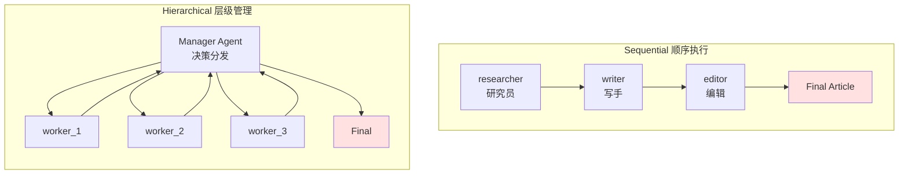

# 4.6 CrewAI：角色化协作

> 🟡 进阶

> **本节钩子**：AutoGen 是"对话驱动"——Agent 之间发消息完成协作；CrewAI 是**"角色驱动"**——给每个 Agent 起个"人设"（role / goal / backstory），靠 CrewAI 的内部调度器让 Agent 按角色分工。**反直觉事实**：CrewAI 自称"completely independent of LangChain or other agent frameworks"，**与 LangChain 生态零依赖**——这既是它的"独立性优势"，也是它被一些团队拒绝的原因（与 LangChain 1.x 生态组件互操作需要 adapter）。

## 正文大纲

1. **一句话定义**：CrewAI 是**角色化多 Agent 编排框架**——核心抽象是 `Agent`（角色）+ `Task`（任务）+ `Crew`（团队协作），执行模式分 `sequential` / `hierarchical`；2024 年起新增 `Flows` 提供事件驱动精细控制。
2. **关键机制（5 个要点）**
   - **角色三件套**：`Agent(role="...", goal="...", backstory="...")`——role 是职位名、goal 是要达成什么、backstory 是背景故事（影响 LLM 行为）。LLM 通过这三个字段**自动适配人格**。
   - **Task 任务定义**：`Task(description="...", agent=..., expected_output="...")`，可指定 `context=[prev_task]` 表达任务间依赖。
   - **Crew 编排**：`Crew(agents=[...], tasks=[...], process=Process.sequential | Process.hierarchical)`——`sequential` 按任务列表顺序执行；`hierarchical` 自动选 manager agent 分配任务。
   - **Flows（2024 新）**：精细事件驱动控制，用 `@start()` / `@listen(...)` / `@router(...)` 装饰器定义流程步骤；与 Crews 互补（Crews 负责"高层多 Agent 自治"，Flows 负责"精细状态机"）。
   - **完全独立于 LangChain**——README 原话："built entirely from scratch—completely independent of LangChain or other agent frameworks"；底层用 LiteLLM 与 100+ LLM 通信，可切换 provider 无需改业务代码。
3. **代码示例**：三个角色（研究员 + 写手 + 编辑）协作写一篇文章。
4. **常见误区**：
   - ❌ "CrewAI 只是 AutoGen 的角色化版"——不准确；CrewAI 的 `backstory` 字段会注入 system prompt 的"人格设定"，这是 AutoGen 没有的；**Agent 行为差异显著**。
   - ❌ "hierarchical 模式总是更好"——错；hierarchical 需要 manager Agent 不断决策，**多消耗 30%+ token**，简单流程用 sequential 更经济。
   - ✅ "Flows + Crews 组合"——复杂业务先用 Flows 做精细控制，关键决策点 spawn Crew 处理多 Agent 协作。
5. **与 L3 衔接**：L3.3 MCP 通过 `MCPServerAdapter` 接入；L3.1 Function Calling 在 CrewAI 自动转工具 schema。

## 图

- **主图 1**：CrewAI 角色协作流程图（sequential vs hierarchical）



- **辅助理解**：sequential 像流水线（A → B → C），hierarchical 像敏捷小组（manager 动态派活给 worker，worker 回报告）。**两种模式都是 LLM 驱动**——sequential 是"硬编码顺序"，hierarchical 是"manager LLM 决定派给谁"。实际工程中 80% 任务用 sequential 就够了。

## 代码

依赖：`crewai>=1.0`, `crewai-tools`，三个角色协作的最小示例：

```python
"""
crewai_basic.py
CrewAI 角色化多 Agent 演示
依赖：crewai>=1.0, crewai-tools
运行：python crewai_basic.py  (需 OPENAI_API_KEY)
"""
from crewai import Agent, Task, Crew, Process
from crewai_tools import SerperDevTool, ScrapeWebsiteTool


# ========== 1. 三个角色 ==========
researcher = Agent(
    role="高级研究分析师",
    goal="从给定主题找最新最权威的资料",
    backstory="""你是一位资深研究员，擅长从海量信息中筛选关键事实。
    你偏好学术论文和权威媒体，对社交媒体内容持怀疑态度。""",
    tools=[SerperDevTool(), ScrapeWebsiteTool()],  # 实战片段：需 SERPER_API_KEY
    verbose=True,
    allow_delegation=False,  # 不允许把任务 delegate 给其他 Agent
)

writer = Agent(
    role="技术写手",
    goal="把研究发现写成结构清晰的技术文章",
    backstory="""你是一位技术作家，擅长把复杂概念用简单语言讲清楚。
    你偏好分点列举 + 案例说明，避免空话。""",
    verbose=True,
)

editor = Agent(
    role="资深编辑",
    goal="审校文章的事实性 + 可读性，给出改进建议",
    backstory="""你是 10 年经验的科技媒体主编，对错误零容忍。""",
    verbose=True,
)


# ========== 2. 三个任务（任务间用 context 表达依赖）==========
research_task = Task(
    description="研究'Agent 框架对比'主题，搜集 LangChain / LangGraph / AutoGen / CrewAI 的最新特性",
    expected_output="一份 markdown 格式的研究报告，含 4 个框架的优缺点对比表",
    agent=researcher,
)

write_task = Task(
    description="基于研究报告写一篇 1500 字的技术博客文章",
    expected_output="一篇可发布的博客文章（markdown）",
    agent=writer,
    context=[research_task],  # 依赖 research_task 的输出
)

edit_task = Task(
    description="审校文章，标出事实错误 + 改进建议。批准时说 APPROVED。",
    expected_output="审校后的最终版本 + 修改说明",
    agent=editor,
    context=[research_task, write_task],  # 依赖前两个任务
)


# ========== 3. 组装 Crew ==========
crew = Crew(
    agents=[researcher, writer, editor],
    tasks=[research_task, write_task, edit_task],
    process=Process.sequential,  # 默认 sequential
    verbose=True,
)

# 启动（同步，会运行几分钟）
# result = crew.kickoff(inputs={"topic": "Agent 框架对比"})
# print(result.raw)  # 最终输出（edit_task 的结果）


# ========== 4. Hierarchical 模式（manager 动态分配）==========
from langchain_openai import ChatOpenAI  # manager 用 LLM 决策
manager_llm = ChatOpenAI(model="gpt-4.1")

crew_hierarchical = Crew(
    agents=[researcher, writer, editor],
    tasks=[research_task, write_task, edit_task],
    process=Process.hierarchical,
    manager_llm=manager_llm,  # manager Agent 用的 LLM
    verbose=True,
)
# result = crew_hierarchical.kickoff()
```

实战要点：
1. **`backstory` 实际是 system prompt 的"人格"部分**——CrewAI 会自动构造 prompt："你的角色是 X。你的目标是 Y。你的背景是 Z。"；写得越具体，Agent 行为越稳定。
2. **`context=[prev_task]` 是任务依赖**——不是简单的输入传递，而是让 Agent 看到前序任务的"对话历史"；与 LangGraph 的状态 dict 等价。
3. **`allow_delegation=False` 防止循环**——默认 `True` 时 Agent 可把任务 delegate 给队友，导致"踢皮球"循环；显式关闭更稳。

## 实战片段

真实工程里，CrewAI 通常配合 **Flows** 做精细控制 + **Tools** 做实际业务，下面是一个"研究报告 + 自动发布"的生产模式：

```python
# crewai_production.py
from crewai import Agent, Task, Crew, Process
from crewai.flow.flow import Flow, listen, start, router
from crewai_tools import SerperDevTool
from pydantic import BaseModel
from typing import Literal


# ========== 1. Crew：研究 + 写作 ==========
researcher = Agent(
    role="研究员",
    goal="找权威资料",
    backstory="学术派研究员，偏好论文与官方文档",
    tools=[SerperDevTool()],
)

writer = Agent(
    role="写手",
    goal="写 1500 字技术博客",
    backstory="资深技术作家，擅长讲故事",
)

research_crew = Crew(
    agents=[researcher, writer],
    tasks=[
        Task(description="研究 Agent 框架对比", agent=researcher, expected_output="报告"),
        Task(description="基于报告写文章", agent=writer, expected_output="文章", context=[Task]),  # 简化：实际取前序
    ],
    process=Process.sequential,
)


# ========== 2. Flow：精细事件驱动控制 ==========
class PublishState(BaseModel):
    topic: str = ""
    article: str = ""
    review_passed: bool = False

class PublishFlow(Flow[PublishState]):
    """生产级发布流程：研究 → 写作 → 评审 → 发布。"""

    @start()
    def init_state(self):
        # 从外部 inputs 读 topic
        self.state.topic = self.state.topic or "Agent 框架对比"

    @listen(init_state)
    def run_research_crew(self, _):
        """跑 Crew 完成研究 + 写作。"""
        result = research_crew.kickoff(inputs={"topic": self.state.topic})
        self.state.article = result.raw

    @router(run_research_crew)
    def review_router(self) -> Literal["publish", "revise"]:
        """人工审批路由（实战片段：接 HITL）。"""
        # 简化：自动通过；生产上接 LangGraph interrupt
        if len(self.state.article) > 500:
            self.state.review_passed = True
            return "publish"
        return "revise"

    @listen("publish")
    def publish(self):
        """发布到 CMS（实战片段：调 WordPress / 内部平台 API）。"""
        print(f"[Publish] topic={self.state.topic}, len={len(self.state.article)}")
        # cms_client.post(...)

    @listen("revise")
    def revise(self):
        """重新跑一轮（实战片段：调用 LLM 重写）。"""
        print("[Revise] 文章太短，重新生成")


# 启动 Flow
# flow = PublishFlow()
# flow.kickoff(inputs={"topic": "CrewAI vs LangGraph"})
# plot_flow(flow)  # CrewAI 提供 mermaid 流程图生成
```

实战要点：
- **Flows 是 Crews 的"父流程"**——用 Flows 控制何时 spawn Crew，Crew 内部做多 Agent 自治；这是"集中调度 + 分布执行"的范式。
- **`@router` 装饰器做条件路由**——根据 state 决定下一步，与 LangGraph `add_conditional_edges` 等价但 API 更声明式。
- **`Flow[PublishState]` 用 Pydantic 强类型状态**——比 LangGraph 的 `TypedDict` 更严格，类型错误在编译期就报。

## 自测题

1. **概念辨析**：CrewAI 的 `Agent` 三个核心字段（role / goal / backstory）分别影响 LLM 行为的哪个层面？哪个最影响行为？
2. **场景判断**：你在做一个"内容生产流水线"——研究员写稿 → 编辑审稿 → 自动发布。下面哪个**最匹配**？
   - A. CrewAI sequential
   - B. CrewAI hierarchical
   - C. CrewAI Flows + Crews 组合
   - D. AutoGen GroupChat
3. **代码补全**：补全下面代码，让 writer 任务依赖 researcher 任务的输出：
   ```python
   write_task = Task(
       description="写文章",
       agent=writer,
       expected_output="文章",
       ???=[research_task],
   )
   ```
4. **反直觉题**：有人说"CrewAI hierarchical 模式更好，因为它自动派活"。这个理解对吗？为什么说 hierarchical 不一定适合所有场景？
5. **对比题**：CrewAI 与 AutoGen 都是"多 Agent 框架"，但设计哲学不同。请列出至少 2 个**根本差异**。

**答案**：1. `role` 注入 system prompt 的"职位身份"部分，`goal` 注入"目标"，`backstory` 注入"背景故事 / 偏好 / 性格"。**`backstory` 最影响行为**——它包含了具体的偏好（"你偏好学术论文"），LLM 会据此调整行为；role / goal 较抽象。2. **C 最匹配**——研究→审稿→发布是"精细控制流程 + 关键节点多 Agent 协作"的混合模式；Flows 提供精细编排，Crews 承担"研究+写作"的多 Agent 自治。A 缺发布控制；B 多 Agent 决策浪费；D AutoGen 不擅长角色化。3. `context=[research_task]`。`context` 表达任务依赖，CrewAI 自动把前序任务的输出作为 Agent 可见上下文。4. **不对**——hierarchical 模式需要 manager LLM 不断决策（"现在派给谁？"），**多消耗 30%+ token**；如果流程固定（角色分工明确、任务顺序确定），sequential 更经济且更稳定。只有当 manager 决策本身有价值（如"动态重派"）时才用 hierarchical。5. 根本差异 1：**驱动模型**——CrewAI 角色驱动（role/goal/backstory 注入 system prompt），AutoGen 对话驱动（消息传递）。根本差异 2：**抽象层级**——CrewAI 高层抽象（Crew / Task / Process），AutoGen 低层抽象（RoutedAgent / publish_message）。根本差异 3：**生态依赖**——CrewAI 完全独立于 LangChain（用 LiteLLM），AutoGen v0.4+ 在 Microsoft 自家生态内。

> 📚 本节参考
> - [S 级] CrewAI GitHub README — https://github.com/crewAIInc/crewAI （"completely independent of LangChain" 定位 + Crews/Flows 双层架构）
> - [S 级] CrewAI 官方文档 — https://docs.crewai.com/ （Agent / Task / Crew / Process API 权威说明）
> - [S 级] LangChain Runnable — https://docs.langchain.com/oss/python/langchain/runnables （与 CrewAI 独立设计的对比基线）
> - [S 级] OpenAI Platform 文档 — https://platform.openai.com/docs/guides/function-calling （CrewAI 工具调用的底层协议基础）
> - [A 级] CrewAI Flows 教程 — https://docs.crewai.com/concepts/flows （Flows 事件驱动 API）