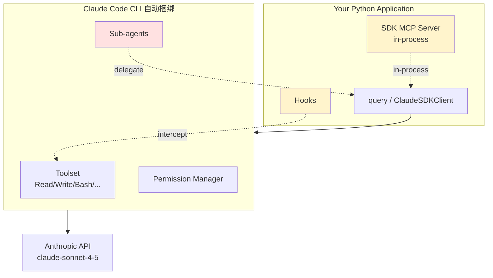

# 4.8 Claude Agent SDK：长任务与工具深度集成

> 🟡 进阶

> **本节钩子**：OpenAI Agents SDK 是"轻量官方参考"，Claude Agent SDK 是"**重工程长任务**"——它源自 Anthropic 内部 Claude Code 的 SDK，**自动捆绑 Claude Code CLI**，原生长任务（小时级）、Sub-agents、内置 Read/Write/Edit/Bash 工具。**反直觉事实**：Claude Agent SDK 不是"Claude API 的薄封装"，它本身就是 Claude Code 的编程入口——所有 Claude Code 命令行能做的事，SDK 都能做。

## 正文大纲

1. **一句话定义**：Claude Agent SDK 是 Anthropic 在 2025 年开源的 Python SDK（基于 Claude Code 内部工具），定位为"长任务、工具深度集成、子 Agent 编排"；通过 `query()` 异步生成器获取消息，或 `ClaudeSDKClient` 多轮交互。
2. **关键机制（5 个要点）**
   - **`query()` 单次调用**：`async for message in query(prompt, options)` 返回 `AsyncIterator[Message]`，`Message` 类型包含 `AssistantMessage` / `UserMessage` / `SystemMessage` / `ResultMessage`，**首类流式协议**。
   - **`ClaudeSDKClient` 多轮**：`async with ClaudeSDKClient(options) as client` + `await client.query(prompt)` + `async for msg in client.receive_response()` 支持**双向对话**（含 hook、permission control）。
   - **内置 Claude Code 工具集**：默认提供 Read / Write / Edit / Bash / Glob / Grep 等工具（与 Claude Code CLI 同一套）；通过 `allowed_tools=["Read", "Write"]` 白名单控制自动批准，`permission_mode='acceptEdits'` 自动接受文件编辑。
   - **`create_sdk_mcp_server` 嵌入式 MCP**：用 `@tool` 装饰器 + `create_sdk_mcp_server(name, version, tools)` 在**同一 Python 进程内**运行 MCP server（无需 subprocess），大幅降低 IPC 开销——这是 SDK 相比 stdio MCP server 的最大性能优势。
   - **Sub-agents / Hooks**：通过 `ClaudeAgentOptions` 配置文件声明 sub-agent（如"代码审查"专门 sub-agent）；`HookMatcher` 在工具调用前后插入确定性逻辑（如"删除文件前必须审批"）。
3. **代码示例**：嵌入式 MCP server + ClaudeSDKClient 多轮对话 + hook 拦截。
4. **常见误区**：
   - ❌ "Claude Agent SDK = Anthropic Python API"——**错**；Anthropic Python API (`anthropic.Anthropic`) 是**薄协议封装**；Claude Agent SDK 是**应用层 SDK**（自带 Claude Code CLI、工具集、子 Agent 框架）。
   - ❌ "用 SDK 必须装 Claude Code CLI"——SDK 自动捆绑 CLI，但可用 `cli_path="/path/to/claude"` 指向系统级安装。
   - ✅ "长任务（小时级）首选"——SDK 的 checkpoint / 持久化对话 / 子 Agent 框架就是为长任务设计；不适合"单次问答"。
5. **与 L3 衔接**：L3.3 MCP 通过 `create_sdk_mcp_server` 嵌入式集成（性能优于 stdio）；L3.7 Prompt Caching 是协议级能力，SDK 自动透传；L3.5 A2A 不是 SDK 原生能力。

## 图

- **主图 1**：Claude Agent SDK 架构图（SDK 与 Claude Code CLI 的关系）



- **辅助理解**：黄色是**应用层自定义点**（SDK MCP server、hooks、sub-agents）——你写 Python 代码直接接入；橙色 Sub-agents 是 Claude Code CLI 提供的**子 Agent 框架**（一个 Agent 可以把任务委托给另一个专门 Agent）。**应用进程与 Claude Code CLI 是父子关系**——SDK 不绕开 CLI，而是把 CLI 当 runtime。

## 代码

依赖：`claude-agent-sdk>=0.1`，演示嵌入式 MCP + 多轮对话：

```python
"""
claude_agent_sdk_basic.py
Claude Agent SDK 最小示例 + SDK MCP Server
依赖：claude-agent-sdk>=0.1
运行：export ANTHROPIC_API_KEY=sk-ant-... && python claude_agent_sdk_basic.py
"""
import anyio
from claude_agent_sdk import (
    query,
    tool,
    create_sdk_mcp_server,
    ClaudeAgentOptions,
    ClaudeSDKClient,
    AssistantMessage,
    TextBlock,
    ToolUseBlock,
    ToolResultBlock,
    HookMatcher,
)


# ========== 1. SDK MCP Server：嵌入式工具 ==========
@tool("greet", "Greet a user by name", {"name": str})
async def greet_user(args):
    """工具实现：返回结构化 MCP 响应。"""
    return {
        "content": [
            {"type": "text", "text": f"Hello, {args['name']}!"}
        ]
    }


@tool("add", "Add two numbers", {"a": float, "b": float})
async def add_numbers(args):
    """工具实现：返回字符串结果。"""
    return {
        "content": [
            {"type": "text", "text": str(args["a"] + args["b"])}
        ]
    }


# 组合多个工具到 in-process MCP server
calculator = create_sdk_mcp_server(
    name="calculator",
    version="1.0.0",
    tools=[greet_user, add_numbers],
)


# ========== 2. query() 单次调用 ==========
async def query_demo():
    options = ClaudeAgentOptions(
        mcp_servers={"tools": calculator},
        allowed_tools=["mcp__tools__greet", "mcp__tools__add"],
    )

    async for message in query(
        prompt="请计算 3.14 + 2.86",
        options=options,
    ):
        if isinstance(message, AssistantMessage):
            for block in message.content:
                if isinstance(block, TextBlock):
                    print(f"[text] {block.text}")
                elif isinstance(block, ToolUseBlock):
                    print(f"[tool_use] {block.name}({block.input})")
        elif isinstance(message, ResultMessage := message.__class__):  # 简化判断
            pass  # ResultMessage 含最终结果

# anyio.run(query_demo())


# ========== 3. ClaudeSDKClient 多轮 + hook ==========
async def check_dangerous_command(input_data, tool_use_id, context):
    """Hook：在 Bash 工具调用前检查，禁止 rm -rf 等危险命令。"""
    tool_name = input_data.get("tool_name")
    tool_input = input_data.get("tool_input", {})

    if tool_name == "Bash":
        cmd = tool_input.get("command", "")
        if "rm -rf" in cmd or ":(){" in cmd:  # 简易黑名单
            return {
                "hookSpecificOutput": {
                    "hookEventName": "PreToolUse",
                    "permissionDecision": "deny",
                    "permissionDecisionReason": "危险命令已拦截",
                }
            }
    return {}  # 允许继续


async def client_demo():
    options = ClaudeAgentOptions(
        allowed_tools=["Read", "Write", "Bash", "mcp__tools__greet"],
        permission_mode="acceptEdits",   # 文件编辑自动批准
        hooks={
            "PreToolUse": [HookMatcher(matcher="Bash", hooks=[check_dangerous_command])],
        },
    )

    async with ClaudeSDKClient(options=options) as client:
        # 第 1 轮
        await client.query("读 README.md 并总结")
        async for msg in client.receive_response():
            print(f"[round 1] {msg}")

        # 第 2 轮（保留上下文）
        await client.query("把它翻译成英文")
        async for msg in client.receive_response():
            print(f"[round 2] {msg}")

# anyio.run(client_demo())
```

实战要点：
1. **`@tool(name, description, input_schema)` 三件套**——`input_schema` 用 Python 类型注解（`{"name": str}`）或 JSON Schema dict；SDK 自动转 MCP 协议。
2. **`allowed_tools` 是白名单而非工具删除**——SDK README 原话："`allowed_tools` is a permission allowlist: listed tools are auto-approved, and unlisted tools fall through to `permission_mode` and `can_use_tool` for a decision. It does not remove tools from Claude's toolset."；要禁用工具用 `disallowed_tools`。
3. **`permission_mode='acceptEdits'` 自动接受文件编辑**——适合"信任 Claude 写文件"场景；生产上对 `Bash` 仍走 hook 拦截。

## 实战片段

真实工程里 SDK 通常配 **Sub-agents** + **持久化 cwd** + **长任务断点恢复**——下面是"代码审计 + 修复"的生产模式：

```python
# claude_agent_sdk_production.py
from pathlib import Path
from claude_agent_sdk import (
    query, ClaudeAgentOptions, ClaudeSDKClient,
    tool, create_sdk_mcp_server, HookMatcher,
)


# ========== 1. 自定义工具：调用内部代码扫描 API ==========
@tool("security_scan", "Run security scan on a Python file", {"filepath": str})
async def security_scan(args):
    """实战片段：调 Bandit / Semgrep 等扫描器。"""
    filepath = args["filepath"]
    # 简化：返回 mock 结果
    return {"content": [{"type": "text", "text": f"[scan] {filepath}: 3 issues found"}]}


scanner_server = create_sdk_mcp_server(
    name="security",
    version="1.0.0",
    tools=[security_scan],
)


# ========== 2. Sub-agent 配置：在 options 里声明专家 Agent ==========
SUB_AGENT_CONFIG = {
    "code-reviewer": {
        "description": "Expert code reviewer. Use proactively after code changes.",
        "prompt": "You are a senior code reviewer focusing on security and performance.",
        "tools": ["Read", "Grep", "mcp__security__security_scan"],
    },
    "test-writer": {
        "description": "Test writing specialist. Use to add unit tests.",
        "prompt": "You are a test engineer writing pytest unit tests.",
        "tools": ["Read", "Write", "Bash"],
    },
}


# ========== 3. 持久化 cwd + 长任务 options ==========
async def production_audit():
    project_root = Path("/Users/me/projects/myapp")

    options = ClaudeAgentOptions(
        cwd=project_root,
        allowed_tools=[
            "Read", "Write", "Edit", "Bash",
            "mcp__security__security_scan",
        ],
        permission_mode="acceptEdits",
        # 内置 sub-agent 框架（Claude Code CLI 提供）
        agents=SUB_AGENT_CONFIG,
        # 长任务：限制 max_turns 防失控
        max_turns=100,
    )

    async with ClaudeSDKClient(options=options) as client:
        # 长任务：用同一个 client 跑多个 step
        await client.query("""对 src/auth/ 模块做安全审计：
        1. 调 security_scan 扫描所有 Python 文件
        2. 用 code-reviewer sub-agent 给出修复建议
        3. 直接修复发现的问题（acceptEdits 模式）
        4. 用 test-writer sub-agent 补单元测试
        """)

        # 流式收集结果
        async for msg in client.receive_response():
            if hasattr(msg, "content"):
                for block in msg.content:
                    if hasattr(block, "text"):
                        print(f"[progress] {block.text[:100]}...")
            elif msg.__class__.__name__ == "ResultMessage":
                print(f"[done] {msg.result}")

# anyio.run(production_audit())
```

实战要点：
- **`agents=SUB_AGENT_CONFIG` 是 Claude Code CLI 的 sub-agent 机制**——Claude 可以在主对话中把任务委托给"code-reviewer" / "test-writer"；sub-agent 独立 system prompt + tools，避免污染主 Agent 的上下文。
- **`cwd=project_root` 持久化工作目录**——所有 Bash / Read / Write 操作都在 project_root 下；切换项目 = 换 cwd。
- **长任务控制**：`max_turns=100` 防止 LLM 无限循环；生产上配 `betas=["context-1m-2025-08-07"]` 启用 1M 上下文窗口。

## 自测题

1. **概念辨析**：Claude Agent SDK 的 `query()` 与 `ClaudeSDKClient` 的根本差异是什么？分别适用什么场景？
2. **场景判断**：你要做"长任务代码审计"——读 100 个文件、运行测试、修复 bug。下面哪个**最适合**？
   - A. OpenAI Agents SDK
   - B. LangGraph
   - C. Claude Agent SDK
   - D. CrewAI
3. **代码补全**：补全下面代码，把 greet_user 函数包装成 in-process MCP server：
   ```python
   @tool("greet", "Greet user", {"name": str})
   async def greet_user(args):
       return {"content": [{"type": "text", "text": f"Hello {args['name']}!"}]}

   server = ???(
       name="my-tools",
       version="1.0.0",
       tools=[greet_user],
   )
   ```
4. **反直觉题**：有人说"Claude Agent SDK 绕开 Claude Code CLI，直接调 Anthropic API"。这个理解对吗？SDK 的真实架构是什么？
5. **对比题**：与外部 stdio MCP server 相比，SDK 内嵌 MCP server（`create_sdk_mcp_server`）有什么优势？什么时候应该选哪个？

**答案**：1. `query()` 是**单次调用**的 `async for message` 流，返回 `AsyncIterator` 不保留上下文；`ClaudeSDKClient` 是**多轮客户端**，支持 `client.query()` + `client.receive_response()` 双向交互，配合 hooks 和 permission mode。单次问答用 `query()`，长任务多轮用 `Client`。2. **C 最适合**——Claude Agent SDK 原生长任务（sub-agents、内置 Read/Write/Bash、persistent cwd、max_turns 控制）。A 缺乏文件操作工具集；B LangGraph 需自己写所有节点；D CrewAI 角色化不适合"代码审计"。3. `create_sdk_mcp_server(name="my-tools", version="1.0.0", tools=[greet_user])`。SDK 提供 `create_sdk_mcp_server` 函数把工具组合成 in-process MCP server，无需写 subprocess。4. **错**——SDK README 原话："The Claude Code CLI is automatically bundled with the package"。SDK 是 Claude Code CLI 的**编程接口**，所有工具执行、子 Agent、permission 都在 CLI 进程内完成；应用进程通过 stdio 与 CLI 通信（除非用 SDK MCP server 嵌入部分能力）。SDK 不绕开 CLI，而是用 CLI 当 runtime。5. SDK 内嵌 MCP server 优势：① **零 IPC 开销**——同进程 Python 函数调用，无需 JSON 序列化 + subprocess；② **类型安全**——直接 Python 函数签名，IDE 自动补全；③ **简化部署**——单进程而非多进程；④ **调试友好**——断点 / log 全在应用进程。**选 stdio 的场景**：① 工具实现是 Node.js / Go 等其他语言；② 工具需要独立部署（多个应用共享）；③ 工具是已有 MCP server 标准实现。

> 📚 本节参考
> - [S 级] Claude Agent SDK GitHub — https://github.com/anthropics/claude-agent-sdk-python （"automatically bundled with the package" CLI 集成机制）
> - [S 级] Anthropic 官方文档 — https://docs.claude.com/en/docs/agent-sdk/overview （SDK 架构、permissions、hooks 权威说明）
> - [S 级] Anthropic Tool Use 协议 — https://docs.anthropic.com/en/docs/agents-and-tools/tool-use/overview （底层协议基础）
> - [S 级] LangGraph 对比 — https://docs.langchain.com/oss/python/langgraph/overview （Claude Agent SDK 与 LangGraph 在持久化 / 子 Agent 上的对比基线）
> - [A 级] Claude Code 工具集 — https://code.claude.com/docs/en/settings#tools-available-to-claude （Read/Write/Bash 等内置工具说明）