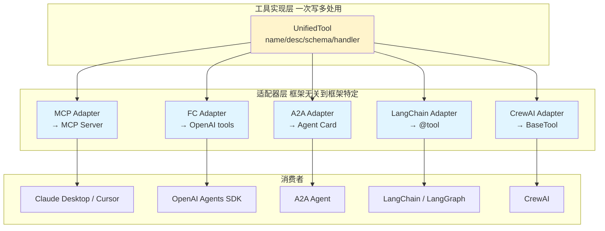

# 4.9 Agent 协议适配器：跨框架的中间层

> 🟡 进阶

> **本节钩子**：当你同时用 LangChain + AutoGen + CrewAI + Claude Agent SDK 时，最大的痛苦不是"框架太多"——而是**"工具定义 4 套写法"**：LangChain `@tool` 装饰器、AutoGen `FunctionTool`、CrewAI `BaseTool`、OpenAI `@function_tool`、Claude SDK `@tool`。**反直觉事实**：业界已经形成事实标准——**MCP 协议**（Anthropic 主导）和 **Function Calling JSON Schema**（OpenAI 主导）。把它们做成统一适配层，能把跨框架迁移成本从"重写工具"降到"改配置"。

## 正文大纲

1. **一句话定义**：协议适配器（Protocol Adapter）是**把各种框架的工具/Agent 描述统一转换为标准协议**（MCP Server / Function Calling JSON Schema / A2A Agent Card）的中间层；它让你写一次工具，多框架复用，避免"每接一个框架就重写一次工具"的悲剧。
2. **关键机制（5 个要点）**
   - **统一抽象层**：定义内部 `UnifiedTool`（name / description / input_schema / handler），**与框架解耦**——所有框架适配器都基于这层做转换。
   - **MCP 适配器**：把 `UnifiedTool` 转成 MCP Server（通过 `mcp.server.Server` 暴露），所有支持 MCP 的客户端（Claude Desktop / Cursor / LangGraph / AutoGen）都能用——**一次实现，多端接入**。
   - **Function Calling 适配器**：把 `UnifiedTool` 转 OpenAI `tools=[{type:"function", ...}]` 数组或 Anthropic `tools=[{name, input_schema}]` 数组，应用层用对应协议即可。
   - **A2A Agent Card 适配器**：把"Agent 能力描述"统一转 A2A 协议（Agent Card + Skills），让 Agent 之间互相发现和调用。
   - **反向适配**：从 MCP server 读取 tool 列表，自动生成本框架的工具定义——比如"接入已有的 MCP server 到 LangGraph"，反向 import 即可。
3. **代码示例**：UnifiedTool + 双向 MCP/Function Calling 适配器。
4. **常见误区**：
   - ❌ "用 LangChain 就只用 LangChain 工具"——错；LangChain 1.x 通过 `langchain_mcp_adapters` 直接消费 MCP server，原生支持。
   - ❌ "适配器层会让性能变差"——适配只发生在**初始化阶段**（注册工具时），运行时调用直接走原生协议，**无性能损耗**。
   - ✅ "MCP 是事实标准"——Anthropic 主推，LangChain / AutoGen / OpenAI Agents SDK / Claude Agent SDK 均原生支持；**新项目直接基于 MCP 构建工具**。
5. **与 L3 衔接**：L3.1 Function Calling / L3.2 JSON Schema / L3.3 MCP / L3.5 A2A 是 4 大目标协议；L4 适配器把它们从"协议"落地到"框架 SDK"。

## 图

- **主图 1**：跨框架协议适配器架构图



- **辅助理解**：黄色 `UnifiedTool` 是你**唯一需要写的地方**——4 个蓝色适配器自动把它转成各框架的工具定义。消费者层支持任意组合，不需要为每个框架手写一遍工具。**反向**也能做——已有的 MCP server 也能 import 成 UnifiedTool，进入你的统一工具池。

## 代码

依赖：`mcp>=1.0`, `openai>=1.40`, `langchain-core>=0.3`，完整适配器实现：

```python
"""
protocol_adapter.py
UnifiedTool + 双向适配器（MCP / Function Calling / LangChain）
依赖：mcp>=1.0, openai>=1.40, langchain-core>=0.3
"""
import asyncio
from typing import Callable, Any
from dataclasses import dataclass, field


# ========== 1. UnifiedTool：框架无关的工具定义 ==========
@dataclass
class UnifiedTool:
    name: str
    description: str
    input_schema: dict  # JSON Schema (subset)
    handler: Callable[..., Any]
    metadata: dict = field(default_factory=dict)


# 示例：3 个工具
def greet(name: str, formal: bool = False) -> str:
    return f"{'Good day' if formal else 'Hi'}, {name}!"

def get_weather(city: str) -> str:
    return f"{city}: 晴 25°C"

def search_docs(query: str, top_k: int = 3) -> list[str]:
    return [f"[doc{i}] '{query}'" for i in range(top_k)]


TOOLS = [
    UnifiedTool(
        name="greet",
        description="Greet a user by name",
        input_schema={
            "type": "object",
            "properties": {
                "name": {"type": "string"},
                "formal": {"type": "boolean", "default": False},
            },
            "required": ["name"],
        },
        handler=greet,
    ),
    UnifiedTool(
        name="get_weather",
        description="查询天气",
        input_schema={
            "type": "object",
            "properties": {"city": {"type": "string"}},
            "required": ["city"],
        },
        handler=get_weather,
    ),
    UnifiedTool(
        name="search_docs",
        description="检索内部文档",
        input_schema={
            "type": "object",
            "properties": {
                "query": {"type": "string"},
                "top_k": {"type": "integer", "default": 3},
            },
            "required": ["query"],
        },
        handler=search_docs,
    ),
]


# ========== 2. 适配器 A: UnifiedTool → MCP Server ==========
async def serve_as_mcp():
    """用 MCP SDK 把 UnifiedTool 转成 MCP server。"""
    from mcp.server import Server
    from mcp.types import Tool, TextContent
    import mcp.server.stdio

    server = Server("unified-tools")

    @server.list_tools()
    async def list_tools():
        return [
            Tool(
                name=t.name,
                description=t.description,
                inputSchema=t.input_schema,
            )
            for t in TOOLS
        ]

    @server.call_tool()
    async def call_tool(name: str, arguments: dict):
        tool = next((t for t in TOOLS if t.name == name), None)
        if not tool:
            raise ValueError(f"Unknown tool: {name}")
        result = tool.handler(**arguments)
        return [TextContent(type="text", text=str(result))]

    # stdio 传输
    async with mcp.server.stdio.stdio_server() as (read, write):
        await server.run(read, write, server.create_initialization_options())

# asyncio.run(serve_as_mcp())


# ========== 3. 适配器 B: UnifiedTool → OpenAI Function Calling ==========
def to_openai_tools() -> list[dict]:
    """转 OpenAI Function Calling schema。"""
    return [
        {
            "type": "function",
            "function": {
                "name": t.name,
                "description": t.description,
                "parameters": t.input_schema,
            },
        }
        for t in TOOLS
    ]

# 用法：openai_client = OpenAI()
# resp = openai_client.chat.completions.create(
#     model="gpt-4o",
#     tools=to_openai_tools(),
#     messages=[{"role": "user", "content": "北京天气？"}],
# )


# ========== 4. 适配器 C: UnifiedTool → Anthropic Tool Use ==========
def to_anthropic_tools() -> list[dict]:
    """转 Anthropic Tool Use schema（注意 input_schema 字段名差异）。"""
    return [
        {
            "name": t.name,
            "description": t.description,
            "input_schema": t.input_schema,
        }
        for t in TOOLS
    ]


# ========== 5. 适配器 D: UnifiedTool → LangChain BaseTool ==========
def to_langchain_tools():
    """把 UnifiedTool 转 LangChain StructuredTool。"""
    from langchain_core.tools import StructuredTool

    def make_lc_tool(t: UnifiedTool):
        # StructuredTool 需要 args_schema，这里直接用 schema
        return StructuredTool(
            name=t.name,
            description=t.description,
            func=t.handler,
            args_schema=_schema_to_pydantic(t.input_schema),
        )

    # 简化：实际工程用 pydantic.create_model() 动态生成
    return [make_lc_tool(t) for t in TOOLS]


def _schema_to_pydantic(schema: dict):
    """JSON Schema → Pydantic model（简化版，只处理 type）。"""
    from pydantic import create_model
    fields = {}
    props = schema.get("properties", {})
    for k, v in props.items():
        py_type = {"string": str, "integer": int, "number": float, "boolean": bool}.get(
            v.get("type"), Any
        )
        default = ... if k in schema.get("required", []) else v.get("default", None)
        fields[k] = (py_type, default)
    return create_model("DynamicSchema", **fields)


# ========== 6. 反向适配：从 MCP server 反向 import ==========
async def from_mcp_server_to_unified(server_url: str) -> list[UnifiedTool]:
    """从远程 MCP server 读 tool 列表，转 UnifiedTool。"""
    from mcp import ClientSession, StdioServerParameters
    from mcp.client.stdio import stdio_client

    # 实战片段：用 SSE / HTTP transport 接远程 MCP server
    params = StdioServerParams(command="python", args=["-m", "remote_mcp_server"])
    async with stdio_client(params) as (read, write):
        async with ClientSession(read, write) as session:
            await session.initialize()
            tools_list = await session.list_tools()
            return [
                UnifiedTool(
                    name=t.name,
                    description=t.description,
                    input_schema=t.inputSchema,
                    handler=lambda **args: None,  # 实际走 MCP client.call_tool
                    metadata={"source": "mcp", "url": server_url},
                )
                for t in tools_list.tools
            ]
```

实战要点：
1. **适配器只在初始化时跑一次**——运行时调用直接走原生协议（MCP stdio / OpenAI HTTP / LangChain method dispatch），**零开销**。
2. **JSON Schema → Pydantic 是常见反向适配**——LangChain StructuredTool 要 Pydantic 模型，用 `pydantic.create_model()` 动态生成；复杂 schema（嵌套对象、enum）需要写完整转换器。
3. **MCP 反向 import 让你的工具池可扩展**——团队已有的 MCP server 可以直接进入统一工具池，不需要重写。

## 实战片段

真实工程里，协议适配器通常与"动态加载 + 配置驱动"组合——下面是"从配置文件加载工具 + 多端暴露"的生产模式：

```python
# adapter_production.py
import yaml
from pathlib import Path
from protocol_adapter import (
    UnifiedTool, TOOLS, to_openai_tools, to_anthropic_tools,
    to_langchain_tools,
)


# ========== 1. 配置驱动的工具加载 ==========
def load_tools_from_yaml(yaml_path: Path) -> list[UnifiedTool]:
    """从 yaml 配置加载工具定义，handler 用 importlib 动态加载。"""
    config = yaml.safe_load(yaml_path.read_text(encoding="utf-8"))

    import importlib
    tools = []
    for tool_cfg in config["tools"]:
        # 动态 import handler 函数
        module = importlib.import_module(tool_cfg["handler_module"])
        handler = getattr(module, tool_cfg["handler_func"])

        tools.append(UnifiedTool(
            name=tool_cfg["name"],
            description=tool_cfg["description"],
            input_schema=tool_cfg["schema"],
            handler=handler,
            metadata=tool_cfg.get("metadata", {}),
        ))
    return tools


# config/tools.yaml 示例
# tools:
#   - name: query_db
#     description: 查询数据库
#     handler_module: myapp.handlers
#     handler_func: query_db
#     schema:
#       type: object
#       properties:
#         sql: {type: string}
#       required: [sql]


# ========== 2. 多端暴露：MCP server + REST API + LangChain ==========
from mcp.server import Server
from mcp.types import Tool, TextContent
import mcp.server.stdio


class MultiProtocolAdapter:
    """把同一组 UnifiedTool 暴露给多种协议端。"""

    def __init__(self, tools: list[UnifiedTool]):
        self.tools = {t.name: t for t in tools}

    def as_mcp_server(self) -> Server:
        """转 MCP server（Claude Desktop / Cursor 直连）。"""
        server = Server("multi-protocol")

        @server.list_tools()
        async def list_tools():
            return [
                Tool(name=t.name, description=t.description, inputSchema=t.input_schema)
                for t in self.tools.values()
            ]

        @server.call_tool()
        async def call_tool(name: str, arguments: dict):
            tool = self.tools[name]
            result = tool.handler(**arguments)
            return [TextContent(type="text", text=str(result))]

        return server

    def as_openai_tools(self) -> list[dict]:
        """转 OpenAI Function Calling schema。"""
        return [
            {"type": "function", "function": {
                "name": t.name, "description": t.description,
                "parameters": t.input_schema,
            }}
            for t in self.tools.values()
        ]

    def as_anthropic_tools(self) -> list[dict]:
        """转 Anthropic Tool Use schema。"""
        return [
            {"name": t.name, "description": t.description, "input_schema": t.input_schema}
            for t in self.tools.values()
        ]

    def as_langchain_tools(self) -> list:
        """转 LangChain StructuredTool 列表。"""
        return to_langchain_tools(list(self.tools.values()))


# ========== 3. 用法：单点定义，多端接入 ==========
tools = load_tools_from_yaml(Path("config/tools.yaml"))
adapter = MultiProtocolAdapter(tools)

# 端 A：暴露为 MCP server（Cursor / Claude Desktop 用）
# mcp_server = adapter.as_mcp_server()
# 跑 stdio server

# 端 B：直接给 OpenAI client 用
openai_tools = adapter.as_openai_tools()

# 端 C：给 LangGraph 用
from langgraph.prebuilt import create_react_agent
from langchain.chat_models import init_chat_model
agent = create_react_agent(
    model=init_chat_model("openai:gpt-4o"),
    tools=adapter.as_langchain_tools(),
)

# 端 D：给 Anthropic SDK 用
anthropic_tools = adapter.as_anthropic_tools()
```

实战要点：
- **配置驱动的好处**——工具定义放 yaml 文件，**非工程团队也能改工具**（产品经理写 description，新加 handler）；Python 代码只放纯业务函数。
- **多端暴露靠同一 UnifiedTool 池**——新增协议（如 Gemini）只需写一个 adapter 方法，不改工具实现。
- **生产工程的"`@tool` 装饰器"陷阱**——直接在 LangChain 函数上加 `@tool` 是耦合的；用 UnifiedTool 中间层，**业务代码无框架依赖**，迁移成本最低。

## 自测题

1. **概念辨析**：UnifiedTool 抽象的 4 个核心字段是什么？为什么 input_schema 用 JSON Schema 而不是 Pydantic？
2. **场景判断**：你团队有 5 个 MCP server（GitHub / Slack / DB / Jira / Calendar），现在要接入 LangGraph + Claude Desktop + Cursor。下面哪个**最可维护**？
   - A. 每个 MCP server 单独写 LangChain 工具包装
   - B. 用 UnifiedTool 中间层 + 多端 adapter
   - C. 直接用 LangChain 1.x 的 `langchain_mcp_adapters` 接所有
   - D. 每个客户端单独维护工具列表
3. **代码补全**：补全下面适配器，把 UnifiedTool 转 Anthropic 协议格式：
   ```python
   def to_anthropic_tools(tools: list[UnifiedTool]) -> list[dict]:
       return [
           {
               ???: t.name,
               "description": t.description,
               ???: t.input_schema,
           }
           for t in tools
       ]
   ```
4. **反直觉题**：有人说"协议适配器会增加运行时延迟"。这个推断正确吗？为什么说适配"零开销"？
5. **设计题**：如果让你设计"第三代 Function Calling 协议"（统一 OpenAI / Anthropic / MCP / A2A），你会从哪些协议借鉴？请列出至少 3 个核心字段。

**答案**：1. `name` / `description` / `input_schema`（JSON Schema 格式）/ `handler`（Python callable）。用 JSON Schema 是因为它是**W3C 标准 + LLM 原生理解**；Pydantic 是 Python 特定的，跨语言兼容性差。2. **B 最可维护**——5 个 MCP server × 3 个客户端 = 15 个组合，B 用 UnifiedTool 池 + 3 个 adapter 实现"5+3"组合，比 15 个独立包装省 80% 代码量。C 是单端最优但其他端要重写。3. `"name": t.name, "input_schema": t.input_schema`。Anthropic 协议字段名是 `name`（非 `function.name`）和 `input_schema`（非 `parameters`）。4. **不正确**——适配只发生在**初始化时**（工具注册、schema 转换），运行时调用直接走原生协议（MCP stdio / OpenAI HTTP / LangChain Python method），**无 IPC、无序列化开销**。零开销的前提是"adapter 是只跑一次的转换器"，不是"每条消息都转换"。5. 参考方向：① 借鉴 OpenAI 的 `tool_choice`（强制/自动/指定）；② 借鉴 Anthropic 的 `is_error` 结构化错误；③ 借鉴 MCP 的"工具 + 资源 + prompt 模板"统一抽象；④ 借鉴 A2A 的"任务生命周期 + Agent Card"；⑤ 借鉴 Claude Agent SDK 的"嵌入式 MCP server"减少 IPC；⑥ 借鉴 LangGraph 的"持久化工具调用"——把 tool_call 和 checkpoint 关联。

> 📚 本节参考
> - [S 级] Anthropic MCP 协议规范 — https://docs.anthropic.com/en/docs/agents-and-tools/model-context-protocol （MCP 协议级权威说明）
> - [S 级] OpenAI Function Calling 协议 — https://platform.openai.com/docs/guides/function-calling （OpenAI 工具调用协议基础）
> - [S 级] LangChain LCEL Runnable — https://docs.langchain.com/oss/python/langchain/runnables （LangChain 适配 Runnable 抽象）
> - [A 级] Anthropic Tool Use 协议 — https://docs.anthropic.com/en/docs/agents-and-tools/tool-use/overview （Anthropic 工具调用协议基础）