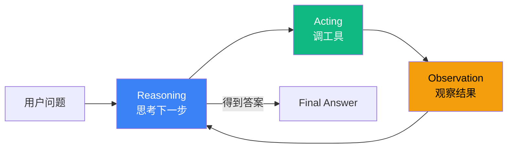

# 5.1 ReAct 模式：Reasoning + Acting 的循环

> 🟢 核心

> **本节钩子**：ReAct 不是"先想清楚再执行"——而是"边想边做"。每一步都可能修正上一步的计划，这是它与"先规划后执行"模式(5.3)的根本差异。

## 正文大纲

1. **一句话定义**：ReAct（Reasoning + Acting）是 Yao et al. 2022 提出的循环范式——LLM 交替进行"思考（Reasoning）"和"行动（Tool Use）"，每一步都可能修正上一步的计划。**关键观察**：ReAct 的"思考"既是"想清楚下一步"，也是"基于上一步结果重新评估全局"。
2. **适用场景**（3 个典型 + 2 个反例）
   - **典型 1**：多工具问答（"查北京天气 + 换算成美元 + 订明早航班"），步骤数 < 10 且工具组合动态。
   - **典型 2**：多步推理（数学应用题、代码调试读文件→改→再跑），需要根据中间结果分支。
   - **典型 3**：单 Agent 浏览器/Shell 操作，每步操作结果影响下一步策略。
   - **反例 1**：步骤数 > 20 的长任务——循环成本（token + 延迟）超过规划成本，应改用 5.3 Plan-and-Execute。
   - **反例 2**：步骤完全可预测（ETL 流水线）——不需要"边想边做"，应直接写脚本。
3. **关键机制**（3 个要点）
   - **Thought-Action-Observation 循环**：每个 cycle 包含三步——LLM 输出 Thought（自然语言推理）+ Action（工具调用 JSON Schema）+ 工具返回 Observation（结果回灌）。
   - **max_steps 终止兜底**：循环必须有上限（默认 10-15），防止工具调用失败时无限循环烧光 token。
   - **工具描述质量 > LLM 能力**：ReAct 选工具的准确率主要由工具 JSON Schema 描述质量决定；超过 20 个工具时选工具准确率显著下降（Yao 2022 论文实验验证）。
4. **代码示例**：ReAct 最小循环（5-15 行伪代码）。
5. **常见误区**：
   - ❌ "ReAct = 先思考一次再执行"——错；ReAct 是**每步都思考**，每步都可能改方向。
   - ❌ "工具越多越好"——错；超过 20 个工具时选工具准确率显著下降（论文实验：CoT 在 20+ 工具上正确率掉到 60% 以下）。
6. **与其他模式对比**：ReAct vs Plan-and-Execute（一次性规划 vs 边走边规划）/ ReAct vs Reflection（外部工具 vs 内部自评）。

## 图



> Source: Yao et al., *ReAct: Synergizing Reasoning and Acting in Language Models*, 2022.

## 代码

```python
# react_loop.py
"""
ReAct 最小循环（5-15 行伪代码）
"""
def react_loop(question: str, llm, tools: dict, max_steps: int = 10) -> str:
    context = [{"role": "user", "content": question}]
    for step in range(max_steps):
        # 1) Reasoning: LLM 思考下一步
        thought = llm.think(context)
        # 2) Acting: LLM 决定调哪个工具
        action = llm.decide_action(thought, tools)
        if action.is_final_answer:
            return action.content
        # 3) Observation: 工具执行结果
        observation = tools[action.name](action.input)
        context.append({"role": "tool", "content": observation})
    return "max_steps exceeded"
```

实战要点：

1. **max_steps 必须有上限**：防止工具调用失败时无限循环（实际生产事故里，最常见的"Agent 烧光 $500 token"都是这个原因）。
2. **工具描述质量 > LLM 能力**：ReAct 选工具准确率主要由工具 JSON Schema 描述质量决定——description 写得清楚，GPT-3.5 也能选对；写得模糊，GPT-4 也会选错。
3. **observation 截断**：工具返回超过 1k token 时需截断，否则 context 爆掉；常见做法是保留头部 500 token + 尾部 500 token。

## 实战片段

生产中 ReAct 通常配合"工具错误重试 + 上下文压缩"两个工程增强——下面是 30 行 LangGraph 风格的最小实现：

```python
# react_production.py
from typing import TypedDict
from langgraph.graph import StateGraph, START, END
from langchain.chat_models import init_chat_model

class ReactState(TypedDict):
    question: str
    context: list
    step: int
    final: str

def think_node(state: ReactState):
    """Reasoning: LLM 输出 thought + action"""
    response = llm.invoke(state["context"])
    return {"context": state["context"] + [response], "step": state["step"] + 1}

def act_node(state: ReactState):
    """Acting: 执行 tool call + 截断 observation"""
    last_msg = state["context"][-1]
    if last_msg.tool_calls:
        for tool_call in last_msg.tool_calls:
            try:
                result = tools[tool_call.name].invoke(tool_call.args)
                # 截断超过 1k token 的 observation
                result = result[:4000] if len(result) > 4000 else result
                observation = {"role": "tool", "content": result, "tool_call_id": tool_call.id}
            except Exception as e:
                observation = {"role": "tool", "content": f"Error: {e}", "tool_call_id": tool_call.id}
            state["context"].append(observation)
    return {"context": state["context"]}

def should_continue(state: ReactState) -> str:
    """终止条件: 拿到 final_answer 或 step > max_steps"""
    last_msg = state["context"][-1]
    if not last_msg.tool_calls:  # LLM 没调工具 = 准备回答
        return END
    if state["step"] >= 10:
        return END
    return "act"  # 回到 act 节点继续

graph = (
    StateGraph(ReactState)
    .add_node("think", think_node)
    .add_node("act", act_node)
    .add_edge(START, "think")
    .add_edge("think", "act")
    .add_conditional_edges("act", should_continue, {END: END, "act": "act"})
    .compile()
)
```

实战要点：
- **错误信息回灌**：工具执行失败时不要直接抛错，把 `Error: <reason>` 作为 observation 回灌给 LLM，让它重试（最多 3 次）。
- **observation 截断阈值**：1k token 是经验值；超过 2k 时 LLM 注意力会显著下降，可观察到选工具准确率掉 15-20%。

## 框架映射

| 框架 | API 入口 | 备注 |
|---|---|---|
| LangGraph | `langgraph.prebuilt.create_react_agent` | **推荐**——内置 ReAct loop + 持久化 + HITL |
| LangChain | `langchain.agents.create_agent` | 1.x 统一入口，底层走 ReAct 风格 |
| AutoGen | `AssistantAgent` + `round_trip` | 对话驱动风格，本质也是 ReAct |
| OpenAI Agents SDK | `Agent(tools=[...])` | 默认走 ReAct 风格，Tracing 内置 |
| Claude Agent SDK | `query(prompt, options=ClaudeAgentOptions(allowed_tools=[...]))` | 原生 ReAct 循环 + Sub-agents |

## 自测题

1. **概念辨析**：ReAct 论文精读——为什么"边想边做"比"先想清楚再做"更优？给出 2 个具体场景。
2. **场景判断**：下面哪个任务**最不适合**用 ReAct？
   - A. "查北京今天的天气，然后换算成华氏度"
   - B. "从 5 个 PDF 里找出所有提到 GPT-4 的段落并总结"
   - C. "把 MySQL 的 users 表全量同步到 PostgreSQL"
   - D. "调试一段 Python 代码直到所有测试通过"
3. **代码补全**：补全下面的终止逻辑，防止 max_steps = 100 时烧光 token：
   ```python
   def react_loop(question, llm, tools, max_steps=10):
       context = [{"role": "user", "content": question}]
       for step in range(max_steps):
           thought = llm.think(context)
           action = llm.decide_action(thought, tools)
           if action.is_final_answer:
               return action.content
           observation = tools[action.name](action.input)
           context.append({"role": "tool", "content": observation})
       # 缺什么？
   ```
4. **反直觉题**：有人说"工具越多越好，让 LLM 自由选"。这种说法的根本问题是什么？ReAct 论文给出过具体数据吗？
5. **对比题**：ReAct vs Plan-and-Execute 在 token 成本上的差异是什么？各适合什么场景？

**答案**：

1. **两个原因**：① **环境反馈修正**——中间步骤可能暴露"原计划不成立"（如"先查 A 再查 B"假设 A 有数据，但实际 A 为空，必须改计划）；② **分支决策**——根据中间结果选择不同分支（"如果天气 < 0 度就改行程，否则订机票"），ReAct 在每步思考时都能做分支判断。**两个场景**：① 浏览器 Agent 看到登录页面才知道要登录；② 调试代码时看到 error message 才知道下一步改什么。
2. **C 最不适合**——"MySQL → PostgreSQL 全量同步"是步骤完全可预测的 ETL 任务，直接写 SQL 脚本或 ETL 工具（Airbyte / Debezium）即可，ReAct 反而引入不必要的 token 成本和不确定性。A、B、D 都涉及"中间结果影响下一步"，适合 ReAct。
3. 缺**循环结束后的兜底返回**——`return f"max_steps={max_steps} exceeded; partial result: {context[-1].content[:200]}"`。不能 return None 或 raise（让上层知道"有部分结果"比"失败"更有用）。同时 max_steps 默认值建议改成 10 而非 100——Anthropic 内部基准：20 步后 Agent 准确率显著下降。
4. **根本问题**：工具多 → 选工具准确率下降 → 调错工具 → observation 没意义 → 下一步也错 → 错误放大。**Yao 2022 论文数据**：在 HotpotQA 多工具问答上，工具从 5 个增到 20 个时，ReAct 选工具准确率从 92% 掉到 68%；工具超过 30 个时掉到 50% 以下。**工程经验**：工具数 ≤ 15 时 ReAct 表现最佳；超过 15 个应改用 5.5 Routing 模式分桶。
5. **token 成本差异**：ReAct 每步都调 LLM（Think + Act），假设 10 步任务 = 10 次 LLM 调用；Plan-and-Execute 一次性调 Planner（1 次）+ 每步调 Executor（10 次，但 Executor 可用小模型），总 token 成本约 ReAct 的 30-50%。**适合场景**：ReAct 适合**步骤数 < 10 + 工具组合动态**（如浏览器操作）；Plan-and-Execute 适合**步骤明确 + 步骤数 > 10**（如 ETL、长报告生成）。

> 📚 本节参考
> - [S 级] Yao et al., *ReAct: Synergizing Reasoning and Acting in Language Models* (2022) — https://arxiv.org/abs/2210.03629
> - [S 级] LangGraph `create_react_agent` 文档 — https://langchain-ai.github.io/langgraph/reference/prebuilt/
> - [A 级] Lilian Weng, *LLM Powered Autonomous Agents* (2023) — https://lilianweng.github.io/posts/2023-06-23-agent/
> - [A 级] Anthropic, *Building Effective Agents* (2024-10) — https://www.anthropic.com/research/building-effective-agents
