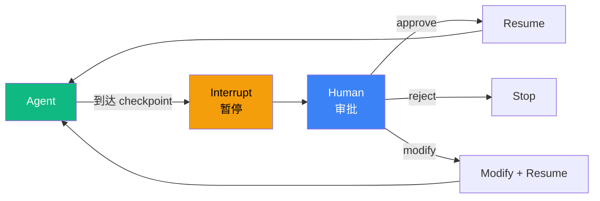

# 5.10 Human-in-the-Loop 模式：interrupt + approval

> 🟡 进阶

> **本节钩子**：HITL **不是"加 confirm 按钮"**——专业 HITL 必须设计三件事："**何时打断**"（不是每个工具都打断）、"**打断什么粒度**"（计划 / 工具调用 / 最终结果）、"**恢复上下文**"（如何把人类反馈注入 LLM）。三件缺一不可。

## 正文大纲

1. **一句话定义**：HITL 是**在关键决策点插入人工审批**——Agent 暂停（interrupt）等人类批准 / 修改 / 拒绝，再 resume 执行。**关键观察**：HITL 不是"每步都问人"（失去自动化意义），而是"**关键决策点选择性打断**"。
2. **适用场景**（3 个典型 + 2 个反例）
   - **典型 1**：高风险操作（删库 / 转账 / 发送对外邮件）—— 每个破坏性操作前必打断。
   - **典型 2**：长任务 checkpoint（多步骤报告生成）—— 每完成 N 步或到达关键节点（"即将发送邮件"）打断一次。
   - **典型 3**：合规审批（金融 / 医疗）—— 满足合规要求"人类最终决策"。
   - **反例 1**：纯只读任务（"查天气"）—— 无破坏性操作，无需 HITL。
   - **反例 2**：高频小操作（"批量重命名 1000 个文件"）—— 每次都打断反而拖慢 100 倍。
3. **关键机制**（3 个要点）
   - **LangGraph `interrupt()` 原语**——`graph.stream(..., interrupt_before=["critical_node"])` 在关键节点前自动暂停；人类审批后用 `graph.invoke(Command(resume=decision))` 恢复。
   - **Claude Agent SDK permission mode**——通过 `options.permission_mode = "default" | "acceptEdits" | "bypassPermissions"` 配置自动 / 半自动 / 跳过审批。
   - **三段式 HITL 设计**：① **何时打断**（按工具名 / 按参数值 / 按累计步骤数）② **打断粒度**（计划 / 单工具 / 最终结果）③ **恢复上下文**（人类反馈如何注入 LLM）。
4. **代码示例**：HITL 最小循环。
5. **常见误区**：
   - ❌ "HITL = 加 confirm 按钮"——错；UI 弹窗只是 HITL 的"展示层"，背后是 interrupt 机制 + 状态持久化 + 反馈注入。
   - ❌ "每个工具都打断"——错；打断太多失去自动化意义；经验法则：只对"**不可逆 + 高风险**"操作打断（删 / 改 / 发）。
6. **与其他模式对比**：HITL vs Tool Use（人类是"决策者"而非"工具"）/ HITL vs Routing（人类是"路由者"而非"被路由项"）/ HITL vs 5.8 Evaluator-Optimizer（人类是"最终裁判"而非"算法裁判"）。

## 图



> Source: LangGraph `interrupt()` 文档; Claude Agent SDK permission mode 文档.

## 代码

```python
# hitl_pattern.py
"""
HITL 最小循环（伪代码）
"""
def hitl_loop(agent_input, interrupt_points: list[str]) -> str:
    state = agent.run_until_interrupt(agent_input)
    while True:
        if state.is_final:
            return state.output
        # 1) 何时打断: 到达 interrupt_points 之一
        if state.current_node in interrupt_points:
            # 2) 打断粒度: 展示"待执行动作"给人类
            human_decision = get_human_approval(
                action=state.pending_action,
                context=state.context_summary,
            )
            if human_decision == "reject":
                return "rejected by human"
            # 3) 恢复上下文: 把人类反馈注入 LLM
            state = agent.resume(state, human_feedback=human_decision)
        else:
            state = agent.continue_run(state)
```

实战要点：

1. **何时打断**——按"工具名 + 参数值"双过滤，例如"调 `send_email` 且 `to` 包含外部域名"才打断；不要"所有 send_email 都打断"。
2. **打断粒度**——粒度越细越安全但越慢，粒度越粗越快但风险高；推荐"计划粒度"（执行前审批整个计划）+ "关键工具粒度"（不可逆操作审批），而非"每个工具审批"。
3. **恢复上下文**——人类反馈（"修改收件人为 xxx"）必须作为 message 注入 LLM，让 LLM 知道"按修改后的计划继续"；直接修改 state 字段会让 LLM 困惑。

## 实战片段

生产 HITL 经常用 LangGraph `interrupt()` 原语 + Checkpointer 实现"长任务可中断可恢复"——下面是 50 行实现：

```python
# hitl_production.py
from typing import TypedDict
from langgraph.graph import StateGraph, START, END
from langgraph.checkpoint.postgres import PostgresSaver
from langgraph.types import interrupt, Command

class HITLState(TypedDict):
    user_input: str
    plan: list[str]
    current_step: int
    final: str

# ========== 1. 计划节点(执行前审批整个计划) ==========
def plan_node(state: HITLState):
    """Planner 生成完整计划,人工审批后才能执行"""
    plan = planner_llm.invoke(f"任务:{state['user_input']}\n生成 3-5 步计划").content.split("\n")
    # ============ HITL: 计划粒度打断 ============
    decision = interrupt({
        "type": "plan_approval",
        "plan": plan,
        "prompt": "是否批准此计划?",
    })
    if decision == "reject":
        return {"final": "rejected by human"}
    # 人类批准后,继续执行
    return {"plan": plan, "current_step": 0}

# ========== 2. 执行节点(关键工具粒度打断) ==========
CRITICAL_TOOLS = {"send_email", "delete_file", "transfer_money"}

def execute_node(state: HITLState):
    """Executor 执行当前步骤;关键工具前再打断"""
    step = state["plan"][state["current_step"]]
    result = executor_llm.invoke(f"执行:{step}").content
    # 解析 tool_call
    if has_critical_tool_call(result, CRITICAL_TOOLS):
        # ============ HITL: 工具粒度打断 ============
        decision = interrupt({
            "type": "tool_approval",
            "tool_call": result.tool_call,
            "prompt": f"即将执行关键操作 {result.tool_call.name},批准吗?",
        })
        if decision == "reject":
            return {"final": "rejected at critical tool"}
    return {"current_step": state["current_step"] + 1}

# ========== 3. 图组装 ==========
checkpointer = PostgresSaver.from_conn_string("postgresql://localhost/agent")
graph = (
    StateGraph(HITLState)
    .add_node("plan", plan_node)
    .add_node("execute", execute_node)
    .add_edge(START, "plan")
    .add_edge("plan", "execute")
    .add_conditional_edges("execute", lambda s: END if s["current_step"] >= len(s["plan"]) else "execute")
    .compile(
        checkpointer=checkpointer,
        interrupt_before=["execute"],  # 在 execute 节点前也可打断
    )
)

# ========== 4. 第一次调用(到 interrupt 后挂起) ==========
config = {"configurable": {"thread_id": "user-123"}}
result = graph.invoke({"user_input": "给客户发邮件"}, config=config)
# 程序暂停,等待人类决策

# ========== 5. 人类审批后恢复(异步) ============
# decision = "approve"  # 来自前端 UI
# result = graph.invoke(Command(resume=decision), config=config)
```

实战要点：
- **Checkpointer 必加**——HITL 任务经常跨小时；没有 checkpointer 进程重启就丢失状态；用 `PostgresSaver` 持久化到数据库。
- **interrupt() 返回值 = 人类决策**——`decision = interrupt({...})` 时程序挂起；人类通过 UI 提交 `Command(resume=decision)` 恢复，decision 注入 interrupt() 调用的返回值。
- **打断粒度按风险分层**——计划粒度（低风险任务）/ 关键工具粒度（中风险）/ 每个工具粒度（高风险 / 合规要求）；不要"一刀切"。

## 框架映射

| 框架 | API 入口 | 备注 |
|---|---|---|
| LangGraph | `interrupt()` + `Command(resume=...)` | **推荐**——原生支持 + Checkpointer 持久化 |
| Claude Agent SDK | `options.permission_mode = "default"` | 原生 permission 系统 + 工具级别审批 |
| OpenAI Agents SDK | `Agent(handoffs=[...])` + 外部审批 | 需手动实现 interrupt 机制 |
| AutoGen | `UserProxyAgent` + 人类输入 | 对话式 HITL |
| CrewAI | `human_input=True` on Task | 任务粒度 HITL |

## 自测题

1. **概念辨析**：HITL 与"加 confirm 按钮"的本质差异是什么？专业 HITL 必须设计哪三件事？
2. **场景判断**：下面哪个任务**最需要** HITL？
   - A. "查今天北京天气"
   - B. "批量重命名 1000 个文件"
   - C. "给客户发合同邮件"
   - D. "回答一个 Python 语法问题"
3. **代码补全**：补全下面 interrupt() 调用和恢复逻辑：
   ```python
   def plan_node(state):
       plan = planner_llm.invoke(...)
       decision = ???  # 缺什么?
       if decision == "reject":
           return {"final": "rejected"}
       return {"plan": plan}
   ```
4. **反直觉题**：有人说"HITL 越安全越好,每个工具都打断"。这种说法的根本问题是什么？生产中如何平衡"安全"和"自动化效率"？
5. **对比题**：HITL vs 5.8 Evaluator-Optimizer 在"决策者"上的差异是什么？各适合什么场景？

**答案**：

1. **本质差异**：UI confirm 按钮是"展示层"，HITL 是"**状态机 + 持久化 + 反馈注入**"的完整机制。**三件事**：① **何时打断**（不是每个工具都打断，按风险选择性打断）；② **打断粒度**（计划 / 工具调用 / 最终结果，粗细决定安全 vs 效率权衡）；③ **恢复上下文**（人类反馈如何注入 LLM，让 LLM 理解"按修改后的计划继续"）。
2. **C 最需要**——"给客户发合同邮件"是高风险对外操作（一旦发出无法撤回、影响公司形象、客户可能误解），必须 HITL 审批。A 无风险、B 高频但低风险、D 纯只读，都不需要 HITL。
3. ```python
   decision = interrupt({
       "type": "plan_approval",
       "plan": plan,
       "prompt": "是否批准此计划?",
   })
   ```
   关键：① `interrupt(...)` 挂起程序并把信息展示给人类；② 返回值 = 人类决策（`approve` / `reject` / 修改内容）；③ 人类通过 `Command(resume=decision)` 异步恢复。
4. **根本问题**：① **失去自动化意义**——每个工具都打断等于"半自动 + 半手动"，用户每次操作都被打断 100 次；② **打断疲劳**——用户对每次打断麻木，反而降低警惕（"全部 approve"）；③ **效率骤降**——`"批量重命名 1000 个文件" + 每个工具打断` = 用户点击 1000 次 approve，比纯手动还慢。**生产平衡**：① **风险分层**——破坏性操作（删 / 改 / 发）必打断，只读操作不打断；② **工具白名单**——只对 `CRITICAL_TOOLS = {"send_email", "delete_file", "transfer_money"}` 打断；③ **批处理**——"1000 个文件重命名"用 `Human-in-the-loop at plan level` 而非每个文件级打断。
5. **决策者差异**：HITL 的决策者是"**人类**"（带来业务理解 / 责任承担 / 合规追溯）；Evaluator-Optimizer 的决策者是"**算法 / LLM**"（带来规模化 / 一致性 / 速度）。**场景**：HITL 适合"**高风险 + 需要责任承担 + 合规要求**"（转账 / 删库 / 对外发函）；Evaluator-Optimizer 适合"**质量可算法化 + 规模化**"（翻译质量 / 代码可运行性 / 报告合规性自动检查）。

> 📚 本节参考
> - [S 级] LangGraph `interrupt()` 文档 — https://langchain-ai.github.io/langgraph/concepts/human_in_the_loop/
> - [S 级] LangGraph GitHub README — https://github.com/langchain-ai/langgraph
> - [S 级] Claude Agent SDK Permission Mode — https://docs.anthropic.com/en/docs/build-with-claude/agent-sdk/overview
> - [S 级] Anthropic, *Building Effective Agents* (2024-10) — https://www.anthropic.com/research/building-effective-agents
> - 本地参考: L4.3 LangGraph 状态机与持久化 — `handbook/l4-framework/4.3-langgraph-state-persistence-hitl.md`
