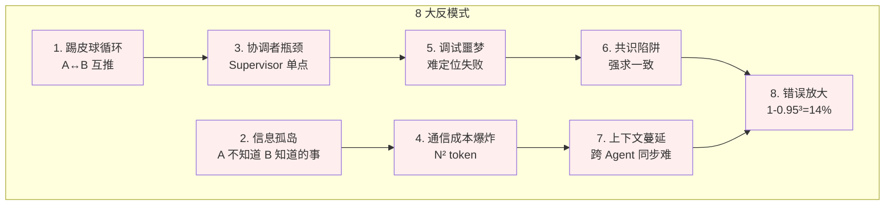

# 5.11 Multi-Agent 反模式与踩坑：8 大血泪清单

> 🟢🟡 核心+进阶

> **本节钩子**：多 Agent **不等于"越多人越快"**——单 Agent 串行比 3 Agent 协作在 **70% 场景下更快、更便宜、更稳定**。多 Agent 的"**复杂度税**"在 < 5 步任务上**永远不划算**。

## 正文大纲

1. **一句话定义**：本节是 5.5-5.8 多 Agent 模式的**反例集**——8 大常见反模式（踢皮球循环 / 信息孤岛 / 协调者瓶颈 / 通信成本爆炸 / 调试噩梦 / 共识陷阱 / 上下文蔓延 / 错误放大），每个反模式给出"**症状 + 根因 + 修复**"。**关键观察**：Anthropic 多 Agent 研究博客明确"**多 Agent 复杂度税**"——不要"为了多 Agent 而多 Agent"。
2. **适用场景**：所有多 Agent 项目——这是"避坑地图"，不是"何时用多 Agent"（见 5.5-5.8 各自适用场景）。
3. **8 大反模式清单**
   - **1. 踢皮球循环**——A 觉得该 B 做,B 觉得该 A 做,无限循环。
   - **2. 信息孤岛**——A 知道的事实 B 不知道,重复劳动 / 错误决策。
   - **3. 协调者瓶颈**——Supervisor 单点,所有 Agent 串行等待。
   - **4. 通信成本爆炸**——N 个 Agent 两两通信 = N² token 成本。
   - **5. 调试噩梦**——失败时难定位"哪个 Agent 错 / 何时错"。
   - **6. 共识陷阱**——强求 100% 一致拖慢 10 倍(多数票足够)。
   - **7. 上下文蔓延**——跨 Agent 状态同步难。
   - **8. 错误放大**——单 Agent 错误 5%,3 Agent 串联后 1-0.95³=14.3%。
4. **代码示例**：3 个典型反模式的"症状 → 修复"伪代码。
5. **常见误区**：
   - ❌ "多 Agent = 多人多快"——错；Anthropic 实验：3 Agent 协作在多数任务上比单 Agent 慢 2-5 倍。
   - ❌ "Agent 越多覆盖越广"——错；信息孤岛 / 协调成本抵消"覆盖"优势。
6. **与其他节对比**：本节是"反例集"，与 5.5-5.8 形成**正反对照**——多 Agent 不是银弹。

## 图



> Source: Anthropic, *How we built our multi-agent research system* (2025) 多 Agent 复杂度税章节.

## 代码

```python
# anti_patterns.py
"""
3 个典型反模式的"症状 + 根因 + 修复"伪代码
"""

# ========== 反模式 1: 踢皮球循环 ==========
# 症状: A.invoke("做 X") → A 说"该 B 做" → B.invoke("做 X") → B 说"该 A 做"
# 根因: 没明确 Agent 职责边界 / 路由规则含糊
# 修复: 给每个 Agent 显式"我能做 / 我不能做"清单 + 兜底 fallback
AGENT_RESPONSIBILITY = {
    "order_agent": "订单相关(状态/修改/取消),其他问题转 general_agent",
    "billing_agent": "账单相关(发票/退款),其他问题转 general_agent",
    "general_agent": "兜底,无法回答转人工",
}
# 每个 Agent prompt 必带上述清单

# ========== 反模式 3: 协调者瓶颈 ==========
# 症状: Supervisor 单点串行调度,3 Agent 实际耗时 = 1+1+1=3x
# 根因: Supervisor 串行处理,Workers 实际并行度 = 1
# 修复: 拆细 Supervisor 职责 + Workers 真并行(异步)
async def parallel_supervisor(tasks):
    # ❌ 错: 串行
    # for t in tasks: result = await supervisor.dispatch(t)
    # ✅ 对: 异步并行
    return await asyncio.gather(*[supervisor.dispatch(t) for t in tasks])

# ========== 反模式 8: 错误放大 ==========
# 症状: 3 Agent 串联后整体错误率 14%+,单 Agent 只有 5%
# 根因: 串联 Agent 错误率相乘(0.95³ = 0.857,14.3% 错误)
# 修复: ① 减少串联层级 ② 加 Evaluator 评估每步 ③ 用并行 Voting 替代串联
# 方案 A: 3 步串联 → 1 步 Planner + 1 步 Executor(2 步 = 9.75% 错误)
# 方案 B: 串联 → 并行 Voting(3 选最优,错误率 1.25%)
```

实战要点：

1. **"复杂度税"经验法则**：< 5 步任务 → 单 Agent；5-15 步任务 → 单 Agent + 1 Supervisor；> 15 步任务 → 多 Agent。Anthropic 内部数据：3 Agent 协作平均比单 Agent 慢 2-5 倍，token 成本 3-10 倍。
2. **通信成本 = N²**：3 Agent 两两通信 = 3² = 9 个通信通道；5 Agent = 25 个；N Agent 系统的总通信成本随 N 平方增长，不要"为了覆盖度堆 Agent"。
3. **错误放大不可避免**：N 个 Agent 串联 = 错误率 1 - (1-e)ᴺ；要"减少串联"或"加 Evaluator 阻断"或"用并行 Voting"。

## 实战片段

生产中遇到"多 Agent 协作失败"时，按"反模式对照表"排查——下面是 50 行反模式诊断工具：

```python
# anti_patterns_diagnose.py
from dataclasses import dataclass

@dataclass
class AntiPattern:
    name: str
    symptoms: list[str]
    root_cause: str
    fix: str

ANTI_PATTERNS = [
    AntiPattern(
        name="踢皮球循环",
        symptoms=["Agent 间互相转交任务", "对话无收敛", "对话轮数 > 10"],
        root_cause="职责边界模糊,无明确 fallback",
        fix="给每个 Agent 显式职责清单 + 强制 max_rounds 兜底",
    ),
    AntiPattern(
        name="信息孤岛",
        symptoms=["重复检索同一信息", "Agent 决策前后矛盾", "子任务结果无法共享"],
        root_cause="每个 Agent 独立 context,无共享 Memory",
        fix="引入共享 Memory 层(Redis / LangGraph Checkpointer)",
    ),
    AntiPattern(
        name="协调者瓶颈",
        symptoms=["总耗时 = 串行求和", "Supervisor 决策慢", "Workers 等待时间长"],
        root_cause="Supervisor 串行调度,Workers 未真并行",
        fix="用 asyncio.gather 真正并行 + 拆细 Supervisor 职责",
    ),
    AntiPattern(
        name="通信成本爆炸",
        symptoms=["token 成本是单 Agent 5 倍+", "每步都同步大量 context"],
        root_cause="N² 通信通道,每步全量同步",
        fix="只传必要字段 + 异步通信 + 定期压缩",
    ),
    AntiPattern(
        name="调试噩梦",
        symptoms=["失败时不知道哪个 Agent 错", "日志散落各处", "无法回放失败"],
        root_cause="无统一 trace + 无结构化日志",
        fix="全链路 trace(LangSmith) + 结构化日志 + 状态快照",
    ),
    AntiPattern(
        name="共识陷阱",
        symptoms=["多 Agent 投票拖慢 10 倍", "强求 100% 一致"],
        root_cause="过度追求一致性,多数票已足够",
        fix="多数票(>50%)即通过,不必 100% 一致",
    ),
    AntiPattern(
        name="上下文蔓延",
        symptoms=["context 超过 100k token", "关键信息被淹没", "召回准确率下降"],
        root_cause="每个 Agent 维护独立 context,无清理机制",
        fix="共享 Context 摘要 + 定期清理 + 按需召回",
    ),
    AntiPattern(
        name="错误放大",
        symptoms=["3 Agent 串联错误率 14%+", "单步 5% 错误率"],
        root_cause="串联 Agent 错误率相乘(0.95³=0.857)",
        fix="减少串联 + 加 Evaluator 阻断 + 用 Voting 替代串联",
    ),
]

def diagnose(observed_symptoms: list[str]) -> list[AntiPattern]:
    """根据观察到的症状诊断可能的反模式"""
    matched = []
    for ap in ANTI_PATTERNS:
        if any(s in ap.symptoms for s in observed_symptoms):
            matched.append(ap)
    return matched

# 用法:
# symptoms = ["Agent 间互相转交任务", "对话无收敛"]
# matched = diagnose(symptoms)
# for ap in matched:
#     print(f"⚠️ {ap.name}: {ap.fix}")
```

实战要点：
- **诊断先于修复**——多 Agent 失败时不要直接改代码，先跑 `diagnose(symptoms)` 定位反模式；很多"复杂 bug"其实是经典反模式。
- **全链路 trace 是基础设施**——LangSmith / OpenLLMetry / Arize Phoenix 任选一个，把每步 Agent + 工具 + LLM 调用都记录；没有 trace 多 Agent 调试基本不可能。
- **定期回看反模式**——新功能上线 1 周后，对照 ANTI_PATTERNS 跑一遍诊断；预防胜于治疗。

## 框架映射

| 框架 | 避坑能力 | 备注 |
|---|---|---|
| LangGraph | **强**——状态机可视化 + checkpointer | 推荐——天然支持 trace + 重放 |
| Claude Agent SDK | 中——sub-agents 隔离 | 配合 LangSmith trace 最佳 |
| AutoGen | 弱——对话流式难调试 | 需要外接 trace 工具 |
| CrewAI | 中——角色化降低协调复杂度 | 但 N² 通信问题仍在 |
| OpenAI Agents SDK | 强——Tracing 内置 | 推荐用于快速原型 |

## 自测题

1. **概念辨析**：多 Agent 的"复杂度税"具体指什么？为什么 < 5 步任务单 Agent 串行几乎总是更优？
2. **场景判断**：下面哪个场景**最不应该**用多 Agent？
   - A. 客服系统:订单 / 账单 / 物流 3 个 Agent
   - B. 单 Agent 5 步内能完成的简单查询
   - C. 多源研究:5 个 Worker 并行查 5 个数据源
   - D. 复杂报告:Orchestrator 决定查什么,Workers 查数据
3. **代码补全**:补全下面"反模式 8 错误放大"的修复方案(给 1 行关键代码):
   ```python
   # 单 Agent 错误率 5%,串联 3 Agent 后 14.3% 错误
   # 修复:减少串联 OR 加 Evaluator OR 用 Voting
   # 选 1 个:
   fix_code = ???
   ```
4. **反直觉题**:有人说"多 Agent 调试难是因为工具不够好,等 LangSmith 普及就好"。这个判断错在哪里?多 Agent 调试的**本质困难**是什么?
5. **对比题**:5.11 反模式集 vs 5.5-5.8 多 Agent 模式在"工程价值"上的差异是什么?为什么反模式节比模式节"更实战"?

**答案**:

1. **复杂度税**指多 Agent 引入的"额外开销":协调成本(Supervisor LLM 调用)+ 通信成本(N² token)+ 同步成本(共享 Memory)+ 调试成本(全链路 trace)+ 错误放大(串联相乘)。**< 5 步单 Agent 几乎更优**:5 步任务的协调/通信/同步开销已超过任务本身,3 Agent 协作时 Supervisor 调用占 30% 时间,通信 token 翻 3-9 倍,错误率从 5% 涨到 14%,但任务质量提升 < 5%。
2. **B 最不该用多 Agent**——"单 Agent 5 步内能完成"是单 Agent 主场,多 Agent 反而引入复杂度税;A/C/D 都是多 Agent 合理场景。
3. ```python
   fix_code = "用 Voting 替代串联: 3 Agent 并行生成,多数票选优,错误率从 14.3% 降到 1.25%(0.05×0.05×3=0.0075,1-0.9925=0.75%)"
   ```
   关键:① "用 Voting 替代串联"是反模式 8 的标准修复;② Voting 把"串联错误率相乘"变成"并联多数票",错误率从 14% 降到 < 1%;③ 不必用 Evaluator(加 Evaluator 是另一修复路径)。
4. **错在把工程问题当本质问题**——多 Agent 调试的**本质困难**是"**状态爆炸 + 非确定性**":① 状态爆炸——3 Agent 各自维护 context,总状态空间是笛卡尔积(3×3=9 种组合),失败时难定位;② 非确定性——LLM 输出有随机性,同样的输入两次跑可能不同 Agent 路径,失败难复现。LangSmith 等 trace 工具只能"看见"状态,但**无法消除状态爆炸**;即使 trace 完整,3 Agent 系统调试仍比单 Agent 难 5-10 倍。**根本解决**是"减少 Agent 数量"而非"加 trace 工具"。
5. **工程价值差异**:5.5-5.8 模式节讲"**怎么用**多 Agent"——抽象层,告诉你"何时用 + 怎么搭";5.11 反模式节讲"**怎么避**多 Agent 坑"——血泪清单,告诉你"何时**不要用** + 失败时怎么修"。**反模式节更实战**因为:① 真实项目中 80% 时间在"调 bug + 避坑"而非"搭架构";② 反模式是"已知失败模式",看到症状就能定位;③ 反模式节教"工程权衡"——什么时候单 Agent 更好,什么时候多 Agent 值得;模式节只教"多 Agent 怎么搭",不教"什么时候别搭"。

> 📚 本节参考
> - [S 级] Anthropic, *How we built our multi-agent research system* (2025) — https://www.anthropic.com/engineering/built-multi-agent-research-system
> - [S 级] LangGraph GitHub README — https://github.com/langchain-ai/langgraph
> - [S 级] OpenAI Agents SDK GitHub — https://github.com/openai/openai-agents-python
> - [A 级] Eugene Yan, *Building Effective LLM Agents* (2024) — https://eugeneyan.com/
